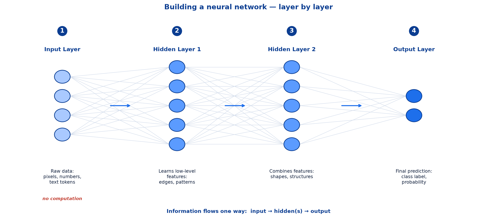
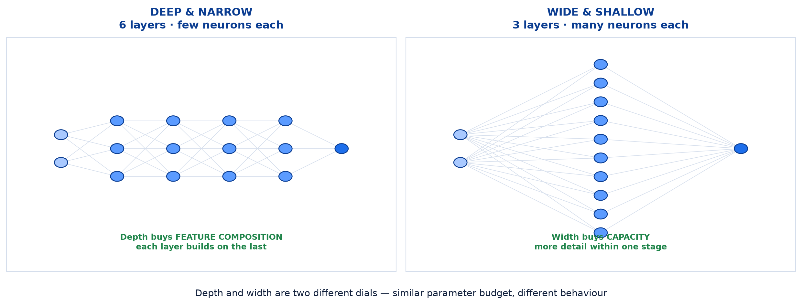
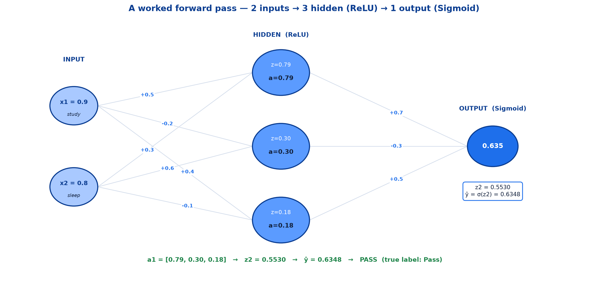
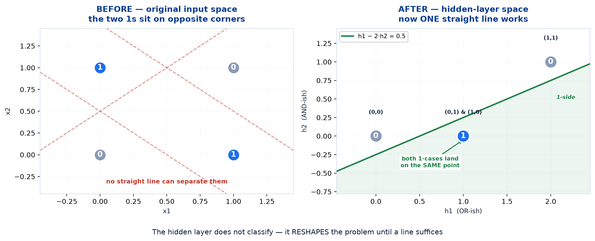
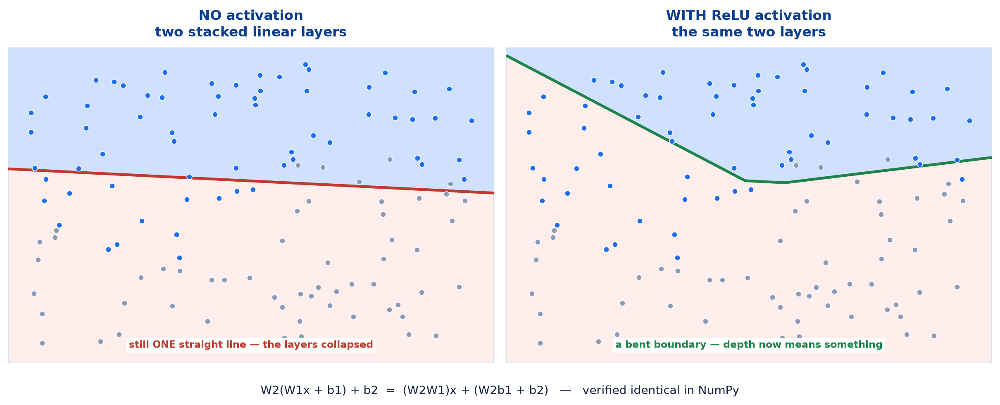

# <span style="color:#0B3D91">Artificial Neural Networks &amp; Forward Propagation</span>

> Study notes on how single neurons become a **network**, and how data flows through it to
> produce a prediction:
> **What an ANN is** → **Layers** → **Depth &amp; width** → **Forward propagation** →
> **A worked forward pass** → **Why layers solve XOR** → **Why activations are mandatory**.
> The previous note ended with a problem — one neuron draws one line, and one line cannot solve
> XOR. This note is the solution.
>
> **A note on formulas:** equations are written in plain text inside code blocks rather than
> LaTeX, so they render correctly in any Markdown viewer.

---

## <span style="color:#1E6FEB">Table of Contents</span>

1. [What is an Artificial Neural Network?](#1-what-is-an-artificial-neural-network)
2. [Building a Network — Layer by Layer](#2-building-a-network--layer-by-layer)
3. [Depth and Width](#3-depth-and-width)
4. [Forward Propagation](#4-forward-propagation)
5. [A Worked Forward Pass](#5-a-worked-forward-pass)
6. [Why Layers Solve XOR](#6-why-layers-solve-xor)
7. [Why Activations Are Mandatory](#7-why-activations-are-mandatory)

---

## <span style="color:#1E6FEB">1. What is an Artificial Neural Network?</span>

### 1.1 Overview / What is it?

> An **Artificial Neural Network (ANN)** is a computational model inspired by the human brain,
> consisting of **interconnected artificial neurons** that process and learn from data. These
> neurons are organised into **input, hidden, and output layers**, enabling the network to
> identify complex patterns and make predictions.

**Key characteristics:**

- Consists of **Input, Hidden, and Output Layers**
- **Learns relationships** between input features and outputs
- Suitable for **structured / tabular data**

**Common applications:** customer churn prediction, loan approval, sales forecasting, house
price prediction.

> **Key Takeaway** — ANN is the foundation of all modern neural network architectures.

### 1.2 Why does it matter for AI?

The previous note closed on an unresolved problem: a single neuron computes one weighted sum and
therefore draws exactly **one straight line**. That is not a small limitation — it means a single
neuron cannot learn XOR, one of the simplest non-trivial functions there is.

The fix is not a cleverer neuron. It is **more of them, arranged in layers**. Everything that
follows in this module — CNN, RNN, LSTM — is an ANN with specialised layer types substituted in,
so this structure has to land properly before the rest makes sense.

### 1.3 Key Concepts — interconnected, not just numerous

Two networks can have the same neuron count and behave completely differently, because what
matters is **how they are wired**:

```
Every neuron in a layer receives EVERY output from the previous layer.
Every neuron in a layer sends its output to EVERY neuron in the next.
```

This arrangement is called a **fully connected** or **dense** layer, and it is the default for a
plain ANN. Two consequences worth noticing straight away:

- **No connections within a layer.** Neurons in the same layer never talk to each other.
- **No connections backwards.** Data moves in one direction only, which is why this is also
  called a *feedforward* network.

### 1.4 Simple Example — counting the connections

A network with 2 inputs, 3 hidden neurons and 1 output:

```
input -> hidden :  2 x 3 = 6 weights,  plus 3 biases
hidden -> output:  3 x 1 = 3 weights,  plus 1 bias
                            ---------------------
                            9 weights + 4 biases = 13 parameters
```

Thirteen numbers. Every one of them starts as a random guess and gets corrected by training.
Scale that up: a modest network with 784 inputs, two hidden layers of 256 and 128, and 10
outputs has over **235,000** parameters — all learned, none hand-set.

### 1.5 How it works — why "structured/tabular data"

A plain ANN treats its inputs as an **unordered list of numbers**. It has no built-in notion that
input 5 is adjacent to input 6, or that input 3 came before input 4 in time.

```
ANN sees:  [0.8, 0.3, 1.2, 0.9]     <- just four numbers, no relationship assumed
```

For a table of customer attributes — age, income, tenure, balance — that is exactly right.
Those columns have no natural order or adjacency.

For an **image**, it is wasteful: neighbouring pixels are strongly related, and the ANN has to
learn that from scratch. For a **sentence**, it is worse: word order carries meaning the ANN
cannot represent.

> That gap is precisely what CNNs and RNNs were invented to fill — a later topic. The ANN is the
> right tool when the features genuinely are an unordered list.

### 1.6 Practical Example / Use Case

| Application | Inputs | Output |
|---|---|---|
| **Customer churn prediction** | Tenure, monthly spend, support tickets, plan type | Probability the customer leaves |
| **Loan approval** | Income, employment years, existing debt, credit score | Approve / decline |
| **Sales forecasting** | Season, price, promotion flag, store size | Predicted units sold |
| **House price prediction** | Size, rooms, age, location score | Predicted price |

Every one of these is a **row in a spreadsheet** — which is the signature of a good ANN problem.

### 1.7 Key Takeaways

> - An **ANN** is interconnected artificial neurons organised into **input, hidden and output
>   layers**.
> - Layers are **fully connected**: every neuron receives from all of the previous layer and
>   sends to all of the next.
> - **No connections within a layer, and none backwards** — data flows one way (*feedforward*).
> - A 2→3→1 network has **13 parameters**; real networks have thousands to billions.
> - ANNs treat inputs as an **unordered list**, which suits **structured/tabular data** and
>   wastes effort on images and sequences.
> - **ANN is the foundation** — CNN, RNN and LSTM are all variations on it.

---

## <span style="color:#1E6FEB">2. Building a Network — Layer by Layer</span>

### 2.1 Overview / What is it?

Four layer roles, each with a distinct job:



| # | Layer | Holds | Job |
|---|---|---|---|
| **1** | **Input Layer** | Raw data: pixels, numbers, text tokens | Receives features — **does no computation** |
| **2** | **Hidden Layer 1** | Learns **low-level features**: edges, patterns | First transformation |
| **3** | **Hidden Layer 2** | **Combines features**: shapes, structures | Builds on layer 1's output |
| **4** | **Output Layer** | Final prediction: class label, probability | Produces the answer |

```
[Input]  →  [Hidden 1]   →  [Hidden 2]    →  [Output]
 raw        edges,          shapes,          class label,
 data       patterns        structures       probability
```

### 2.2 Why does it matter for AI?

This progression — **raw data → simple features → combined features → answer** — is the entire
mechanism behind "automatic feature learning". It is worth being able to recite, because it
explains why depth helps rather than just asserting that it does.

### 2.3 Key Concepts — the input layer computes nothing

> **Worth knowing (a common trip-up):** the input layer has **no weights, no bias and no
> activation**. It is a holding pen for your feature vector. Drawing it as circles makes it look
> like the others, but nothing happens there.

This leads directly to a naming ambiguity that causes real confusion:

```
A network drawn as:  Input -> Hidden -> Hidden -> Output

  "4 layers"  if you count the input layer
  "3 layers"  if you count only computing layers   <- the usual convention
  "2 hidden layers"                                <- the least ambiguous phrasing
```

**Say "two hidden layers" and nobody can misunderstand you.** Frameworks agree with this: a Keras
model with two `Dense` hidden layers and one `Dense` output layer reports three layers, not four.

### 2.4 Simple Example — why "hidden"?

Nothing mysterious. It means **unobserved**.

```
Input  values  ->  you provide them          -> observed
Hidden values  ->  the network invents them  -> NEVER compared to anything in your data
Output values  ->  you compare to the truth  -> observed
```

Your dataset has a column for every input and a column for the answer. It has **no column** for
what hidden neuron 2 should have produced. Those values are internal scratch work, and no part of
training tells them directly what to be — they are shaped only indirectly, by whether the final
answer came out right.

### 2.5 How it works — features building on features

Each layer transforms the output of the one before it, so complexity accumulates in stages:

```
raw pixels  ->  edges  ->  corners & textures  ->  shapes  ->  objects  ->  "cat"
  input        layer 1        layer 2           layer 3    layer 4      output
```

No single layer is clever. Layer 3 can find shapes **only because** layer 2 handed it corners and
textures to work with. Remove layer 2 and layer 3 would have to build shapes directly from
pixels — a much harder job.

This is **composition**, and it is the whole argument for depth.

### 2.6 Practical Example / Use Case — choosing the output layer

The output layer is the one whose size and activation are **not** a free choice — the task
dictates them:

| Task | Output neurons | Activation |
|---|---|---|
| **Regression** (house price) | 1 | **Linear** |
| **Binary classification** (pass/fail) | 1 | **Sigmoid** |
| **Multi-class classification** (10 digits) | **one per class** (10) | **Softmax** |

Hidden layers are where judgement applies — how many, how wide. The output layer is determined by
what you are predicting.

### 2.7 Key Takeaways

> - Four roles: **input** (receive), **hidden 1** (low-level features), **hidden 2** (combine
>   them), **output** (predict).
> - The **input layer does no computation** — no weights, no bias, no activation.
> - **"Hidden" means unobserved** — your data never says what those values should be.
> - Say **"two hidden layers"** rather than "three layers" to avoid the counting ambiguity.
> - Depth works by **composition**: each layer builds on features the previous one produced.
> - The **output layer is dictated by the task**; hidden layers are the design choice.

---

## <span style="color:#1E6FEB">3. Depth and Width</span>

### 3.1 Overview / What is it?

Two independent dials that describe any network's shape:

```
DEPTH  = how many LAYERS             (how many stages of transformation)
WIDTH  = how many NEURONS per layer  (how much capacity at each stage)
```



### 3.2 Why does it matter for AI?

These are the first two architectural decisions you make on any new problem, and they are
genuinely different levers — not two ways of saying "bigger".

### 3.3 Key Concepts — what each one buys

| | **Depth** (more layers) | **Width** (more neurons per layer) |
|---|---|---|
| **Buys** | **Feature composition** — stages of abstraction | **Capacity** — more detail within one stage |
| **Good for** | Hierarchical data (images, language) | Many independent input features |
| **Risk** | Harder to train; gradients degrade | Grows parameters fast; overfits |

**Depth is usually the more powerful lever** for the kinds of data deep learning targets, because
real-world structure tends to be hierarchical — pixels make edges make shapes make objects. A
wide, shallow network has to represent that entire hierarchy in one step.

That preference is why the field is called *deep* learning and not *wide* learning.

### 3.4 Simple Example — same budget, different shape

```
DEEP & NARROW              WIDE & SHALLOW
 o                          o o o o o o o o
 o                          o o o o o o o o
 o
 o                          2 layers × 8 neurons
 o
 6 layers × 1-3 neurons
```

Similar parameter counts, very different behaviour. The deep one can build a five-stage feature
hierarchy but has little capacity at each stage. The wide one has plenty of capacity but only one
transformation to apply it in.

### 3.5 How it works — a starting point, not a rule

> **Worth knowing (not prescribed in the session):** there is no formula for choosing these. A
> reasonable starting point for tabular data:

```
Hidden layers :  1 to 3     (start with 1; add only if underfitting)
Width         :  somewhere between the input size and the output size
                 e.g. 4 inputs -> 16 -> 8 -> 3 outputs
Shape         :  a funnel -- each layer narrower than the last
```

The funnel shape is a common convention: wide early layers capture many raw combinations, and
progressively narrower layers distil them toward the answer.

**Then tune empirically.** Network shape is a hyperparameter like any other, and the honest way to
choose it is to try a few and cross-validate.

### 3.6 Practical Example / Use Case — bigger is not automatically better

More layers and more neurons mean more parameters, and more parameters mean **more capacity to
memorise the training data**.

```
Small network on a big dataset  ->  may UNDERFIT (too little capacity)
Big network on a small dataset  ->  will OVERFIT (memorises instead of learning)
```

This is exactly the bias-variance trade-off from the earlier machine learning notes, and it has
not gone away just because the model is a neural network. Start small, grow only when the
training error itself is unacceptable.

### 3.7 Key Takeaways

> - **Depth** = number of layers; **width** = neurons per layer. Two different dials.
> - **Depth buys feature composition**; **width buys capacity within a stage**.
> - Depth usually wins for **hierarchical data** — hence "*deep* learning".
> - A sensible start for tabular data: **1–3 hidden layers** in a narrowing **funnel** shape.
> - Network shape is a **hyperparameter** — tune it, do not guess once.
> - **Bigger is not better**: too much capacity overfits, exactly as in classic ML.

---

## <span style="color:#1E6FEB">4. Forward Propagation</span>

### 4.1 Overview / What is it?

> **Forward propagation** is the process of passing input data through the neural network to
> generate predictions.

- Each neuron computes a **weighted sum** of inputs and applies an **activation function**
- Information flows from the **input layer → hidden layer(s) → output layer**
- The final output represents the model's **prediction**
- It is used to **calculate the error (loss)** by comparing predictions with actual values

### 4.2 Why does it matter for AI?

That final bullet is the one to hold onto. Forward propagation is not only how a trained network
**predicts** — it is also the first half of how an untrained network **learns**. You cannot
compute an error until you have produced a prediction to be wrong about.

```
Forward pass  ->  prediction  ->  compare to truth  ->  loss  ->  (backward pass)
```

Every single training step begins here.

### 4.3 Key Concepts — one neuron's two steps, done in bulk

The previous note established that a neuron does `z = Σwᵢxᵢ + b`, then `ŷ = f(z)`. Forward
propagation is that, for a whole layer at a time:

```
z = W a + b         weighted sums for EVERY neuron in the layer at once
a = f(z)            activation applied elementwise
```

Chained across a network with two hidden layers:

```
a⁰ = x                              (input layer: just the features)
z¹ = W¹a⁰ + b¹    →   a¹ = f(z¹)    (hidden layer 1)
z² = W²a¹ + b²    →   a² = f(z²)    (hidden layer 2)
z³ = W³a² + b³    →   ŷ  = f(z³)    (output layer)
```

> **Key Takeaway** — That is the entire algorithm. Repeat *"multiply by a weight matrix, add a
> bias, apply an activation"* until you run out of layers.

Notice the pattern in the middle line: **the output of one layer is the input of the next**.
`a¹` appears on the right-hand side of the `z²` equation. That substitution is the only thing
connecting the layers together.

### 4.4 Simple Example — matrix shapes

For a layer with `n_in` inputs and `n_out` neurons:

```
a  : (n_in,  1)      the incoming activations
W  : (n_out, n_in)   one ROW per neuron, one COLUMN per input
b  : (n_out, 1)      one bias per neuron
z  : (n_out, 1)      one pre-activation per neuron
```

> **Worth knowing:** shape mismatches are the single most common error when writing a network by
> hand. `W` has **one row per neuron and one column per input**.

And a genuine trap when reading other people's code:

```
Mathematical convention:  W is (n_out, n_in),  computed as  W @ x
Framework convention:     W is (n_in, n_out),  computed as  x @ W    <- Keras, PyTorch Linear
```

Both are correct; they are transposes of each other. The framework version is arranged so that a
**batch** of inputs with shape `(batch_size, n_in)` multiplies cleanly on the left.

### 4.5 How it works — batching

Real networks do not process one sample at a time. Stack many inputs into a matrix and the same
single operation handles all of them:

```
one sample   :  x  is (1, n_in)      ->  z is (1, n_out)
a batch of 32:  X  is (32, n_in)     ->  Z is (32, n_out)
```

The weight matrix does not change. **One matrix multiplication computes the forward pass for the
entire batch**, which is precisely the operation GPUs perform thousands of times in parallel.

This is the concrete mechanism behind the *scalability* advantage from Note 01: deep learning is
fast on modern hardware because its core operation is a large matrix multiply.

### 4.6 Practical Example / Use Case — in code

```python
import numpy as np

def relu(z):
    return np.maximum(0, z)

def sigmoid(z):
    return 1 / (1 + np.exp(-z))

def forward(x, W1, b1, W2, b2):
    """One forward pass through a 2-layer network."""
    z1 = x @ W1 + b1        # hidden pre-activations
    a1 = relu(z1)           # hidden activations
    z2 = a1 @ W2 + b2       # output pre-activation
    return sigmoid(z2)      # prediction
```

Four lines. That is forward propagation, complete, for any network of this shape — and it works
unchanged whether `x` is one sample or a batch of ten thousand.

### 4.7 Key Takeaways

> - **Forward propagation** = passing data through the network to generate a prediction.
> - It is also **step one of training** — no prediction means no loss to learn from.
> - Per layer: `z = Wa + b`, then `a = f(z)`. The **output of one layer is the input of the
>   next**.
> - `W` has **one row per neuron, one column per input** — the usual source of shape bugs.
> - Frameworks store `W` **transposed** `(n_in, n_out)` so batches multiply cleanly.
> - **Batching** means one matrix multiply handles many samples — the reason GPUs help so much.

---

## <span style="color:#1E6FEB">5. A Worked Forward Pass</span>

### 5.1 Overview / What is it?

Real numbers, traced all the way through a **2 → 3 → 1** network: two inputs, three hidden
neurons with **ReLU**, one output neuron with **Sigmoid**.

**The task:** predict whether a student passes, from study hours and sleep hours.



### 5.2 Why does it matter for AI?

Section 4 gave the algorithm in symbols. This section makes every symbol a number, so there is
nowhere left for hand-waving to hide.

### 5.3 Key Concepts — the setup

```
W1 = [[ 0.5, -0.2,  0.4],        b1 = [0.1, 0.0, -0.1]
      [ 0.3,  0.6, -0.1]]

W2 = [[0.7], [-0.3], [0.5]]      b2 = [0.0]
```

`W1` is `(2, 3)` — two inputs, three hidden neurons — using the framework convention from §4.4.
Reading a **column** of `W1` gives the weights arriving at one hidden neuron.

**Student A:** `x = [0.9, 0.8]` — studies a lot, sleeps well. True label: **Pass (1)**.

As in the previous note, these weights are **arbitrary**. This is a network at initialisation.

### 5.4 Simple Example — the hidden layer, by hand

Each hidden neuron does the same two steps, using its own column of weights:

```
z1[0] = (0.9 × 0.5) + (0.8 ×  0.3) + 0.1  =  0.45 + 0.24 + 0.1   =  0.79
z1[1] = (0.9 × -0.2) + (0.8 × 0.6) + 0.0  = -0.18 + 0.48 + 0.0   =  0.30
z1[2] = (0.9 × 0.4) + (0.8 × -0.1) - 0.1  =  0.36 - 0.08 - 0.1   =  0.18
```

Apply **ReLU**, `max(0, z)`. All three are positive, so all three pass through unchanged:

```
a1 = [0.79, 0.30, 0.18]
```

**Then the output layer**, taking `a1` as its input:

```
z2 = (0.79 × 0.7) + (0.30 × -0.3) + (0.18 × 0.5) + 0.0
   =    0.553     +    (-0.09)    +     0.09     + 0
   = 0.5530
```

Apply **Sigmoid**:

```
ŷ = 1 / (1 + e^(-0.5530)) = 0.6348
```

**Prediction: 63.5% probability of passing → PASS.** Correct — though not confidently, which is
exactly what you would expect from untrained weights.

### 5.5 How it works — reading the hidden layer

The three values `[0.79, 0.30, 0.18]` are features the network produced. Looking at which weights
feed each one suggests a role:

| Hidden neuron | Weights `[study, sleep]` | Plausible role |
|---|---|---|
| **h1** | `[+0.5, +0.3]` — both positive | A **"general effort"** detector |
| **h2** | `[-0.2, +0.6]` — study negative | **"sleeps a lot, studies little"** |
| **h3** | `[+0.4, -0.1]` — study positive | **"studies hard, sleeps little"** |

The output layer then **weighs those invented features**: `+0.7` on h1 (good sign), `−0.3` on h2
(bad sign), `+0.5` on h3 (good sign). That two-stage structure — *build features, then combine
them* — is automatic feature learning caught in the act.

> **An honest caveat:** this reading is a plausible story told about **untrained, arbitrary**
> weights. Real hidden units are usually far less interpretable, and attaching tidy labels to
> them is a well-known way to fool yourself. Treat it as intuition, not analysis.

### 5.6 Practical Example / Use Case — all four students

Running the same untrained network over a small class:

| Student | `x` (study, sleep) | `a1` | `z2` | `ŷ` | Predicted | True | Correct? |
|---|---|---|---|---|---|---|---|
| **A** | `[0.9, 0.8]` | `[0.79, 0.30, 0.18]` | 0.5530 | **0.6348** | Pass | Pass | **yes** |
| **B** | `[0.2, 0.3]` | `[0.29, 0.14, 0.00]` | 0.1610 | **0.5402** | Pass | Fail | **no** |
| **C** | `[0.7, 0.4]` | `[0.57, 0.10, 0.14]` | 0.4390 | **0.6080** | Pass | Pass | **yes** |
| **D** | `[0.4, 0.9]` | `[0.57, 0.46, 0.00]` | 0.2610 | **0.5649** | Pass | Fail | **no** |

**Two out of four — no better than guessing.** And notice the failure mode: the network predicts
"Pass" for *everyone*, because every output sits above 0.5. It has not learned anything; it is
simply biased toward one answer.

Two further details worth catching:

- **ReLU actually did something** for students B and D. Their `z1[2]` values were negative
  (−0.05 and −0.03), and ReLU clamped both to exactly **0.00** — that third feature was switched
  off for those students.
- **The output range is tiny**: 0.540 to 0.635. An untrained network is barely discriminating
  between very different students.

Fixing all of this is the job of loss functions and backpropagation.

### 5.7 Key Takeaways

> - Worked 2→3→1 pass for Student A: `a1 = [0.79, 0.30, 0.18]` → `z2 = 0.5530` → **`ŷ = 0.6348`**.
> - Each hidden neuron uses **its own column** of the weight matrix; all do the same two steps.
> - Hidden layers **invent features**; the output layer **weighs them**.
> - Interpreting hidden units is **intuition, not analysis** — especially on untrained weights.
> - Across four students the untrained network scores **2/4** and predicts "Pass" for everyone.
> - **ReLU clamped two negative pre-activations to exactly 0.00** — switching that feature off.

---

## <span style="color:#1E6FEB">6. Why Layers Solve XOR</span>

### 6.1 Overview / What is it?

The previous note left XOR as an open problem: a single neuron cannot compute it, because its two
"true" cases sit on **opposite diagonal corners** and no straight line separates them.

**One hidden layer with two neurons solves it completely.**

### 6.2 Why does it matter for AI?

This is the smallest possible demonstration of what depth actually does, and the intuition
generalises to every deep network ever built. If you understand this example, you understand why
layers help.

### 6.3 Key Concepts — the hidden layer reshapes the space



Using a hidden layer with `W1 = [[1, 1], [1, 1]]`, `b1 = [0, -1]` and ReLU:

| Input `(x₁, x₂)` | `z1` | `h = ReLU(z1)` | XOR label |
|---|---|---|---|
| `(0, 0)` | `[0, -1]` | **`(0, 0)`** | 0 |
| `(0, 1)` | `[1, 0]` | **`(1, 0)`** | 1 |
| `(1, 0)` | `[1, 0]` | **`(1, 0)`** | 1 |
| `(1, 1)` | `[2, 1]` | **`(2, 1)`** | 0 |

**Look at the middle two rows.** The two "true" cases started on opposite corners of the input
square — and the hidden layer mapped them to **exactly the same point**, `(1, 0)`.

Once they occupy the same location, separating them from the two "false" cases is trivial. The
line `h1 − 2·h2 = 0.5` does it:

```
(0,0) -> h=(0,0)  ->  h1 - 2h2 =  0.00  ->  below  ->  0   correct
(0,1) -> h=(1,0)  ->  h1 - 2h2 = +1.00  ->  above  ->  1   correct
(1,0) -> h=(1,0)  ->  h1 - 2h2 = +1.00  ->  above  ->  1   correct
(1,1) -> h=(2,1)  ->  h1 - 2h2 =  0.00  ->  below  ->  0   correct
```

**Four out of four.** The problem that was impossible for one neuron is now solved by one
straight line — in a different space.

### 6.4 Simple Example — what the two hidden neurons detect

The two hidden units learned recognisable sub-functions:

```
h1 = ReLU(x1 + x2)       ->  "at least one input is on"   (OR-ish)
h2 = ReLU(x1 + x2 - 1)   ->  "both inputs are on"         (AND-ish)

output = h1 - 2*h2       ->  "at least one, but NOT both" =  XOR
```

XOR is *"OR but not AND"*. Neither piece is available to a single neuron, but a hidden layer can
compute both in parallel and hand them upward, where the output layer combines them with a single
subtraction.

### 6.5 How it works — the general principle

> **The hidden layer does not classify. It transforms the problem into one that can be
> classified.**

```
BEFORE (input space) :  classes tangled  ->  no line works
   hidden layer bends, folds and stretches the space
AFTER  (hidden space):  classes separated ->  one line works
```

Every deep network is doing this repeatedly. Each layer applies another transformation, and by
the final layer the classes have been pushed into an arrangement where a simple linear decision
suffices.

**The output layer of almost every classifier is linear.** All the real work happens in getting
the data into a shape where that is enough.

### 6.6 Practical Example / Use Case — how many neurons are needed?

XOR needs **at least two** hidden neurons. With one, the hidden "layer" produces a single number
and you are back to drawing one line.

```
0 hidden neurons  ->  a single neuron  ->  XOR impossible
1 hidden neuron   ->  still one line   ->  XOR impossible
2 hidden neurons  ->  XOR solved       <- the minimum
```

> **Worth knowing — the universal approximation theorem:** a network with **one** hidden layer
> can approximate *any* continuous function, given enough neurons. That sounds like it makes
> depth unnecessary, but "enough neurons" can mean an impractically huge number. **Deep networks
> achieve the same expressiveness with exponentially fewer neurons**, which is why depth is
> preferred in practice rather than just widening one layer.

### 6.7 Key Takeaways

> - **One hidden layer with two neurons solves XOR** — verified 4/4.
> - The hidden layer maps both "true" cases onto **the same point** `(1, 0)`, making them
>   trivially separable.
> - The two hidden units learned **OR-ish** and **AND-ish**; XOR = *"OR but not AND"*.
> - **The hidden layer does not classify — it reshapes the problem** until a line suffices.
> - **Two hidden neurons is the minimum** for XOR; one is no better than none.
> - **Universal approximation:** one hidden layer can approximate anything with enough neurons —
>   but **depth gets there with exponentially fewer**.

---

## <span style="color:#1E6FEB">7. Why Activations Are Mandatory</span>

### 7.1 Overview / What is it?

The most important "why" in this topic:

> **Stack linear layers with no activation function, and the whole network collapses into a
> single layer.**

Depth without non-linearity is not depth at all.

### 7.2 Why does it matter for AI?

Section 6 just showed layers solving XOR — but that demonstration **used ReLU**, and it does not
work without it. This section shows why, and it is the reason activation functions get a topic of
their own next.

### 7.3 Key Concepts — the collapse, algebraically

Take two layers with no activation between them:

```
Layer 1:  z1 = W1 x + b1
Layer 2:  z2 = W2 z1 + b2

Substitute:
  z2 = W2 (W1 x + b1) + b2
     = W2 W1 x + W2 b1 + b2
     = (W2 W1) x + (W2 b1 + b2)
     =    W'   x +       b'          <-  ONE layer. Identical.
```

`W2 W1` is just another matrix. `W2 b1 + b2` is just another vector. **Two layers produced
something a single layer could have produced.**

The argument repeats indefinitely: a hundred stacked linear layers collapse to exactly one
matrix. You would have burned a hundred times the compute for the expressive power of logistic
regression.

### 7.4 Simple Example — verified numerically

Rather than trust the algebra, it is worth checking. Two random linear layers versus their
collapsed single-layer equivalent, on the same input:

```
two stacked linear layers:  [1.961  2.5786]
single equivalent layer  :  [1.961  2.5786]
identical: True
```

```python
# The collapse, in three lines
two_layers = B @ (A @ x + b_a) + b_b
W_prime, b_prime = B @ A, B @ b_a + b_b
one_layer = W_prime @ x + b_prime        # exactly equal
```

### 7.5 How it works — seen as decision boundaries



The same two-layer network, drawn as the decision boundary it produces:

| Panel | Setup | Boundary |
|---|---|---|
| **Left** | Two linear layers, **no activation** | A **perfectly straight line** — the layers collapsed |
| **Right** | The **same two layers**, with ReLU between them | A **bent, piecewise boundary** |

Same weights, same architecture, same parameter count. The only difference is one `max(0, z)`
call — and it is the difference between one straight line and a boundary that can actually follow
the data.

**ReLU is what stops the collapse.** Because `max(0, z)` treats positive and negative inputs
differently, it cannot be absorbed into a matrix multiplication, and the composition of the two
layers stays genuinely two-stage.

### 7.6 Practical Example / Use Case — where activations go

```
Input  ->  [Dense] -> ACTIVATION  ->  [Dense] -> ACTIVATION  ->  [Dense] -> output activation
                          ^                          ^                          ^
                     mandatory                  mandatory              dictated by the task
```

Every hidden layer needs one. In practice this is why framework code reads the way it does:

```python
layers.Dense(16, activation="relu")      # hidden -- activation ALWAYS specified
layers.Dense(8,  activation="relu")      # hidden
layers.Dense(1,  activation="sigmoid")   # output -- chosen by the task
```

> **A caution:** `Dense(16)` with no `activation` argument defaults to **linear** — meaning no
> activation at all. Forgetting it on a hidden layer is a silent bug: the model trains, reports
> plausible-looking numbers, and quietly has the expressive power of a single layer.

### 7.7 Key Takeaways

> - **Without activations, stacked linear layers collapse into one**:
>   `W2(W1x + b1) + b2 = (W2W1)x + (W2b1 + b2)`.
> - Verified numerically — two layers and their collapsed equivalent give **identical** output.
> - A hundred linear layers have the expressive power of **logistic regression**.
> - Drawn as boundaries: no activation gives a **straight line**; ReLU gives a **bent** one.
> - ReLU cannot be absorbed into a matrix multiply because it **treats positives and negatives
>   differently**.
> - **Every hidden layer needs an activation.** Omitting it is a silent bug — the model still
>   trains, just pointlessly.

---

## <span style="color:#1E6FEB">Summary — ANNs &amp; Forward Propagation at a Glance</span>

**The structure:**

| Layer | Computes? | Job |
|---|---|---|
| **Input** | **No** | Holds the feature vector |
| **Hidden** | Yes | Builds features, then combines them |
| **Output** | Yes | Produces the prediction — size and activation set by the task |

**The algorithm — repeat until you run out of layers:**

```
z = W a + b        weighted sum for every neuron in the layer
a = f(z)           activation, applied elementwise
```

**The worked pass (2 → 3 → 1, Student A `[0.9, 0.8]`):**

```
z1 = [0.79, 0.30, 0.18]  ->  a1 = [0.79, 0.30, 0.18]   (ReLU, all positive)
z2 = 0.5530              ->  ŷ  = 0.6348               (Sigmoid)  ->  PASS
```

**The two big ideas:**

| Idea | Why it matters |
|---|---|
| **Layers reshape the problem** | XOR is unsolvable in the input space and trivial in the hidden space |
| **Activations prevent collapse** | Without them, any depth reduces to a single layer |

**The one-sentence version:** forward propagation is *"multiply by weights, add a bias, apply an
activation"* repeated layer by layer — and the activation is the part that makes the repetition
worth anything.

**Where this leads:** two questions are now outstanding. Section 7 proved activations are
mandatory but did not say **which** to use — ReLU and Sigmoid appeared without justification.
And section 5's network scored 2/4 with no way to express *how* wrong it was. The next topic
covers both: **activation functions and loss functions**.

---

> **Navigation:** ← Previous: [01 — Introduction to Deep Learning &amp; the Artificial Neuron](01_Deep_Learning_Introduction_And_Artificial_Neuron.md) · Next → 03 — Activation Functions &amp; Loss Functions
>
> **Related:** [Overfitting, Underfitting &amp; Bias-Variance](../../machine_learning_02/notes/06_Machine_Learning_Overfitting_Underfitting_And_Bias_Variance.md)
> (why a bigger network is not automatically better), and
> [Matrices, Tensors &amp; Transformer Operations](../../math_foundations/notes/03_Math_Foundations_Matrices_Tensors_And_Transformer_Operations.md)
> (the matrix multiplication behind `W a + b`).
