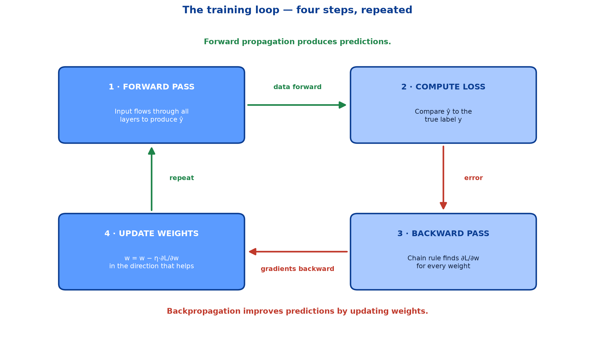
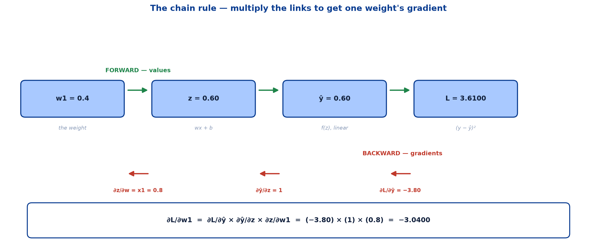
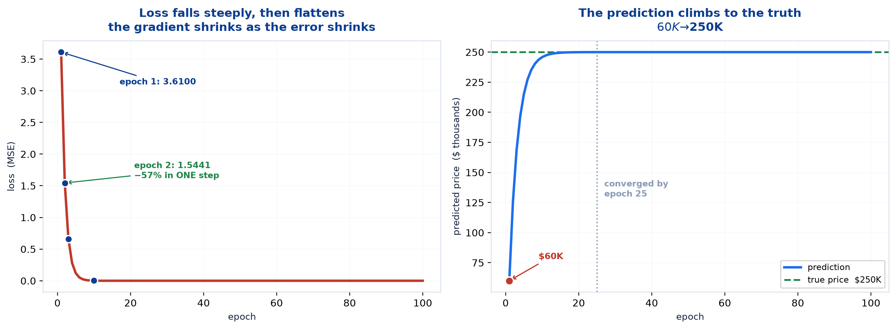
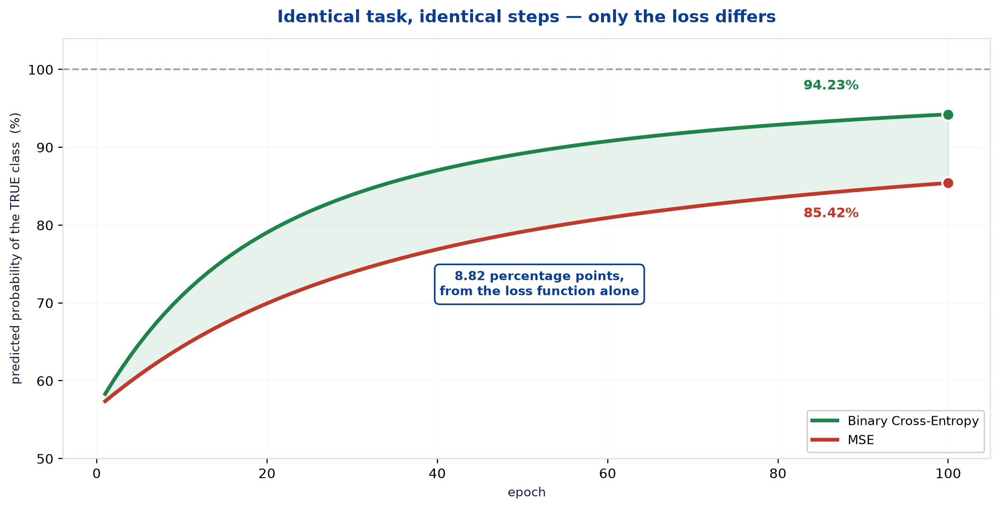
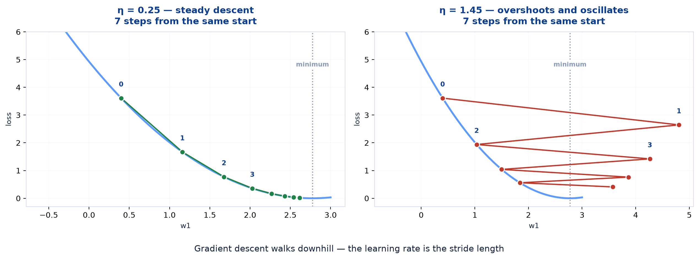
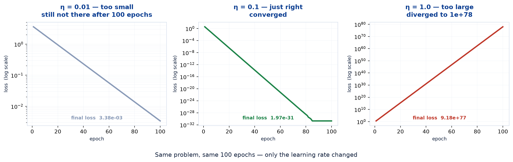

# <span style="color:#0B3D91">Backpropagation &amp; Gradient Descent</span>

> Study notes on the machinery that actually makes a network **learn**:
> **The training loop** → **Backpropagation** → **The chain rule** → **A regression trace** →
> **A classification trace** → **Gradient descent** → **The learning rate** →
> **Batch, epoch, iteration**.
> The previous notes produced a prediction and a number saying how wrong it was. This note turns
> that number into **better weights**.
>
> **A note on formulas:** equations are written in plain text inside code blocks rather than
> LaTeX, so they render correctly in any Markdown viewer.

---

## <span style="color:#1E6FEB">Table of Contents</span>

1. [The Training Loop](#1-the-training-loop)
2. [Backpropagation — Assigning Blame](#2-backpropagation--assigning-blame)
3. [The Chain Rule](#3-the-chain-rule)
4. [Worked Example A — Regression](#4-worked-example-a--regression)
5. [Worked Example B — Classification](#5-worked-example-b--classification)
6. [Gradient Descent &amp; the Weight Update Rule](#6-gradient-descent--the-weight-update-rule)
7. [The Learning Rate](#7-the-learning-rate)
8. [Batch, Epoch, Iteration](#8-batch-epoch-iteration)

---

## <span style="color:#1E6FEB">1. The Training Loop</span>

### 1.1 Overview / What is it?

Training a neural network is four steps, repeated:



```
→  Forward Pass      Input flows through all layers to produce a prediction
   Compute Loss      Compare the prediction to the true label
←  Backward Pass     Chain rule calculates the gradient of loss for each weight
↓  Update Weights    Optimiser adjusts weights in the direction that reduces loss
```

### 1.2 Why does it matter for AI?

Everything a neural network ever learns happens in this loop. Architectures change — CNN, RNN,
LSTM, Transformer — but all of them train with exactly these four steps.

### 1.3 Key Concepts — forward and backward, paired

| | **Forward Propagation** | **Backward Propagation** |
|---|---|---|
| **Direction** | input → hidden → output | **output → hidden → input** |
| **Carries** | **data** (activations) | **error** (gradients) |
| **Produces** | a **prediction** | a **gradient per weight** |
| **Question** | *"What do I predict?"* | *"Who is to blame, and how much?"* |

> **Key Takeaway** — Forward Propagation produces predictions. Backpropagation improves
> predictions by updating weights.

### 1.4 Simple Example — the loop in pseudocode

```
for each epoch:
    for each batch:
        y_hat = forward(x)              # 1. predict
        loss  = loss_fn(y_hat, y)       # 2. measure the error
        grads = backward(loss)          # 3. blame each weight
        weights = update(weights, grads)  # 4. adjust
```

Four lines. Every training run in deep learning is a variation on this.

### 1.5 How it works — what each note contributed

The loop is now complete, and each piece came from a different place:

```
Step 1  forward pass    ->  Note 02
Step 2  loss            ->  Note 03
Step 3  backward pass   ->  THIS NOTE
Step 4  weight update   ->  THIS NOTE
```

Steps 1 and 2 were deliberately left as a dead end — we could measure how wrong the network was,
but had no way to act on it. Steps 3 and 4 are the missing half.

### 1.6 Practical Example / Use Case

In a framework, the entire loop is one method call:

```python
model.fit(X, y, epochs=100, batch_size=32)
```

That line runs all four steps, for every batch, for every epoch. Everything in this note is what
`fit()` is doing internally.

### 1.7 Key Takeaways

> - Training is a four-step loop: **forward → loss → backward → update**.
> - **Forward carries data; backward carries error.**
> - **Forward propagation produces predictions; backpropagation improves them.**
> - Every architecture in deep learning trains with **this same loop**.
> - `model.fit()` is this loop, wrapped in one call.

---

## <span style="color:#1E6FEB">2. Backpropagation — Assigning Blame</span>

### 2.1 Overview / What is it?

> **Backpropagation** is the process of learning from errors made during prediction. The error
> (loss) is propagated **backward** from the output layer to the input layer. It calculates the
> **contribution of each weight** to the prediction error using gradients. Weights and biases are
> then updated using Gradient Descent to reduce the loss.

### 2.2 Why does it matter for AI?

A modern network has millions of weights. After a wrong prediction, the question is not *"was it
wrong?"* but *"which of these millions of numbers should change, in which direction, and by how
much?"* Backpropagation answers that for every weight at once.

### 2.3 Key Concepts — the question it answers

The question is precise:

> *"If I nudge this one weight slightly, how much does the total loss change?"*

That quantity is the **partial derivative** `∂L/∂w`, and it carries two pieces of information:

```
SIGN      ->  which direction to move the weight
MAGNITUDE ->  how much this weight matters to the error
```

```
∂L/∂w = +3.0   ->  increasing w INCREASES loss  ->  decrease w
∂L/∂w = -3.0   ->  increasing w DECREASES loss  ->  increase w
∂L/∂w =  0.0   ->  this weight is not currently affecting the loss
```

Compute this for every weight and you have a complete blame assignment.

### 2.4 Simple Example — why it runs backwards

The loss is computed at the **output**. A weight in the first layer affects the loss only
*through* every layer above it.

```
w (layer 1)  ->  layer 2  ->  layer 3  ->  output  ->  LOSS
```

Backpropagation computes the output layer's gradients first, then reuses them for the layer
below, then reuses *those* for the layer below that:

```
gradients at layer 3  ->  computed first
gradients at layer 2  ->  reuse layer 3's result
gradients at layer 1  ->  reuse layer 2's result
```

> **That reuse is the entire efficiency trick.** Computing each weight's gradient independently
> would mean redoing the same work millions of times. Going backwards means every layer's
> contribution is already available by the time it is needed.

This is why the algorithm is called *back*propagation rather than just "computing derivatives" —
the direction is the optimisation.

### 2.5 How it works — gradients are local

Each neuron only needs to know two things to do its part:

```
1. the gradient arriving from ABOVE      (how much my output affected the loss)
2. its OWN derivative                    (how much my input affects my output)
```

Multiply them, pass the result down, done. No neuron needs a global view of the network.

**This locality is what makes backpropagation scale.** A network with a billion parameters uses
exactly the same rule as a network with three.

### 2.6 Practical Example / Use Case — automatic differentiation

Nobody derives these by hand in practice. Frameworks record every operation during the forward
pass and then replay it backwards:

```python
loss.backward()        # PyTorch -- fills in .grad on every parameter
tape.gradient(loss, w) # TensorFlow -- same idea
```

Working through it by hand once, as sections 4 and 5 do, is still worth it: it makes the failure
modes (vanishing gradients, dead neurons, exploding loss) explicable rather than mysterious.

### 2.7 Key Takeaways

> - **Backpropagation assigns blame** — it computes `∂L/∂w` for every weight.
> - The gradient's **sign gives the direction**; its **magnitude gives the importance**.
> - It runs **backwards** so each layer can **reuse** the gradients from the layer above.
> - That reuse is the **efficiency trick** that makes training feasible.
> - Gradients are **local** — each neuron needs only the gradient from above and its own
>   derivative.
> - Frameworks do this automatically, but the hand-worked version explains the failure modes.

---

## <span style="color:#1E6FEB">3. The Chain Rule</span>

### 3.1 Overview / What is it?

The one piece of calculus backpropagation needs. If `a` affects `b`, and `b` affects `c`:

```
dc/da  =  dc/db  ×  db/da            "multiply the links in the chain"
```

### 3.2 Why does it matter for AI?

A neural network is a chain of simple functions. The chain rule is the tool for differentiating
exactly that structure — which is why backpropagation is, mathematically, nothing more than the
chain rule applied systematically.

### 3.3 Key Concepts — a neuron is a chain



```
w  →  z = wx + b  →  ŷ = f(z)  →  L = loss(ŷ, y)
```

So the gradient of the loss with respect to one weight is:

```
∂L/∂w  =  ∂L/∂ŷ   ×   ∂ŷ/∂z   ×   ∂z/∂w
          ^^^^^^      ^^^^^^      ^^^^^^
          loss        activation  the input x
          derivative  derivative
```

**Three simple derivatives, multiplied.** Each one is easy on its own:

| Link | Derivative | For our regression neuron |
|---|---|---|
| `∂L/∂ŷ` | depends on the loss | MSE → `−2(y − ŷ)` |
| `∂ŷ/∂z` | depends on the activation | Linear → `1` |
| `∂z/∂w` | always the input | `x` |

### 3.4 Simple Example — the intuition

A useful way to hold it: **gradients multiply along a path.**

```
"If I turn this dial by 1 unit, z moves by 0.8 units.
 If z moves by 1 unit, the loss moves by -3.8 units.
 So if I turn the dial by 1 unit, the loss moves by 0.8 x -3.8 = -3.04 units."
```

That is the chain rule in plain language, and it is exactly the calculation in section 4.

### 3.5 How it works — through multiple layers

The chain just gets longer. For a weight in the first layer of a two-layer network:

```
∂L/∂w¹  =  ∂L/∂ŷ  ×  ∂ŷ/∂z²  ×  ∂z²/∂a¹  ×  ∂a¹/∂z¹  ×  ∂z¹/∂w¹
```

Five links instead of three. Two consequences worth noting now:

- **Every extra layer adds another factor to the product.**
- If those factors are consistently **less than 1**, the product shrinks exponentially.

> That second point is the **vanishing gradient problem** from Note 03, now visible as a direct
> consequence of the chain rule. Sigmoid contributes at most 0.25 per layer, so five layers give
> `0.25⁵ = 0.00098`. ReLU contributes exactly 1, so the product survives.

### 3.6 Practical Example / Use Case

The same structure explains **exploding** gradients too. If the factors are consistently greater
than 1, the product grows exponentially instead:

```
factors < 1  ->  gradient VANISHES   ->  early layers never learn
factors ~ 1  ->  gradient SURVIVES   ->  training works
factors > 1  ->  gradient EXPLODES   ->  loss becomes NaN
```

Both failure modes are the same multiplication, running in opposite directions.

### 3.7 Key Takeaways

> - **Chain rule:** `dc/da = dc/db × db/da` — multiply the links.
> - For one neuron: `∂L/∂w = ∂L/∂ŷ × ∂ŷ/∂z × ∂z/∂w`.
> - The three links are the **loss derivative**, the **activation derivative**, and the **input**.
> - Each extra layer **adds another factor** to the product.
> - Factors **below 1** cause **vanishing** gradients; factors **above 1** cause **exploding**
>   ones.
> - Backpropagation is the chain rule applied systematically — nothing more exotic than that.

---

## <span style="color:#1E6FEB">4. Worked Example A — Regression</span>

### 4.1 Overview / What is it?

Picking up the neuron abandoned in Note 01. It predicted **$60,000** for a house actually worth
**$250,000**, using arbitrary weights. Now we fix it.

```
Inputs :  x1 = 0.8 (size),  x2 = 0.3 (rooms)
Weights:  w1 = 0.4,  w2 = 0.6,  b = 0.1
True   :  y = 2.5  ($250K)
Learning rate:  eta = 0.1
```

### 4.2 Why does it matter for AI?

Every number below is one a framework would compute silently. Doing it by hand once makes the
rest of deep learning concrete rather than magical.

### 4.3 Key Concepts — forward pass and loss

```
z = (0.4 × 0.8) + (0.6 × 0.3) + 0.1
  =    0.32     +    0.18     + 0.1
  = 0.60                                  ->  ŷ = 0.60   ($60K)

Loss = (y - ŷ)² = (2.5 - 0.60)² = (1.90)² = 3.6100
```

A loss of 3.61 — large, as expected from arbitrary weights.

### 4.4 Simple Example — the gradients

```
∂L/∂ŷ  = -2(y - ŷ)     = -2(1.90)     = -3.8000
∂L/∂w1 = ∂L/∂ŷ × x1    = -3.80 × 0.8  = -3.0400
∂L/∂w2 = ∂L/∂ŷ × x2    = -3.80 × 0.3  = -1.1400
∂L/∂b  = ∂L/∂ŷ × 1                    = -3.8000
```

Two things are worth reading off these numbers.

**Every gradient is negative.** That means increasing these weights would *decrease* the loss —
which makes sense, since the prediction is far too low.

**`w1`'s gradient is 2.7× larger than `w2`'s** (`−3.04` vs `−1.14`), purely because `x1 = 0.8` is
larger than `x2 = 0.3`.

> **Bigger inputs get bigger blame.** An input with more influence on the output carries more
> responsibility for the error. This is also a direct argument for **normalising inputs**: a
> feature measured in thousands would dominate the gradients of a feature measured in units,
> regardless of which one actually matters.

### 4.5 How it works — the update, and the check

```
w1 = 0.4 - 0.1 × (-3.04) = 0.4 + 0.304 = 0.7040
w2 = 0.6 - 0.1 × (-1.14) = 0.6 + 0.114 = 0.7140
b  = 0.1 - 0.1 × (-3.80) = 0.1 + 0.380 = 0.4800
```

All three increased, exactly as the negative gradients instructed. Now re-run the forward pass
with the new weights:

```
new ŷ    = 1.2574     (was 0.6000)
new loss = 1.5441     (was 3.6100)     ->  reduced by 2.0659
```

**One step cut the loss by 57%.** The mechanism works.

### 4.6 Practical Example / Use Case — 100 epochs



| Epoch | `ŷ` | Loss |
|---|---|---|
| 1 | 0.6000 ($60K) | 3.610000 |
| 2 | 1.2574 ($126K) | 1.544055 |
| 3 | 1.6873 ($169K) | 0.660417 |
| 10 | 2.4584 ($246K) | 0.001729 |
| **25** | **2.4999 ($250K)** | **0.000000** |
| 50 | 2.5000 ($250K) | 0.000000 |
| 100 | 2.5000 ($250K) | 0.000000 |

Final weights: `w1 = 1.2786`, `w2 = 0.9295`, `b = 1.1983`.

**$60K → $250K**, and essentially finished by **epoch 25**. The remaining 75 epochs changed
nothing.

The curve is steep then flat, which is the normal shape and has a clean explanation: **the
gradient is proportional to the error.** As the error shrinks, so do the steps. The model
automatically slows down as it approaches the answer.

```python
for epoch in range(100):
    z = w1 * x1 + w2 * x2 + b        # forward
    loss = (y_true - z) ** 2         # loss
    g = -2 * (y_true - z)            # backward
    w1 -= lr * g * x1                # update
    w2 -= lr * g * x2
    b  -= lr * g
```

> **Worth knowing — the framework equivalent.** The same neuron in Keras is:
>
> ```python
> model = keras.Sequential([
>     layers.Dense(1, activation="linear", input_shape=(2,),
>                  kernel_initializer=keras.initializers.Constant([0.4, 0.6]),
>                  bias_initializer=keras.initializers.Constant(0.1))
> ])
> model.compile(optimizer=keras.optimizers.SGD(learning_rate=0.1), loss="mse")
> model.fit(np.array([[0.8, 0.3]]), np.array([[2.5]]), epochs=100, verbose=0)
> ```
>
> With identical initial weights and the same learning rate, this performs the same arithmetic and
> produces the same loss curve. *(This Keras snippet was not re-run while writing these notes —
> TensorFlow is not installed in the project environment. The NumPy figures above were all
> executed and verified.)*

### 4.7 Key Takeaways

> - Forward: `z = 0.60`, loss `= 3.6100` — badly wrong, as expected from arbitrary weights.
> - Gradients: `∂L/∂w1 = −3.0400`, `∂L/∂w2 = −1.1400`, `∂L/∂b = −3.8000`.
> - **All negative** → these weights should increase.
> - **`w1`'s gradient is 2.7× `w2`'s** purely because `x1 > x2` — **bigger inputs get bigger
>   blame**, which is why inputs should be normalised.
> - **One step cut the loss from 3.6100 to 1.5441 — a 57% reduction.**
> - Over 100 epochs: **$60K → $250K**, converged by **epoch 25**.
> - The loss curve is **steep then flat** because the gradient shrinks with the error.

---

## <span style="color:#1E6FEB">5. Worked Example B — Classification</span>

### 5.1 Overview / What is it?

The same procedure on a classification problem — predicting pass/fail from study and sleep hours —
where something mathematically elegant happens.

```
Inputs :  x1 = 0.7 (study),  x2 = 0.5 (sleep)
Weights:  w1 = 0.3,  w2 = 0.5,  b = -0.2
True   :  y = 1  (Pass)
Learning rate:  eta = 0.1
```

### 5.2 Why does it matter for AI?

This is the configuration used by essentially every binary classifier — sigmoid output with binary
cross-entropy — and its gradient turns out to be remarkably simple.

### 5.3 Key Concepts — forward pass and loss

```
z = (0.3 × 0.7) + (0.5 × 0.5) + (-0.2)
  =    0.21     +    0.25     - 0.20
  = 0.2600

ŷ = sigmoid(0.26) = 0.5646        ->  56.5% probability of passing

BCE = -log(0.5646) = 0.5716
```

The model is barely better than a coin flip, which is what untrained weights buy you.

### 5.4 Simple Example — the elegant cancellation

By the chain rule, the gradient through a sigmoid *should* require the sigmoid derivative:

```
∂L/∂z  =  ∂L/∂ŷ  ×  ∂ŷ/∂z
       =  [ -y/ŷ + (1-y)/(1-ŷ) ]  ×  [ ŷ(1-ŷ) ]
```

Multiply it out and almost everything cancels:

```
∂L/∂z  =  ŷ - y  =  0.5646 - 1  =  -0.4354
```

**Just the error.** No sigmoid derivative left at all.

> This is Note 03's `σ'` cancellation, now visible from the other side. Cross-entropy's logarithm
> was chosen precisely because its derivative annihilates the sigmoid's derivative — and the
> result is that backpropagation through a sigmoid + BCE output layer is as simple as it could
> possibly be.

The rest follows as before:

```
∂L/∂w1 = -0.4354 × 0.7 = -0.3048
∂L/∂w2 = -0.4354 × 0.5 = -0.2177
∂L/∂b  = -0.4354

w1: 0.3  -> 0.3305
w2: 0.5  -> 0.5218
b : -0.2 -> -0.1565

new probability = 58.3%   (was 56.5%)
```

### 5.5 How it works — 100 epochs

| Epoch | Probability of passing | BCE |
|---|---|---|
| 1 | 56.5% | 0.5716 |
| 10 | 69.8% | 0.3590 |
| 50 | 89.0% | 0.1163 |
| 100 | **94.2%** | 0.0600 |

**56.5% → 94.2%.** Notice it does not reach 100%, and cannot: sigmoid only approaches 1
asymptotically, so the loss can always be reduced a little further. Training stops when you decide
it is good enough, not when the loss hits zero.

### 5.6 Practical Example / Use Case — Note 03's theory, confirmed

Note 03 argued from gradients that cross-entropy should train a classifier better than MSE. Here
is that prediction tested directly: **the same task, the same 100 epochs, the same learning rate,
the same starting weights** — only the loss function differs.



```
Binary Cross-Entropy:  final probability = 94.23%
MSE                 :  final probability = 85.42%
```

**An 8.81 percentage-point gap, from nothing but the choice of loss.**

The cause is exactly the one predicted: MSE's gradient through a sigmoid carries a `σ'(z)` factor
that shrinks as the model becomes confident, so its steps get smaller precisely when it still has
ground to cover. Cross-entropy's `ŷ − y` has no such factor.

> This is the most satisfying result in these notes so far — a property derived from calculus in
> one note, then observed as a measurable difference in the next.

### 5.7 Key Takeaways

> - Forward: `z = 0.2600`, `ŷ = 0.5646` (56.5%), `BCE = 0.5716`.
> - The chain rule **collapses to `∂L/∂z = ŷ − y`** — the sigmoid derivative cancels completely.
> - That cancellation is **why cross-entropy pairs with sigmoid**.
> - One step: **56.5% → 58.3%**. Over 100 epochs: **56.5% → 94.2%**.
> - It **cannot reach 100%** — sigmoid only approaches 1 asymptotically.
> - **Measured: BCE 94.23% vs MSE 85.42%** on the identical task — **8.81 points** from the loss
>   function alone, exactly as Note 03 predicted.

---

## <span style="color:#1E6FEB">6. Gradient Descent &amp; the Weight Update Rule</span>

### 6.1 Overview / What is it?

> **Gradient Descent** is an optimization algorithm used to minimize the loss function by
> iteratively updating the model's weights and biases in the direction that reduces prediction
> error.

**The weight update rule:**

```
w_new = w_old - eta * (dJ/dw)
```

- `w` = weight
- `eta` (η) = **learning rate**
- `J` = loss / cost function
- `∂J/∂w` = gradient (slope)

**Why we need it:** minimizes the loss function, improves model accuracy, helps neural networks
learn from data, and finds the optimal weights and biases.

**How it works:**

1. Make a prediction using **forward propagation**
2. Calculate the error using a **loss function**
3. Compute gradients using **backpropagation**
4. **Update weights** to reduce the error
5. **Repeat** until the loss is minimized

### 6.2 Why does it matter for AI?

Backpropagation says *which way is downhill*. Gradient descent is what actually **takes the step**.
Without it, the gradients would be a very precise description of a problem nobody fixed.

### 6.3 Key Concepts — the minus sign is the algorithm

```
Gradient = direction of steepest INCREASE in loss
Gradient Descent moves in the OPPOSITE direction to minimize loss
The goal is to find the weights that produce the lowest possible error
```

That is the entire content of the minus sign in `w − η·∂J/∂w`:

```
∂J/∂w positive (loss rises as w rises)  ->  w - eta*(positive)  ->  w DECREASES
∂J/∂w negative (loss falls as w rises)  ->  w - eta*(negative)  ->  w INCREASES
```

Both cases move the weight downhill. **Flip the sign and you would have gradient *ascent*,
maximising the error** — which is occasionally useful, but not here.

### 6.4 Simple Example — the valley analogy

You are on a foggy hillside and want to reach the bottom. You cannot see where it is, but you can
feel the slope under your feet.

```
1. Feel the slope                       ->  compute the gradient
2. Step downhill                        ->  subtract eta x gradient
3. Repeat                               ->  iterate
```

You never need a map of the whole valley. Purely local information, repeated, gets you down.



The left panel shows the steps bunching up as they approach the minimum — because the slope
flattens there, and a gentler slope means a smaller step. The right panel shows what happens when
the stride is too long, which is section 7.

### 6.5 How it works — where the gradient is zero

Training stops making progress when `∂J/∂w = 0`, which happens at a flat point on the loss
surface. Not all flat points are equal:

| | What it is | Good or bad? |
|---|---|---|
| **Global minimum** | The lowest point anywhere | The goal |
| **Local minimum** | Lowest point *nearby* | Usually acceptable in practice |
| **Saddle point** | Flat, but downhill in some direction | The common obstacle in high dimensions |

> **Worth knowing:** the textbook worry about getting stuck in local minima turns out to be
> overstated for large networks. In a space with millions of dimensions, a point that is a minimum
> in *every single direction* is extraordinarily unlikely — **saddle points** are the real
> obstacle. Momentum-based optimisers (next topic) exist largely to roll through them.

### 6.6 Practical Example / Use Case — this is what an optimizer does

```python
# Written out by hand:
w -= lr * grad_w
b -= lr * grad_b

# The framework equivalent:
optimizer = keras.optimizers.SGD(learning_rate=0.1)
```

`SGD` is literally this update rule. Every other optimizer — Momentum, RMSprop, Adam — is a
modification of this one line, which is the entire subject of the next topic.

### 6.7 Key Takeaways

> - **`w_new = w_old − η·∂J/∂w`** — the whole of gradient descent.
> - The **gradient points uphill**; the **minus sign** is what makes it descent.
> - Five steps: **predict, measure error, compute gradients, update, repeat**.
> - The **valley analogy**: local slope information, repeated, is enough.
> - Steps naturally **shrink near the minimum** because the slope flattens.
> - **Saddle points, not local minima**, are the real obstacle in high-dimensional networks.
> - **`SGD` is exactly this rule**; every other optimizer modifies it.

---

## <span style="color:#1E6FEB">7. The Learning Rate</span>

### 7.1 Overview / What is it?

The learning rate `η` controls **how big a step** to take. It is the single most important
hyperparameter in training, and the most common cause of a model that refuses to learn.

### 7.2 Why does it matter for AI?

Get it wrong in one direction and training takes forever. Get it wrong in the other and the loss
becomes `NaN` within seconds. Neither failure is subtle, but both are easy to misdiagnose.

### 7.3 Key Concepts — measured on the house-price problem

The same problem, the same 100 epochs, the same starting weights — only `η` changes:

| `η` | Final loss | Outcome |
|---|---|---|
| 0.01 | 3.15e−03 | **too slow** — still not converged |
| **0.1** | 1.97e−31 | **converged** |
| **0.5** | 1.71e−27 | **converged** |
| 1.0 | 5.55e+**78** | **diverged** |
| 1.5 | 1.00e+**125** | **diverged** |
| 2.0 | 1.05e+**155** | **diverged** |



**Those exponents are not typos.** At `η = 1.0` the loss reaches **10⁷⁸**. The steps overshoot the
minimum so badly that each one lands further up the opposite wall than it started, and the
oscillation amplifies itself into numerical oblivion.

```
eta too small  ->  slow; may never arrive within your epoch budget
eta just right ->  steady descent to the minimum
eta too large  ->  overshoots, oscillates, EXPLODES
```

### 7.4 Simple Example — why too large explodes

Look again at the right-hand panel of the valley figure in section 6.4. Each step jumps past the
minimum and lands **higher up the other side** than where it started. The next gradient is
therefore *larger*, so the next step is *bigger*, and the process feeds itself.

```
step 1: overshoot slightly    ->  gradient a bit larger
step 2: overshoot more        ->  gradient larger still
step 3: overshoot much more   ->  ...
        -> loss -> infinity -> NaN
```

Divergence is not a gentle failure. It usually happens within a handful of epochs.

### 7.5 How it works — diagnosing it

> **Practical tip:** if your loss becomes **`NaN` or `inf`** in the first few epochs, **the
> learning rate is too high.** It is the first thing to check, before architecture, before data.

| Symptom | Likely cause |
|---|---|
| Loss → `NaN` almost immediately | η far too high |
| Loss oscillates up and down | η slightly too high |
| Loss falls, but painfully slowly | η too low |
| Loss falls then plateaus high | η too low, or underfitting |
| Loss falls smoothly and flattens near zero | **η is fine** |

Typical starting values are **0.001 to 0.01** for Adam, and **0.01 to 0.1** for plain SGD.

### 7.6 Practical Example / Use Case — learning rate schedules

> **Worth knowing:** `η` does not have to stay fixed. A common refinement is to **start large and
> decrease over time** — big strides early to cover ground, small careful steps later to settle
> into the minimum.

```
epochs  1-30 :  eta = 0.1     cover ground quickly
epochs 31-60 :  eta = 0.01    refine
epochs 61-100:  eta = 0.001   settle
```

This is called a **learning rate schedule** or **decay**, and it often beats any single fixed
value. The adaptive optimizers in the next topic take the idea further by adjusting the effective
step size **per parameter**, automatically.

### 7.7 Key Takeaways

> - The **learning rate `η`** sets the step size — the most important hyperparameter in training.
> - Measured on the same problem: **0.1 and 0.5 converge; 0.01 is too slow; 1.0 explodes to
>   10⁷⁸**.
> - Too large **overshoots and self-amplifies** — each step lands higher than the last.
> - **`NaN` loss in the first few epochs = learning rate too high.** Check this first.
> - Typical starting points: **0.001–0.01** (Adam), **0.01–0.1** (SGD).
> - A **learning rate schedule** (large early, small later) usually beats any fixed value.

---

## <span style="color:#1E6FEB">8. Batch, Epoch, Iteration</span>

### 8.1 Overview / What is it?

> **Worth knowing:** these three terms appear constantly and are frequently used interchangeably,
> wrongly. They mean different things.

```
Epoch     = one full pass over the ENTIRE training set
Batch     = the number of samples processed before ONE weight update
Iteration = one weight update
```

### 8.2 Why does it matter for AI?

They are the three arguments you pass to every training call, and mixing them up leads to models
that train for a hundred times longer or shorter than intended.

### 8.3 Key Concepts — the arithmetic

```
10,000 training samples,  batch_size = 100

  iterations per epoch  =  10,000 / 100  =  100
  10 epochs             =  1,000 total weight updates
```

```python
model.fit(X, y, epochs=10, batch_size=100)
#                ^^^^^^^^   ^^^^^^^^^^^^^
#                10 passes  100 samples per update  ->  1,000 updates
```

### 8.4 Simple Example — the three variants of gradient descent

Batch size is what distinguishes them:

| Variant | Batch size | Updates per epoch (10k samples) | Description |
|---|---|---|---|
| **Batch Gradient Descent** | all 10,000 | **1** | Uses the entire dataset to update weights — **stable but computationally expensive** |
| **Stochastic GD (SGD)** | 1 | **10,000** | Updates after each training example — **faster learning and less memory** |
| **Mini-Batch GD** | 32–256 | ~300 | Uses small batches — **the most commonly used approach** |

### 8.5 How it works — the trade-off

```
LARGE batch  ->  accurate gradient estimate, smooth descent
                 but few updates per epoch, and high memory use

SMALL batch  ->  noisy gradient estimate, jumpy descent
                 but many updates per epoch, and low memory use
```

**Mini-batch sits in the middle deliberately.** It gets a reasonable gradient estimate *and* a
useful number of updates, and a batch of 32–256 maps well onto GPU parallelism.

> **The noise is not purely a cost.** A noisy gradient can knock the model out of a poor local
> minimum or off a saddle point that a perfectly smooth descent would settle into. Small batches
> have a mild regularising effect for this reason.

### 8.6 Practical Example / Use Case

```
batch_size = 32     a common default; safe almost everywhere
batch_size = 256    faster per epoch if the memory is available
batch_size = 1      rarely used now -- very slow on modern hardware
```

Batch size interacts with learning rate: **larger batches give less noisy gradients, which
tolerate a larger learning rate.** Doubling the batch size and raising `η` accordingly is a common
scaling tactic.

### 8.7 Key Takeaways

> - **Epoch** = one full pass over the data. **Batch** = samples per update. **Iteration** = one
>   update.
> - 10,000 samples with `batch_size=100` → **100 iterations per epoch**.
> - **Batch GD** (all data): stable but expensive — 1 update per epoch.
> - **SGD** (1 sample): fast and memory-light but noisy.
> - **Mini-Batch** (32–256): **the standard** — the best of both.
> - Batch noise has a **mild regularising benefit** — it helps escape saddle points.
> - **Larger batches tolerate larger learning rates.**

---

## <span style="color:#1E6FEB">Summary — Backpropagation &amp; Gradient Descent at a Glance</span>

**The loop:**

```
1. FORWARD    y_hat = f(Wx + b)              produce a prediction
2. LOSS       L = loss(y_hat, y)             measure the error
3. BACKWARD   dL/dw  via the chain rule      assign blame to every weight
4. UPDATE     w = w - eta * dL/dw            take a step downhill
   repeat
```

**The chain rule:**

```
dL/dw  =  dL/dy_hat  x  dy_hat/dz  x  dz/dw
          loss          activation     input
```

**The two worked traces:**

| | Regression | Classification |
|---|---|---|
| **Start** | ŷ = 0.60 ($60K), loss 3.6100 | ŷ = 0.5646 (56.5%), BCE 0.5716 |
| **After 1 step** | loss **1.5441** (−57%) | **58.3%** |
| **After 100 epochs** | **$250K**, loss 0.000000 | **94.2%** |
| **Gradient** | `−2(y − ŷ) · x` | **`(ŷ − y) · x`** — σ' cancels |

**The learning rate, measured:**

| η | Result |
|---|---|
| 0.01 | too slow |
| **0.1 / 0.5** | **converged** |
| 1.0 / 1.5 / 2.0 | **diverged** — up to 10¹⁵⁵ |

**Vocabulary:**

```
Epoch     = one pass over all the data
Batch     = samples processed per weight update
Iteration = one weight update
```

**The one-sentence version:** backpropagation uses the chain rule to work out how much each weight
contributed to the error, and gradient descent subtracts a fraction of that blame from every
weight — repeated until the loss stops falling.

**Where this leads:** section 6.6 noted that `SGD` is exactly the one-line update rule, and that
every other optimizer modifies it. Section 7 showed a single fixed learning rate is fragile, and
section 6.5 noted that saddle points are the real obstacle. All three point the same way: the
plain update rule can be improved. **Momentum, AdaGrad, RMSprop and Adam** are the next topic.

---

> **Navigation:** ← Previous: [03 — Activation Functions &amp; Loss Functions](03_Deep_Learning_Activation_And_Loss_Functions.md) · Next → 05 — Optimizers
>
> **Related:** [02 — ANN &amp; Forward Propagation](02_Deep_Learning_ANN_And_Forward_Propagation.md)
> §4 (the forward pass this loop begins with), and
> [Overfitting, Underfitting &amp; Bias-Variance](../../machine_learning_02/notes/06_Machine_Learning_Overfitting_Underfitting_And_Bias_Variance.md)
> §7 (gradient descent as parameter optimisation, distinct from hyperparameter search).
