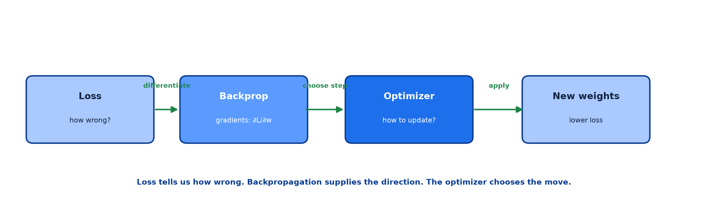
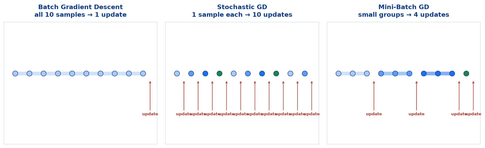
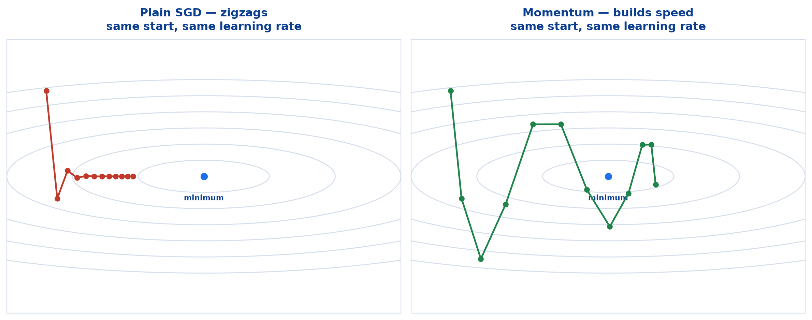
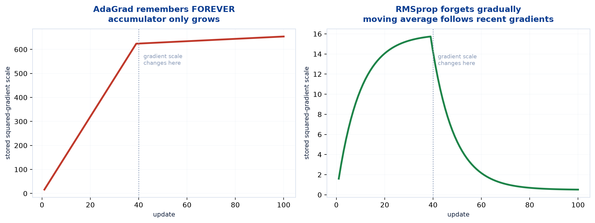
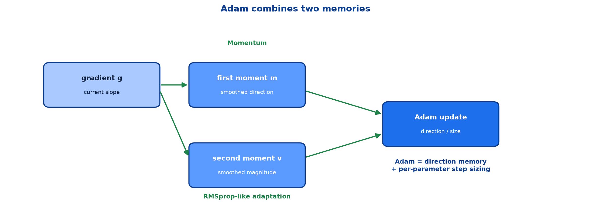
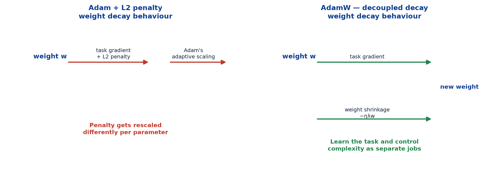

# <span style="color:#0B3D91">Optimizers</span>

> Study notes on the algorithms that turn backpropagation's gradients into useful weight
> updates: **Batch / Stochastic / Mini-Batch GD** → **Momentum** → **AdaGrad** → **RMSprop** →
> **Adam** → **AdamW**. The previous note supplied the basic update rule; this note explains how
> modern optimizers improve it.
>
> **A note on formulas:** equations are written in plain text inside code blocks rather than
> LaTeX, so they render correctly in any Markdown viewer.

---

## <span style="color:#1E6FEB">Table of Contents</span>

1. [What an Optimizer Does](#1-what-an-optimizer-does)
2. [Batch, Stochastic & Mini-Batch Gradient Descent](#2-batch-stochastic--mini-batch-gradient-descent)
3. [Momentum](#3-momentum)
4. [AdaGrad](#4-adagrad)
5. [RMSprop](#5-rmsprop)
6. [Adam](#6-adam)
7. [AdamW](#7-adamw)
8. [Choosing an Optimizer](#8-choosing-an-optimizer)

---

## <span style="color:#1E6FEB">1. What an Optimizer Does</span>

### 1.1 Overview / What is it?

> An **Optimizer** is an algorithm that adjusts the weights and biases of a neural network to
> minimize the loss function and improve model performance.



```
Loss function       -> tells us "how wrong?"
Backpropagation     -> calculates gradients
Optimizer           -> uses gradients to update weights and reduce loss
```

The base update from the previous note is:

```
w_new = w_old - eta * (dJ/dw)
```

### 1.2 Why does it matter for AI?

Plain gradient descent uses one fixed learning rate for every parameter, every batch, every point
in training. Real loss landscapes are noisy and uneven; that one-size-fits-all rule is usually too
crude. An optimizer decides how to apply the gradient **well**.

### 1.3 Key Concepts — what needs fixing

| Problem | What plain gradient descent does | What optimizers try to do |
|---|---|---|
| **Noisy mini-batches** | Chases each slightly different gradient | Smooth the direction |
| **Narrow valleys** | Zigzags across the steep walls | Build useful momentum |
| **Unequal gradient scales** | One learning rate is wrong for at least one weight | Adapt steps per parameter |
| **Training changes over time** | Keeps the same stride forever | Adjust to current conditions |

### 1.4 Simple Example — the narrow valley

```text
A steep direction needs tiny careful steps.
A flat direction needs larger steps to make progress.

One global eta cannot be ideal for both at once.
```

This is the practical reason the optimizer zoo exists. Not because researchers enjoy Greek letters
(they do), but because one update rule is not enough for every terrain.

### 1.5 How it works

Every optimizer retains the same overall loop:

```text
forward -> loss -> backprop gradients -> optimizer update -> repeat
```

They differ only in the final step. SGD applies the gradient directly; Momentum remembers
previous direction; adaptive optimizers additionally scale each parameter's step.

### 1.6 Practical Example / Use Case

```python
model.compile(
    optimizer="adam",              # how weights update
    loss="binary_crossentropy",    # what is minimised
    metrics=["accuracy"],           # what humans read
)
```

### 1.7 Key Takeaways

> - The **loss** says how wrong; **backpropagation** supplies gradients; the **optimizer** changes
>   the weights.
> - All optimizers modify the final update step, not the forward pass or loss function.
> - Their jobs are smoothing noise, navigating narrow valleys, and adapting step sizes.

---

## <span style="color:#1E6FEB">2. Batch, Stochastic & Mini-Batch Gradient Descent</span>

### 2.1 Overview / What is it?

The number of samples used to calculate an update produces three variants:



| Variant | Batch size | Updates per epoch (10k rows) | Description |
|---|---:|---:|---|
| **Batch GD** | all 10,000 | 1 | Stable, but computationally expensive |
| **Stochastic GD (SGD)** | 1 | 10,000 | Fast and memory-light, but noisy |
| **Mini-Batch GD** | 32–256 | ~300 | The practical balance; most common |

### 2.2 Why does it matter for AI?

Every optimizer in the rest of this note works on batches. In modern usage, “SGD” often means
**mini-batch SGD**, not literally one example at a time.

### 2.3 Key Concepts

```text
Large batch -> accurate, smooth gradient; few updates; high memory use
Small batch -> noisy gradient; many updates; low memory use
Mini-batch  -> useful estimate + useful update count + GPU-friendly
```

### 2.4 Simple Example

```text
10,000 samples, batch_size = 100
-> 100 updates per epoch
-> 10 epochs = 1,000 optimizer updates
```

### 2.5 How it works

A batch gradient is the average gradient across its samples. A large batch averages away noise,
but each update costs more. A mini-batch deliberately accepts a little noise for many cheaper
updates.

### 2.6 Practical Example / Use Case

```python
model.fit(X_train, y_train, batch_size=32, epochs=20)
```

`32` is a sensible default. Increase it only when measurement and available memory justify it.

### 2.7 Key Takeaways

> - **Batch GD** uses all data, **SGD** uses one sample, **mini-batch** uses a small group.
> - Mini-batch GD is the standard because it balances stability, memory, update frequency and GPU
>   parallelism.
> - Batch size controls **how often** the optimizer updates, not the model architecture.

---

## <span style="color:#1E6FEB">3. Momentum</span>

### 3.1 Overview / What is it?

Momentum remembers recent update directions, like a heavy ball rolling downhill:

```text
velocity = beta * velocity - eta * gradient
w        = w + velocity
```

`beta` is usually around `0.9`.

### 3.2 Why does it matter for AI?

Plain SGD reacts to the current gradient only. In a narrow valley it repeatedly bounces between
walls. Momentum averages those bounces while accumulating progress in the useful direction.



### 3.3 Key Concepts

```text
Repeated gradients in the same direction -> velocity builds -> faster progress
Alternating noisy gradients              -> velocity cancels -> less zigzagging
```

### 3.4 Simple Example

If updates keep saying “right”:

```text
plain SGD:  move right, then start over
momentum:   move right, remember it, move further right
```

### 3.5 How it works

Momentum is an exponentially weighted memory: recent gradients matter most, older gradients fade.
It changes the *route*, not the destination.

### 3.6 Practical Example / Use Case

```python
optimizer = keras.optimizers.SGD(learning_rate=0.01, momentum=0.9)
```

### 3.7 Key Takeaways

> - Momentum remembers previous directions, reducing noisy zigzagging.
> - It accelerates where gradients consistently agree and damps movement where they disagree.
> - It still uses one global learning rate, so it does not solve unequal parameter scales.

---

## <span style="color:#1E6FEB">4. AdaGrad</span>

### 4.1 Overview / What is it?

AdaGrad gives every parameter its own effective learning rate:

```text
accumulator = accumulator + gradient^2
w_new = w_old - eta * gradient / (sqrt(accumulator) + epsilon)
```

### 4.2 Why does it matter for AI?

One parameter may receive gradients around `0.001`; another may receive gradients around `100`.
A single global rate cannot serve both safely. AdaGrad makes heavily-updated parameters step less
and rarely-updated parameters step more.

### 4.3 Key Concepts

```text
large historical gradients -> large denominator -> smaller effective step
small historical gradients -> small denominator -> larger effective step
```

On a narrow valley after 100 updates, AdaGrad produced effective rates:

```text
parameter 1: 0.10495
parameter 2: 0.03135
```

The steep direction received a rate over three times smaller.

### 4.4 Simple Example

```text
A word-feature appears in every document -> many gradients -> smaller steps
A rare word-feature appears occasionally  -> few gradients  -> larger steps
```

This is why AdaGrad can be useful on **sparse data**.

### 4.5 How it works — its flaw

The accumulator only grows. It remembers every squared gradient forever:

```text
sum(g1^2 + g2^2 + g3^2 + ...)
```

Eventually the denominator becomes huge and learning rates become tiny. Training can stall.

### 4.6 Practical Example / Use Case

Use AdaGrad when rare feature updates are central; do not assume it is a general default. Its
permanent decay is exactly what RMSprop corrects.

### 4.7 Key Takeaways

> - AdaGrad adapts the learning rate **per parameter**.
> - It helps sparse features and uneven gradient scales.
> - Its accumulator grows forever, so effective learning rates can shrink until training stalls.

---

## <span style="color:#1E6FEB">5. RMSprop</span>

### 5.1 Overview / What is it?

RMSprop keeps a **moving average** of squared gradients instead of AdaGrad’s lifetime total:

```text
v = rho * v + (1 - rho) * gradient^2
w_new = w_old - eta * gradient / (sqrt(v) + epsilon)
```

`rho` is commonly `0.9`.

### 5.2 Why does it matter for AI?

It keeps AdaGrad’s useful per-parameter adaptation while allowing old gradient history to fade.
The optimizer reacts to the **current** terrain rather than carrying ancient history forever.



### 5.3 Key Concepts

```text
AdaGrad: remembers EVERY gradient -> rate shrinks forever
RMSprop: remembers RECENT gradients -> rate remains adaptable
```

### 5.4 Simple Example

If gradients were large in early training but become small later:

```text
AdaGrad  -> still penalises the parameter for its old activity
RMSprop  -> gradually forgets and permits a useful step again
```

### 5.5 How it works

The moving average uses exponentially decreasing weights: yesterday matters more than last month.
No growing history means no inevitable training freeze.

### 5.6 Practical Example / Use Case

RMSprop is a reasonable choice when gradient scales vary substantially over training, historically
including recurrent / sequence models. Adam is more commonly the default today.

### 5.7 Key Takeaways

> - RMSprop is AdaGrad with **forgetting**.
> - It adapts per parameter using recent squared-gradient scale.
> - It avoids AdaGrad’s permanently shrinking learning rates.

---

## <span style="color:#1E6FEB">6. Adam</span>

### 6.1 Overview / What is it?

**Adam** means **Adaptive Moment Estimation**. It combines Momentum’s direction memory with
RMSprop-like adaptive step sizing.



```text
m = beta1 * m + (1 - beta1) * gradient        first moment: direction
v = beta2 * v + (1 - beta2) * gradient^2      second moment: magnitude

w_new = w_old - eta * m_hat / (sqrt(v_hat) + epsilon)
```

Typical values: `beta1 = 0.9`, `beta2 = 0.999`.

### 6.2 Why does it matter for AI?

Adam handles noisy mini-batches, builds useful direction momentum, and gives every parameter an
adaptive effective rate. It is the practical default for most neural-network tasks.

### 6.3 Key Concepts

| Memory | Stores | What it provides |
|---|---|---|
| **First moment `m`** | Smoothed gradient | Direction — Momentum |
| **Second moment `v`** | Smoothed squared gradient | Scale — RMSprop-like adaptation |

```text
Adam = Momentum + adaptive per-parameter learning rates
```

### 6.4 Simple Example — first update

On a deliberately uneven valley, the first gradient was:

```text
gradient = [4, 25]
```

The second direction is more than six times steeper. Plain SGD would step more than six times
farther there. Adam normalises using each parameter’s squared-gradient memory:

```text
Adam step = [0.15, 0.15]
new position = [3.85, 0.85]
```

Equal first steps despite gradients `[4, 25]`. That is adaptive scaling in action.

### 6.5 How it works — bias correction

`m` and `v` start at zero, so early estimates are biased toward zero. Adam corrects that with
`m_hat` and `v_hat`. You do not need to derive it now; the important point is that Adam avoids
making artificially tiny early updates simply because its memories were empty.

### 6.6 Practical Example / Use Case

```python
model.compile(optimizer="adam", loss="categorical_crossentropy", metrics=["accuracy"])
```

Start with Adam and `learning_rate=0.001` unless measurement gives a reason to deviate.

### 6.7 Key Takeaways

> - **Adam = Momentum + RMSprop-style adaptation.**
> - It remembers direction and gradient magnitude separately.
> - It is the usual practical baseline because it works well with relatively little tuning.
> - The first-update example converted gradients `[4, 25]` into equal-sized steps `[0.15, 0.15]`.

---

## <span style="color:#1E6FEB">7. AdamW</span>

### 7.1 Overview / What is it?

AdamW is Adam with **decoupled weight decay**:

```text
w_new = w_old - Adam_update - eta * lambda * w_old
```

The final term shrinks weights slightly toward zero.

### 7.2 Why does it matter for AI?

Large weights can produce sharp, brittle decisions that memorise quirks of training data. Weight
decay encourages a simpler model and improves generalisation.



### 7.3 Key Concepts

```text
Adam:  adaptively learn the task
AdamW: adaptively learn the task + separately shrink weights
```

With plain SGD, L2 regularisation and weight decay are effectively equivalent. With Adam, adaptive
scaling means they are not. AdamW keeps weight shrinkage separate, giving predictable decay.

### 7.4 Simple Example

```text
large weights -> sharp decisions -> higher overfitting risk
weight decay  -> smaller weights -> smoother decisions -> better generalisation
```

### 7.5 How it works

AdamW deliberately decouples two jobs:

```text
adaptive gradient update -> fit the task
weight decay             -> control model complexity
```

### 7.6 Practical Example / Use Case

AdamW is widely used for **Transformers and LLMs**:

```python
optimizer = keras.optimizers.AdamW(learning_rate=3e-4, weight_decay=1e-4)
```

### 7.7 Key Takeaways

> - **AdamW = Adam + decoupled weight decay**.
> - Weight decay shrinks weights separately to help prevent overfitting.
> - It is a common choice for **Transformers and LLMs**.

---

## <span style="color:#1E6FEB">8. Choosing an Optimizer</span>

### 8.1 Overview / What is it?

A practical decision guide — start simple, measure, then change only what needs changing.

### 8.2 Why does it matter for AI?

Optimizer choice matters, but learning rate usually matters more. Do not build a 12-optimizer
experiment grid before you have one trustworthy baseline. That is cargo cult science wearing a
lab coat.

### 8.3 Key Concepts — cheat sheet

| Optimizer | Core idea | Strength | Limitation |
|---|---|---|---|
| Batch GD | Whole dataset | Stable | Slow, memory heavy |
| SGD | One sample | Simple | Noisy |
| Mini-Batch | Small batches | Standard foundation | Needs tuned rate |
| Momentum | Direction memory | Faster, less oscillation | One global rate |
| AdaGrad | Per-parameter rate | Sparse data | Rate shrinks forever |
| RMSprop | Recent squared gradients | Changing scales | No direction memory |
| **Adam** | Momentum + RMSprop | **General default** | Can generalise worse than tuned SGD |
| **AdamW** | Adam + decay | **Transformers / LLMs** | Adds decay to tune |

### 8.4 Simple Example — measured comparison

On one deliberately narrow valley, all methods started at `[4, 1]` and ran 100 steps:

| Optimizer | Final loss |
|---|---:|
| SGD | 0.002277 |
| Momentum | 0.000113 |
| AdaGrad | ~0.000000 |
| RMSprop | 0.099621 |
| Adam | 0.000049 |

This is a **behaviour demonstration, not a leaderboard**. Performance depends on the terrain,
learning rate, batch size and model.

### 8.5 How it works — decision guide

```text
Normal neural-network project?
  -> Adam, learning_rate = 0.001

Transformer or LLM?
  -> AdamW + learning-rate schedule + weight decay

Need maximum image-model generalisation?
  -> Try SGD + Momentum after Adam establishes a baseline

Very sparse / rarely updated features?
  -> AdaGrad may be worth testing
```

### 8.6 Practical Example / Use Case

> **Worth knowing:** Adam is a strong default, not an unbreakable law. Tuned SGD with Momentum can
> generalise better for some image-classification tasks. Establish Adam first, then change one
> thing at a time and keep only measured improvements.

### 8.7 Key Takeaways

> - Start with **Adam**; it is the general baseline.
> - Use **AdamW** for Transformers and LLMs where weight decay is important.
> - Consider **SGD + Momentum** only after an Adam baseline and measured evidence.
> - Optimizer choice matters, but **learning rate still matters most**.

---

## <span style="color:#1E6FEB">Summary — Optimizers at a Glance</span>

```text
Loss -> Backprop gradients -> Optimizer -> Updated weights -> lower loss
```

| Optimizer | One-sentence mental model |
|---|---|
| Mini-Batch GD | The practical form of ordinary gradient descent |
| Momentum | Remember the direction; stop zigzagging |
| AdaGrad | Give each parameter its own rate, but remember forever |
| RMSprop | Give each parameter its own rate, and forget old history |
| Adam | Momentum + RMSprop — the general default |
| AdamW | Adam + separately controlled weight shrinkage |

**The one-sentence version:** optimizers all use backpropagation’s gradients, but better ones
remember useful direction, adapt step sizes per parameter, and control model complexity so that
training reaches a good answer without bouncing, stalling or exploding.

**Where this leads:** a smarter optimizer makes training faster, but it cannot rescue a model that
memorises training data. The next topic is **regularization** — Dropout, Batch Normalization,
Early Stopping and Weight Decay — the methods that make a neural network generalise to unseen data.

---

> **Navigation:** ← Previous: [04 — Backpropagation & Gradient Descent](04_Deep_Learning_Backpropagation_And_Gradient_Descent.md) · Next → 06 — Regularization in Neural Networks
