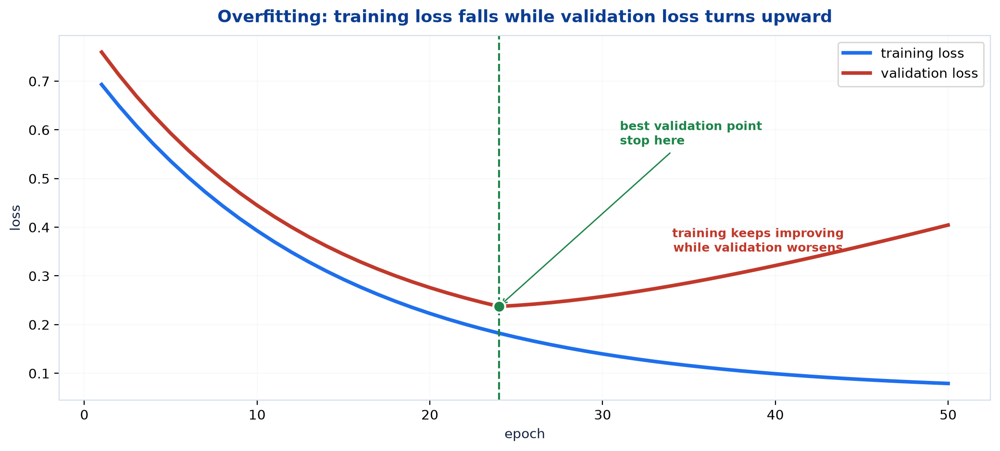
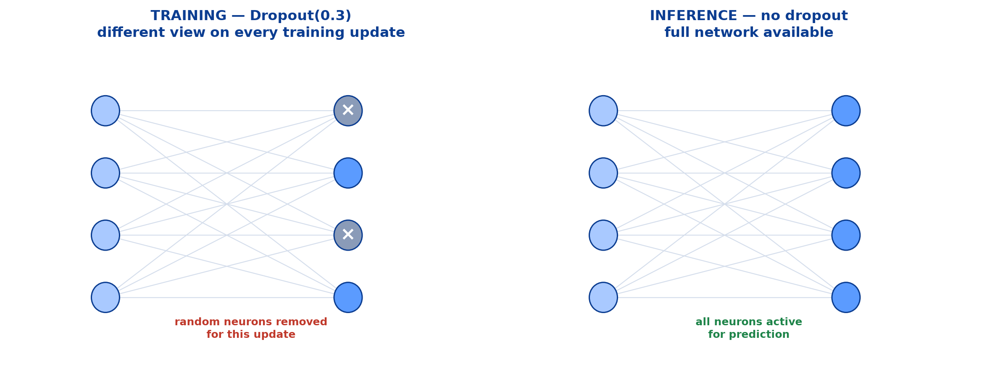
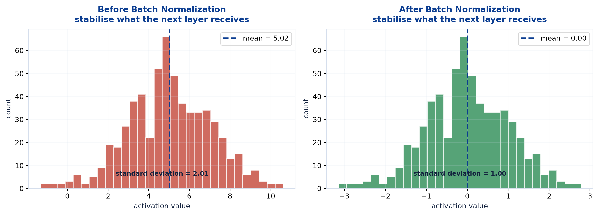
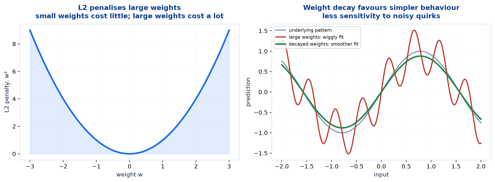

# <span style="color:#0B3D91">Regularization in Neural Networks</span>

> Study notes on preventing a neural network from memorising training data:
> **overfitting** → **Dropout** → **Batch Normalization** → **Early Stopping** →
> **L2 regularization / weight decay**. Training accuracy is not the goal; good performance on
> unseen data is.
>
> **A note on formulas:** equations are written in plain text inside code blocks rather than
> LaTeX, so they render correctly in any Markdown viewer.

---

## <span style="color:#1E6FEB">Table of Contents</span>

1. [The Problem — Overfitting](#1-the-problem--overfitting)
2. [Regularization — The Goal](#2-regularization--the-goal)
3. [Dropout](#3-dropout)
4. [Batch Normalization](#4-batch-normalization)
5. [Early Stopping](#5-early-stopping)
6. [Weight Decay — L2 Regularization](#6-weight-decay--l2-regularization)
7. [Choosing and Combining Techniques](#7-choosing-and-combining-techniques)

---

## <span style="color:#1E6FEB">1. The Problem — Overfitting</span>

### 1.1 Overview / What is it?

**Overfitting** happens when a model learns the training data too well, including its noise and
irrelevant patterns. It earns high training accuracy but performs poorly on unseen data.

```text
Overfitting = memorisation of training data
Generalization = useful performance on unseen data
```

### 1.2 Why does it matter for AI?

A 100% training score can be a failure disguised as success. The real job is not recalling rows
the network already saw; it is making reliable predictions for rows it has never seen.



### 1.3 Key Concepts

| Pattern | Training loss | Validation loss | Diagnosis |
|---|---|---|---|
| Both high | High | High | Underfitting — too simple / insufficient training |
| Both low, close | Low | Low | Good generalization |
| Gap grows | Low | **rising** | **Overfitting** — memorising noise |

The validation set is the honest referee. Training loss always votes “keep going”; validation loss
is the signal that tells you when extra training has stopped helping.

### 1.4 Simple Example

```text
Student who understands concepts:
  does well on practice questions AND the real exam

Student who memorised last year's answer sheet:
  perfect practice score, lost when questions change
```

The second student is an overfit network.

### 1.5 How it works

Large networks have huge capacity. With limited or noisy data, they can store accidental details:

```text
signal -> pattern that repeats in future data -> worth learning
noise  -> accident unique to training data   -> harmful to learn
```

Regularization makes memorising noise harder, nudging the network toward patterns that generalise.

### 1.6 Practical Example / Use Case

Always plot training and validation loss:

```python
history = model.fit(X_train, y_train, validation_split=0.2, epochs=100)
# Compare history.history["loss"] and history.history["val_loss"].
```

### 1.7 Key Takeaways

> - Overfitting means excellent training performance but poor unseen-data performance.
> - Training loss alone cannot diagnose it; validation loss can.
> - Regularization fights memorisation so the network learns signal instead of noise.

---

## <span style="color:#1E6FEB">2. Regularization — The Goal</span>

### 2.1 Overview / What is it?

**Regularization** means techniques that constrain learning enough to improve generalization.
They deliberately trade a little training performance for more reliable validation and test
performance.

### 2.2 Why does it matter for AI?

The tempting reaction to overfitting is “make the model more complex.” That is backwards. The
model already has enough capacity to fit noise; it needs a reason to prefer a simpler explanation.

### 2.3 Key Concepts

| Technique | Main mechanism |
|---|---|
| **Dropout** | Randomly deactivate neurons during training |
| **Batch Normalization** | Normalise layer activations within each batch |
| **Early Stopping** | Stop when validation performance stops improving |
| **Weight Decay / L2** | Penalise large weights |

### 2.4 Simple Example

```text
No regularization:
  "I can use any bizarre, fragile rule that fits this training row."

Regularization:
  "Simple, stable explanations cost less than bizarre, fragile ones."
```

### 2.5 How it works

These methods do not all attack overfitting identically. Dropout prevents co-dependence; L2 limits
weight size; early stopping limits how long memorisation can continue; batch normalization makes
training more stable and can have a mild regularising effect.

### 2.6 Practical Example / Use Case

There is no magic “regularize everything” recipe. Start with validation monitoring and one small,
measured intervention. Adding every technique at maximum strength is just underfitting with more
ceremony.

### 2.7 Key Takeaways

> - Regularization improves generalization, not training scores.
> - The four main techniques constrain learning in different ways.
> - Add techniques based on evidence from validation curves, not superstition.

---

## <span style="color:#1E6FEB">3. Dropout</span>

### 3.1 Overview / What is it?

**Dropout** randomly deactivates neurons during training.

- Prevents dependency on specific neurons
- Improves model generalization
- Is active **only during training**



### 3.2 Why does it matter for AI?

Without dropout, neurons can develop fragile co-dependencies: “I only work because that exact
neighbour is always available.” Dropout makes that unreliable. Each neuron must learn a useful
contribution that survives many different subnetworks.

### 3.3 Key Concepts

```text
Dropout(0.3)
-> randomly turn OFF 30% of incoming activations on each training update
-> retain 70%
-> choose a DIFFERENT random 30% on the next update
```

It is not removing the same neurons permanently. Every update sees a different partial network.
Training is effectively averaging many related networks that share weights.

### 3.4 Simple Example

```text
Training update 1:  h2 and h4 dropped
Training update 2:  h1 dropped
Training update 3:  h3 and h5 dropped

No neuron can safely rely on one particular partner always being present.
```

### 3.5 How it works — training versus inference

```text
TRAINING:  randomly drop activations
INFERENCE: use ALL neurons
```

To keep average activation size stable, frameworks use **inverted dropout**: retained activations
are scaled by `1 / keep_probability` during training. For `Dropout(0.3)`, the keep probability is
`0.7`, so retained activations are scaled by `1 / 0.7 = 1.4286`.

You do not implement this scaling yourself; Keras does it correctly.

### 3.6 Practical Example / Use Case

```python
model = keras.Sequential([
    layers.Dense(256, activation="relu"),
    layers.Dropout(0.3),
    layers.Dense(128, activation="relu"),
    layers.Dropout(0.2),
    layers.Dense(10, activation="softmax"),
])
```

Typical rates are `0.1–0.3`; `0.5` is strong and often used only when overfitting is obvious.
Dropout belongs after a hidden layer, not on the output probabilities.

### 3.7 Key Takeaways

> - Dropout randomly deactivates neurons **only during training**.
> - It prevents fragile co-dependence and improves generalization.
> - `Dropout(0.3)` drops 30%, keeps 70%, with a new random mask per update.
> - Inference uses the **full** network; frameworks handle the scaling.

---

## <span style="color:#1E6FEB">4. Batch Normalization</span>

### 4.1 Overview / What is it?

**Batch Normalization** normalizes activations within each layer.

- Stabilizes training
- Often accelerates convergence
- Can also help reduce overfitting



### 4.2 Why does it matter for AI?

During training, updates in an earlier layer keep changing the distribution seen by the next layer.
That moving target makes optimisation unstable. Batch Normalization keeps each layer's inputs in a
more predictable range.

### 4.3 Key Concepts

For a mini-batch, BatchNorm computes its mean and variance, then normalizes:

```text
x_normalized = (x - batch_mean) / sqrt(batch_variance + epsilon)
y = gamma * x_normalized + beta
```

- `epsilon` prevents division by zero.
- `gamma` and `beta` are learned parameters, letting the network restore any useful scale or shift.

Normalization does **not** force every layer to stay mean zero and standard deviation one forever;
`gamma` and `beta` preserve the model's flexibility.

### 4.4 Simple Example

```text
Before: mean = 5, standard deviation = 2
Normalize: mean ≈ 0, standard deviation ≈ 1
Then learn gamma and beta if a different range helps.
```

### 4.5 How it works

During training, BatchNorm uses statistics from the current mini-batch. During inference, it uses
running averages accumulated during training — otherwise the same input would change prediction
based on what unrelated inputs happened to share its batch.

### 4.6 Practical Example / Use Case

```python
layers.Dense(128, use_bias=False),
layers.BatchNormalization(),
layers.Activation("relu"),
```

When BatchNorm follows a dense layer, `use_bias=False` is commonly used because BatchNorm's learned
`beta` already supplies a shift. A separate Dense bias would be redundant.

### 4.7 Key Takeaways

> - BatchNorm normalizes activations within a mini-batch, then learns an optional scale and shift.
> - It stabilizes and often speeds training; it may also mildly regularize.
> - Training uses batch statistics; inference uses stored running statistics.
> - Dense bias is often redundant immediately before BatchNorm.

---

## <span style="color:#1E6FEB">5. Early Stopping</span>

### 5.1 Overview / What is it?

**Early Stopping** monitors validation performance and stops training when validation loss stops
improving.

```text
Training loss continues down.
Validation loss reaches its lowest point, then rises.
Stop at the lowest validation loss — not the final epoch.
```

### 5.2 Why does it matter for AI?

Training longer is not always training better. Once validation loss rises, additional epochs are
usually memorising noise. Early stopping saves compute and preserves the best generalising model.

### 5.3 Key Concepts

| Setting | Meaning |
|---|---|
| `monitor="val_loss"` | Watch validation loss |
| `patience=5` | Allow five non-improving epochs before stopping |
| `restore_best_weights=True` | Roll back to the best observed epoch |

**Patience matters.** Validation loss is noisy; stopping after one worse epoch is too twitchy.

### 5.4 Simple Example

```text
Epoch 20: val_loss = 0.22  <- best
Epoch 21: val_loss = 0.23
Epoch 22: val_loss = 0.22
Epoch 23: val_loss = 0.24
Epoch 24: val_loss = 0.25

With patience = 4: stop, restore epoch-20 weights.
```

### 5.5 How it works

Early stopping is regularization because it limits the time available for overfitting. It does not
change the architecture or loss; it chooses the training point with the best validation behaviour.

### 5.6 Practical Example / Use Case

```python
callback = keras.callbacks.EarlyStopping(
    monitor="val_loss",
    patience=5,
    restore_best_weights=True,
)
model.fit(X_train, y_train, validation_split=0.2, callbacks=[callback], epochs=100)
```

Always enable `restore_best_weights=True`; otherwise training stops late but leaves the model at
its last, potentially worse, weights. That would be a remarkably efficient way to defeat the
whole feature.

### 5.7 Key Takeaways

> - Early stopping halts training when validation loss stops improving.
> - Use **validation loss**, patience, and **restore the best weights**.
> - It prevents late-stage memorisation and saves compute.

---

## <span style="color:#1E6FEB">6. Weight Decay — L2 Regularization</span>

### 6.1 Overview / What is it?

**Weight Decay (L2 Regularization)** adds a penalty for large weights.

- Encourages simpler, more robust models
- Reduces model complexity and overfitting



### 6.2 Why does it matter for AI?

A large weight makes the output highly sensitive to one input. Networks with many large weights
can create sharp, brittle decision surfaces that fit training quirks beautifully and future data
poorly. L2 asks the model to earn every large weight.

### 6.3 Key Concepts

```text
total_loss = data_loss + lambda * sum(w^2)
```

`lambda` controls regularization strength.

With weights `[2.0, -1.0, 0.5]` and `lambda = 0.01`:

```text
L2 penalty = 0.01 * (2.0² + (-1.0)² + 0.5²)
           = 0.01 * 5.25
           = 0.0525
```

The gradient contribution is:

```text
2 * lambda * w = [0.04, -0.02, 0.01]
```

It points toward zero for every weight — hence the name **weight decay**.

### 6.4 Simple Example

```text
small weight:  0.5  -> penalty contribution 0.25
large weight:  5.0  -> penalty contribution 25.00
```

Ten times the weight costs one hundred times as much. The penalty is gentle for small useful
weights and aggressive for huge brittle ones.

### 6.5 How it works

The optimizer now balances two objectives:

```text
fit the training examples        -> lower data loss
keep the explanation simple      -> lower L2 penalty
```

A model can still use large weights if the data benefit is worth it; it just cannot do so for
free.

### 6.6 Practical Example / Use Case

```python
layers.Dense(
    128,
    activation="relu",
    kernel_regularizer=keras.regularizers.l2(1e-4),
)
```

For Adam, prefer **AdamW** rather than adding L2 inside the loss when the goal is ordinary weight
decay. AdamW decouples adaptive gradient learning from weight shrinkage, as Note 05 explained.

### 6.7 Key Takeaways

> - L2 adds `lambda * sum(w²)` to the loss, penalising large weights.
> - It favours smoother, less brittle functions and improves generalization.
> - The penalty grows quadratically: ten times the weight costs one hundred times more.
> - For Adam, **AdamW** is usually the clearer implementation of weight decay.

---

## <span style="color:#1E6FEB">7. Choosing and Combining Techniques</span>

### 7.1 Overview / What is it?

Regularization is diagnosis-driven. Use validation curves to decide whether you need it and how
much, rather than applying every method by reflex.

### 7.2 Why does it matter for AI?

Too little regularization overfits. Too much makes the network unable to learn the real pattern:
**underfitting**. The cure can become the disease. Charming.

### 7.3 Key Concepts

| Symptom | First thing to try |
|---|---|
| Train loss falls, validation loss rises | Early stopping; then modest dropout or decay |
| Training and validation both poor | Do **not** add regularization — investigate underfitting |
| Unstable / slow training | BatchNorm; check learning rate first |
| Very large network, modest dataset | Dropout + weight decay + early stopping |

### 7.4 Simple Example — sensible baseline

```python
model = keras.Sequential([
    layers.Dense(256, activation="relu"),
    layers.Dropout(0.3),
    layers.Dense(128, activation="relu"),
    layers.Dropout(0.2),
    layers.Dense(10, activation="softmax"),
])

model.compile(optimizer="adam", loss="categorical_crossentropy", metrics=["accuracy"])
```

Then monitor validation loss with Early Stopping. This is enough for a sensible first baseline;
do not pile on BatchNorm and heavy L2 until evidence says you need them.

### 7.5 How it works

Regularization techniques can combine because they attack different failure routes:

```text
Dropout       -> no fragile neuron co-dependence
BatchNorm     -> stable activations
Early stopping -> stop before late memorisation
Weight decay  -> discourage large, brittle weights
```

### 7.6 Practical Example / Use Case

A useful order of operations:

```text
1. Establish a simple baseline and validation curve.
2. Add Early Stopping — virtually free protection.
3. Add modest Dropout or AdamW weight decay if the gap remains.
4. Add BatchNorm if optimisation is unstable or the architecture warrants it.
5. Change one thing at a time; keep only improvements on validation data.
```

### 7.7 Key Takeaways

> - Diagnose from training-versus-validation curves before choosing regularization.
> - **Early stopping** is a low-cost first defence.
> - Add modest dropout or decay for persistent overfitting; use BatchNorm for training stability.
> - Too much regularization causes **underfitting** — measure every change.

---

## <span style="color:#1E6FEB">Summary — Regularization at a Glance</span>

```text
Overfitting = training data memorized, unseen data missed
Regularization = constraints that favour patterns which generalise
```

| Technique | What it does | Key rule |
|---|---|---|
| **Dropout** | Randomly turns neurons off | Training only; inference uses all neurons |
| **BatchNorm** | Normalizes activations | Uses batch stats in training, running stats in inference |
| **Early Stopping** | Stops at the best validation epoch | Restore best weights |
| **L2 / Weight Decay** | Penalizes large weights | Encourage smooth, robust behavior |

**The one-sentence version:** regularization deliberately makes training a little harder so that
the model learns stable signal instead of training-set trivia — because nobody deploys a model to
predict the data it already saw.

**Where this leads:** the learning machinery is now complete. The remaining topics apply it to
specific data structures: first **Convolutional Neural Networks**, which exploit the spatial
structure of images instead of treating pixels as an unordered list.

---

> **Navigation:** ← Previous: [05 — Optimizers](05_Deep_Learning_Optimizers.md) · Next → 07 — Convolutional Neural Networks
