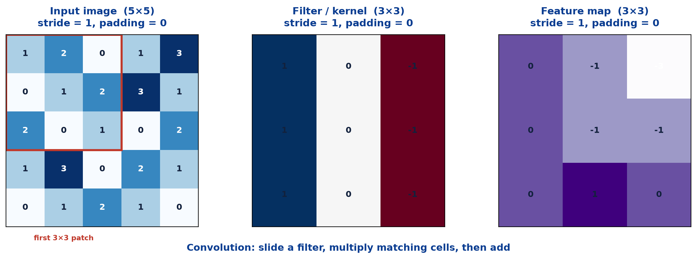
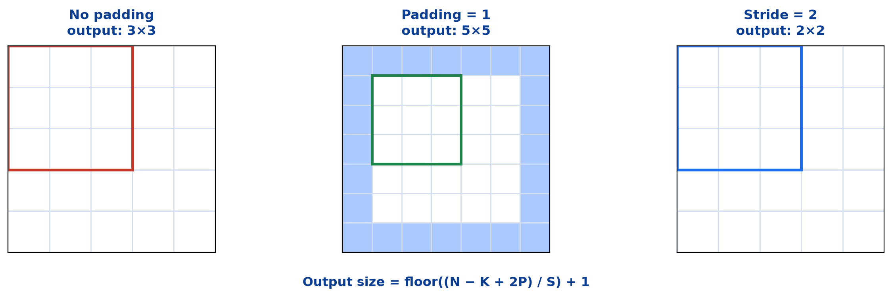
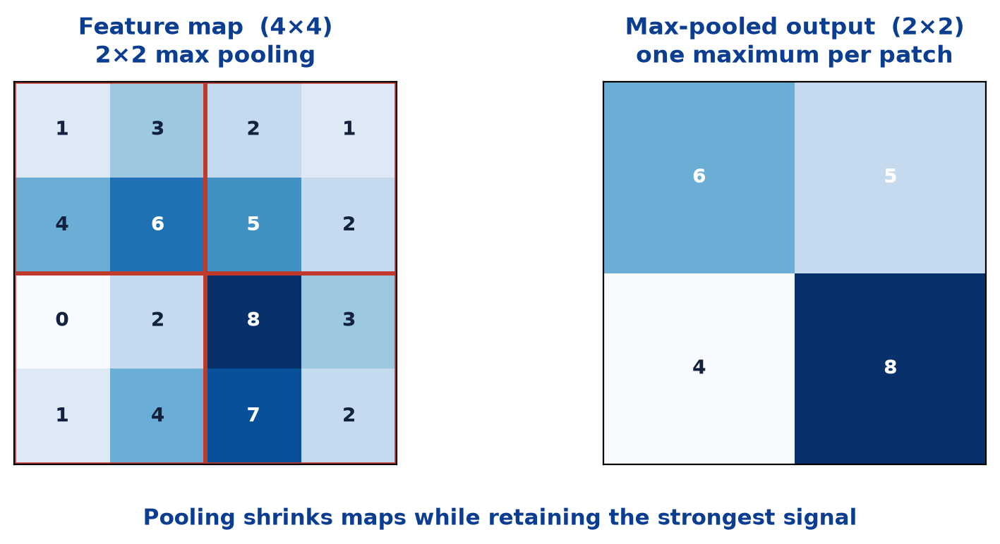
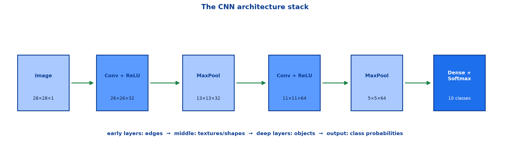

# <span style="color:#0B3D91">Convolutional Neural Networks (CNNs)</span>

> Study notes on neural networks designed for images and other grid-like data:
> **why ANNs struggle with images** → **filters and convolutions** → **feature maps** →
> **stride and padding** → **pooling** → **the CNN architecture stack** → **CNN vs ANN**.
>
> **A note on formulas:** equations are written in plain text inside code blocks rather than
> LaTeX, so they render correctly in any Markdown viewer.

---

## <span style="color:#1E6FEB">Table of Contents</span>

1. [Why CNNs?](#1-why-cnns)
2. [The Convolution Operation](#2-the-convolution-operation)
3. [Feature Maps, Filters & Channels](#3-feature-maps-filters--channels)
4. [Stride and Padding](#4-stride-and-padding)
5. [Pooling](#5-pooling)
6. [The Full CNN Architecture Stack](#6-the-full-cnn-architecture-stack)
7. [CNN versus ANN on Images](#7-cnn-versus-ann-on-images)

---

## <span style="color:#1E6FEB">1. Why CNNs?</span>

### 1.1 Overview / What is it?

A **Convolutional Neural Network (CNN)** is a specialised neural network designed to process and
analyse image data. CNNs exploit the **spatial structure** of images: nearby pixels are more
related than distant pixels.

**Key characteristics:**

- Automatically extracts visual features
- Detects edges, shapes, textures and objects
- Reduces the need for manual feature engineering

**Common applications:** image classification, face recognition, medical imaging.

### 1.2 Why does it matter for AI?

A plain ANN sees an image as an unordered vector. A 28×28 grayscale digit becomes 784 numbers:

```text
ANN sees: [pixel_1, pixel_2, pixel_3, ..., pixel_784]
```

It does not know that pixel 2 sits beside pixel 1, or that a small edge in the top-left should be
recognised equally well in the bottom-right. A CNN builds those facts into its architecture.

### 1.3 Key Concepts

| Property | Plain ANN | CNN |
|---|---|---|
| Input view | Flat list of pixels | 2-D image grid |
| Connections | Every input connects to every neuron | Small local patches connect to a filter |
| Parameters | Separate weight per connection | **Filter weights shared** across image |
| Spatial position | Forgotten by flattening | Preserved through feature maps |
| Best use | Structured/tabular data | Images and computer vision |

### 1.4 Simple Example

A vertical edge looks like this in pixel brightness:

```text
dark dark | light light
```

That edge could appear anywhere. An ANN must learn a separate “vertical edge at position X”
detector for every location. A CNN learns **one filter**, moves it everywhere, and reuses it.

### 1.5 How it works

CNNs rely on three ideas:

```text
Local receptive fields  -> inspect small nearby pixel patches
Parameter sharing       -> use the SAME filter at every position
Hierarchical features   -> edges -> textures -> shapes -> objects
```

### 1.6 Practical Example / Use Case

For handwritten digits, the local shape of a curved stroke matters far more than whether a pixel
was precisely input number 417. CNNs preserve and exploit that local structure, making them the
natural model for MNIST-like image classification.

### 1.7 Key Takeaways

> - CNNs are specialised neural networks for **images and grid-like data**.
> - They exploit the fact that nearby pixels are related.
> - Local patches, shared filters, and hierarchical feature learning are the core ideas.
> - A CNN preserves spatial structure; flattening an image into an ANN discards it.

---

## <span style="color:#1E6FEB">2. The Convolution Operation</span>

### 2.1 Overview / What is it?

A **filter** (also called a **kernel**) moves across the input. At every location it multiplies
matching cells, adds the results, and writes one number into a **feature map**.



### 2.2 Why does it matter for AI?

This single operation is how a CNN detects visual patterns such as edges, textures and shapes.
The filter learns its values during training; nobody manually programs an “edge detector.”

### 2.3 Key Concepts — worked first patch

Input patch and vertical-edge filter:

```text
input patch       filter
1 2 0             1  0 -1
0 1 2             1  0 -1
2 0 1             1  0 -1
```

Multiply matching cells, then sum:

```text
(1×1) + (2×0) + (0×-1)
+ (0×1) + (1×0) + (2×-1)
+ (2×1) + (0×0) + (1×-1)
= 1 + 0 + 0 + 0 + 0 - 2 + 2 + 0 - 1
= 0
```

That `0` is the top-left value in the output feature map. Move the filter one cell right and
repeat. The filter's response is high where its pattern appears and low where it does not.

### 2.4 Simple Example — one filter, many positions

```text
same 3×3 filter
  -> scan top-left patch
  -> scan next patch
  -> scan every legal patch
  -> one feature map recording "where did I see this pattern?"
```

**The filter weights do not change as it moves.** That is parameter sharing.

### 2.5 How it works

For a filter `K` and input patch `X`, one output cell is a dot product:

```text
feature_map[i, j] = sum_over_rows_and_columns( X_patch * K )
```

A convolutional layer has many filters, each free to learn a different pattern:

```text
filter 1 -> vertical edges
filter 2 -> horizontal edges
filter 3 -> curves
filter 4 -> textures
...
```

These labels are intuition, not hard-coded assignments. Training discovers what is useful.

### 2.6 Practical Example / Use Case

```python
layers.Conv2D(
    filters=32,
    kernel_size=(3, 3),
    activation="relu",
    input_shape=(28, 28, 1),
)
```

This creates 32 learned 3×3 filters for 28×28 grayscale images. Each filter produces one feature
map, so the output has 32 channels.

### 2.7 Key Takeaways

> - A filter/kernel moves across an image, computes a dot product at each location, and produces
>   a **feature map**.
> - Filters are learned, not hand-written.
> - **Parameter sharing** means one filter detects its pattern anywhere in the image.
> - A Conv2D layer has many filters, so it can detect many patterns at once.

---

## <span style="color:#1E6FEB">3. Feature Maps, Filters &amp; Channels</span>

### 3.1 Overview / What is it?

A **feature map** is the 2-D output produced by applying one filter across an image. A convolution
layer usually learns many filters, therefore it produces many feature maps, stacked as **channels**.

### 3.2 Why does it matter for AI?

This is how a CNN changes its representation layer by layer. It does not merely shrink images;
it turns raw pixels into progressively more meaningful learned features.

### 3.3 Key Concepts

```text
Input grayscale image: 28 × 28 × 1       one channel
32 filters:             26 × 26 × 32      32 feature maps / channels
64 filters later:       11 × 11 × 64      64 richer feature maps
```

For colour images:

```text
RGB input: height × width × 3
A 3×3 filter spans ALL three input channels: 3 × 3 × 3
```

It can therefore learn patterns involving colour as well as shape.

### 3.4 Simple Example

Imagine a filter that responds to a curved dark stroke. Its feature map may be bright at every
place a digit contains that curve and dark elsewhere. The next layer combines several such maps:

```text
curve map + vertical-stroke map + loop map -> "this may be an 8"
```

### 3.5 How it works

Early layers tend to learn simple local patterns. Later layers combine earlier maps and gain a
larger effective view of the input:

```text
pixels -> edges -> corners / textures -> parts -> objects
```

This hierarchy is why CNNs are so effective for vision.

### 3.6 Practical Example / Use Case

A CNN trained on medical images may learn low-level edges in its early filters, texture patterns
in intermediate layers, and medically relevant structures in deeper maps. It still needs proper
validation and expert review; a convincing feature map is not a clinical guarantee.

### 3.7 Key Takeaways

> - One filter produces one **feature map**; many filters produce many **channels**.
> - A CNN progressively converts pixels into learned visual features.
> - Early layers detect simple patterns; deeper layers combine them into higher-level structure.

---

## <span style="color:#1E6FEB">4. Stride and Padding</span>

### 4.1 Overview / What is it?

**Stride** controls how far a filter moves at each step. **Padding** adds border cells around an
input, usually zeros, before convolution.



### 4.2 Why does it matter for AI?

These two settings decide how much spatial information is retained, the output size, and the
compute cost of every convolution layer.

### 4.3 Key Concepts

```text
output size = floor((N − K + 2P) / S) + 1
```

- `N` = input width/height
- `K` = kernel size
- `P` = padding amount per side
- `S` = stride

For a 5×5 input and 3×3 kernel:

```text
P=0, S=1 -> floor((5-3+0)/1)+1 = 3       -> 3×3 output
P=1, S=1 -> floor((5-3+2)/1)+1 = 5       -> 5×5 output
P=0, S=2 -> floor((5-3+0)/2)+1 = 2       -> 2×2 output
```

### 4.4 Simple Example

```text
Stride = 1 -> look at every neighbouring patch -> detailed, larger feature map
Stride = 2 -> skip one position each move      -> cheaper, smaller feature map
Padding = 1 -> allow filter to inspect borders -> preserve input size with 3×3 filter
```

### 4.5 How it works

Without padding, border pixels appear in fewer filter windows than central pixels and spatial size
shrinks after every convolution. Padding gives borders a fair chance and preserves size when needed.

In Keras:

```python
layers.Conv2D(32, 3, strides=1, padding="valid")  # P=0, shrinks output
layers.Conv2D(32, 3, strides=1, padding="same")   # preserves size for stride 1
```

### 4.6 Practical Example / Use Case

Use `padding="same"` when you want several convolution layers to inspect an image without rapidly
shrinking it. Use strides greater than one or pooling when deliberately reducing resolution.

### 4.7 Key Takeaways

> - **Stride** controls filter movement and output downsampling.
> - **Padding** protects border information and can preserve spatial dimensions.
> - Output size: `floor((N − K + 2P) / S) + 1`.
> - `valid` means no padding; `same` generally preserves size.

---

## <span style="color:#1E6FEB">5. Pooling</span>

### 5.1 Overview / What is it?

**Pooling** shrinks feature maps while retaining their strongest signals. Stacking convolution and
pooling blocks builds from edges to full objects.



### 5.2 Why does it matter for AI?

Feature maps can become large. Pooling reduces computation, reduces later parameter counts, and
makes detection less sensitive to small shifts in position.

### 5.3 Key Concepts — max pooling

For 2×2 max pooling, each non-overlapping 2×2 patch becomes its largest value:

```text
1 3        2 1           6 5
4 6   ->   5 2     ->

0 2        8 3           4 8
1 4        7 2
```

```text
max(1,3,4,6) = 6
max(2,1,5,2) = 5
max(0,2,1,4) = 4
max(8,3,7,2) = 8
```

### 5.4 Simple Example

If an edge moves one pixel to the right, its exact feature-map location changes, but the maximum
inside a 2×2 pool may remain the same. Pooling therefore gives a little **translation tolerance**:
small shifts matter less.

### 5.5 How it works

```python
layers.MaxPooling2D(pool_size=(2, 2))
```

A 2×2 pool commonly halves height and width:

```text
26×26×32 -> 13×13×32
```

It retains the number of channels; it only reduces each map's spatial resolution.

### 5.6 Practical Example / Use Case

Pooling is common in classic CNNs. Some modern architectures use strided convolutions instead,
but the idea is the same: reduce resolution gradually while retaining useful feature information.

### 5.7 Key Takeaways

> - Pooling downsamples feature maps while retaining strong signals.
> - Max pooling takes one maximum from each local patch.
> - It reduces computation and provides tolerance to small position shifts.
> - Pooling reduces height/width, not channel count.

---

## <span style="color:#1E6FEB">6. The Full CNN Architecture Stack</span>

### 6.1 Overview / What is it?

A basic classifier alternates convolution and pooling, then converts the learned maps into class
probabilities.



### 6.2 Why does it matter for AI?

The stack shows why CNNs are more than one special filter. Each block builds on the representation
before it, creating a hierarchy from local pixel patterns to an image-level decision.

### 6.3 Key Concepts

```text
Image
-> Conv + ReLU       learn local features
-> MaxPool           reduce resolution
-> Conv + ReLU       combine into richer features
-> MaxPool           reduce resolution again
-> Flatten           convert maps into one vector
-> Dense + Softmax   output class probabilities
```

### 6.4 Simple Example — MNIST architecture

```python
model = keras.Sequential([
    layers.Conv2D(32, (3, 3), activation="relu", input_shape=(28, 28, 1)),
    layers.MaxPooling2D((2, 2)),
    layers.Conv2D(64, (3, 3), activation="relu"),
    layers.MaxPooling2D((2, 2)),
    layers.Flatten(),
    layers.Dense(128, activation="relu"),
    layers.Dropout(0.3),
    layers.Dense(10, activation="softmax"),
])
```

### 6.5 How it works

`Flatten()` does not learn features. It merely reshapes the final maps from something like
`5×5×64` into one vector of `1,600` values. Dense layers then combine the high-level features;
Softmax produces one probability per digit.

### 6.6 Practical Example / Use Case

Compile the multi-class model with the matching loss:

```python
model.compile(
    optimizer="adam",
    loss="categorical_crossentropy",
    metrics=["accuracy"],
)
```

Use `sparse_categorical_crossentropy` instead when labels are integers rather than one-hot vectors.

### 6.7 Key Takeaways

> - CNNs alternate **feature extraction** (convolution) and **downsampling** (pooling).
> - `Flatten` bridges convolutional maps to dense classification layers.
> - The output uses one Softmax neuron per mutually exclusive class.

---

## <span style="color:#1E6FEB">7. CNN versus ANN on Images</span>

### 7.1 Overview / What is it?

ANNs and CNNs can receive the same image classification task, but their architectural assumptions
are radically different.

### 7.2 Why does it matter for AI?

Choosing the architecture changes performance, memory use, and generalization. It is not merely a
matter of adding layers to the same model.

### 7.3 Key Concepts

| | ANN on MNIST | CNN on MNIST |
|---|---|---|
| Input shape | Flattened `784`-element vector | `28×28×1` image grid |
| Spatial neighbours | Lost | Preserved |
| Edge detector | Must learn separately by location | One filter shared everywhere |
| Parameters | Dense layers grow quickly | Small filters use far fewer connections |
| Typical result | Learns digits reasonably | Usually better accuracy and generalization |

### 7.4 Simple Example — parameter sharing

A dense connection from every 28×28 pixel to 256 neurons needs:

```text
784 × 256 + 256 biases = 200,960 parameters
```

A convolution layer with 32 grayscale 3×3 filters needs:

```text
3 × 3 × 1 × 32 + 32 biases = 320 parameters
```

The CNN is not weak; it is using a better prior: the same local pattern should mean the same thing
wherever it appears.

### 7.5 How it works

CNNs achieve better image performance through:

1. **Local receptive fields** — learn nearby-pixel patterns first.
2. **Parameter sharing** — the same learned filter works anywhere.
3. **Pooling/downsampling** — tolerate small translations and reduce computation.
4. **Feature hierarchy** — edges become shapes, shapes become objects.

### 7.6 Practical Example / Use Case

When comparing an ANN and CNN on handwritten digits, preprocess correctly:

```python
# ANN: flatten the image
x_ann = images.reshape(-1, 28 * 28)

# CNN: retain height, width and channel
x_cnn = images.reshape(-1, 28, 28, 1)
```

Feeding flattened data to a CNN discards the entire reason for choosing one.

### 7.7 Key Takeaways

> - CNNs outperform plain ANNs on images because they preserve and exploit spatial structure.
> - Parameter sharing massively reduces connections: 320 convolution parameters versus 200,960
>   for one 784→256 dense layer in the example.
> - For an ANN flatten; for a CNN preserve `(height, width, channels)`.

---

## <span style="color:#1E6FEB">Summary — CNNs at a Glance</span>

```text
Image -> learned filters -> feature maps -> pooling -> richer features -> class probabilities
```

| Term | One-line meaning |
|---|---|
| **Filter / kernel** | Small learned pattern detector sliding over the input |
| **Convolution** | Multiply a local patch by a filter and sum |
| **Feature map** | Where and how strongly a filter detected its pattern |
| **Stride** | Filter movement per step |
| **Padding** | Border cells added before convolution |
| **Pooling** | Downsample while retaining local strong signals |
| **Channels** | Stack of feature maps from many filters |

**The one-sentence version:** CNNs are neural networks that learn small reusable visual pattern
detectors, scan them across an image, and combine their maps from edges through shapes to objects.

**Where this leads:** images have spatial structure; language, speech and time series have
**sequence structure**. The next topic is RNNs and LSTMs, which reuse a cell over time and carry a
memory of earlier inputs.

---

> **Navigation:** ← Previous: [06 — Regularization](06_Deep_Learning_Regularization.md) · Next → 08 — RNNs & LSTMs
