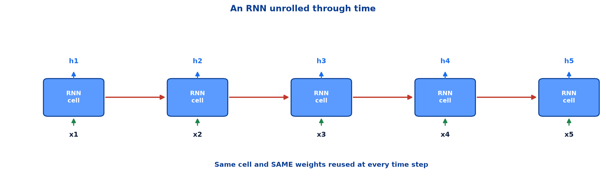
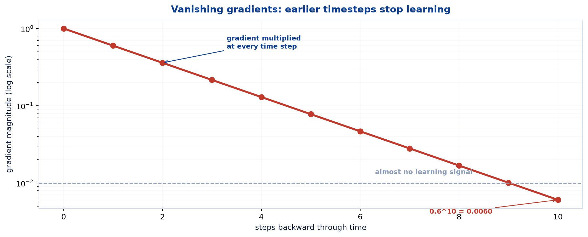
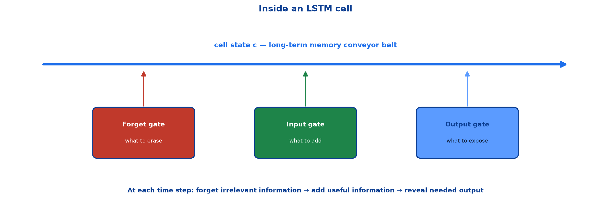

# <span style="color:#0B3D91">Recurrent Neural Networks (RNNs) &amp; Long Short-Term Memory (LSTM)</span>

> Study notes on neural networks for sequences and time series:
> **why sequence order matters** → **RNN memory** → **unrolling through time** →
> **vanishing gradients** → **LSTM cell state and gates** → **RNN vs LSTM**.
>
> **A note on formulas:** equations are written in plain text inside code blocks rather than
> LaTeX, so they render correctly in any Markdown viewer.

---

## <span style="color:#1E6FEB">Table of Contents</span>

1. [Why Sequential Data Needs a Different Model](#1-why-sequential-data-needs-a-different-model)
2. [Recurrent Neural Networks](#2-recurrent-neural-networks)
3. [Unrolling Through Time](#3-unrolling-through-time)
4. [The Vanishing Gradient Problem](#4-the-vanishing-gradient-problem)
5. [Long Short-Term Memory](#5-long-short-term-memory)
6. [Inside the LSTM Cell](#6-inside-the-lstm-cell)
7. [RNN versus LSTM](#7-rnn-versus-lstm)

---

## <span style="color:#1E6FEB">1. Why Sequential Data Needs a Different Model</span>

### 1.1 Overview / What is it?

**Sequential data** has an order. Earlier items affect how later items should be interpreted.

```text
Text:       "I did not like this movie"
Time series: Monday sales -> Tuesday sales -> Wednesday sales
Audio:      sound sample 1 -> sample 2 -> sample 3
```

Changing the order changes the meaning. An ANN treats inputs as an unordered feature list, so it
cannot naturally preserve this dependency.

### 1.2 Why does it matter for AI?

The word “not” can reverse an entire sentence. Yesterday's demand changes a reasonable forecast for
tomorrow. The architecture must retain relevant earlier information while processing the present.

### 1.3 Key Concepts

| Data type | Useful structure | Natural architecture |
|---|---|---|
| Customer row | Columns have no required order | ANN |
| Image | Nearby pixels matter | CNN |
| Sentence / speech / time series | **Order and history matter** | **RNN / LSTM** |

### 1.4 Simple Example

```text
"dog bites man" != "man bites dog"
```

The same words, different sequence, different meaning. A bag-of-words model loses this; a recurrent
model processes them in order.

### 1.5 How it works

An RNN carries a **hidden state** forward. At time `t`, it combines the new input with memory from
time `t-1`:

```text
h_t = f(W_x * x_t + W_h * h_(t-1) + b)
```

- `x_t` = current input
- `h_(t-1)` = previous hidden state / memory
- `h_t` = updated hidden state

### 1.6 Practical Example / Use Case

Common tasks: sentiment analysis, language modelling, time-series forecasting and speech processing.

### 1.7 Key Takeaways

> - Sequences require a model that understands **order** and retains relevant history.
> - RNNs combine the current item with a hidden memory of earlier items.
> - ANN for tables, CNN for images, RNN/LSTM for sequences is the basic architecture map.

---

## <span style="color:#1E6FEB">2. Recurrent Neural Networks</span>

### 2.1 Overview / What is it?

A **Recurrent Neural Network (RNN)** processes sequence data step by step while retaining
information from previous inputs.

**Key characteristics:**

- Maintains memory of past inputs
- Suitable for sequences and time series
- Processes data one time step at a time

### 2.2 Why does it matter for AI?

A normal feedforward network forgets its previous input as soon as it processes the next one. The
recurrent connection is the small architectural change that adds memory.

### 2.3 Key Concepts

```text
current word / time value + previous hidden state -> new hidden state -> next step
```

The hidden state is not a perfect transcript of the past. It is a learned compact summary of what
the model currently considers relevant.

### 2.4 Simple Example

For sentiment classification:

```text
"This film was ..."
```

After those three words, the RNN state carries context forward. When it later sees “excellent” or
“awful,” it combines that new word with the running context to decide sentiment.

### 2.5 How it works

The same learned weights are reused at each time step. This allows an RNN to process variable
length sequences without needing a separate model for every possible sentence length.

### 2.6 Practical Example / Use Case

```python
model = keras.Sequential([
    layers.Embedding(input_dim=10_000, output_dim=64),
    layers.SimpleRNN(64),
    layers.Dense(1, activation="sigmoid"),
])
```

An embedding layer turns integer word IDs into useful vectors; the RNN reads those vectors in order.

### 2.7 Key Takeaways

> - RNNs process a sequence one step at a time and retain a hidden state.
> - The hidden state is learned memory, not a literal copy of previous inputs.
> - The same weights are reused at each timestep, enabling variable-length sequences.

---

## <span style="color:#1E6FEB">3. Unrolling Through Time</span>

### 3.1 Overview / What is it?

An RNN is often drawn as one cell with a loop. To understand its computation, draw that same cell
once per timestep — **unrolled through time**.



### 3.2 Why does it matter for AI?

Unrolling reveals two critical facts: information travels left to right through time, and learning
must travel right to left through the same chain. That second journey causes the RNN’s main problem.

### 3.3 Key Concepts

```text
x1 -> [same RNN cell] -> h1
x2 -> [same RNN cell] -> h2
x3 -> [same RNN cell] -> h3
...
```

```text
h_t = f(W_x*x_t + W_h*h_(t-1) + b)
```

The drawing contains many boxes, but it is **one cell with one shared set of weights**, reused.

### 3.4 Simple Example

```text
word 1: "The"    -> h1
word 2: "movie"  -> h2 remembers "The movie"
word 3: "was"    -> h3 remembers "The movie was"
word 4: "great"  -> h4 supports positive sentiment
```

### 3.5 How it works

Backpropagation is applied through every unrolled copy of the cell. This is called **Backpropagation
Through Time (BPTT)**. Shared weights receive gradient contributions from every timestep, which are
summed before the update.

### 3.6 Practical Example / Use Case

A model can output at every timestep (next-word prediction, tagging) or only after the final step
(sentiment classification). The recurrent processing is the same; only the output arrangement differs.

### 3.7 Key Takeaways

> - Unrolling draws one RNN cell repeatedly across time.
> - It is still **one shared cell and one shared weight set**.
> - Training uses Backpropagation Through Time, carrying gradient information backward through the
>   unrolled sequence.

---

## <span style="color:#1E6FEB">4. The Vanishing Gradient Problem</span>

### 4.1 Overview / What is it?

During backpropagation through time, gradients are multiplied at every earlier timestep. When
those factors are below one, the gradient shrinks exponentially and early timesteps receive almost
no learning signal.



### 4.2 Why does it matter for AI?

A plain RNN may remember recent words but forget something important far earlier in a long sentence.
It is not merely a prediction flaw: the model literally cannot get a useful training signal back to
those early inputs.

### 4.3 Key Concepts

```text
gradient at earlier step = gradient now × factor_1 × factor_2 × ...
```

If each factor is `0.6`:

```text
0.6^1  = 0.6000
0.6^5  = 0.0778
0.6^10 = 0.0060
```

After ten steps, less than one percent of the original signal remains.

### 4.4 Simple Example

```text
"I grew up in France ... [many words later] ... so I speak fluent ____"
```

The correct final word depends on “France,” far back in the sequence. A plain RNN may have lost
that context before it reaches the blank.

### 4.5 How it works

The chain rule multiplies the recurrent connection’s derivative at every step. Factors less than
one vanish; factors greater than one can instead cause **exploding gradients**.

```text
factors < 1 -> vanishing gradients -> long-term memory fails
factors > 1 -> exploding gradients -> unstable updates
```

### 4.6 Practical Example / Use Case

Gradient clipping limits exploding gradients, but it does not solve forgetting. LSTM was designed
specifically to retain information and reduce vanishing gradients.

### 4.7 Key Takeaways

> - RNN gradients multiply backward through every timestep.
> - Factors below one shrink exponentially, starving early steps of learning signal.
> - This is why plain RNNs struggle with long-term dependencies.
> - LSTM was designed to fix this memory and gradient problem.

---

## <span style="color:#1E6FEB">5. Long Short-Term Memory</span>

### 5.1 Overview / What is it?

**Long Short-Term Memory (LSTM)** is an advanced RNN designed to remember important information
over long sequences.

**Key characteristics:**

- Handles long-term dependencies
- Reduces the vanishing gradient problem
- Uses gates to control information flow

**Common applications:** machine translation, speech recognition, text generation.

### 5.2 Why does it matter for AI?

A vanilla RNN has one hidden state forced to be both short-term workspace and long-term memory.
LSTM adds a separate **cell state**, an information highway designed to carry useful context farther.

### 5.3 Key Concepts

| Component | Job |
|---|---|
| **Cell state `c_t`** | Long-term memory flowing through the sequence |
| **Hidden state `h_t`** | Short-term output exposed to the next step |
| **Forget gate** | Decide what old memory to erase |
| **Input gate** | Decide what new information to store |
| **Output gate** | Decide what memory to expose now |

### 5.4 Simple Example

In the sentence:

```text
"The cat, which was sitting near the window for hours, was hungry."
```

The model should retain that the subject is singular (“cat”) across the long middle phrase. Gates
can preserve that feature while discarding irrelevant local detail.

### 5.5 How it works

LSTM gates produce values from 0 to 1 using sigmoid:

```text
0 -> block / forget
1 -> pass / retain
between -> retain part of the information
```

The cell state has an additive update path, unlike a plain RNN’s repeated full replacement. That
additive path lets gradients travel farther without repeatedly being crushed by multiplication.

### 5.6 Practical Example / Use Case

```python
model = keras.Sequential([
    layers.Embedding(input_dim=10_000, output_dim=64),
    layers.LSTM(64),
    layers.Dropout(0.3),
    layers.Dense(1, activation="sigmoid"),
])
```

This architecture processes encoded text and predicts positive/negative sentiment.

### 5.7 Key Takeaways

> - LSTM is an advanced RNN for **long-term dependencies**.
> - It adds a cell state and three gates: **forget, input, output**.
> - Gates control information flow rather than blindly overwriting memory.
> - The additive cell-state path reduces vanishing gradients.

---

## <span style="color:#1E6FEB">6. Inside the LSTM Cell</span>

### 6.1 Overview / What is it?

The cell state is a conveyor belt for long-term memory. At each step, three gates decide what is
forgotten, added and exposed.



### 6.2 Why does it matter for AI?

The gates are the mechanism behind LSTM’s long-memory claim. Without them, “LSTM remembers more”
is just branding with a very long name.

### 6.3 Key Concepts — gate sequence

```text
1. Forget gate: discard memory no longer useful
2. Input gate: decide what new information should enter memory
3. Update cell state: preserve selected old memory + add selected new memory
4. Output gate: decide what part of memory becomes this step's hidden output
```

The compact equations are:

```text
f_t = sigmoid(...)                         forget gate
 i_t = sigmoid(...)                         input gate
c_t = f_t * c_(t-1) + i_t * candidate      updated cell memory
o_t = sigmoid(...)                         output gate
h_t = o_t * tanh(c_t)                      hidden output
```

You do not need to derive these yet. Read them as “keep some old memory, add some new memory,
show some of the result.”

### 6.4 Simple Example

A sentence switches topic:

```text
"The restaurant was expensive. The service, however, was excellent."
```

An LSTM can reduce the influence of the earlier “expensive” information while retaining the context
that the review is about a restaurant, then expose the later “excellent” signal for sentiment.

### 6.5 How it works

The forget gate multiplies old memory by a value near 0 or 1. The input gate controls new candidate
memory. Crucially, selected memory can pass forward largely unchanged, giving long-range gradients
a route that does not repeatedly vanish.

### 6.6 Practical Example / Use Case

LSTM is useful when a decision depends on earlier context: long text, speech, machine translation,
or longer time-series patterns. It costs more than a plain RNN because each cell has multiple gates.

### 6.7 Key Takeaways

> - The cell state is LSTM’s long-term memory conveyor belt.
> - Forget gate: erase; input gate: add; output gate: expose.
> - `c_t = f_t*c_(t-1) + i_t*candidate` is the crucial keep-and-add update.
> - Gates make long-distance memory selective rather than accidental.

---

## <span style="color:#1E6FEB">7. RNN versus LSTM</span>

### 7.1 Overview / What is it?

Both architectures process sequences. The difference is memory design: a plain RNN carries one
hidden state; LSTM adds cell state plus controlled gates.

### 7.2 Why does it matter for AI?

Architecture choice affects whether a model can learn from information ten steps back or hundreds.
It also affects compute, parameters and training stability.

### 7.3 Key Concepts

| Feature | RNN | LSTM |
|---|---|---|
| Long-term dependencies | Struggles — vanishing gradients | Handles much better — cell state |
| Memory | Single hidden state | Cell state + hidden state |
| Gates | None | Forget / Input / Output |
| Training stability | Prone to vanishing/exploding gradients | More stable gradients |
| Parameters | Fewer | About 4× more per cell |
| Cost | Lower | Higher |
| Typical current use | Short/simple sequences, teaching | Long text, speech, longer time series |

### 7.4 Simple Example

```text
Short sensor sequence, immediate trend -> plain RNN might be enough
Long review where early context changes late words -> LSTM is safer
```

### 7.5 How it works

An LSTM needs roughly four sets of weights where a simple RNN needs one: one each for forget,
input, output and candidate memory. The additional cost pays for controlled memory and stronger
gradient flow.

### 7.6 Practical Example / Use Case

Today, LSTM is generally preferred over vanilla RNN when using recurrent models. For the course
scope, that is the key decision. Modern Transformer architectures are common for large language
tasks, but that is outside this topic's scope.

### 7.7 Key Takeaways

> - Both process sequences; LSTM has a more capable memory mechanism.
> - LSTM trades more parameters and compute for long-term dependencies and stable training.
> - Plain RNNs are rarely chosen alone for long sequence tasks; prefer LSTM when recurrent memory
>   is needed.

---

## <span style="color:#1E6FEB">Summary — RNNs &amp; LSTMs at a Glance</span>

```text
RNN:  current input + previous hidden state -> next hidden state
LSTM: current input + controlled cell memory -> next hidden state + long-term cell state
```

| Term | Meaning |
|---|---|
| Hidden state | Learned running summary of sequence history |
| Unrolling | Drawing one shared RNN cell at each timestep |
| BPTT | Backpropagation Through Time |
| Vanishing gradient | Learning signal shrinks across many timesteps |
| Cell state | LSTM’s long-term memory path |
| Gates | Controls for forgetting, adding and exposing memory |

**The one-sentence version:** RNNs add memory to neural networks by carrying a hidden state through
time, while LSTMs add a gated cell state so important information — and its learning signal — can
survive much longer sequences.

**Where this leads:** the final note compares every architecture covered — ANN, CNN, RNN and LSTM
— and gives a practical guide for choosing the right model and using pretrained models responsibly.

---

> **Navigation:** ← Previous: [07 — Convolutional Neural Networks](07_Deep_Learning_Convolutional_Neural_Networks.md) · Next → 09 — Architecture Comparison & Choosing the Right Model
