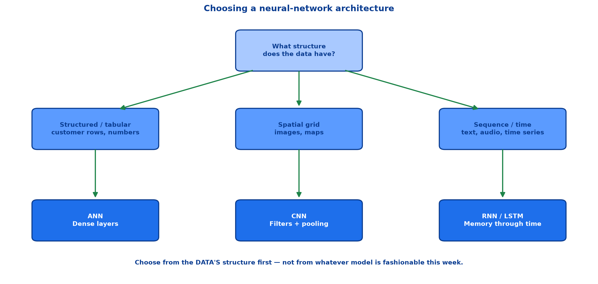
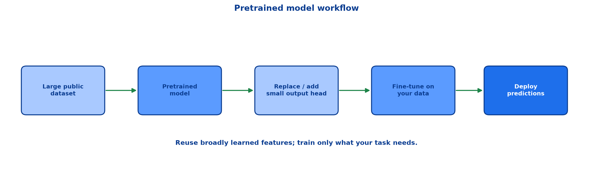

# <span style="color:#0B3D91">Architecture Comparison &amp; Choosing the Right Model</span>

> A practical capstone for the Deep Learning Basics collection:
> **ANN** for structured data → **CNN** for images → **RNN/LSTM** for sequences →
> **how to choose** → **pretrained models** → **an end-to-end decision checklist**.
>
> **A note on formulas:** equations are written in plain text inside code blocks rather than
> LaTeX, so they render correctly in any Markdown viewer.

---

## <span style="color:#1E6FEB">Table of Contents</span>

1. [The Architecture Map](#1-the-architecture-map)
2. [Artificial Neural Networks — ANN](#2-artificial-neural-networks--ann)
3. [Convolutional Neural Networks — CNN](#3-convolutional-neural-networks--cnn)
4. [Recurrent Neural Networks — RNN](#4-recurrent-neural-networks--rnn)
5. [Long Short-Term Memory — LSTM](#5-long-short-term-memory--lstm)
6. [How to Choose the Right Model](#6-how-to-choose-the-right-model)
7. [Pretrained Models and Transfer Learning](#7-pretrained-models-and-transfer-learning)
8. [End-to-End Decision Checklist](#8-end-to-end-decision-checklist)

---

## <span style="color:#1E6FEB">1. The Architecture Map</span>

### 1.1 Overview / What is it?

The best architecture follows the **structure of the data**. There is no universally best neural
network; each architecture makes assumptions that are useful for one structure and wasteful for
another.



| Architecture | Best for | Example applications |
|---|---|---|
| **ANN** | Structured / tabular data | Churn prediction, loan approval, regression |
| **CNN** | Images and computer vision | Face recognition, medical imaging |
| **RNN** | Short sequences / simple time series | Sentiment analysis, basic forecasting |
| **LSTM** | Long sequences | Translation, speech recognition, long time series |

### 1.2 Why does it matter for AI?

Architecture is not a decoration added after choosing a dataset. It decides what relationships a
model can exploit: columns, spatial neighbours, or time order. A wrong architecture can spend
millions of parameters rediscovering structure a better model would know from the start.

### 1.3 Key Concepts

```text
Table:    order between columns usually does not matter -> ANN
Image:    nearby pixels are related                    -> CNN
Sequence: earlier values change later meaning          -> RNN / LSTM
```

### 1.4 Simple Example

```text
Customer: [age, income, tenure, spend]      -> ANN
Digit:    28×28 pixels                      -> CNN
Review:   word 1 -> word 2 -> ... -> word n -> LSTM
```

### 1.5 How it works

All four are neural networks trained with the same loop:

```text
forward pass -> loss -> backpropagation -> optimizer update
```

They differ in how neurons connect:

```text
ANN:  dense connections between layers
CNN:  local shared filters across spatial locations
RNN:  shared cell connected through time
LSTM: recurrent cell plus gated long-term memory
```

### 1.6 Practical Example / Use Case

Begin model selection by asking **what structure exists in the raw input**, not by asking what
model name is currently trendy. This one habit avoids most needless architecture choices.

### 1.7 Key Takeaways

> - ANN, CNN, RNN and LSTM share training mechanics but make different structural assumptions.
> - Choose based on **tabular vs spatial vs sequential** data.
> - The data structure, not fashion, should choose the architecture.

---

## <span style="color:#1E6FEB">2. Artificial Neural Networks — ANN</span>

### 2.1 Overview / What is it?

An **ANN** uses fully connected layers: every input in one layer connects to every neuron in the
next. It treats input features as an unordered numeric vector.

### 2.2 Why does it matter for AI?

ANN is the foundation of deep learning and the best default neural architecture for structured
tables whose columns already have meaningful feature definitions.

### 2.3 Key Concepts

```text
x -> Dense + ReLU -> Dense + ReLU -> output
```

It learns relationships and interactions between inputs but has no built-in understanding of pixel
neighbourhoods or sequence order.

### 2.4 Simple Example

```text
Inputs:  tenure, monthly spend, support tickets, plan type
Output:  probability the customer churns
```

A dense network can combine the inputs into non-linear interactions such as “short tenure AND many
tickets AND rising spend.”

### 2.5 How it works

Each dense layer computes:

```text
z = W*x + b
a = activation(z)
```

Hidden layers construct features; the output activation follows the task: Linear for regression,
Sigmoid for binary classification, Softmax for mutually exclusive classes.

### 2.6 Practical Example / Use Case

```python
model = keras.Sequential([
    layers.Dense(32, activation="relu", input_shape=(n_features,)),
    layers.Dropout(0.2),
    layers.Dense(1, activation="sigmoid"),
])
```

For small and medium tabular datasets, compare against tree methods too. Deep Learning is not an
automatic upgrade over gradient boosting or Random Forest.

### 2.7 Key Takeaways

> - ANN is best suited to structured/tabular numeric features.
> - Dense layers learn interactions but do not know spatial position or time order.
> - Match the output activation to the prediction task.

---

## <span style="color:#1E6FEB">3. Convolutional Neural Networks — CNN</span>

### 3.1 Overview / What is it?

A **CNN** learns reusable local filters that move across a grid-like input, creating feature maps
and combining them into increasingly complex visual patterns.

### 3.2 Why does it matter for AI?

Images are not bags of pixels. CNNs preserve spatial neighbours and reuse the same learned pattern
detector anywhere in an image — fewer parameters, stronger assumptions, better generalization.

### 3.3 Key Concepts

```text
pixels -> filters / feature maps -> pooling -> richer features -> class probabilities
```

| CNN concept | Job |
|---|---|
| Filter / kernel | Local learned pattern detector |
| Convolution | Apply the filter across the grid |
| Feature map | Record filter response by location |
| Pooling | Reduce spatial size while retaining strong signals |
| Channels | Multiple learned feature maps stacked together |

### 3.4 Simple Example

A filter trained to detect a vertical edge works whether that edge appears in the top-left or
bottom-right. A dense ANN would need to learn that pattern repeatedly at many positions.

### 3.5 How it works

CNN blocks often repeat:

```text
Conv + ReLU -> Pool -> Conv + ReLU -> Pool -> Flatten -> Dense + Softmax
```

Early blocks find edges; later blocks combine them into textures, shapes and object parts.

### 3.6 Practical Example / Use Case

Use a CNN for image classification, face recognition, quality inspection, image segmentation and
medical images. Retain image shape `(height, width, channels)` rather than flattening it.

### 3.7 Key Takeaways

> - CNNs are designed for spatial data such as images.
> - Shared local filters detect patterns anywhere, reducing parameters and preserving structure.
> - Use CNN rather than ANN when spatial neighbourhood matters.

---

## <span style="color:#1E6FEB">4. Recurrent Neural Networks — RNN</span>

### 4.1 Overview / What is it?

An **RNN** processes one sequential item at a time and carries a hidden state forward as memory.

### 4.2 Why does it matter for AI?

Order changes meaning in text, speech and time series. The recurrent connection carries earlier
context into the interpretation of the next input.

### 4.3 Key Concepts

```text
h_t = f(W_x*x_t + W_h*h_(t-1) + b)
```

The same RNN cell and weights are reused at every timestep.

### 4.4 Simple Example

```text
"I did not like it"
```

The word “not” changes how “like” should be read. A sequential model can carry it forward.

### 4.5 How it works

Training unrolls the cell across time and applies Backpropagation Through Time. Repeated gradient
multiplication causes plain RNNs to struggle with long-term dependencies.

### 4.6 Practical Example / Use Case

Plain RNN is appropriate as a learning model or for short/simple sequences. For long context,
prefer LSTM when using recurrent architectures.

### 4.7 Key Takeaways

> - RNNs process sequences while carrying hidden-state memory forward.
> - They respect sequence order but struggle with long-distance memory due to vanishing gradients.

---

## <span style="color:#1E6FEB">5. Long Short-Term Memory — LSTM</span>

### 5.1 Overview / What is it?

An **LSTM** is an advanced RNN with a cell state and forget/input/output gates that control
long-term memory.

### 5.2 Why does it matter for AI?

Long context is where a plain RNN breaks down. LSTM adds a controlled memory path that lets useful
information and gradients survive farther through a sequence.

### 5.3 Key Concepts

| LSTM part | Job |
|---|---|
| Cell state | Long-term memory conveyor belt |
| Forget gate | Decide what to discard |
| Input gate | Decide what new information to retain |
| Output gate | Decide what memory to expose |

### 5.4 Simple Example

```text
"The cat, which sat by the window for hours, was hungry."
```

The model can retain the singular subject “cat” while ignoring much of the long intervening phrase.

### 5.5 How it works

```text
c_t = forget_gate * c_(t-1) + input_gate * candidate
```

The additive cell-state update is the key: selected memory can pass through without being fully
recomputed at every timestep.

### 5.6 Practical Example / Use Case

Use LSTM for longer text, speech recognition, machine translation and longer time-series patterns.
It costs more compute and parameters than an RNN, but is much more stable for long dependencies.

### 5.7 Key Takeaways

> - LSTM is a recurrent model designed for long-term dependencies.
> - Gates control what to forget, add and expose.
> - It trades higher compute for stronger long-distance memory and training stability.

---

## <span style="color:#1E6FEB">6. How to Choose the Right Model</span>

### 6.1 Overview / What is it?

Model selection is a structured decision, not a guessing contest.

### 6.2 Why does it matter for AI?

A mismatched model wastes data, compute and time. A simple correct architecture usually beats a
complicated incorrect one — the universe does occasionally permit mercy.

### 6.3 Key Concepts — decision guide

```text
Is the input a customer/product/transaction table?
  -> ANN (and compare tree-based ML baselines)

Is the input an image or a spatial grid?
  -> CNN

Is the input ordered text, audio, or time series?
  -> RNN for short/simple history; LSTM for long dependencies

Is labelled data limited but a relevant pretrained model exists?
  -> Use transfer learning before training from scratch
```

### 6.4 Simple Example

| Problem | Correct first choice | Why |
|---|---|---|
| Customer churn | ANN / tree baseline | Structured columns |
| Handwritten digit | CNN | Nearby pixels form strokes |
| Movie-review sentiment | LSTM | Word order and earlier context matter |
| Long speech transcript | LSTM | Dependencies can span many steps |

### 6.5 How it works

After choosing based on data structure, select output shape and loss from the task:

| Task | Output activation | Loss |
|---|---|---|
| Regression | Linear | MSE |
| Binary classification | Sigmoid | Binary Cross-Entropy |
| Multi-class classification | Softmax | Categorical Cross-Entropy |

Architecture and output/loss are separate choices. CNN for an image says nothing about whether its
output should be one numeric price, one binary probability, or ten class probabilities.

### 6.6 Practical Example / Use Case

Always establish a baseline, retain a validation set, and compare with the metric that matches the
business goal. A model that is architecturally elegant but does not improve validation performance
is decoration, not progress.

### 6.7 Key Takeaways

> - Start with the **data structure**, then select output and loss from the task.
> - ANN: tables; CNN: spatial grids; RNN/LSTM: ordered sequences.
> - Use the simplest architecture that reaches validated performance.
> - Compare against a baseline; do not confuse architectural novelty with improvement.

---

## <span style="color:#1E6FEB">7. Pretrained Models and Transfer Learning</span>

### 7.1 Overview / What is it?

A **pretrained model** has already learned useful features from a large public dataset. **Transfer
learning** reuses those features for a related new task rather than training every layer from zero.



### 7.2 Why does it matter for AI?

Most projects do not own millions of labelled images or text documents. A pretrained model lets you
begin with useful edges, shapes or language patterns and learn only the task-specific pieces.

### 7.3 Key Concepts

```text
Pretraining:       learn broad reusable features from a large dataset
Feature extraction: freeze the pretrained body; train a new output head
Fine-tuning:       unfreeze some later layers; update gently on your data
```

### 7.4 Simple Example

A visual model trained to recognize many objects already knows generic edges, textures and shapes.
For a small flower classifier:

```text
keep its learned visual feature extractor
replace its 1,000-class output head with a 3-class flower head
train the small new head on flower images
```

### 7.5 How it works

```python
base = keras.applications.MobileNetV2(
    weights="imagenet",
    include_top=False,
    input_shape=(224, 224, 3),
)
base.trainable = False

model = keras.Sequential([
    base,
    layers.GlobalAveragePooling2D(),
    layers.Dense(3, activation="softmax"),
])
```

After the new head learns, selectively unfreeze late base layers only if validation data supports
it. Fine-tuning everything immediately with a high learning rate can erase useful pretrained
features — a very expensive form of impatience.

### 7.6 Practical Example / Use Case

Use pretrained models when your new task is related to the original domain and labelled data is
limited. For unrelated domains, transfer may help less; validate rather than assuming a famous
model understands your problem.

### 7.7 Key Takeaways

> - Pretrained models reuse features learned from large datasets.
> - Freeze the base first, train a task-specific output head, then fine-tune cautiously if needed.
> - Transfer learning reduces labelled-data and compute requirements, but must be validated.

---

## <span style="color:#1E6FEB">8. End-to-End Decision Checklist</span>

### 8.1 Overview / What is it?

A compact process for selecting, training and evaluating a model without skipping the boring steps
that prevent expensive mistakes.

### 8.2 Why does it matter for AI?

The best architecture cannot rescue data leakage, a mismatched loss, no validation set, or a model
that was never compared to a baseline. Engineering is annoyingly holistic.

### 8.3 Key Concepts — checklist

```text
[ ] Identify the input structure: table, image/grid, or sequence.
[ ] Choose ANN, CNN, RNN, or LSTM accordingly.
[ ] Choose output activation and loss from the task.
[ ] Split training, validation and test data correctly.
[ ] Start with a small baseline and Adam.
[ ] Monitor validation loss; use Early Stopping.
[ ] Add regularization only when validation evidence says overfitting.
[ ] Try pretrained transfer learning when relevant.
[ ] Evaluate once on a final untouched test set.
[ ] Record preprocessing, architecture, loss, optimizer and metrics.
```

### 8.4 Simple Example

For ten-category image classification:

```text
structure: image grid -> CNN
output: 10 mutually exclusive categories -> Softmax
loss: categorical cross-entropy
training: Adam + validation monitoring + Early Stopping
small dataset: test a pretrained vision model
```

### 8.5 How it works

The sequence prevents common category errors: flattening images into an ANN by habit, applying
Softmax to multi-label problems, treating training accuracy as validation, or training a large
model from scratch when reusable features exist.

### 8.6 Practical Example / Use Case

Use the checklist in a project README beside the experiment result. Future-you will need it when
trying to reproduce a “great” model from six weeks ago and discovering nobody recorded which
normalization or split it used. Future-you is not amused by mysteries.

### 8.7 Key Takeaways

> - Architecture selection starts with input structure.
> - Output activation/loss follows the prediction task.
> - Validate every choice against held-out data and record the setup.
> - Pretrained models are often the fastest responsible path to useful results.

---

## <span style="color:#1E6FEB">Summary — Architecture Choice at a Glance</span>

| If your data is... | Start with... | The reason |
|---|---|---|
| Structured table | **ANN** | Learns interactions among numeric/categorical features |
| Image / spatial grid | **CNN** | Local shared filters preserve spatial structure |
| Short ordered sequence | **RNN** | Carries a hidden state through time |
| Long ordered sequence | **LSTM** | Gated cell state handles long-term dependencies |

```text
1. Choose architecture from data structure.
2. Choose activation + loss from task.
3. Establish a validated baseline.
4. Use regularization and pretrained features where evidence supports them.
```

**The one-sentence version:** ANN, CNN, RNN and LSTM are not competing buzzwords — they are
specialised tools for table, spatial and sequential structure, and the correct model is the one
whose built-in assumptions match the data you actually have.

---

> **Navigation:** ← Previous: [08 — RNNs & LSTMs](08_Deep_Learning_RNNs_And_LSTMs.md) · End of Deep Learning Basics notes
