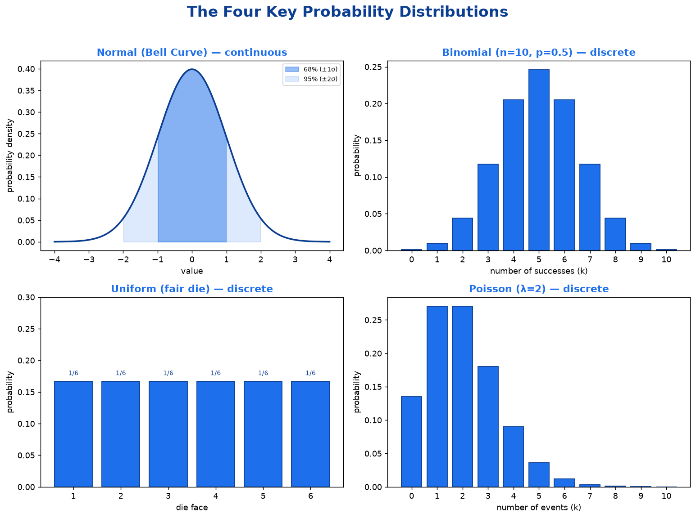
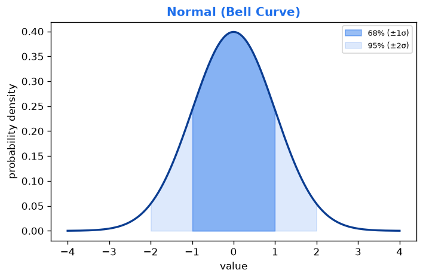
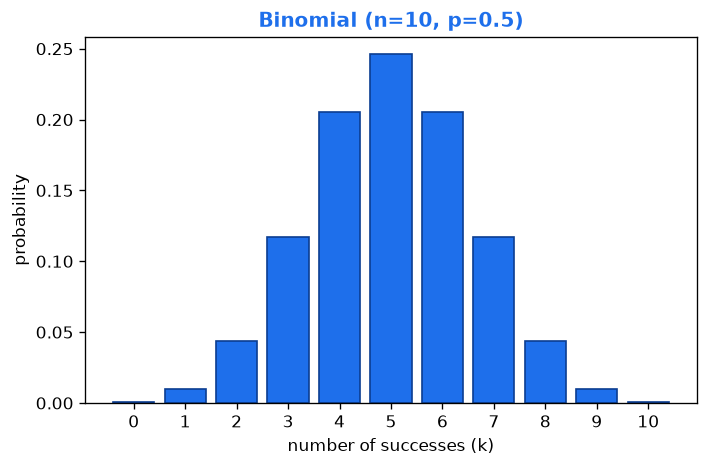
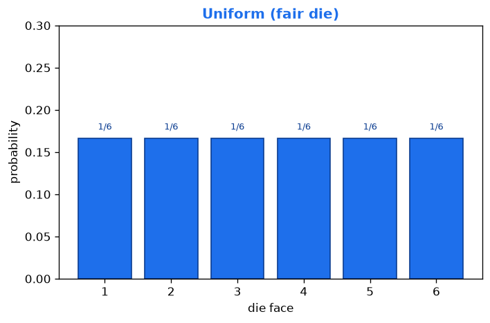
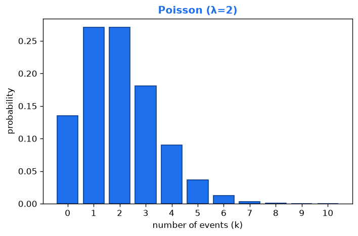

# Mathematics Foundations: Counting, Probability &amp; Statistics

> Study notes covering the building blocks of counting, probability, and statistics — from factorials and arrangements, through Bayes' Theorem and descriptive statistics, to distributions and sampling.
> A complete, intuition-first foundation for data science, machine learning, and AI.

---

## Table of Contents

1. [Factorial](#1-factorial)
2. [Permutations](#2-permutations)
3. [Combinations](#3-combinations)
4. [Probability](#4-probability)
5. [Bayes' Theorem](#5-bayes-theorem)
6. [Descriptive Statistics: Mean, Median, Variance & Standard Deviation](#6-descriptive-statistics-mean-median-variance--standard-deviation)
7. [Distributions](#7-distributions)
8. [Sampling](#8-sampling)

---

## 1. Factorial

### 1.1 Theory
A **factorial** is a fancy way of saying: *"multiply a whole number by every whole number below it, all the way down to 1."*

Factorials count **the number of ways to arrange things**. Whenever you ask "in how many different orders can I line these up?", a factorial is lurking nearby. It is the backbone of permutations, combinations, and a big chunk of probability.

### 1.2 Mathematical Formula

$$
n! = n \times (n - 1) \times (n - 2) \times \dots \times 2 \times 1
$$

- **n** → the number you start with (must be a non-negative whole number)
- **n!** → read aloud as *"n factorial"*
- Each term is just the previous number minus 1, until you reach 1.

**Special rule** (easy to forget):

$$
0! = 1
$$

Factorial of zero is **1**, not 0. There is exactly *one* way to arrange nothing — do nothing.

### 1.3 Mathematical Example
Compute **5!**

$$
5! = 5 \times 4 \times 3 \times 2 \times 1
$$

Step-by-step:

- 5 × 4 = 20
- 20 × 3 = 60
- 60 × 2 = 120
- 120 × 1 = 120

$$
\therefore 5! = 120
$$

### 1.4 Real-World Example
Imagine you have **5 books** and one shelf. In how many different orders can you arrange them?

- 1st slot: 5 choices
- 2nd slot: 4 remaining books
- 3rd slot: 3 left
- 4th slot: 2 left
- 5th slot: 1 last book

$$
5 \times 4 \times 3 \times 2 \times 1 = 120 \text{ different arrangements}
$$

### 1.5 Key Takeaway
> **Factorial (n!) = the product of all whole numbers from n down to 1, and it counts how many ways you can arrange n distinct things.**
> Don't forget the oddball: **0! = 1**.

---

## 2. Permutations

### 2.1 Theory
A **permutation** is an arrangement of things where **order matters**.

Factorials count how many ways to arrange *all* your items. A permutation lets you arrange only **some** of them. For example, with 10 runners, how many ways can they finish 1st, 2nd, and 3rd? You are picking a few items *and* caring about the order they land in.

The key phrase: **"order matters."** A gold medal vs. a silver medal is a *different* outcome, so each is counted separately.

### 2.2 Mathematical Formula

$$
P(n, r) = \frac{n!}{(n - r)!}
$$

- **n** → total number of items you have to choose from
- **r** → how many you are actually arranging (picking)
- **n!** → factorial of the total
- **(n − r)!** → factorial of the leftovers you didn't pick
- **P(n, r)** → the number of possible ordered arrangements

**Intuition:** start with n! (all arrangements), then divide out the (n − r)! arrangements of the items you didn't care about.

### 2.3 Mathematical Example
You have **5 people** and want to pick **3** of them for 1st, 2nd, and 3rd place. How many ways?

Here n = 5 and r = 3.

$$
P(5, 3) = \frac{5!}{(5 - 3)!} = \frac{5!}{2!} = \frac{5 \times 4 \times 3 \times 2 \times 1}{2 \times 1} = \frac{120}{2} = 60
$$

$$
\therefore P(5, 3) = 60 \text{ ways}
$$

**Quick shortcut:** multiply the top r numbers → 5 × 4 × 3 = 60. Same answer, less work.

### 2.4 Real-World Example
Think about a **4-digit PIN** where digits can't repeat, using digits 0–9.

- 1st digit: 10 choices
- 2nd digit: 9 left
- 3rd digit: 8 left
- 4th digit: 7 left

$$
P(10, 4) = 10 \times 9 \times 8 \times 7 = 5{,}040 \text{ possible PINs}
$$

Order absolutely matters here — 1234 is a totally different PIN from 4321.

### 2.5 Key Takeaway
> **A permutation counts arrangements where order matters, using P(n, r) = n! / (n − r)!**
> If swapping two items gives you a *different* result, you're dealing with a permutation.

---

## 3. Combinations

### 3.1 Theory
A **combination** is a selection of things where **order does NOT matter**.

This is the twin sibling of permutations — with one crucial difference. Permutations care about order (gold vs. silver medal = different outcomes); combinations *don't*. Picking {Alice, Bob, Carol} for a team is the **same** as picking {Carol, Alice, Bob}. Same people, same group, one outcome.

The key phrase: **"order doesn't matter."** If shuffling your chosen items gives you the *same* group, you're dealing with a combination. Because we ignore order, combinations always give a **smaller number** than permutations for the same n and r.

### 3.2 Mathematical Formula

$$
C(n, r) = \binom{n}{r} = \frac{n!}{r! \, (n - r)!}
$$

- **n** → total number of items to choose from
- **r** → how many you are selecting
- **n!** → factorial of the total
- **r!** → factorial of your selection (this is what kills the ordering)
- **(n − r)!** → factorial of the leftovers
- **C(n, r)** → the number of possible unordered selections

**Intuition:** it's just the permutation formula P(n, r) with an extra ÷ r!. That r! erases all the different orderings of the same group, since we no longer care about them.

### 3.3 Mathematical Example
You have **5 people** and want to pick **3** for a team (no ranks, just a group). How many ways?

Here n = 5 and r = 3.

$$
C(5, 3) = \frac{5!}{3! \,(5 - 3)!} = \frac{5!}{3! \times 2!} = \frac{120}{6 \times 2} = \frac{120}{12} = 10
$$

$$
\therefore C(5, 3) = 10 \text{ teams}
$$

**Compare to permutations:** earlier, P(5, 3) = 60. Combinations gave only 10 — exactly 6× smaller, because each group of 3 can be ordered in 3! = 6 ways, and combinations lump all 6 into one.

### 3.4 Real-World Example
A **lottery**: you pick **6 numbers** out of **49**, and the draw order doesn't matter — you just need to match the set.

$$
C(49, 6) = \frac{49!}{6! \times 43!} = 13{,}983{,}816 \text{ possible tickets}
$$

Nearly **14 million** equally-likely combinations — which is exactly why winning is so hard.

### 3.5 Key Takeaway
> **A combination counts selections where order does NOT matter, using C(n, r) = n! / [ r! × (n − r)! ]**
> It's a permutation divided by r! — because we stop caring about the order of what we picked.

**Cheat sheet:**
- **Permutation** → order matters → *arrangement* (PIN codes, race rankings)
- **Combination** → order doesn't matter → *selection* (teams, lottery, pizza toppings)
- Mnemonic: **"A Committee is a Combination"** — nobody on a committee is ranked, they're just chosen.

---

## 4. Probability

### 4.1 Theory
**Probability** is a number that measures **how likely something is to happen**. It always lies between **0 and 1**:

- **0** → impossible (it will *never* happen)
- **1** → certain (it will *definitely* happen)
- **0.5** → a coin-flip, equally likely to happen or not

This is where counting pays off — to find a probability, we often count the favorable outcomes and divide by all possible outcomes. Probability is the mathematical language of uncertainty.

### 4.2 Mathematical Formula

$$
P(A) = \frac{\text{favorable outcomes}}{\text{total outcomes}}, \qquad 0 \le P(A) \le 1
$$

- **P(A)** → the probability of event A happening
- **favorable outcomes** → the results you want / are counting
- **total outcomes** → every possible result (the whole sample space)

**Companion rules:**

$$
P(\text{not } A) = 1 - P(A) \quad \text{(complement rule)}
$$

$$
P(A \text{ or } B) = P(A) + P(B) \quad \text{(addition rule, mutually exclusive events)}
$$

$$
P(A \text{ and } B) = P(A) \times P(B) \quad \text{(multiplication rule, independent events)}
$$

### 4.3 Mathematical Example
What's the probability of rolling an **even number** on a fair 6-sided die?

- Favorable outcomes → {2, 4, 6} → 3 outcomes
- Total outcomes → {1, 2, 3, 4, 5, 6} → 6 outcomes

$$
P(\text{even}) = \frac{3}{6} = \frac{1}{2} = 0.5
$$

Check with the complement rule: P(odd) = 1 − 0.5 = 0.5. Odds and evens split the die evenly.

### 4.4 Real-World Example
**Weather forecasting.** When your phone says *"70% chance of rain tomorrow"*, that's probability in action.

$$
P(\text{rain}) = 0.70 \quad \Rightarrow \quad P(\text{no rain}) = 1 - 0.70 = 0.30
$$

It means: in situations *just like tomorrow*, it rained about 7 out of every 10 times — so grab an umbrella.

### 4.5 Key Takeaway
> **Probability measures how likely an event is, on a scale from 0 (impossible) to 1 (certain), calculated as favorable outcomes ÷ total outcomes.**
> Remember the trio: **complement** (1 − P), **addition** (or), and **multiplication** (and).

---

## 5. Bayes' Theorem

### 5.1 Theory
**Bayes' Theorem** is the mathematical rule for **updating your beliefs when you get new evidence**.

You start with an initial guess about how likely something is (the **prior**). New information arrives. Bayes' Theorem tells you exactly how to revise that guess into a smarter, updated probability (the **posterior**).

It answers a very useful question:
> *"Given that I observed some evidence, what's the probability my hypothesis is actually true?"*

The magic is that it **flips a conditional probability around**. It's often easy to know P(evidence | hypothesis) — e.g. "if you have the disease, how likely is a positive test?" — but what you really want is the reverse: P(hypothesis | evidence). Bayes connects the two. This powers spam filters, medical diagnosis, and a huge amount of AI.

### 5.2 Mathematical Formula

$$
P(A \mid B) = \frac{P(B \mid A) \times P(A)}{P(B)}
$$

- **P(A | B)** → the **posterior**: probability of A given that B happened (what we want)
- **P(B | A)** → the **likelihood**: probability of seeing evidence B if A is true
- **P(A)** → the **prior**: our initial belief in A before any evidence
- **P(B)** → the **marginal**: total probability of the evidence B (a normalizer)

P(B) is often expanded with the law of total probability:

$$
P(B) = P(B \mid A)\,P(A) + P(B \mid \text{not } A)\,P(\text{not } A)
$$

**Read it as:** *posterior = (likelihood × prior) ÷ evidence.*

### 5.3 Mathematical Example — A) The Formula Way
A disease affects **1% of people**. A test is **90% accurate** for sick people (true positive), but gives a **false positive 8% of the time** for healthy people. You test **positive**. What's the probability you actually have the disease?

Define:
- **A** = you have the disease → P(A) = 0.01, so P(not A) = 0.99
- **B** = you test positive
- P(B | A) = 0.90 (test correctly detects disease)
- P(B | not A) = 0.08 (false positive rate)

**Step 1 — Find P(B), total chance of a positive test:**

$$
P(B) = (0.90 \times 0.01) + (0.08 \times 0.99) = 0.009 + 0.0792 = 0.0882
$$

**Step 2 — Apply Bayes' Theorem:**

$$
P(A \mid B) = \frac{0.90 \times 0.01}{0.0882} = \frac{0.009}{0.0882} \approx 0.102
$$

So there's only about a **10.2% chance** you actually have the disease — even after a positive test.

### 5.4 Mathematical Example — B) The Easy Counting Way
Same idea, but instead of decimals we imagine a **crowd of 1,000 people** and just count heads. *(False-positive rate rounded to 10% to keep numbers clean.)*

- Disease affects 1% → out of 1,000 people, **10 are sick**, **990 are healthy**.
- Test catches 90% of sick people → 90% of 10 = **9 test positive**.
- Test wrongly flags 10% of healthy people → 10% of 990 = **99 test positive** (false alarms).

| Group | How many | Test positive? |
|---|---|---|
| Sick people | 10 | **9** test positive |
| Healthy people | 990 | **99** test positive (false alarms) |
| **Total positives** | | **9 + 99 = 108** |

You tested positive, so you're one of **108 people**. But only **9** of them are truly sick:

$$
P(\text{sick} \mid \text{positive}) = \frac{9}{108} \approx 0.083 = \text{about } 8\%
$$

**Why so low?** The disease is rare — only 10 sick people, but 990 healthy people. Even a small 10% error on that huge healthy group (99 false alarms) swamps the 9 real cases. This is why doctors re-test before worrying you.

> **Connection:** 9 = P(B|A)×P(A), 108 = P(B), and 9÷108 = P(A|B). The counting version is the exact same formula — just without the scary decimals.

### 5.5 Real-World Example
**Email spam filters.** When an email arrives, the filter asks:
> *"Given that this email contains the word 'FREE', what's the probability it's spam?"*

$$
P(\text{spam} \mid \text{\"FREE\"}) = \frac{P(\text{\"FREE\"} \mid \text{spam}) \times P(\text{spam})}{P(\text{\"FREE\"})}
$$

The filter learned P("FREE" | spam) from millions of known spam emails, combines it with the prior P(spam), and updates its belief as more suspicious words appear. This is literally called a **Naive Bayes classifier**.

### 5.6 Key Takeaway
> **Bayes' Theorem updates a prior belief into a posterior belief using new evidence: P(A|B) = [ P(B|A) × P(A) ] / P(B).**
> It flips "probability of evidence given a cause" into "probability of a cause given the evidence" — and your starting prior hugely affects the result.
>
> **Intuition in one line:** New Belief = (How well the evidence fits your idea) × (How much you believed it before) ÷ (How common the evidence is overall).

---

## 6. Descriptive Statistics: Mean, Median, Variance &amp; Standard Deviation

> These four summarize almost any dataset. Mean and median tell you **where the data sits**; variance and standard deviation tell you **how spread out it is**.
> **Running example throughout:** 5 students' quiz scores (out of 10) → **2, 4, 5, 6, 8**

### 6.1 Mean (the average)

**Theory** — The **mean** is the "balancing point" of your data — the everyday average. Add everything up, split it evenly. It tells you the **center** of your data in a single number.

**Formula**

$$
\mu = \frac{\sum x}{N}
$$

- **μ** (mu) → the mean
- **Σx** → sum of all the values
- **N** → how many values there are

**Example** — Data: 2, 4, 5, 6, 8

$$
\mu = \frac{2 + 4 + 5 + 6 + 8}{5} = \frac{25}{5} = 5
$$

**Real-World** — Your **exam average**. Score 80, 90, and 70 on three tests → mean = (80+90+70)/3 = 80. One number that says roughly how you did.

**Key Takeaway**
> The mean is the sum of values divided by how many there are — the data's balancing point. But it gets dragged around by extreme values (outliers).

### 6.2 Median (the middle value)

**Theory** — The **median** is the **middle value** when you line all the data up in order. Half the data is below it, half above. Its superpower: it **ignores outliers**, which is why it's used for house prices and salaries.

**Formula** — No single formula; it's a procedure:
1. Sort the data from smallest to largest.
2. **Odd count** → the median is the exact middle value.
3. **Even count** → the median is the average of the two middle values.

**Example** — Data sorted: 2, 4, **5**, 6, 8 → 5 values, so the middle (3rd) one:

$$
\text{Median} = 5
$$

*(Even count: for 2, 4, 6, 8 the two middles are 4 and 6, so median = (4+6)/2 = 5.)*

**Real-World** — **House prices.** With homes at \$200k, \$250k, \$300k, and one \$5M mansion, the mean looks huge and misleading. The median (~\$250k) tells you what a *typical* home costs.

**Key Takeaway**
> The median is the middle value of sorted data — it splits the data in half and shrugs off outliers, making it the honest "typical" value for skewed data.

### 6.3 Variance (σ²) — how spread out the data is

**Theory** — The **variance** measures **how spread out** your data is from the mean. Small variance = clustered near the average; large variance = scattered. For each value, measure its distance from the mean, **square it** (so negatives don't cancel positives), then average those squared distances.

**Formula**

$$
\sigma^2 = \frac{\sum (x - \mu)^2}{N}
$$

- **σ²** → the variance
- **x** → each value, **μ** → the mean
- **(x − μ)** → how far each value is from the mean (the "deviation")
- **N** → number of values

**Example** — Data: 2, 4, 5, 6, 8, mean μ = 5.

Deviations (x − μ): −3, −1, 0, 1, 3 → squared: 9, 1, 0, 1, 9

$$
\sigma^2 = \frac{9 + 1 + 0 + 1 + 9}{5} = \frac{20}{5} = 4
$$

**Real-World** — **Investment risk.** Two stocks both average 7% return. Stock A swings −20% to +35% (high variance = risky); Stock B stays 5–9% (low variance = stable). Same average, very different risk.

**Key Takeaway**
> Variance is the average of the squared distances from the mean — it quantifies spread. Bigger variance = more scattered data. (Its units are squared, which is why we also use standard deviation.)

### 6.4 Standard Deviation (σ) — spread, in normal units

**Theory** — The **standard deviation** is just the **square root of the variance**. Variance is in squared units (meaningless to picture); the square root brings it back to the **same units as your data**, so it's interpretable. It answers: *"On average, how far is a typical value from the mean?"*

**Formula**

$$
\sigma = \sqrt{\sigma^2} = \sqrt{\frac{\sum (x - \mu)^2}{N}}
$$

- **σ** (sigma) → the standard deviation — literally the square root of the variance.

**Example** — Variance σ² = 4, so:

$$
\sigma = \sqrt{4} = 2
$$

A typical score sits about 2 points away from the mean of 5.

**Real-World** — **Test scores & grading.** A class averaging 70 with σ = 5 means most students (~68%) scored 65–75. If σ = 20, scores are all over the place — teachers use σ to decide whether to curve. (This is the same σ that powers the bell curve.)

**Key Takeaway**
> Standard deviation is the square root of variance — it measures spread in the same units as your data, telling you how far a typical value strays from the mean.

### 6.5 How all four connect

| Concept | What it tells you | Our example |
|---|---|---|
| **Mean** | The center (average) | 5 |
| **Median** | The middle (outlier-proof center) | 5 |
| **Variance (σ²)** | Spread, in squared units | 4 |
| **Std Dev (σ)** | Spread, in real units | 2 |

> **In one breath:** Mean & median tell you *where the data sits*; variance & standard deviation tell you *how spread out it is*. Together they summarize almost any dataset — and they're the exact ingredients a distribution needs.

---

## 7. Distributions

A **probability distribution** describes **how likely each possible outcome is** — it's the *shape* of your randomness. Probability tells you the chance of *one* event; a distribution shows you the chance of *every* possible event, all at once.

Two big families:
- **Discrete** → countable, separate outcomes (dice, coin flips, number of emails)
- **Continuous** → smooth scale of outcomes (height, weight, time, temperature)

Every distribution is anchored by the tools from Section 6: its **mean (μ)** for the center and **standard deviation (σ)** for the spread.

---

### 7A. Normal Distribution (the Bell Curve) — *continuous*

**Theory** — The most famous distribution — a symmetric **bell-shaped curve**. Most values cluster near the mean and get rarer as you move away in either direction. Nature loves this shape: heights, weights, blood pressure, and measurement errors all follow it.

**Formula**

$$
f(x) = \frac{1}{\sigma\sqrt{2\pi}} \, e^{-\frac{(x - \mu)^2}{2\sigma^2}}
$$

- **μ** → mean (where the peak sits), **σ** → standard deviation (how wide the bell is)

The crucial part is the **68–95–99.7 rule**: 68% of data within 1σ, 95% within 2σ, 99.7% within 3σ.

**Example** — Adult heights: μ = 170 cm, σ = 10 cm. What range covers 95% of people?

$$
95\% \rightarrow \text{within } 2\sigma \rightarrow 170 \pm (2 \times 10) \rightarrow 150 \text{ cm to } 190 \text{ cm}
$$

**Real-World** — **IQ scores** are designed to be normal with μ = 100, σ = 15. So ~68% score 85–115, and scoring above 145 (3σ) puts you in the rarest ~0.15%.

**Key Takeaway**
> The normal distribution is the symmetric bell curve where 68% of data sits within 1σ of the mean — the default shape for natural measurements.

---

### 7B. Binomial Distribution — *discrete*

**Theory** — Counts the number of **successes in a fixed number of yes/no trials**, where each trial has the same success probability. Think: "How many heads in 10 flips?" or "How many defective items in a batch of 100?"

**Formula**

$$
P(k) = \binom{n}{k} \, p^{k} \, (1 - p)^{n - k}
$$

- **n** → number of trials, **k** → number of successes you want
- **p** → probability of success on each trial
- **C(n, k)** → combinations (our old friend shows up again!)

**Example** — Flip a fair coin 3 times — probability of exactly 2 heads? (n=3, k=2, p=0.5)

$$
P(2) = \binom{3}{2} (0.5)^2 (0.5)^1 = 3 \times 0.25 \times 0.5 = 0.375
$$

**Real-World** — **Quality control.** If 2% of items are defective (p = 0.02), a factory uses the binomial distribution to find the probability of, say, 3 defects in a box of 50 — setting acceptance standards.

**Key Takeaway**
> The binomial distribution counts successes in n independent yes/no trials, using P(k) = C(n,k) × pᵏ × (1−p)ⁿ⁻ᵏ.

---

### 7C. Uniform Distribution — *discrete or continuous*

**Theory** — The simplest one: **every outcome is equally likely**. No value is favored — a perfectly flat shape. A fair die, a random number generator, drawing a random card.

**Formula**

$$
\text{Discrete: } P(\text{each}) = \frac{1}{\text{number of outcomes}} \qquad \text{Continuous: } f(x) = \frac{1}{b - a}
$$

- **a, b** → the minimum and maximum of the range

**Example** — Roll a fair 6-sided die. Probability of any single face:

$$
P(\text{each}) = \frac{1}{6} \approx 0.167
$$

Every number (1–6) has the exact same 16.7% chance.

**Real-World** — **Random number generators** (like a raffle or lottery draw) assume a uniform distribution — every ticket has an equal shot, no favorites.

**Key Takeaway**
> The uniform distribution gives every outcome an equal chance — a flat shape with no peaks.

---

### 7D. Poisson Distribution — *discrete*

**Theory** — Models the number of **rare events happening over a fixed interval** of time or space, when they occur independently at a steady average rate. Think: "How many customer calls per hour?" or "How many typos per page?"

**Formula**

$$
P(k) = \frac{\lambda^{k} \, e^{-\lambda}}{k!}
$$

- **λ** (lambda) → the average number of events per interval
- **k** → the number of events you're asking about
- **k!** → factorial (yep, factorials again!)

**Example** — A call center gets on average λ = 2 calls per minute. Probability of exactly 3 calls in a minute?

$$
P(3) = \frac{2^3 \, e^{-2}}{3!} = \frac{8 \times 0.135}{6} = \frac{1.083}{6} \approx 0.18
$$

About an 18% chance of exactly 3 calls in a minute.

**Real-World** — **Website traffic / staffing.** A hospital ER uses the Poisson distribution to model patient arrivals per hour, so they can staff enough doctors for busy stretches without over-hiring.

**Key Takeaway**
> The Poisson distribution counts rare, independent events over a fixed interval, using an average rate λ — perfect for "how many per hour/page/km?" questions.

---

### 7E. Quick Distribution Cheat Sheet

| Distribution | Type | Shape | Probability Formula | Examples |
|---|---|---|---|---|
| **Normal** | Continuous | Symmetric bell curve | f(x) = (1/(σ√2π))·e^(−(x−μ)²/2σ²) | Natural measurements that cluster around an average — e.g. heights, IQ scores, measurement errors |
| **Binomial** | Discrete | Symmetric bars (if p=0.5), peaks at n·p | P(k) = C(n,k)·pᵏ·(1−p)ⁿ⁻ᵏ | Counting successes in a fixed number of yes/no trials — e.g. # heads in 10 flips, defects in a batch |
| **Uniform** | Either | Flat — all outcomes equal | Discrete: 1/n · Continuous: 1/(b−a) | Situations where every outcome is equally likely — e.g. fair die, raffle draw, RNG |
| **Poisson** | Discrete | Right-skewed, peaks near λ | P(k) = (λᵏ·e^(−λ))/k! | Counting rare, independent events over an interval — e.g. calls/hour, typos/page, ER arrivals |

> **Big picture:** All four are just different "shapes" that randomness can take. Spot which one fits your situation, plug in μ, σ, p, or λ, and you can predict how often anything will happen. Notice how **combinations** (binomial) and **factorials** (Poisson) resurfaced — everything you've learned is connecting!

---

## 8. Sampling

### 8.1 Theory
**Sampling** is the art of learning about a huge group by studying only a **small slice** of it.

The whole group you care about is the **population** (e.g. *all* voters in a country). Studying everyone is usually impossible — too slow, too expensive. So you pick a smaller **sample**, measure that, and use it to *infer* what the whole population looks like.

The catch — and the entire skill — is that your sample must be **representative**. A biased sample gives confident but *wrong* answers. Good sampling is why a few thousand people can accurately predict a national election.

Common sampling methods:
- **Random sampling** → everyone has an equal chance (the gold standard)
- **Stratified sampling** → split the population into groups (strata) and sample each proportionally (e.g. by age)
- **Systematic sampling** → pick every kᵗʰ item (every 10th customer)
- **Convenience sampling** → grab whoever's easiest (fast, but biased — beware!)

### 8.2 Mathematical Formula
The key idea is the **standard error** — how much your sample's average is expected to wobble from the true population average:

$$
\text{SE} = \frac{\sigma}{\sqrt{n}}
$$

- **σ** → the population standard deviation (the spread)
- **n** → your sample size
- **SE** → how much your sample mean typically deviates from the true mean

The huge takeaway: **error shrinks as √n grows.** Bigger samples = more accuracy, but with *diminishing returns* (you must **quadruple** n to halve the error).

**Central Limit Theorem (CLT):**
> If you take many samples and plot their averages, those averages form a **normal distribution** (bell curve) — *even if the original data wasn't normal.* This is the magic that makes sampling work.

### 8.3 Mathematical Example
**The scenario:** You want the **average height of all students** in a huge university (the *population*) — but measuring all 40,000 is impractical. So you measure a **sample of 100 students** instead. From past data, heights vary with a **standard deviation of σ = 20 cm**.

**The question:** If you use your 100-student sample average as your guess for the *true* average, how far off is that guess likely to be? That "how far off" number is the **standard error**:

$$
\text{SE} = \frac{\sigma}{\sqrt{n}} = \frac{20}{\sqrt{100}} = \frac{20}{10} = 2 \text{ cm}
$$

**What this means:** Your sample's average height is typically only about **2 cm away** from the true average of all 40,000 students. Even though individual students vary a lot (±20 cm), the *average* of 100 of them is a much more stable estimate (±2 cm). That's the whole point of sampling.

**Why bigger samples help (with diminishing returns):**

| Sample size (n) | √n | Standard Error (20/√n) |
|---|---|---|
| 25 students | 5 | 4.0 cm |
| 100 students | 10 | **2.0 cm** |
| 400 students | 20 | 1.0 cm |
| 1,600 students | 40 | 0.5 cm |

To **halve** the error (2 cm → 1 cm), you don't double the sample — you must **quadruple** it (100 → 400), because error depends on √n, not n.

### 8.4 Real-World Example
**Political polls.** To predict how ~250 million eligible voters will vote, pollsters don't call everyone — they survey a carefully chosen **random, stratified sample** of maybe 1,000–2,000 people. Thanks to the standard-error math, that small sample can estimate the true result within about ±3% ("the margin of error"). The trick isn't the *size* so much as making the sample **representative** of the whole country.

### 8.5 Key Takeaway
> **Sampling estimates the whole (population) from a small, representative slice (sample). Accuracy improves with √n via the standard error SE = σ/√n — and the Central Limit Theorem guarantees sample averages form a bell curve.**
>
> **Intuition:** A well-stirred spoonful tells you how the whole pot of soup tastes — you don't need the whole pot, but you *do* need to stir first (that's "representative").

---

*End of notes — all planned topics covered. *
