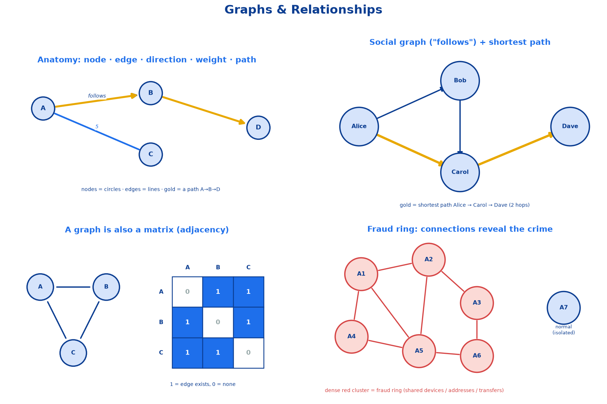
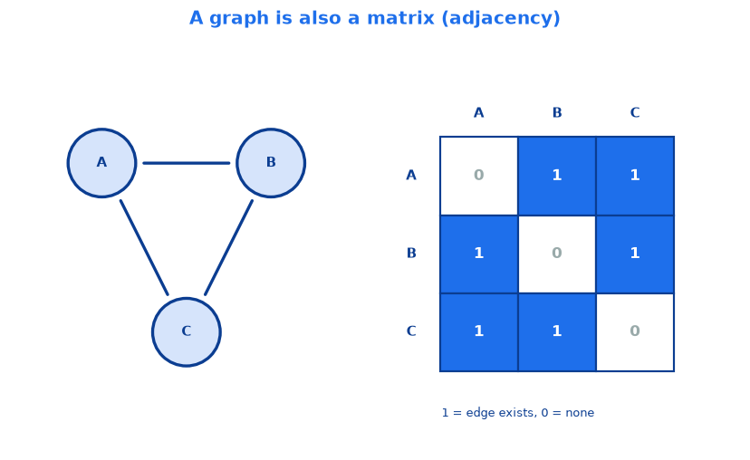
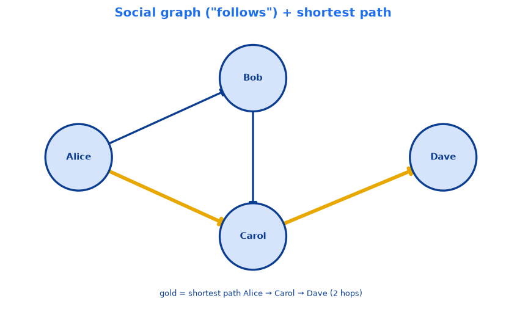
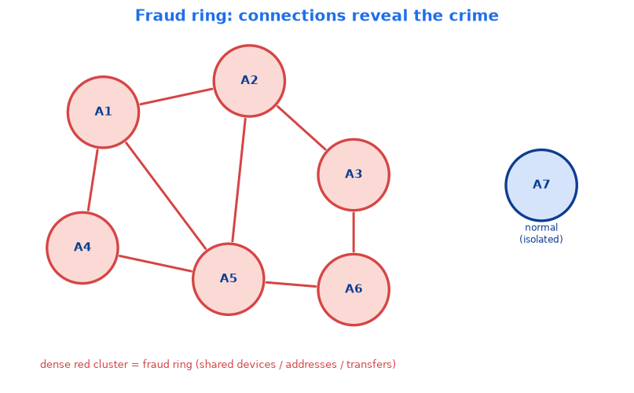
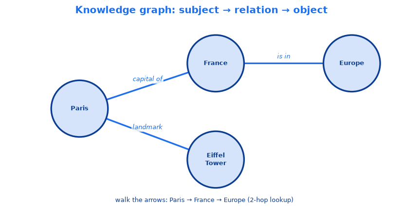

# <span style="color:#0B3D91">Mathematics Foundations: Representing Meaning — Vectors, Embeddings &amp; Graphs</span>

> Study notes on how machines represent *meaning* as numbers, then measure and connect it:
> **Vectors** (information as points) → **Embeddings** (meaning as points) → **Semantic Space**
> (the map they live on) → **Similarity Metrics** (measuring closeness) → **Graphs** (measuring
> connections).
> An intuition-first foundation for semantic search, recommendations, RAG, clustering, and knowledge graphs.
>
> **Note on formulas:** these notes use plain-text formulas (real symbols in code blocks)
> instead of LaTeX, so every equation renders correctly in any Markdown viewer.

---

## <span style="color:#1E6FEB">Table of Contents</span>

1. [Vectors](#1-vectors)
2. [Embeddings](#2-embeddings)
3. [Semantic Space](#3-semantic-space)
4. [Similarity Metrics](#4-similarity-metrics)
5. [Graphs](#5-graphs)

---

## <span style="color:#1E6FEB">1. Vectors</span>

### 1.1 Theory
A **vector** is simply an **ordered list of numbers**. That's it — nothing scarier than a single row in a spreadsheet.

```
[0.2, 0.8, -0.1]
```

The word "ordered" is the important bit: position *matters*. The first number always means one specific thing, the second another, and so on. Swap them and you've changed the meaning.

Two ways to picture a vector:
- **As a point** → coordinates that pinpoint a location. `[2, 3]` is "go 2 right, 3 up."
- **As an arrow** → a direction *and* a length (magnitude), pointing from the origin to that point.

The number of values in the list is the vector's **dimensionality**. `[2, 3]` is 2-dimensional (2-D), `[2, 3, 5]` is 3-D, and a real language-model embedding might have **768, 1536, or even 3072 numbers**. We can only *draw* up to 3-D, but the math works identically no matter how many dimensions there are.

**Why AI cares:** computers can't do math on the word *"dog"* or a photo of a puppy. But they *can* do math on numbers. A vector is how we turn any piece of information — a word, an image, a customer, a product — into something mathematical we can **measure, compare, and search**. This is the bedrock under search, recommendations, RAG, and clustering. No vectors → no "find me things like this."

### 1.2 Mathematical Formula

A vector in *n* dimensions:

```
v = [x1, x2, ..., xn]
```

- **xi** → the value along dimension *i* (each dimension is one "axis" or feature)
- **n** → the number of dimensions (how many numbers are in the list)

**Magnitude (length of the arrow)** — how "big" the vector is, via Pythagoras extended to *n* dimensions:

```
||v|| = sqrt( x1^2 + x2^2 + ... + xn^2 )
```

**Euclidean distance (how far apart two vectors A and B are)** — the key formula, and it's *literally just Pythagoras*:

```
d(A, B) = sqrt( (x1 - y1)^2 + (x2 - y2)^2 + ... + (xn - yn)^2 )
```

- **(xi - yi)** → the gap between the two vectors along one single dimension (one side of a right triangle)
- **squaring** → removes the sign (a gap of -3 is just as far as +3) and weights bigger gaps more
- **sqrt (square root)** → undoes the squaring so the answer is back in real, comparable units

That "**... +**" in the middle is the important bit: you just keep adding one squared gap **per dimension**, so this same formula works for *any* number of dimensions.

### 1.3 Mathematical Example
Two customers as 2-D vectors: **A = [2, 3]** and **B = [5, 7]**. How far apart are they?

- **Step 1** — Difference in dimension 1: `5 - 2 = 3`
- **Step 2** — Difference in dimension 2: `7 - 3 = 4`
- **Step 3** — Square each: `3^2 = 9`, `4^2 = 16`
- **Step 4** — Add them: `9 + 16 = 25`
- **Step 5** — Square root: `sqrt(25) = 5`

```
d(A, B) = sqrt( (5-2)^2 + (7-3)^2 ) = sqrt(9 + 16) = sqrt(25) = 5
```

The two customers sit a distance of **5** apart. A *smaller* distance means *more similar* customers. (Yep — that's the classic 3-4-5 triangle hiding inside.)

### 1.4 Multi-Dimensional Vectors — the same math, more numbers
Here's the beautiful part: **nothing new to learn.** Every formula above just keeps adding one term per dimension, so moving to more dimensions means "add more terms."

**Example A — A 3-D customer profile.** Describe each customer with **3 features**: `[ spending, visits_per_month, avg_rating_given ]`

- **A = [2, 3, 4]**
- **B = [5, 7, 8]**

```
d = sqrt( (5-2)^2 + (7-3)^2 + (8-4)^2 )
  = sqrt( 9 + 16 + 16 )
  = sqrt(41)
  = 6.40 (approx)
```

We literally just tacked on `(8-4)^2 = 16`. That's the entire trick. 3-D is a real place you can *almost* picture — a point floating inside a room (width, depth, height).

**Example B — A 5-D product.** A product described by **5 features**, each scored 0-1: `[ price_level, sportiness, waterproof, is_footwear, color_warmth ]`

- **Red running shoe  → S = [0.4, 0.9, 0.1, 1.0, 0.8]**
- **Blue running shoe → T = [0.4, 0.9, 0.1, 1.0, 0.2]**

They differ only in the last dimension (color warmth):

```
d = sqrt( 0^2 + 0^2 + 0^2 + 0^2 + (0.8-0.2)^2 )
  = sqrt( 0.36 )
  = 0.6
```

Tiny distance → the model correctly sees "basically the same shoe, different color." You **can't draw** a 5-D room, but the arithmetic didn't even blink.

**Example C — The real world: hundreds of dimensions.** When OpenAI or Google turn the word *"dog"* into an embedding, the vector might have **1,536 numbers**:

```
[0.013, -0.204, 0.088, 0.451, -0.033, ... 1,531 more numbers ..., 0.107]
```

**Why so many?** In just 2 dimensions, the word *"bank"* (riverside) and *"bank"* (money) have **nowhere separate to sit** — they'd get squashed onto the same spot. Every extra dimension is one more distinction the model can express: one axis might quietly capture "is it about water?", another "is it about finance?", another "is it formal or casual?" Nobody labels these axes — the model discovers them from how words are used. More dimensions = more room for nuance.

> **The key mental unlock:** you can *visualize* 2-D and 3-D, but you must *trust the formula* for anything higher. The math (sum of squared differences) doesn't care whether n is 2 or 2,000 — closeness in the numbers still means closeness in meaning.

### 1.5 Real-World Example
**"Customers also bought" on an e-commerce site.** Each product's description, category, and reviews get turned into a **high-dimensional** embedding vector (hundreds of numbers). A running shoe and running socks end up with vectors that are *close together* across all those dimensions, so the system confidently recommends the socks when you view the shoe — while a laptop, sitting far away in the number-space, never shows up. The recommendation is just **distance math on vectors**, running in a space with way more than 3 dimensions.

### 1.6 Key Takeaway
> **A vector is an ordered list of numbers that turns any information into a point (or arrow) we can do math on — and its dimensionality is just how many numbers are in the list.**
> Multi-dimensional vectors use the *exact same formulas* (just more terms in the sum); real AI embeddings live in hundreds/thousands of dimensions so they have enough "room" to capture subtle meaning. **Close numbers = similar things**, no matter how many dimensions.

---

## <span style="color:#1E6FEB">2. Embeddings</span>

### 2.1 Theory
An **embedding** is a special kind of vector: **a vector that captures the *meaning*** of something — a word, a sentence, an image, or a product.

The key distinction from a plain vector:
- A **vector** is *any* list of numbers. `[2, 3]` could mean anything — it's just raw coordinates.
- An **embedding** is a vector whose numbers were **produced by a trained model** specifically so that **similar things land near each other**. The position is *meaningful*.

So every embedding is a vector, but not every vector is an embedding. The magic ingredient is *training*: a model reads massive amounts of text (or images) and learns to place things with similar meaning close together in the number-space, and unrelated things far apart. Nobody hand-writes the numbers — the model discovers them.

**Why it matters:** once meaning becomes numbers, a computer can **measure it, compare it, sort it, and search it**. That single move — turning meaning into an embedding — is what every semantic feature in every AI product depends on (semantic search, recommendations, RAG, translation, deduplication).

### 2.2 Mathematical Formula

There isn't a tidy algebra formula like `n!` — an embedding is the **output of a learned function**. Conceptually:

```
embedding = f(input)
```

- **input** → your raw thing (a word, sentence, image, product description)
- **f** → the trained embedding model (e.g. an OpenAI / Google / BERT model) — the "learned" part, millions of numbers tuned during training
- **embedding** → a fixed-length vector, e.g. `[0.021, -0.107, 0.334, ...]` with 768 / 1536 / 3072 dimensions

The important **property** the training enforces, in plain terms:

```
if meaning(A) is similar to meaning(B)   ->   distance( f(A), f(B) )  is small
if meaning(A) is unrelated to meaning(B) ->   distance( f(A), f(B) )  is large
```

That "distance" is measured with the vector math from Topic 1 (Euclidean distance, or cosine similarity — see Topic 4). The embedding itself is just a vector; its *usefulness* comes entirely from that similar-things-are-close property.

### 2.3 Mathematical Example
Suppose a tiny trained model gives us these 2-D embeddings (real ones have hundreds of dimensions, but 2-D lets us see it):

```
f("king")   = [0.9, 0.7]
f("queen")  = [0.8, 0.8]
f("banana") = [0.1, 0.2]
```

**Question:** Is *"king"* closer in meaning to *"queen"* or to *"banana"*? Just measure distances (Pythagoras from Topic 1).

- **Step 1 — distance(king, queen):**
```
d = sqrt( (0.9-0.8)^2 + (0.7-0.8)^2 ) = sqrt( 0.01 + 0.01 ) = sqrt(0.02) = 0.141
```
- **Step 2 — distance(king, banana):**
```
d = sqrt( (0.9-0.1)^2 + (0.7-0.2)^2 ) = sqrt( 0.64 + 0.25 ) = sqrt(0.89) = 0.943
```
- **Step 3 — compare:** `0.141 < 0.943`

So *"king"* sits **much closer to "queen" (0.14)** than to *"banana" (0.94)* — exactly matching our intuition that royalty concepts are related and fruit is not. The numbers encoded the meaning, and a computer found the relationship with nothing but subtraction and a square root. That's the whole point of an embedding.

### 2.4 Real-World Example
**"Customers also bought".** An e-commerce platform runs every product's description, category, and reviews through an embedding model, in three steps:
1. **Encode** — each product's text becomes one embedding vector (done once, refreshed when the catalogue changes).
2. **Index** — the vectors go into a store that can find *nearest neighbours* across millions of items in milliseconds.
3. **Serve** — a shopper views an item; the system returns its nearest-neighbour embeddings as the "you might also like" strip.

A running shoe's embedding sits close to running socks and far from an office chair — so recommendations are relevant *without anyone hand-writing a single rule*.

> **Quick intuition check:** would "laptop bag" embed closer to "laptop" or "garden hose"? → **"laptop"** — those words appear in similar contexts and are bought together, so training placed them nearby.

### 2.5 Key Takeaway
> **An embedding is a vector that captures meaning — produced by a trained model that deliberately places similar things close together and unrelated things far apart.**
> Once meaning is an embedding, a computer can measure, compare, sort, and search it with plain vector math — the foundation under semantic search, recommendations, RAG, and translation.

---

## <span style="color:#1E6FEB">3. Semantic Space</span>

### 3.1 Theory
**Semantic space** is **the space that all your embeddings live in** — a giant multi-dimensional "map of meaning" where **position encodes meaning** and **related concepts cluster together**.

If Topic 2 was "how do we turn one thing into a meaning-vector?", Topic 3 zooms out to the whole neighbourhood: *what does the entire map of all those vectors look like?*

The deck's killer analogy: **GPS coordinates, but for meaning.**
- `[latitude, longitude]` pinpoints a *location on Earth* → nearby coordinates = nearby places.
- An embedding's `[x1, x2, ...]` pinpoints a *concept's location in meaning-space* → nearby coordinates = related meaning.

Three things that make semantic space tick:
1. **Each dimension captures one learned aspect of meaning.** But — importantly — **nobody labelled these axes.** The model discovered them during training, and mostly *no human can say* what any single dimension represents.
2. **Meaning is relative — it lives in position, not in a single vector.** A lone embedding tells you almost nothing. An embedding *compared to other embeddings* tells you everything. "Close" and "far" are the whole game.
3. **Similar concepts cluster; unrelated ones stay apart.** Fruits huddle in one region, royalty in another, and the model built that grouping purely from *how the words were used in training text*.

**Why it's useful:** the semantic space *is* the search engine, the recommender, the RAG retriever. Once everything lives on this map, "find me things like X" becomes "find X's neighbours on the map."

### 3.2 Mathematical Formula

Semantic space isn't a single equation — it's a **set** (a collection of points):

```
Semantic space  S = { f(a), f(b), f(c), ... }   subset of  R^n
```

- **f(.)** → the embedding model from Topic 2
- **R^n** → "n-dimensional real space" — the coordinate system all embeddings sit in (n = 384, 768, 1536, 3072...)
- **S** → every embedding your system has, all living in that same R^n

The only *operation* that matters in this space is comparing two points, reusing Topic 1's distance:

```
relatedness(a, b)  ~  1 / distance( f(a), f(b) )
```

(Smaller distance = more related. Topic 4 makes this precise with cosine similarity.) The takeaway: **the space gives points a home; distance gives them relationships.**

### 3.3 Mathematical Example
A **toy semantic map** — 7 words the model placed in 2-D:

```
apple  = [0.9, 0.1]      dog   = [0.2, 0.9]
banana = [0.85, 0.15]    cat   = [0.25, 0.85]
mango  = [0.8, 0.2]      puppy = [0.2, 0.8]
                         car   = [0.9, 0.9]
```

**Question:** which words cluster together? Just eyeball the coordinates (or compute distances).

- **Fruit cluster:** apple, banana, mango all have a **big first number, small second** → bottom-right.
- **Animal cluster:** dog, cat, puppy all have a **small first number, big second** → top-left.
- **car** sits off on its own (top-right) — unrelated to both.

Quick check — is *"dog"* closer to *"puppy"* or *"apple"*?
```
distance(dog, puppy) = sqrt( (0.2-0.2)^2 + (0.9-0.8)^2 ) = sqrt(0.01) = 0.10   (very close!)
distance(dog, apple) = sqrt( (0.2-0.9)^2 + (0.9-0.1)^2 ) = sqrt(1.13) = 1.06   (far)
```

*"dog"* and *"puppy"* are neighbours (0.10) while *"dog"* and *"apple"* are strangers (1.06). **Nobody labelled the axes** — the clustering just *emerged* from how these words are used in text. That emergent geography is exactly what "semantic space" means.

### 3.4 Real-World Example
**Why real systems use hundreds/thousands of dimensions.** In just 2-D, the word *"bank"* (riverside) and *"bank"* (money) have **nowhere separate to sit** — they'd collide on the map. Every extra dimension is one more distinction the model can express, so it can pull those two "banks" apart into different regions.

But it's a trade-off: more dimensions cost **storage, memory, and query latency — all linearly**.

| Model type | Dimensions | Bytes/vector | 1M documents |
|---|---|---|---|
| Small / on-device | 384 | 1,536 | 1.5 GB |
| Common general-purpose | 768 | 3,072 | 3.1 GB |
| Large commercial | 1,536 | 6,144 | 6.1 GB |
| Largest available | 3,072 | 12,288 | 12.3 GB |

Bigger embeddings are only worth it **if retrieval quality actually improves** — measure before you upgrade.

### 3.5 Key Takeaway
> **Semantic space is the multi-dimensional "map of meaning" where all embeddings live — position encodes meaning, and related concepts cluster together.**
> Meaning is **relative**: one embedding says nothing; its **distance to others** says everything. More dimensions = more nuance, but more cost — so size the space to your needs.

---

## <span style="color:#1E6FEB">4. Similarity Metrics</span>

### 4.1 Theory
We've turned words and products into vectors that live on a "map of meaning." Now we want to answer one simple question:

> **"Given two of these vectors, how alike are they?"**

A **similarity metric** is just a *recipe that gives you one number* answering that. High number = very alike. Low number = not alike.

There are **two common recipes**, and the whole topic clicks once you understand the difference. Picture two people walking from the same starting point:

- **Person A** walks 2 km northeast.
- **Person B** walks 8 km northeast.

Now ask two *different* questions:
1. **"How far apart did they end up?"** → Far apart, because B walked much farther. This is **Euclidean distance** — it cares about the actual gap between endpoints.
2. **"Were they heading the same way?"** → *Yes! Both went northeast.* Same direction, different amounts. This is **cosine similarity** — it ignores *how far* and only asks *which direction*.

| Metric | The question it answers | Cares about length? |
|---|---|---|
| **Euclidean distance** | "How far apart are the two points?" | Yes |
| **Cosine similarity** | "Are they pointing the same direction?" | **No — ignores length** |

**Why does "ignore length" matter for text?** Imagine two articles about dogs: a short tweet *"I love dogs"* and a 10-page essay on dog breeds. Both are 100% about dogs — same topic, same direction of meaning. But the essay is "bigger" (more words, bigger numbers). Plain distance would call the essay "far" from the tweet just because it's longer. **Cosine similarity fixes this** by ignoring size and looking only at direction — which is why it's the go-to metric for meaning.

### 4.2 Mathematical Formula

Cosine similarity is built from **two small ingredients**.

**Ingredient 1: The dot product** (measures "do they agree?") — multiply the matching numbers, then add up the results:

```
A . B  =  (a1 * b1) + (a2 * b2) + ... + (an * bn)
```

Go dimension by dimension. If *both* vectors have a big number in a dimension, their product is big → they **agree strongly** there. Add up all the agreements and you get one number showing overall alignment.

_Tiny example:_ `A = [3, 0]`, `B = [2, 1]` → `A . B = (3*2) + (0*1) = 6`.

**Ingredient 2: The magnitude** (measures "how long is the arrow?") — the length of a vector, via Pythagoras:

```
||A|| = sqrt( a1^2 + a2^2 + ... + an^2 )
```

_Example:_ `A = [3, 0]` → `||A|| = sqrt(9) = 3` (an arrow 3 units long).

**Now combine them: cosine similarity** — take the dot product, then **divide by both lengths**:

```
                 A . B
cos(theta)  =  --------------------
                ||A|| * ||B||
```

**Why divide by the lengths?** That division is the "ignore how long, keep only the direction" step. The dot product alone gets bigger just because a vector is longer (the essay problem). Dividing by both magnitudes cancels out size entirely, leaving only *direction*.

**How to read the answer** — cosine similarity always lands between -1 and +1:

```
+1   ->  same direction         ->  "as similar as possible"
 0   ->  perpendicular (90 deg)  ->  "totally unrelated"
-1   ->  opposite directions     ->  "complete opposites"
```

Closer to +1 = more alike.

### 4.3 Mathematical Example
A doctor searches **"heart attack treatment"** → `Q = [0.85, 0.80, 0.10]`. A document says **"cardiac arrest emergency care"** → `D1 = [0.90, 0.80, 0.10]`. These phrases share **almost no words** — but they *mean* the same thing. Let's see if cosine catches that.

**Step 1 — Dot product** (multiply matching numbers, add them up):
```
Q . D1 = (0.85 * 0.90) + (0.80 * 0.80) + (0.10 * 0.10)
       =    0.765       +    0.640      +    0.010
       = 1.415
```
**Step 2 — Length of Q:**
```
||Q|| = sqrt(0.85^2 + 0.80^2 + 0.10^2) = sqrt(1.3725) = 1.172
```
**Step 3 — Length of D1:**
```
||D1|| = sqrt(0.90^2 + 0.80^2 + 0.10^2) = sqrt(1.46) = 1.208
```
**Step 4 — Multiply the two lengths:**
```
1.172 * 1.208 = 1.416
```
**Step 5 — Divide** (dot product / combined length):
```
cos(theta) = 1.415 / 1.416 = 0.999
```

**Result: 0.999 — almost exactly 1**, meaning "nearly identical direction": these two phrases mean almost the same thing, even though they barely share any words. That's the magic of semantic search.

**What a low score looks like (and why thresholds matter)** — run the same query Q against three documents and sort by score:

| Document | cos(theta) | What we do |
|---|---|---|
| Cardiac arrest emergency care | **1.00** | Relevant — keep it |
| Flu vaccination schedule | 0.37 | Too low — ignore |
| Diabetes diet management | 0.31 | Too low — ignore |

> **Gotcha:** a search system *always* hands back its "top matches" — even when nothing is actually relevant. So set a **cut-off score (threshold)**. If the best match only scores 0.34, the honest answer is *"I found nothing relevant"*, not confidently returning a bad match. Like a bouncer: don't let in the randoms just to fill the room.

### 4.4 Real-World Example
**"Similar items" on a shopping site.** You're viewing a **red running shoe → [0.85, 0.15]**. The site compares it to two products:

- **Blue running shoe [0.90, 0.10]:** `dot = 0.765 + 0.015 = 0.780` → **cos ~ 0.999** → shown first. Cosine looked past "red vs. blue" and saw "both are running shoes."
- **Leather office shoe [0.10, 0.90]:** `dot = 0.085 + 0.135 = 0.220` → **cos ~ 0.283** → not recommended. A shoe, sure, but a different *kind*.

**Cosine or Euclidean? A cheat sheet:**

| Your situation | Use | Why |
|---|---|---|
| Comparing text/documents (different lengths) | **Cosine** | Length shouldn't change the topic match |
| Comparing physical numbers — price, size, age | **Euclidean** | Here the actual magnitude *is* what matters |
| Your vectors are already length-1 (normalised) | **Either** | They give the same ranking anyway |

> **Handy fact:** most embedding models already output vectors with length = 1. When that's true, cosine and Euclidean rank things *identically* — so check first before arguing about the metric.

### 4.5 Key Takeaway
> **A similarity metric is a recipe that scores how alike two vectors are.** The two big ones: **Euclidean distance** ("how far apart?" — smaller = closer) and **cosine similarity** ("same direction?" — closer to +1 = more alike).
> For comparing **meaning/text**, use **cosine** — it ignores how *long* a vector is and looks only at *direction*, so a short tweet and a long essay on the same topic score as similar. And always set a **threshold** so irrelevant results get rejected instead of confidently returned.
>
> **One sentence:** cosine similarity asks "are these two arrows pointing the same way?" — and for meaning, direction matters far more than length.

---

## <span style="color:#1E6FEB">5. Graphs</span>

> The final piece of *Vectors & Meaning*. Everything before measured **similarity** ("how alike?"); a graph measures **connection** ("how are things linked?").



### 5.1 Theory
Everything so far answered **"how *alike* are two things?"** A **graph** answers a completely different question:

> **"How are things *connected* to each other?"**

A **graph** is just a set of **things** with **relationships drawn between them** — circles (things) joined by lines (relationships). Family trees, subway maps, friend networks, org charts, supply chains: all graphs.

The whole vocabulary is **five words** — learn them and you can read any graph diagram (see the "Anatomy" panel in the overview above):

| Word | What it is | Real-world example |
|---|---|---|
| **Node** | A *thing* | A customer, a document, a product, a tool |
| **Edge** | A *relationship* between two things | "bought", "cites", "reports to", "calls" |
| **Direction** | One-way or both-ways? | "follows" is one-way; "is married to" is mutual |
| **Weight** | A *number* on an edge | Strength, cost, distance, confidence |
| **Path** | A *chain of edges* from one node to another | How many hops to get from A to B |

**Why graphs matter (where similarity gives up):** similarity search nails *"find me things **like** this."* But it's helpless at **multi-hop relationship questions** like *"which suppliers are affected if this factory shuts down?"* — that's a chain of "depends on → depends on" links, i.e. a **path**. Cosine can say two suppliers *look* similar; only a graph shows they're *connected through a third one*. Forcing this into ordinary tables is painful ("who else is connected to this account?" → six joins, forty seconds). A graph makes connections **first-class**.

### 5.2 Mathematical Formula

Formally, a graph is:

```
G = (V, E)
```
- **V** → the set of **vertices** (a synonym for **nodes** — the things)
- **E** → the set of **edges** (the connections)

**Weighted edge** — a connection carrying a number:
```
edge = (A, B, w)      "A connects to B with weight w"
example: (CityA, CityB, 50)   ->  "50 km from A to B"
```

**The neat secret: a graph is also a matrix.** Any graph can be written as an **adjacency matrix** — a grid with a **1 wherever an edge exists**, `0` where it doesn't:



Read row **A**: it has a `1` under B and C → "A connects to B and C." The diagonal is `0` (nothing connects to itself). This is why **graph algorithms and matrix math are the same subject in different clothes** — a direct bridge to the next topic, Matrices & Tensors.

### 5.3 Mathematical Example
A small **social graph** — 4 people, "follows" relationships (one-way arrows):



- **Nodes (V):** { Alice, Bob, Carol, Dave } → 4 things
- **Edges (E):** Alice→Bob, Alice→Carol, Bob→Carol, Carol→Dave
- **Direction:** one-way (following ≠ being followed back)

**Question: can Alice reach Dave, in how few hops?** Trace **paths** by following arrows:
```
  Path 1:  Alice -> Bob -> Carol -> Dave   = 3 hops
  Path 2:  Alice -> Carol -> Dave          = 2 hops   <-- shortest (gold)
```
So **yes**, and the **shortest path is 2 hops** (Alice → Carol → Dave, highlighted gold above).

The punchline: we answered a *connection* question ("is there a chain, and how long?") that **no similarity score could touch.** Cosine could say Alice and Dave have *similar profiles* — only the graph reveals they're *linked through Carol.* Different tool, different job.

### 5.4 Real-World Example
**Fraud rings — "graphs see what tables can't."** Looked at one at a time, accounts seem innocent. Draw the **connections** (shared device, shared address, money transfers) and a **dense cluster** lights up:



Six "different" accounts sharing devices and addresses, quietly shuffling money in a circle — invisible individually, obvious as a graph. Account **A7** sits alone (normal). **The connections *were* the crime.**

**Knowledge graphs** store facts as **subject → relation → object** triples so an AI can *look up* what it can't reliably remember:



Ask *"what continent is the capital of France in?"* and the model just **walks the arrows**: Paris → France → Europe (a 2-hop lookup a plain fact-blob can't reliably do).

**Where else graphs power AI:**
- **GraphRAG** — retrieval that **walks relationships** instead of measuring embedding distance; the fix for multi-hop questions like *"which of our suppliers depend on a supplier that depends on this factory?"*
- **Agent routing** — an AI agent's plan *is* a path: tools are nodes, the sequence of calls is the route through them.

### 5.5 Key Takeaway
> **A graph represents *connections* between things** using five ideas: **nodes** (things), **edges** (relationships), **direction**, **weight**, and **path** (a chain of hops).
> Reach for a graph whenever the question is about **relationships or multi-hop chains** ("who's connected to whom?", "what's affected if X fails?") — exactly the questions similarity search *can't* answer. Bonus: a graph is secretly a **matrix** (its adjacency matrix), linking it straight to linear algebra.

---

*End of notes — all planned topics covered (Vectors → Embeddings → Semantic Space → Similarity Metrics → Graphs).*
