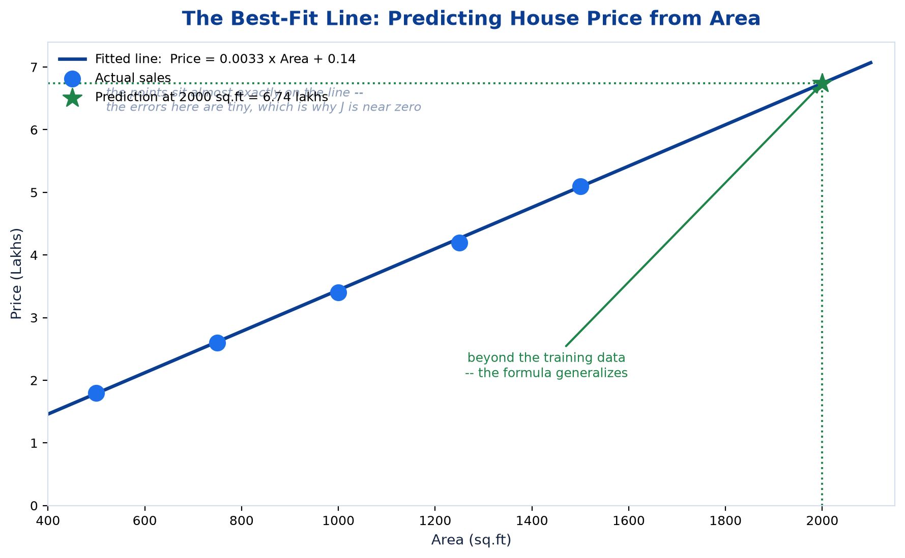
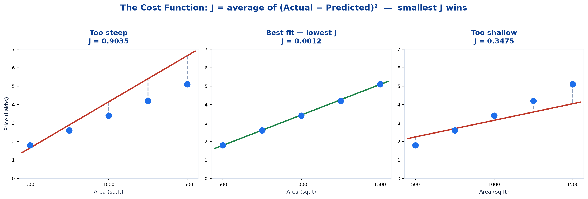
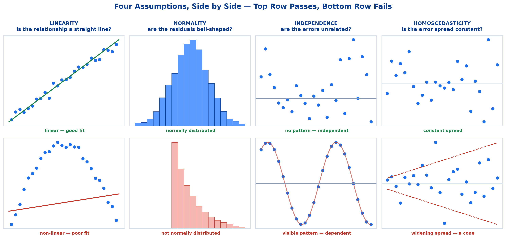
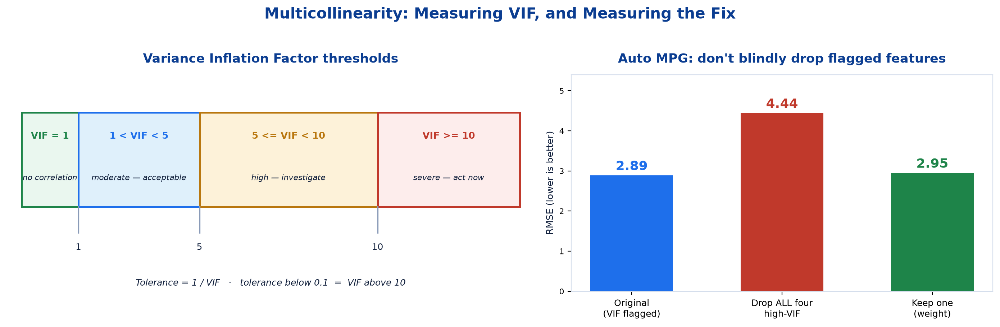
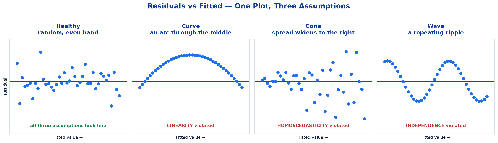
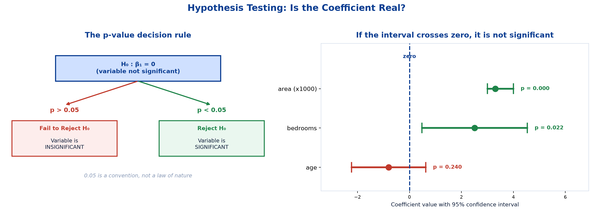

# <span style="color:#0B3D91">Linear Regression</span>

> Study notes on the simplest supervised algorithm — the best-fit line, the cost function that defines "best", multiple linear regression, the six assumptions that make the results trustworthy, VIF and multicollinearity, and hypothesis testing on coefficients.
> The algorithm whose coefficients you can actually explain to a stakeholder — and the one whose fine print matters most.

> **A note on formulas:** equations are written in plain text inside code blocks rather than LaTeX, so they render correctly in any Markdown viewer.

---

## <span style="color:#1E6FEB">Table of Contents</span>

1. [The Idea: Drawing the Best Line](#1-the-idea-drawing-the-best-line)
2. [The Cost Function — How "Best Fit" Is Decided](#2-the-cost-function--how-best-fit-is-decided)
3. [Multiple Linear Regression](#3-multiple-linear-regression)
4. [The Six Assumptions](#4-the-six-assumptions)
5. [Multicollinearity in Depth: VIF &amp; Consequences](#5-multicollinearity-in-depth-vif--consequences)
6. [How to Check Each Assumption](#6-how-to-check-each-assumption)
7. [Hypothesis Testing: Is the Line Significant?](#7-hypothesis-testing-is-the-line-significant)
8. [Where Linear Regression Is Used &amp; Practical 2](#8-where-linear-regression-is-used--practical-2)

---

## <span style="color:#1E6FEB">1. The Idea: Drawing the Best Line</span>

### 1.1 Overview / What is it?
Linear Regression is the **simplest supervised algorithm** — and the one everything else is measured against. It predicts a **continuous number** (regression, from Topic 1) by fitting a straight line through your data.

**The prediction equation:**

```
y-hat = B0 + B1 * x
```

In plain English:

```
Predicted Output = Intercept + (Slope x Input)
```

| Symbol | Name | Meaning |
|---|---|---|
| **ŷ** ("y-hat") | Prediction | What the model outputs |
| **β₀** ("beta-zero") | **Intercept** | Where the line crosses the y-axis — the prediction when `x = 0` |
| **β₁** ("beta-one") | **Slope** | How much `ŷ` changes for each 1-unit increase in `x` |
| **x** | Feature | Your input |

If you remember `y = mx + c` from school, this is the same line. `β₁` is `m`, `β₀` is `c`. That is genuinely all it is.

**Range of predictions:** −∞ to ∞ (continuous, unbounded). Nothing stops it predicting a negative house price, which is a real limitation worth knowing.

### 1.2 Why does it matter for AI?
Two reasons. First, an enormous number of business questions are *"predict this number"* questions, and a linear model often answers them well enough. Second, its **coefficients are directly interpretable** — you can state each feature's effect in one sentence, which most fancier algorithms cannot do.

### 1.3 Key Concepts — pros and cons

| Pros | Cons |
|---|---|
| Simple, fast to train, and easy to interpret | Assumes a **linear relationship** between input and output |
| Works well when the relationship is roughly linear | **Sensitive to outliers** |
| **Coefficients directly show each feature's effect** | Struggles with complex, non-linear patterns |

That third "pro" is underrated. `β₁ = 0.0033` is a sentence you can say to a stakeholder: *"every extra 100 sq.ft adds about ₹33,000."*

### 1.4 Simple Example — worked: predicting house price

| Area (sq.ft) | 500 | 750 | 1000 | 1250 | 1500 |
|---|---|---|---|---|---|
| **Price (Lakhs)** | 1.8 | 2.6 | 3.4 | 4.2 | 5.1 |

Larger area tends to mean a higher price — a roughly linear relationship. Fitting a line to this data gives:

```
Price ~= 0.0033 x Area + 0.14
```



**Reading the coefficients:**

- **β₁ = 0.0033** → each extra **square foot** adds **0.0033 lakhs** (₹330) to the price. Per 100 sq.ft: **₹33,000**.
- **β₀ = 0.14** → a house of zero square feet costs 0.14 lakhs. *Physically meaningless* — the intercept is often just a mathematical anchor, not a real-world quantity.

### 1.5 How it works — using the model to predict

For a 2000 sq.ft house, beyond anything in our training data:

```
Price = 0.0033 x 2000 + 0.14
      = 6.6 + 0.14
      = 6.74  ->  roughly 6.7 lakhs
```

**That is the payoff.** The same formula generalizes beyond the training rows — exactly the generalization idea from Topic 1.

### 1.6 Practical Example / Use Case
A property portal displays an estimated valuation the instant a seller types in a square footage. Behind it is a fitted line (or plane) doing exactly this arithmetic — and because the coefficients are interpretable, the portal can also say *"your extra bedroom is worth about ₹2.5 lakhs."*

### 1.7 Key Takeaways
> - **Linear Regression** predicts a **continuous number** by fitting a straight line: `y-hat = B0 + B1*x`.
> - **β₀** = intercept (value when x = 0, often not physically meaningful); **β₁** = slope (change in ŷ per 1-unit change in x).
> - Same as `y = mx + c` — β₁ is the gradient, β₀ the y-intercept.
> - Predictions are **unbounded** (−∞ to ∞), so nonsensical negative predictions are possible.
> - **Pros:** simple, fast, interpretable coefficients. **Cons:** assumes linearity, outlier-sensitive, poor with non-linear patterns.
> - The fitted formula **generalizes beyond the training data** — that is the whole point.

---

## <span style="color:#1E6FEB">2. The Cost Function — How "Best Fit" Is Decided</span>

### 2.1 Overview / What is it?
Infinitely many lines pass through a cloud of points. What makes one *best*?

**The cost function (MSE):**

```
J = Average of (Actual - Predicted)^2
```

If that looks familiar, it should — **it is MSE from Topic 3**, the middle step of RMSE. Squared errors, averaged.

### 2.2 Why does it matter for AI?
"Best fit" sounds subjective until you write down a cost function. Once you have one, fitting a model becomes a precise, mechanical task: **find the parameters that make this number smallest.** That idea underpins nearly all of machine learning, not just this algorithm.

### 2.3 Key Concepts — how the line is chosen

```
For every candidate line:
    1. Measure the vertical gap from each point to the line   (the error)
    2. Square each gap                                        (no cancelling, punish big misses)
    3. Average them                                           (that's J, the cost)

The BEST line is the one with the SMALLEST J.
```

That is the entire idea. **"Best fit" means "lowest total squared error."**

> **Terminology:** minimizing squared errors is called **Ordinary Least Squares (OLS)** — you will see this name in `statsmodels` output.

### 2.4 Simple Example — three candidate lines



Using our five house-price points:

| Candidate line | Cost J | Verdict |
|---|---|---|
| Too steep (`0.0050x - 0.85`) | **0.9035** | Terrible |
| **Best fit (`0.0033x + 0.14`)** | **0.0012** | **Best possible** |
| Too shallow (`0.0018x + 1.35`) | **0.3475** | Worse again |

The fitted line's J is near zero because this toy data sits almost exactly on a straight line. Real data never does.

### 2.5 How it works — why squared?

Same two reasons as RMSE in Topic 3:

**(a) Signs would cancel.** Errors of +5 and −5 average to zero — a perfect score for a bad model. Squaring makes everything positive.

**(b) Big misses get punished harder.** An error of 10 contributes 100; ten errors of 1 contribute 10 in total. One large miss is treated as worse than many small ones.

>  That second property is also why **Linear Regression is sensitive to outliers**. One wild point contributes an enormous squared error and drags the entire line toward itself.

### 2.6 Practical Example / Use Case
When `LinearRegression().fit()` returns instantly, it has solved for the coefficients that minimise exactly this J. There is no iteration or guesswork for ordinary least squares — the optimum has a direct mathematical solution.

### 2.7 Key Takeaways
> - **Cost function:** `J = average of (Actual − Predicted)²` — this is **MSE**.
> - The **best-fit line is the one that minimizes J**; this procedure is called **Ordinary Least Squares (OLS)**.
> - Squaring stops **signs cancelling** and **punishes large errors** more heavily.
> - That same squaring is why the model is **sensitive to outliers**.
> - Defining "best" as a number is what turns model fitting into a solvable problem.

---

## <span style="color:#1E6FEB">3. Multiple Linear Regression</span>

### 3.1 Overview / What is it?
Real predictions rarely depend on one thing. **Multiple Linear Regression** extends the same idea to several input features at once, finding the best-fit equation across all of them together:

```
y-hat = B0 + B1*x1 + B2*x2 + B3*x3 + ... + Bn*xn
```

### 3.2 Why does it matter for AI?
Single-feature problems barely exist outside textbooks. House price depends on area *and* bedrooms *and* age *and* location. Multiple regression is what makes the algorithm usable, and it introduces the interpretation subtlety that section 5 is built around.

### 3.3 Key Concepts — reading multiple coefficients

**House price with three features:**

```
Price = 0.14 + 0.0033*Area + 2.5*Bedrooms - 0.8*Age_of_building
```

| Coefficient | Reading |
|---|---|
| `0.0033 x Area` | Each sq.ft adds ₹330 |
| `+2.5 x Bedrooms` | Each bedroom adds 2.5 lakhs |
| `−0.8 x Age` | Each year of age **subtracts** 0.8 lakhs |

**A negative coefficient is not a bug** — it means that feature pushes the prediction *down*.

>  **The crucial caveat:** each coefficient means *"the effect of this feature **holding all others constant**."* The 2.5 lakhs per bedroom assumes area and age stay fixed. Keep that phrase in mind — section 5 shows exactly what breaks it.

### 3.4 Simple Example
Predicting a 1200 sq.ft, 3-bedroom, 10-year-old flat:

```
Price = 0.14 + (0.0033 x 1200) + (2.5 x 3) - (0.8 x 10)
      = 0.14 + 3.96 + 7.5 - 8.0
      = 3.60 lakhs
```

Each feature contributes its own term; the age term pulls the total down.

### 3.5 How it works — the geometry
One feature = a **line**. Two features = a flat **plane**. Three or more = a **hyperplane** nobody can picture. The mathematics is identical throughout; only the number of β terms changes.

### 3.6 Practical Example / Use Case
The Auto MPG practical predicts fuel efficiency from several car specifications at once — weight, horsepower, displacement, model year. Each gets its own coefficient, and each is tested individually for significance (section 7).

### 3.7 Key Takeaways
> - **Multiple Linear Regression:** `y-hat = B0 + B1*x1 + ... + Bn*xn` — several features fitted together.
> - Each coefficient is that feature's effect **holding all others constant**.
> - **Negative coefficients are normal** — they push the prediction down.
> - Geometrically: one feature = line, two = plane, many = hyperplane. The maths does not change.
> - The "holding all else constant" reading is exactly what **multicollinearity destroys**.

---

## <span style="color:#1E6FEB">4. The Six Assumptions</span>

### 4.1 Overview / What is it?
Linear Regression will *happily* fit a line to any data you hand it. It will never complain. But the results are only **trustworthy** if certain conditions hold.

Think of it as a contract: *"Give me data that looks like this, and I will give you reliable answers."* Break the contract and you get a model that looks fine and lies.

| # | Assumption | One-line meaning |
|---|---|---|
| 1 | **Linearity** | The relationship is actually a straight line |
| 2 | **Normality** | The *errors* follow a normal distribution |
| 3 | **Independence** | Errors do not depend on each other |
| 4 | **Homoscedasticity** | Error spread stays constant |
| 5 | **No Multicollinearity** | Input features are not duplicates of each other |
| 6 | **No Autocorrelation** | Errors are not correlated across observations |

### 4.2 Why does it matter for AI?
A model that violates its assumptions can still produce numbers — and those numbers can be confidently wrong in ways no single metric reveals. Recall from Topic 3 that **R² cannot detect bias**; assumption checks are how you catch what the metrics miss.

>  **Key insight:** assumptions 2, 3, 4 and 6 are about the **error terms (residuals)** — *not* about X or Y. A residual is simply `Actual − Predicted`, and residuals can only be computed **after** fitting. That is why assumption checking always happens *post-fit*.

### 4.3 Key Concepts — the six, one at a time



---

#### Assumption 1 — Linearity

> **X and Y should show a linear relationship** — otherwise, there is no use fitting a straight line.

**Why it matters:** if the scatter clearly curves, a straight line will **systematically under- or over-predict** — consider a polynomial or non-linear model instead.

That word *systematically* is the tell. The errors will not be random; they will follow a pattern (too low in the middle, too high at both ends). This is exactly the **bias** that R² cannot detect, as flagged in Topic 3.

---

#### Assumption 2 — Normality (of residuals)

> **Error terms (not X or Y) should be normally distributed with mean zero.**

The parenthetical is the whole point and the most common misunderstanding. Your *data* can be skewed however it likes — it is the **errors** that should form a bell curve centred on zero.

**Mean zero** means the model is not systematically biased — it over-predicts about as often as it under-predicts.

**Why it matters — and what it does *not* affect:**

> This matters for **trusting p-values, not for fitting the line itself.**

Non-normal errors do not stop you from fitting a line, and your predictions may be perfectly usable. But the **p-values used to test significance become unreliable** — which undermines section 7 entirely.

---

#### Assumption 3 — Independence

> **Error terms should not depend on one another** — as they often do in **time-series data**, where each value depends on the previous one.

**Why it matters:** a **wave-like or trending pattern in the residuals** is a red flag that observations are not independent.

**Intuition:** if knowing one error lets you guess the next, your errors carry information the model failed to use. The model is leaving signal on the table.

---

#### Assumption 4 — Homoscedasticity

Intimidating name, simple idea. *Homo* = same, *scedasticity* = spread. **Same spread.**

> **Error terms should have constant variance** — the spread should not grow or shrink as the predicted value changes.

**Why it matters:** a **cone-shaped spread (heteroscedasticity) means predictions are less reliable at some ranges than others.**

**Real-world example:** a salary model might predict junior salaries within ±₹50k but senior salaries within ±₹5 lakhs. The average error looks acceptable; the model is actually near-useless at the top end. One RMSE number hides this completely.

---

#### Assumption 5 — No (or little) Multicollinearity

> **Multicollinearity occurs when the independent variables are too highly correlated with each other.**

**Example:** including both **"height in cm"** and **"height in inches"** as separate features — they carry the **same information**, which **confuses the model about which one truly matters**.

**Why that is a problem:** remember *"holding all else constant"* from section 3? It becomes **nonsense here**. You cannot increase height-in-cm while holding height-in-inches constant — they move together by definition. The model has no way to separate their effects, so it splits the credit arbitrarily.

More realistic offenders: `total_price` and `price_per_unit × quantity`; `age` and `years_since_graduation`; a car's `weight`, `horsepower` and `displacement` (all measuring "how big is the engine").

Covered in depth in section 5.

---

#### Assumption 6 — No Autocorrelation

> **Autocorrelation occurs when residuals are not independent from each other across observations.**

**Example:** **stock prices**, where today's price is not independent of yesterday's price — a common issue in time-series data.

**Relationship to Assumption 3:** these overlap heavily — autocorrelation is the specific *time-ordered* form of dependence. They share a diagnostic test (Durbin-Watson), which is why they are often discussed together.

### 4.4 Simple Example
Fit a straight line to data shaped like an arc. The line will sit above the points at both ends and below them in the middle — every prediction wrong in a *predictable direction*. RMSE reports a number, R² may even look acceptable, and the model is systematically broken. Only the residual plot shows it.

### 4.5 How it works — grouping the six

| Concerns | Assumptions |
|---|---|
| The **shape of the relationship** | Linearity |
| The **residuals** | Normality, Independence, Homoscedasticity, Autocorrelation |
| The **features themselves** | No Multicollinearity |

Only multicollinearity can be checked *before* fitting; everything else needs residuals.

### 4.6 Practical Example / Use Case
Sales forecasting and temperature prediction (section 8) are both **time-series** problems — precisely where independence and autocorrelation are most likely to fail. Perfectly valid use cases, but the Durbin-Watson check is not optional there.

### 4.7 Key Takeaways
> - Six assumptions: **linearity, normality, independence, homoscedasticity, no multicollinearity, no autocorrelation**.
> - Assumptions 2, 3, 4 and 6 concern the **residuals** — not X or Y — so all their checks happen **after** fitting.
> - **Linearity:** if the scatter curves, a straight line **systematically** mis-predicts.
> - **Normality** affects the **trustworthiness of p-values**, not the fitting of the line itself.
> - **Independence:** a wave or trend in residuals means the model is leaving signal unused.
> - **Homoscedasticity:** constant error spread; a **cone shape** means reliability varies across the range.
> - **Multicollinearity:** correlated features (height in cm *and* inches) make "holding all else constant" meaningless.
> - **Autocorrelation** is the time-ordered form of dependence — classic in stock prices.

---

## <span style="color:#1E6FEB">5. Multicollinearity in Depth: VIF &amp; Consequences</span>

### 5.1 Overview / What is it?
Multicollinearity gets extra attention because it is **common, invisible without testing, and genuinely confusing** in its effects.

**VIF (Variance Inflation Factor)** measures **how much a feature is explained by the other features**. It is computed per feature.

### 5.2 Why does it matter for AI?
Because its damage is selective in a way that surprises people: it wrecks your **explanations** while leaving your **predictions** intact. Knowing that distinction tells you whether you need to fix it at all.

### 5.3 Key Concepts — the VIF scale



| VIF value | Interpretation |
|---|---|
| **VIF = 1** | No correlation with other predictors |
| **1 < VIF < 5** | Moderate correlation — generally acceptable |
| **5 ≤ VIF < 10** | High correlation — worth investigating |
| **VIF ≥ 10** | **Severe multicollinearity — action needed** |

> **Tolerance = 1/VIF** — a tolerance below **0.1** corresponds to a VIF above **10**.

**If multicollinearity is present:**

- **Coefficient estimates become unstable** and can **flip sign** with small data changes
- **Standard errors inflate**, widening confidence intervals and **shrinking t-statistics**
- Individual coefficients **lose their "holding all else constant" interpretation**
- **Overall model fit and prediction accuracy are usually unaffected**
- **Fixes:** drop a redundant variable, combine features, use PCA, or switch to **Ridge regression**

### 5.4 Simple Example —  the surprising consequence

**Multicollinearity does not hurt predictions.** The model still forecasts well. What it destroys is your ability to **interpret** the coefficients.

| What you want to do | Does multicollinearity hurt? |
|---|---|
| Predict house prices accurately | **No** — predictions stay fine |
| Say *"each bedroom adds ₹2.5 lakhs"* | **Yes** — that number is now unreliable |

So: **if you only need predictions, you can often live with it. If you need explanations, you must fix it.**

### 5.5 How it works —  a real finding from the course practical

This is worth dwelling on, because it contradicts the naive fix. On the Auto MPG data, several engine-spec features show genuine multicollinearity. The practical *measures* the impact of removing them rather than assuming:

| Action | RMSE | Outcome |
|---|---|---|
| Original model (multicollinearity present) | **2.89** | Baseline |
| Remove **all four** high-VIF features | **4.44** |  **Much worse** |
| Keep just one (`weight`) as representative | **2.95** |  Nearly as good, VIF resolved |
| Remove statistically insignificant (p > 0.05) features | ~unchanged | Exactly as p-values predicted |

**The lesson:** those correlated features still carried **real predictive signal** — they were correlated *with each other*, not useless. Dropping all of them threw away genuine information. **Keeping one representative** resolved the multicollinearity while preserving nearly all the performance.

> **Do not blindly drop every flagged feature.** Measure the before/after impact.

### 5.6 Practical Example / Use Case
A car's `weight`, `horsepower` and `displacement` all partly measure "how big is the engine". A model using all three predicts MPG well, but cannot tell you what weight *alone* contributes. If the goal is a dashboard prediction, ship it. If the goal is advising engineers which spec to change, fix the collinearity first.

### 5.7 Key Takeaways
> - **VIF** measures how much a feature is explained by the others: **<5 fine, 5–10 investigate, ≥10 severe**. `Tolerance = 1/VIF`.
> - Multicollinearity makes coefficients **unstable** (they can flip sign) and **inflates standard errors**.
> - It **destroys interpretability but usually leaves prediction accuracy intact**.
> - **Fixes:** drop a redundant variable, combine features, PCA, or **Ridge regression**.
> - **Do not blindly drop flagged features** — on Auto MPG, removing all four high-VIF features pushed RMSE from **2.89 → 4.44**; keeping one representative (`weight`) recovered it to **2.95**.
> - Correlated does not mean useless — those features carried real signal.

---

## <span style="color:#1E6FEB">6. How to Check Each Assumption</span>

### 6.1 Overview / What is it?
Each assumption has a **standard diagnostic** and an **accepted threshold** used to judge whether it holds.

| Assumption | How to Check It | Acceptable Value |
|---|---|---|
| **Linearity** | Scatter plot of X vs Y, or **Residuals vs Fitted** plot | No visible curve — points scattered evenly around a flat, straight band |
| **Normality** | **Q-Q plot** of residuals; **Shapiro-Wilk** or **Jarque-Bera** test | Q-Q points fall near the diagonal; test **p-value > 0.05** (fail to reject normality) |
| **Independence** | **Durbin-Watson** test on residuals | Statistic **close to 2** (commonly 1.5 to 2.5 is considered acceptable) |
| **Homoscedasticity** | **Residuals vs Fitted** plot; **Breusch-Pagan** test | **No funnel/cone shape**; test **p-value > 0.05** (fail to reject constant variance) |
| **No Multicollinearity** | **Variance Inflation Factor (VIF)**; correlation matrix | **VIF < 5** (some practitioners allow up to 10); pairwise correlation below **~0.8** |
| **No Autocorrelation** | **Durbin-Watson** test (same test as Independence) | Statistic close to 2; **well below 2** signals positive autocorrelation, **well above** signals negative |

> These tests are commonly run using **statsmodels** in Python (e.g. `statsmodels.stats.diagnostic`, `variance_inflation_factor`, `durbin_watson`) — the same library used for the p-value table in the notebook.

### 6.2 Why does it matter for AI?
Without diagnostics, "the assumptions hold" is just a hope. These six checks turn it into evidence — and each has an agreed threshold so the judgement is not a matter of taste.

### 6.3 Key Concepts —  a p-value convention that trips everyone up

Notice something odd? For **normality** and **homoscedasticity** we want **p > 0.05** — but in section 7 (significance testing) we want **p < 0.05**.

**Why the flip?** It depends entirely on what the null hypothesis says:

| Test | Null hypothesis (H₀) | We want | Because |
|---|---|---|---|
| Shapiro-Wilk (normality) | *"Residuals ARE normal"* | **p > 0.05** | We want to **keep** H₀ — normality is good news |
| Breusch-Pagan | *"Variance IS constant"* | **p > 0.05** | We want to **keep** H₀ |
| Coefficient t-test | *"Coefficient IS zero"* | **p < 0.05** | We want to **reject** H₀ — a zero coefficient is useless |

**Always ask what H₀ claims before interpreting a p-value.** The 0.05 threshold is the same; what changes is which side you are hoping for.

### 6.4 Simple Example — the workhorse plot

One plot checks **three** assumptions at once:



| What you see | What it means |
|---|---|
| Random, even band around 0 |  All good |
| A curve or arc |  Linearity violated |
| A cone / funnel |  Homoscedasticity violated |
| A wave |  Independence violated |

**Learn to read this one plot** and you have covered most of the diagnostic work.

### 6.5 How it works — order matters

>  All six checks happen **after** fitting the model, because every diagnostic (residual plots, Shapiro-Wilk, Durbin-Watson, VIF) is computed from the model's own residuals.

### 6.6 Practical Example / Use Case
On the real Auto MPG data in the practical, **some of these checks genuinely fail** — and the course leaves them failing deliberately. It is a realistic example of assumptions not always holding.

> **Assumption violations are a caution flag, not an automatic disqualification.** They tell you which conclusions to distrust, not that the model is worthless.

### 6.7 Key Takeaways
> - **Residuals vs Fitted** is the workhorse plot: checks **linearity, homoscedasticity and independence** at once.
> - **Q-Q plot / Shapiro-Wilk / Jarque-Bera** → normality. **Durbin-Watson ≈ 2** → independence & autocorrelation.
> - **Breusch-Pagan** → homoscedasticity. **VIF < 5** → multicollinearity. Pairwise correlation below **~0.8**.
> - **Watch the p-value direction:** assumption tests want **p > 0.05** (keep H₀); significance tests want **p < 0.05** (reject H₀).
> - Always ask **what H₀ claims** before reading a p-value.
> - All checks are **post-fit**, because they need residuals.
> - **Real data breaks assumptions** — treat violations as a caution flag, not a disqualification.

---

## <span style="color:#1E6FEB">7. Hypothesis Testing: Is the Line Significant?</span>

### 7.1 Overview / What is it?
You have fitted a line and got `β₁ = 0.0033`. But here is the uncomfortable question:

**Is that real, or did random noise just happen to produce a slight upward tilt?**

Give me any random scatter and I can fit a line to it. The slope will not be *exactly* zero. So how do we know a slope is genuine?

To know whether the fitted line is meaningful, we test whether its slope (β₁) is actually different from zero.

```
Null Hypothesis      (H0):  B1 = 0
Alternate Hypothesis (Ha):  B1 != 0
```

### 7.2 Why does it matter for AI?
This closes the loop on Topic 3's biggest caveat: **R² never decreases when you add features**, even random ones. Hypothesis testing is the mechanism that tells you whether a feature genuinely earns its place or is just noise inflating your score.

### 7.3 Key Concepts — the two hypotheses and two outcomes

| | Meaning |
|---|---|
| **H₀: β₁ = 0** | *"This feature has no effect."* The line is flat; x tells us nothing about y. |
| **Hₐ: β₁ ≠ 0** | *"This feature does have an effect."* |

**Why start by assuming no effect?** It is the sceptical default — like "innocent until proven guilty". We make the data prove the relationship exists, rather than assuming it does.

| Outcome | Meaning |
|---|---|
| **FAIL TO REJECT H₀** | β₁ is effectively zero — the feature is **insignificant** and of no real use in the model |
| **REJECT H₀** | β₁ is **not** zero — the fitted line represents a **statistically significant** relationship |

>  Note the careful phrasing: *"fail to reject"*, never *"accept"*. Absence of evidence is not evidence of absence — you may simply lack enough data.

### 7.4 Simple Example — the p-value decision rule

Each coefficient is tested individually with a p-value, to check whether that feature genuinely helps the model or could be dropped.



```
   Null Hypothesis: Variable Not Significant
                    |
        +-----------+-----------+
        |                       |
    p > 0.05                p < 0.05
        |                       |
  Fail to Reject H0        Reject H0
        |                       |
  Variable is             Variable is
  INSIGNIFICANT            SIGNIFICANT
```

**What a p-value actually means:** *"If this feature truly had no effect, what is the probability I would see a slope this large purely by chance?"*

- **p = 0.30** → 30% chance it is a fluke. Unconvincing. Not significant.
- **p = 0.001** → 0.1% chance it is a fluke. Convincing. Significant.

**0.05 is a convention**, not a law of nature — but it is the standard.

### 7.5 How it works — reading real statsmodels output

Each coefficient in a multiple regression gets its own row:

```
                 coef    std err       t     P>|t|    [0.025    0.975]
------------------------------------------------------------------------
const          0.1400      0.082    1.707    0.126   -0.041     0.321
area           0.0033      0.000   11.240    0.000    0.003     0.004
bedrooms       2.5100      0.910    2.758    0.022    0.482     4.538
age           -0.8000      0.640   -1.250    0.240   -2.226     0.626
```

| Column | Meaning |
|---|---|
| **coef** | The β value — the feature's effect |
| **std err** | Uncertainty in that estimate |
| **t** | How many standard errors from zero (bigger = more convincing) |
| **P>\|t\|** | **The p-value** |
| **[0.025, 0.975]** | **95% confidence interval** for the coefficient |

**Reading it row by row:**

| Feature | p-value | Verdict |
|---|---|---|
| `area` | **0.000** |  **Significant** — genuine effect |
| `bedrooms` | **0.022** |  **Significant** (just under 0.05) |
| `age` | **0.240** |  **Not significant** — could be dropped |
| `const` | 0.126 | Not significant — normal for an intercept, and never dropped |

####  The confidence interval shortcut

There is a neat consistency here. Look at the CI for `age`: **[−2.226, 0.626]**.

**It contains zero.** That means "no effect at all" is a plausible value — which is exactly why it is not significant. Compare `area`: **[0.003, 0.004]**, comfortably clear of zero.

> **The rule:** if the 95% confidence interval **contains zero**, the coefficient is **not significant** at p < 0.05. They are two views of the same fact.

### 7.6 Practical Example / Use Case
**Confirmed by the practical:** removing the statistically insignificant (p > 0.05) features left performance **essentially unchanged** — exactly as the p-values predicted. Contrast that with the multicollinearity result in section 5, where dropping flagged features *hurt* badly. The p-values were right; VIF alone was not enough to justify removal.

### 7.7 Key Takeaways
> - **Hypothesis testing:** `H₀: β₁ = 0` (no effect) vs `Hₐ: β₁ ≠ 0`.
> - **p < 0.05 → reject H₀ → variable is SIGNIFICANT.** **p > 0.05 → fail to reject → INSIGNIFICANT.**
> - Say *"fail to reject"*, never *"accept"* — absence of evidence is not evidence of absence.
> - A p-value is *"the probability of seeing a slope this large if the feature truly had no effect"*.
> - In a multiple regression, **each coefficient is tested individually**.
> - If the **95% confidence interval contains zero**, the coefficient is **not significant** — the same fact seen two ways.
> - Hypothesis testing **fixes R²'s flaw**: it identifies which features genuinely earn their place.
> - Removing p > 0.05 features left Auto MPG performance unchanged — exactly as predicted.

---

## <span style="color:#1E6FEB">8. Where Linear Regression Is Used &amp; Practical 2</span>

### 8.1 Overview / What is it?
Four canonical applications, and the hands-on notebook that ties everything together.

| # | Use case | Details |
|---|---|---|
| **1** | **House Price Prediction** | Estimate price from area, location, and number of rooms |
| **2** | **Sales Forecasting** | Predict next month's sales from historical trends |
| **3** | **Salary Estimation** | Predict salary from years of experience and role |
| **4** | **Temperature Prediction** | Estimate temperature from time of year and location |

**The common thread:** the target is always a **continuous number**, and a roughly linear relationship is plausible.

>  Note that #2 and #4 are **time-series** — precisely where the independence and autocorrelation assumptions are most likely to fail. Use them, but check Durbin-Watson.

### 8.2 Why does it matter for AI?
These are ordinary business questions, not research problems. Linear regression remains the default first attempt for all of them precisely because it is fast, interpretable, and sets an honest benchmark for anything more complex.

### 8.3 Key Concepts — Practical 2 stages

The notebook uses the **Auto MPG dataset** (predicting fuel efficiency from car specs), opening with a small toy example first.

| Stage | What happens |
|---|---|
| Toy example | A handful of hand-built rows, so the mechanics are visible |
| Train the model | `LinearRegression()` on Auto MPG |
| **Evaluate** | **RMSE and R²** (Topic 3) |
| **Check assumptions** | All six, **via residual plots and formal tests**, with interpretation ranges |
| **Hypothesis testing** | p-values and confidence intervals via **statsmodels** |
| Before/after comparison | **Measure** the impact of removing flagged features |

### 8.4 Simple Example — the essential code

```python
from sklearn.linear_model import LinearRegression
from sklearn.metrics import mean_squared_error, r2_score
import numpy as np

model = LinearRegression().fit(X_train, y_train)
y_pred = model.predict(X_test)

print("Intercept B0:", model.intercept_)
print("Coefficients B:", model.coef_)
print("RMSE:", np.sqrt(mean_squared_error(y_test, y_pred)))
print("R2  :", r2_score(y_test, y_pred))
```

```python
import statsmodels.api as sm
from statsmodels.stats.outliers_influence import variance_inflation_factor
from statsmodels.stats.stattools import durbin_watson

# p-values and confidence intervals -- sklearn does not provide these
X_c = sm.add_constant(X_train)
print(sm.OLS(y_train, X_c).fit().summary())

# VIF per feature
for i, col in enumerate(X_train.columns):
    print(col, round(variance_inflation_factor(X_train.values, i), 2))

# Durbin-Watson: want ~2
print("DW:", durbin_watson(residuals))
```

> **Why two libraries?** `scikit-learn` is built for *prediction* and gives you no p-values. `statsmodels` is built for *statistical inference* and hands you the full summary table. For assumption checking and hypothesis testing, you need statsmodels.

### 8.5 How it works — two things this practical does well

1. **It splits *first*, then scales on training data only** — the rigorous approach flagged in Topic 2. (The Titanic walkthrough does the simpler thing and says so.)
2. **It measures rather than asserts.** The multicollinearity table in section 5 comes from actually removing features and re-measuring, which is how the counter-intuitive result surfaced.

### 8.6 Practical Example / Use Case
A retail team forecasting next month's sales fits a linear model on historical trend data, reports RMSE in units sold (for the planners) and R² (for themselves), then checks Durbin-Watson — and finds it well below 2, confirming the autocorrelation they suspected from the time-series nature of the data. That result does not invalidate the forecast, but it does mean the p-values deserve scepticism.

### 8.7 Key Takeaways
> - Uses: **house prices, sales forecasting, salary estimation, temperature prediction** — all continuous targets.
> - Sales and temperature are **time-series**, where independence/autocorrelation most often fail.
> - Practical 2 runs: **toy example → train → RMSE/R² → all six assumption checks → p-values → before/after feature removal**.
> - **scikit-learn** for prediction; **statsmodels** for p-values, confidence intervals and diagnostics.
> - The practical **splits before scaling** (the rigorous order) and **measures** the effect of removing features rather than assuming it.

---

## <span style="color:#1E6FEB">Regenerating the Diagrams</span>

Figures live in the `figures/` package (one module per topic, shared palette in `figures/core.py`):

```bash
cd foundation_course/05_machine_learning_01/notes && ../../../.venv/bin/python plot_ml_figures.py
```

Pass figure names to rebuild only some, e.g. `... plot_ml_figures.py vif_scale hypothesis_testing`.

---

*End of file 04 — Linear Regression complete. Next: Logistic Regression.*
