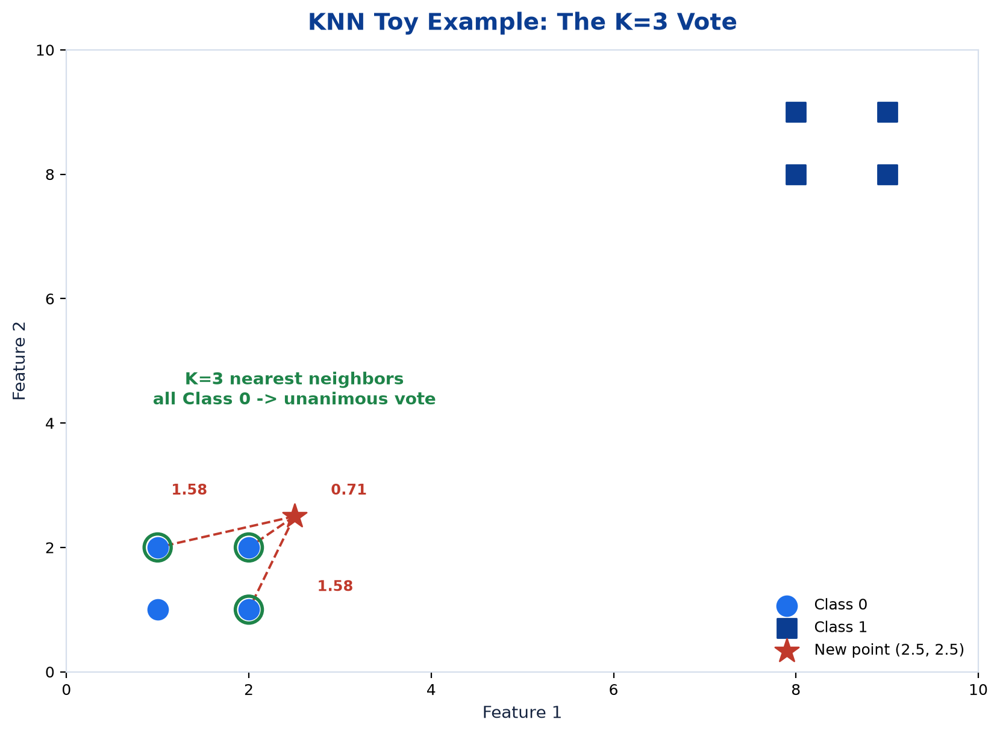
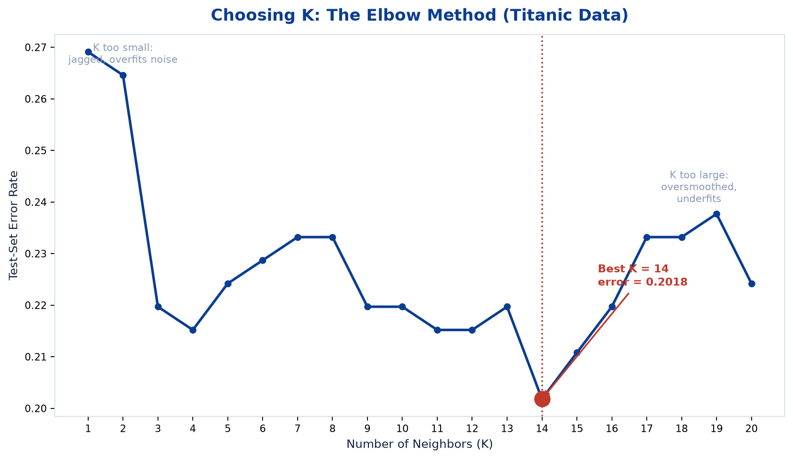
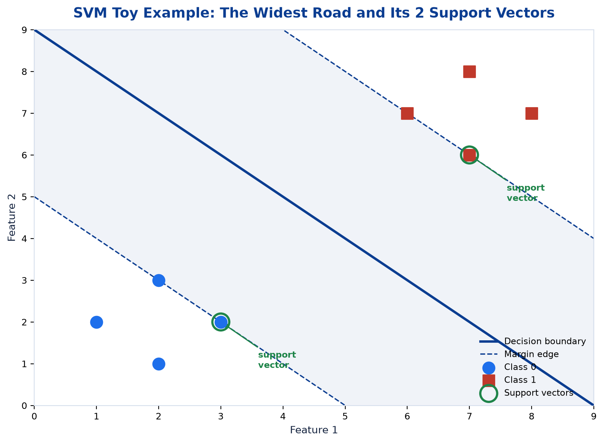
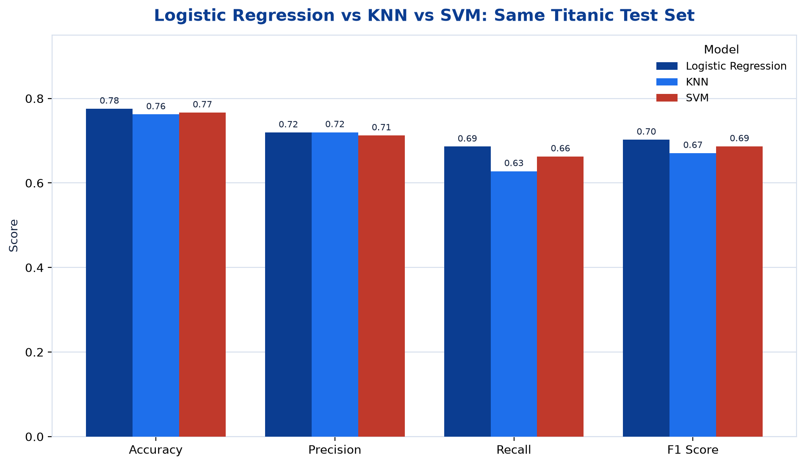

# <span style="color:#0B3D91">K-Nearest Neighbors & Support Vector Machines</span>

> Study notes on the two classifiers the slide deck promises twice (learning outcomes, slides 3 & 9) but never actually teaches. Anchored to the practical notebook's real, executed code (Practicals 4 & 5, Titanic dataset) rather than the missing slides.

> **A note on formulas:** equations are written in plain text inside code blocks rather than LaTeX, so they render correctly in any Markdown viewer.

> **Note on course coverage:** the slide deck's learning outcomes promise *"classify data using KNN and choose a sensible value of K"* and *"understand SVM and when to prefer it over other classifiers,"* but there is not a single teaching slide for either — the deck jumps straight from Logistic Regression to the recap. The practical notebook, however, fully implements both. This note follows the notebook, not the missing slides.

---

## <span style="color:#1E6FEB">Table of Contents</span>

1. [K-Nearest Neighbors (KNN) — You Are Who Your Neighbors Are](#1-k-nearest-neighbors-knn--you-are-who-your-neighbors-are)
2. [Support Vector Machines — Building the Widest Possible Road](#2-support-vector-machines--building-the-widest-possible-road)
3. [Final Comparison — Logistic Regression vs KNN vs SVM](#3-final-comparison--logistic-regression-vs-knn-vs-svm)

---

## <span style="color:#1E6FEB">1. K-Nearest Neighbors (KNN) — You Are Who Your Neighbors Are</span>

**The idea:** to classify a new point, measure its distance to every point in the training data, take the K closest ones, and let them vote. Whichever class is most common among those K neighbors wins. No equation gets fitted, no coefficients get learned — it's a **lazy learner**: "training" is just storing the data, and all the actual work happens at prediction time.

**Why it matters beyond this course:** "distance = similarity" is one of the most reused ideas in ML — it's the same logic behind recommendation engines ("users like you also bought…"), anomaly detection (a point far from everything else looks suspicious), and even the similarity search underneath RAG systems. KNN is that idea in its purest, simplest form.

**Toy example from the notebook:** two clusters of 4 points each (bottom-left = Class 0, top-right = Class 1). A new point at (2.5, 2.5) gets checked against its K=3 nearest neighbors:

```
Nearest 3 neighbors: (2,2), (2,1), (1,2) — distances 0.71, 1.58, 1.58
All 3 belong to Class 0 → new point classified as Class 0 (unanimous vote)
```



**Picking K is the whole game, and it's a trade-off:**

- **Too small** (K=1 or 2) → the boundary gets jagged, chasing individual noisy points — **overfitting**.
- **Too large** (K=20+) → the boundary flattens out and basically just predicts whichever class is most common overall — **underfitting**.

The fix is the **elbow method**: try every K from 1 to 20, measure the test-set error rate for each, plot it, and pick the K sitting at the bottom of the curve. On Titanic, that came out to:

```
Best K: 14
Minimum Error Rate: 0.2018   (≈ 80% accuracy)
```



> **Small honest wrinkle:** the final trained K=14 model reports `Accuracy: 0.78` a couple of cells later — a ~2-point gap from the elbow scan's 0.2018 error on what should be the identical test set. Re-running the notebook's exact preprocessing independently (same `RANDOM_STATE=42`) reproduces the elbow scan's numbers exactly, so **the K=14 choice and its 0.2018 error rate are the reliable, reproducible figures**; the later `0.78` print is most likely a notebook-cells-run-out-of-order artifact (a classic Jupyter footgun).

**One non-negotiable catch:** since KNN is purely about distance, **features must be scaled first**. If "fare" ranges into the hundreds and "age" ranges 0–80, fare would dominate every distance calculation regardless of which feature is actually more predictive — the exact scaling lesson from Topic 2 coming back around.

**Feature importance needs a workaround** because there's no formula to read weights from. The notebook uses **permutation importance**: shuffle one feature's values (breaking its real relationship to the outcome), re-run predictions, and measure how much accuracy drops. Repeat 20 times per feature and average, so one unlucky shuffle doesn't skew the result. A feature that matters a lot will tank accuracy when scrambled; a useless one barely moves the needle. Bonus: this technique isn't KNN-specific — it works on any black-box model, so it's a good general tool to have.

**Real-world flavor:** a recommendation system is basically KNN wearing a disguise — find the K most similar users by behavior, recommend what they liked.

---

## <span style="color:#1E6FEB">2. Support Vector Machines — Building the Widest Possible Road</span>

**What's a "class," quickly:** a class is just the label a data point belongs to — "Spam" vs. "Not Spam," "Survived" vs. "Didn't," or, in the toy example below, "bottom-left cluster" vs. "top-right cluster." Every point belongs to exactly one class, and that's what the model is trying to predict.

**The idea:** picture two clusters of dots — Class 0 in the bottom-left, Class 1 in the top-right, with an empty gap between them. Lots of different straight lines could separate them correctly, but SVM doesn't just pick any of them — it finds the line that lets you build the **widest possible road** through that empty gap, with the line running straight down the middle. A wider road means more breathing room before a new, slightly-different point becomes ambiguous about which side it's on.

The road can only get as wide as its tightest constriction allows — decided by whichever two points (one from each class) sit closest to each other across the gap. Those specific points are the **support vectors** — the only points actually touching the edges of the road, like pillars holding up a tent. Every other point is further back and irrelevant; you could delete them and the road wouldn't need to change at all.

**Why it matters beyond this course:** SVM was the go-to "classic" ML algorithm for structured, small-to-medium datasets before deep learning took over — and it's still a solid pick today. Caring only about the hardest, closest-to-the-edge points (instead of trying to please every single point equally) tends to generalize really well, especially with limited data.

**Toy example from the notebook — the same 8-dot picture:**

```
Class 0: (1,2), (2,1), (2,3), (3,2)
Class 1: (6,7), (7,6), (7,8), (8,7)

Support vectors found: (3,2) and (7,6)
Number of support vectors per class: [1, 1]
```



Exactly as predicted by the road analogy — (3,2) is the `0` closest to the `1`s, and (7,6) is the `1` closest to the `0`s. Only **2 of the 8 points** end up mattering; the rest are along for the ride.

**The one dial SVM has: `C`.** It controls how strict you are about keeping the road perfectly clean:

- **High `C`** → very strict — insists on a narrower road if that's what it takes to keep every single point correctly classified. Risks **overfitting** to noisy points.
- **Low `C`** → more relaxed — happy to let a few points sit inside the road or even on the wrong side, in exchange for a wider, more forgiving road overall.

Same overfitting/underfitting trade-off you saw with KNN's `K`, just a different knob.

**A real-data reality check:** the tidy toy example only needed 2 support vectors out of 8 points — a clean gap barely needs any. Run the *same* linear SVM on the real, messy Titanic data, and it needs **318 support vectors**. That's the honest picture of real-world data: there's no clean empty gap between "survived" and "didn't" — hundreds of passengers sit right at the fuzzy edge, so hundreds of points end up "holding up the road" instead of just two.

**Feature importance comes free here**, unlike KNN. Since this SVM uses a straight-line ("linear") road, its coefficients can be read exactly like Logistic Regression's — which feature pushes which direction, no extra technique needed.

**How it performed on Titanic** (same test set as Logistic Regression and KNN, for fair comparison):
```
Accuracy:  0.77   Precision: 0.71   Recall: 0.66   F1: 0.69
```

**One extra fact worth knowing, though not used in this notebook:** SVM's other famous trick is the **kernel trick** — swapping the straight road for a curved one (via an RBF or polynomial kernel), so it can separate classes that curve around each other instead of sitting in two neat clusters. That's the actual reason people reach for SVM over Logistic Regression, which is stuck drawing straight lines forever. This practical only ever uses a straight (linear) road, so the code never shows this off — but it's good to know the option exists.

**Real-world flavor:** SVM is a classic choice for text classification (spam vs. not-spam) and image classification on smaller datasets — anywhere there's a reasonably clear gap between classes and you want a robust boundary without needing millions of training examples.

---

## <span style="color:#1E6FEB">3. Final Comparison — Logistic Regression vs KNN vs SVM</span>

All three classifiers were trained and evaluated on the **exact same** Titanic train/test split — an honest, apples-to-apples comparison, straight from the notebook's final cell:

| Metric | Logistic Regression | KNN (K=14) | SVM (linear) |
|---|---|---|---|
| **Accuracy** | **0.7758** | 0.7623 | 0.7668 |
| **Precision** | 0.7195 | **0.7200** | 0.7125 |
| **Recall** | **0.6860** | 0.6279 | 0.6628 |
| **F1 Score** | **0.7024** | 0.6708 | 0.6867 |



The plain, "boring" Logistic Regression **wins on 3 of 4 metrics**, with KNN only edging it out on precision. The lesson that's easy to miss when algorithms get taught one at a time:

> **More complex is not automatically better.** Titanic survival is fairly cleanly separated by simple factors like sex, class, and fare — so the extra flexibility KNN and SVM offer doesn't pay off here, it just adds hyperparameters to tune (`K`, kernel, `C`) for no real gain.

KNN and SVM would earn their keep on messier, **non-linearly separable** data — exactly the case where Logistic Regression's straight-line-only limitation (flagged back in Topic 5) starts to hurt. Standard practice follows from this directly: **baseline with the simplest model that could plausibly work before spending tuning budget on fancier ones** — sometimes the boring baseline just wins.

### Key Takeaways
> - **KNN** classifies by majority vote among the K nearest points; it's a lazy learner with no formula, needs scaled features, and uses permutation importance instead of coefficients. Best K on Titanic: **14** (elbow method).
> - **SVM** finds the widest possible margin between classes; only the closest points (**support vectors**) decide the boundary. Toy data needed 2; real Titanic data needed **318**.
> - **`C`** (SVM) and **`K`** (KNN) are both overfitting/underfitting dials, same trade-off as everywhere else in this course.
> - On this dataset, **Logistic Regression wins** — a reminder that simpler models can beat fancier ones when the data doesn't need the extra flexibility.
> - The **kernel trick** (SVM) is real, important theory, but not exercised in this practical, which sticks to a linear kernel throughout.

---

## <span style="color:#1E6FEB">Regenerating the Diagrams</span>

Figures live in the `figures/` package (one module per topic, shared palette in `figures/core.py`). The elbow-scan and SVM support-vector numbers are reproduced by re-running the notebook's documented preprocessing steps (same `RANDOM_STATE=42`) rather than invented:

```bash
cd foundation_course/05_machine_learning_01/notes && ../../../.venv/bin/python plot_ml_figures.py
```

Pass figure names to rebuild only some, e.g. `... plot_ml_figures.py knn_elbow_curve svm_margin_toy`.

---

*End of file 06 — KNN & SVM complete. This closes the Basic Machine Learning I notes: 6 files covering Foundations, Data Preparation, Evaluation Metrics, Linear Regression, Logistic Regression, and KNN & SVM.*
