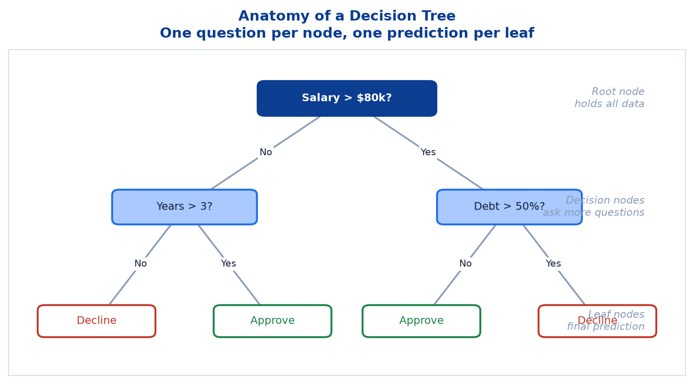
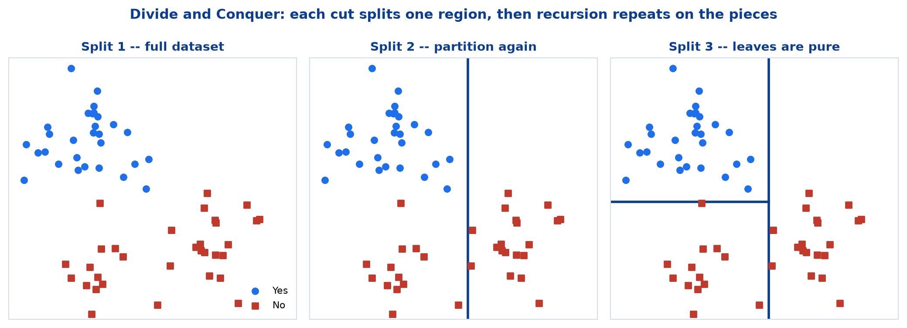
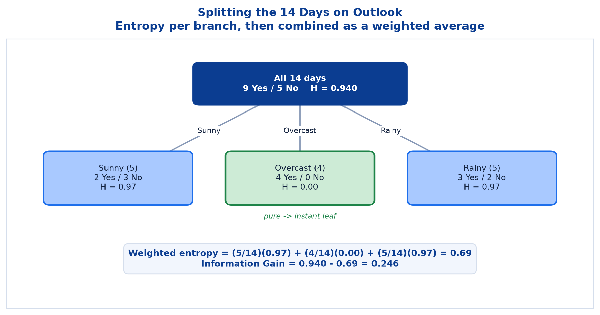
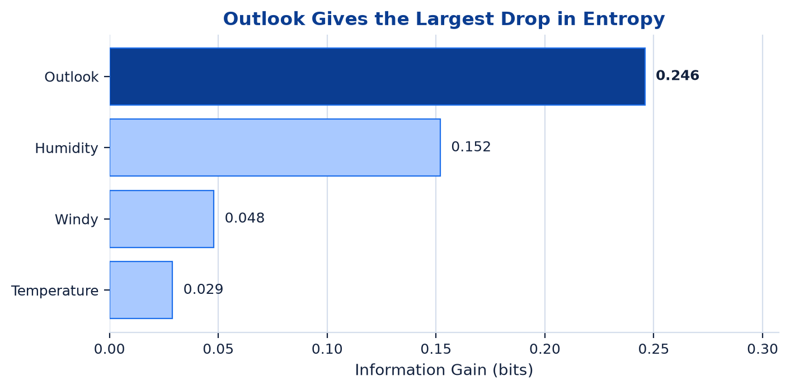
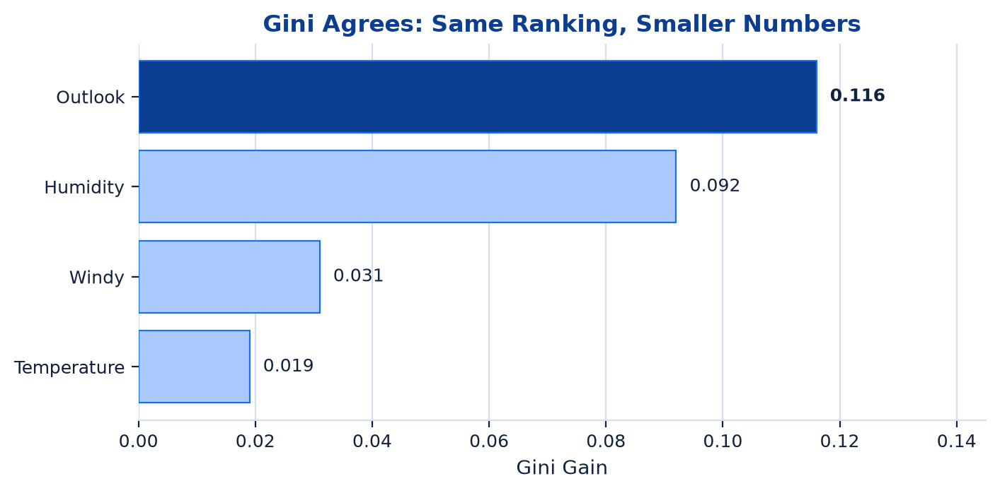
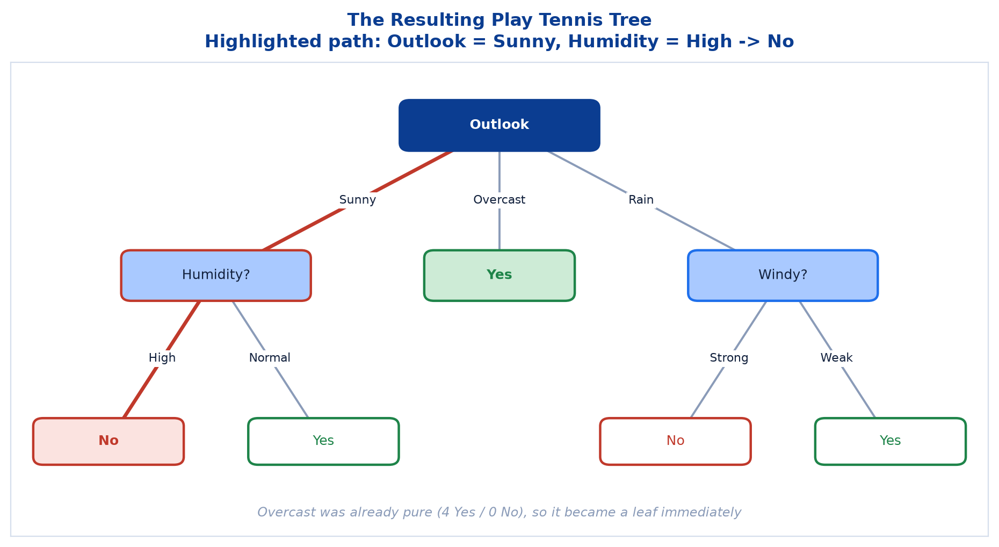
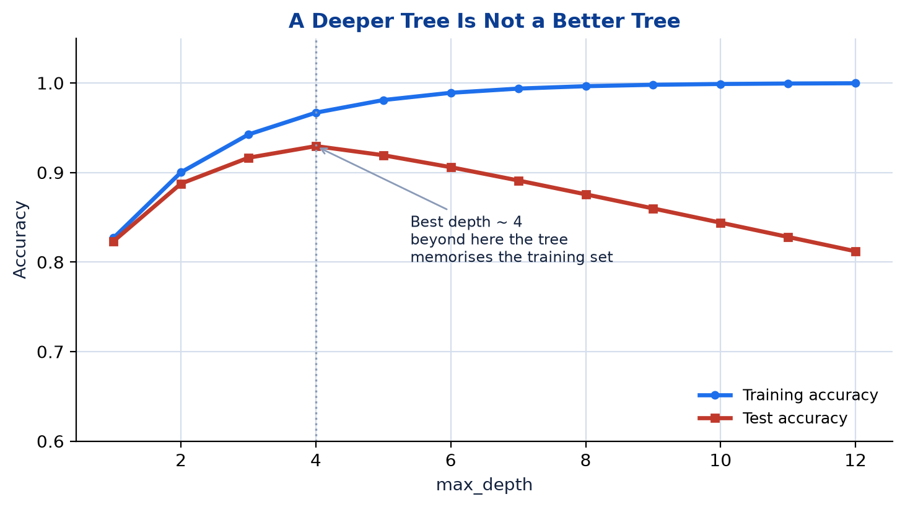

# <span style="color:#0B3D91">Decision Trees</span>

> Study notes on the first tree-based model: how a **flowchart of questions** becomes a predictive
> model. Covers **divide and conquer** → **Entropy & Information Gain** → **Gini Impurity** → a
> complete **Play Tennis worked example** computed twice, once under each criterion → **strengths,
> limitations and feature importance**.
>
> **A note on formulas:** equations are written in plain text inside code blocks rather than
> LaTeX, so they render correctly in any Markdown viewer.

---

## <span style="color:#1E6FEB">Table of Contents</span>

1. [What Is a Decision Tree?](#1-what-is-a-decision-tree)
2. [Divide and Conquer](#2-divide-and-conquer)
3. [Entropy — Measuring Uncertainty](#3-entropy--measuring-uncertainty)
4. [Information Gain](#4-information-gain)
5. [Gini Impurity](#5-gini-impurity)
6. [Worked Example — Play Tennis with Entropy](#6-worked-example--play-tennis-with-entropy)
7. [The Same Example with Gini](#7-the-same-example-with-gini)
8. [The Resulting Tree](#8-the-resulting-tree)
9. [Strengths, Limitations & Feature Importance](#9-strengths-limitations--feature-importance)
10. [Where Decision Trees Are Used](#10-where-decision-trees-are-used)

---

## <span style="color:#1E6FEB">1. What Is a Decision Tree?</span>

### 1.1 Overview / What is it?

> A **Decision Tree** is a supervised learning algorithm that predicts an outcome through a series
> of simple, sequential decisions.

It is a flowchart of questions. Start at the top, answer one question, follow the matching branch,
answer the next, and eventually arrive at an answer.



| Term | Meaning |
|---|---|
| **Root Node** | The top node — holds the entire dataset before any split has happened |
| **Decision Node** | An internal node that asks a question and splits the data further |
| **Leaf Node** | A terminal node — the final prediction, no further questions |

### 1.2 Why does it matter for AI?

Four properties make trees a standard starting point:

```text
Interpretable        -> predictions trace as a clear chain of if-then decisions
Non-linear           -> captures complex, non-linear feature/target relationships
Versatile            -> handles classification (labels) and regression (numbers)
Minimal preprocessing-> no feature scaling required; numeric and categorical both fine
```

That last property is a genuine relief after Logistic Regression and SVM, where forgetting to
scale quietly ruins the model. A tree splits on raw values, so scale simply does not matter to it.

Interpretability is the headline feature. Most models are black boxes; a tree can be printed on a
page and read aloud to a regulator.

### 1.3 Key Concepts

```text
Root node      -> "Salary > $80k?"     entire dataset
Decision node  -> "Years > 3?"         a subset of the data
Leaf node      -> "Approve"            a prediction, nothing left to ask
```

Every path from root to leaf is one complete rule. A tree with five leaves is five if-then rules
wearing a diagram.

### 1.4 Simple Example

```text
New applicant: salary $95k, debt ratio 30%

Salary > $80k?  -> Yes  -> go right
Debt > 50%?     -> No   -> go left
Leaf            -> Approve
```

Two questions, one answer, and the full reasoning is visible.

### 1.5 How it works

The model is not stored as an equation with coefficients. It is stored as the **tree structure
itself**: which feature each node tests, which threshold or category it tests, and what each leaf
predicts. Training means choosing those questions well.

### 1.6 Practical Example / Use Case

```python
from sklearn.tree import DecisionTreeClassifier

model = DecisionTreeClassifier(criterion="entropy", random_state=42)
model.fit(X_train, y_train)
predictions = model.predict(X_test)
```

No scaler, no encoder pipeline for numeric data, no fuss.

### 1.7 Key Takeaways

> - A Decision Tree predicts through a sequence of simple, sequential decisions.
> - Structure: **root node → decision nodes → leaf nodes**, where leaves hold the prediction.
> - It is interpretable, non-linear, versatile, and needs minimal preprocessing.
> - Every root-to-leaf path is a readable if-then rule.

---

## <span style="color:#1E6FEB">2. Divide and Conquer</span>

### 2.1 Overview / What is it?

Trees grow by **divide and conquer**, also called **recursive partitioning**: split the data, then
split each resulting subset again.



```text
Split 1 -- full dataset
   └── Split 2 -- subset remains homogeneous
          └── Split 3 -- leaf
```

The process repeats until subsets are sufficiently homogeneous or a stopping rule is met. The same
logic applies whether the tree predicts a class or a number.

### 2.2 Why does it matter for AI?

This is what lets a tree carve out non-linear regions. A single straight line cannot separate
complicated data — but enough axis-aligned cuts, applied recursively, can approximate almost any
boundary.

### 2.3 Key Concepts — the four-step growth loop

```text
1. Start at the Root      -> the root holds the entire dataset, no splitting yet

2. Evaluate Every Split   -> for each feature and threshold, measure separation
                             using an impurity metric (Entropy or Gini)

3. Choose the Best Split  -> pick the feature and cutoff giving the largest
                             Information Gain -- the biggest drop in impurity

4. Partition & Repeat     -> data splits into child nodes; each recurses
```

> **Stopping Rule:** growth stops when a node is **pure**, a **max depth** is reached, or **too few
> samples** remain to split.

### 2.4 Simple Example

```text
14 days of weather data
  -> split on Outlook
     -> Sunny branch (5 days)    -> split again on Humidity
     -> Overcast branch (4 days) -> already all Yes -> stop, make a leaf
     -> Rainy branch (5 days)    -> split again on Windy
```

The Overcast branch shows the stopping rule in action: nothing left to ask, so the recursion ends
there.

### 2.5 How it works

Step 3 is **greedy** — it picks the best split available *right now* and never looks ahead to
check whether a slightly worse split now would enable a much better one later. This is exactly why
trees train quickly, and equally why they are not guaranteed to find the globally optimal tree.

That tradeoff is deliberate. Searching every possible tree is computationally infeasible; greedy
splitting gets a good tree in reasonable time.

### 2.6 Practical Example / Use Case

```python
model = DecisionTreeClassifier(
    max_depth=4,           # stopping rule: depth limit
    min_samples_split=5,   # stopping rule: too few samples to bother
    random_state=42,
)
```

Those two arguments are the stopping rules, exposed as knobs. Left unset, the tree grows until
every leaf is pure — which is usually how overfitting begins.

### 2.7 Key Takeaways

> - Trees grow by **recursive partitioning**: split, then split each subset again.
> - The loop is **start at root → evaluate splits → choose the best → partition and repeat**.
> - Growth stops at a pure node, a depth limit, or too few samples.
> - Splitting is **greedy** — locally best at each step, not globally optimal.

---

## <span style="color:#1E6FEB">3. Entropy — Measuring Uncertainty</span>

### 3.1 Overview / What is it?

> **Entropy** measures the uncertainty or randomness in a dataset — how mixed the classes are in a
> node.

```text
H(S) = - SUM p_i * log2(p_i)

S    = samples at a node
p_i  = probability of class i in S
log base 2 -> entropy measured in bits
```

### 3.2 Why does it matter for AI?

Step 2 of the growth loop needs a number to compare splits with. Entropy supplies it. Without a
measurable definition of "how mixed is this node?", there is no way to say one split beats another.

### 3.3 Key Concepts

```text
Minimum: H(S) = 0        -> all samples belong to one class (complete certainty)
Maximum: H(S) = log2(c)  -> classes are equally distributed
Always:  H(S) >= 0       -> entropy is never negative
```

Binary values worth remembering:

| p (class 1) | H(S) bits |
|---:|---:|
| 0.0 | 0.000 |
| 0.2 | 0.722 |
| 0.5 | **1.000** |
| 0.8 | 0.722 |
| 1.0 | 0.000 |


```text
Entropy is 0 when the node is pure (all samples one class)
Entropy is maximum (1 bit) when both classes are equally likely (p = 0.5)
The curve is symmetric around p = 0.5
Higher entropy means higher uncertainty
```

### 3.4 Simple Example

```text
Node A: 10 Yes, 0 No   -> p = 1.00 -> H = 0.00 bits  (perfectly certain)
Node B: 8 Yes,  2 No   -> p = 0.80 -> H = 0.722 bits (fairly confident)
Node C: 5 Yes,  5 No   -> p = 0.50 -> H = 1.000 bits (a coin flip)
```

Node A needs no further questions. Node C is as uninformative as a node can be.

### 3.5 How it works

Think of entropy as **"how many yes/no questions would I still need to identify a sample's
class?"** A pure node needs zero. A perfect 50/50 split needs exactly one — hence one bit.

The `log2` is what puts the answer in bits. The convention `0 * log2(0) = 0` handles empty classes,
which is why a pure node scores exactly 0 rather than producing an error.

### 3.6 Practical Example / Use Case

```python
import numpy as np

def entropy(counts):
    """Entropy in bits for a list of per-class counts."""
    total = sum(counts)
    probs = [c / total for c in counts if c]       # skip zeros: 0*log0 = 0
    return -sum(p * np.log2(p) for p in probs)

print(round(entropy([9, 5]), 3))   # 0.94  -> the Play Tennis root node
print(round(entropy([4, 0]), 3))   # 0.0   -> a pure node
```

### 3.7 Key Takeaways

> - Entropy `H(S) = -SUM p_i * log2(p_i)` measures how mixed a node's classes are.
> - It is **0 for a pure node** and **maximum (1 bit in binary) at p = 0.5**.
> - It is always non-negative and symmetric around p = 0.5.
> - It gives the tree a comparable number for judging candidate splits.

---

## <span style="color:#1E6FEB">4. Information Gain</span>

### 4.1 Overview / What is it?

> **Information Gain (IG)** measures the reduction in entropy (uncertainty) after we split the
> dataset on an attribute.

```text
IG(S, A) = H(S) - SUM (|S_v| / |S|) * H(S_v)

S   = parent node
A   = attribute used for the split
S_v = subset of samples with value v of attribute A
```

### 4.2 Why does it matter for AI?

Entropy scores a *single node*. Information Gain scores a *split* — and a split is what the tree
actually has to choose. It is the decision criterion at the heart of step 3.

### 4.3 Key Concepts

```text
Higher IG -> more reduction in uncertainty -> better, more informative split
Lower IG  -> less reduction in uncertainty -> not a very useful split
IG = 0    -> no reduction -> the attribute provides no information at all
```

> **Key takeaway:** Decision Trees choose the split with the **HIGHEST Information Gain** at each
> step.

### 4.4 Simple Example — why the weighting matters

The second term is a **weighted average**, where each branch counts in proportion to how many
samples fall into it. That weighting is not decoration:

```text
Split X: branch of 1 sample  (H = 0.00) + branch of 99 samples (H = 0.99)
         weighted = (1/100)(0.00) + (99/100)(0.99) = 0.98  -> barely any gain

Split Y: branch of 50 samples (H = 0.20) + branch of 50 samples (H = 0.20)
         weighted = (50/100)(0.20) + (50/100)(0.20) = 0.20 -> large gain
```

Split X contains one gloriously pure branch and is still nearly useless. Without weighting, it
would look like a winner. A tiny pure branch does not get to brag.

### 4.5 How it works

```text
1. Measure the parent's entropy               -> H(S)
2. Split on the candidate attribute
3. Measure each branch's entropy              -> H(S_v)
4. Average them, weighted by branch size
5. Subtract from the parent                   -> that is the Information Gain
6. Repeat for every attribute, keep the best
```

### 4.6 Practical Example / Use Case

```python
def information_gain(parent_counts, branch_counts):
    """IG of a split, given parent class counts and a list of per-branch counts."""
    total = sum(parent_counts)
    weighted = sum(sum(b) / total * entropy(b) for b in branch_counts)
    return entropy(parent_counts) - weighted

# Splitting the 14 Play Tennis days on Outlook: Sunny, Overcast, Rainy
print(round(information_gain([9, 5], [[2, 3], [4, 0], [3, 2]]), 3))   # 0.247
```

### 4.7 Key Takeaways

> - **Information Gain = parent entropy − weighted average of child entropies.**
> - The tree picks the attribute with the **highest** IG at each node.
> - Branch entropies are **weighted by branch size**, so small pure branches cannot dominate.
> - `IG = 0` means the attribute tells the tree nothing useful.

---

## <span style="color:#1E6FEB">5. Gini Impurity</span>

### 5.1 Overview / What is it?

> **Gini Impurity** measures the probability of misclassifying a randomly chosen sample if it were
> labeled according to the class distribution in that node.

```text
Gini(S) = 1 - SUM p_i^2

S   = dataset (or node)
C   = number of classes
p_i = probability (proportion) of class i
```

### 5.2 Why does it matter for AI?

Gini is the alternative to entropy, and it is the **default criterion in scikit-learn**. It is used
in **CART** (Classification and Regression Trees) because it reaches the same conclusions more
cheaply.

```text
Computationally efficient -> only sums and squares, no logarithms
Works well in practice    -> widely used in CART
Produces balanced trees   -> compact structures
Handles multi-class       -> effective for binary and multi-class alike
```

### 5.3 Key Concepts

```text
Range:              0 <= Gini(S) < 1
Minimum:            Gini = 0     when one class has probability 1 (pure node)
Maximum (binary):   Gini = 0.5   when p1 = p2 = 0.5
Maximum (C-class):  Gini = 1 - 1/C, when all classes are equally likely
Interpretation:     lower Gini is better -- a lower value means a purer node
```


| | Gini | Entropy |
|---|---|---|
| Value at a pure node | 0 | 0 |
| Maximum (binary) | 0.5 | 1.0 bit |
| Uses logarithms | No | Yes |
| Associated algorithm | CART, sklearn default | ID3 / C4.5 |

```text
Both are 0 at p = 0 and p = 1
Entropy has the higher maximum (1 bit) than Gini (0.5)
Gini is computationally simpler (no log operations)
Both prefer purer splits
```

### 5.4 Simple Example

```text
Node: 4 Yes, 0 No
Gini = 1 - (4/4)^2 - (0/4)^2 = 1 - 1 - 0 = 0.00   -> pure

Node: 3 Yes, 2 No
Gini = 1 - (3/5)^2 - (2/5)^2 = 1 - 0.36 - 0.16 = 0.48
```

### 5.5 How it works

Read the formula literally. Pick a random sample from the node, then guess its class at random
using the node's own class proportions. `SUM p_i^2` is the probability of guessing **right**, so
`1 - SUM p_i^2` is the probability of guessing **wrong**. That is the impurity.

A pure node makes wrong guesses impossible, hence Gini = 0.

### 5.6 Practical Example / Use Case

```python
def gini(counts):
    """Gini impurity for a list of per-class counts."""
    total = sum(counts)
    return 1 - sum((c / total) ** 2 for c in counts)

print(round(gini([9, 5]), 3))   # 0.459 -> the Play Tennis root node
print(round(gini([4, 0]), 3))   # 0.0   -> a pure node

# sklearn uses Gini unless told otherwise
DecisionTreeClassifier(criterion="gini")      # default
DecisionTreeClassifier(criterion="entropy")   # opt in to Information Gain
```

### 5.7 Key Takeaways

> - **Gini Impurity `1 - SUM p_i^2`** is the probability of misclassifying a randomly chosen
>   sample.
> - It is **0 at a pure node** and **0.5 at maximum** for binary problems.
> - No logarithms, so it is cheaper than entropy — and it is the **CART / sklearn default**.
> - Gini and entropy share the same shape and usually select the same split.

---

## <span style="color:#1E6FEB">6. Worked Example — Play Tennis with Entropy</span>

### 6.1 Overview / What is it?

Fourteen days of weather observations. Will tennis be played?

```text
TARGET    Play Tennis? (Yes / No)   -> 9 days Yes, 5 days No

FEATURES  Outlook      -> Sunny / Overcast / Rainy
          Temperature  -> Hot / Mild / Cool
          Humidity     -> High / Normal
          Windy        -> True / False
```

| Outlook | Temperature | Humidity | Windy | Play Tennis |
|---|---|---|---|---|
| Sunny | Hot | High | False | No |
| Sunny | Hot | High | True | No |
| Overcast | Hot | High | False | Yes |
| Rainy | Mild | High | False | Yes |
| Rainy | Cool | Normal | False | Yes |
| Rainy | Cool | Normal | True | No |
| Overcast | Cool | Normal | True | Yes |
| Sunny | Mild | High | False | No |
| Sunny | Cool | Normal | False | Yes |
| Rainy | Mild | Normal | False | Yes |
| Sunny | Mild | Normal | True | Yes |
| Overcast | Mild | High | True | Yes |
| Overcast | Hot | Normal | False | Yes |
| Rainy | Mild | High | True | No |

### 6.2 Why does it matter for AI?

Computing one split by hand converts the formulas from symbols into something you can actually
feel. Every library call afterwards is doing exactly this, several thousand times.

### 6.3 Step 1 — Entropy at the source

Before any split, how uncertain is the outcome across all 14 days?

```text
Total days = 14
Played (Yes) = 9   ->  P = 9/14 = 0.643
Not played (No) = 5 -> P = 5/14 = 0.357

H(S) = -(0.643)log2(0.643) - (0.357)log2(0.357)
H(S) = 0.940 bits
```

This is the baseline uncertainty every candidate split is measured against.

### 6.4 Step 2 — Splitting on Outlook

Entropy is computed separately within each branch, then combined as a weighted average.



```text
Sunny (5 days)    2 Yes, 3 No
                  H = -(2/5)log2(2/5) - (3/5)log2(3/5) = 0.97

Overcast (4 days) 4 Yes, 0 No
                  H = -(4/4)log2(4/4) - 0             = 0.00

Rainy (5 days)    3 Yes, 2 No
                  H = -(3/5)log2(3/5) - (2/5)log2(2/5) = 0.97

Weighted entropy = (5/14)(0.97) + (4/14)(0.00) + (5/14)(0.97) = 0.69

Information Gain(Outlook) = 0.940 - 0.69 = 0.246
```

The largest drop in uncertainty of any feature — Outlook is the strongest first split. Note the
Overcast branch: 4 Yes and 0 No is perfectly pure, so it contributes `0.00` and becomes a leaf
immediately.

### 6.5 Step 3 — Splitting on Humidity

```text
High (7 days)   3 Yes, 4 No
                H = -(3/7)log2(3/7) - (4/7)log2(4/7) = 0.99

Normal (7 days) 6 Yes, 1 No
                H = -(6/7)log2(6/7) - (1/7)log2(1/7) = 0.59

Weighted entropy = (7/14)(0.99) + (7/14)(0.59) = 0.79

Information Gain(Humidity) = 0.940 - 0.79 = 0.151
```

The second-strongest split — Humidity cleanly separates most Normal-humidity days as Yes.

### 6.6 Step 4 — Splitting on Windy

```text
Weak (8 days)   6 Yes, 2 No
                H = -(6/8)log2(6/8) - (2/8)log2(2/8) = 0.81

Strong (6 days) 3 Yes, 3 No
                H = -(3/6)log2(3/6) - (3/6)log2(3/6) = 1.00

Weighted entropy = (8/14)(0.81) + (6/14)(1.00) = 0.89

Information Gain(Windy) = 0.940 - 0.89 = 0.048
```

The weakest split of the four so far — Windy barely reduces uncertainty on its own. Its Strong
branch sits at exactly 1.00 bits: a perfect 3/3 coin flip, which is maximum possible uncertainty.

### 6.7 Step 5 — Splitting on Temperature

```text
Hot (4 days)  2 Yes, 2 No  -> H = 1.00
Mild (6 days) 4 Yes, 2 No  -> H = 0.92
Cool (4 days) 3 Yes, 1 No  -> H = 0.81

Weighted entropy = (4/14)(1.00) + (6/14)(0.92) + (4/14)(0.81) = 0.91

Information Gain(Temperature) = 0.940 - 0.91 = 0.029
```

The weakest of all four features — Temperature contributes the least to reducing uncertainty.

### 6.8 Step 6 — Comparing Information Gain



| Feature | Information Gain |
|---|---:|
| **Outlook** | **0.246** |
| Humidity | 0.152 |
| Windy | 0.048 |
| Temperature | 0.029 |

> **Outlook wins.** With the highest Information Gain (0.246), Outlook is chosen as the root node —
> it separates the classes better than any other feature.

*(Computed to full precision, Humidity's gain is 0.1518 — it appears as both 0.151 and 0.152
depending on rounding. The ranking is unaffected.)*

### 6.9 Key Takeaways

> - Baseline entropy across the 14 days is **H(S) = 0.940 bits**.
> - Information Gain: **Outlook 0.246 > Humidity 0.152 > Windy 0.048 > Temperature 0.029**.
> - **Outlook becomes the root node.**
> - Its Overcast branch is already pure (4 Yes, 0 No, H = 0.00) and becomes a leaf at once.

---

## <span style="color:#1E6FEB">7. The Same Example with Gini</span>

### 7.1 Overview / What is it?

The identical 14 days, scored with Gini Impurity instead of entropy.

### 7.2 Why does it matter for AI?

Running both criteria over one dataset answers the obvious question — *does the choice of criterion
change the tree?* — with evidence rather than assertion.

### 7.3 Step 1 — Gini at the source

```text
Gini(S) = 1 - (0.643)^2 - (0.357)^2
Gini(S) = 0.459
```

### 7.4 Step 2 — Splitting on Outlook (Gini)

```text
Sunny (5 days)    2 Yes, 3 No -> Gini = 1 - [(2/5)^2 + (3/5)^2] = 0.48
Overcast (4 days) 4 Yes, 0 No -> Gini = 1 - [(4/4)^2 + (0/4)^2] = 0.00
Rainy (5 days)    3 Yes, 2 No -> Gini = 1 - [(3/5)^2 + (2/5)^2] = 0.48

Weighted Gini = (5/14)(0.48) + (4/14)(0.00) + (5/14)(0.48) = 0.34

Gini Gain(Outlook) = 0.459 - 0.34 = 0.116
```

### 7.5 Steps 3–5 — the other three features

```text
HUMIDITY
High (7)   3 Yes, 4 No -> Gini = 1 - [(3/7)^2 + (4/7)^2] = 0.49
Normal (7) 6 Yes, 1 No -> Gini = 1 - [(6/7)^2 + (1/7)^2] = 0.24
Weighted = (7/14)(0.49) + (7/14)(0.24) = 0.37
Gini Gain(Humidity) = 0.459 - 0.37 = 0.092

WINDY
Weak (8)   6 Yes, 2 No -> Gini = 1 - [(6/8)^2 + (2/8)^2] = 0.38
Strong (6) 3 Yes, 3 No -> Gini = 1 - [(3/6)^2 + (3/6)^2] = 0.50
Weighted = (8/14)(0.38) + (6/14)(0.50) = 0.43
Gini Gain(Windy) = 0.459 - 0.43 = 0.031

TEMPERATURE
Hot (4)  2 Yes, 2 No -> Gini = 1 - [(2/4)^2 + (2/4)^2] = 0.50
Mild (6) 4 Yes, 2 No -> Gini = 1 - [(4/6)^2 + (2/6)^2] = 0.44
Cool (4) 3 Yes, 1 No -> Gini = 1 - [(3/4)^2 + (1/4)^2] = 0.38
Weighted = (4/14)(0.50) + (6/14)(0.44) + (4/14)(0.38) = 0.44
Gini Gain(Temperature) = 0.459 - 0.44 = 0.019
```

### 7.6 Step 6 — Comparing Gini Gain



| Feature | Gini Gain | (Information Gain) |
|---|---:|---:|
| **Outlook** | **0.116** | 0.246 |
| Humidity | 0.092 | 0.152 |
| Windy | 0.031 | 0.048 |
| Temperature | 0.019 | 0.029 |

> **Outlook wins again.** With the highest Gini Gain (0.116), Outlook is chosen as the root node —
> it separates the classes better than any other feature under Gini impurity as well.

### 7.7 Key Takeaways

> - Baseline impurity is **Gini(S) = 0.459**, against entropy's 0.940 bits.
> - Gini Gain values are **smaller** than Information Gain values — the Gini curve is shorter.
> - The **ranking is identical**: Outlook > Humidity > Windy > Temperature.
> - This is the normal outcome, and it is why sklearn defaults to Gini: same decision, cheaper
>   arithmetic.

---

## <span style="color:#1E6FEB">8. The Resulting Tree</span>

### 8.1 Overview / What is it?

Recursing on each branch with the same logic produces the final tree.



```text
                    Outlook
        ┌──────────────┼──────────────┐
      Sunny         Overcast         Rain
        │              │              │
    Humidity?         Yes          Windy?
     ┌────┴────┐                 ┌────┴────┐
   High     Normal             Strong    Weak
     │         │                  │        │
    No        Yes                No       Yes
```

### 8.2 Why does it matter for AI?

This is the trained model in its entirety. No weight matrix, no coefficients — just a readable
structure that a human can audit line by line.

### 8.3 Key Concepts

```text
Depth 0: Outlook            chosen by the highest Information Gain
Depth 1: Humidity? / Yes / Windy?
Depth 2: four leaf predictions
```

The Overcast branch never got a second question because it was already pure — the stopping rule
fired immediately.

### 8.4 Simple Example — making a prediction

> For a new day `Outlook = Sunny, Humidity = High` → follow the path:
> **Outlook → Sunny → Humidity → High → Predict No.**

Notice Temperature does not appear anywhere in the tree. Its Information Gain was too low at every
node to ever be selected. The tree performed feature selection on its own, for free.

### 8.5 How it works

```text
Each internal node    -> tests one feature
Each branch           -> one value of that feature
Each leaf             -> the majority class of the samples that reach it
Prediction            -> walk root to leaf, answer questions, read the leaf
```

### 8.6 Practical Example / Use Case

```python
from sklearn.tree import export_text

print(export_text(model, feature_names=list(X.columns)))
```

`export_text` prints the tree as nested if-then rules — the fastest sanity check that the model
learned something sensible rather than something absurd.

### 8.7 Key Takeaways

> - The final tree uses **Outlook** at the root, then **Humidity** and **Windy**.
> - `Outlook = Sunny, Humidity = High` → **No**.
> - **Overcast** is a leaf straight away because that branch was already pure.
> - **Temperature never appears** — the tree discarded it without being asked to.

---

## <span style="color:#1E6FEB">9. Strengths, Limitations & Feature Importance</span>

### 9.1 Overview / What is it?

An honest account of what trees do well and where they fall over.

| Advantages | Limitations |
|---|---|
| Easy to understand and interpret | Prone to **overfitting** (deep trees) |
| Requires little data preprocessing | **High variance** — small data changes cause big tree changes |
| Works with numerical and categorical data | Less accurate than ensembles (Random Forest, XGBoost) |
| Captures non-linear patterns | Biased towards features with more levels |
| Provides feature importance | |

### 9.2 Why does it matter for AI?

The limitations column is not a footnote — it is the entire motivation for the next topic. A single
tree left unrestricted will happily grow until every training sample sits in its own private leaf,
achieving flawless training accuracy and useless real-world performance.



### 9.3 Key Concepts — the two big weaknesses

```text
OVERFITTING   a deep tree memorises the training data, including its noise
              -> near-perfect training accuracy, poor test accuracy

HIGH VARIANCE change a few training rows, retrain, and the tree can look
              completely different -- an unstable model
```

The bias towards features with more levels is subtler: a feature with many distinct values (an ID
column, say) can split the data into many tiny pure branches and score a deceptively high gain.
Drop identifier columns before training.

### 9.4 Simple Example — pruning

```text
max_depth = None  -> tree grows until every leaf is pure -> memorisation
max_depth = 3     -> tree is forced to generalise        -> usually better on test data
```

Restricting growth is called **pruning**. Counter-intuitively, a deliberately worse tree on
training data is often the better model.

### 9.5 How it works — feature importance

Decision Trees can tell us which features matter most in making the decision. Importance is based
on how much impurity each feature removed across the whole tree, weighted by how many samples it
affected.


| Feature | Importance |
|---|---:|
| Outlook | 0.45 |
| Humidity | 0.30 |
| Wind | 0.15 |
| Temperature | 0.10 |

> **Insight:** Outlook is the most influential feature for predicting whether tennis will be played
> — it carries the most weight in the tree's decisions.

Importances always sum to 1.0, so they read as "share of the decision-making".

### 9.6 Practical Example / Use Case

```python
import pandas as pd

model = DecisionTreeClassifier(criterion="entropy", max_depth=3, random_state=42)
model.fit(X_train, y_train)

importance = pd.Series(model.feature_importances_, index=X_train.columns)
print(importance.sort_values(ascending=False))

print("train:", model.score(X_train, y_train))
print("test :", model.score(X_test, y_test))
```

Always print both scores. A large gap between them is overfitting announcing itself.

### 9.7 Key Takeaways

> - Trees are **interpretable, preprocessing-light, non-linear** and report feature importance.
> - They **overfit** when grown deep and have **high variance** — small data changes reshape them.
> - They are **biased towards features with many levels**, so drop ID-like columns.
> - **Pruning** (`max_depth`, `min_samples_split`) trades training accuracy for generalisation.
> - Feature importances sum to 1.0 and show each feature's share of the decisions.

---

## <span style="color:#1E6FEB">10. Where Decision Trees Are Used</span>

### 10.1 Overview / What is it?

Four domains where tree-based models are standard.

| Use case | What the model decides |
|---|---|
| **Credit Risk Scoring** | Whether to approve a loan based on applicant history |
| **Medical Diagnosis Support** | Flag likely conditions from patient symptoms and test results |
| **Customer Churn Prediction** | Identify customers likely to cancel a subscription |
| **Fraud Detection** | Spot unusual transactions resembling known fraud patterns |

### 10.2 Why does it matter for AI?

Look at what those four share: each one will eventually face the question *"why did the model
decide that?"* — from a regulator, a doctor, a retention team or a fraud analyst. A tree can
answer. That auditability is often worth more than a fractional accuracy gain from an opaque model.

### 10.3 Key Concepts

```text
High-stakes decision + need for an explanation -> tree-based models are a strong fit
Mixed numeric and categorical features         -> no elaborate preprocessing needed
Non-linear interactions                        -> handled by successive splits
```

### 10.4 Simple Example

```text
Loan declined.
Reason, read straight off the tree:
    Salary > $80k? No -> Years at job > 3? No -> Decline
```

Try producing that sentence from a neural network without extra tooling.

### 10.5 How it works

In production these are rarely *single* trees. They are usually Random Forests or gradient-boosted
ensembles — many trees voting together, trading a little interpretability for a lot of accuracy
and stability.

### 10.6 Practical Example / Use Case

```python
# A single tree first -- it is the interpretable baseline
baseline = DecisionTreeClassifier(max_depth=4, random_state=42).fit(X_train, y_train)

# Then compare against an ensemble before deciding what to ship
```

Establish the simple, explainable baseline first. Only adopt the complex model if it measurably
beats it.

### 10.7 Key Takeaways

> - Trees suit **credit scoring, medical diagnosis support, churn prediction and fraud detection**.
> - Their common thread is **high-stakes decisions that require an explanation**.
> - They handle mixed feature types and non-linear interactions with little preparation.
> - Production systems typically use **ensembles of trees** rather than one tree.

---

## <span style="color:#1E6FEB">Summary — Decision Trees at a Glance</span>

```text
Root (all data) -> measure impurity -> try every split -> keep the highest gain
                -> partition -> recurse -> stop at pure / max depth / too few samples
```

| Concept | One-sentence mental model |
|---|---|
| Decision Tree | A flowchart of questions that ends in a prediction |
| Divide and conquer | Split the data, then split each piece again |
| Entropy | How mixed a node is, measured in bits |
| Information Gain | How much entropy a split removes |
| Gini Impurity | Chance of misclassifying a random sample from the node |
| Feature importance | Each feature's share of the impurity removed |
| Pruning | Deliberately stop growing, to generalise better |

**The Play Tennis result in one line:** baseline entropy 0.940 bits, Outlook wins under both
criteria (IG 0.246, Gini Gain 0.116), and becomes the root of a three-level tree that never needs
Temperature at all.

**The one-sentence version:** a Decision Tree repeatedly asks the single most informative question
available, measured by Information Gain or Gini Gain, until each group of samples is pure enough to
predict — which makes it wonderfully readable and dangerously easy to overfit.

**Where this leads:** that last weakness — high variance and overfitting from a single tree — is
exactly the problem the next topic solves. **Ensemble methods and Random Forest** build many
different trees and let them vote, turning an unstable model into a reliable one.

---

> **Navigation:** Next → [02 — Ensemble Methods & Random Forest](02_Machine_Learning_Ensemble_Methods_And_Random_Forest.md)
