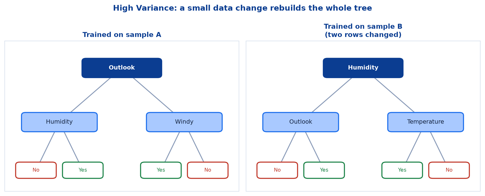
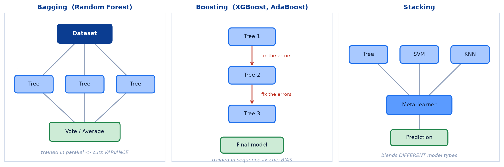
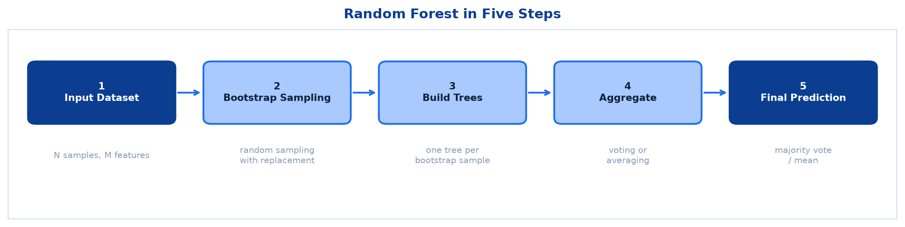
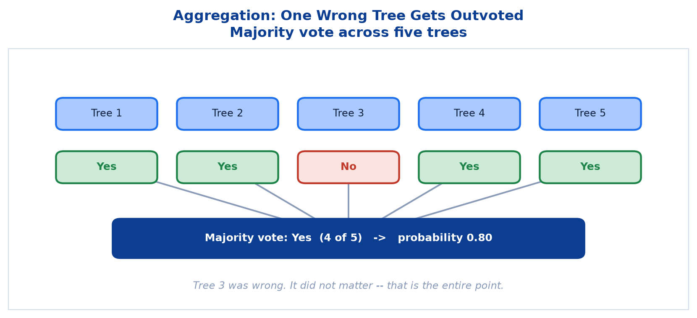
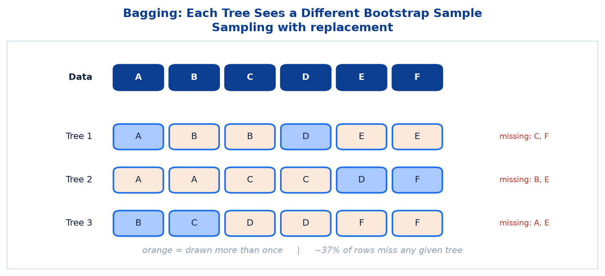
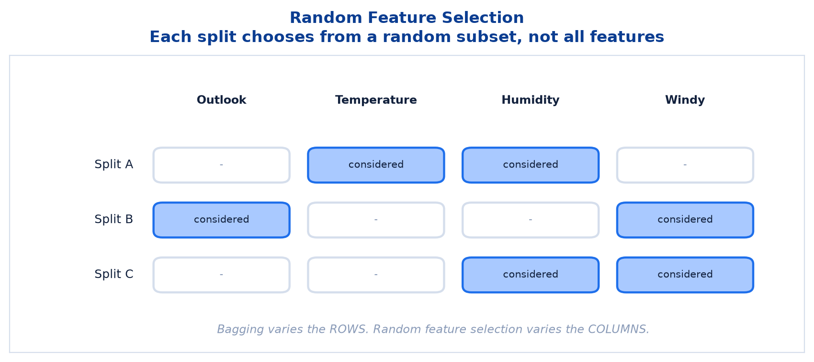
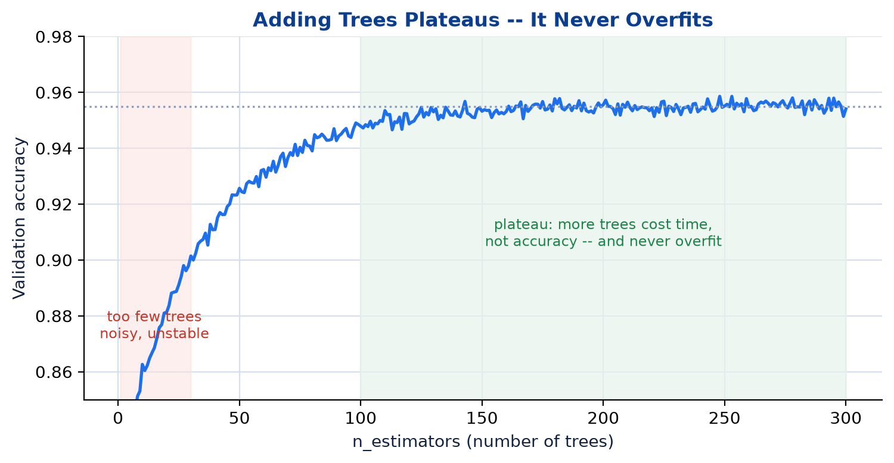
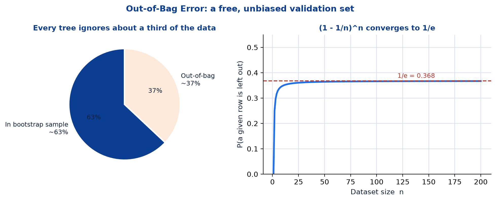
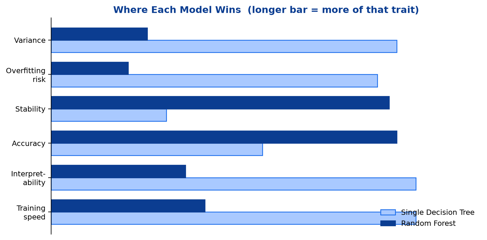

# <span style="color:#0B3D91">Ensemble Methods & Random Forest</span>

> Study notes on why one Decision Tree is rarely enough, and how combining many of them produces a
> reliable model. Covers the **weaknesses of a single tree** → **Bagging, Boosting and Stacking** →
> **Random Forest** → its **two diversity mechanisms** → **Out-of-Bag error** → a direct
> **tree-versus-ensemble comparison**.
>
> **A note on formulas:** equations are written in plain text inside code blocks rather than
> LaTeX, so they render correctly in any Markdown viewer.

---

## <span style="color:#1E6FEB">Table of Contents</span>

1. [Why Go for Ensemble-Based Algorithms?](#1-why-go-for-ensemble-based-algorithms)
2. [How Ensembles Help](#2-how-ensembles-help)
3. [What Is Random Forest?](#3-what-is-random-forest)
4. [Bagging + Random Feature Selection](#4-bagging--random-feature-selection)
5. [Key Hyperparameters](#5-key-hyperparameters)
6. [Out-of-Bag (OOB) Error](#6-out-of-bag-oob-error)
7. [Advantages & Limitations](#7-advantages--limitations)
8. [Decision Tree vs. Ensemble Methods](#8-decision-tree-vs-ensemble-methods)

---

## <span style="color:#1E6FEB">1. Why Go for Ensemble-Based Algorithms?</span>

### 1.1 Overview / What is it?

> Decision Trees are simple and interpretable, but **prone to overfitting and high variance**.

The previous topic ended on that warning. This topic is the fix.

| Weakness | What goes wrong |
|---|---|
| **High Variance** | A tree can fit training data very well, **including noise**, but fail to generalize |
| **Instability** | Small changes in training data can create a **completely different tree structure** |
| **Greedy Nature** | Locally optimal splits, which may not lead to the globally best model |
| **Limited Predictive Power** | A single tree may not capture complex patterns as well as ensembles |



### 1.2 Why does it matter for AI?

These are not bugs waiting for a patch. They are inherent to how one greedy tree works. You cannot
fix instability by writing a more careful tree — you fix it by **not depending on a single tree**.

> **Key takeaway:** Ensembles reduce errors by combining many models, so the weaknesses of one tree
> are compensated by the strengths of others.

### 1.3 Key Concepts — the wisdom-of-crowds intuition

```text
Ask ONE expert    -> one opinion, plus all of that expert's personal quirks
Ask 500 experts   -> quirks disagree and cancel out; genuine signal survives
```

The mechanism is statistical, not magical. **Random errors point in random directions and average
towards zero. The correct answer is the one thing they all tend to agree on.**

### 1.4 Simple Example — instability in practice

```text
Train a tree on 1,000 rows           -> root splits on "Income"
Remove 5 rows, retrain               -> root splits on "Age"
Whole structure below the root changes too
```

A model that reorganises itself because five rows moved is not one you want making decisions.

### 1.5 How it works

An ensemble accepts that each individual model is flawed and arranges for the flaws to be
**different from each other**. Errors that are uncorrelated cancel on aggregation; errors that are
identical do not. This is why **diversity** — the subject of section 4 — is the whole ballgame.

### 1.6 Practical Example / Use Case

```python
from sklearn.tree import DecisionTreeClassifier
from sklearn.model_selection import cross_val_score

tree = DecisionTreeClassifier(random_state=42)
scores = cross_val_score(tree, X, y, cv=5)
print(scores)              # watch how much the fold scores bounce around
print(scores.std())        # that spread IS the variance problem
```

### 1.7 Key Takeaways

> - A single tree suffers **high variance, instability, greedy splits** and **limited predictive
>   power**.
> - These weaknesses are structural, not fixable within one tree.
> - **Ensembles combine many models so one model's weaknesses are covered by others.**
> - The mechanism relies on models making **different** mistakes.

---

## <span style="color:#1E6FEB">2. How Ensembles Help</span>

### 2.1 Overview / What is it?

```text
Single Decision Tree:   high variance
Ensemble of many trees: low variance
```

Three families of ensemble exist:



| Family | Examples | What it reduces | How |
|---|---|---|---|
| **Bagging** | Random Forest | **Variance** | Averaging many trees trained on different subsets of data |
| **Boosting** | XGBoost, LightGBM, AdaBoost | **Bias** (and variance) | Focusing on hard-to-predict examples **sequentially** |
| **Stacking** | — | — | Combines **different models/learners** to get a better prediction |

### 2.2 Why does it matter for AI?

Four concrete benefits:

```text
Higher Accuracy       -> combines models to improve predictive performance
Better Generalization -> reduces overfitting; performs well on unseen data
Robustness            -> less sensitive to noise, outliers and small data changes
Leverages Diversity   -> different trees learn different aspects; together stronger
```

### 2.3 Key Concepts — parallel versus sequential

The structural difference between the first two families matters:

```text
BAGGING   all trees train independently, at the same time
          no tree knows the others exist
          -> attacks VARIANCE

BOOSTING  trees train one after another
          each new tree focuses on what the previous ones got wrong
          -> attacks BIAS
```

**Random Forest is bagging.** Boosting and stacking are named here for context; this session does
not go further into them.

### 2.4 Simple Example

```text
Bagging:  five students each read a random two-thirds of the textbook,
          then vote on each exam answer

Boosting: one student takes the exam, a second studies only the questions
          the first got wrong, a third studies what the second still missed
```

### 2.5 How it works

The critical requirement is stated in the fourth benefit above: **leverages diversity**. If all 500
trees were identical, their vote would equal one tree's answer and you would have burned 500× the
compute for nothing. An ensemble is only as good as the disagreement within it.

### 2.6 Practical Example / Use Case

```python
from sklearn.ensemble import RandomForestClassifier    # bagging
from sklearn.ensemble import GradientBoostingClassifier # boosting

# Start with bagging. It needs less tuning and is harder to get wrong.
```

### 2.7 Key Takeaways

> - **Bagging** reduces variance by training many models **in parallel** on different data subsets.
> - **Boosting** reduces bias by training models **sequentially** on hard examples.
> - **Stacking** combines **different types** of learner.
> - Benefits: higher accuracy, better generalization, robustness, and leveraging diversity.
> - **Random Forest is a bagging method.**

---

## <span style="color:#1E6FEB">3. What Is Random Forest?</span>

### 3.1 Overview / What is it?

> An **ensemble learning method** that builds multiple Decision Trees and outputs the **majority
> vote** (classification) or **mean** (regression).



```text
1. Input Dataset       -> N samples, M features
        |
2. Bootstrap Sampling  -> random sampling WITH replacement
        |
3. Build Trees         -> one decision tree per bootstrap sample
        |
4. Aggregate           -> voting (classification) or averaging (regression)
        |
5. Final Prediction    -> majority vote / mean
```

> **Key takeaway:** Combine many diverse trees to reduce overfitting and improve generalization:
> **Decision Tree (high variance) → Random Forest (low variance, high accuracy).**

### 3.2 Why does it matter for AI?

Random Forest is one of the most dependable general-purpose models available. It needs little
tuning, resists overfitting, handles mixed data types, and is almost always a respectable baseline.
It is frequently the model you try second and keep.

### 3.3 Key Concepts — aggregation depends on the task

```text
Classification -> majority VOTE across trees
Regression     -> MEAN of the trees' numeric predictions
```

### 3.4 Simple Example — a worked vote

Five trees classify one Play Tennis day:



```text
Tree 1 -> Yes
Tree 2 -> Yes
Tree 3 -> No
Tree 4 -> Yes
Tree 5 -> Yes

Majority vote: Yes (4 of 5)
Probability:   4/5 = 0.80
```

Tree 3 was wrong. It did not matter — **that is the entire point**. One poor tree gets outvoted,
whereas one poor *single* tree is your whole model.

### 3.5 How it works

```text
Training:   build T trees, each on its own bootstrap sample,
            each split restricted to a random feature subset

Prediction: run the input through all T trees,
            then vote (classification) or average (regression)
```

The forest's probability output is simply the **fraction of trees** voting for each class, which is
why `predict_proba` on a 500-tree forest returns pleasingly granular numbers.

### 3.6 Practical Example / Use Case

```python
from sklearn.ensemble import RandomForestClassifier

forest = RandomForestClassifier(n_estimators=500, random_state=42)
forest.fit(X_train, y_train)

print(forest.predict(X_test)[:5])
print(forest.predict_proba(X_test)[:5])   # the vote shares
```

### 3.7 Key Takeaways

> - **Random Forest = many Decision Trees → majority vote or mean.**
> - The pipeline is **dataset → bootstrap → build trees → aggregate → predict**.
> - Classification votes; regression averages.
> - Individual trees may be wrong; the aggregate absorbs it.

---

## <span style="color:#1E6FEB">4. Bagging + Random Feature Selection</span>

### 4.1 Overview / What is it?

These are **the two mechanisms that make each tree in the forest different from the others**. Random
Forest uses both, and it needs both.

| Mechanism | What it varies |
|---|---|
| **Bagging (Bootstrap Aggregating)** | Trains each tree on a **different bootstrap sample** of the data |
| **Random Feature Selection** | At each split, considers only a **random subset of features** (not all) |

### 4.2 Why does it matter for AI?

Without these, every tree would see identical data and identical options, produce an identical
structure, and cast an identical vote. The forest would be an expensive single tree.

### 4.3 Key Concepts — Bagging

A bootstrap sample means sampling **with replacement**: the same row can appear multiple times, and
some rows will not appear at all.



```text
Original 6 rows:  [A, B, C, D, E, F]

Tree 1 sample:    [A, B, B, D, E, E]   -> C and F missing, B and E doubled
Tree 2 sample:    [A, A, C, C, D, F]   -> B and E missing
Tree 3 sample:    [B, C, D, D, F, F]   -> A and E missing
```

Each tree grows up in a slightly different world, so each develops a slightly different shape.

### 4.4 Key Concepts — Random Feature Selection

This is the mechanism people skip, and it is essential.



```text
All features: [Outlook, Temperature, Humidity, Windy]

Split A considers: [Temperature, Humidity]   -> Outlook is not even on the ballot
Split B considers: [Outlook, Windy]
Split C considers: [Humidity, Windy]
```

**Why it is needed:** with bagging alone, if one feature is overwhelmingly predictive, every tree
picks it as the root and the trees end up near-identical — diversity dies quietly. Restricting each
split to a random subset forces weaker-but-useful features to get a turn, and produces genuinely
decorrelated trees.

```text
Bagging varies the ROWS.
Random feature selection varies the COLUMNS.
Together they produce genuinely different trees.
```

### 4.5 Simple Example

```text
Dataset with 16 features, max_features = "sqrt"
-> sqrt(16) = 4
-> every single split picks the best of 4 randomly offered features
-> 12 features sit out each decision
```

### 4.6 How it works

Deliberately handicapping each split sounds counterproductive, and for one tree it is — an
individual forest tree is usually *worse* than a carefully grown standalone tree. The forest trades
individual quality for **collective independence**, and the aggregate wins comfortably.

### 4.7 Practical Example / Use Case

```python
forest = RandomForestClassifier(
    n_estimators=500,
    max_features="sqrt",   # the random feature selection dial
    bootstrap=True,        # bagging, on by default
    random_state=42,
)
```

### 4.8 Key Takeaways

> - **Bagging** gives each tree a different **bootstrap sample** (sampling with replacement).
> - **Random feature selection** gives each **split** a different random feature subset.
> - Rows vary, columns vary — so the trees genuinely differ.
> - Each tree is individually weaker; the ensemble is collectively far stronger.

---

## <span style="color:#1E6FEB">5. Key Hyperparameters</span>

### 5.1 Overview / What is it?

The five dials worth knowing:

| Parameter | Description | Typical values |
|---|---|---|
| `n_estimators` | Number of trees in the forest | 100, 200, 500, 1000 |
| `max_depth` | Maximum depth of each tree | None, 10, 20, 30 |
| `max_features` | Features considered at each split | `sqrt`, `log2`, None |
| `min_samples_split` | Minimum samples required to split a node | 2, 5, 10 |
| `min_samples_leaf` | Minimum samples required at a leaf node | 1, 2, 4 |

### 5.2 Why does it matter for AI?

Random Forest performs well with defaults, which is a large part of its appeal. Knowing these dials
lets you tune deliberately rather than superstitiously.

### 5.3 Key Concepts

```text
n_estimators      -> how many voters
max_depth         -> how complex each voter may become
max_features      -> how much choice each split gets (the diversity dial)
min_samples_split -> refuse to split nodes that are already tiny
min_samples_leaf  -> refuse to create leaves that are too small to trust
```

### 5.4 Simple Example — more trees never overfit



```text
10 trees   -> noisy, unstable
100 trees  -> good
500 trees  -> marginally better
5000 trees -> marginally better still, and slow
```

Raising `n_estimators` **never causes overfitting** — accuracy plateaus rather than degrading. The
only costs are time and memory. This is genuinely different from `max_depth` on a single tree,
where more is actively dangerous.

### 5.5 How it works

`max_depth=None` is a reasonable default **here**, unlike for a lone tree. Individual forest trees
are *allowed* to overfit their bootstrap samples, because averaging cleans up the mess afterwards.
The forest's defence against overfitting is aggregation, not pruning.

### 5.6 Practical Example / Use Case

```python
forest = RandomForestClassifier(
    n_estimators=500,        # plenty of voters; safe to increase
    max_depth=None,          # let trees grow; the vote handles it
    max_features="sqrt",     # classification default
    min_samples_leaf=1,
    n_jobs=-1,               # trees are independent -> train them in parallel
    random_state=42,
)
```

`n_jobs=-1` is free speed. Bagging trains trees independently, so they parallelise perfectly.

### 5.7 Key Takeaways

> - `n_estimators` is the number of trees — **more never overfits**, it just costs time.
> - `max_features` is the diversity dial; `sqrt` is the usual classification default.
> - `max_depth=None` is acceptable for forests because voting absorbs individual overfitting.
> - `min_samples_split` and `min_samples_leaf` restrain individual trees when needed.

---

## <span style="color:#1E6FEB">6. Out-of-Bag (OOB) Error</span>

### 6.1 Overview / What is it?

> Each bootstrap sample leaves out **~37%** of the data (the "out-of-bag" samples). These unseen
> points give a **free, unbiased estimate** of model performance — without needing a separate
> validation set.



```text
~63%  in bootstrap sample   (used to train this tree)
~37%  out-of-bag            (never seen by this tree -> usable as its test set)
```

> **Key takeaway:** Lower OOB error → better model.

### 6.2 Why does it matter for AI?

Validation data normally costs you training data. OOB scoring gives a held-out estimate for
nothing, which is especially valuable on small datasets where surrendering 20% of rows genuinely
hurts.

### 6.3 Key Concepts — where 37% comes from

Drawing `n` samples with replacement from `n` rows, the chance a specific row is missed every time
is:

```text
(1 - 1/n)^n   ->   1/e   =   0.368   as n grows
```

So roughly **37%** of rows are out-of-bag for any given tree. Not a magic constant — just `1/e`
wearing a hat.

### 6.4 Simple Example

```text
Row 47 is out-of-bag for trees 3, 8, 12, 19, ... (about a third of them)
-> predict row 47 using ONLY those trees
-> compare against its true label
-> repeat for every row -> that average is the OOB score
```

Every row gets evaluated by a sub-forest that never saw it. That is a legitimate held-out estimate.

### 6.5 How it works

OOB scoring is roughly comparable to k-fold cross-validation, but obtained during a single training
run rather than by retraining k times. On a large forest it is a very convenient shortcut.

### 6.6 Practical Example / Use Case

```python
forest = RandomForestClassifier(n_estimators=500, oob_score=True, random_state=42)
forest.fit(X_train, y_train)

print("OOB score :", forest.oob_score_)
print("Test score:", forest.score(X_test, y_test))
```

Those two numbers should land close together. A large gap means something is off — usually a data
leak or a badly shuffled split.

### 6.7 Key Takeaways

> - Each tree never sees about **37%** of the data — its **out-of-bag** samples.
> - The 37% comes from `(1 - 1/n)^n → 1/e`.
> - OOB samples provide a **free, unbiased** performance estimate with no separate validation set.
> - **Lower OOB error → better model.** Enable it with `oob_score=True`.

---

## <span style="color:#1E6FEB">7. Advantages & Limitations</span>

### 7.1 Overview / What is it?

| Advantages | Limitations |
|---|---|
| High accuracy and **robust to overfitting** | **Less interpretable** than a single tree |
| Handles **missing values and outliers** effectively | Requires **more computational power and memory** |
| Works well on **large, high-dimensional data** | **Prediction time increases** with more trees |

### 7.2 Why does it matter for AI?

The trade is stated plainly: you surrender the ability to draw your model on a whiteboard in
exchange for accuracy and stability. Whether that is acceptable depends entirely on your domain.

### 7.3 Key Concepts — what "less interpretable" really means

```text
Single tree   -> trace one prediction as a readable if-then chain
Random Forest -> 500 trees voted; there is no single chain to read
```

A forest still reports **feature importances**, averaged across all its trees — and those are
usually *more* trustworthy than a single tree's, because they are not hostage to one greedy split.
What you lose is per-prediction traceability, not global insight.

### 7.4 Simple Example

```text
Regulator: "Why was this specific loan declined?"

Single tree:    "Salary below 80k, then under 3 years at the job."
Random Forest:  "347 of 500 trees voted decline." ... which satisfies nobody.
```

### 7.5 How it works

Prediction cost scales linearly with `n_estimators`: a 500-tree forest does 500 tree traversals per
prediction. Fine for batch scoring, worth measuring for low-latency serving.

### 7.6 Practical Example / Use Case

```python
import pandas as pd

importance = pd.Series(forest.feature_importances_, index=X_train.columns)
print(importance.sort_values(ascending=False).head(10))
```

> **Worth knowing:** for per-prediction explanations of a forest, practitioners reach for tools like
> SHAP or LIME. Those are beyond this session, but it is useful to know the gap has been filled.

### 7.7 Key Takeaways

> - **Advantages:** high accuracy, robust to overfitting, handles missing values and outliers, good
>   on large high-dimensional data.
> - **Limitations:** less interpretable, heavier on compute and memory, slower predictions with more
>   trees.
> - Global **feature importance survives**; per-prediction traceability does not.

---

## <span style="color:#1E6FEB">8. Decision Tree vs. Ensemble Methods</span>

### 8.1 Overview / What is it?

| Aspect | Decision Tree (Single) | Ensemble Methods |
|---|---|---|
| **Bias** | Low (deep tree) / High (shallow tree) | Lower overall |
| **Variance** | High | Much lower |
| **Overfitting Risk** | High | Low |
| **Stability** | Low (sensitive to data change) | High (more stable) |
| **Accuracy** | Moderate | High |
| **Training Time** | Low | Higher |
| **Best Use Cases** | Quick insights, interpretable rules | High accuracy, production systems |



### 8.2 Why does it matter for AI?

That final row is the practical summary: **single tree to understand your data, ensemble to ship**.

### 8.3 Key Concepts

```text
Need to explain every prediction?      -> single tree
Need the best accuracy you can get?    -> ensemble
Exploring a new dataset?               -> single tree first, it is fast and readable
Building a production system?          -> ensemble
```

### 8.4 Simple Example — the sensible workflow

```text
1. Train one shallow tree      -> read it, understand the data, sanity-check features
2. Train a Random Forest       -> measure the accuracy you can actually reach
3. Compare                     -> is the accuracy gain worth the interpretability loss?
```

### 8.5 How it works

Note that ensembles reduce variance dramatically but only lower bias "overall" and modestly. If
your model is **underfitting** — bad on training data *and* test data — a Random Forest is not the
cure. Bagging fixes variance, not bias. That distinction is the subject of a later topic.

### 8.6 Practical Example / Use Case

```python
from sklearn.model_selection import cross_val_score

tree_scores = cross_val_score(DecisionTreeClassifier(random_state=42), X, y, cv=5)
forest_scores = cross_val_score(RandomForestClassifier(n_estimators=200, random_state=42), X, y, cv=5)

print(f"Tree   : {tree_scores.mean():.3f} +/- {tree_scores.std():.3f}")
print(f"Forest : {forest_scores.mean():.3f} +/- {forest_scores.std():.3f}")
```

Watch the **standard deviation**, not just the mean. The forest's smaller spread is the variance
reduction, made visible.

### 8.7 Key Takeaways

> - Ensembles have **much lower variance**, **lower overfitting risk** and **higher stability**.
> - Single trees win on **training time** and **interpretability**.
> - Use a tree for **quick insights and readable rules**; an ensemble for **production accuracy**.
> - Bagging fixes **variance**, not bias — it will not rescue an underfitting model.

---

## <span style="color:#1E6FEB">Summary — Ensembles at a Glance</span>

```text
One tree  -> high variance, unstable, greedy
Many diverse trees -> vote/average -> low variance, stable, accurate
```

| Concept | One-sentence mental model |
|---|---|
| Ensemble | Many models whose independent mistakes cancel out |
| Bagging | Train in parallel on different data samples — cuts variance |
| Boosting | Train in sequence on the hard cases — cuts bias |
| Stacking | Blend different types of model |
| Random Forest | Bagging + random feature selection, then vote |
| Bootstrap sample | Rows drawn with replacement; ~63% in, ~37% out |
| OOB error | Free validation using the rows each tree never saw |

**The one-sentence version:** Random Forest takes the one thing a Decision Tree is bad at —
being stable — and fixes it by growing hundreds of deliberately different trees and letting them
vote, trading interpretability for accuracy and reliability.

**Where this leads:** every model so far has learned from **labelled** data — each row came with a
known answer. The next topic drops that assumption entirely. **Clustering** finds structure in data
that has no target variable at all.

---

> **Navigation:** ← Previous: [01 — Decision Trees](01_Machine_Learning_Decision_Trees.md) ·
> Next → [03 — Clustering & K-Means](03_Machine_Learning_Clustering_And_KMeans.md)
