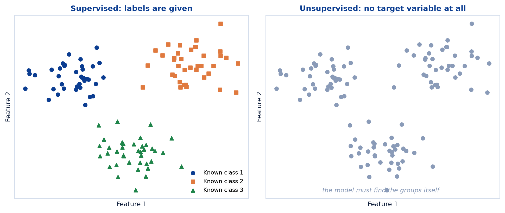
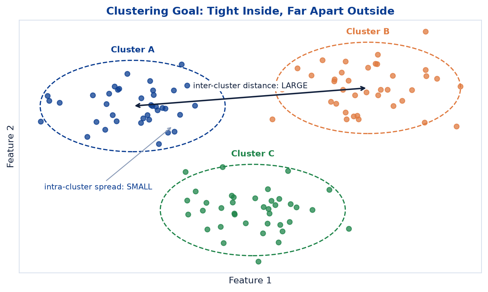
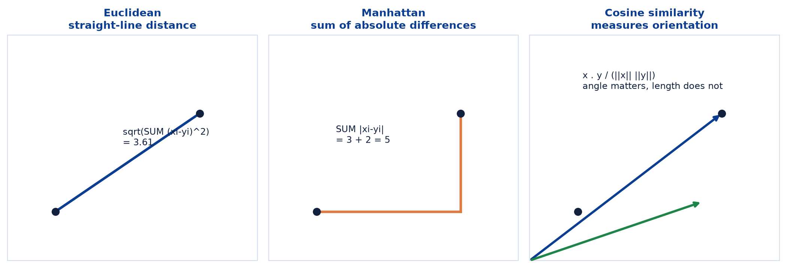
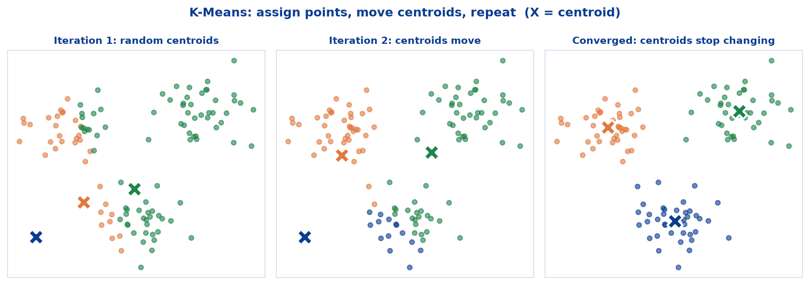
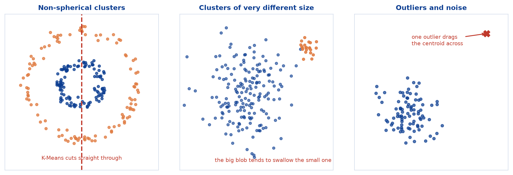
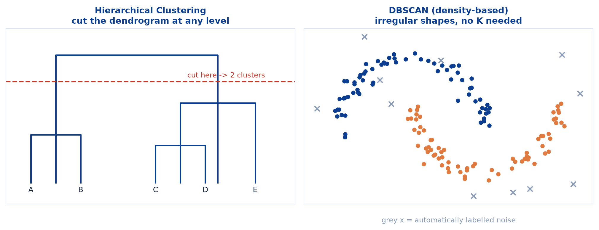

# <span style="color:#0B3D91">Clustering & K-Means</span>

> Study notes on the session's first **unsupervised** algorithm: finding structure in data that has
> no labels at all. Covers **supervised vs unsupervised learning** → **what clustering is** →
> **distance metrics** → **K-Means** and its **WCSS objective** → **choosing K with the Elbow
> Method** → **limitations** → **Hierarchical Clustering and DBSCAN**.
>
> **A note on formulas:** equations are written in plain text inside code blocks rather than
> LaTeX, so they render correctly in any Markdown viewer.

---

## <span style="color:#1E6FEB">Table of Contents</span>

1. [Unsupervised Learning & Clustering](#1-unsupervised-learning--clustering)
2. [What Is Clustering?](#2-what-is-clustering)
3. [How Clustering Works — Distance Metrics](#3-how-clustering-works--distance-metrics)
4. [Where Clustering Is Used](#4-where-clustering-is-used)
5. [What Is K-Means?](#5-what-is-k-means)
6. [Objective Function & Distance Metric](#6-objective-function--distance-metric)
7. [Choosing K — The Elbow Method](#7-choosing-k--the-elbow-method)
8. [Advantages & Limitations](#8-advantages--limitations)
9. [Beyond K-Means](#9-beyond-k-means)

---

## <span style="color:#1E6FEB">1. Unsupervised Learning & Clustering</span>

### 1.1 Overview / What is it?

> **Unsupervised Learning** is a type of machine learning where the model learns patterns from
> **unlabeled data**.
>
> **Clustering** is an unsupervised technique that groups similar data points together so that
> points in the same cluster are more similar to each other than to those in other clusters.



### 1.2 Why does it matter for AI?

Every model so far — Linear Regression, Logistic Regression, SVM, Decision Trees, Random Forest —
needed a **known answer** for every training row. Real data usually arrives without one. Nobody
hands you a spreadsheet of customers pre-tagged with which segment they belong to; discovering the
segments *is* the job.

### 1.3 Key Concepts

```text
No target variable      -> no labels are used
Discovers structure     -> finds hidden patterns
Useful for segmentation -> exploration and grouping
Results may vary        -> with algorithm and parameters
```

That fourth characteristic deserves attention. In supervised learning there is a correct answer to
compare against. In clustering there often is not — change the algorithm or the parameters and you
get a different, possibly equally defensible, grouping.

### 1.4 Simple Example

```text
SUPERVISED:    here are 1,000 emails, each labelled spam or not spam
               -> learn to predict the label

UNSUPERVISED:  here are 1,000 emails, no labels at all
               -> find natural groupings among them
```

### 1.5 How it works

Without labels there is no prediction error to minimise. Clustering optimises a **geometric**
objective instead: make points within a group close together, and groups far from each other.
"Correct" is replaced by "coherent".

### 1.6 Practical Example / Use Case

```python
from sklearn.cluster import KMeans

# Note what is missing: there is no y.
model = KMeans(n_clusters=3, random_state=42)
labels = model.fit_predict(X)
```

`fit_predict(X)` with no `y` is the visual signature of unsupervised learning.

### 1.7 Key Takeaways

> - **Unsupervised learning** finds patterns in **unlabeled** data.
> - **Clustering** groups similar points so within-group similarity beats between-group similarity.
> - Characteristics: no target variable, discovers structure, useful for segmentation, and
>   **results may vary** with algorithm and parameters.
> - There is no `y` — which also means no accuracy score.

---

## <span style="color:#1E6FEB">2. What Is Clustering?</span>

### 2.1 Overview / What is it?

> Clustering **partitions data points into groups such that intra-cluster similarity is high and
> inter-cluster similarity is low.**



```text
Intra-cluster similarity is HIGH -> points within a cluster are similar
Inter-cluster similarity is LOW  -> points in different clusters are dissimilar
No target variable is used to guide the grouping
```

### 2.2 Why does it matter for AI?

Those two conditions are the entire definition of a good clustering, and they are what every
clustering metric ultimately measures. Get comfortable with the pair — **tight inside, far apart
outside**.

### 2.3 Key Concepts

```text
intra = WITHIN a cluster  -> want this distance SMALL
inter = BETWEEN clusters  -> want this distance LARGE
```

A clustering that achieves only one of the two is not useful. One enormous cluster containing
everything has no inter-cluster problem at all, and is also completely worthless.

### 2.4 Simple Example

```text
Good:  customers who shop weekly and spend a lot     -> Cluster A
       customers who shop rarely and spend little    -> Cluster B
       clearly different behaviours, clearly separated

Bad:   two clusters that overlap so heavily you cannot say
       what distinguishes them
```

### 2.5 How it works

"Similar" has to be defined numerically before anything can be grouped — which is precisely what
the next section covers.

### 2.6 Practical Example / Use Case

```python
import matplotlib.pyplot as plt

plt.scatter(X[:, 0], X[:, 1], c=labels, cmap="viridis")
plt.xlabel("Feature 1")
plt.ylabel("Feature 2")
plt.show()
```

Always plot clusters when the data is low-dimensional. Your eyes are an excellent first evaluation
metric.

### 2.7 Key Takeaways

> - Clustering partitions data so **intra-cluster similarity is high** and **inter-cluster
>   similarity is low**.
> - Tight inside, far apart outside — both conditions matter.
> - No target variable guides the grouping.

---

## <span style="color:#1E6FEB">3. How Clustering Works — Distance Metrics</span>

### 3.1 Overview / What is it?

The general conceptual flow:

```text
1. Input Data           -> unlabeled data points
        |
2. Measure Similarity   -> compute distance between points
        |
3. Group Similar Points -> form clusters of similar points
        |
4. Final Clusters       -> clusters represent natural groups
```

### 3.2 Why does it matter for AI?

Step 2 is where the meaning lives. "Similar" is not a universal concept — it is whatever your
distance metric says it is. Choose a different metric and you can get entirely different clusters
from identical data.

### 3.3 Key Concepts — common distance / similarity metrics



| Metric | Formula | Meaning |
|---|---|---|
| **Euclidean Distance** | `d(x,y) = sqrt(SUM (xi - yi)^2)` | Straight-line distance |
| **Manhattan Distance** | `d(x,y) = SUM \|xi - yi\|` | Sum of absolute differences |
| **Cosine Similarity** | `sim(x,y) = x . y / (\|\|x\|\| \|\|y\|\|)` | Measures orientation |

### 3.4 Simple Example

For points `(1, 1)` and `(4, 3)`:

```text
Euclidean:  sqrt((4-1)^2 + (3-1)^2) = sqrt(9 + 4) = 3.61   -- as the crow flies
Manhattan:  |4-1| + |3-1|           = 3 + 2       = 5      -- as the taxi drives
```

Cosine ignores magnitude entirely and compares **direction**, which is why it is the standard choice
for text: a 50-word document and a 5,000-word document about the same topic point the same way even
though their raw counts differ wildly.

### 3.5 How it works

```text
Euclidean -> the default; intuitive for physical, continuous measurements
Manhattan -> more robust to outliers; natural for grid-like or count data
Cosine    -> when direction matters and magnitude does not (text, embeddings)
```

### 3.6 Practical Example / Use Case

```python
import numpy as np

p, q = np.array([1, 1]), np.array([4, 3])

euclidean = np.sqrt(((p - q) ** 2).sum())        # 3.606
manhattan = np.abs(p - q).sum()                   # 5
cosine    = p @ q / (np.linalg.norm(p) * np.linalg.norm(q))   # 0.990
```

### 3.7 Key Takeaways

> - The flow is **input → measure similarity → group → final clusters**.
> - **Euclidean** is straight-line distance and the usual default.
> - **Manhattan** sums absolute differences.
> - **Cosine similarity** measures orientation, ignoring magnitude.
> - The metric defines what "similar" means, so it changes the result.

---

## <span style="color:#1E6FEB">4. Where Clustering Is Used</span>

### 4.1 Overview / What is it?

| Use case | What the clustering finds |
|---|---|
| **Customer Segmentation** | Group customers by behavior for targeted marketing |
| **Market Basket Grouping** | Find products that are frequently bought together |
| **Anomaly Detection** | Spot points that do not belong to any well-formed cluster |
| **Document / Topic Grouping** | Organize articles or support tickets by similar theme |

### 4.2 Why does it matter for AI?

These are all situations where the categories are **unknown in advance**. Nobody can label customers
by segment before knowing what the segments are — the clustering defines them.

### 4.3 Key Concepts

```text
Known categories, labelled data   -> classification
Unknown categories, no labels     -> clustering
```

### 4.4 Simple Example

```text
Customer segmentation on spend and frequency reveals:

Cluster 1: high spend, high frequency  -> loyal, high-value
Cluster 2: high spend, low frequency   -> occasional big purchases
Cluster 3: low spend, high frequency   -> frequent small purchases
```

The algorithm produced three groups. **The business names them** — clustering never supplies
meaning, only structure.

### 4.5 How it works

Anomaly detection is the interesting inversion: instead of caring about the clusters, you care about
the **points that fit none of them**. Same algorithm, opposite output of interest.

### 4.6 Practical Example / Use Case

```python
labels = model.fit_predict(X)
X_with_segments = X.copy()
X_with_segments["segment"] = labels

print(X_with_segments.groupby("segment").mean())   # profile each segment
```

Grouping by cluster and inspecting the means is how you work out what each cluster actually *is*.

### 4.7 Key Takeaways

> - Clustering suits **customer segmentation, market basket grouping, anomaly detection** and
>   **document/topic grouping**.
> - It applies when the categories are **not known in advance**.
> - The algorithm finds groups; humans interpret and name them.

---

## <span style="color:#1E6FEB">5. What Is K-Means?</span>

### 5.1 Overview / What is it?

> **Partition n data points into K clusters so that the within-cluster sum of squares (WCSS) is
> minimized.**

```text
Requires you to specify K (number of clusters) in advance
Groups points so that points in the same cluster are close,
  and points in different clusters are far apart
Works well for spherical, equally sized clusters
```

### 5.2 Why does it matter for AI?

K-Means is the default clustering algorithm almost everywhere: simple, fast, scalable, and easy to
explain. It is the one to learn first and the baseline others are measured against.

### 5.3 Key Concepts — the five-step algorithm



```text
1. Choose K              -> decide the number of clusters
2. Initialize Centroids  -> randomly select K data points
3. Assign Points         -> assign each point to the nearest centroid
4. Update Centroids      -> recompute each as the mean of its cluster
5. Repeat                -> until centroids stop changing
```

Steps 3 and 4 alternate. That is the entire algorithm.

### 5.4 Simple Example

```text
Iteration 1: centroids land randomly; assignments look arbitrary
Iteration 2: centroids shift toward the real group centres
Iteration 5: assignments barely change
Iteration 7: centroids stop moving -> converged
```

### 5.5 How it works

The two alternating steps each improve the same objective:

```text
Assign step -> each point moves to its nearest centroid -> WCSS drops
Update step -> each centroid moves to its cluster's mean -> WCSS drops
```

Since WCSS decreases at every step and cannot go below zero, the algorithm is guaranteed to
converge. It is **not** guaranteed to find the best possible clustering — only a stable one. Which
stable one depends on where the centroids started.

### 5.6 Practical Example / Use Case

```python
from sklearn.cluster import KMeans

kmeans = KMeans(n_clusters=3, n_init=10, random_state=42)
labels = kmeans.fit_predict(X_scaled)

print(kmeans.cluster_centers_)
print(kmeans.inertia_)        # this is the WCSS
```

`n_init=10` runs the whole thing 10 times from different random starts and keeps the best result —
the standard defence against an unlucky initialisation.

### 5.7 Key Takeaways

> - K-Means partitions `n` points into **K clusters** by minimising **WCSS**.
> - The loop is **choose K → initialize centroids → assign → update → repeat until stable**.
> - K must be **specified in advance**.
> - It works well for **spherical, equally sized** clusters.
> - Convergence is guaranteed; the global optimum is not.

---

## <span style="color:#1E6FEB">6. Objective Function & Distance Metric</span>

### 6.1 Overview / What is it?

> K-Means minimizes the **total squared distance** between points and their assigned cluster
> centroid.

```text
WCSS = SUM over clusters i  SUM over x in C_i  || x - mu_i ||^2

C_i  = set of points in cluster i
mu_i = centroid (mean) of cluster i
```

The default distance metric:

```text
d(x, y) = sqrt(SUM (xj - yj)^2)      -- Euclidean
```

### 6.2 Why does it matter for AI?

WCSS is the number K-Means is actually trying to reduce, and it is the number the Elbow Method
plots. Knowing what it measures makes the next section obvious rather than mysterious.

### 6.3 Key Concepts — scaling is mandatory

> K-Means uses Euclidean distance by default; **scale your data first** — K-Means is sensitive to
> outliers and feature scale.

This is not optional advice:

```text
income   ranges 20,000 to 200,000
age      ranges 18 to 80

Unscaled, income differences dwarf age differences entirely.
K-Means would effectively cluster on income alone.
```

Trees did not care about scale. **Distance-based algorithms care enormously.**

### 6.4 Simple Example — pseudocode

```text
Choose K (number of clusters)
Initialize K centroids randomly
Repeat until convergence:
    assign each point to the nearest centroid
    update each centroid as the mean of its points
Return the clusters and centroids
```

### 6.5 How it works

WCSS always falls as K rises — with `K = n`, every point becomes its own centroid and WCSS hits
exactly zero. That means **you cannot choose K by minimising WCSS**, because the minimum is always
the most useless answer available. Hence the Elbow Method.

### 6.6 Practical Example / Use Case

```python
from sklearn.preprocessing import StandardScaler

scaler = StandardScaler()
X_scaled = scaler.fit_transform(X)      # scale FIRST

kmeans = KMeans(n_clusters=3, n_init=10, random_state=42).fit(X_scaled)
print("WCSS:", kmeans.inertia_)
```

### 6.7 Key Takeaways

> - K-Means minimises **WCSS** — total squared distance from points to their centroid.
> - The default metric is **Euclidean distance**.
> - **Always scale features first**; K-Means is sensitive to scale and outliers.
> - WCSS always decreases as K increases, so it cannot pick K by itself.

---

## <span style="color:#1E6FEB">7. Choosing K — The Elbow Method</span>

### 7.1 Overview / What is it?

> Run K-Means for different K values and plot **WCSS vs. K**. Choose K at the **"elbow"** where the
> decrease slows down.


### 7.2 Why does it matter for AI?

K-Means demands K up front, but the whole reason you are clustering is that you do not know how many
groups exist. The Elbow Method is the standard way out of that circle.

### 7.3 Key Concepts

```text
K too small -> genuinely different groups get merged  -> WCSS still falling fast
At the elbow -> the real structure has been captured
K too large -> real groups get split arbitrarily      -> WCSS falls only slightly
```

The elbow is the point of **diminishing returns**: past it, each extra cluster buys very little.

### 7.4 Simple Example

```text
K = 1 -> WCSS 1200
K = 2 -> WCSS  600    big improvement
K = 3 -> WCSS  300    big improvement
K = 4 -> WCSS  270    marginal
K = 5 -> WCSS  250    marginal

Elbow at K = 3.
```

### 7.5 How it works — tips for choosing K

```text
Visualize your data (if possible)
Try multiple values of K
Use domain knowledge
Validate using metrics (Silhouette Score)
```

Be honest about the method's weakness: **the elbow is sometimes ambiguous.** Real curves bend
gently, and two people can reasonably read different elbows off the same plot. That is exactly why
the last tip exists — the Silhouette Score, covered in the next topic, gives a numeric second
opinion.

Domain knowledge outranks both. If the business has four defined tiers, `K = 4` may be the right
answer regardless of where the curve bends.

### 7.6 Practical Example / Use Case

```python
wcss = []
for k in range(1, 11):
    km = KMeans(n_clusters=k, n_init=10, random_state=42).fit(X_scaled)
    wcss.append(km.inertia_)

plt.plot(range(1, 11), wcss, marker="o")
plt.xlabel("Number of Clusters (K)")
plt.ylabel("WCSS")
plt.show()
```

### 7.7 Key Takeaways

> - Plot **WCSS vs K** and pick the **elbow** where the decrease slows.
> - The elbow marks the point of diminishing returns.
> - Tips: **visualize, try several K, use domain knowledge, validate with the Silhouette Score**.
> - The elbow can be ambiguous — confirm it with a metric.

---

## <span style="color:#1E6FEB">8. Advantages & Limitations</span>

### 8.1 Overview / What is it?

| Advantages | Limitations |
|---|---|
| Simple and easy to implement | Need to **pre-define K** |
| Scalable to large datasets | **Sensitive to initial centroids** |
| Fast convergence | Not effective for **non-spherical clusters or varying sizes** |
| Works well when clusters are **compact and spherical** | **Sensitive to outliers and noise** |

### 8.2 Why does it matter for AI?

Notice that the advantages and limitations are the same coin. K-Means is fast and simple *because*
it makes strong assumptions — spherical, comparable-sized, outlier-free clusters. When data
satisfies those assumptions it is excellent. When it does not, it fails confidently.

### 8.3 Key Concepts — where it breaks



```text
Non-spherical shapes -> K-Means draws straight-ish boundaries and cuts through them
Unequal sizes        -> the large cluster tends to absorb the small one
Outliers             -> one extreme point drags a centroid away from the real centre
Bad initialisation   -> converges to a poor but stable arrangement
```

### 8.4 Simple Example

```text
Two concentric rings of points:
  a human sees "inner ring" and "outer ring"
  K-Means slices both rings down the middle and reports two half-moons
```

K-Means partitions space into straight-edged regions around centroids. Rings simply are not
expressible that way.

### 8.5 How it works — mitigations

```text
Sensitive to initial centroids -> use n_init > 1, and k-means++ initialisation
Sensitive to outliers          -> remove or cap outliers before clustering
Sensitive to scale             -> standardize features
Non-spherical clusters         -> use DBSCAN or hierarchical clustering instead
```

scikit-learn already defaults to `k-means++`, a smarter initialisation that spreads starting
centroids apart. It reduces the initialisation problem but does not abolish it.

### 8.6 Practical Example / Use Case

```python
kmeans = KMeans(
    n_clusters=3,
    init="k-means++",   # smarter starting centroids (sklearn default)
    n_init=10,          # best of 10 independent runs
    random_state=42,
)
```

### 8.7 Key Takeaways

> - **Advantages:** simple, scalable, fast-converging, strong on compact spherical clusters.
> - **Limitations:** must pre-define K, sensitive to initial centroids, poor on non-spherical or
>   uneven clusters, sensitive to outliers and noise.
> - Mitigate with `k-means++`, `n_init > 1`, scaling, and outlier handling.
> - When the shape assumptions fail, change algorithm rather than forcing K-Means.

---

## <span style="color:#1E6FEB">9. Beyond K-Means</span>

### 9.1 Overview / What is it?

Two alternatives worth knowing:



| Approach | How it works | Best when |
|---|---|---|
| **Hierarchical Clustering** | Builds a tree of nested clusters (a **dendrogram**) by repeatedly merging or splitting groups. No need to choose K upfront — you can "cut" the tree at any level. | You want to explore structure at **multiple levels of granularity** |
| **DBSCAN (Density-Based)** | Groups points that are **closely packed together**, and automatically labels sparse points as **noise/outliers**. Does not require K, and handles irregularly shaped clusters. | Clusters are **irregular in shape** or **outlier detection matters** |

### 9.2 Why does it matter for AI?

Both fix a specific K-Means weakness. Neither requires K in advance, and DBSCAN handles exactly the
non-spherical shapes K-Means mangles.

### 9.3 Key Concepts

```text
K-Means      -> you choose K; every point joins a cluster; spherical shapes
Hierarchical -> choose K afterwards by cutting the dendrogram; nested structure
DBSCAN       -> no K at all; finds dense regions; points can be labelled NOISE
```

DBSCAN's ability to say **"this point belongs to nothing"** is genuinely distinctive. K-Means forces
every point into a cluster, including obvious outliers.

### 9.4 Simple Example

```text
Two crescent-moon shapes:
  K-Means -> cuts both moons in half. Wrong.
  DBSCAN  -> follows the density of each crescent. Correct.

A retail hierarchy:
  Hierarchical -> cut high for 3 broad segments,
                  cut low for 12 fine-grained sub-segments,
                  from the SAME fitted model
```

### 9.5 How it works

```text
Hierarchical: start with every point as its own cluster,
              repeatedly merge the two closest,
              record the merge order as a dendrogram

DBSCAN:       points with enough neighbours within a radius are "core" points,
              connected core points form clusters,
              everything left over is noise
```

### 9.6 Practical Example / Use Case

```python
from sklearn.cluster import AgglomerativeClustering, DBSCAN

hier = AgglomerativeClustering(n_clusters=3).fit_predict(X_scaled)
dbscan = DBSCAN(eps=0.5, min_samples=5).fit_predict(X_scaled)

print("DBSCAN noise points:", (dbscan == -1).sum())   # label -1 means noise
```

### 9.7 Key Takeaways

> - **Hierarchical Clustering** builds a **dendrogram** you can cut at any level — no K upfront.
> - **DBSCAN** finds dense regions, needs no K, handles **irregular shapes**, and labels **noise**.
> - Use hierarchical for **multi-level exploration**, DBSCAN for **irregular shapes or outlier
>   detection**.
> - K-Means remains the fast default when clusters are roughly spherical.

---

## <span style="color:#1E6FEB">Summary — Clustering at a Glance</span>

```text
Unlabeled data -> measure distance -> group similar points -> interpret the groups
```

| Concept | One-sentence mental model |
|---|---|
| Unsupervised learning | Learning patterns with no target variable |
| Clustering | Tight inside a group, far apart between groups |
| Euclidean / Manhattan / Cosine | Straight line / grid path / direction only |
| K-Means | Assign to nearest centroid, move centroid, repeat |
| WCSS | Total squared distance from points to their centroid |
| Elbow Method | Pick K where extra clusters stop helping |
| Hierarchical | A dendrogram you can cut at any level |
| DBSCAN | Dense regions become clusters; the rest is noise |

**The one-sentence version:** K-Means repeatedly assigns each point to its nearest centroid and
moves each centroid to its cluster's mean until nothing changes — which is fast and effective for
compact spherical groups, provided you scale your features and choose K thoughtfully.

**Where this leads:** with no labels there is no accuracy score, so how do you know whether a
clustering is any good? The next topic answers exactly that with the **Silhouette Score** and, when
ground truth happens to exist, the **Adjusted Rand Index**.

---

> **Navigation:** ← Previous: [02 — Ensemble Methods & Random Forest](02_Machine_Learning_Ensemble_Methods_And_Random_Forest.md) ·
> Next → [04 — Evaluating Clustering](04_Machine_Learning_Evaluating_Clustering.md)
