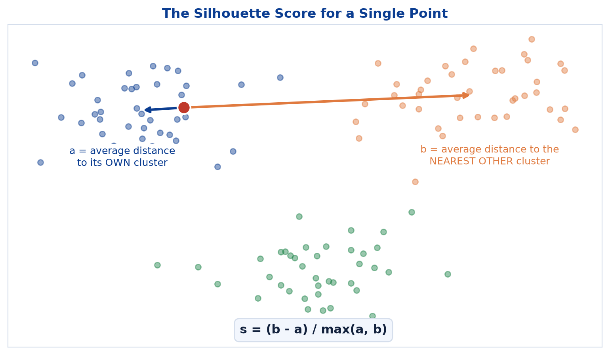
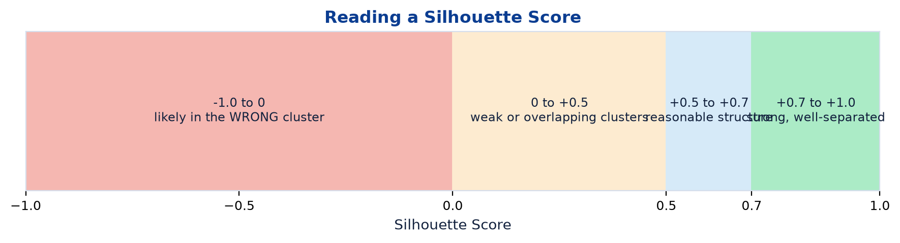
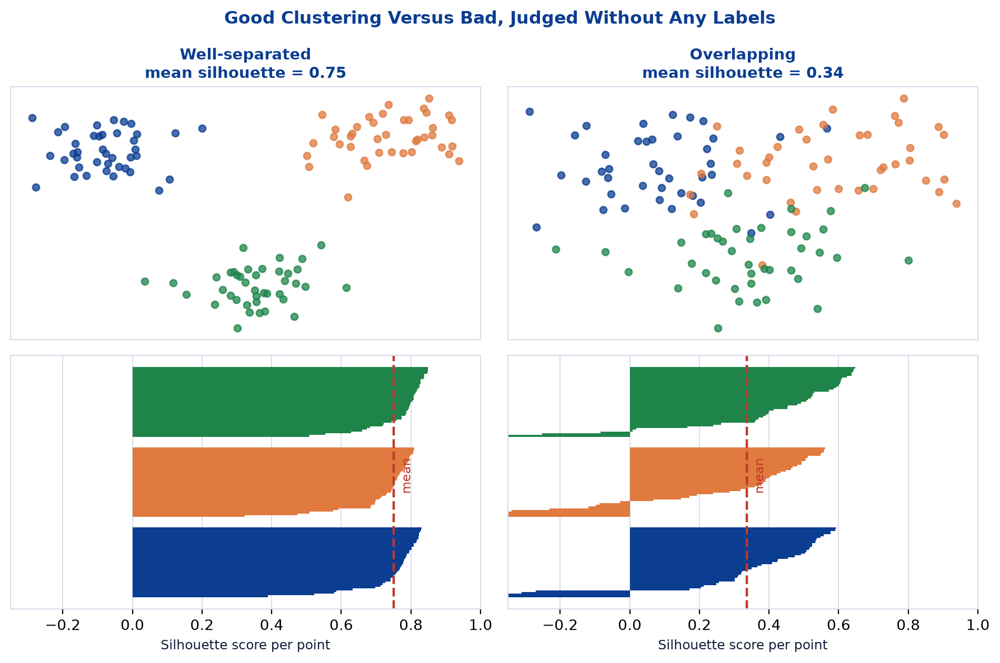
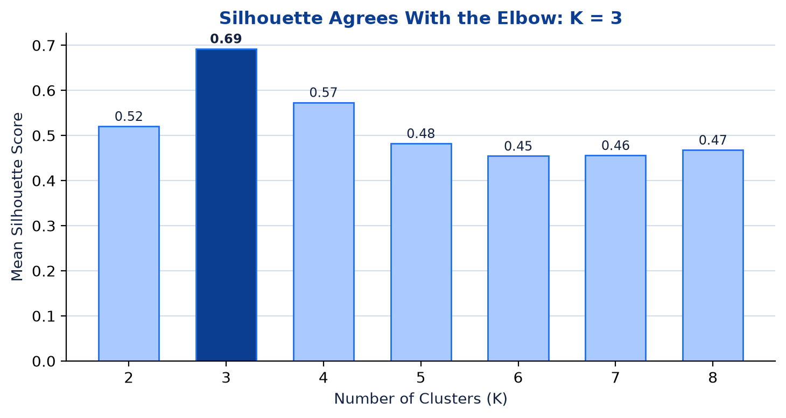
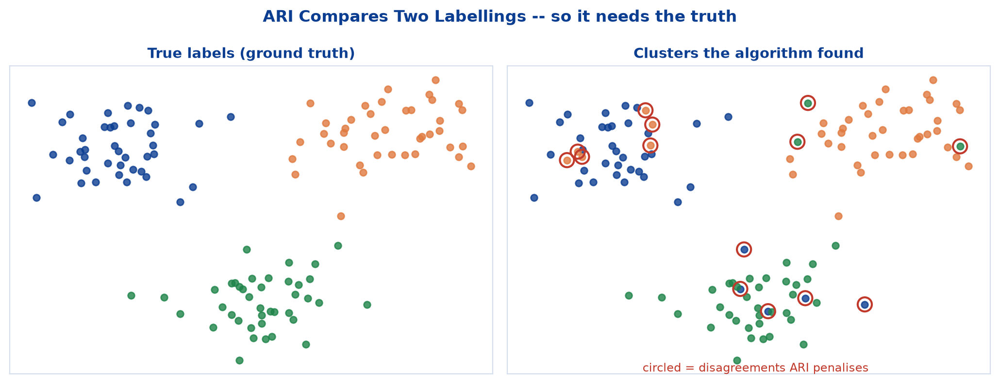
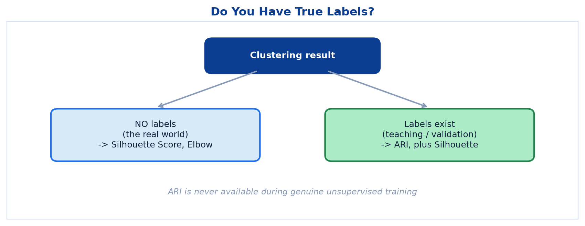

# <span style="color:#0B3D91">Evaluating Clustering — Silhouette Score & ARI</span>

> Study notes on the hardest question in unsupervised learning: **without labels, how do you know
> whether a clustering is any good?** Covers the **Silhouette Score** (`a`, `b`, and the `-1` to
> `+1` scale), using it to **choose K**, and the **Adjusted Rand Index** for the rare case where
> ground truth exists.
>
> **A note on formulas:** equations are written in plain text inside code blocks rather than
> LaTeX, so they render correctly in any Markdown viewer.

---

## <span style="color:#1E6FEB">Table of Contents</span>

1. [The Problem — No Labels, No Accuracy](#1-the-problem--no-labels-no-accuracy)
2. [The Silhouette Score](#2-the-silhouette-score)
3. [Reading the Score](#3-reading-the-score)
4. [Using Silhouette to Choose K](#4-using-silhouette-to-choose-k)
5. [Adjusted Rand Index (ARI)](#5-adjusted-rand-index-ari)
6. [Choosing the Right Metric](#6-choosing-the-right-metric)

---

## <span style="color:#1E6FEB">1. The Problem — No Labels, No Accuracy</span>

### 1.1 Overview / What is it?

> Without labels, how do we know if a clustering is any good?

Every evaluation metric from supervised learning — accuracy, precision, recall, F1, RMSE — needs a
correct answer to compare against. Clustering has none. The metrics in this note solve that by
judging clustering **geometrically** instead.

### 1.2 Why does it matter for AI?

K-Means will happily return clusters for any data you hand it, including data with no real group
structure whatsoever. Ask for four clusters in pure noise and you will receive four confident,
meaningless clusters. Something has to detect that.

### 1.3 Key Concepts

```text
Supervised:   compare predictions against the truth      -> accuracy
Unsupervised: no truth exists                            -> measure geometry instead
```

The geometric question mirrors the definition of clustering itself: **are points close to their own
cluster and far from the others?**

### 1.4 Simple Example

```text
You run K-Means with K = 4 and get four clusters.
They might be:
    - four genuinely distinct customer segments
    - four arbitrary slices of one uniform blob

The cluster labels look identical either way.
```

### 1.5 How it works

Two different situations, two different metrics:

```text
NO labels (the real world)      -> Silhouette Score
Labels exist (teaching/testing) -> Adjusted Rand Index, plus Silhouette
```

### 1.6 Practical Example / Use Case

```python
from sklearn.metrics import silhouette_score, adjusted_rand_score

print(silhouette_score(X_scaled, labels))           # needs no truth
print(adjusted_rand_score(y_true, labels))          # needs the truth
```

Note the arguments. Silhouette takes the **data**; ARI takes **two sets of labels**.

### 1.7 Key Takeaways

> - Clustering has no ground truth, so supervised metrics do not apply.
> - Clustering algorithms return clusters even when none genuinely exist.
> - **Silhouette Score** judges geometry and needs no labels.
> - **ARI** compares against true labels, when you happen to have them.

---

## <span style="color:#1E6FEB">2. The Silhouette Score</span>

### 2.1 Overview / What is it?

> For each point, the Silhouette Score compares **how close it is to its own cluster** versus **the
> nearest other cluster**.

```text
s = (b - a) / max(a, b)

a = average distance to points in the SAME cluster
b = average distance to points in the NEAREST OTHER cluster
```



### 2.2 Why does it matter for AI?

This formula is a direct numerical translation of the definition of good clustering from the
previous topic — **tight inside, far apart outside**. `a` measures the "tight inside" part, `b`
measures "far apart outside".

### 2.3 Key Concepts — reading the formula

```text
a small, b large  ->  (b - a) large   ->  s near +1   -> point is well placed
a about equal b   ->  (b - a) near 0  ->  s near  0   -> point sits on a boundary
a large, b small  ->  (b - a) negative->  s negative  -> point is in the WRONG cluster
```

Dividing by `max(a, b)` is what pins the result into the range `-1` to `+1`, making scores
comparable across datasets of any scale.

### 2.4 Simple Example

```text
Point P:
    average distance to its own cluster    a = 1.0
    average distance to the nearest other  b = 5.0

s = (5.0 - 1.0) / max(1.0, 5.0) = 4.0 / 5.0 = 0.80   -> comfortably well placed

Point Q:
    a = 4.0     b = 2.0

s = (2.0 - 4.0) / max(4.0, 2.0) = -2.0 / 4.0 = -0.50  -> closer to the other cluster!
```

Point Q is a genuine complaint from the data: it has been assigned to the wrong group.

### 2.5 How it works

> Averaging the score across all points gives one overall Silhouette Score for the whole clustering,
> **on the same −1 to 1 scale**.

So the metric works at two levels:

```text
per point     -> diagnose individual misplaced points
averaged      -> one number judging the entire clustering
```

The per-point view is underrated. A mean of 0.55 could mean every point is mediocre, or that most
points are excellent while one cluster is a disaster — and those call for different fixes.

### 2.6 Practical Example / Use Case

```python
from sklearn.metrics import silhouette_score, silhouette_samples

overall = silhouette_score(X_scaled, labels)          # one number
per_point = silhouette_samples(X_scaled, labels)      # one number per point

print("Overall:", round(overall, 3))
for k in set(labels):
    print(f"cluster {k}: {per_point[labels == k].mean():.3f}")
```

Per-cluster averages tell you *which* cluster is dragging the score down.

### 2.7 Key Takeaways

> - `s = (b - a) / max(a, b)`, where **a** is the average distance to its own cluster and **b** to
>   the nearest other cluster.
> - It needs **no labels** — only the data and the cluster assignments.
> - Scores run from **−1 to +1**, both per point and averaged overall.
> - The per-point breakdown diagnoses *where* a clustering is failing.

---

## <span style="color:#1E6FEB">3. Reading the Score</span>

### 3.1 Overview / What is it?



| Range | Interpretation |
|---|---|
| **+0.7 to +1.0** | Strong, well-separated clusters |
| **0 to +0.5** | Weak or overlapping clusters |
| **−1.0 to 0** | Points likely in the wrong cluster |

### 3.2 Why does it matter for AI?

A raw number means nothing without a scale to read it against. These bands turn `0.34` into "weak,
overlapping — probably reconsider K or the features".

### 3.3 Key Concepts

```text
+1  -> point is far from other clusters and snug within its own
 0  -> point sits exactly on the boundary between two clusters
-1  -> point is closer to another cluster than to its own
```

### 3.4 Simple Example



```text
Well-separated data  -> mean silhouette around 0.7 or higher
Overlapping data     -> mean silhouette closer to 0.3
```

The silhouette plots underneath show *why*: in the good case nearly every bar is long and positive;
in the bad case bars are short and some dip below zero.

### 3.5 How it works

Treat these bands as guidance, not law. Real-world data is messy, and a score of 0.45 on genuine
customer data may represent real, useful, partially-overlapping segments. The bands tell you how
clean the geometry is — they do not tell you whether the clusters are **useful to the business**.
Those are different questions, and only one of them is answerable by arithmetic.

Negative scores are the exception: those are an unambiguous problem worth investigating.

### 3.6 Practical Example / Use Case

```python
score = silhouette_score(X_scaled, labels)

if score >= 0.7:
    verdict = "strong, well-separated"
elif score >= 0.5:
    verdict = "reasonable structure"
elif score > 0:
    verdict = "weak or overlapping"
else:
    verdict = "points likely in the wrong clusters"

print(f"{score:.3f} -> {verdict}")
```

### 3.7 Key Takeaways

> - **+0.7 to +1.0** = strong, well-separated clusters.
> - **0 to +0.5** = weak or overlapping clusters.
> - **−1.0 to 0** = points likely in the wrong cluster.
> - Bands describe **geometry**, not business usefulness.

---

## <span style="color:#1E6FEB">4. Using Silhouette to Choose K</span>

### 4.1 Overview / What is it?

The Elbow Method suggests a K; the Silhouette Score provides an independent second opinion.



### 4.2 Why does it matter for AI?

The elbow can be ambiguous — real WCSS curves often bend gently enough that two reasonable people
read two different elbows. Silhouette produces an actual maximum you can point at.

### 4.3 Key Concepts

```text
WCSS       -> always decreases as K increases -> cannot have a maximum
Silhouette -> rises, peaks, then falls        -> the peak IS the recommendation
```

This is the crucial difference. WCSS needs a human to interpret a bend; silhouette has a genuine
optimum.

### 4.4 Simple Example

```text
K = 2 -> 0.58
K = 3 -> 0.71    <- highest
K = 4 -> 0.62
K = 5 -> 0.55

Silhouette recommends K = 3.
```

If the elbow also pointed at 3, you have two independent methods agreeing. That is a solid basis for
a decision.

### 4.5 How it works

Why silhouette peaks rather than plateaus:

```text
K too small -> distinct groups are merged -> a is inflated -> score drops
K correct   -> a small, b large           -> score peaks
K too large -> real groups are split      -> b shrinks     -> score drops
```

Both kinds of mistake are punished, which is exactly why a maximum exists.

### 4.6 Practical Example / Use Case

```python
for k in range(2, 9):
    km = KMeans(n_clusters=k, n_init=10, random_state=42).fit(X_scaled)
    print(f"K={k}: silhouette = {silhouette_score(X_scaled, km.labels_):.3f}")
```

Note the range starts at **2**. Silhouette is undefined for `K = 1` — with only one cluster there is
no "nearest other cluster" for `b` to measure.

### 4.7 Key Takeaways

> - Silhouette **peaks** at a good K, unlike WCSS which only ever falls.
> - Compute it across candidate K values and take the maximum.
> - Use it to **confirm or challenge** the elbow.
> - It is undefined for `K = 1`; always start at `K = 2`.

---

## <span style="color:#1E6FEB">5. Adjusted Rand Index (ARI)</span>

### 5.1 Overview / What is it?

> When ground truth exists (for teaching or validation), **ARI measures how well the clusters found
> line up with the true labels.**



```text
ARI Range: -1.0 to 1.0

 1.0  = perfect match with the true labels
 0    = no better than random labeling
 negative = worse than random
```

### 5.2 Why does it matter for AI?

ARI answers a different question from silhouette. Silhouette asks *"are these clusters
geometrically clean?"*; ARI asks *"are these clusters **correct**?"*.

### 5.3 Key Concepts — the honest caveats

```text
Unlike the Silhouette Score, ARI needs TRUE LABELS
  -> it is only usable for validation, NEVER during real unsupervised training

A high ARI confirms the algorithm rediscovered structure that matches reality
  -> a reassuring sanity check when learning clustering for the first time

In real deployments without true labels,
  the Silhouette Score (or Elbow Method) is what you fall back on
```

That middle point explains why ARI appears in a course at all: it proves clustering *works* on a
dataset where the answer is known, which builds justified confidence for using it where the answer
is not.

### 5.4 Simple Example

```text
Iris dataset: 150 flowers, 3 known species.
Hide the species labels, run K-Means with K = 3,
then compare the clusters against the hidden truth.

ARI = 0.62  ->  substantially better than random,
                so K-Means largely rediscovered the species
```

### 5.5 How it works

ARI counts **pairs of points** rather than individual labels: for every pair, did the two labellings
agree about whether those points belong together? That design means ARI does not care what the
clusters are *named*.

```text
True:    [A, A, B, B]
Found:   [1, 1, 0, 0]

Different names, identical grouping -> ARI = 1.0
```

This matters enormously, because cluster numbering is arbitrary. Cluster "0" from K-Means has no
relationship to class "0" in your labels.

The "Adjusted" part corrects for agreement that would occur **by chance**, which is what pins random
labelling at 0 rather than at some misleadingly positive number.

### 5.6 Practical Example / Use Case

```python
from sklearn.datasets import load_iris
from sklearn.metrics import adjusted_rand_score

iris = load_iris()
X, y_true = iris.data, iris.target

X_scaled = StandardScaler().fit_transform(X)
labels = KMeans(n_clusters=3, n_init=10, random_state=42).fit_predict(X_scaled)

print("ARI       :", round(adjusted_rand_score(y_true, labels), 3))
print("Silhouette:", round(silhouette_score(X_scaled, labels), 3))
```

The species label is **withheld during training** and only used afterwards for scoring. Feeding it
into the clustering would not be evaluation; it would be cheating.

### 5.7 Key Takeaways

> - **ARI** measures how well found clusters line up with **true labels**.
> - Range **−1.0 to 1.0**: `1.0` perfect, `0` random, negative worse than random.
> - It **requires ground truth**, so it is for validation and teaching only.
> - It is immune to cluster renaming, because it compares **pairs** of points.
> - In real deployments, fall back on **Silhouette** and the **Elbow Method**.

---

## <span style="color:#1E6FEB">6. Choosing the Right Metric</span>

### 6.1 Overview / What is it?



| | Silhouette Score | Adjusted Rand Index |
|---|---|---|
| **Needs labels?** | No | **Yes** |
| **Measures** | Geometric quality of the clusters | Agreement with the truth |
| **Range** | −1 to +1 | −1 to +1 |
| **Can choose K?** | Yes — take the peak | Only if truth is available |
| **Usable in production?** | Yes | No |

### 6.2 Why does it matter for AI?

Reaching for ARI in a real unsupervised project is a category error: if you had the true labels, you
would not be clustering. You would be training a classifier.

### 6.3 Key Concepts

```text
Real project, no labels        -> Silhouette Score + Elbow Method
Learning / benchmarking        -> ARI as well, to confirm the method works
Both available                 -> report both; they answer different questions
```

### 6.4 Simple Example

```text
High silhouette, low ARI:
    clean, well-separated groups -- that split the data along
    some real dimension OTHER than your labels

Low silhouette, high ARI:
    the right groups were found, but they genuinely overlap in feature space
```

Neither combination is a contradiction. They are measuring different things, and the disagreement is
often the most informative result you will get.

### 6.5 How it works

The practical evaluation routine:

```text
1. Scale the features
2. Run K-Means across a range of K
3. Plot WCSS         -> look for the elbow
4. Compute silhouette-> look for the peak
5. Where they agree  -> choose that K
6. If truth exists   -> compute ARI as a final sanity check
7. Profile the clusters -> confirm they mean something to the business
```

Step 7 is not optional. A mathematically excellent clustering that no one can act on has achieved
nothing.

### 6.6 Practical Example / Use Case

```python
results = []
for k in range(2, 9):
    km = KMeans(n_clusters=k, n_init=10, random_state=42).fit(X_scaled)
    results.append({
        "k": k,
        "wcss": km.inertia_,
        "silhouette": silhouette_score(X_scaled, km.labels_),
        "ari": adjusted_rand_score(y_true, km.labels_),   # teaching only
    })

print(pd.DataFrame(results).round(3))
```

### 6.7 Key Takeaways

> - **Silhouette** works without labels and can select K — use it in production.
> - **ARI** needs ground truth — use it for validation and learning only.
> - They measure different things, so disagreement is informative rather than alarming.
> - Always finish by checking the clusters are **interpretable and actionable**.

---

## <span style="color:#1E6FEB">Summary — Clustering Evaluation at a Glance</span>

```text
No labels?   -> Silhouette Score: is each point near its own cluster and far from others?
Labels?      -> ARI: do the found clusters agree with reality?
```

| Concept | One-sentence mental model |
|---|---|
| `a` | Average distance to your own cluster — want it small |
| `b` | Average distance to the nearest other cluster — want it large |
| Silhouette `s` | `(b - a) / max(a, b)`, from −1 to +1 |
| +0.7 and above | Strong, well-separated clusters |
| Negative score | This point is in the wrong cluster |
| Silhouette peak | An independent recommendation for K |
| ARI | Agreement with true labels, chance-corrected |

**The one-sentence version:** the Silhouette Score judges a clustering purely on its geometry and so
works anywhere, while ARI checks the clusters against reality and so only works in the teaching
scenarios where reality was known all along.

**Where this leads:** these metrics judge a model given its inputs. But model quality depends just
as much on **what you feed it** — badly chosen or badly shaped features limit every algorithm
equally. The next topic is **Feature Engineering**: creating, transforming and selecting the inputs
that make patterns easier to learn.

---

> **Navigation:** ← Previous: [03 — Clustering & K-Means](03_Machine_Learning_Clustering_And_KMeans.md) ·
> Next → [05 — Feature Engineering](05_Machine_Learning_Feature_Engineering.md)
