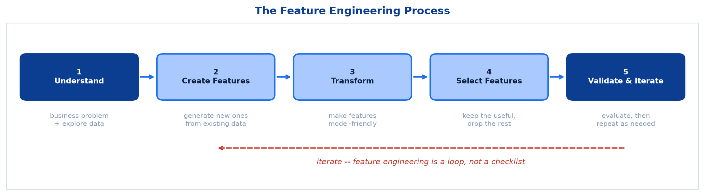
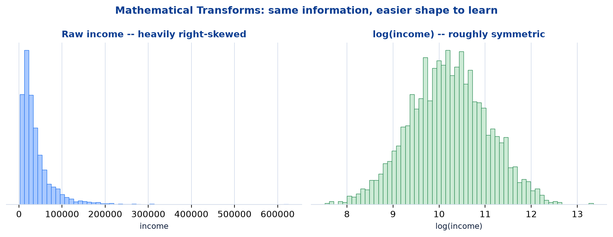
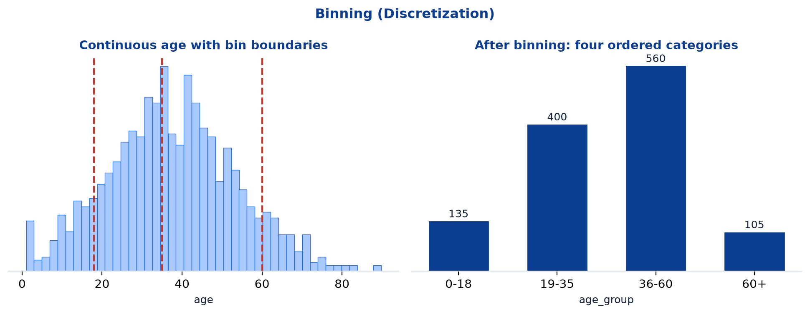
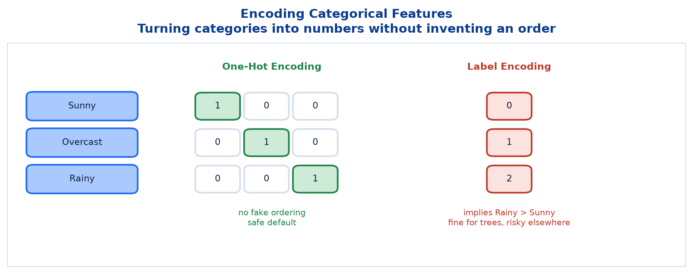
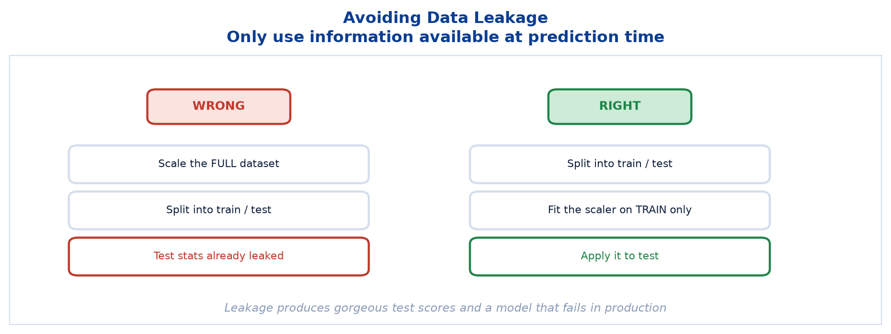

# <span style="color:#0B3D91">Feature Engineering</span>

> Study notes on improving what you feed the model rather than the model itself. Covers the
> **five-stage process** → **common techniques** (transforms, interactions, aggregations,
> polynomial and text features) → **worked examples** including binning, encoding and date/time
> extraction → **feature selection methods** → **best practices**, including avoiding data leakage.
>
> **A note on formulas:** equations are written in plain text inside code blocks rather than
> LaTeX, so they render correctly in any Markdown viewer.

---

## <span style="color:#1E6FEB">Table of Contents</span>

1. [What Is Feature Engineering?](#1-what-is-feature-engineering)
2. [The Feature Engineering Process](#2-the-feature-engineering-process)
3. [Common Techniques](#3-common-techniques)
4. [Examples of Feature Engineering](#4-examples-of-feature-engineering)
5. [Feature Selection Methods](#5-feature-selection-methods)
6. [Best Practices](#6-best-practices)

---

## <span style="color:#1E6FEB">1. What Is Feature Engineering?</span>

### 1.1 Overview / What is it?

> The process of **creating, transforming, and selecting** input features from raw data to improve
> model performance.

Three verbs, three jobs:

```text
CREATE     -> build new features out of what you already have
TRANSFORM  -> reshape features so models can use them more easily
SELECT     -> keep what helps and discard the rest
```

### 1.2 Why does it matter for AI?

> **Key takeaway:** "Garbage in, garbage out" — **great features, great models out!**

Five specific benefits:

| Benefit | What it means |
|---|---|
| **Improves Performance** | Better features lead to higher accuracy and lower error |
| **Captures Hidden Patterns** | Helps models learn complex relationships more easily |
| **Reduces Training Time** | Well-engineered features simplify the problem |
| **Improves Interpretability** | Meaningful features make the model easier to trust |
| **Handles Real-World Complexity** | Converts messy, raw data into useful ML input |

### 1.3 Key Concepts

A truth worth internalising early: **a good model on poor features loses to a simple model on good
features, nearly every time.** Switching from Logistic Regression to a Random Forest might buy a
couple of points of accuracy. Adding the one feature that actually encodes the pattern can buy
twenty.

### 1.4 Simple Example

```text
Raw data:    quantity = 3,  unit_price = 250
Engineered:  total_spend = 750

The model could theoretically learn "multiply these two columns".
Handing it the product directly means it does not have to.
```

### 1.5 How it works

Models learn patterns that are **expressible in the feature space you give them**. A linear model
cannot represent `quantity x price` no matter how long you train it, because multiplication is not
in its vocabulary. Engineering the feature puts it there.

### 1.6 Practical Example / Use Case

```python
df["total_spend"] = df["quantity"] * df["unit_price"]
df["price_per_item"] = df["total_spend"] / df["quantity"]
```

One line each. Frequently worth more than a week of hyperparameter tuning.

### 1.7 Key Takeaways

> - Feature engineering is **creating, transforming and selecting** input features.
> - It improves performance, captures hidden patterns, reduces training time, improves
>   interpretability, and handles real-world complexity.
> - **"Garbage in, garbage out" — great features, great models out.**
> - Better features usually beat better algorithms.

---

## <span style="color:#1E6FEB">2. The Feature Engineering Process</span>

### 2.1 Overview / What is it?



```text
1. Understand        -> understand the business problem and explore the data
        |
2. Create Features   -> generate new features from existing data
        |
3. Transform         -> make features more suitable for modeling
        |
4. Select Features   -> keep the most useful features and remove the rest
        |
5. Validate & Iterate-> evaluate performance and repeat as needed
```

> **Key takeaway:** Good features capture the true signal in data, make patterns easier to learn,
> and improve model performance, generalization, and interpretability.

### 2.2 Why does it matter for AI?

Step 1 comes first for a reason. Feature engineering without domain understanding is guesswork with
extra steps — you cannot invent `total_spend` without knowing that spend drives the outcome you care
about.

### 2.3 Key Concepts

Step 5 makes this a **loop, not a checklist**. You create features, measure, learn something, and go
back around. Most of the value arrives on the second or third pass.

### 2.4 Simple Example

```text
Pass 1: add total_spend            -> accuracy 0.81 -> 0.86
Pass 2: add days_since_last_order  -> accuracy 0.86 -> 0.89
Pass 3: add weekend flag           -> accuracy 0.89 -> 0.89   (drop it)
```

Pass 3 is not a failure. Learning that a feature does nothing is a real result, and removing it
keeps the model simpler.

### 2.5 How it works

Every new feature must **earn its place by measurement**. Intuition proposes; cross-validation
disposes. Features that feel clever but change nothing are just added complexity and extra
maintenance.

### 2.6 Practical Example / Use Case

```python
from sklearn.model_selection import cross_val_score

base = cross_val_score(model, X, y, cv=5).mean()

X_new = X.copy()
X_new["total_spend"] = X["quantity"] * X["unit_price"]
improved = cross_val_score(model, X_new, y, cv=5).mean()

print(f"{base:.3f} -> {improved:.3f}")   # keep the feature only if this moves
```

### 2.7 Key Takeaways

> - The process is **Understand → Create → Transform → Select → Validate & Iterate**.
> - Domain understanding comes **first**.
> - It is a **loop**; most gains come from later passes.
> - Every feature must justify itself with measured improvement.

---

## <span style="color:#1E6FEB">3. Common Techniques</span>

### 3.1 Overview / What is it?

| Technique | Examples |
|---|---|
| **Mathematical Transforms** | `log`, `exp`, `sqrt`, `power`, `abs` |
| **Interactions** | Combine features to capture interactions (`A x B`, `A / B`, etc.) |
| **Aggregations** | Aggregate over groups or time (`sum`, `mean`, `max`, `count`) |
| **Polynomial Features** | Capture non-linear relationships (`x^2`, `x^3`, `x.y`, ...) |
| **Text Features** | Length, word count, TF-IDF, n-grams, sentiment |

### 3.2 Why does it matter for AI?

Each technique targets a particular failure mode: skewed distributions, features that only matter in
combination, per-entity history, curved relationships, and unstructured text.

### 3.3 Key Concepts — mathematical transforms



```text
Income: mostly 20k-80k, with a long tail up to 5,000k
-> a handful of extreme values dominate every distance and every coefficient

log(income) compresses that tail into a manageable, roughly symmetric range
```

Same information, friendlier shape. Particularly valuable for distance-based and linear models.

### 3.4 Simple Example — interaction features


```text
quantity   alone -> weak predictor
unit_price alone -> weak predictor
quantity x unit_price = total_spend -> strong predictor
```

Neither raw feature separates the classes. Their product does. This is the case for interactions in
a single picture.

### 3.5 How it works — the others

```text
AGGREGATIONS      per-customer totals, per-week means, per-category counts
                  -> turns transaction rows into customer-level features

POLYNOMIAL        x, x^2, x^3 lets a LINEAR model fit a CURVE
                  -> handle with care: degree 10 overfits enthusiastically

TEXT FEATURES     length, word count, TF-IDF, n-grams, sentiment
                  -> turns unstructured text into numeric columns
```

### 3.6 Practical Example / Use Case

```python
import numpy as np

df["log_income"] = np.log1p(df["income"])                 # log1p is safe at zero
df["price_per_item"] = df["total"] / df["quantity"]       # interaction (ratio)
df["customer_avg"] = df.groupby("customer_id")["total"].transform("mean")  # aggregation
df["title_length"] = df["title"].str.len()                # text feature
```

`np.log1p` computes `log(1 + x)`, which sidesteps `log(0) = -inf`. Use it unless you are certain
every value is positive.

### 3.7 Key Takeaways

> - **Mathematical transforms** (`log`, `sqrt`, ...) fix skew and compress long tails.
> - **Interactions** (`A x B`, `A / B`) capture effects invisible in either feature alone.
> - **Aggregations** summarise over groups or time.
> - **Polynomial features** let linear models fit curves — and overfit if pushed.
> - **Text features** convert unstructured text into numbers.

---

## <span style="color:#1E6FEB">4. Examples of Feature Engineering</span>

### 4.1 Overview / What is it?

| Type | Description | Example |
|---|---|---|
| **Creating New Features** | Combine or extract new information from existing features | `total_spend = quantity x unit_price` |
| **Transforming Features** | Change the scale or distribution of features | `log(income)`, `sqrt(age)`, `StandardScaler` |
| **Encoding Categorical Features** | Convert categories into numerical representation | One-Hot Encoding, Label Encoding |
| **Binning (Discretization)** | Convert continuous variables into bins | `age → [0-18], [19-35], [36-60], [60+]` |
| **Date/Time Features** | Extract meaningful information from dates | From `'2024-05-20'`: year, month, day_of_week |

### 4.2 Why does it matter for AI?

These five cover the overwhelming majority of real feature engineering work. Master them and you can
handle most tabular datasets you will meet.

### 4.3 Key Concepts — binning



```text
age = 23, 24, 25, 26 ... -> mostly meaningless individual distinctions
age_group = "19-35"      -> a category the business actually reasons about
```

Binning trades precision for robustness: it smooths noise and captures the fact that the difference
between 23 and 24 rarely matters, while the difference between 17 and 35 very much does.

### 4.4 Simple Example — date/time features

```text
From '2024-05-20':
    year         = 2024
    month        = 5
    day_of_week  = Monday
    is_weekend   = False
    quarter      = Q2
```

A raw timestamp is nearly useless to a model. Its **components** carry the seasonality, the weekly
rhythm and the trend — all the parts you actually wanted.

### 4.5 How it works — encoding



```text
ONE-HOT ENCODING
Sunny    -> [1, 0, 0]
Overcast -> [0, 1, 0]
Rainy    -> [0, 0, 1]
No ordering is implied. Safe default.

LABEL ENCODING
Sunny -> 0,  Overcast -> 1,  Rainy -> 2
Implies Rainy > Overcast > Sunny, which is nonsense for weather.
Fine for tree models, risky for linear and distance-based ones.
```

The distinction matters because a linear model treats `2` as literally twice `1`. Trees only ever
compare values, so invented ordering harms them far less.

### 4.6 Practical Example / Use Case

```python
# Creating
df["total_spend"] = df["quantity"] * df["unit_price"]

# Transforming
df["log_income"] = np.log1p(df["income"])

# Encoding
df = pd.get_dummies(df, columns=["outlook"], prefix="outlook")

# Binning
df["age_group"] = pd.cut(df["age"], bins=[0, 18, 35, 60, 120],
                         labels=["0-18", "19-35", "36-60", "60+"])

# Date/time
dt = pd.to_datetime(df["order_date"])
df["order_year"], df["order_month"], df["order_dow"] = dt.dt.year, dt.dt.month, dt.dt.dayofweek
```

### 4.7 Key Takeaways

> - **Creating**: combine existing features (`quantity x unit_price`).
> - **Transforming**: change scale or distribution (`log`, `sqrt`, `StandardScaler`).
> - **Encoding**: one-hot avoids fake ordering; label encoding invents it.
> - **Binning**: convert continuous values into meaningful ranges.
> - **Date/time**: extract year, month, day_of_week from timestamps.

---

## <span style="color:#1E6FEB">5. Feature Selection Methods</span>

### 5.1 Overview / What is it?


| Family | Description | Methods |
|---|---|---|
| **Filter Methods** | Model-independent | Correlation, Mutual Information, Chi-Square Test, Variance Threshold |
| **Wrapper Methods** | Model-dependent | Recursive Feature Elimination (RFE), Forward/Backward Selection |
| **Embedded Methods** | Built into training | L1 Regularization (Lasso), Tree-based Feature Importance |

### 5.2 Why does it matter for AI?

Creating features is only half the job. Irrelevant features add noise, slow training, increase
overfitting risk and make models harder to explain. **Selection is the pruning step.**

### 5.3 Key Concepts

```text
FILTER    score each feature against the target, independent of any model
          -> very fast, but ignores feature interactions

WRAPPER   train the model repeatedly with different feature subsets
          -> accurate, but expensive: many model fits

EMBEDDED  the model selects features while training
          -> free: Lasso zeroes coefficients, trees report importances
```

### 5.4 Simple Example

```text
Variance Threshold (filter): a column with the same value in every row
                             carries zero information -> drop it immediately

RFE (wrapper):               train, drop the weakest feature, retrain,
                             repeat until the target count is reached

Lasso (embedded):            train once; some coefficients land exactly on 0
```

### 5.5 How it works

Practical ordering:

```text
1. Filter first  -> cheaply remove the obviously useless
2. Embedded next -> let Lasso or tree importances rank what remains
3. Wrapper last  -> only if you have the compute and it is worth it
```

Two of the three methods are already familiar: **tree-based feature importance** came from Decision
Trees and Random Forest, and **L1 regularization** is the subject of the next-but-one topic. They
are listed here because selection is one of the things they do.

### 5.6 Practical Example / Use Case

```python
from sklearn.feature_selection import VarianceThreshold, RFE

# Filter: drop zero-variance columns
X_filtered = VarianceThreshold(threshold=0.0).fit_transform(X)

# Wrapper: recursively eliminate down to 10 features
rfe = RFE(estimator=RandomForestClassifier(random_state=42), n_features_to_select=10)
X_rfe = rfe.fit_transform(X, y)

# Embedded: tree importances
importance = pd.Series(forest.feature_importances_, index=X.columns)
keep = importance[importance > 0.01].index
```

### 5.7 Key Takeaways

> - **Filter methods** are model-independent and fast: correlation, mutual information, chi-square,
>   variance threshold.
> - **Wrapper methods** are model-dependent and thorough: RFE, forward/backward selection.
> - **Embedded methods** select during training: L1 (Lasso), tree-based importance.
> - Run cheap filters first, then embedded, then wrappers only if justified.

---

## <span style="color:#1E6FEB">6. Best Practices</span>

### 6.1 Overview / What is it?

```text
Understand the data and domain deeply
Create features with a clear purpose
Avoid data leakage -- use only information available at prediction time
Keep features simple and interpretable whenever possible
Validate impact using cross-validation
```

### 6.2 Why does it matter for AI?

The third one is the career-saver. **Data leakage** produces spectacular validation scores and a
model that collapses in production, and it is frighteningly easy to do by accident.

### 6.3 Key Concepts — data leakage



Leakage means using information at training time that **would not be available at prediction time**.
Two classic forms:

```text
TARGET LEAKAGE
  Predicting "will this customer churn?" using the feature
  "cancellation_reason" -- which only exists AFTER they churned.
  Accuracy: 99.8%. Real-world usefulness: zero.

PREPROCESSING LEAKAGE
  Fitting a scaler on the FULL dataset before splitting.
  The scaler's mean and standard deviation now encode test-set information.
```

### 6.4 Simple Example

```text
WRONG                                RIGHT
---------------------------------    ---------------------------------
scaler.fit_transform(X)              X_train, X_test = train_test_split(X)
train_test_split(X_scaled)           scaler.fit(X_train)
                                     scaler.transform(X_test)
```

The wrong version leaks test statistics into training. The right version treats the test set as
genuinely unseen — which is the only thing that makes it a test.

### 6.5 How it works — the other practices

```text
CLEAR PURPOSE      if you cannot explain why a feature should help,
                   you are generating columns, not engineering features

SIMPLE FEATURES    total_spend is explainable in a meeting;
                   log(sqrt(a) x b^3 / c) is not

CROSS-VALIDATION   a feature that helps on one split may be noise;
                   k-fold tells you whether the gain is real
```

### 6.6 Practical Example / Use Case

```python
from sklearn.model_selection import train_test_split, cross_val_score
from sklearn.preprocessing import StandardScaler

# 1. Split FIRST
X_train, X_test, y_train, y_test = train_test_split(X, y, test_size=0.2, random_state=42)

# 2. Fit the scaler on training data ONLY
scaler = StandardScaler().fit(X_train)
X_train_scaled = scaler.transform(X_train)
X_test_scaled = scaler.transform(X_test)

# 3. Validate each new feature with cross-validation
print(cross_val_score(model, X_train_scaled, y_train, cv=5).mean())
```

> **Worth knowing:** scikit-learn's `Pipeline` enforces the correct fit-on-train-only ordering
> automatically, which is the main reason experienced practitioners use it everywhere.

### 6.7 Key Takeaways

> - **Understand the data and domain deeply** before engineering anything.
> - **Create features with a clear purpose**, not at random.
> - **Avoid data leakage** — only use information available at prediction time; split before you
>   scale.
> - **Keep features simple and interpretable** where possible.
> - **Validate impact using cross-validation**, not a single lucky split.

---

## <span style="color:#1E6FEB">Summary — Feature Engineering at a Glance</span>

```text
Understand -> Create -> Transform -> Select -> Validate -> (repeat)
```

| Concept | One-sentence mental model |
|---|---|
| Feature engineering | Improve the inputs, not the algorithm |
| Log transform | Compress a long tail into a usable range |
| Interaction | Two weak features multiplied into one strong one |
| Binning | Turn continuous values into meaningful ranges |
| One-hot encoding | Categories as numbers without inventing an order |
| Date/time features | A timestamp is useless; its components are not |
| Filter / wrapper / embedded | Cheap scoring / repeated fitting / free from the model |
| Data leakage | Using information you would not have at prediction time |

**The one-sentence version:** feature engineering turns raw, messy data into inputs that make the
pattern obvious, and it usually delivers more improvement than swapping algorithms ever will —
provided every new feature is validated and none of them leak.

**Where this leads:** better features improve a model, but they cannot tell you whether the model
has struck the right balance between too simple and too complex. The next topic covers exactly
that: **Overfitting, Underfitting and the Bias-Variance Trade-off.**

---

> **Navigation:** ← Previous: [04 — Evaluating Clustering](04_Machine_Learning_Evaluating_Clustering.md) ·
> Next → [06 — Overfitting, Underfitting & Bias-Variance](06_Machine_Learning_Overfitting_Underfitting_And_Bias_Variance.md)
