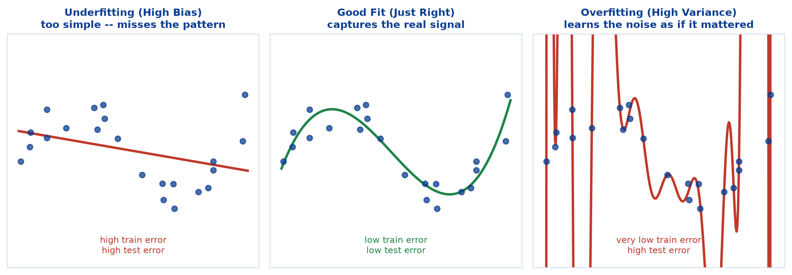
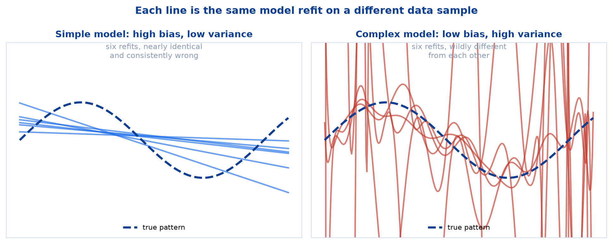
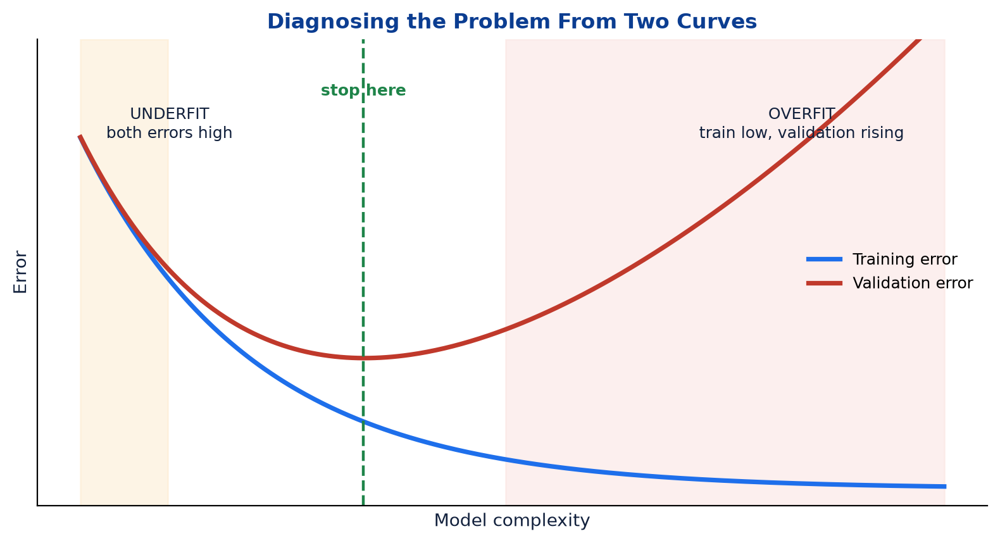
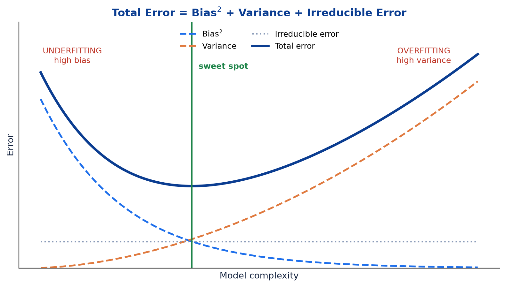
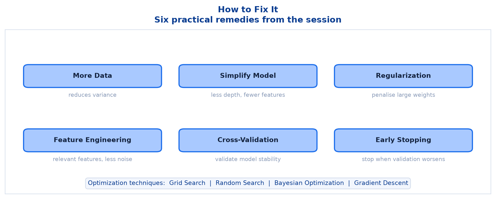

# <span style="color:#0B3D91">Overfitting, Underfitting & the Bias-Variance Trade-off</span>

> Study notes on the central balancing act of machine learning: a model too simple learns nothing,
> a model too complex memorises noise. Covers **overfitting vs underfitting vs good fit** → **how to
> detect each** → the **bias-variance trade-off** and its error decomposition → **six practical
> fixes** → **common optimization techniques**.
>
> **A note on formulas:** equations are written in plain text inside code blocks rather than
> LaTeX, so they render correctly in any Markdown viewer.

---

## <span style="color:#1E6FEB">Table of Contents</span>

1. [Overfitting, Underfitting & Optimization](#1-overfitting-underfitting--optimization)
2. [Underfitting vs. Good Fit vs. Overfitting](#2-underfitting-vs-good-fit-vs-overfitting)
3. [Detecting Which Problem You Have](#3-detecting-which-problem-you-have)
4. [The Bias-Variance Trade-off](#4-the-bias-variance-trade-off)
5. [How to Fix It — Practical Tips](#5-how-to-fix-it--practical-tips)
6. [Common Optimization Techniques](#6-common-optimization-techniques)

---

## <span style="color:#1E6FEB">1. Overfitting, Underfitting & Optimization</span>

### 1.1 Overview / What is it?

Three definitions that frame everything in this note:

> **Overfitting:** The model learns the training data **too well**, including noise and outliers. It
> performs well on training data but **poorly on unseen data**.
>
> **Underfitting:** The model is **too simple** to capture the underlying pattern. It performs
> poorly on **both** training and unseen data.
>
> **Optimization:** The process of tuning model/learning parameters and hyperparameters to achieve
> the best possible performance and generalization.

> **Key takeaway:** The goal is to find the right balance — **good fit on training data and good
> generalization on unseen data.**

### 1.2 Why does it matter for AI?

Every model in this course sits somewhere on this spectrum. A Decision Tree with `max_depth=None`
overfits; the same tree with `max_depth=1` underfits. The skill is not knowing the definitions — it
is **diagnosing which one you have** and choosing the right response.

### 1.3 Key Concepts

```text
UNDERFITTING  bad on training data, bad on test data    -> model too simple
GOOD FIT      good on training data, good on test data  -> just right
OVERFITTING   great on training data, bad on test data  -> model too complex
```

Notice the diagnostic asymmetry. Underfitting fails **visibly** — bad scores everywhere. Overfitting
fails **invisibly**, hiding behind excellent training numbers. That is what makes it the more
dangerous of the two.

### 1.4 Simple Example

```text
Memorising exam answers  -> perfect on last year's paper, lost on this year's  = OVERFITTING
Only learning "guess C"  -> poor on every paper ever written                   = UNDERFITTING
Understanding the topic  -> handles questions never seen before                = GOOD FIT
```

### 1.5 How it works

Generalization is the only thing that matters. Training performance is a **means of estimating** it,
not the goal itself. A model that scores 100% on training data has told you nothing until you check
it against data it has never seen.

### 1.6 Practical Example / Use Case

```python
print("train:", model.score(X_train, y_train))
print("test :", model.score(X_test, y_test))
```

Two lines. Print them for every model you ever train. The **gap between them** is the single most
informative diagnostic you have.

### 1.7 Key Takeaways

> - **Overfitting**: learns the training data too well, including noise — poor on unseen data.
> - **Underfitting**: too simple to capture the pattern — poor on both.
> - **Optimization**: tuning parameters and hyperparameters for the best performance and
>   generalization.
> - The goal is **good fit plus good generalization**, and the train/test gap reveals which you have.

---

## <span style="color:#1E6FEB">2. Underfitting vs. Good Fit vs. Overfitting</span>

### 2.1 Overview / What is it?



| | Underfitting (High Bias) | Good Fit (Just Right) | Overfitting (High Variance) |
|---|---|---|---|
| **Model** | Too simple | Captures the underlying pattern | Too complex |
| **Training error** | High | Low | Very low |
| **Validation/test error** | High | Low | **High** |
| **Example** | Using a linear model for a non-linear problem | Appropriate model complexity | Very deep model / too many parameters |

### 2.2 Why does it matter for AI?

The vocabulary pairs up permanently from here on:

```text
Underfitting = HIGH BIAS
Overfitting  = HIGH VARIANCE
```

Every remedy in this note and the next targets one or the other.

### 2.3 Key Concepts — bias and variance defined

```text
BIAS      error from wrong ASSUMPTIONS
          a straight line assuming a curved relationship is linear
          -> consistently wrong, in the same way, every time

VARIANCE  error from SENSITIVITY to the particular training data
          -> wrong in a different way each time you resample
```

### 2.4 Simple Example



```text
Simple model, refit on six different samples:
    six nearly identical lines -- consistently missing the true curve
    -> HIGH BIAS, LOW VARIANCE

Complex model, refit on six different samples:
    six wildly different curves
    -> LOW BIAS, HIGH VARIANCE
```

This picture is where the word "variance" comes from: it is literally how much the fitted model
**varies** when the training data changes.

### 2.5 How it works

Complexity is the dial connecting them:

```text
Increase complexity -> bias falls, variance rises
Decrease complexity -> bias rises, variance falls
```

You cannot minimise both by adjusting complexity alone. That tension is the trade-off.

### 2.6 Practical Example / Use Case

```python
for depth in [1, 3, 5, 10, None]:
    m = DecisionTreeClassifier(max_depth=depth, random_state=42).fit(X_train, y_train)
    print(f"depth={str(depth):>4}  train={m.score(X_train, y_train):.3f}  "
          f"test={m.score(X_test, y_test):.3f}")
```

A depth sweep like this makes the whole spectrum visible in one output block.

### 2.7 Key Takeaways

> - **Underfitting = high bias**: too simple, high error on training *and* test data.
> - **Good fit**: captures the real pattern, low error on both.
> - **Overfitting = high variance**: too complex, learns noise, high test error.
> - **Bias** is being consistently wrong; **variance** is being inconsistently wrong.

---

## <span style="color:#1E6FEB">3. Detecting Which Problem You Have</span>

### 3.1 Overview / What is it?



> As model complexity increases, **training error always decreases**; validation error **first
> decreases, then increases** as the model starts memorizing noise.

### 3.2 Why does it matter for AI?

That sentence contains the entire diagnostic method. Training error alone can never reveal
overfitting, because it keeps improving regardless. **You need both curves.**

### 3.3 Key Concepts — the diagnostic table

| Training error | Validation error | Diagnosis | What to do |
|---|---|---|---|
| High | High | **Underfitting** | More complexity, better features |
| Low | Low | **Good fit** | Stop; ship it |
| Very low | High | **Overfitting** | Simplify, regularize, more data |
| High | Low | Suspicious | Check your split — something is wrong |

That last row should not happen. If it does, investigate the data rather than celebrating.

### 3.4 Simple Example

```text
train 0.62 / test 0.60  -> both poor, close together      -> UNDERFITTING
train 0.91 / test 0.89  -> both good, close together      -> GOOD FIT
train 1.00 / test 0.71  -> perfect train, big gap         -> OVERFITTING
```

**The gap is the signal.** A small gap with poor scores means underfitting; a large gap means
overfitting.

### 3.5 How it works

The validation curve's U-shape exists because two forces compete:

```text
Rising complexity captures more real pattern   -> validation error falls
Rising complexity also captures more noise     -> validation error rises

Early on the first force dominates. Past the minimum, the second takes over.
```

The bottom of that U is the model you want.

### 3.6 Practical Example / Use Case

```python
import matplotlib.pyplot as plt

depths = range(1, 21)
train_scores, test_scores = [], []
for d in depths:
    m = DecisionTreeClassifier(max_depth=d, random_state=42).fit(X_train, y_train)
    train_scores.append(m.score(X_train, y_train))
    test_scores.append(m.score(X_test, y_test))

plt.plot(depths, train_scores, label="train")
plt.plot(depths, test_scores, label="test")
plt.xlabel("max_depth"); plt.ylabel("accuracy"); plt.legend(); plt.show()
```

The depth where the test curve peaks is your answer, read straight off the plot.

### 3.7 Key Takeaways

> - **Training error always falls** as complexity rises — it cannot detect overfitting alone.
> - **Validation error falls then rises**; its minimum is the target.
> - Both high = underfitting. Both low = good fit. Big gap = overfitting.
> - Always plot or print **both** curves.

---

## <span style="color:#1E6FEB">4. The Bias-Variance Trade-off</span>

### 4.1 Overview / What is it?

```text
Total Error = Bias^2 + Variance + Irreducible Error
```



### 4.2 Why does it matter for AI?

This equation explains *why* the validation curve is U-shaped. Total error is the sum of a falling
term and a rising term, so their sum has a minimum somewhere in the middle. That minimum is the
sweet spot.

### 4.3 Key Concepts — the three terms

| Term | Cause | Behaviour as complexity rises | Controllable? |
|---|---|---|---|
| **Bias²** | Wrong assumptions, model too simple | **Decreases** | Yes |
| **Variance** | Sensitivity to the training sample | **Increases** | Yes |
| **Irreducible Error** | Genuine noise in the data | Constant | **No** |

### 4.4 Simple Example

```text
Very simple model:  bias^2 = 3.0,  variance = 0.1,  noise = 0.4  -> total 3.5
Balanced model:     bias^2 = 0.5,  variance = 0.5,  noise = 0.4  -> total 1.4   <- best
Very complex model: bias^2 = 0.1,  variance = 3.0,  noise = 0.4  -> total 3.5
```

Both extremes produce identical total error for completely opposite reasons. The middle wins.

### 4.5 How it works — the irreducible error

This term matters more than it first appears. It is the noise inherent in the data itself:
measurement error, genuine randomness, unmeasured causes.

```text
No model, however sophisticated, can drive total error below the irreducible error.
```

If your data has an inherent noise floor of 5%, then 95% accuracy is **perfect performance**, not a
failure. Chasing the last 5% means fitting noise — which is the definition of overfitting. Knowing
when to stop is a skill.

### 4.6 Practical Example / Use Case

```text
Ensembles revisited, in bias-variance terms:

BAGGING (Random Forest)  averages many high-variance trees
                         -> VARIANCE drops sharply, bias roughly unchanged

BOOSTING                 each model corrects the previous one's mistakes
                         -> BIAS drops
```

This is why bagging cannot rescue an underfitting model: it targets the wrong term entirely.

### 4.7 Key Takeaways

> - **Total Error = Bias² + Variance + Irreducible Error.**
> - Rising complexity **lowers bias** and **raises variance**.
> - **Irreducible error** is a floor that no model can cross.
> - The best model sits at the minimum of the sum, not at either extreme.
> - Bagging attacks variance; boosting attacks bias.

---

## <span style="color:#1E6FEB">5. How to Fix It — Practical Tips</span>

### 5.1 Overview / What is it?



| Fix | What it does |
|---|---|
| **More Data** | More data helps reduce variance (overfitting) |
| **Simplify Model** | Use simpler models, reduce depth or features |
| **Regularization** | Use L1 (Lasso) or L2 (Ridge) to penalize large weights |
| **Feature Engineering** | Use relevant features; remove noise and redundancy |
| **Cross-Validation** | Use k-fold CV to validate model stability |
| **Early Stopping** | Stop training when validation error starts increasing |

### 5.2 Why does it matter for AI?

Most of these treat **overfitting**, because overfitting is by far the more common problem in
practice. Underfitting is usually obvious and easily fixed by adding complexity.

### 5.3 Key Concepts — matching the fix to the problem

```text
OVERFITTING (high variance)        UNDERFITTING (high bias)
-----------------------------      -----------------------------
more data                          a more complex model
simplify the model                 add / engineer better features
regularization                     reduce regularization
early stopping                     train longer
remove noisy features              add relevant features
```

Applying an overfitting remedy to an underfitting model makes it **worse**. Diagnose before you
treat.

### 5.4 Simple Example

```text
Decision tree: train 1.00, test 0.72 -> overfitting
    -> set max_depth=5      -> train 0.93, test 0.88   better
    -> or use Random Forest -> train 1.00, test 0.91   better still

Linear model: train 0.61, test 0.60 -> underfitting
    -> add polynomial features -> train 0.88, test 0.85  better
```

### 5.5 How it works — why more data helps

```text
Small dataset: the model can memorise individual rows -- noise looks like signal
Large dataset: memorisation becomes impossible; only real patterns repeat often enough
```

More data is the most reliable fix for overfitting and usually the least available one. When you
cannot get more, regularization is the substitute.

### 5.6 Practical Example / Use Case

```python
# Overfitting toolkit
model = DecisionTreeClassifier(max_depth=5, min_samples_leaf=10, random_state=42)
forest = RandomForestClassifier(n_estimators=500, random_state=42)

# Validate stability rather than trusting one split
from sklearn.model_selection import cross_val_score
scores = cross_val_score(model, X, y, cv=5)
print(f"{scores.mean():.3f} +/- {scores.std():.3f}")
```

The standard deviation across folds is a direct read on variance. A large spread means an unstable
model, whatever the mean says.

### 5.7 Key Takeaways

> - **More data, simplify, regularize, early stopping** treat **overfitting**.
> - **More complexity and better features** treat **underfitting**.
> - **Feature engineering** and **cross-validation** help in both directions.
> - Diagnose first — the wrong remedy makes things worse.

---

## <span style="color:#1E6FEB">6. Common Optimization Techniques</span>

### 6.1 Overview / What is it?

> **Grid Search • Random Search • Bayesian Optimization • Gradient Descent** — evaluated with
> **Accuracy, Precision/Recall, F1-Score, ROC-AUC, or RMSE/MAE.**

### 6.2 Why does it matter for AI?

These are how you actually **find** the balanced model rather than guessing at it. Hyperparameters
like `max_depth` and `n_estimators` have to be chosen somehow; these are the systematic methods.

### 6.3 Key Concepts

| Technique | How it searches |
|---|---|
| **Grid Search** | Try every combination in a defined grid — exhaustive, expensive |
| **Random Search** | Sample random combinations — often finds good settings faster |
| **Bayesian Optimization** | Use past results to choose the next combination intelligently |
| **Gradient Descent** | Optimise **model parameters** by following the loss gradient |

### 6.4 Simple Example

```text
Tuning max_depth in [3, 5, 10] and n_estimators in [100, 500]:

Grid Search  -> tries all 3 x 2 = 6 combinations
Random Search-> tries, say, 4 random combinations from a wider range
```

Random search sounds worse and frequently is not: when only a couple of hyperparameters actually
matter, random sampling explores their values far more efficiently than a rigid grid.

### 6.5 How it works — an important distinction

```text
HYPERPARAMETERS   set by you BEFORE training
                  max_depth, n_estimators, K, lambda
                  -> tuned by grid / random / Bayesian search

PARAMETERS        learned by the model DURING training
                  weights, coefficients, split thresholds
                  -> found by gradient descent (for models that use it)
```

Grid search and gradient descent are not competitors. They operate at different levels — one
searches hyperparameters, the other learns parameters. **Gradient descent is the subject of the
final topic.**

### 6.6 Practical Example / Use Case

```python
from sklearn.model_selection import GridSearchCV

grid = {"max_depth": [3, 5, 10, None], "n_estimators": [100, 300, 500]}
search = GridSearchCV(RandomForestClassifier(random_state=42), grid, cv=5, scoring="f1_macro")
search.fit(X_train, y_train)

print(search.best_params_)
print(search.best_score_)
```

`cv=5` inside the search is essential — it prevents you from tuning hyperparameters against your
test set, which is leakage by another name.

### 6.7 Key Takeaways

> - **Grid Search** is exhaustive; **Random Search** is often faster; **Bayesian Optimization** is
>   smartest.
> - **Gradient Descent** optimises learned parameters, not hyperparameters.
> - Evaluate with **Accuracy, Precision/Recall, F1, ROC-AUC** or **RMSE/MAE**, matched to the task.
> - Always tune with cross-validation, never against the test set.

---

## <span style="color:#1E6FEB">Summary — Overfitting & Underfitting at a Glance</span>

```text
too simple  -> high bias     -> bad on train AND test
just right  -> balanced      -> good on both
too complex -> high variance -> great on train, bad on test
```

| Concept | One-sentence mental model |
|---|---|
| Underfitting | Too simple to learn the pattern |
| Overfitting | Memorised the noise along with the signal |
| Bias | Consistently wrong in the same way |
| Variance | Inconsistently wrong; changes with the data sample |
| Irreducible error | The noise floor no model can beat |
| Train/test gap | The single fastest diagnostic you have |
| Grid / Random / Bayesian | Ways to search for good hyperparameters |

**The one-sentence version:** total error is bias plus variance plus noise, complexity trades the
first two against each other, and the whole job is finding the middle where the validation error
bottoms out.

**Where this leads:** the fix list named **regularization** and **cross-validation** but did not
explain them. The next topic covers both properly: **L1 and L2 penalties**, the effect of **lambda**,
and **K-Fold cross-validation** as a reliable way to measure whether any of it worked.

---

> **Navigation:** ← Previous: [05 — Feature Engineering](05_Machine_Learning_Feature_Engineering.md) ·
> Next → [07 — Regularization & Cross-Validation](07_Machine_Learning_Regularization_And_Cross_Validation.md)
