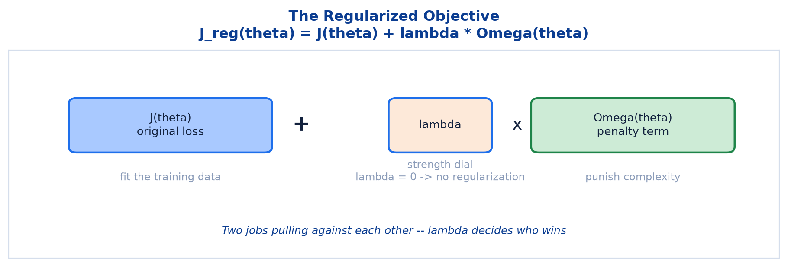
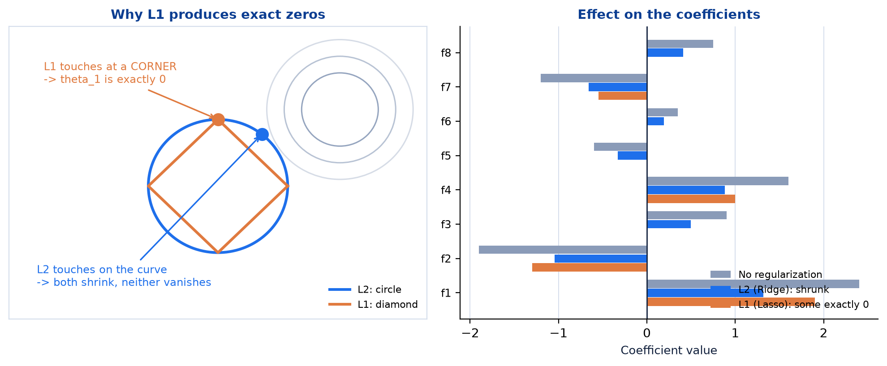
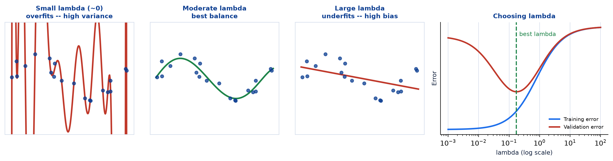
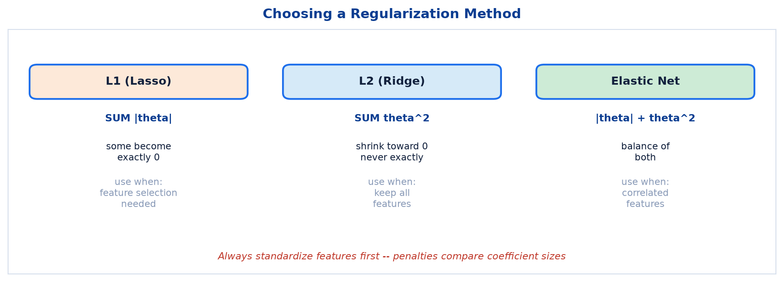
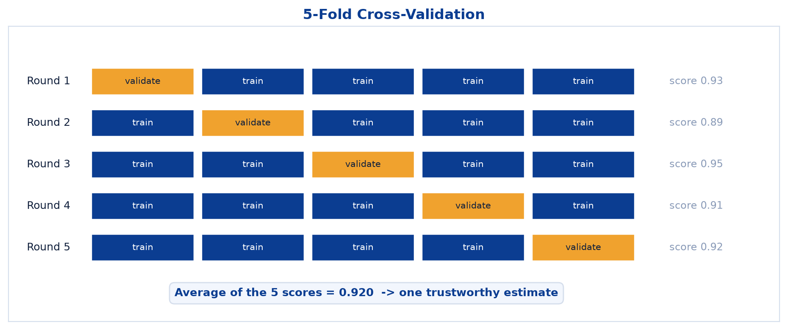

# <span style="color:#0B3D91">Regularization & Cross-Validation</span>

> Study notes on the two techniques that keep models reliable: **penalising complexity** so a model
> cannot memorise noise, and **validating properly** so you can trust the number you measured.
> Covers `J_reg(θ) = J(θ) + λ·Ω(θ)` → **L1 (Lasso) vs L2 (Ridge)** → the **effect of lambda** →
> **Elastic Net, Dropout and Early Stopping** → **K-Fold Cross-Validation**.
>
> **A note on formulas:** equations are written in plain text inside code blocks rather than
> LaTeX, so they render correctly in any Markdown viewer.

---

## <span style="color:#1E6FEB">Table of Contents</span>

1. [What Is Regularization?](#1-what-is-regularization)
2. [L1 (Lasso) vs. L2 (Ridge)](#2-l1-lasso-vs-l2-ridge)
3. [The Effect of Lambda](#3-the-effect-of-lambda)
4. [Other Regularization Methods](#4-other-regularization-methods)
5. [Summary & Best Practices](#5-summary--best-practices)
6. [Cross-Validation: A More Reliable Check](#6-cross-validation-a-more-reliable-check)

---

## <span style="color:#1E6FEB">1. What Is Regularization?</span>

### 1.1 Overview / What is it?

> A technique used to **prevent overfitting** by adding a **penalty for model complexity**,
> discouraging the model from learning noise in the training data.

```text
J_reg(theta) = J(theta) + lambda * Omega(theta)

J(theta)       = original loss (e.g. MSE)
Omega(theta)   = penalty term
lambda         = controls regularization strength (lambda = 0 -> no regularization)
```



### 1.2 Why does it matter for AI?

| Benefit | What it means |
|---|---|
| **Reduces Overfitting** | Lowers high variance in the model |
| **Improves Generalization** | Performs better on unseen data |
| **Controls Complexity** | Discourages overly complex models |
| **More Robust** | Makes models more stable overall |

The previous topic listed regularization as a remedy for high variance. This is how it works.

### 1.3 Key Concepts — two competing jobs

```text
J(theta)              "fit the training data"       pulls toward complexity
lambda * Omega(theta) "stay simple"                 pulls toward simplicity
```

The model can no longer pursue training accuracy at any cost. Every increase in coefficient size now
has to **pay for itself** by reducing the loss more than it increases the penalty.

### 1.4 Simple Example

```text
Without regularization, a model might learn:
    y = 847*x1 - 923*x2 + 1204*x3 - ...
    enormous coefficients, perfectly fitting the training noise

With regularization, those huge values become expensive:
    y = 2.1*x1 - 1.8*x2 + 0.9*x3 - ...
    smaller, smoother, more likely to generalise
```

### 1.5 How it works

Why are large coefficients a problem? Because they make the model **hypersensitive**: a tiny change
in an input produces a large change in the output. That is exactly the behaviour needed to thread a
curve through every noisy training point, and exactly what fails on new data.

Shrinking coefficients forces smoother, less jumpy decision surfaces.

### 1.6 Practical Example / Use Case

```python
from sklearn.linear_model import Ridge, Lasso

ridge = Ridge(alpha=1.0).fit(X_train_scaled, y_train)   # alpha IS lambda in sklearn
lasso = Lasso(alpha=0.1).fit(X_train_scaled, y_train)
```

scikit-learn calls the strength parameter `alpha`, not `lambda` — `lambda` is a reserved word in
Python. Same dial, different label.

### 1.7 Key Takeaways

> - Regularization adds a **penalty for complexity**: `J_reg = J + lambda * Omega`.
> - It reduces overfitting, improves generalization, controls complexity and adds robustness.
> - `lambda = 0` means no regularization at all.
> - Large coefficients cause hypersensitivity; shrinking them smooths the model.

---

## <span style="color:#1E6FEB">2. L1 (Lasso) vs. L2 (Ridge)</span>

### 2.1 Overview / What is it?

| L1 Regularization (Lasso) | L2 Regularization (Ridge) |
|---|---|
| `J(theta) + lambda * SUM \|theta_i\|` | `J(theta) + lambda * SUM theta_i^2` |
| Encourages **sparsity** (drives some coefficients to **exactly 0**) | Shrinks coefficients **towards but never exactly 0** |
| **Performs feature selection** | **Keeps all features** but reduces their impact |
| Useful when **only a few features matter** | Useful when **many features contribute** |



### 2.2 Why does it matter for AI?

The practical difference is decisive: **L1 deletes features, L2 merely quietens them.** That single
distinction usually determines which one you want.

### 2.3 Key Concepts — why L1 produces exact zeros

The penalties behave differently as a coefficient approaches zero:

```text
L2 penalty on theta:   theta^2   -> derivative 2*theta -> shrinks to 0 as theta shrinks
                       the push toward zero FADES as you approach zero
                       -> coefficients get small but never quite arrive

L1 penalty on theta:   |theta|   -> derivative is constant (+1 or -1)
                       the push toward zero stays CONSTANT all the way in
                       -> coefficients reach exactly 0 and stay there
```

Geometrically this is the diamond-versus-circle picture: a diamond has **corners on the axes**, and
corners are exactly where a coefficient equals zero.

### 2.4 Simple Example

```text
Starting coefficients: [2.4, -1.9, 0.9, 1.6, -0.6, 0.35, -1.2, 0.75]

After L2 (Ridge): [1.3, -1.0, 0.5, 0.9, -0.3, 0.19, -0.7, 0.41]
                  all eight survive, all smaller

After L1 (Lasso): [1.9, -1.3, 0.0, 1.0,  0.0, 0.00, -0.55, 0.0]
                  four features eliminated entirely
```

Lasso has produced a model using half the features. That is automatic feature selection, done during
training.

### 2.5 How it works

```text
Use L1 when: you suspect most features are irrelevant
             you want a smaller, more interpretable model
             feature selection is a goal in itself

Use L2 when: many features each contribute a little
             you want to keep everything but tame it
             features are correlated (L2 handles this more gracefully)
```

### 2.6 Practical Example / Use Case

```python
from sklearn.linear_model import Lasso
import pandas as pd

lasso = Lasso(alpha=0.1).fit(X_train_scaled, y_train)
coefs = pd.Series(lasso.coef_, index=X_train.columns)

print("dropped:", list(coefs[coefs == 0].index))
print("kept   :", list(coefs[coefs != 0].index))
```

Reading which features Lasso zeroed is a genuinely useful exploratory tool, quite apart from the
model it produces.

### 2.7 Key Takeaways

> - **L1 (Lasso)** `SUM |theta|` drives some coefficients to **exactly 0** — it performs **feature
>   selection**.
> - **L2 (Ridge)** `SUM theta^2` shrinks coefficients **toward** zero but never to zero.
> - L1 when only a few features matter; L2 when many contribute.
> - L1's constant gradient is what allows it to reach exact zero.

---

## <span style="color:#1E6FEB">3. The Effect of Lambda</span>

### 3.1 Overview / What is it?



| Lambda | Effect |
|---|---|
| **Small λ (≈ 0)** | Weak regularization — model **overfits** (high variance) |
| **Moderate λ** | **Best balance** — good fit, best generalization |
| **Large λ** | Strong regularization — model **underfits** (high bias) |

### 3.2 Why does it matter for AI?

Lambda is the bias-variance dial made explicit. Turning it up moves you along the exact trade-off
curve from the previous topic — and both extremes are bad in the familiar, opposite ways.

### 3.3 Key Concepts

```text
lambda = 0        -> penalty disappears -> plain unregularized model -> overfits
lambda small      -> gentle shrinkage
lambda moderate   -> the sweet spot
lambda very large -> coefficients crushed toward 0 -> model predicts almost nothing -> underfits
```

### 3.4 Simple Example

```text
lambda = 0.0001 -> train 0.99, test 0.72   overfitting
lambda = 1.0    -> train 0.92, test 0.89   balanced
lambda = 1000   -> train 0.61, test 0.60   underfitting
```

The same three-way pattern from the overfitting topic, now driven by a single number.

### 3.5 How it works

Lambda cannot be reasoned out from first principles — it has to be **searched**, and always on a
logarithmic scale:

```text
try: 0.001, 0.01, 0.1, 1, 10, 100
not: 1, 2, 3, 4, 5
```

The effect is multiplicative, so linear steps waste almost all their effort in one narrow region.

### 3.6 Practical Example / Use Case

```python
from sklearn.linear_model import RidgeCV
import numpy as np

ridge = RidgeCV(alphas=np.logspace(-3, 3, 13), cv=5).fit(X_train_scaled, y_train)
print("best alpha:", ridge.alpha_)
```

`RidgeCV` and `LassoCV` search lambda with built-in cross-validation. Use them rather than writing
the loop yourself.

### 3.7 Key Takeaways

> - **Small λ** → weak regularization → **overfitting**.
> - **Moderate λ** → the best balance.
> - **Large λ** → strong regularization → **underfitting**.
> - Search lambda on a **logarithmic scale**, using cross-validation.

---

## <span style="color:#1E6FEB">4. Other Regularization Methods</span>

### 4.1 Overview / What is it?

| Method | What it does |
|---|---|
| **Elastic Net (L1 + L2)** | Combines L1 and L2 penalties; useful when features are **correlated** |
| **Dropout (Neural Nets)** | Randomly drops neurons during training to improve generalization |
| **Early Stopping** | Stops training when validation error stops improving |

### 4.2 Why does it matter for AI?

Regularization is a broader idea than just adding a penalty term. Anything that **constrains a model
from perfectly fitting its training data** counts — including deleting neurons at random and simply
stopping early.

### 4.3 Key Concepts

```text
ELASTIC NET     penalty = lambda1 * SUM|theta| + lambda2 * SUM theta^2
                gets L1's feature selection AND L2's stability with correlated features

DROPOUT         during each training step, randomly ignore a fraction of neurons
                the network cannot rely on any single neuron -> learns redundant, robust features

EARLY STOPPING  watch validation error each epoch; stop when it starts rising
                the cheapest regularizer available -- it costs nothing but attention
```

### 4.4 Simple Example — why Elastic Net exists

```text
Two features that are nearly identical (correlation 0.98):

L1 alone -> arbitrarily keeps ONE, zeroes the other
            which one? essentially a coin flip -> unstable across reruns

L2 alone -> keeps both, splits the weight between them -> stable but no selection

Elastic Net -> selects, but treats correlated groups together -> stable AND sparse
```

### 4.5 How it works — early stopping

```text
epoch 10: train 0.82, validation 0.80
epoch 20: train 0.89, validation 0.86
epoch 30: train 0.94, validation 0.88   <- validation peaks here
epoch 40: train 0.97, validation 0.85   <- validation worsening: overfitting has begun
epoch 50: train 0.99, validation 0.81

Stop at epoch 30 and keep those weights.
```

Early stopping is the only regularizer that also **saves you compute**, which makes it a rare free
lunch.

### 4.6 Practical Example / Use Case

```python
from sklearn.linear_model import ElasticNet

# l1_ratio = 1.0 is pure Lasso, 0.0 is pure Ridge, 0.5 is an even blend
model = ElasticNet(alpha=0.1, l1_ratio=0.5).fit(X_train_scaled, y_train)
```

Dropout belongs to neural networks and is covered properly in the deep learning material; it is
named here to show that the same underlying idea recurs across model families.

### 4.7 Key Takeaways

> - **Elastic Net** blends L1 and L2 — best when features are **correlated**.
> - **Dropout** randomly drops neurons during neural network training.
> - **Early Stopping** halts training when validation error stops improving.
> - Regularization is any constraint that stops a model fitting its training data perfectly.

---

## <span style="color:#1E6FEB">5. Summary & Best Practices</span>

### 5.1 Overview / What is it?



| Method | Penalty | Effect on Coefficients | Use When |
|---|---|---|---|
| **L1 (Lasso)** | `SUM \|theta_i\|` | Some become **exactly 0** (sparse) | Feature selection needed |
| **L2 (Ridge)** | `SUM theta_i^2` | Shrink towards 0 (never exact) | Keep all features |
| **Elastic Net** | `\|theta_i\| + theta_i^2` | Balance between L1 and L2 | Correlated features |

### 5.2 Why does it matter for AI?

Four best practices that turn the theory into a reliable routine:

```text
Standardize features before applying regularization
Use cross-validation to choose the right value of lambda
Monitor training and validation error curves
Prefer simpler models that generalize well
```

### 5.3 Key Concepts — why standardizing is mandatory

This is the practice people forget, and it silently ruins results.

```text
The penalty sums coefficient SIZES. Coefficient size depends on feature scale.

income measured in dollars -> tiny coefficient -> barely penalised
age measured in years      -> larger coefficient -> heavily penalised

Without scaling, the penalty punishes features for their UNITS,
not for their importance.
```

Change income from dollars to thousands of dollars and you change which features the model keeps.
That is clearly nonsense, and scaling is what prevents it.

### 5.4 Simple Example

```text
Unscaled: Lasso drops "age" because its coefficient looks big
Scaled:   Lasso keeps "age" and drops a genuinely useless feature instead
```

### 5.5 How it works

The full recommended routine:

```text
1. Split the data (train / test)
2. Fit the scaler on TRAIN only, then transform both
3. Choose L1, L2 or Elastic Net based on your feature situation
4. Search lambda on a log scale with cross-validation
5. Check training and validation curves
6. Prefer the simpler model when scores are close
```

Step 6 deserves emphasis. When two models score 0.891 and 0.893, take the simpler one. That
difference is almost certainly noise, and the simpler model is easier to explain, deploy and
maintain.

### 5.6 Practical Example / Use Case

```python
from sklearn.pipeline import make_pipeline
from sklearn.preprocessing import StandardScaler
from sklearn.linear_model import LassoCV

model = make_pipeline(
    StandardScaler(),                                  # scaling, correctly ordered
    LassoCV(alphas=np.logspace(-3, 1, 20), cv=5),      # lambda chosen by CV
).fit(X_train, y_train)
```

The pipeline guarantees the scaler is fitted on training folds only — leakage prevention built in.

### 5.7 Key Takeaways

> - **L1** for sparsity and feature selection, **L2** to keep all features, **Elastic Net** for
>   correlated features.
> - **Always standardize before regularizing** — otherwise you penalise units, not importance.
> - **Choose lambda by cross-validation**, on a log scale.
> - **Monitor both error curves** and **prefer the simpler model** when scores tie.

---

## <span style="color:#1E6FEB">6. Cross-Validation: A More Reliable Check</span>

### 6.1 Overview / What is it?

> A single train-test split can be **lucky or unlucky**. **K-Fold Cross-Validation** gives a more
> reliable estimate of real-world performance.



```text
The data is split into K equal folds (5 shown above)
The model trains on K - 1 folds and validates on the remaining fold
This repeats K times, so every fold gets a turn as the validation set
The K validation scores are averaged into one overall, more trustworthy estimate
```

### 6.2 Why does it matter for AI?

A single 80/20 split evaluates your model on **one arbitrary 20% of the data**. If that slice
happens to be easy, you overestimate. If it happens to be hard, you underestimate. Either way you
are drawing a conclusion from one sample of size one.

### 6.3 Key Concepts

```text
Single split: 1 score,  based on 20% of the data,  high uncertainty
5-fold CV   : 5 scores, every row validated once,  much lower uncertainty
```

The **spread** of the K scores is an extra gift: it tells you how stable the model is, which a single
split cannot reveal at all.

### 6.4 Simple Example

```text
Round 1: validate on fold 1, train on 2-5 -> 0.93
Round 2: validate on fold 2, train on 1,3-5 -> 0.89
Round 3: validate on fold 3, train on 1-2,4-5 -> 0.95
Round 4: validate on fold 4, train on 1-3,5 -> 0.91
Round 5: validate on fold 5, train on 1-4 -> 0.92

Average = 0.920
```

Report `0.920 +/- 0.021`, not a single lucky `0.95`.

### 6.5 How it works

```text
K = 5   the common default -- 5 fits, good balance of cost and reliability
K = 10  more reliable, twice the compute
K = n   "leave-one-out" -- maximally thorough, rarely worth the cost
```

For classification, use **stratified** folds so each fold preserves the class balance. With
imbalanced data, non-stratified folds can produce a validation fold containing almost none of the
minority class, which makes the score meaningless.

### 6.6 Practical Example / Use Case

```python
from sklearn.model_selection import cross_val_score, StratifiedKFold

cv = StratifiedKFold(n_splits=5, shuffle=True, random_state=42)
scores = cross_val_score(model, X, y, cv=cv, scoring="f1_macro")

print(scores)
print(f"{scores.mean():.3f} +/- {scores.std():.3f}")
```

> **Worth knowing:** with time-series data, never shuffle. Future rows must not be used to predict
> the past — use `TimeSeriesSplit` instead. Shuffling time-ordered data is leakage wearing a
> convincing disguise.

### 6.7 Key Takeaways

> - A single train-test split can be **lucky or unlucky**.
> - **K-Fold CV** splits into K folds; each takes a turn as validation; scores are averaged.
> - The **average** is the estimate; the **standard deviation** measures stability.
> - Use **stratified** folds for classification, and `TimeSeriesSplit` for temporal data.

---

## <span style="color:#1E6FEB">Summary — Regularization & Cross-Validation at a Glance</span>

```text
Regularization    -> stop the model from memorising:  J + lambda * penalty
Cross-Validation  -> stop yourself from being fooled: average over K folds
```

| Concept | One-sentence mental model |
|---|---|
| `J_reg = J + lambda * Omega` | Fit the data, but pay a price for complexity |
| L1 (Lasso) | Deletes features by zeroing coefficients |
| L2 (Ridge) | Quietens features without removing any |
| Elastic Net | Both, for when features are correlated |
| Lambda | The bias-variance dial, searched on a log scale |
| Early stopping | Quit while the validation score is ahead |
| K-Fold CV | Every row gets a turn being the test set |

**The one-sentence version:** regularization keeps a model honest by charging it for complexity, and
cross-validation keeps *you* honest by refusing to let one lucky split decide anything.

**Where this leads:** these techniques modify **what** a model optimises, but not **how** the
optimisation actually happens. The final topic opens that box: **gradient descent and loss
functions** — the universal mechanism behind every model in this course, from linear regression to
modern GenAI systems.

---

> **Navigation:** ← Previous: [06 — Overfitting, Underfitting & Bias-Variance](06_Machine_Learning_Overfitting_Underfitting_And_Bias_Variance.md) ·
> Next → [08 — Optimization Basics & Loss Functions](08_Machine_Learning_Optimization_And_Loss_Functions.md)
