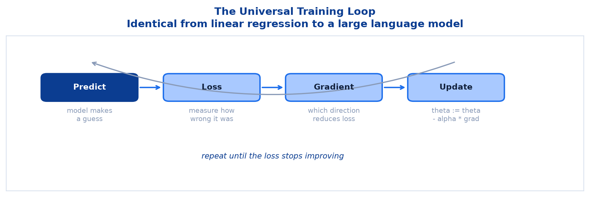
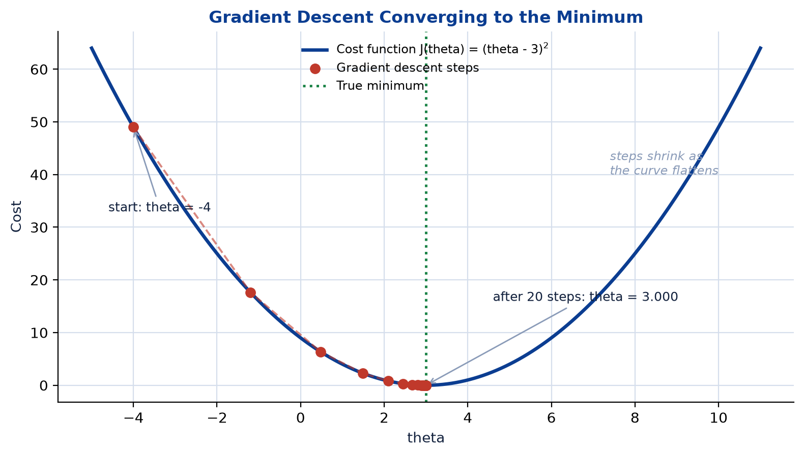
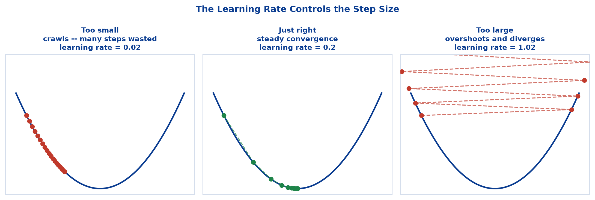
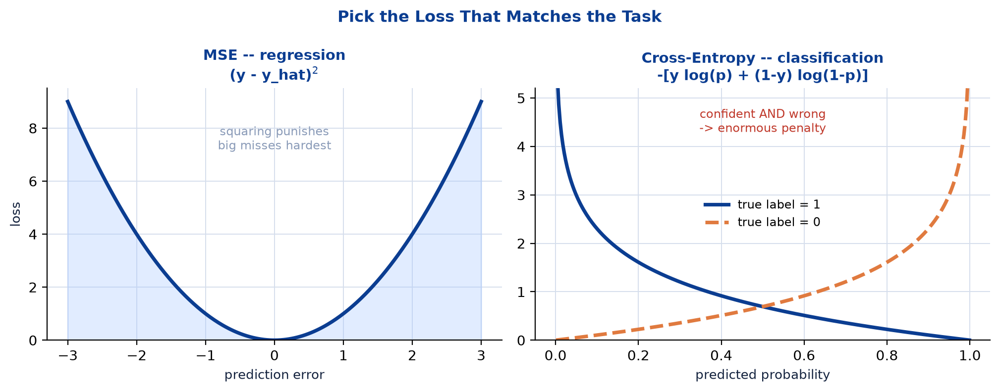
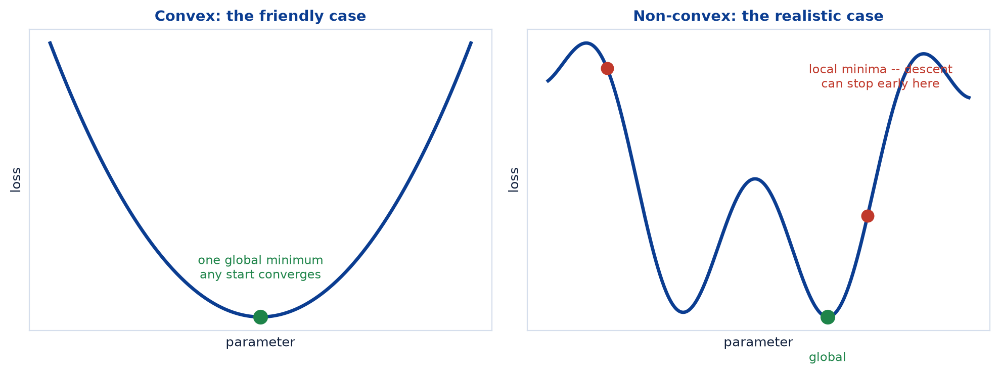
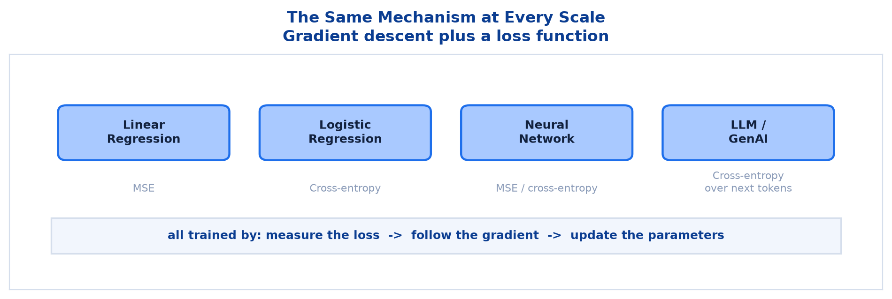

# <span style="color:#0B3D91">Optimization Basics & Loss Functions</span>

> Study notes on the mechanism underneath every model in this course. Covers **what a loss function
> is** → **gradient descent intuition** and the update rule → a **worked descent from scratch** →
> the **learning rate** → **MSE vs Cross-Entropy** → how the same machinery scales all the way up to
> **Agentic AI and GenAI pipelines**.
>
> **A note on formulas:** equations are written in plain text inside code blocks rather than
> LaTeX, so they render correctly in any Markdown viewer.

---

## <span style="color:#1E6FEB">Table of Contents</span>

1. [What Is a Loss Function?](#1-what-is-a-loss-function)
2. [Gradient Descent Intuition](#2-gradient-descent-intuition)
3. [Gradient Descent From Scratch](#3-gradient-descent-from-scratch)
4. [The Learning Rate](#4-the-learning-rate)
5. [MSE vs Cross-Entropy](#5-mse-vs-cross-entropy)
6. [Local Minima and Realistic Landscapes](#6-local-minima-and-realistic-landscapes)
7. [Connecting to Agentic AI and GenAI](#7-connecting-to-agentic-ai-and-genai)

---

## <span style="color:#1E6FEB">1. What Is a Loss Function?</span>

### 1.1 Overview / What is it?

A **loss function** (or cost function) measures **how wrong** a model's predictions are. One number:
low means good, high means bad.

```text
Loss = some measure of the distance between prediction and truth
```

Training a model means **finding the parameters that make this number as small as possible.** That
is the entire objective, stated completely.

### 1.2 Why does it matter for AI?

Without a loss function, "learning" has no meaning. The loss converts a vague goal — *be accurate* —
into a precise mathematical target that an algorithm can chase.

Every model in this course has one:

```text
Linear Regression   -> Mean Squared Error
Logistic Regression -> Cross-Entropy
Decision Tree       -> Gini / Entropy at each split
K-Means             -> WCSS
Neural network      -> MSE or Cross-Entropy
```

Even the tree and clustering topics were minimising something. **Impurity and WCSS are loss
functions in disguise.**

### 1.3 Key Concepts

```text
Loss tells you HOW WRONG you are.
Optimization tells you WHAT TO CHANGE to become less wrong.
```

Those two ideas, repeated in a loop, are all of model training.

### 1.4 Simple Example

```text
True house price:      250
Model predicts:        180

Error = 250 - 180 = 70
Squared error = 4,900       <- the loss for this one prediction
```

Average that across every training row and you have the model's total loss.

### 1.5 How it works

Loss functions are designed to be **differentiable** — you can compute their slope. That is not a
coincidence or a convenience; it is the requirement that makes gradient descent possible at all.

### 1.6 Practical Example / Use Case

```python
import numpy as np

y_true = np.array([250, 300, 180])
y_pred = np.array([240, 310, 200])

mse = ((y_true - y_pred) ** 2).mean()
print(mse)   # 200.0
```

### 1.7 Key Takeaways

> - A **loss function** measures how wrong the model is, as a single number.
> - **Training = minimising the loss.**
> - Every model has one, including trees (impurity) and K-Means (WCSS).
> - Loss functions must be differentiable so their slope can guide learning.

---

## <span style="color:#1E6FEB">2. Gradient Descent Intuition</span>

### 2.1 Overview / What is it?

**Gradient descent** is the algorithm that minimises the loss. The update rule:

```text
theta := theta - alpha * gradient(J(theta))

theta    = the parameter being learned
alpha    = the learning rate (step size)
gradient = the slope of the loss with respect to theta
```



### 2.2 Why does it matter for AI?

This one line trains linear regression, logistic regression, neural networks and large language
models. The scale changes enormously; **the rule does not.**

### 2.3 Key Concepts — the hill-descending analogy

```text
You are on a foggy hillside and want to reach the valley floor.
You cannot see far, but you can feel which way the ground slopes.

1. Feel the slope under your feet      -> compute the gradient
2. Step downhill                       -> subtract the gradient
3. Repeat until the ground is flat     -> until the gradient is ~0
```

### 2.4 Simple Example — why the minus sign

```text
Gradient POSITIVE -> loss increases as theta increases -> so DECREASE theta
Gradient NEGATIVE -> loss decreases as theta increases -> so INCREASE theta

Subtracting the gradient handles both cases automatically.
```

That is the whole reason the rule says *minus*. It always moves opposite to the uphill direction.

### 2.5 How it works

```text
Steep slope (large gradient) -> large step  -> move quickly while far from the minimum
Flat slope (small gradient)  -> small step  -> tread carefully when close
Zero slope                   -> no step     -> converged
```

The step size shrinks automatically as the minimum approaches, because the gradient itself shrinks.
This self-braking behaviour is visible in the worked example below.

### 2.6 Practical Example / Use Case

```python
for epoch in range(epochs):
    predictions = model(X)                    # forward
    loss = loss_function(y, predictions)      # how wrong
    grads = compute_gradients(loss)           # which direction
    parameters -= learning_rate * grads       # update
```

Every training loop you will ever read is a variation on these four lines.

### 2.7 Key Takeaways

> - Gradient descent minimises loss via `theta := theta - alpha * gradient`.
> - The **minus sign** moves against the slope, i.e. downhill.
> - Steps are **large when steep, small when flat** — automatically.
> - The loop is **predict → loss → gradient → update**, repeated.

---

## <span style="color:#1E6FEB">3. Gradient Descent From Scratch</span>

### 3.1 Overview / What is it?

To make the update rule concrete, minimise a simple quadratic cost function by hand:

```text
J(theta) = (theta - 3)^2

A bowl-shaped cost function whose minimum is at theta = 3.
```

Its derivative:

```text
J'(theta) = 2 * (theta - 3)
```

### 3.2 Why does it matter for AI?

We already know the answer is `theta = 3`, which is exactly the point: it lets you verify the
algorithm works. No scikit-learn, no neural network — just the formula.

### 3.3 Key Concepts — the setup

```text
theta         = -4.0     starting guess, deliberately far from the minimum
learning_rate =  0.2     the step size
steps         =  20
```

### 3.4 Simple Example — the first few steps by hand

```text
Step 1:  gradient = 2 * (-4.0 - 3) = -14.0
         theta = -4.0 - 0.2 * (-14.0) = -1.2

Step 2:  gradient = 2 * (-1.2 - 3) = -8.4
         theta = -1.2 - 0.2 * (-8.4) = 0.48

Step 3:  gradient = 2 * (0.48 - 3) = -5.04
         theta = 0.48 - 0.2 * (-5.04) = 1.488
```

Watch the gradient shrink: `-14.0`, `-8.4`, `-5.04`. Each step is smaller than the last, without
anyone adjusting anything. The algorithm brakes on its own approach.

### 3.5 How it works



```text
Starting value: -4.000
After 20 steps:  2.999...
True minimum is at theta = 3.0
```

It converges to the correct answer from a deliberately terrible starting point, using nothing but
the local slope. It never needed to know where the minimum was.

### 3.6 Practical Example / Use Case

```python
def cost_function(theta):
    return (theta - 3) ** 2

def gradient(theta):
    return 2 * (theta - 3)

theta = -4.0
learning_rate = 0.2
steps = 20

history = [theta]
for _ in range(steps):
    theta = theta - learning_rate * gradient(theta)
    history.append(theta)

print(f"Starting value: {history[0]:.3f}")
print(f"Final value after {steps} steps: {history[-1]:.3f}")
print("True minimum is at theta = 3.0")
```

### 3.7 Key Takeaways

> - `J(theta) = (theta - 3)^2` has its minimum at `theta = 3`, with gradient `2 * (theta - 3)`.
> - Starting at `-4.0` with `learning_rate = 0.2`, 20 steps reach ~`3.0`.
> - Steps shrink automatically as the gradient shrinks near the minimum.
> - The algorithm only ever uses the **local slope** — it never sees the whole curve.

---

## <span style="color:#1E6FEB">4. The Learning Rate</span>

### 4.1 Overview / What is it?

`alpha`, the learning rate, controls **how big each step is**. It is the most important
hyperparameter in gradient-based training.



### 4.2 Why does it matter for AI?

Get it wrong in one direction and training crawls; wrong in the other and it explodes. Neither
failure is subtle, which is at least convenient.

### 4.3 Key Concepts

| Learning rate | Behaviour |
|---|---|
| **Too small** | Crawls — converges eventually, wasting enormous time |
| **Just right** | Steady, efficient convergence |
| **Too large** | Overshoots the minimum, bounces, and can **diverge** entirely |

### 4.4 Simple Example — divergence

On `J(theta) = (theta - 3)^2` with `alpha = 1.02`:

```text
theta = -4.00 -> -1.72 ... but each step overshoots slightly further
                 the distance from 3 GROWS every iteration
                 -> loss increases forever
```

A rising loss during training is the unmistakable signature of too large a learning rate.

### 4.5 How it works

```text
Loss decreasing steadily      -> learning rate is reasonable
Loss decreasing very slowly   -> increase it (try 3x or 10x)
Loss oscillating              -> decrease it
Loss increasing or NaN        -> far too large; decrease sharply
```

Tune it on a **multiplicative** scale — `0.001, 0.01, 0.1` — for the same reason as lambda. Linear
steps waste effort.

### 4.6 Practical Example / Use Case

```python
for lr in [0.01, 0.1, 0.2, 0.5, 1.02]:
    theta = -4.0
    for _ in range(20):
        theta -= lr * 2 * (theta - 3)
    print(f"lr={lr:<5} -> theta={theta:>12.4f}")
```

Running this makes the three regimes obvious at a glance — including the last one running off to
absurdity.

### 4.7 Key Takeaways

> - The **learning rate** `alpha` controls step size.
> - **Too small** = slow; **too large** = overshoot and divergence.
> - A **rising loss** means the learning rate is too large.
> - Tune it multiplicatively, and always watch the loss curve.

---

## <span style="color:#1E6FEB">5. MSE vs Cross-Entropy</span>

### 5.1 Overview / What is it?

The two loss functions this course uses:



| | Mean Squared Error (MSE) | Cross-Entropy |
|---|---|---|
| **Task** | Regression (predict a number) | Classification (predict a category) |
| **Formula** | `mean((y - y_hat)^2)` | `-[y log(p) + (1-y) log(1-p)]` |
| **Output compared** | Numbers | Probabilities |
| **Punishes** | Large errors, quadratically | Confident wrong answers, brutally |

### 5.2 Why does it matter for AI?

The loss must match the task. A mismatch does not merely reduce accuracy — it optimises for the
wrong thing entirely.

### 5.3 Key Concepts — MSE

```text
MSE = mean((y_true - y_pred)^2)

Squaring does two jobs:
  1. makes all errors positive (so they cannot cancel out)
  2. punishes large errors much harder than small ones

error of 2  -> loss 4
error of 10 -> loss 100      -- 5x the error, 25x the penalty
```

That amplification is why MSE is sensitive to outliers: one wild value can dominate the entire loss.

### 5.4 Key Concepts — Cross-Entropy

```text
Cross-Entropy = -[y log(p) + (1-y) log(1-p)]

True label 1, predicted 0.9  -> -log(0.9) = 0.105    small penalty
True label 1, predicted 0.5  -> -log(0.5) = 0.693    moderate
True label 1, predicted 0.1  -> -log(0.1) = 2.303    large
True label 1, predicted 0.01 -> -log(0.01) = 4.605   severe
```

As the predicted probability approaches zero for the true class, the loss approaches **infinity**.
Cross-entropy does not simply dislike being wrong — it despises being **confidently** wrong.

### 5.5 Simple Example — why not use MSE for classification?

```text
True label = 1, model predicts probability 0.01 (wrong, and very confident)

MSE:            (1 - 0.01)^2 = 0.98          -- a mild complaint
Cross-Entropy:  -log(0.01)   = 4.61          -- a serious one
```

MSE caps out around 1.0 for probabilities, so a catastrophic prediction looks only slightly worse
than a merely poor one. The gradients become weak exactly where the model most needs correcting.
Cross-entropy keeps the pressure on.

### 5.6 Practical Example / Use Case

```python
import numpy as np

def mse(y, p):
    return np.mean((y - p) ** 2)

def binary_cross_entropy(y, p):
    p = np.clip(p, 1e-12, 1 - 1e-12)          # avoid log(0)
    return -np.mean(y * np.log(p) + (1 - y) * np.log(1 - p))

y = np.array([1, 0, 1])
p = np.array([0.9, 0.1, 0.8])
print(round(mse(y, p), 4))                   # 0.02
print(round(binary_cross_entropy(y, p), 4))  # 0.1446
```

The `clip` is not optional — `log(0)` is negative infinity, and one such value poisons the whole
batch.

### 5.7 Key Takeaways

> - **MSE** for regression: squares errors, punishing large ones quadratically.
> - **Cross-Entropy** for classification: punishes confident wrong answers severely.
> - MSE on classification produces weak gradients exactly where they are needed most.
> - **Match the loss function to the task.**

---

## <span style="color:#1E6FEB">6. Local Minima and Realistic Landscapes</span>

### 6.1 Overview / What is it?

The worked example used a perfect bowl. Real loss surfaces are rarely that polite.



### 6.2 Why does it matter for AI?

Gradient descent only ever sees the slope **directly under its feet**. In a bumpy landscape it can
settle into a dip that is not the deepest one available and stop there, entirely satisfied.

### 6.3 Key Concepts

```text
CONVEX (bowl-shaped)   one minimum; any starting point reaches it
                       linear regression, logistic regression, ridge/lasso

NON-CONVEX (bumpy)     many local minima; the result depends on where you start
                       neural networks, most complex models
```

### 6.4 Simple Example

```text
Start at theta = -3 -> descends into the left dip  -> stops at a LOCAL minimum
Start at theta =  1 -> descends into the deep dip  -> reaches the GLOBAL minimum

Same algorithm, same data, different starting point, different answer.
```

This should feel familiar — it is the same "sensitive to initial centroids" problem K-Means had.
Same cause, same family of fixes.

### 6.5 How it works

```text
Random restarts   -> try several starting points, keep the best result
Momentum          -> carry velocity through small dips instead of settling in them
Mini-batch noise  -> noisy gradients can bounce the model out of shallow minima
Adaptive methods  -> Adam and friends adjust the step size per parameter
```

> **Worth knowing:** in high-dimensional problems, local minima turn out to be less troublesome
> than they sound. Most flat points in very high dimensions are **saddle points** — downhill in
> some directions and uphill in others — rather than genuine traps. Modern optimizers handle them
> well. This is beyond the session's scope, but it explains why deep learning works despite the
> landscape looking terrifying.

### 6.6 Practical Example / Use Case

```python
best_theta, best_loss = None, float("inf")

for start in [-8, -4, 0, 4, 8]:          # random restarts
    theta = float(start)
    for _ in range(50):
        theta -= 0.1 * 2 * (theta - 3)
    if (theta - 3) ** 2 < best_loss:
        best_theta, best_loss = theta, (theta - 3) ** 2

print(best_theta)
```

### 6.7 Key Takeaways

> - **Convex** losses have one minimum; gradient descent always finds it.
> - **Non-convex** losses have many; the starting point affects the outcome.
> - Mitigations include **random restarts, momentum and adaptive optimizers**.
> - Same underlying issue as K-Means' sensitivity to initial centroids.

---

## <span style="color:#1E6FEB">7. Connecting to Agentic AI and GenAI</span>

### 7.1 Overview / What is it?

> **Gradient descent and loss functions are the universal training mechanism behind models large and
> small, including modern GenAI systems.**



### 7.2 Why does it matter for AI?

The gap between the 20-line example above and a large language model is one of **scale**, not of
**kind**. Same loop, same update rule, vastly more parameters.

### 7.3 Key Concepts

| Model | Loss function | Trained by |
|---|---|---|
| Linear Regression | MSE | Gradient descent (or closed form) |
| Logistic Regression | Cross-Entropy | Gradient descent |
| Neural Network | MSE / Cross-Entropy | Gradient descent + backpropagation |
| **LLM / GenAI** | **Cross-Entropy over next tokens** | Gradient descent at enormous scale |

### 7.4 Simple Example — what an LLM actually optimises

```text
Input:  "The capital of France is ___"

The model outputs a probability for every token in its vocabulary.
The true next token is "Paris".

Loss = cross-entropy between predicted distribution and the true token
     = -log(probability assigned to "Paris")

Assign "Paris" a high probability -> low loss.
Assign it a low probability       -> large loss, large correction.
```

That is **the same cross-entropy formula** from section 5, applied over a vocabulary of tens of
thousands of tokens instead of two classes.

### 7.5 How it works

```text
This course:  theta = one parameter,     20 steps,      a laptop
An LLM:       billions of parameters,    millions of steps, thousands of GPUs

The update rule is identical: theta := theta - alpha * gradient
```

For Agentic AI pipelines, the connection is that every component — the language model, any
classifier routing requests, any embedding model powering retrieval — was trained this way. Loss
functions and gradient descent are the foundation the entire stack rests on.

### 7.6 Practical Example / Use Case

```text
The complete picture from this course:

Session I   -> regression, classification, evaluation metrics
Session II  -> trees, forests, clustering, features, overfitting
This topic  -> the mechanism that trains all of them

Same loop everywhere:
    measure the loss -> follow the gradient -> update the parameters
```

### 7.7 Key Takeaways

> - Gradient descent and loss functions are the **universal training mechanism**.
> - LLMs minimise **cross-entropy over next tokens** — the same formula, larger vocabulary.
> - The difference between this course's examples and GenAI is **scale, not principle**.
> - Every component of an Agentic AI pipeline was trained this way.

---

## <span style="color:#1E6FEB">Summary — Optimization at a Glance</span>

```text
predict -> measure loss -> compute gradient -> update parameters -> repeat
```

| Concept | One-sentence mental model |
|---|---|
| Loss function | A single number saying how wrong the model is |
| Gradient | The direction in which the loss increases |
| Gradient descent | Step against the gradient, repeatedly |
| `theta := theta - alpha * grad` | The whole algorithm, in one line |
| Learning rate | Step size: too small crawls, too large explodes |
| MSE | Regression loss; punishes big errors quadratically |
| Cross-Entropy | Classification loss; punishes confident wrong answers |
| Local minimum | A dip that is not the deepest dip |

**The one-sentence version:** every model in this course learns the same way — define how wrong it
is, work out which direction reduces that wrongness, take a step, and repeat until the number stops
falling.

**Where this leads:** this completes the Basic Machine Learning series. From data preparation and
regression in Session I, through trees, ensembles, clustering, feature engineering and reliability
in Session II, to the optimization mechanism that trains all of it. The natural next step is **deep
learning**, where these same ideas — loss functions, gradients, regularization, overfitting — return
with neural networks layered on top.

---

> **Navigation:** ← Previous: [07 — Regularization & Cross-Validation](07_Machine_Learning_Regularization_And_Cross_Validation.md) ·
> **End of the Basic Machine Learning II series.**
