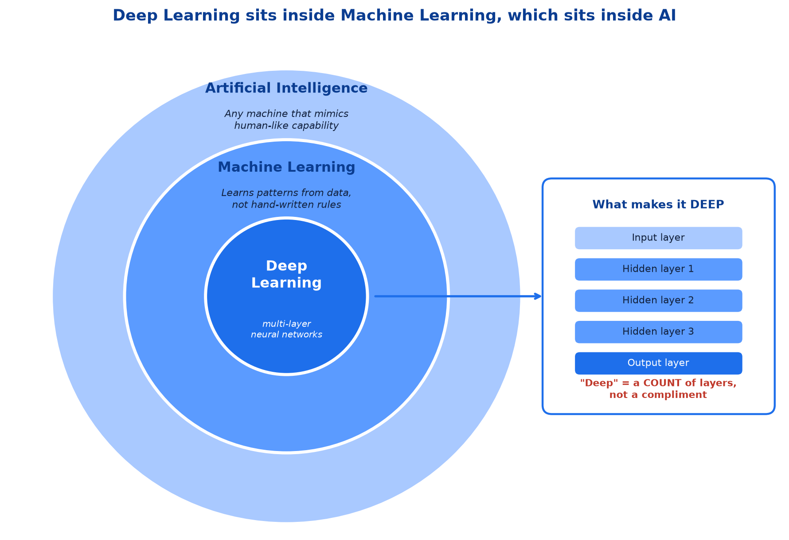
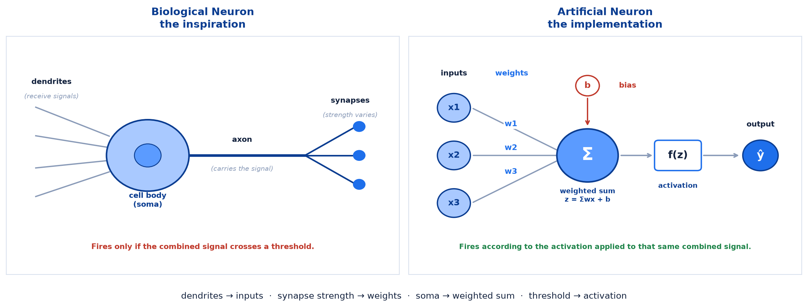
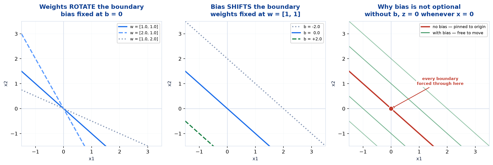
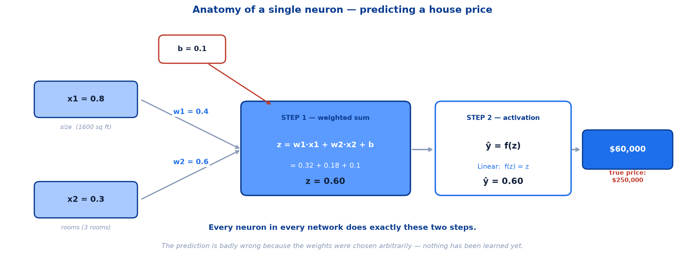

# <span style="color:#0B3D91">Introduction to Deep Learning &amp; the Artificial Neuron</span>

> Study notes on where Deep Learning sits, why it took over, and the single
> computational unit everything else is built from:
> **What Deep Learning is** → **Why it works** → **How it differs from classic ML** →
> **The biological neuron** → **The artificial neuron** → **The perceptron** → **A neuron in code**.
> The foundation for every architecture in this module — ANN, CNN, RNN and LSTM are all
> arrangements of the one unit described here.
>
> **A note on formulas:** equations are written in plain text inside code blocks rather than
> LaTeX, so they render correctly in any Markdown viewer.

---

## <span style="color:#1E6FEB">Table of Contents</span>

1. [What is Deep Learning?](#1-what-is-deep-learning)
2. [Why Deep Learning?](#2-why-deep-learning)
3. [Deep Learning vs. Machine Learning](#3-deep-learning-vs-machine-learning)
4. [The Biological Neuron](#4-the-biological-neuron)
5. [The Artificial Neuron — Weights &amp; Bias](#5-the-artificial-neuron--weights--bias)
6. [The Perceptron](#6-the-perceptron)
7. [A Neuron in Code](#7-a-neuron-in-code)

---

## <span style="color:#1E6FEB">1. What is Deep Learning?</span>

### 1.1 Overview / What is it?

> **Deep Learning** is a branch of Machine Learning that uses **neural networks with multiple
> layers** to learn patterns, relationships, and features **directly from data**, enabling
> computers to solve complex tasks such as image recognition, language understanding, and
> speech processing.

Three phrases in that definition are doing all the work:

| Phrase | What it actually means |
|---|---|
| **"a branch of Machine Learning"** | Deep Learning sits *inside* ML, not beside it. Train/test splits, overfitting, loss functions, cross-validation — all of it still applies. |
| **"neural networks with multiple layers"** | This is the *only* thing that makes it "deep". Depth = stacked layers. One layer is not deep; several are. |
| **"directly from data"** | The headline claim. No human hand-crafts the features. |

### 1.2 Why does it matter for AI?

Almost every AI capability that feels modern — a model that describes a photograph, transcribes
speech, translates a sentence, or holds a conversation — is a deep neural network underneath.
Understanding the nesting stops two common confusions: that Deep Learning is a *replacement* for
Machine Learning (it is a subset), and that it is a fundamentally different kind of mathematics
(it is not — it is the same supervised-learning loop with a more flexible model).

### 1.3 Key Concepts — the nesting



```
Artificial Intelligence
  └── Machine Learning          (learns from data)
        └── Deep Learning       (learns from data USING multi-layer neural networks)
```

| Level | Defining property | Examples |
|---|---|---|
| **Artificial Intelligence** | Any machine that mimics human-like capability | Rule-based expert systems, search algorithms, ML |
| **Machine Learning** | Learns patterns from **data** rather than hand-written rules | Linear Regression, Decision Trees, Random Forest, SVM |
| **Deep Learning** | Learns from data using **multi-layer neural networks** | ANN, CNN, RNN, LSTM, Transformers |

> **Intuition** — "Deep" is not a compliment about profundity. It is a measurement. It
> literally means *"there are a lot of layers stacked up."*

### 1.4 Simple Example — how deep is "deep"?

The word describes a count, so the count is worth seeing:

```
Logistic Regression          ->  0 hidden layers   ->  not deep
Neural net, 1 hidden layer   ->  1 hidden layer    ->  "shallow" network
Neural net, 3 hidden layers  ->  3 hidden layers   ->  deep
Modern image / language model -> tens to hundreds  ->  very deep
```

There is no official threshold where a network becomes "deep". In practice, **more than one
hidden layer** is the usual informal line.

### 1.5 How it works — why depth buys anything

Each layer transforms the output of the layer before it, so features get built in stages:

```
raw pixels  ->  edges  ->  corners & textures  ->  shapes  ->  objects  ->  "cat"
  input        layer 1        layer 2           layer 3    layer 4      output
```

No single layer is clever. The power comes from **composition** — a layer that can only combine
and bend its inputs slightly still produces something remarkably expressive once you stack
several of them. This is exactly the "automatic feature learning" of section 2, seen from the
inside.

### 1.6 Practical Example / Use Case

The tasks named in the definition are the ones that resisted classic ML for decades:

| Task | Input | Why classic ML struggled |
|---|---|---|
| **Image recognition** | Raw pixels | A 28×28 image is 784 features with no meaningful individual values |
| **Language understanding** | Text | Meaning depends on order and context, not on word counts |
| **Speech processing** | Audio waveform | The signal is a time series with structure at many scales |

In all three, *the useful features are not in the raw data* — they have to be constructed. Deep
Learning constructs them.

### 1.7 Key Takeaways

> - **Deep Learning** = a branch of ML using **multi-layer neural networks** to learn patterns
>   and features **directly from data**.
> - **"Deep" means many layers** — it is a count, not a compliment.
> - The nesting is **AI ⊃ ML ⊃ DL**; everything you know about ML still applies.
> - Depth works through **composition** — simple layers stacked into complex features.
> - It targets exactly the tasks where **useful features are not present in the raw data**:
>   images, language, speech.

---

## <span style="color:#1E6FEB">2. Why Deep Learning?</span>

### 2.1 Overview / What is it?

Deep Learning has transformed Artificial Intelligence by enabling machines to learn complex
patterns directly from data **without extensive manual feature engineering**. Five reasons for
its success:

| # | Reason | What it means in practice |
|---|---|---|
| 1 | **Automatic Feature Learning** | Learns relevant features directly from raw data |
| 2 | **Handles Unstructured Data** | Excels at images, text, audio, video |
| 3 | **High Accuracy** | Delivers state-of-the-art performance on complex tasks |
| 4 | **Scalability** | Improves as more data and computing power become available |
| 5 | **Real-World Impact** | Powers self-driving cars, facial recognition, virtual assistants |

### 2.2 Why does it matter for AI?

This list is the honest answer to *"why bother, we already have Random Forest?"* — and reasons
1 and 4 are the two that genuinely changed the field. The other three are consequences.

### 2.3 Key Concepts — automatic feature learning

This is the big one:

```
CLASSIC ML     →  raw data → [HUMAN designs features] → model → prediction
                              ^^^^^^^^^^^^^^^^^^^^^^
                              weeks of expert work, per problem

DEEP LEARNING  →  raw data → [model learns features AND the mapping] → prediction
                              ^^^^^^^^^^^^^^^^^^^^^^^^^^^^^^^^^^^^^
                              the layers do it themselves
```

An entire earlier session was devoted to **feature engineering** — binning, log transforms,
interaction terms, ratios — all of it designed by hand, and all of it specific to one dataset.
Deep Learning's pitch is that stacking enough layers lets the network invent those features
itself.

**What this actually removes:** not the work, but the *expertise requirement per problem*. A
practitioner who has never studied radiology can train a network on chest X-rays, because the
network discovers what to look at.

### 2.4 Simple Example — scalability, and why 2012

Neural networks were invented in the 1950s but only took over around 2012. Nothing about the
mathematics changed in between. What changed was **data volume** and **GPUs**.

```
more data →  Decision Tree / SVM:  improves, then FLATTENS
more data →  Deep Neural Network:  keeps improving
```

Classic algorithms have limited capacity: past a point, extra rows tell them nothing new. A deep
network has enough parameters to keep absorbing detail — so the same architecture that was
mediocre on 10,000 images becomes state of the art on 10 million.

This also explains why Deep Learning arrived in *industry* before it arrived in *small
projects*. The organisations with millions of labelled examples saw the benefit first.

### 2.5 How it works — unstructured data

"Structured" data fits in a spreadsheet: rows, columns, each column meaning something specific.
"Unstructured" data does not.

| | Structured | Unstructured |
|---|---|---|
| **Examples** | Customer tables, transactions, sensor readings | Images, text, audio, video |
| **Features** | Already meaningful (`age`, `income`) | Raw pixels, characters, samples |
| **Classic ML** | Works very well | Needs heavy manual feature engineering first |
| **Deep Learning** | Works, often no better | **This is its home ground** |

Notice the bottom-left cell. On structured data, Deep Learning has no particular advantage —
which leads directly to the caveat below.

### 2.6 Practical Example / Use Case — when *not* to use it

> **Worth knowing (not covered in the session):** the scalability property cuts both ways. On
> small tabular datasets, a Random Forest or gradient-boosted tree will usually **beat** a
> neural network — and it trains in seconds, needs no tuning, and explains its decisions.

A rough guide:

```
200 rows of structured data     ->  Random Forest.  A neural net will overfit.
50,000 rows of structured data  ->  Gradient boosting is still the usual winner.
50,000 images                   ->  Deep Learning, clearly.
Any text, audio or video task   ->  Deep Learning, clearly.
```

Deep Learning is a specialised tool that happens to be spectacular in its specialty. It is not
a universal upgrade.

### 2.7 Key Takeaways

> - Five reasons: **automatic feature learning, unstructured data, high accuracy, scalability,
>   real-world impact**.
> - **Automatic feature learning** replaces hand-crafted feature engineering — it removes the
>   per-problem expertise requirement.
> - **Scalability** explains the timing: same 1950s mathematics, but now with data and GPUs.
> - Classic ML **plateaus** with more data; deep networks keep improving.
> - **Unstructured data is its home ground**; on small structured tables it is usually the
>   wrong choice.

---

## <span style="color:#1E6FEB">3. Deep Learning vs. Machine Learning</span>

### 3.1 Overview / What is it?

A direct comparison, since Deep Learning is a subset rather than an alternative.

| | Classic Machine Learning | Deep Learning |
|---|---|---|
| **Features** | **Hand-engineered** by a human | **Learned** by the network |
| **Data needed** | Works on small datasets | Needs **large** datasets |
| **Compute needed** | Modest — a laptop | **GPUs** for anything serious |
| **Training time** | Seconds to minutes | Minutes to days |
| **Best data type** | **Structured / tabular** | **Unstructured** — images, text, audio |
| **Interpretability** | Often **high** (tree, coefficients) | **Low** — a "black box" |
| **Performance ceiling** | Plateaus with more data | **Keeps rising** with more data |

### 3.2 Why does it matter for AI?

Choosing the wrong family wastes weeks. The table above is a decision aid, and the two rows that
usually decide it are **data type** and **data volume**.

### 3.3 Key Concepts — the trade being made

Deep Learning is not free performance. It is a **trade**:

```
YOU GIVE UP:  interpretability, small-data performance, fast training, simplicity
YOU GET:      automatic features, unstructured-data ability, a higher ceiling
```

That trade is excellent for image classification and terrible for a 500-row credit-risk model
that a regulator needs explained.

### 3.4 Simple Example — the same task, both ways

Classifying handwritten digits from 28×28 images:

```
CLASSIC ML approach
  1. A human decides what matters: stroke count, number of loops, aspect ratio,
     ink density per quadrant, ...
  2. Write code to measure each one.        <- days of work, needs domain thought
  3. Feed those ~20 features to an SVM.

DEEP LEARNING approach
  1. Feed the 784 raw pixels to a network.
  2. Train.                                  <- the layers invent their own features
```

The classic pipeline is not worse *in principle* — but every one of those features had to be
imagined by a person, and none of them transfer to the next problem.

### 3.5 How it works — "black box" is a real cost

A Decision Tree can be printed and read. A trained network is millions of numbers with no
individually meaningful interpretation.

```
Decision Tree:   "if petal_length <= 2.45 -> setosa"       <- readable
Neural network:  w[0][0] = 0.0312, w[0][1] = -0.1174, ...  <- not readable
```

This matters in regulated settings — lending, insurance, medicine — where a decision may legally
need an explanation. It is a genuine reason to prefer classic ML even when a network would score
slightly higher.

### 3.6 Practical Example / Use Case — a decision guide

```
Is the data unstructured (image / text / audio / video)?
    YES -> Deep Learning
    NO  -> Is the dataset large (>100k rows) AND the pattern complex?
               YES -> Deep Learning is worth trying
               NO  -> Classic ML (start with gradient boosting or Random Forest)

Do you need to EXPLAIN individual predictions?
    YES -> strongly prefer classic ML
```

### 3.7 Key Takeaways

> - Deep Learning is a **subset** of ML, not a competitor.
> - The defining difference is **hand-engineered features vs. learned features**.
> - Deep Learning needs **more data and more compute**, and trains far more slowly.
> - It wins decisively on **unstructured data**; classic ML usually wins on **small structured
>   tables**.
> - **Interpretability is the real cost** — a trained network cannot be read.

---

## <span style="color:#1E6FEB">4. The Biological Neuron</span>

### 4.1 Overview / What is it?

The whole field is named after brain cells, so it is worth knowing the original — and the single
sentence that carries the idea:

> **Think of a neuron as a tiny decision-maker that learns which inputs to pay attention to.**

### 4.2 Why does it matter for AI?

Every symbol in the artificial neuron has a biological counterpart. Learning the biology first
makes `z = Σwᵢxᵢ + b` feel like a description of something rather than an arbitrary formula.

### 4.3 Key Concepts — four parts

```
   dendrites  →  cell body (soma)  →  axon  →  synapses
   receive       sum the incoming     carry    pass to the
   signals       signals; FIRE if     the      next neuron's
                 past a threshold     signal   dendrites
```

| Part | Job |
|---|---|
| **Dendrites** | Branching fibres that **receive** signals from other neurons |
| **Cell body (soma)** | **Combines** the incoming signals into one accumulated charge |
| **Threshold** | If the combined charge is large enough, the neuron **fires** |
| **Axon** | **Carries** the fired signal away |
| **Synapses** | Junctions where the signal is **passed on** — each with its own strength |

### 4.4 Simple Example — the two ideas that carry over

Only two facts about biology actually matter for the rest of this module:

**1. A neuron fires based on the *combined* signal, not any single input.** Thousands of
dendrites feed one cell body; it is their total that crosses the threshold or does not.

**2. Connections have different strengths.** A heavily-used synapse transmits more strongly than
a rarely-used one. **That is learning, biologically: connection strengths changing.**

```
Fact 1  ->  becomes the WEIGHTED SUM
Fact 2  ->  becomes the WEIGHTS (and the fact that we train them)
```

### 4.5 How it works — all-or-nothing

A biological neuron does not output "0.7 of a signal". It either fires a spike or it does not —
a binary event. The *information* is carried in how often it fires, not how strongly.

This is exactly the behaviour the original perceptron copied with its step function (section 6),
and exactly the behaviour modern networks **abandoned**, for reasons that become clear when we
need gradients.

### 4.6 Practical Example / Use Case — the limits of the metaphor

> **A caution worth stating plainly:** this is *inspiration*, not simulation. Artificial neurons
> are a useful cartoon, and the analogy should not be pushed.

| Biological neuron | Artificial neuron |
|---|---|
| Spikes in **continuous time** | Computes once per forward pass |
| **Electrochemical**, with dozens of neurotransmitters | A multiply and an add |
| Not differentiable | **Differentiable by design** — required for training |
| ~86 billion in a human brain, sparsely connected | Thousands to billions, densely connected in layers |
| Learns by mechanisms still being researched | Learns by gradient descent |

The last row of the left column is the honest one: nobody fully knows how the brain learns.
Backpropagation is almost certainly **not** what brains do. The network is inspired by biology,
then engineered for mathematics.

### 4.7 Key Takeaways

> - A neuron is *"a tiny decision-maker that learns which inputs to pay attention to."*
> - Four parts: **dendrites** (receive), **soma** (combine), **threshold** (fire or not),
>   **axon/synapses** (pass on).
> - Two ideas carry over: firing depends on the **combined** signal, and **connections have
>   different strengths**.
> - Biological neurons are **all-or-nothing** — the perceptron copied this, modern networks
>   dropped it.
> - It is **inspiration, not simulation** — real neurons are not differentiable and do not run
>   backpropagation.

---

## <span style="color:#1E6FEB">5. The Artificial Neuron — Weights &amp; Bias</span>

### 5.1 Overview / What is it?

An **artificial neuron** takes several numeric inputs, combines them using learned **weights**
and a **bias**, applies an **activation function**, and outputs one number.



The mapping, part by part:

| Biological neuron | Artificial neuron | What it does |
|---|---|---|
| **Dendrites** | **Inputs** `x₁, x₂, ... xₙ` | Receive signals |
| **Synapse strength** | **Weights** `w₁, w₂, ... wₙ` | How much each input matters |
| *(cell's own excitability)* | **Bias** `b` | How easily it fires at all |
| **Cell body / soma** | **Weighted sum** `z = Σwᵢxᵢ + b` | Combine everything into one number |
| **Firing threshold** | **Activation function** `f(z)` | Decide the output signal |
| **Axon output** | **Output** `ŷ` | Pass it on |

### 5.2 Why does it matter for AI?

This is the atom. A network with 175 billion parameters is this unit, repeated. Every later
topic — forward propagation, backpropagation, CNN filters, LSTM gates — is either a rearrangement
of these two steps or a rule for updating `w` and `b`. Understand this section and the rest of
the module is assembly.

### 5.3 Key Concepts — every neuron does exactly two steps

```
  x₁ ──── w₁ ────┐
                 ├──►  z = w₁x₁ + w₂x₂ + b  ──►  f(z)  ──►  ŷ
  x₂ ──── w₂ ────┘         STEP 1                STEP 2
                  b        weighted sum         activation
```

**Step 1 — Weighted sum** (the *"how much do I care?"* step):

```
z = w1*x1 + w2*x2 + ... + wn*xn + b
```

- `xᵢ` — the inputs (your features)
- `wᵢ` — the **weight** on input *i*: how much attention to pay to this input
- `b` — the **bias**: a constant added regardless of the inputs
- `z` — the **pre-activation**, sometimes called the *logit*

**Step 2 — Activation** (the *"do I fire, and how loudly?"* step):

```
ŷ = f(z)
```

The choice of `f` is a topic of its own. For now it is enough that the neuron applies *something*
to `z` before passing it on.

> **Key Takeaway** — That is the entire computation. Two steps, repeated everywhere, forever.

### 5.4 Simple Example — what weights mean

Both the **sign** and the **magnitude** of a weight carry information:

```
w = +2.0   →  strongly PUSHES the output UP when this input is large
w = -2.0   →  strongly PUSHES the output DOWN when this input is large
w =  0.5   →  mild positive influence
w =  0.0   →  this input is IGNORED entirely
```

A loan-approval neuron, after training:

| Input | Learned weight | Interpretation |
|---|---|---|
| `income` | **+1.8** | Strong evidence **for** approval |
| `years_employed` | +0.9 | Moderate evidence for |
| `existing_debt` | **−2.1** | Strong evidence **against** |
| `favourite_colour` | ~0.0 | Irrelevant — **the network learned to ignore it** |

That last row is the important one, and it is *"learns which inputs to pay attention to"* made
literal. Nobody told the network that colour is irrelevant; training drove that weight toward
zero on its own.

### 5.5 How it works — what bias means

Bias is the neuron's **eagerness to fire**, independent of any input.

```
b = +1.0  →  easily triggered ("I'll fire unless you give me a reason not to")
b =  0.0  →  neutral
b = -1.0  →  hard to trigger ("convince me")
```

> **Worth knowing (not spelled out in the session):** bias is not decoration. Without it, every
> decision boundary is nailed to the origin.



The figure shows all three facts, plotted from the boundary equation `w₁x₁ + w₂x₂ + b = 0`:

| Panel | What changes | Effect on the boundary |
|---|---|---|
| **Left** | Weights, with `b = 0` | The line **rotates** — but always through the origin |
| **Middle** | Bias, with `w` fixed | The line **shifts** — same angle, different position |
| **Right** | Bias removed entirely | **Every** possible boundary passes through `(0, 0)` |

```
z = w1*x1 + w2*x2         →  when x = 0, z MUST be 0  →  boundary pinned to origin
z = w1*x1 + w2*x2 + b     →  when x = 0, z = b        →  boundary free to sit anywhere
```

**Weights choose the orientation; bias chooses the position.** You need both to place a line
arbitrarily — which is why every neuron in every framework has a bias term by default.

### 5.6 Practical Example / Use Case — vector form

Writing the weighted sum as a dot product is not just shorthand; it is how it is actually
computed:

```
z = w · x + b          (one neuron)
z = W x + b            (a whole LAYER of neurons at once)
```

For a layer, `W` is a matrix with one row per neuron. The entire layer's pre-activations come out
of **a single matrix multiplication** — which is precisely the operation GPUs are built to do
thousands of times in parallel. The scalability advantage from section 2 traces back to this
line.

### 5.7 Key Takeaways

> - An artificial neuron does **two steps**: `z = Σwᵢxᵢ + b`, then `ŷ = f(z)`.
> - **Weights** = how much each input matters — sign gives direction, magnitude gives strength,
>   **zero means ignored**.
> - **Bias** = the neuron's eagerness to fire, independent of input.
> - **Weights rotate** the decision boundary; **bias shifts** it. Without bias, every boundary
>   is pinned to the origin.
> - In vector form a neuron is `w · x + b`, and a whole layer is `W x + b` — **one matrix
>   multiply**, which is why GPUs accelerate it so well.

---

## <span style="color:#1E6FEB">6. The Perceptron</span>

### 6.1 Overview / What is it?

The **perceptron** is the original artificial neuron, from 1958. It is exactly the unit from
section 5, with one specific activation: a **step function**.

```
step(z) = 1  if z >= 0
          0  if z <  0
```

Weighted sum → hard threshold → fires or does not. Pleasingly faithful to the biology.

### 6.2 Why does it matter for AI?

It is the historical starting point, and more usefully, **its two limitations are the reason the
next several topics exist**. Understanding what the perceptron could not do explains why modern
networks are shaped the way they are.

### 6.3 Key Concepts — a worked perceptron

A perceptron implementing logical AND, with `w = [1, 1]` and `b = -1.5`:

| `x₁` | `x₂` | `z = x₁ + x₂ − 1.5` | `step(z)` | AND |
|---|---|---|---|---|
| 0 | 0 | −1.5 | **0** | 0 |
| 0 | 1 | −0.5 | **0** | 0 |
| 1 | 0 | −0.5 | **0** | 0 |
| 1 | 1 | **+0.5** | **1** | 1 |

It works — and notice the bias is doing the real job here. `b = -1.5` sets the threshold so that
*both* inputs must be 1 before the sum clears zero. Change the bias to `-0.5` and the same neuron
computes **OR**.

### 6.4 Simple Example — limitation 1: it is linear only

A single perceptron draws **one straight line**. That is all it can ever do.

```
AND  ->  separable by a straight line   ->  a perceptron can learn it
OR   ->  separable by a straight line   ->  a perceptron can learn it
XOR  ->  NOT separable by any straight line  ->  IMPOSSIBLE for one perceptron
```

XOR needs output 1 for `(0,1)` and `(1,0)`, but 0 for `(0,0)` and `(1,1)` — the two "true" cases
sit on opposite corners. No single line separates them.

```
x2
 1 |  1       0          "1" cases are diagonal from each other.
   |                     No straight line puts both 1s on one side.
 0 |  0       1
   +----------------- x1
      0       1
```

**The fix is more layers.** A perceptron cannot do it; a network with one hidden layer can. This
is the entire motivation for multi-layer networks — the topic that follows.

### 6.5 How it works — limitation 2: the step function has no gradient

This one is subtler and matters even more.

```
step(z) slope:   z < 0  ->  0
                 z > 0  ->  0
                 z = 0  ->  undefined (a vertical jump)
```

The derivative is **zero everywhere it is defined**. Training works by asking *"if I nudge this
weight slightly, how does the error change?"* — and with a step function the answer is always
*"not at all"*, right up until it flips completely.

```
No slope  ->  no gradient  ->  no signal about which way to adjust  ->  cannot train by
              gradient descent
```

This is why modern networks use **smooth** activation functions instead. Sigmoid, tanh and ReLU
all have usable derivatives, and that single property is what makes backpropagation possible.

### 6.6 Practical Example / Use Case — the two failures map to the next topics

```
Limitation 1: linear only        ->  fixed by MULTIPLE LAYERS
Limitation 2: no usable gradient ->  fixed by SMOOTH ACTIVATION FUNCTIONS
                                 ->  which in turn enable BACKPROPAGATION
```

Both limitations were known by 1969, and contributed to a long collapse in neural-network funding
and interest — the period sometimes called the "AI winter". The techniques that resolved them are
the subject of the next several topics.

### 6.7 Key Takeaways

> - A **perceptron** is the artificial neuron with a **step activation** — the 1958 original.
> - The **bias sets the threshold**: the same weights give AND or OR depending on `b`.
> - **Limitation 1** — a single perceptron is **linear only** and cannot learn **XOR**
>   → motivates **multiple layers**.
> - **Limitation 2** — the step function's derivative is **zero everywhere**, so there is no
>   gradient to follow → motivates **smooth activation functions**, which make
>   **backpropagation** possible.
> - These two failures shape everything that follows.

---

## <span style="color:#1E6FEB">7. A Neuron in Code</span>

### 7.1 Overview / What is it?

The two steps, executed on real numbers. The task: predict a **house price** from **size** and
**number of rooms**.



### 7.2 Why does it matter for AI?

Every abstract symbol so far becomes a number here. This same example is carried forward through
loss functions and gradient descent, where these exact weights get corrected — so the numbers are
worth remembering.

### 7.3 Key Concepts — the setup

```
Inputs :  x1 = 0.8   (size:  1600 sq ft, normalised)
          x2 = 0.3   (rooms: 3 rooms,    normalised)
Weights:  w1 = 0.4,  w2 = 0.6
Bias   :  b  = 0.1
True   :  y  = 2.5   ($250,000, in units of $100K)
```

Two details worth noticing:

- **The inputs are normalised.** 1600 sq ft became 0.8 and 3 rooms became 0.3, so both features
  land on a comparable scale. Without this, square footage would dominate room count purely
  because its raw numbers are larger.
- **The weights were chosen arbitrarily.** Nothing has been learned yet. This is a network at
  initialisation.

### 7.4 Simple Example — by hand

**Step 1 — weighted sum:**

```
z = (0.4 × 0.8) + (0.6 × 0.3) + 0.1
z =    0.32     +    0.18     + 0.1
z = 0.60
```

**Step 2 — activation.** This is regression, so the activation is **Linear**, `f(z) = z`:

```
ŷ = 0.60   →  predicted price $60,000
```

The true price is **$250,000**, so the prediction is off by $190,000. That is expected and
useful: with arbitrary weights, a wrong answer is the only possible outcome. Measuring *how*
wrong is the job of a loss function, and fixing it is the job of gradient descent — which pick
up this exact example and drive it from $60K to $250K.

### 7.5 How it works — in code

```python
import numpy as np

x = np.array([0.8, 0.3])     # inputs : size, rooms (normalised)
w = np.array([0.4, 0.6])     # weights: how much each input matters
b = 0.1                      # bias   : the neuron's baseline

z = np.dot(w, x) + b         # STEP 1: weighted sum   -> 0.60
y_hat = z                    # STEP 2: linear activation

print(f"z     = {z:.4f}")
print(f"y_hat = {y_hat:.4f}  ->  ${y_hat * 100:,.0f}K")
print(f"true  = 2.5000  ->  $250K")
```

```
z     = 0.6000
y_hat = 0.6000  ->  $60K
true  = 2.5000  ->  $250K
```

`np.dot(w, x) + b` — **that one line is a neuron.** Everything else in deep learning is
stacking it, repeating it, and tuning it.

### 7.6 Practical Example / Use Case — the same neuron, three ways

The identical computation, written at three levels of abstraction:

```python
# 1. Explicit arithmetic -- what is actually happening
z = w[0] * x[0] + w[1] * x[1] + b

# 2. Vector form -- how it is written mathematically
z = np.dot(w, x) + b

# 3. Framework form -- how it is written in practice
#    Dense(1) IS this neuron; Keras just manages w and b for you.
layer = keras.layers.Dense(1, activation="linear", input_shape=(2,))
```

All three compute `0.60`. The framework version adds no new mathematics — it stores the weights,
applies the activation, and (crucially) knows how to compute gradients for them later.

### 7.7 Key Takeaways

> - Worked example: `x = [0.8, 0.3]`, `w = [0.4, 0.6]`, `b = 0.1` → **`z = 0.60`**.
> - With a **Linear** activation, `ŷ = z = 0.60` → a $60,000 prediction against a true $250,000.
> - The prediction is wrong because **the weights were arbitrary** — this is a network before
>   training.
> - **Inputs are normalised** so that no feature dominates through raw scale alone.
> - `np.dot(w, x) + b` **is** a neuron; `Dense(1)` is the same thing with the bookkeeping
>   handled.

---

## <span style="color:#1E6FEB">Summary — Deep Learning &amp; the Artificial Neuron at a Glance</span>

**Where Deep Learning sits:**

```
Artificial Intelligence  ⊃  Machine Learning  ⊃  Deep Learning
                                                 (multi-layer neural networks)
```

**Why it won:**

| Reason | One line |
|---|---|
| **Automatic Feature Learning** | The network invents the features — no manual engineering |
| **Handles Unstructured Data** | Images, text, audio, video |
| **High Accuracy** | State of the art on complex tasks |
| **Scalability** | Keeps improving with more data and compute |
| **Real-World Impact** | Self-driving cars, facial recognition, virtual assistants |

**The neuron — the atom of everything that follows:**

```
STEP 1 (weighted sum):   z = w1*x1 + w2*x2 + ... + wn*xn + b
STEP 2 (activation):     ŷ = f(z)
```

| Component | Role | Geometric effect |
|---|---|---|
| **Inputs `x`** | The features | The axes |
| **Weights `w`** | How much each input matters | **Rotate** the decision boundary |
| **Bias `b`** | Eagerness to fire | **Shift** the decision boundary |
| **Activation `f`** | Decide the output signal | Bend it — adds **non-linearity** |

**The perceptron's two limitations, and what they led to:**

| Limitation | Consequence | Resolved by |
|---|---|---|
| **Linear only** — cannot learn XOR | One line is not enough | **Multiple layers** |
| **Step function has no gradient** | Nothing to descend | **Smooth activations** → **backpropagation** |

**The one-sentence version:** a neuron multiplies its inputs by learned weights, adds a bias,
and passes the result through an activation — and deep learning is what happens when you stack
enough of them that the features build themselves.

**Where this leads:** one neuron draws one line. The next topic stacks neurons into **layers**
and pushes data through them — **input → hidden → output** — which is **forward propagation**,
and the reason XOR stops being impossible.

---

> **Navigation:** Next → 02 — Artificial Neural Networks &amp; Forward Propagation
>
> **Related:** [Overfitting, Underfitting &amp; Bias-Variance](../../06_machine_learning_02/notes/06_Machine_Learning_Overfitting_Underfitting_And_Bias_Variance.md)
> (why more capacity is not automatically better),
> [Feature Engineering](../../06_machine_learning_02/notes/05_Machine_Learning_Feature_Engineering.md)
> (the manual work that automatic feature learning replaces), and
> [Vectors &amp; Embeddings](../../02_mathematical_foundations/notes/02_Math_Foundations_Vectors_Embeddings_And_Graphs.md)
> §1 (the dot product behind `w · x`).
