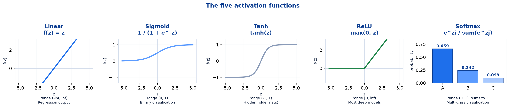
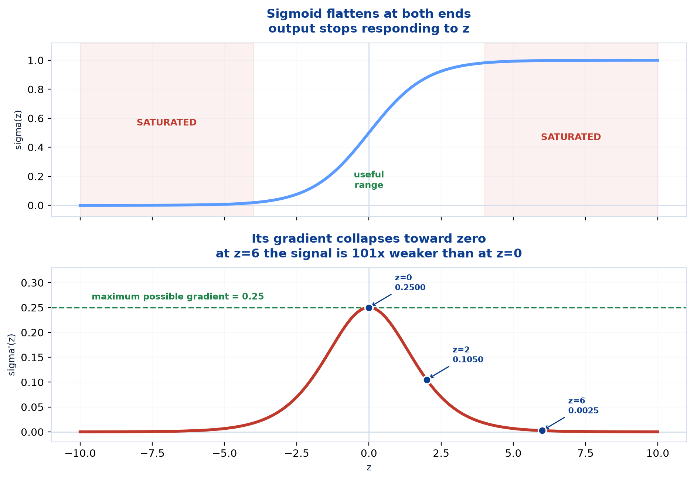
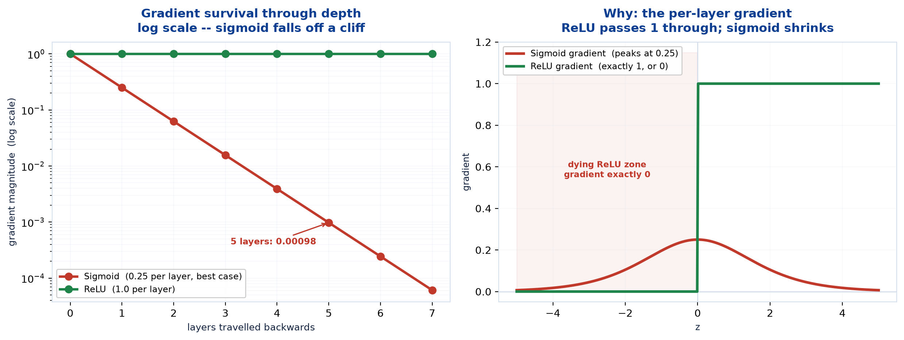
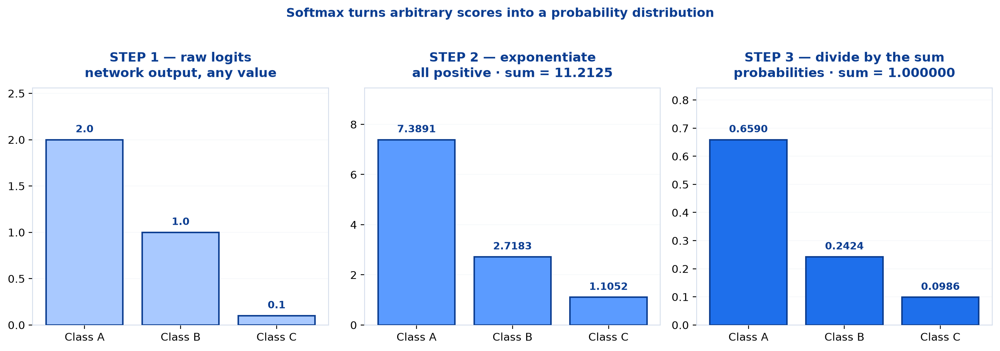
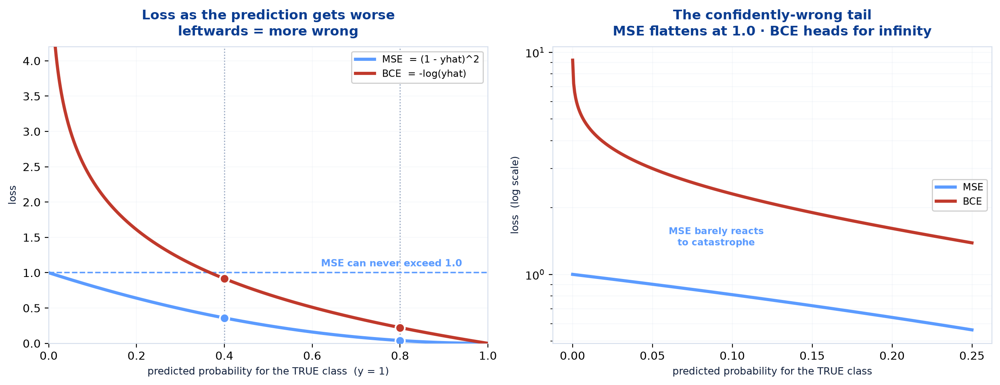
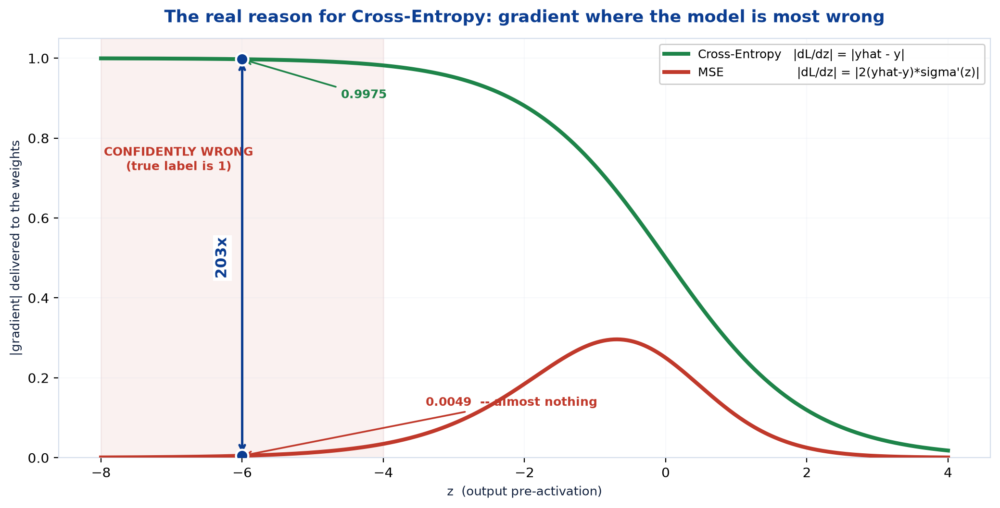

# <span style="color:#0B3D91">Activation Functions &amp; Loss Functions</span>

> Study notes on the two pieces that turn a network from a pile of matrix multiplications into
> something that can learn:
> **Activation functions** (what shape the neuron's output takes) and
> **loss functions** (how wrong the answer was).
> The previous note left two questions open — activations are mandatory, but *which one*? And the
> network was wrong, but with no way to measure *how* wrong. This note answers both.
>
> **A note on formulas:** equations are written in plain text inside code blocks rather than
> LaTeX, so they render correctly in any Markdown viewer.

---

## <span style="color:#1E6FEB">Table of Contents</span>

1. [Activation Functions — Why](#1-activation-functions--why)
2. [The Five Activation Functions](#2-the-five-activation-functions)
3. [Why ReLU Won](#3-why-relu-won)
4. [Softmax — Scores into Probabilities](#4-softmax--scores-into-probabilities)
5. [Loss Functions — Why](#5-loss-functions--why)
6. [The Three Loss Functions](#6-the-three-loss-functions)
7. [Why Cross-Entropy Beats MSE](#7-why-cross-entropy-beats-mse)

---

## <span style="color:#1E6FEB">1. Activation Functions — Why</span>

### 1.1 Overview / What is it?

> An **Activation Function** determines whether a neuron should be activated by transforming the
> weighted sum of inputs into an output signal. It introduces **non-linearity**, enabling neural
> networks to learn complex patterns.

**Why do we need activation functions?**

- Introduce **non-linearity** into neural networks
- Help learn **complex patterns and decision boundaries**
- Enable deep networks to solve real-world problems
- Improve model performance and accuracy

> **Key Takeaway** — Activation functions enable neural networks to learn non-linear and complex
> patterns, making deep learning powerful for real-world applications.

### 1.2 Why does it matter for AI?

The previous note already proved the first bullet, rather than just asserting it. Two stacked
linear layers collapse algebraically into one:

```
W2(W1x + b1) + b2  =  (W2W1)x + (W2b1 + b2)  =  W'x + b'
```

Verified numerically there: the two-layer network and its collapsed single-layer equivalent both
produced `[1.961, 2.5786]` — identical. **Without a non-linearity, depth is an expensive
illusion.**

So this topic is not asking *whether* to use an activation. It is asking **which one, and why**.

### 1.3 Key Concepts — where the activation sits

```
inputs  ->  z = Wx + b  ->  f(z)  ->  output
             ^^^^^^^^^      ^^^^
             LINEAR part    NON-LINEAR part
             (the weights)  (the activation)
```

Every neuron is half linear, half non-linear. The weighted sum can only stretch and rotate; the
activation is the only part that can **bend**. Remove it and you are left with an affine
transformation, which is exactly what the collapse proof showed.

### 1.4 Simple Example — "should this neuron fire?"

The name comes from the biological framing: the activation decides the neuron's output signal
given its accumulated input.

```
z = -3.0  ->  strongly negative evidence  ->  output near the LOW end
z =  0.0  ->  no evidence either way      ->  output in the MIDDLE
z = +3.0  ->  strongly positive evidence  ->  output near the HIGH end
```

Different activations implement "low", "middle" and "high" differently — and those differences
are the entire content of section 2.

### 1.5 How it works — two different jobs

A detail that clears up a lot of confusion: **hidden and output activations are chosen for
completely different reasons.**

| | **Hidden layers** | **Output layer** |
|---|---|---|
| **Chosen for** | Trainability — good gradients | **The task** — required output shape |
| **Freedom** | Your choice (almost always ReLU) | **Dictated** by what you are predicting |
| **Question** | *"What trains well?"* | *"What must the answer look like?"* |

A probability must lie in `(0, 1)`, so binary classification **must** end in sigmoid. A house
price can be any number, so regression **must** end in linear. There is no judgement involved.

Hidden layers have no such constraint — nothing outside the network ever sees their values — so
the only criterion is what makes training work.

### 1.6 Practical Example / Use Case

```python
model = keras.Sequential([
    layers.Dense(16, activation="relu"),      # hidden -- chosen for trainability
    layers.Dense(8,  activation="relu"),      # hidden -- same
    layers.Dense(1,  activation="sigmoid"),   # output -- dictated by the task
])
```

Reading any model definition, the pattern holds: **ReLU repeated through the middle, something
task-specific at the end.**

### 1.7 Key Takeaways

> - An **activation function** transforms the weighted sum into the neuron's output signal.
> - Its core job is to introduce **non-linearity** — without it, stacked layers **collapse**.
> - The weighted sum can stretch and rotate; **only the activation can bend**.
> - **Hidden activations are chosen for trainability**; **output activations are dictated by the
>   task**.
> - The usual pattern: **ReLU in the middle, task-specific at the end**.

---

## <span style="color:#1E6FEB">2. The Five Activation Functions</span>

### 2.1 Overview / What is it?



| Activation | Formula | Output Range | Advantages | Use Cases |
|---|---|---|---|---|
| **Linear** | `f(x) = x` | (−∞, ∞) | Simple and interpretable | **Regression output layer** |
| **Sigmoid** | `σ(x) = 1/(1+e⁻ˣ)` | (0, 1) | Produces probabilities | **Binary classification** |
| **Tanh** | `tanh(x)` | (−1, 1) | Zero-centered outputs | Hidden layers (older networks) |
| **ReLU** | `max(0, x)` | [0, ∞) | Fast and efficient | **Most deep learning models** |
| **Softmax** | `eˣⁱ / Σeˣʲ` | (0, 1), **sums to 1** | Generates class probabilities | **Multi-class classification** |

### 2.2 Why does it matter for AI?

Five functions cover essentially every network you will build. Knowing each one's **range** is
usually enough to know where it belongs — the range *is* the use case.

### 2.3 Key Concepts — actual values

Rather than reading shapes off a graph, here are the numbers:

| `z` | `sigmoid(z)` | `tanh(z)` | `relu(z)` |
|---|---|---|---|
| **−2** | 0.1192 | −0.9640 | **0** |
| **−1** | 0.2689 | −0.7616 | **0** |
| **0** | **0.5000** | **0.0000** | **0** |
| **+1** | 0.7311 | +0.7616 | 1 |
| **+2** | 0.8808 | +0.9640 | 2 |

Three things worth noticing:

- **Sigmoid never reaches 0 or 1.** It only approaches them. A sigmoid output of exactly 1.0 is
  numerically impossible, which matters when a loss function takes its logarithm.
- **Sigmoid at z = 0 gives 0.5** — the natural "no information" answer for a probability.
- **Tanh is a rescaled sigmoid**, exactly: `tanh(z) = 2σ(2z) − 1`. Same S-shape, recentred on
  zero and stretched to twice the height.

### 2.4 Simple Example — Linear is the "no-op"

Linear activation, `f(z) = z`, does nothing at all. That sounds useless, and in a hidden layer it
is — that is precisely the collapse case.

In an **output** layer it is exactly right:

```
Regression target: a house price, a temperature, a sales figure.
These can be ANY real number -- large, small, negative.
Squashing them into (0,1) with a sigmoid would make the task impossible.
```

> **Key Takeaway** — Linear activation in a *hidden* layer is a bug. In a *regression output*
> layer it is mandatory.

### 2.5 How it works — Tanh vs Sigmoid

Tanh's advantage is being **zero-centered**, and it is a real one:

```
Sigmoid output range (0, 1)   ->  ALWAYS positive
Tanh    output range (-1, 1)  ->  positive OR negative, centred on 0
```

Because sigmoid's outputs are always positive, every neuron in the next layer receives only
positive inputs — which pushes all its weight gradients to share the same sign. Updates then zigzag
instead of moving directly toward the target, and training slows.

Tanh removes that particular problem, which is why it was the preferred hidden activation for
years. But it still **saturates** at both ends exactly like sigmoid — so it merely reduced a
symptom without curing the disease. Section 3 covers the cure.

### 2.6 Practical Example / Use Case — choosing by task

| Task | Hidden layers | Output layer | Output neurons |
|---|---|---|---|
| **Regression** (house price) | ReLU | **Linear** | 1 |
| **Binary classification** (spam) | ReLU | **Sigmoid** | 1 |
| **Multi-class** (10 digits) | ReLU | **Softmax** | **10** — one per class |
| **Multi-label** (photo tags) | ReLU | **Sigmoid on each** | one per label |

That last row is the one people get wrong — see section 4.

### 2.7 Key Takeaways

> - Five activations: **Linear, Sigmoid, Tanh, ReLU, Softmax** — the range tells you the use case.
> - **Sigmoid never reaches 0 or 1**; it gives exactly **0.5** at `z = 0`.
> - **Tanh is a rescaled sigmoid**: `tanh(z) = 2σ(2z) − 1`.
> - **Linear in a hidden layer is a bug**; in a regression output layer it is required.
> - Tanh's **zero-centered** outputs avoid sigmoid's all-positive zigzag — but it still saturates.
> - **ReLU for hidden layers; the task picks the output activation.**

---

## <span style="color:#1E6FEB">3. Why ReLU Won</span>

### 3.1 Overview / What is it?

ReLU is `max(0, x)` — negative inputs become zero, positive inputs pass through untouched. It is
the simplest function in the table and it dominates modern deep learning completely.

> **Worth knowing:** the reasons ReLU beats sigmoid are not usually spelled out, but they are the
> difference between a network that trains and one that does not. This section is a supplement.

### 3.2 Why does it matter for AI?

Deep networks were considered impractical for decades. ReLU is one of the handful of changes that
made depth actually trainable — so "why ReLU" is really "why deep learning works at all".

### 3.3 Key Concepts — two reasons

**Reason 1: it is cheap.** Sigmoid needs `exp()` and a division. ReLU needs a comparison. At
billions of activations per forward pass, that difference is real.

**Reason 2: it does not saturate.** This is the important one, and it is measurable.



| `z` | `σ(z)` | `σ'(z)` — the gradient |
|---|---|---|
| **0** | 0.500000 | **0.25000000** ← the maximum possible |
| 1 | 0.731059 | 0.19661193 |
| 2 | 0.880797 | 0.10499359 |
| 4 | 0.982014 | 0.01766271 |
| **6** | 0.997527 | **0.00246651** ← **101× smaller** than at `z = 0` |
| 10 | 0.999955 | 0.00004540 ← effectively zero |

**Sigmoid's gradient peaks at 0.25 and collapses toward zero at both ends.** A neuron sitting at
`z = 6` receives a learning signal **101 times weaker** than one at `z = 0`. It has *saturated* —
confidently stuck, and barely able to change.

### 3.4 Simple Example — the vanishing gradient problem

Saturation would be survivable in one layer. The problem is that backpropagation **multiplies**
gradients together as it travels backwards.



```
Sigmoid, ABSOLUTE BEST case (every neuron at z = 0, gradient 0.25):

  1 layer  :  0.25
  2 layers :  0.0625
  3 layers :  0.015625
  5 layers :  0.00098          <- a thousand times weaker
  8 layers :  0.0000153
```

**And that is the best case.** Any neuron away from `z = 0` contributes less than 0.25, so real
networks decay faster than this.

> **The vanishing gradient problem:** gradients shrink exponentially as they travel backwards, so
> early layers receive almost no learning signal. They barely train, and the depth is wasted.

ReLU's gradient is **exactly 1** for every positive input:

```
ReLU:  1 layer: 1.0    5 layers: 1.0    50 layers: 1.0
```

Multiply 1 by itself as many times as you like and you still have 1. **The signal survives the
trip.** That single property is what made deep networks trainable.

### 3.5 How it works — the honest catch: dying ReLU

ReLU's gradient for negative inputs is **exactly 0**, not merely small. That creates a failure
mode of its own:

```
A neuron gets pushed to z < 0 for every training example
  -> output is always 0
  -> gradient is always 0
  -> weights NEVER update
  -> the neuron is DEAD, permanently
```

A dead neuron contributes nothing for the rest of training and cannot recover, because the very
mechanism that would revive it is the gradient that is zero.

**The standard fix is Leaky ReLU**, which replaces the flat zero with a small slope:

```
ReLU(z)        =  max(0, z)          gradient below zero:  0
Leaky ReLU(z)  =  max(0.01z, z)      gradient below zero:  0.01   <- small, but ALIVE
```

A gradient of 0.01 is weak, but weak is recoverable and zero is not.

### 3.6 Practical Example / Use Case — the trade-off stated plainly

| | Sigmoid / Tanh | ReLU |
|---|---|---|
| **Cost** | `exp()` and division | A comparison |
| **Gradient (active)** | ≤ 0.25 — always shrinks | **Exactly 1** — preserved |
| **Deep networks** | **Vanishing gradients** | Trains fine |
| **Failure mode** | Saturation at both ends | **Dying ReLU** (one-sided) |
| **Recoverable?** | Yes — gradient is small, not zero | **No** — gradient is exactly zero |

Both have a failure mode. ReLU's is worse when it happens but much rarer in practice, and it is
cheaply mitigated by Leaky ReLU or a sensible learning rate.

### 3.7 Key Takeaways

> - ReLU won for two reasons: it is **computationally cheap** and it **does not saturate**.
> - **Sigmoid's gradient peaks at 0.25** and is **101× smaller at `z = 6`**.
> - Backpropagation **multiplies** gradients: five sigmoid layers give `0.25⁵ = 0.00098` at best.
> - That is the **vanishing gradient problem** — early layers stop learning.
> - **ReLU's gradient is exactly 1** for positive inputs, so the signal survives any depth.
> - **Dying ReLU** is the trade-off: negative inputs give a gradient of exactly **0**, permanently.
> - **Leaky ReLU** (`max(0.01z, z)`) fixes it — a weak gradient beats no gradient.

---

## <span style="color:#1E6FEB">4. Softmax — Scores into Probabilities</span>

### 4.1 Overview / What is it?

Sigmoid answers one yes/no question. **Softmax** answers *"which of N classes?"* — and crucially,
its outputs must **sum to 1**.

```
Softmax(zi) = e^zi / sum_j( e^zj )
```

### 4.2 Why does it matter for AI?

Any classifier with more than two classes ends in softmax: digit recognition, image labelling,
language identification, next-token prediction. It is the standard multi-class output.

### 4.3 Key Concepts — the three steps



Worked with three class scores (**logits** — the raw output before activation):

```
STEP 1  logits   : [2.0,    1.0,    0.1   ]      any values, positive or negative
STEP 2  exp each : [7.3891, 2.7183, 1.1052]      e^2.0, e^1.0, e^0.1
        sum      : 11.2125
STEP 3  divide   : [0.6590, 0.2424, 0.0986]      sums to exactly 1.000000
```

**Why exponentiate first?** It does two jobs at once:

1. **Forces everything positive.** `eˣ > 0` always, and probabilities cannot be negative. This
   matters because logits often are — a logit of `−3.0` is perfectly normal.
2. **Amplifies differences.** A logit gap of 2.0 vs 1.0 becomes a probability ratio of about
   2.7 : 1. Softmax is deliberately **decisive**, not merely normalising.

> If you simply divided the logits by their sum, negative logits would produce negative
> "probabilities" and the whole thing would be meaningless. The exponential is what makes the
> normalisation valid.

### 4.4 Simple Example — the outputs compete

Softmax outputs are **not independent**. Because they are forced to sum to 1, raising one
necessarily lowers the others.

```
[0.659, 0.242, 0.099]   ->  raise class A  ->  [0.800, 0.140, 0.060]
                                                        ^^^^^^^^^^^^
                                                        both fell automatically
```

This is exactly right when the classes are **mutually exclusive** — a digit is a 7 or an 8, never
both. It is exactly wrong when they are not.

### 4.5 How it works — sigmoid vs softmax

| | **Sigmoid** | **Softmax** |
|---|---|---|
| **Question** | *"Is it X?"* | *"**Which** of N is it?"* |
| **Outputs** | **Independent** | **Compete** — forced to sum to 1 |
| **Use for** | Binary, **multi-label** | **Multi-class** (exactly one answer) |

> **Worth knowing — the multi-label trap.** A photo can contain *both* a dog *and* a beach. Those
> are not competing answers, so softmax is the wrong tool: it would force the two true labels to
> split the probability between them.
>
> **Multi-label needs a sigmoid on each output** — each one independently answering *"is this tag
> present?"*, with no requirement to sum to anything.

```
Multi-class  (one answer  ):  softmax  ->  [0.7, 0.2, 0.1]     sums to 1
Multi-label  (many answers):  sigmoid  ->  [0.9, 0.8, 0.1]     sums to 1.8 -- fine
```

### 4.6 Practical Example / Use Case

```python
# Multi-class: 10 digits, exactly one correct
layers.Dense(10, activation="softmax")     # + categorical_crossentropy

# Multi-label: 10 possible tags, any number correct
layers.Dense(10, activation="sigmoid")     # + binary_crossentropy
```

Same number of output neurons; completely different semantics. The activation and the loss must
agree with the task and with each other.

### 4.7 Key Takeaways

> - **Softmax** converts arbitrary scores (**logits**) into probabilities that **sum to 1**.
> - Three steps: **exponentiate, sum, divide** — `[2.0, 1.0, 0.1]` → `[0.659, 0.242, 0.099]`.
> - Exponentiating **forces positivity** and **amplifies differences** — softmax is decisive.
> - Softmax outputs **compete**: raising one lowers the others.
> - That is correct for **mutually exclusive** classes and wrong otherwise.
> - **Multi-label needs sigmoid per output**, not softmax.

---

## <span style="color:#1E6FEB">5. Loss Functions — Why</span>

### 5.1 Overview / What is it?

> A **Loss Function** measures the difference between the model's predicted output and the actual
> (true) output. It helps determine how well the neural network is performing.

**Why do we need loss functions?**

- Quantifies prediction errors
- **Guides the learning process**
- Helps optimize model parameters (weights and biases)
- Lower loss indicates better model performance

```
Loss Function  = Measure of Error
Goal of Training = Minimize Loss

Lower Loss → Better Predictions → Better Model Performance
```

### 5.2 Why does it matter for AI?

This is the missing piece from the previous note. That network scored **2 out of 4** — but "2 out
of 4" is not something you can do calculus on.

A loss function turns *wrongness* into a **single differentiable number**. That is the
precondition for gradient descent: you cannot descend a staircase of correct/incorrect counts,
but you can descend a smooth surface.

### 5.3 Key Concepts — loss is for the optimiser, accuracy is for you

> **Worth knowing:** the distinction between loss and accuracy causes real confusion, and the
> reason both are always reported is precise.

| | **Loss** | **Accuracy** |
|---|---|---|
| **Audience** | The **optimiser** | **Humans** |
| **Smooth?** | **Yes** — differentiable everywhere | **No** — a step function |
| **Can you descend it?** | **Yes** | **No** — gradient is 0 or undefined |
| **Sensitive to confidence?** | **Yes** | **No** — 0.51 and 0.99 both count as "correct" |

Consider a prediction improving from 0.51 to 0.99 on a true-1 example:

```
Accuracy:  correct -> correct          NO CHANGE. Gradient zero. Nothing to learn from.
Loss    :  0.673   -> 0.010            Large improvement. A clear direction to move in.
```

**Accuracy cannot be optimised directly because it is flat almost everywhere.** Loss is the
smooth stand-in that makes learning possible — which is also why loss can worsen while accuracy
holds steady, a genuinely useful early warning sign.

### 5.4 Simple Example — where loss sits in training

```
1. Forward propagation  ->  prediction  ŷ
2. LOSS FUNCTION        ->  how wrong is ŷ, as ONE number
3. Backpropagation      ->  how much did each weight contribute to that number
4. Optimizer            ->  adjust the weights
   repeat
```

Step 2 is the hinge. Without it there is no number for step 3 to differentiate, and training
cannot start.

### 5.5 How it works — loss vs cost

A small terminology note, since both terms appear constantly:

```
Loss  ->  the error for ONE training example
Cost  ->  the AVERAGE loss over the whole batch or dataset
```

The `(1/n) Σ` in the MSE formula is what turns loss into cost. In practice the words are used
interchangeably and almost nobody objects.

### 5.6 Practical Example / Use Case

```python
model.compile(
    optimizer="adam",
    loss="binary_crossentropy",   # what the optimiser minimises
    metrics=["accuracy"],         # what YOU read
)
```

That line makes the distinction concrete: **`loss` is what gets optimised, `metrics` is what gets
reported.** They are separate arguments because they serve separate purposes.

### 5.7 Key Takeaways

> - A **loss function** measures the gap between prediction and truth as **one number**.
> - It **quantifies error, guides learning, and is minimised during training**.
> - Its essential property is being **differentiable** — that is what makes gradient descent
>   possible.
> - **Accuracy cannot be optimised**: it is a step function with zero gradient almost everywhere.
> - **Loss is for the optimiser; accuracy is for humans** — hence `loss=` and `metrics=`.
> - **Loss** = one example; **cost** = the average over many.

---

## <span style="color:#1E6FEB">6. The Three Loss Functions</span>

### 6.1 Overview / What is it?

**Mean Squared Error (MSE)** — used for **Regression Problems**

```
MSE = (1/n) * sum( (yi - yhat_i)^2 )
```

*Examples: House Price Prediction, Sales Forecasting*

**Binary Cross-Entropy** — used for **Binary Classification**

```
L = -[ y*log(yhat) + (1-y)*log(1-yhat) ]
```

*Examples: Spam Detection, Fraud Detection*

**Categorical Cross-Entropy** — used for **Multi-Class Classification**

```
L = -sum( yi * log(yhat_i) )
```

*Examples: Image Classification, Language Identification*

### 6.2 Why does it matter for AI?

Three losses cover regression, binary classification and multi-class classification — which is
nearly every supervised problem. Each pairs with a specific output activation, and the pairings
are not arbitrary (section 7 explains why).

### 6.3 Key Concepts — MSE squares the error

```
MSE = (1/n) * sum( (yi - yhat_i)^2 )
```

The squaring does two jobs:

1. **Removes the sign.** Being 5 too high and 5 too low are equally wrong; without squaring they
   would cancel out to zero.
2. **Punishes large errors disproportionately.** An error of 10 costs **100**, while ten errors of
   1 cost **10** in total. MSE strongly prefers many small errors to one large one.

```
errors [1, 1, 1, 1, 1]  ->  MSE = 1.0
errors [0, 0, 0, 0, 5]  ->  MSE = 5.0     same total error, 5x the loss
```

> That sensitivity is usually desirable, but it does make MSE **sensitive to outliers** — one
> badly mislabelled row can dominate the whole cost.

### 6.4 Simple Example — Binary Cross-Entropy is a switch

The BCE formula looks fussy, but one of its two terms always vanishes because `y` is 0 or 1:

```
y = 1  ->  L = -[ 1*log(yhat) + 0*log(1-yhat) ]  =  -log(yhat)
y = 0  ->  L = -[ 0*log(yhat) + 1*log(1-yhat) ]  =  -log(1-yhat)
```

So BCE is really just: **`−log(the probability you assigned to the correct answer)`**.

```
You said 0.99 and were right  ->  -log(0.99) = 0.0101    tiny loss
You said 0.50 (a coin flip)   ->  -log(0.50) = 0.6931    moderate loss
You said 0.01 and were wrong  ->  -log(0.01) = 4.6052    huge loss
```

**Confidence is rewarded when correct and punished when wrong.** That is the whole behaviour of
cross-entropy in one line.

### 6.5 How it works — Categorical CE is the same idea

With one-hot labels, every term in the sum is multiplied by zero except the true class:

```
true class = 0  ->  y = [1, 0, 0]
L = -( 1*log(p0) + 0*log(p1) + 0*log(p2) )  =  -log(p0)
```

Measured on three predictions where **class 0 is correct**:

| Situation | Probabilities | Loss |
|---|---|---|
| **Confident and right** | `[0.7, 0.2, 0.1]` | **0.3567** |
| **Unsure** | `[0.4, 0.35, 0.25]` | 0.9163 |
| **Confident and wrong** | `[0.1, 0.2, 0.7]` | **2.3026** |

Only the probability given to the **true** class matters. How the remaining probability is
distributed among the wrong classes has no effect on the loss at all.

### 6.6 Practical Example / Use Case — the matching pairs

| Task | Output activation | Loss function |
|---|---|---|
| **Regression** | **Linear** | **MSE** |
| **Binary classification** | **Sigmoid** | **Binary Cross-Entropy** |
| **Multi-class classification** | **Softmax** | **Categorical Cross-Entropy** |

```python
model.compile(optimizer="adam", loss="mse")                        # regression
model.compile(optimizer="adam", loss="binary_crossentropy")        # binary
model.compile(optimizer="adam", loss="categorical_crossentropy")   # multi-class
```

> **A practical note:** `categorical_crossentropy` expects **one-hot** labels (`[0,1,0]`), while
> `sparse_categorical_crossentropy` takes plain integers (`1`). Same mathematics, different label
> format — and mismatching them is a common source of shape errors.

### 6.7 Key Takeaways

> - **MSE** for regression; **Binary Cross-Entropy** for binary; **Categorical Cross-Entropy** for
>   multi-class.
> - **MSE squares errors** — removes sign, punishes large errors disproportionately, and is
>   therefore **outlier-sensitive**.
> - **BCE is a switch**: one term always vanishes, leaving `−log(probability of the right answer)`.
> - Cross-entropy **rewards confidence when correct and punishes it when wrong**.
> - Categorical CE with one-hot labels **only looks at the true class's probability**.
> - Measured: `[0.7, 0.2, 0.1]` → 0.3567, `[0.1, 0.2, 0.7]` → **2.3026**.
> - Use **`sparse_categorical_crossentropy`** for integer labels instead of one-hot.

---

## <span style="color:#1E6FEB">7. Why Cross-Entropy Beats MSE</span>

### 7.1 Overview / What is it?

MSE is a perfectly valid way to measure error on a classification problem — it just performs
badly. This section works out why, and corrects a claim that is often made carelessly.

**The worked example.** An email **is** spam, so `y = 1`. The model predicts `ŷ = 0.8`:

```
MSE = (y - yhat)^2 = (1 - 0.8)^2  = 0.04
BCE = -log(yhat)   = -log(0.8)    = 0.2231
```

Now suppose the model instead predicts `ŷ = 0.4` for the same spam email:

```
MSE = (1 - 0.4)^2  = 0.36
BCE = -log(0.4)    = 0.9163
```

### 7.2 Why does it matter for AI?

This pairing — sigmoid with cross-entropy, softmax with cross-entropy — is universal. Knowing
*why* stops it being a rule to memorise and makes it a property you can reason about.

### 7.3 Key Concepts — an honest correction

The usual telling of the example above is: *"MSE only rises to 0.36, but Cross-Entropy jumps to
about 0.92, penalising the confident wrong turn far more sharply."*

The **absolute** numbers do look that way. But measured as a **multiplier**, the opposite is true:

| | at `ŷ = 0.8` | at `ŷ = 0.4` | **Growth factor** |
|---|---|---|---|
| **MSE** | 0.0400 | 0.3600 | **9.00×** |
| **BCE** | 0.2231 | 0.9163 | **4.11×** |

**MSE actually grew more, proportionally.** Comparing the raw values of two different loss
functions is apples to oranges — they are on different scales, and neither scale is privileged.

> So the headline comparison, taken at face value, **does not establish what it is usually used to
> establish.** The real case for cross-entropy is stronger than that, and rests on two properties
> that *are* scale-free.

### 7.4 Simple Example — argument A: MSE is bounded



Push the prediction further into catastrophe (`y = 1` throughout):

| `ŷ` | MSE | BCE |
|---|---|---|
| 0.5 | 0.2500 | 0.6931 |
| 0.1 | 0.8100 | 2.3026 |
| 0.01 | 0.9801 | 4.6052 |
| 0.001 | 0.9980 | 6.9078 |
| 0.0001 | **0.9998** | **9.2103** |

**MSE can never exceed 1.0.** Being 99.99% confident in the wrong answer costs 0.9998 — barely
more than the 0.81 for being merely wrong. MSE effectively stops caring once you are wrong enough.

**Cross-entropy is unbounded** and heads for infinity. It genuinely cannot tolerate a confident
error, and that is the behaviour you want from a classifier.

### 7.5 How it works — argument B: the gradient

This is the decisive argument. **What drives learning is not the loss value but its gradient.**



With a sigmoid output and `y = 1`:

| `z` | `ŷ` | MSE gradient | BCE gradient |
|---|---|---|---|
| **−6** | 0.0025 | **−0.004921** | **−0.9975** |
| −4 | 0.0180 | −0.034690 | −0.9820 |
| −2 | 0.1192 | −0.184956 | −0.8808 |
| 0 | 0.5000 | −0.250000 | −0.5000 |

Look at `z = −6`, where the model is **confidently, catastrophically wrong**. MSE delivers a
gradient of `−0.0049` — essentially nothing. *The model barely learns from its worst mistake.*

Cross-entropy delivers `−0.9975` — **203× stronger**.

**Why?** Differentiating MSE through a sigmoid leaves a `σ'(z)` factor:

```
dMSE/dz = 2(yhat - y) * sigma'(z)
                        ^^^^^^^^^
                        collapses to ~0 exactly when the model is most wrong
```

That is section 3's saturation problem, now sabotaging the loss. Cross-entropy's logarithm is
precisely the shape whose derivative **cancels** the `σ'`, leaving:

```
dBCE/dz = yhat - y          just the error. No saturation factor. Clean.
```

> **Cross-entropy is not the standard because it produces bigger numbers. It is the standard
> because it produces bigger *gradients* exactly where the model is most wrong** — it is
> mathematically constructed to cancel sigmoid's saturation.

That cancellation is also why the pairings in section 6 are fixed. Sigmoid + BCE and softmax +
categorical CE both give `ŷ − y`; mixing and matching loses it.

### 7.6 Practical Example / Use Case — what this looks like in training

A model that starts badly wrong on some examples:

```
With MSE  :  those examples produce near-zero gradients
             -> the model is stuck; loss plateaus early
             -> training appears to "not work" for no obvious reason

With BCE  :  those examples produce near-maximal gradients
             -> the worst mistakes are corrected FIRST
             -> loss falls quickly from the start
```

This is a genuinely common bug. Using `loss="mse"` on a classification problem does not raise an
error — it trains, slowly and badly, and the cause is not obvious from the output.

### 7.7 Key Takeaways

> - Spam example (`y = 1`): `ŷ` from 0.8 → 0.4 gives **MSE 0.04 → 0.36** and **BCE 0.223 → 0.916**.
> - **Correction:** as a *multiplier* MSE grew **more** (9.00× vs 4.11×) — the raw-value comparison
>   does not prove what it is usually used to prove.
> - **Argument A — MSE is bounded at 1.0**; cross-entropy is **unbounded**. MSE stops caring about
>   catastrophic errors.
> - **Argument B — the gradient.** At `z = −6`, BCE's gradient is **203× stronger** than MSE's.
> - MSE through a sigmoid carries a **`σ'(z)` factor** that vanishes exactly when the model is most
>   wrong.
> - Cross-entropy's log **cancels that factor**, leaving the clean **`∂L/∂z = ŷ − y`**.
> - That cancellation is **why the activation/loss pairings are fixed** — mixing them loses it.

---

## <span style="color:#1E6FEB">Summary — Activations &amp; Losses at a Glance</span>

**The five activations:**

| Activation | Range | Where |
|---|---|---|
| **Linear** | (−∞, ∞) | Regression output |
| **Sigmoid** | (0, 1) | Binary output, multi-label output |
| **Tanh** | (−1, 1) | Hidden layers (older networks) |
| **ReLU** | [0, ∞) | **Hidden layers — the default** |
| **Softmax** | (0, 1), sums to 1 | Multi-class output |

**Why ReLU:**

```
Sigmoid gradient:  max 0.25  ->  5 layers: 0.25^5 = 0.00098   VANISHES
ReLU    gradient:  exactly 1 ->  5 layers: 1^5     = 1.0       SURVIVES
```

**The three losses, and their required partners:**

| Task | Output activation | Loss | Gradient |
|---|---|---|---|
| Regression | Linear | **MSE** | `ŷ − y` |
| Binary classification | Sigmoid | **Binary Cross-Entropy** | `ŷ − y` |
| Multi-class | Softmax | **Categorical Cross-Entropy** | `ŷ − y` |

Every correct pairing produces the same clean `ŷ − y`. That is the point of the pairing.

**Why cross-entropy, honestly:**

| Claim | Verdict |
|---|---|
| "CE punishes confident errors more" (raw values) | **Misleading** — MSE grew 9.00× vs CE's 4.11× |
| **MSE is bounded at 1.0; CE is unbounded** | **True and important** |
| **CE's gradient is 203× stronger at `z = −6`** | **True — the decisive reason** |

**The one-sentence version:** activations decide what shape a neuron's output takes — ReLU in the
middle because its gradient is 1, something task-specific at the end — and the loss turns the
resulting error into one differentiable number, with cross-entropy chosen because its gradient
stays strong exactly where the model is most wrong.

**Where this leads:** we can now make a prediction and measure precisely how wrong it is. What is
still missing is the mechanism that turns that measurement into **better weights** — how the error
at the output is attributed back to every weight in the network, and how those weights actually
change. That is **backpropagation and gradient descent**.

---

> **Navigation:** ← Previous: [02 — Artificial Neural Networks &amp; Forward Propagation](02_Deep_Learning_ANN_And_Forward_Propagation.md) · Next → 04 — Backpropagation &amp; Gradient Descent
>
> **Related:** [01 — Introduction to Deep Learning &amp; the Artificial Neuron](01_Deep_Learning_Introduction_And_Artificial_Neuron.md)
> §6 (the perceptron's step function and why smooth activations were needed), and
> [Model Evaluation Metrics](../../05_machine_learning_01/notes/03_Machine_Learning_Model_Evaluation_Metrics.md)
> (accuracy and the metrics that loss is *not*).
