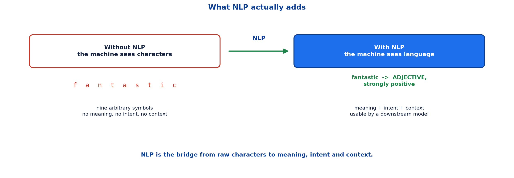
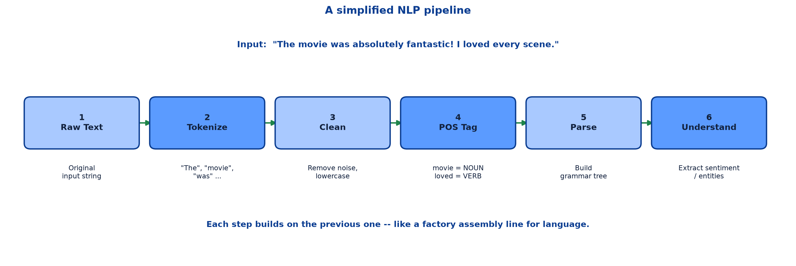

# <span style="color:#0B3D91">Introduction to NLP &amp; the NLP Pipeline</span>

> Study notes on the starting point of Natural Language Processing:
> **what NLP is** → **where it is already used** → **the simplified NLP pipeline** →
> **why each stage exists** → **how the pipeline maps the rest of the module**.
>
> **A note on formulas:** equations are written in plain text inside code blocks rather than
> LaTeX, so they render correctly in any Markdown viewer.

---

## <span style="color:#1E6FEB">Table of Contents</span>

1. [What is NLP?](#1-what-is-nlp)
2. [Where NLP Is Already Used](#2-where-nlp-is-already-used)
3. [A Simplified NLP Pipeline](#3-a-simplified-nlp-pipeline)
4. [Walking a Sentence Through the Pipeline](#4-walking-a-sentence-through-the-pipeline)
5. [Why the Pipeline Framing Matters](#5-why-the-pipeline-framing-matters)
6. [The Pipeline in Code](#6-the-pipeline-in-code)

---

## <span style="color:#1E6FEB">1. What is NLP?</span>

### 1.1 Overview / What is it?

**NLP (Natural Language Processing)** is a branch of AI that helps machines **read, understand, and
generate text** — just like a human would.

The problem it solves is easy to state and surprisingly hard to fix: a computer does not see words.
It sees a sequence of characters. To a machine, `"fantastic"` is nine arbitrary symbols carrying no
more meaning than `"qwertyuio"`.



> **Key insight:** Computers see text as raw characters — NLP gives them the ability to understand
> **meaning, intent, and context**.

### 1.2 Why does it matter for AI?

Most of the world's information is unstructured text: reviews, emails, tickets, chat logs, contracts,
medical notes. None of it arrives as a tidy numeric table. Without NLP, that entire category of data
is invisible to a model.

NLP is also the gateway to the models everyone is currently excited about. Large language models are
not a separate discipline — they are the far end of this same pipeline.

### 1.3 Key Concepts

The three things NLP adds are genuinely three different problems, and it helps to keep them apart:

| Capability | The question it answers | Example |
|---|---|---|
| **Meaning** | What do these words denote? | Is "bank" a riverbank or a financial institution? |
| **Intent** | What does the speaker actually want? | "Can you pass the salt?" is a request, not a yes/no question |
| **Context** | What surrounds this that changes it? | "It was *sick*" — praise or complaint? |

A system can be good at one and hopeless at the others. Recognising which one your task needs is
half the design work.

### 1.4 Simple Example

```text
Raw characters the machine receives:
  T h e   m o v i e   w a s   f a n t a s t i c

What NLP is asked to recover:
  meaning  -> "fantastic" is a strongly positive quality word
  intent   -> the writer is recommending the movie
  context  -> this is a review, not a plot description
```

### 1.5 How it works

NLP does not leap from characters to understanding in one step. It applies a **sequence of
transformations**, each one adding a little more structure than the last. That sequence is the
pipeline, covered in section 3.

### 1.6 Practical Example / Use Case

A retailer with 50,000 product reviews wants to know which products customers complain about. No
human is reading 50,000 reviews. NLP converts each review into structure — sentiment, mentioned
product features, entities — which then becomes an ordinary, sortable table.

### 1.7 Key Takeaways

> - **NLP** is the branch of AI that lets machines read, understand and generate human language.
> - Computers see only raw characters; NLP adds **meaning, intent and context**.
> - Most real-world data is unstructured text, so NLP unlocks an enormous data category.
> - Understanding is built through a sequence of transformations, not a single leap.

---

## <span style="color:#1E6FEB">2. Where NLP Is Already Used</span>

### 2.1 Overview / What is it?

NLP is already infrastructure rather than a research curiosity. Four everyday systems make the point:

| Application | What the NLP does |
|---|---|
| **Google Search** | Understands your query even with typos |
| **Chatbots** | ChatGPT, Claude, Gemini etc. understand & respond |
| **Translation** | Google Translate converts language instantly |
| **Spam Filters** | Gmail detects and blocks spam emails |

### 2.2 Why does it matter for AI?

These four examples deliberately span the whole difficulty range. A spam filter can work respectably
using fairly shallow techniques — largely *which words appear*. A conversational assistant needs the
deep end of the stack: context, intent, memory, generation.

Same field, wildly different depth. That is precisely why NLP is organised as a pipeline of stages
rather than a single model: different problems need different amounts of the pipeline.

### 2.3 Key Concepts

```text
Shallow NLP  -> which words appear        -> spam filtering, topic tagging
Medium NLP   -> word roles and structure  -> search, information extraction
Deep NLP     -> meaning, intent, context  -> chatbots, translation, summarisation
```

### 2.4 Simple Example

A spam filter can flag an email containing "free money guaranteed prize" without parsing a single
sentence. A translator must handle grammar, gender, word order and idiom to turn that same sentence
into fluent Hindi. Both are NLP.

### 2.5 How it works

Shallow tasks stop early in the pipeline. Deep tasks run the whole thing and then add a large
learned model on top. Nothing is wasted — the later stages simply consume the output of the earlier
ones.

### 2.6 Practical Example / Use Case

When scoping an NLP project, first ask *how deep does this actually need to go?* A keyword-and-counts
approach that ships this week often beats a transformer that ships next quarter — especially when the
task is shallow by nature.

### 2.7 Key Takeaways

> - NLP already runs in search, chatbots, translation and spam filtering.
> - These tasks vary enormously in required depth.
> - Shallow tasks need only the early pipeline stages; deep tasks need all of them.
> - Choose the shallowest approach that solves the problem.

---

## <span style="color:#1E6FEB">3. A Simplified NLP Pipeline</span>

### 3.1 Overview / What is it?

**Text goes through multiple stages before a machine can understand it.** Starting from the input
sentence:

```text
"The movie was absolutely fantastic! I loved every scene."
```

it flows through six stages:



```text
1. Raw Text    ->  Original input string
2. Tokenize    ->  "The", "movie", "was", ...
3. Clean       ->  Remove noise, lowercase
4. POS Tag     ->  movie = NOUN, loved = VERB
5. Parse       ->  Build grammar tree
6. Understand  ->  Extract sentiment / entities
```

> **Each step builds on the previous one — like a factory assembly line for language.**

### 3.2 Why does it matter for AI?

The assembly-line framing is the single most useful mental model in this module. It tells you where
any NLP technique fits, what it depends on, and what depends on it. Every remaining topic slots into
one of these six boxes.

### 3.3 Key Concepts

| Stage | What happens | Why you cannot skip it |
|---|---|---|
| **1. Raw Text** | The original string, warts and all | Everything downstream is a transformation of this |
| **2. Tokenize** | Split the string into units (words / subwords) | You cannot analyse "words" until you decide where words begin and end |
| **3. Clean** | Lowercase, strip punctuation, remove noise | `"Fantastic!"`, `"fantastic"` and `"FANTASTIC"` should not be three different things |
| **4. POS Tag** | Label each token's grammatical role | Knowing `loved` is a VERB tells you who is doing what |
| **5. Parse** | Build the grammatical structure | Reveals *relationships* — what modifies what |
| **6. Understand** | Extract sentiment, entities, meaning | The actual business outcome you wanted |

### 3.4 Simple Example

```text
Stage 2 output:  ["The", "movie", "was", "absolutely", "fantastic", "!"]
Stage 3 output:  ["the", "movie", "was", "absolutely", "fantastic"]
Stage 4 output:  the/DET  movie/NOUN  was/VERB  absolutely/ADV  fantastic/ADJ
```

Each row is strictly more structured than the row above it.

### 3.5 How it works

The pipeline is a chain of functions. Each stage takes the previous stage's output and returns
something slightly more structured:

```text
string -> list of tokens -> cleaned tokens -> tagged tokens -> parse tree -> extracted meaning
```

Notice the data type changes at nearly every step. That is the tell-tale sign of genuine
transformation rather than cosmetic tidying.

### 3.6 Practical Example / Use Case

Most NLP libraries expose the pipeline as a single call, but the stages are still running inside.
Knowing they exist is what lets you debug a bad result — you can inspect the output of each stage
instead of shrugging at the final number.

### 3.7 Key Takeaways

> - Text passes through: **Raw Text → Tokenize → Clean → POS Tag → Parse → Understand**.
> - Each stage consumes the previous stage's output and adds structure.
> - The pipeline is a factory assembly line for language.
> - This diagram is the map for every remaining topic in the module.

---

## <span style="color:#1E6FEB">4. Walking a Sentence Through the Pipeline</span>

### 4.1 Overview / What is it?

Following one sentence all the way through makes the abstract stages concrete.

### 4.2 Why does it matter for AI?

Seeing the intermediate outputs is the difference between "I know the six stage names" and "I know
what each stage actually produces." Only the second one is useful when something breaks.

### 4.3 Key Concepts — the full trace

```text
Input:      "The movie was absolutely fantastic! I loved every scene."

Tokenize:   ["The", "movie", "was", "absolutely", "fantastic", "!",
             "I", "loved", "every", "scene", "."]

Clean:      ["the", "movie", "was", "absolutely", "fantastic",
             "i", "loved", "every", "scene"]

POS Tag:    the/DET  movie/NOUN  was/VERB  absolutely/ADV
            fantastic/ADJ  i/PRON  loved/VERB  every/DET  scene/NOUN

Parse:      fantastic  <- modified by -> absolutely
            loved      <- subject -> i

Understand: sentiment = POSITIVE
            topic     = movie review
```

### 4.4 Simple Example

The interesting detail sits at stage 4. By then we already know `fantastic` is an **adjective** and
`absolutely` is an **adverb intensifying it**. That is a strong positive-sentiment signal obtained
*before* any machine learning model is involved.

Good preprocessing does real work. It is not just chores before the exciting part.

### 4.5 How it works

Each stage narrows ambiguity:

```text
Stage 2 decides:  where are the word boundaries?
Stage 3 decides:  which characters are signal and which are noise?
Stage 4 decides:  what grammatical job does each word do?
Stage 5 decides:  which words relate to which other words?
Stage 6 decides:  what does the whole thing mean?
```

### 4.6 Practical Example / Use Case

When a sentiment model gives a baffling answer, walk the input back through these stages. More often
than not the fault is at stage 2 or 3 — a mangled token or an over-aggressive cleaning rule — not in
the model everyone immediately blames.

### 4.7 Key Takeaways

> - Tracing one sentence end to end makes the six stages concrete.
> - Each stage narrows a specific kind of ambiguity.
> - Useful signal appears early — POS tags alone already hint at sentiment.
> - Debugging means inspecting intermediate stage outputs, not just the final prediction.

---

## <span style="color:#1E6FEB">5. Why the Pipeline Framing Matters</span>

### 5.1 Overview / What is it?

Three practical payoffs follow from thinking in pipeline terms.

### 5.2 Why does it matter for AI?

**Errors compound downstream.** If tokenization splits `"don't"` into `["do", "n't"]` in training but
`["don", "'", "t"]` at inference, your POS tagger sees different input and your sentiment model sees
different features. Garbage at stage 2 is still garbage at stage 6 — just far harder to trace.

**You rarely need all six stages.** A spam filter might stop after stage 3. A grammar checker leans
hard on stages 4 and 5. Knowing the pipeline lets you build the cheapest stack that solves the
problem.

**It is a map for the rest of the module.** Stages 2–3 are text preprocessing. Stages 4–5 are the
levels of language analysis. Stage 6 is where representation, embeddings and transformers live.

### 5.3 Key Concepts

```text
Stages 2-3  ->  Text preprocessing
Stages 4-5  ->  Levels of language analysis (lexical, syntactic, semantic, pragmatic)
Stage  6    ->  Text representation, embeddings, transformers
```

### 5.4 Simple Example

```text
Task: flag spam emails          -> stages 1-3 may be enough
Task: extract who-did-what      -> needs stages 4-5
Task: summarise a long document -> needs the full pipeline plus a large model
```

### 5.5 How it works

Because the stages are ordered, cost grows as you go right. Each additional stage adds computation,
dependencies and places to get things wrong. Stopping early is a legitimate engineering decision, not
a shortcut.

### 5.6 Practical Example / Use Case

A support-ticket router only needs to know the category. Tokenize, clean, count informative words,
classify. Adding dependency parsing would add latency and complexity for no measurable accuracy gain.
Build what the task needs and nothing more.

### 5.7 Key Takeaways

> - Early errors propagate silently through every later stage.
> - Not every task needs all six stages — stop as early as the task allows.
> - Cost and complexity grow left to right along the pipeline.
> - The pipeline doubles as the syllabus map for this module.

---

## <span style="color:#1E6FEB">6. The Pipeline in Code</span>

### 6.1 Overview / What is it?

Modern libraries wrap the pipeline behind a single call. The stages are still in there.

### 6.2 Why does it matter for AI?

Convenience hides the pipeline; it does not remove it. Knowing what the one-liner is doing is what
separates using a library from understanding it.

### 6.3 Key Concepts

```python
import spacy

nlp = spacy.load("en_core_web_sm")
doc = nlp("The movie was absolutely fantastic! I loved every scene.")

for token in doc:
    print(token.text, token.pos_, token.lemma_)
```

That single `nlp(...)` call runs tokenization, tagging and parsing in sequence, then hands back a
document object carrying every intermediate result.

### 6.4 Simple Example

```text
The          DET    the
movie        NOUN   movie
was          AUX    be
absolutely   ADV    absolutely
fantastic    ADJ    fantastic
!            PUNCT  !
```

Three pipeline stages' worth of output, from one loop.

### 6.5 How it works

The library holds an ordered list of components. Each component receives the document, adds its own
annotations, and passes it along — the assembly line, implemented literally.

```text
nlp.pipe_names  ->  ['tok2vec', 'tagger', 'parser', 'ner', 'lemmatizer', ...]
```

### 6.6 Practical Example / Use Case

Components you do not need can be switched off for speed:

```python
nlp = spacy.load("en_core_web_sm", disable=["parser", "ner"])
```

This is section 5's "stop as early as the task allows," expressed in one argument.

### 6.7 Key Takeaways

> - Libraries expose the pipeline as a single call, but the stages still run in order.
> - One pass yields tokens, POS tags and lemmas together.
> - Unneeded components can be disabled for speed.
> - Understanding the stages is what makes the convenience safe to rely on.

---

## <span style="color:#1E6FEB">Summary — NLP &amp; the Pipeline at a Glance</span>

```text
Raw Text -> Tokenize -> Clean -> POS Tag -> Parse -> Understand
```

| Term | Meaning |
|---|---|
| NLP | Branch of AI that lets machines read, understand and generate language |
| Meaning / Intent / Context | The three things NLP adds on top of raw characters |
| Pipeline | Ordered sequence of transformations applied to text |
| Token | A single unit of text produced by splitting the input |
| POS tag | Label for a word's grammatical role (NOUN, VERB, ADJ ...) |
| Parse | The grammatical structure linking words together |

**The one-sentence version:** NLP turns raw characters into meaning, intent and context by passing
text through an assembly line of stages — tokenize, clean, tag, parse, understand — where each stage
adds a little more structure than the one before it.

**Where this leads:** the next note zooms into stages 4 and 5, examining the four levels of language
analysis — lexical, syntactic, semantic and pragmatic — that turn tokens into genuine understanding.

---

> **Navigation:** Next → 02 — Levels of Language Analysis
