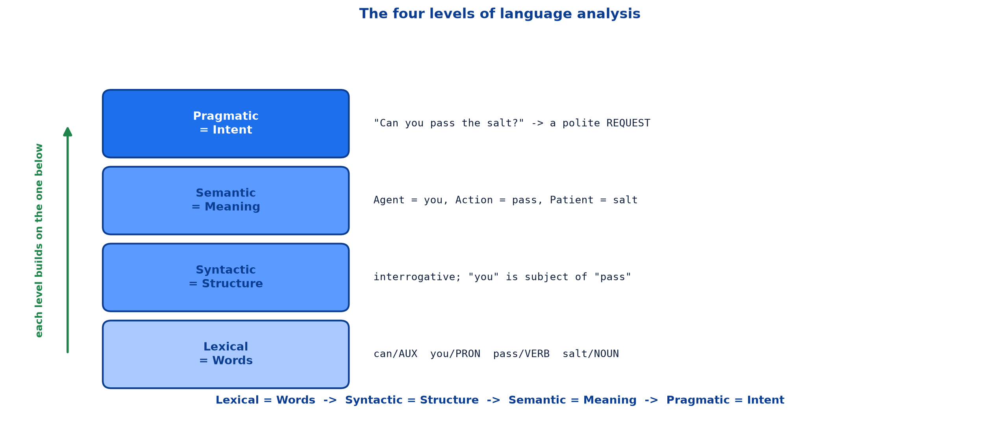
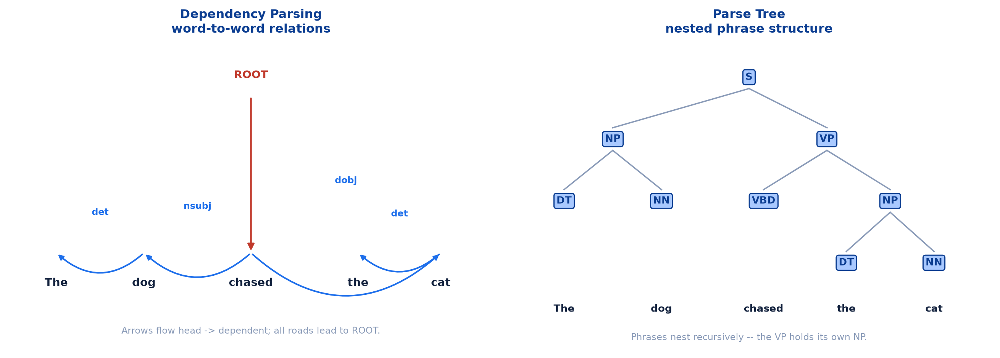
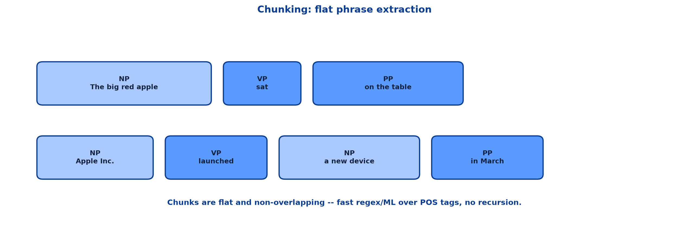

# <span style="color:#0B3D91">Levels of Language Analysis</span>

> Study notes on how a machine works its way up from words to intent:
> **lexical analysis** → **syntactic analysis** → **dependency parsing, parse trees & chunking** →
> **semantic analysis** → **pragmatic analysis** → **the four levels working together**.
>
> **A note on formulas:** equations are written in plain text inside code blocks rather than
> LaTeX, so they render correctly in any Markdown viewer.

---

## <span style="color:#1E6FEB">Table of Contents</span>

1. [The Four Levels](#1-the-four-levels)
2. [Lexical Analysis](#2-lexical-analysis)
3. [Syntactic Analysis](#3-syntactic-analysis)
4. [Dependency Parsing &amp; Parse Trees](#4-dependency-parsing--parse-trees)
5. [Chunking &amp; Phrase Extraction](#5-chunking--phrase-extraction)
6. [Semantic Analysis](#6-semantic-analysis)
7. [Pragmatic Analysis](#7-pragmatic-analysis)
8. [The Four Levels Working Together](#8-the-four-levels-working-together)

---

## <span style="color:#1E6FEB">1. The Four Levels</span>

### 1.1 Overview / What is it?

Understanding language is not one problem. It is four, stacked:

```text
Lexical = Words  ->  Syntactic = Structure  ->  Semantic = Meaning  ->  Pragmatic = Intent
```



This is the inside of stages 4 and 5 of the NLP pipeline, opened up.

### 1.2 Why does it matter for AI?

NLP goes beyond grammar — it must understand what words **mean** (semantics) and what speakers
**intend** (pragmatics). These two layers are essential for chatbots, sentiment analysis, machine
translation, and dialogue systems.

Knowing which level your problem lives at tells you which techniques are even relevant. A grammar
checker is a syntactic problem. A sarcasm detector is a pragmatic one. Reaching for the wrong level
wastes effort.

### 1.3 Key Concepts

| Level | Question it answers | Typical tasks |
|---|---|---|
| **Lexical** | What are the words and what form are they in? | POS tagging, morphology |
| **Syntactic** | How do the words combine? | Dependency parsing, parse trees, chunking |
| **Semantic** | What does it mean? | Word sense disambiguation, semantic roles |
| **Pragmatic** | What does the speaker actually intend? | Sarcasm, implicature, speech acts |

### 1.4 Simple Example

```text
"Can you pass the salt?"

Lexical    ->  can/AUX  you/PRON  pass/VERB  the/DET  salt/NOUN
Syntactic  ->  interrogative structure; "you" is the subject of "pass"
Semantic   ->  Agent = you, Action = pass, Patient = salt
Pragmatic  ->  a polite REQUEST, not a question about ability
```

Every layer is correct. Only the last one gets you the salt.

### 1.5 How it works

Each level consumes the output of the level below it. You cannot parse grammar until you know each
word's part of speech; you cannot assign semantic roles until you know the grammatical structure.
The dependency runs strictly bottom-up.

### 1.6 Practical Example / Use Case

Difficulty rises sharply as you climb. Lexical analysis is close to solved. Pragmatics is still
genuinely hard — sarcasm detection remains an open problem, because the deciding signal often lives
outside the sentence entirely.

### 1.7 Key Takeaways

> - Four levels: **Lexical = Words → Syntactic = Structure → Semantic = Meaning → Pragmatic = Intent**.
> - Each level consumes the output of the level below it.
> - Semantics and pragmatics are what make chatbots and sentiment analysis possible.
> - Difficulty increases sharply as you move up the stack.

---

## <span style="color:#1E6FEB">2. Lexical Analysis</span>

### 2.1 Overview / What is it?

**"What are the words and what form are they in?"** The focus is on tokenization, morphology, and
word-level processing. Two tasks do the heavy lifting:

- **POS Tagging** labels each word with its grammatical role: Noun, Verb, Adjective, Adverb, etc.
- **Morphology** studies word forms: `'run' -> runs, running, ran`

### 2.2 Why does it matter for AI?

This is the first layer that adds real linguistic structure. Everything above it depends on getting
these labels right — a mis-tagged verb corrupts the parse, which corrupts the semantic roles, which
corrupts the final answer.

### 2.3 Key Concepts

For the sentence `"She runs fast in the park"`:

```text
She   -> PRON  (Pronoun)
runs  -> VERB
fast  -> ADV   (Adverb)
in    -> ADP   (Preposition)
the   -> DET   (Determiner)
park  -> NOUN
```

Morphology is the companion idea: `run`, `runs`, `running` and `ran` are four surface forms of one
underlying word. Recognising that relationship is what lets a search for "run" also match "running."

### 2.4 Simple Example

Why does this matter? Three concrete payoffs:

| Application | What lexical analysis buys |
|---|---|
| **Search Engines** | Know that 'apple' is a noun (company or fruit?) from surrounding context |
| **Grammar Check** | Grammarly detects 'She run fast' is wrong because run must be VERB + 3rd-person-s |
| **Chatbots** | Extract 'book a flight' → VERB = book, NOUN = flight → triggers booking flow |

### 2.5 How it works

The chatbot row is the clearest illustration. The **verb** selects the action and the **noun** fills
the slot:

```text
"book a flight"  ->  VERB = book   -> action  = booking
                     NOUN = flight -> object  = flight
                                   -> route to the flight-booking flow
```

Intent routing falls out of POS tags almost for free.

### 2.6 Practical Example / Use Case

Grammar checking leans on morphology directly. `"She run fast"` is wrong not because the words are
unknown, but because subject–verb agreement demands the third-person-singular form `runs`. That is a
word-form rule, caught at the lexical level.

### 2.7 Key Takeaways

> - Lexical analysis asks **"what are the words and what form are they in?"**
> - **POS tagging** assigns grammatical roles; **morphology** relates word forms.
> - Powers search disambiguation, grammar checking and chatbot intent extraction.
> - Errors here propagate into every level above.

---

## <span style="color:#1E6FEB">3. Syntactic Analysis</span>

### 3.1 Overview / What is it?

Syntactic analysis focuses on **grammatical structure** by analyzing how words combine into phrases
and sentences. A key task is **Constituency Parsing**, which identifies nested phrase structures like
Noun Phrases (NP), Verb Phrases (VP), and Prepositional Phrases (PP).

Three techniques cover the ground:

| Technique | What it produces |
|---|---|
| **Dependency Parsing** | Word-to-word grammatical relations |
| **Parse Trees** | Hierarchical phrase structure grammar |
| **Chunking** | Flat phrase grouping & extraction |

### 3.2 Why does it matter for AI?

POS tags tell you what each word *is*. Syntax tells you how they *relate*. Without that, "dog bites
man" and "man bites dog" are identical bags of labels.

### 3.3 Key Concepts

Applications across syntactic analysis:

```text
Info extraction  ·  Relation detection  ·  Semantic search
Grammar checking ·  MT parsing          ·  Syntax education
NER grouping     ·  Search indexing     ·  QA span finding
```

### 3.4 Simple Example

```text
"The dog chased the cat"

Who chased?     -> dog   (subject)
Who was chased? -> cat   (object)
```

Both are nouns. Only structure tells them apart.

### 3.5 How it works

All three techniques run **over the POS tags** produced by the lexical level. Layer 2 literally
consumes layer 1's output — the pipeline idea again, one level down.

### 3.6 Practical Example / Use Case

Relation extraction depends entirely on syntax. To pull "Apple Inc. acquired Beats" out of a news
article as a structured `(company, action, company)` triple, you need to know which noun phrase is
the subject and which is the object.

### 3.7 Key Takeaways

> - Syntactic analysis studies **how words combine** into phrases and sentences.
> - **Constituency parsing** identifies nested NP / VP / PP structures.
> - Three techniques: dependency parsing, parse trees, chunking.
> - Syntax runs over POS tags and feeds information extraction, MT and QA.

---

## <span style="color:#1E6FEB">4. Dependency Parsing &amp; Parse Trees</span>

### 4.1 Overview / What is it?

Two different views of the same sentence structure.



### 4.2 Why does it matter for AI?

Dependency parsing gives you direct word-to-word links — ideal when you want "who did what to whom."
Parse trees give you nested phrase structure — ideal when you need to manipulate whole phrases, as
machine translation does.

### 4.3 Key Concepts — dependency parsing

For `"The dog chased the cat"`:

```text
ROOT   ->  chased
nsubj  ->  dog
dobj   ->  cat
det    ->  The / the
```

> **Key:** Arrows flow from **head → dependent**. Every word connects back to a single ROOT node.

The verb is the root; everything else hangs off it. `nsubj` marks the subject, `dobj` the direct
object, `det` the determiners.

### 4.4 Key Concepts — parse trees

The same sentence as nested constituents:

```text
              S
        +-----+-----+
       NP           VP
    +---+---+   +----+----+
   DT      NN  VBD        NP
   The    dog  chased  +---+---+
                      DT      NN
                      the     cat
```

> **Key:** Phrases nest recursively — the VP contains its own inner NP.

### 4.5 Simple Example

```text
Dependency view:  chased --nsubj--> dog,  chased --dobj--> cat
Constituency view: [S [NP The dog] [VP chased [NP the cat]]]
```

Same facts, different shape. Dependencies are flat links between words; constituents are boxes
inside boxes.

### 4.6 Practical Example / Use Case

Question answering often uses dependencies: to answer "Who chased the cat?", follow the `nsubj` edge
from the verb. Machine translation often prefers trees, because reordering a phrase means moving one
subtree rather than tracking many individual links.

### 4.7 Key Takeaways

> - **Dependency parsing** maps head → dependent relations; every word links back to ROOT.
> - Core labels: `ROOT`, `nsubj` (subject), `dobj` (direct object), `det` (determiner).
> - **Parse trees** show recursive phrase nesting — a VP can contain its own NP.
> - Dependencies suit relation extraction; trees suit phrase-level manipulation.

---

## <span style="color:#1E6FEB">5. Chunking &amp; Phrase Extraction</span>

### 5.1 Overview / What is it?

**Chunking groups adjacent words into non-overlapping, non-recursive phrases (chunks).** Unlike full
parse trees, chunks are **flat** — faster and sufficient for most NLP pipelines.



### 5.2 Why does it matter for AI?

Full parsing is expensive and often more precision than the task needs. If you only want the noun
phrases out of a document, building a complete grammar tree is overkill. Chunking is the pragmatic
middle ground.

### 5.3 Key Concepts

```text
[NP The big red apple]  [VP sat]  [PP on the table]

[NP Apple Inc.]  [VP launched]  [NP a new device]  [PP in March]
```

Note what "non-overlapping, non-recursive" buys you: every word belongs to at most one chunk, and no
chunk sits inside another. The output is a simple flat list.

### 5.4 Simple Example — Parse Tree vs. Chunking

| | Parse Tree | Chunking |
|---|---|---|
| **Depth** | Fully recursive (VP → NP → DT + NN) | Flat, non-recursive brackets |
| **Speed** | Slower — full grammar required | Fast — regex / ML over POS tags |
| **Use** | MT, deep semantics, grammar checks | NER, search indexing, QA spans |

This table is the practical decision-maker for the whole syntactic level.

### 5.5 How it works

Chunking operates over POS tags, often with patterns as simple as "an optional determiner, then any
adjectives, then a noun":

```text
NP pattern:  DET? ADJ* NOUN+
Applied to:  The/DET  big/ADJ  red/ADJ  apple/NOUN
Result:      [NP The big red apple]
```

No grammar engine required — which is exactly why it is fast.

### 5.6 Practical Example / Use Case

Named entity recognition benefits directly: entities are almost always noun phrases, so chunking
first narrows the search space enormously. Search indexing uses the same trick to index meaningful
phrases rather than isolated words.

### 5.7 Key Takeaways

> - Chunking produces **flat, non-overlapping, non-recursive** phrases.
> - It runs fast via regex or ML over POS tags — no full grammar needed.
> - Parse trees for MT, deep semantics and grammar checks; chunking for NER, indexing and QA spans.
> - Choose the shallowest syntactic analysis the task tolerates.

---

## <span style="color:#1E6FEB">6. Semantic Analysis</span>

### 6.1 Overview / What is it?

Semantic analysis studies the **MEANING** of words and sentences — going beyond surface form to
understand what is actually being communicated.

### 6.2 Why does it matter for AI?

Two sentences can share meaning with completely different structures, and one sentence can carry two
meanings with identical structure. Syntax alone cannot resolve either case.

### 6.3 Key Concepts — Word Sense Disambiguation (WSD)

`"I went to the bank"` has two candidate senses:

```text
River bank      -> a slope of land beside a body of water
Financial bank  -> a financial institution for deposits
```

**Context decides:**

```text
"fishing by the bank"   -> river bank
"deposit at the bank"   -> financial bank
```

### 6.4 Key Concepts — Semantic Roles (Thematic Roles)

For `"John kicked the ball"`:

| Role | Filler | Meaning |
|---|---|---|
| **Agent** | "John" | Does the action |
| **Patient** | "ball" | Receives the action |
| **Action** | "kicked" | The event itself |

**Used in:** machine translation, QA systems, event extraction.

### 6.5 Simple Example

Here is why semantic roles are a genuinely separate layer from syntax:

```text
"John kicked the ball"        -> syntactic subject = John
"The ball was kicked by John" -> syntactic subject = ball

Semantic roles in BOTH:  Agent = John,  Patient = ball
```

The grammar flips completely. The meaning does not move. Structure and meaning are different things.

### 6.6 How it works

Semantic analysis takes the syntactic structure as input and asks what each piece *does* in the
described event, rather than what grammatical slot it occupies. Passive voice is the classic test
case where the two disagree.

### 6.7 Key Takeaways

> - Semantic analysis recovers **meaning**, beyond surface form.
> - **Word Sense Disambiguation** picks the right sense of an ambiguous word using context.
> - **Semantic roles** label Agent (does), Patient (receives) and Action (the event).
> - Semantic roles survive changes in syntax — active and passive share the same roles.
> - Powers machine translation, QA systems and event extraction.

---

## <span style="color:#1E6FEB">7. Pragmatic Analysis</span>

### 7.1 Overview / What is it?

Pragmatic analysis studies language in **REAL-WORLD CONTEXT** — the intent behind words. It goes
beyond literal meaning to capture what the speaker actually means.

### 7.2 Why does it matter for AI?

This is where naive systems break. A sentiment model that stops at semantics sees positive words and
returns positive, missing the point entirely.

### 7.3 Key Concepts — Sarcasm &amp; Irony Detection

```text
"Oh great, another Monday!"

Literal  ->  "Oh great" = positive words
Intent   ->  actually expressing frustration / dread
```

**Cues pragmatics uses:** Tone contrast · Hyperbole · Contextual incongruity · Prior discourse

### 7.4 Key Concepts — Conversational Context &amp; Speech Acts

```text
"Can you pass the salt?"

Literal  ->  a question about physical ability
Intent   ->  a polite REQUEST to pass the salt
NOT      ->  asking if you are physically capable
```

**Grice's Maxims — why pragmatics works:** Quantity · Quality · Relation · Manner

The short version: conversation runs on an unspoken cooperative contract. We assume the speaker is
being appropriately informative (Quantity), truthful (Quality), relevant (Relation) and clear
(Manner). When a literal reading would violate that assumption, we reach for the intended reading
instead.

### 7.5 Simple Example

Answering `"Can you pass the salt?"` with a literal `"Yes"` — and then not moving — is grammatically
flawless and pragmatically useless. That gap is exactly what this level exists to close.

### 7.6 How it works

Pragmatic analysis also covers **conversational implicature** and **speech acts & real-world
requests**. The common thread: the deciding evidence often sits outside the sentence — in prior
discourse, in the situation, in shared expectations.

```text
Semantics  ->  what the sentence says
Pragmatics ->  what the speaker means by saying it here, now, to you
```

### 7.7 Key Takeaways

> - Pragmatic analysis recovers **intent** in real-world context.
> - Covers sarcasm and irony, conversational implicature, and speech acts.
> - Sarcasm cues: tone contrast, hyperbole, contextual incongruity, prior discourse.
> - **Grice's Maxims** — Quantity, Quality, Relation, Manner — explain why inference works.
> - The deciding signal frequently lives outside the sentence, which is why this level is hardest.

---

## <span style="color:#1E6FEB">8. The Four Levels Working Together</span>

### 8.1 Overview / What is it?

In practice the levels run as one ascent, each handing its output upward.

### 8.2 Why does it matter for AI?

Diagnosing a bad result means asking *which level failed*. That question is only answerable if you
know the levels exist.

### 8.3 Key Concepts

```python
import spacy

nlp = spacy.load("en_core_web_sm")
doc = nlp("The dog chased the cat")

for token in doc:
    print(token.text, token.pos_, token.dep_, token.head.text)
```

```text
The     DET    det     dog
dog     NOUN   nsubj   chased
chased  VERB   ROOT    chased
the     DET    det     cat
cat     NOUN   dobj    chased
```

`token.pos_` is the **lexical** layer; `token.dep_` and `token.head` are the **syntactic** layer —
two levels of analysis from one pass.

### 8.4 Simple Example

```text
Failure at lexical level    -> "run" tagged NOUN instead of VERB
Failure at syntactic level  -> wrong word attached as subject
Failure at semantic level   -> wrong sense of "bank" chosen
Failure at pragmatic level  -> sarcasm read as sincere praise
```

Four very different bugs, four very different fixes.

### 8.5 How it works

Because the levels stack, a low-level error is amplified on the way up. This is the same
error-propagation warning from the pipeline note, now visible inside a single pipeline stage.

### 8.6 Practical Example / Use Case

A sentiment system misreading `"Oh great, another Monday!"` has not failed at tokenization or
parsing — those are all correct. It failed at the top. Knowing that stops you from pointlessly
tuning the tokenizer.

### 8.7 Key Takeaways

> - The four levels run as one upward ascent, each consuming the level below.
> - A single library pass can expose several levels at once.
> - Different levels fail in different ways and need different fixes.
> - Low-level errors amplify as they travel upward.

---

## <span style="color:#1E6FEB">Summary — Levels of Language Analysis at a Glance</span>

```text
Lexical = Words  ->  Syntactic = Structure  ->  Semantic = Meaning  ->  Pragmatic = Intent
```

| Term | Meaning |
|---|---|
| POS tagging | Labelling each word's grammatical role |
| Morphology | Study of word forms (run / runs / running / ran) |
| Constituency parsing | Identifying nested phrase structures (NP, VP, PP) |
| Dependency parsing | Head → dependent word-to-word relations |
| ROOT / nsubj / dobj / det | Core dependency labels |
| Chunking | Flat, non-overlapping, non-recursive phrase extraction |
| Word Sense Disambiguation | Choosing the correct sense of an ambiguous word |
| Semantic roles | Agent (does) / Patient (receives) / Action (event) |
| Speech act | The real-world action performed by an utterance |
| Grice's Maxims | Quantity, Quality, Relation, Manner |

**The one-sentence version:** Language understanding climbs four levels — words, structure, meaning
and intent — where each level consumes the output of the one below it, and the difficulty rises
sharply from POS tagging at the bottom to sarcasm detection at the top.

**Where this leads:** the next note returns to pipeline stages 2 and 3 and covers text preprocessing
in detail — segmentation, tokenization, regex cleaning, stopwords, stemming and lemmatization.

---

> **Navigation:** ← Previous: [01 — Introduction to NLP &amp; the NLP Pipeline](01_NLP_Introduction_And_The_NLP_Pipeline.md) · Next → 03 — Text Preprocessing
