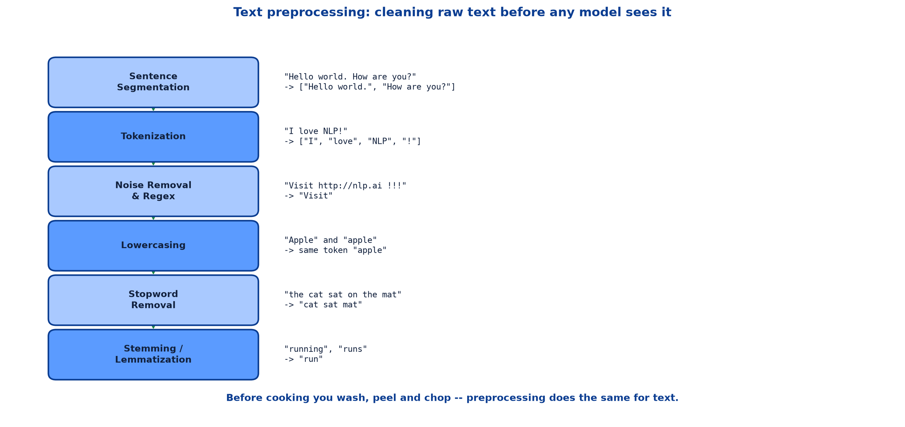
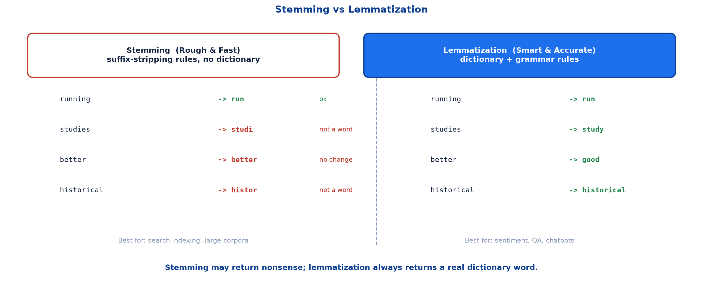

# <span style="color:#0B3D91">Text Preprocessing</span>

> Study notes on cleaning raw text before any model sees it:
> **why preprocessing exists** → **sentence segmentation** → **tokenization** →
> **regex &amp; noise removal** → **normalization** → **stopword removal** →
> **stemming vs lemmatization** → **one full preprocessing function**.
>
> **A note on formulas:** patterns and pipelines are written in plain text inside code blocks rather
> than LaTeX, so they render correctly in any Markdown viewer.

---

## <span style="color:#1E6FEB">Table of Contents</span>

1. [Why Preprocessing Exists](#1-why-preprocessing-exists)
2. [Sentence Segmentation](#2-sentence-segmentation)
3. [Tokenization](#3-tokenization)
4. [Regex &amp; Noise Removal](#4-regex--noise-removal)
5. [Normalization](#5-normalization)
6. [Stopword Removal](#6-stopword-removal)
7. [Stemming vs Lemmatization](#7-stemming-vs-lemmatization)
8. [One Full Preprocessing Function](#8-one-full-preprocessing-function)

---

## <span style="color:#1E6FEB">1. Why Preprocessing Exists</span>

### 1.1 Overview / What is it?

**Text preprocessing** is cleaning and preparing raw text before feeding it to any model.

> **Analogy:** Before cooking, you wash vegetables, peel them, and chop them up. Preprocessing does
> the same for text — we clean and normalize it before the 'cooking' (model training) begins.



### 1.2 Why does it matter for AI?

Real text is filthy. It carries HTML tags, URLs, stray punctuation, inconsistent casing, digits and
repeated whitespace — none of which mean anything to a sentiment model, but all of which become
features if you leave them in.

Worse, inconsistency multiplies your vocabulary. `"Apple"`, `"apple"` and `"apple!"` become three
unrelated tokens when they should be one. Every duplicate dilutes the signal.

### 1.3 Key Concepts

The core chores, each with a worked example:

| Step | Example |
|---|---|
| **Sentence Segmentation** | `"Hello world. How are you?"` → `["Hello world.", "How are you?"]` |
| **Tokenization** | `"I love NLP!"` → `["I", "love", "NLP", "!"]` |
| **Noise Removal & Regex** | `"Visit http://nlp.ai !!!"` → `"Visit"` |
| **Lowercasing** | `"Apple"` and `"apple"` → same token `"apple"` |
| **Stopword Removal** | `"the cat sat on the mat"` → `"cat sat mat"` |
| **Stemming** | `"running"`, `"runs"` → `"run"` · `"studies"` → `"studi"` |

### 1.4 Simple Example

```text
Raw:      "  Loved the CAMERA!!! Visit http://shop.ai for 20% off.  "
Cleaned:  "loved camera shop off"
```

Same information for a sentiment model, a fraction of the noise.

### 1.5 How it works

These steps are pipeline stages 2 and 3 from the introduction note, opened up. Each one hands its
output to the next, so **order matters** — a point section 8 returns to.

### 1.6 Practical Example / Use Case

Preprocessing is not glamorous, but it is frequently where the accuracy comes from. A modest model
on well-cleaned text routinely beats a sophisticated model on raw sludge.

### 1.7 Key Takeaways

> - Preprocessing cleans and normalizes raw text before any model sees it.
> - Like washing and chopping vegetables before cooking.
> - Uncleaned text inflates vocabulary and dilutes signal.
> - The steps form an ordered chain — each consumes the previous one's output.

---

## <span style="color:#1E6FEB">2. Sentence Segmentation</span>

### 2.1 Overview / What is it?

**Sentence segmentation** splits a block of text into individual sentences.

```text
"Hello world. How are you?"  ->  ["Hello world.", "How are you?"]
```

### 2.2 Why does it matter for AI?

Many downstream tasks are defined *per sentence* — parsing, sentiment, translation. You cannot run
them until you know where one sentence stops and the next begins.

### 2.3 Key Concepts

The naive rule is "split on full stops." It fails immediately:

```text
"Dr. Smith paid $4.50 on Jan. 3rd. He left."
```

A period appears five times. Only one ends a sentence. Abbreviations, decimals and initials all use
the same character.

### 2.4 Simple Example

```python
import spacy

nlp = spacy.load("en_core_web_sm")
doc = nlp("Hello world. How are you?")

for sent in doc.sents:
    print(sent.text)
```

```text
Hello world.
How are you?
```

### 2.5 How it works

Real segmenters use a trained model, not a single rule — weighing the surrounding characters,
capitalisation and known abbreviations to decide whether a period is a boundary.

### 2.6 Practical Example / Use Case

In a review dataset, segmentation is what lets you spot mixed sentiment: `"The camera is great. The
battery is awful."` is positive then negative. Treated as one blob, those signals cancel out.

### 2.7 Key Takeaways

> - Segmentation splits text into sentences.
> - "Split on periods" breaks on abbreviations, decimals and initials.
> - Trained models handle boundaries far more reliably than fixed rules.
> - Needed whenever a downstream task is defined per sentence.

---

## <span style="color:#1E6FEB">3. Tokenization</span>

### 3.1 Overview / What is it?

**Tokenization** splits text into individual units called tokens.

```text
"I love NLP!"  ->  ["I", "love", "NLP", "!"]
```

### 3.2 Why does it matter for AI?

Tokens are the atoms every later step operates on. POS tagging tags tokens, stopword removal filters
tokens, lemmatization reduces tokens. Get this wrong and everything downstream inherits the error.

### 3.3 Key Concepts

Notice that punctuation became its own token rather than being silently dropped. That is a deliberate
choice — `"!"` carries sentiment information you may want to keep.

Tricky cases where naive splitting on spaces fails:

```text
"don't"      -> ["do", "n't"]        not ["don't"] or ["don", "t"]
"New York"   -> ["New", "York"]      two tokens, one concept
"state-of-the-art" -> often one token, sometimes five
```

### 3.4 Simple Example

```python
from nltk.tokenize import word_tokenize

print(word_tokenize("I love NLP!"))
```

```text
['I', 'love', 'NLP', '!']
```

### 3.5 How it works

Tokenizers apply language-specific rules about contractions, punctuation attachment and hyphenation.
Different libraries make different choices — which is exactly why you must use the **same tokenizer**
at training and inference time.

### 3.6 Practical Example / Use Case

A model trained on `["do", "n't"]` but served `["don", "'", "t"]` sees unfamiliar tokens and quietly
degrades. This mismatch is one of the most common and least obvious NLP bugs.

### 3.7 Key Takeaways

> - Tokenization splits text into the atoms every later step consumes.
> - Punctuation is usually kept as its own token, not discarded.
> - Contractions, multi-word names and hyphens are the hard cases.
> - Always use the same tokenizer at training and inference.

---

## <span style="color:#1E6FEB">4. Regex &amp; Noise Removal</span>

### 4.1 Overview / What is it?

**Noise removal** strips content that carries no useful signal — URLs, HTML tags, digits, excess
punctuation and repeated whitespace. **Regular expressions (regex)** are the standard tool.

```text
"Visit http://nlp.ai !!!"  ->  "Visit"
```

### 4.2 Why does it matter for AI?

Every unique URL in a corpus becomes its own vocabulary entry. Thousands of one-off tokens bloat the
model and teach it nothing.

### 4.3 Key Concepts

The patterns used in practice:

```text
r"\d+"           one or more digits
r"[^a-z ]"       anything that is not a lowercase letter or a space
r" +"            repeated spaces
r"http\S+"       a URL: "http" followed by non-space characters
r"<.*?>"         an HTML tag
```

### 4.4 Simple Example

A step-by-step clean, in the order the demo applies it:

```python
import re

sample = "I watched this 2 times!! Amazing camera."

step_a = sample.lower()               # lowercase first
step_b = re.sub(r"\d+", "", step_a)   # remove digits
step_c = re.sub(r"[^a-z ]", "", step_b)  # remove punctuation
step_d = re.sub(r" +", " ", step_c).strip()  # collapse spaces

print(step_d)
```

```text
i watched this times amazing camera
```

### 4.5 How it works

Order matters here too. Lowercasing **first** means the punctuation pattern only needs to handle
`a-z`, not `A-Za-z`. Collapsing spaces **last** mops up the gaps left by earlier deletions.

### 4.6 Practical Example / Use Case

Scraped web text is the classic case: HTML tags and URLs everywhere. Strip those before anything
else, or your tokenizer will faithfully turn `<div>` into a word.

Be careful not to over-clean, though. Removing all digits destroys `"iPhone 14"`. Removing all
punctuation destroys emoticons. Clean for *your* task, not on autopilot.

### 4.7 Key Takeaways

> - Noise removal strips URLs, tags, digits and excess punctuation via regex.
> - Common patterns: `\d+`, `[^a-z ]`, ` +`, `http\S+`, `<.*?>`.
> - Lowercase first so later patterns stay simple; collapse whitespace last.
> - Over-cleaning destroys real signal — match the cleaning to the task.

---

## <span style="color:#1E6FEB">5. Normalization</span>

### 5.1 Overview / What is it?

**Normalization** makes equivalent text look identical. The most common form is **lowercasing**.

```text
"Apple" and "apple"  ->  same token "apple"
```

### 5.2 Why does it matter for AI?

Without it, a model must learn `"Good"`, `"good"` and `"GOOD"` as three separate words, splitting the
evidence three ways and learning each one less well.

### 5.3 Key Concepts

Normalization covers lowercasing, punctuation handling and special-character removal. All of it
serves one goal: **one concept, one token**.

### 5.4 Simple Example

```text
Before:  ["Good", "good", "GOOD"]   -> 3 vocabulary entries, evidence split
After:   ["good", "good", "good"]   -> 1 vocabulary entry, evidence pooled
```

### 5.5 How it works

Lowercasing is a single method call, which makes it easy to apply blindly. Resist that:

```text
"US"     -> "us"       country becomes a pronoun
"Apple"  -> "apple"    company becomes a fruit
```

Case is genuine information for named entity recognition. Lowercase for bag-of-words classification;
think twice before doing it ahead of NER.

### 5.6 Practical Example / Use Case

Sentiment classification on reviews benefits from aggressive lowercasing — you want `"LOVED"` and
`"loved"` pooled. An entity extractor pulling company names from news wants the opposite.

### 5.7 Key Takeaways

> - Normalization makes equivalent text identical — one concept, one token.
> - Lowercasing is the most common form; it pools evidence and shrinks vocabulary.
> - Case carries real information for NER and acronyms.
> - Normalize according to the downstream task.

---

## <span style="color:#1E6FEB">6. Stopword Removal</span>

### 6.1 Overview / What is it?

**Stopwords** are extremely common words that carry little standalone meaning — "the", "is", "on",
"a". Removing them keeps only the content-bearing words.

```text
"the cat sat on the mat"  ->  "cat sat mat"
```

### 6.2 Why does it matter for AI?

Stopwords are a large share of every document but contribute almost nothing to topic or sentiment.
Dropping them shrinks the data and sharpens the signal.

### 6.3 Key Concepts

NLTK ships a ready-made English stopword list:

```python
from nltk.corpus import stopwords

nltk_stopwords = stopwords.words("english")
print(len(nltk_stopwords))
print(nltk_stopwords[:10])
```

```text
198
['a', 'about', 'above', 'after', 'again', 'against', 'ain', 'all', 'am', 'an']
```

### 6.4 Simple Example

```python
stopword_set = set(stopwords.words("english"))

tokens = ["the", "cat", "sat", "on", "the", "mat"]
kept = [t for t in tokens if t not in stopword_set]

print(kept)
```

```text
['cat', 'sat', 'mat']
```

Note the `set(...)` conversion — membership testing against a list is far slower, and this check runs
once per token across the entire corpus.

### 6.5 How it works

The list is a default, not a law. Domain terms may deserve adding; critical words may deserve
rescuing. The standard English list contains **"not"**, **"no"** and **"nor"** — and removing those
is catastrophic for sentiment:

```text
"this is not good"  ->  "good"
```

The review has been inverted into its opposite.

### 6.6 Practical Example / Use Case

Search indexing removes stopwords happily — nobody searches for "the". Sentiment analysis should
keep negations. Tailor the list.

### 6.7 Key Takeaways

> - Stopwords are common words with little standalone meaning.
> - NLTK provides a standard English list of ~198 words.
> - Use a `set` for fast membership testing.
> - The default list includes negations — removing them can reverse sentiment.
> - Customise the list for the task.

---

## <span style="color:#1E6FEB">7. Stemming vs Lemmatization</span>

### 7.1 Overview / What is it?

Both reduce words to their base form — but very differently.

> **Why reduce words?** `"running"`, `"runs"`, `"ran"` all mean the same thing. Reducing them to a
> base form helps machines treat them as one concept — critical for search, classification, and text
> mining.



### 7.2 Why does it matter for AI?

Without reduction, a search for "run" misses every document that says "running". With the wrong
choice of reduction, you either get nonsense tokens or pay a large speed penalty.

### 7.3 Key Concepts — Stemming (Rough &amp; Fast)

Chops off word endings using simple rules. No dictionary — it just strips suffixes. **Output may NOT
be a real word.**

Examples (Porter Stemmer):

```text
running     ->  run          ok
studies     ->  studi        not a real word
better      ->  better       no change at all
historical  ->  histor       not a real word
```

**Best for:** speed-critical tasks — search indexing, large corpora.

### 7.4 Key Concepts — Lemmatization (Smart &amp; Accurate)

Uses a full vocabulary dictionary and grammar rules. Always returns a real, valid word. **Output is
ALWAYS a valid dictionary word.**

Examples (spaCy Lemmatizer):

```text
running     ->  run
studies     ->  study
better      ->  good
historical  ->  historical
```

**Best for:** sentiment analysis, QA systems, chatbots — accuracy matters.

`better -> good` is the one to remember. No suffix rule could ever produce that; it requires knowing
that "better" is the comparative form of "good".

### 7.5 Simple Example — quick comparison

| | Stemming | Lemmatization |
|---|---|---|
| **Method** | Suffix-stripping rules | Dictionary + grammar rules |
| **Speed** | Very fast | Slower (dictionary lookup) |
| **Accuracy** | Lower — may get nonsense | High — always real words |
| **Language** | Language-specific rules | Needs trained vocabulary |
| **Output** | `"studi"`, `"histor"` | `"study"`, `"historical"` |
| **Use case** | Search engines, indexing | NLU, sentiment, QA, chatbots |

> **Choose Stemming when:** millions of docs, speed is critical, slight inaccuracy is OK.
> **Choose Lemmatization when:** meaning matters — chatbots, NLU pipelines, QA.

### 7.6 How it works

Lemmatization needs to know a word's part of speech to work properly — `"saw"` is `"see"` as a verb
but `"saw"` as a noun. NLTK's lemmatizer therefore accepts a POS argument:

```python
from nltk.corpus import wordnet

def get_wordnet_pos(spacy_pos):
    """Maps a spaCy POS tag onto the tag format NLTK's WordNetLemmatizer expects."""
    mapping = {
        "NOUN": wordnet.NOUN,
        "VERB": wordnet.VERB,
        "AUX":  wordnet.VERB,   # auxiliary verbs like "was", "is", "has"
        "ADJ":  wordnet.ADJ,
        "ADV":  wordnet.ADV,
    }
    return mapping.get(spacy_pos, wordnet.NOUN)  # default to noun
```

This is the lexical level from the previous note being consumed by preprocessing — POS tags feeding
lemmatization.

### 7.7 Key Takeaways

> - Both reduce words to a base form so variants count as one concept.
> - **Stemming**: fast suffix-stripping, no dictionary, may output non-words like `"studi"`.
> - **Lemmatization**: dictionary + grammar, always a real word, `"better" -> "good"`.
> - Stemming for search indexing and huge corpora; lemmatization when meaning matters.
> - Lemmatization needs POS tags to disambiguate forms.

---

## <span style="color:#1E6FEB">8. One Full Preprocessing Function</span>

### 8.1 Overview / What is it?

In practice the steps are wrapped into a single reusable function so every document receives
identical treatment.

### 8.2 Why does it matter for AI?

Consistency is the whole point. If training data is cleaned one way and production input another,
the model sees a different world at inference time than it learned from.

### 8.3 Key Concepts — the step order

```text
1. Remove HTML tags and URLs
2. Lowercase everything
3. Remove digits and punctuation
4. Tokenize (NLTK)
5. Remove stopwords (NLTK)
6. Lemmatize each remaining token (POS-aware)
```

Structural noise goes first, character-level cleaning second, and only then do we split into tokens.
Removing HTML *after* tokenizing would leave `<`, `div` and `>` as separate tokens to chase down.

### 8.4 Simple Example

```python
import re
from nltk.corpus import stopwords
from nltk.stem import WordNetLemmatizer
from nltk.tokenize import word_tokenize

lemmatizer = WordNetLemmatizer()
stopword_set = set(stopwords.words("english"))


def preprocess_text(raw_text):
    """Runs the complete NLTK-based preprocessing pipeline on raw text."""
    text = re.sub(r"<.*?>", " ", raw_text)      # 1. HTML tags
    text = re.sub(r"http\S+", " ", text)        #    URLs
    text = text.lower()                          # 2. lowercase
    text = re.sub(r"\d+", "", text)             # 3. digits
    text = re.sub(r"[^a-z ]", "", text)         #    punctuation
    text = re.sub(r" +", " ", text).strip()     #    collapse spaces

    tokens = word_tokenize(text)                 # 4. tokenize
    tokens = [t for t in tokens if t not in stopword_set]   # 5. stopwords
    tokens = [lemmatizer.lemmatize(t) for t in tokens]      # 6. lemmatize

    return " ".join(tokens)
```

```text
Input:   "<p>I watched this 2 times!! The CAMERA is amazing.</p>"
Output:  "watched time camera amazing"
```

### 8.5 How it works

One function, one definition of "clean" — applied identically to training data, validation data and
live input. That is the DRY principle doing real work: the cleaning rules exist in exactly one place,
so they cannot drift apart.

### 8.6 Practical Example / Use Case

Keeping intermediate stages visible is worth the small extra effort while developing. Returning the
token lists alongside the final string lets you inspect exactly which step dropped a word you
expected to survive.

### 8.7 Key Takeaways

> - Wrap preprocessing in one reusable function so every document is treated identically.
> - Order: HTML/URLs → lowercase → digits/punctuation → tokenize → stopwords → lemmatize.
> - Structural noise must go before tokenization.
> - One definition of "clean" prevents train/inference drift.

---

## <span style="color:#1E6FEB">Summary — Text Preprocessing at a Glance</span>

```text
raw text -> segment -> tokenize -> clean -> normalize -> remove stopwords -> lemmatize
```

| Term | Meaning |
|---|---|
| Sentence segmentation | Splitting text into sentences |
| Tokenization | Splitting text into tokens (words, punctuation, subwords) |
| Noise removal | Stripping URLs, HTML, digits, excess punctuation |
| Regex | Pattern language used for noise removal |
| Normalization | Making equivalent text identical (usually lowercasing) |
| Stopwords | Very common words with little standalone meaning |
| Stemming | Fast suffix-stripping; may produce non-words |
| Lemmatization | Dictionary-based reduction; always a real word |
| Lemma | The valid dictionary base form of a word |

**The one-sentence version:** Preprocessing washes, chops and standardises raw text — segmenting,
tokenizing, stripping noise, normalizing case, dropping stopwords and reducing words to a base form —
so that a model receives one consistent token per concept instead of a pile of near-duplicates.

**Where this leads:** the next note turns those clean tokens into numbers, covering Bag of Words,
N-grams, TF-IDF and the intuition behind word embeddings.

---

> **Navigation:** ← Previous: [02 — Levels of Language Analysis](02_NLP_Levels_Of_Language_Analysis.md) · Next → 04 — Text Representation: BoW, N-grams &amp; TF-IDF
