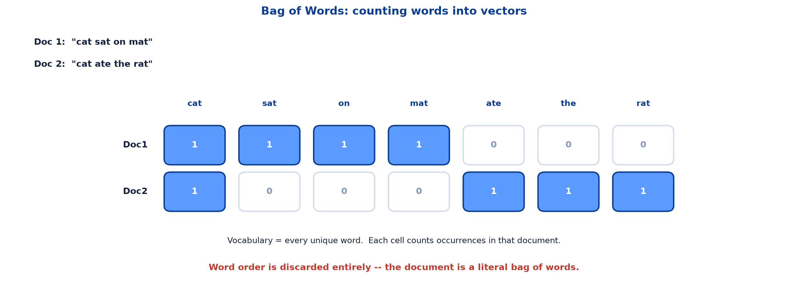
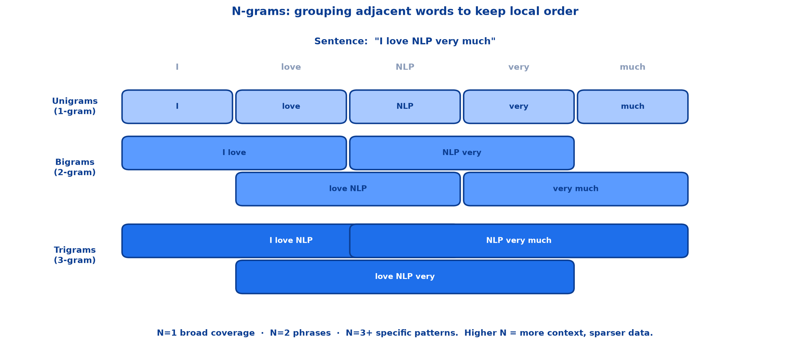
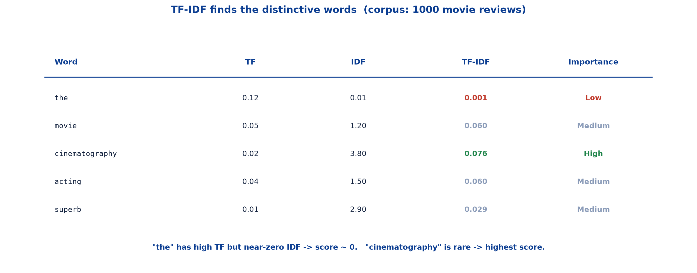
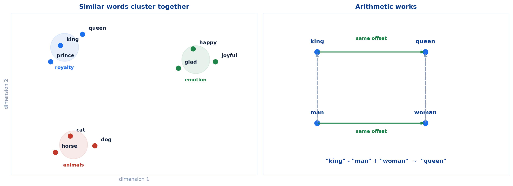

# <span style="color:#0B3D91">Text Representation — BoW, N-grams, TF-IDF &amp; Embeddings</span>

> Study notes on turning clean tokens into numbers:
> **why text must become numbers** → **Bag of Words** → **N-grams** →
> **TF-IDF formula** → **TF-IDF worked example** → **word embeddings intuition** →
> **the embedding vector space**.
>
> **A note on formulas:** equations are written in plain text inside code blocks rather than
> LaTeX, so they render correctly in any Markdown viewer.

---

## <span style="color:#1E6FEB">Table of Contents</span>

1. [Why Text Must Become Numbers](#1-why-text-must-become-numbers)
2. [Bag of Words](#2-bag-of-words)
3. [N-grams — Capturing Context](#3-n-grams--capturing-context)
4. [TF-IDF — The Formula](#4-tf-idf--the-formula)
5. [TF-IDF — Worked Example](#5-tf-idf--worked-example)
6. [Word Embeddings — Intuition](#6-word-embeddings--intuition)
7. [Word Embeddings — Vector Space](#7-word-embeddings--vector-space)

---

## <span style="color:#1E6FEB">1. Why Text Must Become Numbers</span>

### 1.1 Overview / What is it?

**Text representation** is how we turn words into numbers machines can process.

Preprocessing left us with clean tokens. But no model — not linear regression, not a neural network
— consumes the string `"cat"`. Everything downstream is arithmetic, so the tokens must become
vectors.

### 1.2 Why does it matter for AI?

This is pipeline stage 6 beginning. The representation you choose decides what the model is *capable*
of noticing. A representation that throws away word order guarantees the model can never learn from
word order, no matter how clever it is.

### 1.3 Key Concepts

Four approaches, in increasing sophistication:

| Method | Core idea | Keeps order? | Knows similarity? |
|---|---|---|---|
| **Bag of Words** | Count each word | No | No |
| **N-grams** | Count adjacent word groups | Locally | No |
| **TF-IDF** | Weight counts by distinctiveness | No | No |
| **Embeddings** | Dense learned vectors | — | **Yes** |

### 1.4 Simple Example

```text
"cat sat on mat"  ->  [1, 1, 1, 1, 0, 0, 0]
```

A sentence has become a vector. That vector can be fed to any classifier.

### 1.5 How it works

The first three methods are **count-based**: they tally what appears. The fourth is **learned**:
vectors are trained so that meaning shows up as geometry. That jump is the main story of this note.

### 1.6 Practical Example / Use Case

Spam filtering works fine with counts — certain words simply appear more in spam. Detecting that two
differently-worded reviews express the same sentiment needs embeddings.

### 1.7 Key Takeaways

> - Models consume numbers, so text must be converted to vectors.
> - The representation limits what the model can possibly learn.
> - BoW, N-grams and TF-IDF are count-based; embeddings are learned.
> - Only embeddings capture similarity between different words.

---

## <span style="color:#1E6FEB">2. Bag of Words</span>

### 2.1 Overview / What is it?

**Core idea:** Count how many times each word appears in a document. Ignore word order — treat the
document as a literal "bag" of words.



### 2.2 Why does it matter for AI?

BoW is the simplest workable representation and a genuinely strong baseline. Before reaching for
anything fancier, it is worth knowing what this costs and what it buys.

### 2.3 Key Concepts — step by step

```text
1  Doc 1: "cat sat on mat"
2  Doc 2: "cat ate the rat"

Build vocabulary (unique words):
   cat  sat  on  mat  ate  the  rat

BoW Vectors:
   Doc1: [ 1  1  1  1  0  0  0 ]
   Doc2: [ 1  0  0  0  1  1  1 ]
```

Each position in the vector corresponds to one vocabulary word; each value is that word's count in
that document.

### 2.4 Simple Example

```python
from sklearn.feature_extraction.text import CountVectorizer

docs = ["cat sat on mat", "cat ate the rat"]
vectorizer = CountVectorizer()
X = vectorizer.fit_transform(docs)

print(vectorizer.get_feature_names_out())
print(X.toarray())
```

```text
['ate' 'cat' 'mat' 'on' 'rat' 'sat' 'the']
[[0 1 1 1 0 1 0]
 [1 1 0 0 1 0 1]]
```

The vocabulary comes out alphabetically sorted, but the principle is identical.

### 2.5 How it works — strengths and limitations

**Strengths**

```text
+  Simple and fast to compute
+  Works well for short texts
+  Great baseline for text classification
+  Easy to implement in any language
```

**Limitations**

```text
-  Loses all word order -- "not good" = "good"?
-  Vocabulary size explodes with large corpora
-  No concept of similar words ("happy" != "joyful")
-  Sparse vectors -- mostly zeros
```

### 2.6 Practical Example / Use Case

That first limitation is the dangerous one. Consider:

```text
"the movie was good, not bad"
"the movie was bad, not good"
```

Identical BoW vectors. Opposite meanings. Any model built on plain BoW is structurally blind to the
difference — which is exactly the problem N-grams address.

### 2.7 Key Takeaways

> - BoW counts word occurrences and discards order entirely.
> - Vocabulary = all unique words; each document becomes a count vector.
> - Fast, simple and a strong classification baseline.
> - Loses order, explodes with vocabulary size, ignores similarity, produces sparse vectors.

---

## <span style="color:#1E6FEB">3. N-grams — Capturing Context</span>

### 3.1 Overview / What is it?

**N-grams** are groups of N consecutive words — preserving word order locally.

> **The problem with BoW:** `"New York"` gets split into `"New"` + `"York"` — losing the meaning.
> `"not good"` becomes just `"good"`. N-grams fix this by grouping adjacent words.



### 3.2 Why does it matter for AI?

N-grams are the cheapest possible fix for BoW's order-blindness. No new model required — just count
pairs and triples instead of single words.

### 3.3 Key Concepts

For the sentence `"I love NLP very much"`:

```text
Unigrams (1-gram)   same as BoW -- individual words
   "I"  "love"  "NLP"  "very"  "much"

Bigrams (2-gram)    pairs of words -- captures phrases
   "I love"  "love NLP"  "NLP very"  "very much"

Trigrams (3-gram)   triplets -- richer context
   "I love NLP"  "love NLP very"  "NLP very much"
```

> **Rule of thumb:** N=1 for broad coverage · N=2 for phrases · N=3+ for specific patterns.
> Higher N = more context but sparser data.

### 3.4 Simple Example

Bigrams rescue the negation case that broke BoW:

```text
"not good"  ->  bigram "not good" is its own feature
```

The model can now learn that this specific pair signals negative sentiment, rather than seeing an
isolated positive `"good"`.

### 3.5 How it works

The windows **overlap** — each one slides forward by a single word. That is why a 5-word sentence
yields 5 unigrams, 4 bigrams and 3 trigrams: `count = length - N + 1`.

```python
from sklearn.feature_extraction.text import CountVectorizer

vectorizer = CountVectorizer(ngram_range=(1, 2))   # unigrams + bigrams
X = vectorizer.fit_transform(["I love NLP very much"])
print(vectorizer.get_feature_names_out())
```

### 3.6 Practical Example / Use Case

The trade-off is real and worth respecting. Every increase in N multiplies the feature count while
making each individual feature rarer. Trigrams on a small dataset produce thousands of features that
each appear once — plenty of noise, very little signal. Bigrams are usually the sweet spot.

### 3.7 Key Takeaways

> - N-grams group N adjacent words, preserving **local** order.
> - Unigrams = BoW; bigrams capture phrases; trigrams capture richer patterns.
> - Windows overlap: a sentence of length L yields `L - N + 1` n-grams.
> - Higher N = more context but sparser data; bigrams are the usual compromise.

---

## <span style="color:#1E6FEB">4. TF-IDF — The Formula</span>

### 4.1 Overview / What is it?

**TF-IDF** = Term Frequency × Inverse Document Frequency.

> **Intuition:** A word is important if it appears OFTEN in THIS document, but RARELY across ALL
> documents. `"the"` appears everywhere → low importance. `"photosynthesis"` is rare → high
> importance in biology docs.

### 4.2 Why does it matter for AI?

Raw counts reward the wrong words. `"the"` is the most frequent word in almost every English
document and tells you nothing. TF-IDF automatically demotes it without needing a stopword list.

### 4.3 Key Concepts — the two halves

**TF — Term Frequency.** How often does the word appear in THIS document?

```text
                Number of times term t appears in doc d
TF(t, d)  =  ---------------------------------------------
                    Total number of words in doc d
```

**IDF — Inverse Document Frequency.** How RARE is this word across ALL documents?

```text
IDF(t)  =  log ( Total number of documents / Documents containing term t )
```

**Combined:**

```text
TF-IDF(t, d)  =  TF(t, d)  ×  IDF(t)
```

### 4.4 Simple Example

Why the logarithm matters. With 1000 documents:

```text
word in 1000 docs  ->  log(1000/1000) = log(1)    = 0.00   killed entirely
word in  500 docs  ->  log(1000/500)  = log(2)    = 0.69
word in   10 docs  ->  log(1000/10)   = log(100)  = 4.61
word in    1 doc   ->  log(1000/1)    = log(1000) = 6.91
```

A word appearing in every document gets an IDF of exactly **zero**, which zeroes out its whole
TF-IDF score regardless of how often it appears.

### 4.5 How it works

The two terms pull in opposite directions, and a word must satisfy both to score highly:

```text
high TF, high IDF  ->  frequent here, rare elsewhere  ->  HIGH score  (distinctive)
high TF, low  IDF  ->  frequent everywhere            ->  low score   ("the")
low  TF, high IDF  ->  rare here and elsewhere        ->  low score   (incidental)
```

### 4.6 Practical Example / Use Case

```python
from sklearn.feature_extraction.text import TfidfVectorizer

docs = ["the cat sat on the mat", "the dog ate the bone"]
X = TfidfVectorizer().fit_transform(docs)
```

Search engines rank documents this way: a query term that is rare in the corpus but common in one
document makes that document a strong match.

### 4.7 Key Takeaways

> - `TF-IDF(t, d) = TF(t, d) × IDF(t)`.
> - **TF** = how often the term appears in this document (normalised by length).
> - **IDF** = `log(total docs / docs containing the term)` — rarity across the corpus.
> - A word in every document gets IDF = 0, zeroing its score.
> - High scores require frequent-here **and** rare-elsewhere.

---

## <span style="color:#1E6FEB">5. TF-IDF — Worked Example</span>

### 5.1 Overview / What is it?

Seeing the formula in action with a film review document.

```text
Document:  "The movie had brilliant cinematography and the acting was superb."
Corpus:    1000 movie reviews
```



### 5.2 Why does it matter for AI?

The numbers make the mechanism undeniable. You can see the common word being crushed and the rare
word being promoted.

### 5.3 Key Concepts

| Word | TF (in doc) | IDF (across docs) | TF-IDF score | Importance |
|---|---|---|---|---|
| the | 0.12 | 0.01 (very common) | 0.001 | Low |
| movie | 0.05 | 1.20 (somewhat rare) | 0.060 | Medium |
| cinematography | 0.02 | 3.80 (very rare) | 0.076 | **High** |
| acting | 0.04 | 1.50 (somewhat rare) | 0.060 | Medium |
| superb | 0.01 | 2.90 (rare) | 0.029 | Medium |

> **Key insight:** `"the"` has high TF (appears often) but near-zero IDF (appears in ALL docs) →
> TF-IDF ≈ 0. `"cinematography"` has low TF but high IDF → TF-IDF is highest. TF-IDF automatically
> finds the **DISTINCTIVE** words.

### 5.4 Simple Example

Check the arithmetic on the two extremes:

```text
the:             0.12 × 0.01  =  0.0012   ~  0.001
cinematography:  0.02 × 3.80  =  0.0760
```

`"the"` appears **six times more often** than `"cinematography"` in this document, yet scores about
**63 times lower**. The IDF term did all of that work.

### 5.5 How it works

Ranked by score, the document's own vocabulary sorts itself:

```text
cinematography  0.076   <- what this review is distinctively about
movie           0.060
acting          0.060
superb          0.029
the             0.001   <- essentially discarded
```

Nobody wrote a rule saying "ignore the." The formula produced that outcome from corpus statistics
alone.

### 5.6 Practical Example / Use Case

This is why TF-IDF remains a genuinely useful default for document search, keyword extraction and
text classification baselines — decades after its invention, with no training required.

### 5.7 Key Takeaways

> - TF-IDF automatically surfaces **distinctive** words without a stopword list.
> - `"the"`: high TF × near-zero IDF → score ≈ 0.
> - `"cinematography"`: low TF × high IDF → highest score.
> - Rarity across the corpus outweighs raw frequency within the document.

---

## <span style="color:#1E6FEB">6. Word Embeddings — Intuition</span>

### 6.1 Overview / What is it?

**Word embeddings** represent words as vectors in a meaningful space. Each word is mapped to a dense
vector of numbers, and **similar words end up CLOSE in vector space**.

### 6.2 Why does it matter for AI?

Everything so far counts words. None of it knows that two different words can mean nearly the same
thing.

**Problem with BoW / TF-IDF**

```text
-  "king" and "queen" treated as completely unrelated
-  "happy" and "joyful" look totally different to the model
-  No understanding of word similarity
-  Cannot handle unseen words (the "OOV problem")
```

### 6.3 Key Concepts

**The embeddings solution**

```text
king    ->  [0.2,  0.8,  0.1, ...]
queen   ->  [0.2,  0.7,  0.2, ...]
happy   ->  [0.9,  0.1,  0.7, ...]
joyful  ->  [0.8,  0.1,  0.7, ...]   <- very close to "happy"
```

`"happy"` and `"joyful"` have nearly identical vectors. The model can now treat them as related
without ever being told they are synonyms.

**Famous Word2Vec result:**

```text
"king" - "man" + "woman"  ~  "queen"
```

### 6.4 Simple Example — the three classic models

| Model | Origin | How it works |
|---|---|---|
| **Word2Vec** | Google · 2013 | Predicts surrounding context words (CBOW) or target from context (Skip-gram). Most famous embedding model. |
| **GloVe** | Stanford · 2014 | Uses global word co-occurrence statistics from large corpora. Combines local context with global matrix factorization. |
| **FastText** | Facebook · 2016 | Breaks words into character n-grams. Handles unseen words, misspellings, and morphologically rich languages. |

### 6.5 How it works

FastText's character n-gram trick is what solves the **OOV problem**. A word never seen in training
still has familiar sub-pieces:

```text
"unhappiness"  ->  "un" + "happi" + "ness"
```

Even as a brand-new word, those fragments carry meaning the model already understands.

### 6.6 Practical Example / Use Case

A search for "affordable laptop" should match a product described as "cheap notebook." Count-based
methods see zero shared words and score it as irrelevant. Embeddings place both phrases in the same
neighbourhood.

### 6.7 Key Takeaways

> - Embeddings map each word to a **dense vector**; similar words land close together.
> - They fix BoW/TF-IDF's blindness to similarity and the OOV problem.
> - **Word2Vec** (2013) predicts context; **GloVe** (2014) uses global co-occurrence; **FastText**
>   (2016) uses character n-grams.
> - The famous result: `"king" - "man" + "woman" ~ "queen"`.

---

## <span style="color:#1E6FEB">7. Word Embeddings — Vector Space</span>

### 7.1 Overview / What is it?

How words cluster by meaning in high-dimensional space.



### 7.2 Why does it matter for AI?

Once meaning is geometry, ordinary vector maths becomes a tool for reasoning about language.

### 7.3 Key Concepts — key properties

| Property | What it means |
|---|---|
| **Similarity = distance** | Cosine similarity measures how close two word vectors are |
| **Arithmetic works** | `"king" - "man" + "woman" = "queen"` (vector math!) |
| **Dimensions = features** | Each dimension may encode gender, age, royalty, etc. |
| **Typically 100–300 dims** | Dense vectors vs sparse BoW vectors of 100,000+ |
| **Transfer learning** | Pre-trained on billions of words, reuse in your task |

### 7.4 Simple Example

Words gather into **semantic clusters** — royalty in one region, emotions in another, animals in a
third. Nobody labelled those groups; they emerge from how the words are used.

### 7.5 How it works

The analogy works because the *offset between* two vectors encodes a relationship:

```text
"king" - "man"      ->  captures the "royalty without maleness" direction
+ "woman"           ->  adds femaleness back
=  lands near "queen"
```

The gender offset from `man` to `woman` is roughly the same vector as from `king` to `queen`.
Relationships become directions in space.

### 7.6 Practical Example / Use Case

**Transfer learning** is the practical payoff. Pre-trained embeddings trained on billions of words
can be dropped into your own task, so a model with modest training data still starts out knowing
that "excellent" and "great" are related.

The dimension count matters too: **100–300 dense dimensions** replace a sparse BoW vector of
100,000+ — smaller, richer and far better behaved.

### 7.7 Key Takeaways

> - Similar words form **semantic clusters** in vector space.
> - Similarity is measured by **cosine similarity** — distance means relatedness.
> - Vector arithmetic captures relationships as consistent offsets.
> - Typically 100–300 dense dimensions, versus 100,000+ sparse BoW dimensions.
> - Pre-trained embeddings enable **transfer learning** onto small datasets.

---

## <span style="color:#1E6FEB">Summary — Text Representation at a Glance</span>

```text
BoW       -> counts, no order
N-grams   -> counts of adjacent groups, local order
TF-IDF    -> counts weighted by distinctiveness
Embeddings-> dense learned vectors, meaning as geometry
```

| Term | Meaning |
|---|---|
| Bag of Words | Counting words, ignoring order |
| Vocabulary | The set of unique words across the corpus |
| N-gram | A group of N consecutive words |
| Unigram / Bigram / Trigram | N = 1 / 2 / 3 |
| TF | Term frequency within one document |
| IDF | `log(total docs / docs containing the term)` |
| Sparse vector | Mostly zeros, length = vocabulary size |
| Dense vector | Few hundred real-valued dimensions, all informative |
| Embedding | Learned dense vector where similar words are close |
| Cosine similarity | Measure of closeness between two vectors |
| OOV | Out-of-vocabulary — a word unseen during training |

**The one-sentence version:** Text becomes numbers either by counting — Bag of Words, N-grams and
TF-IDF, which are simple and effective but blind to word similarity — or by learning dense
embeddings, where meaning becomes geometry and related words sit close together in space.

**Where this leads:** the next note walks through the preprocessing and linguistic-analysis demo
end to end, applying everything from the last two notes to a real review dataset with spaCy and NLTK.

---

> **Navigation:** ← Previous: [03 — Text Preprocessing](03_NLP_Text_Preprocessing.md) · Next → 05 — Demo 1: Preprocessing &amp; Linguistic Analysis Walkthrough
