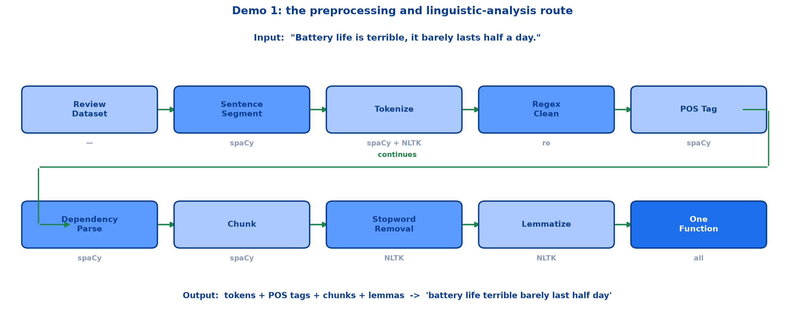

# <span style="color:#0B3D91">Demo 1 — Preprocessing &amp; Linguistic Analysis Walkthrough</span>

> A step-by-step walkthrough of the hands-on preprocessing notebook:
> **the review dataset** → **stopword list** → **sentence segmentation** → **tokenization** →
> **regex cleaning** → **POS tagging** → **dependency parsing** → **chunking** →
> **stopword removal** → **lemmatization** → **named entity recognition** →
> **one full pipeline function**.
>
> Every output shown here is the actual output produced by the notebook.

---

## <span style="color:#1E6FEB">Table of Contents</span>

1. [Setup and the Review Dataset](#1-setup-and-the-review-dataset)
2. [Sentence Segmentation](#2-sentence-segmentation)
3. [Tokenization](#3-tokenization)
4. [Regex Cleaning](#4-regex-cleaning)
5. [Part-of-Speech Tagging](#5-part-of-speech-tagging)
6. [Dependency Parsing](#6-dependency-parsing)
7. [Chunking — Noun Phrase Extraction](#7-chunking--noun-phrase-extraction)
8. [Stopword Removal &amp; Lemmatization](#8-stopword-removal--lemmatization)
9. [Named Entity Recognition](#9-named-entity-recognition)
10. [The Full Pipeline in One Function](#10-the-full-pipeline-in-one-function)

---

## <span style="color:#1E6FEB">1. Setup and the Review Dataset</span>

### 1.1 Overview / What is it?

The demo applies everything from the preceding notes to a small custom review dataset, using
**spaCy** for linguistic analysis and **NLTK** for stopwords and lemmatization.



### 1.2 Why does it matter for AI?

Reading about tokenization is not the same as watching `"Battery life is terrible, it barely lasts
half a day."` become twelve tokens. This walkthrough makes each concept concrete.

### 1.3 Key Concepts — the setup

```python
import re
import spacy
import nltk
from collections import Counter

from nltk.corpus import stopwords
from nltk.stem import WordNetLemmatizer
from nltk.tokenize import word_tokenize

# NLTK data needed for tokenizing, POS tagging, stopwords, and lemmatization
nltk.download("punkt", quiet=True)
nltk.download("punkt_tab", quiet=True)
nltk.download("stopwords", quiet=True)
nltk.download("wordnet", quiet=True)
nltk.download("omw-1.4", quiet=True)

nlp = spacy.load("en_core_web_sm")
lemmatizer = WordNetLemmatizer()

print("Pipeline steps active:", nlp.pipe_names)
```

NLTK ships code but not data — the corpora download separately. spaCy loads a trained English model
in one call.

### 1.4 Simple Example — the dataset

```python
reviews = [
    "The camera quality is excellent and photos look stunning in low light.",
    "Battery life is terrible, it barely lasts half a day.",
    "The waiter was friendly but the pasta arrived cold and bland.",
    "An absolutely brilliant performance kept me hooked until the end.",
    "Delivery was fast, packaging was neat, and the product works great.",
]
```

Five short reviews spanning products, food and entertainment — enough variety to exercise every
technique without drowning in output.

### 1.5 How it works — the stopword list

```python
nltk_stopwords = stopwords.words("english")
print(f"NLTK's English stopword list has {len(nltk_stopwords)} words.")
print(nltk_stopwords[:30])
```

```text
NLTK's English stopword list has 198 words.

['a', 'about', 'above', 'after', 'again', 'against', 'ain', 'all', 'am', 'an',
 'and', 'any', 'are', 'aren', "aren't", 'as', 'at', 'be', 'because', 'been',
 'before', 'being', 'below', 'between', 'both', 'but', 'by', 'can', 'couldn',
 "couldn't"]
```

### 1.6 Practical Example / Use Case

Inspecting the list before using it is a good habit. You can see immediately that it includes
contractions (`"aren't"`, `"couldn't"`) and — importantly — negations, which matters for sentiment
work.

### 1.7 Key Takeaways

> - The demo pairs **spaCy** (linguistic analysis) with **NLTK** (stopwords, lemmatization).
> - NLTK needs its corpora downloaded separately from the library itself.
> - The dataset is five short, varied customer reviews.
> - NLTK's English stopword list contains **198** words.

---

## <span style="color:#1E6FEB">2. Sentence Segmentation</span>

### 2.1 Overview / What is it?

Splitting a multi-sentence review into individual sentences.

### 2.2 Why does it matter for AI?

The working text contains two distinct opinions. Analysing them as one blob would mix a complaint
with a compliment.

### 2.3 Key Concepts

```python
raw_review = ("Battery life is terrible, it barely lasts half a day. "
              "The camera quality is excellent and photos look stunning in low light.")
doc = nlp(raw_review)
sentences = list(doc.sents)

for i, sentence in enumerate(sentences, start=1):
    print(f"  Sentence {i}: {sentence.text.strip()}")
```

```text
spaCy found 2 sentence(s):

  Sentence 1: Battery life is terrible, it barely lasts half a day.
  Sentence 2: The camera quality is excellent and photos look stunning in low light.
```

### 2.4 Simple Example

```python
working_sentence = sentences[0]
print(working_sentence.text.strip())
```

```text
Battery life is terrible, it barely lasts half a day.
```

This sentence carries the rest of the single-sentence steps.

### 2.5 How it works

`nlp(text)` runs the whole spaCy pipeline at once; `doc.sents` simply reads off the sentence
boundaries it already determined. Segmentation is not a separate pass.

### 2.6 Practical Example / Use Case

This review is a perfect illustration of why segmentation matters: sentence 1 is **negative**
(battery), sentence 2 is **positive** (camera). Per-sentence sentiment gives you both signals;
whole-review sentiment averages them into a shrug.

### 2.7 Key Takeaways

> - `doc.sents` yields the sentences spaCy identified.
> - The demo's review splits into two sentences with opposite sentiment.
> - One `nlp()` call performs segmentation along with everything else.
> - Sentence 1 becomes the working sentence for later steps.

---

## <span style="color:#1E6FEB">3. Tokenization</span>

### 3.1 Overview / What is it?

Splitting the working sentence into individual tokens.

### 3.2 Why does it matter for AI?

Tokens are what every later step operates on. Seeing the exact list removes any guesswork about how
punctuation is handled.

### 3.3 Key Concepts

```python
tokens = [token.text for token in working_sentence]

for i, t in enumerate(tokens, start=1):
    print(f"  Token {i:>2}: {repr(t)}")
print(f"Total tokens: {len(tokens)}")
```

```text
  Token  1: 'Battery'
  Token  2: 'life'
  Token  3: 'is'
  Token  4: 'terrible'
  Token  5: ','
  Token  6: 'it'
  Token  7: 'barely'
  Token  8: 'lasts'
  Token  9: 'half'
  Token 10: 'a'
  Token 11: 'day'
  Token 12: '.'

Total tokens: 12
```

### 3.4 Simple Example

Ten words produce **twelve tokens**. The comma and the full stop each became their own token rather
than being attached to a neighbouring word or silently dropped.

### 3.5 How it works

NLTK tokenizes the same sentence too, since the pipeline uses NLTK downstream:

```python
nltk_tokens = word_tokenize(working_sentence.text)
print(nltk_tokens)
```

```text
['Battery', 'life', 'is', 'terrible', ',', 'it', 'barely', 'lasts', 'half', 'a', 'day', '.']
```

Both libraries agree here. They do not always agree — which is why the pipeline picks one and uses it
consistently.

### 3.6 Practical Example / Use Case

Keeping punctuation as tokens is useful when it carries signal. A review ending in `"!!!"` is
emphatic, and that information survives tokenization even if regex cleaning later removes it.

### 3.7 Key Takeaways

> - `[token.text for token in doc]` gives spaCy's tokens.
> - The 10-word sentence yields **12 tokens** — punctuation counts.
> - NLTK's `word_tokenize` produces the same list here.
> - Different tokenizers can disagree; pick one and stay consistent.

---

## <span style="color:#1E6FEB">4. Regex Cleaning</span>

### 4.1 Overview / What is it?

Stripping noise from the raw text, one regex at a time.

### 4.2 Why does it matter for AI?

Running the steps separately shows exactly what each pattern does, instead of hiding four
transformations inside one unreadable chained expression.

### 4.3 Key Concepts

```python
sample = working_sentence.text.strip()

step_a = sample.lower()                        # lowercase
step_b = re.sub(r"\d+", "", step_a)            # remove digits
step_c = re.sub(r"[^a-z ]", "", step_b)        # remove punctuation
step_d = re.sub(r" +", " ", step_c).strip()    # collapse whitespace
```

### 4.4 Simple Example

```text
Starting text:
  Battery life is terrible, it barely lasts half a day.

After lowercasing:
  battery life is terrible, it barely lasts half a day.

After removing digits:
  battery life is terrible, it barely lasts half a day.

After removing punctuation:
  battery life is terrible it barely lasts half a day

After collapsing whitespace:
  battery life is terrible it barely lasts half a day
```

### 4.5 How it works

The digit step is a **no-op** here — this sentence contains no digits, so the output is unchanged.
That is worth noticing rather than glossing over: pipeline steps must be safe on input that does not
need them.

The punctuation step is where the visible change happens, removing both the comma and the full stop
in one pass.

### 4.6 Practical Example / Use Case

Note the ordering. `[^a-z ]` only works because lowercasing already ran — on the original text it
would have deleted every capital letter. Each step assumes the previous one has happened.

### 4.7 Key Takeaways

> - Four patterns: `lower()`, `\d+`, `[^a-z ]`, ` +`.
> - Running them separately makes each transformation visible.
> - The digit step is a harmless no-op on text without digits.
> - `[^a-z ]` depends on lowercasing having run first.

---

## <span style="color:#1E6FEB">5. Part-of-Speech Tagging</span>

### 5.1 Overview / What is it?

Labelling each token with its grammatical role.

### 5.2 Why does it matter for AI?

POS tags feed two later steps: chunking uses them to find noun phrases, and lemmatization needs them
to reduce words correctly.

### 5.3 Key Concepts

```python
for token in working_sentence:
    explanation = spacy.explain(token.pos_) or ""
    print(f"{token.text:<15} {token.pos_:<8} {explanation}")
```

```text
Token           POS Tag  What it means
-------------------------------------------------------
Battery         NOUN     noun
life            NOUN     noun
is              AUX      auxiliary
terrible        ADJ      adjective
,               PUNCT    punctuation
it              PRON     pronoun
barely          ADV      adverb
lasts           VERB     verb
half            DET      determiner
a               DET      determiner
day             NOUN     noun
.               PUNCT    punctuation
```

`spacy.explain()` turns any tag into plain English — handy when you meet an unfamiliar one.

### 5.4 Simple Example — mining adjectives

Adjectives carry strong sentiment signal, so they are worth extracting across the whole dataset:

```python
all_adjectives = []
for r in reviews:
    r_doc = nlp(r)
    all_adjectives.extend(token.text for token in r_doc if token.pos_ == "ADJ")

print(all_adjectives)
```

```text
['excellent', 'stunning', 'low', 'terrible', 'friendly', 'cold',
 'bland', 'brilliant', 'hooked', 'fast', 'neat', 'great']
```

Read that list on its own and you can practically feel the sentiment of the dataset — without any
sentiment model at all.

### 5.5 How it works — tag counts

```python
pos_counts = Counter(
    token.pos_
    for token in working_sentence
    if not token.is_punct and not token.is_space
)
```

```text
  NOUN      3  (noun)
  DET       2  (determiner)
  AUX       1  (auxiliary)
  ADJ       1  (adjective)
  PRON      1  (pronoun)
  ADV       1  (adverb)
  VERB      1  (verb)
```

The `is_punct` filter excludes the comma and full stop, leaving 10 real words.

### 5.6 Practical Example / Use Case

Notice `is` is tagged **AUX** (auxiliary), not VERB. That distinction matters later — the
lemmatization step has to map AUX onto verb rules to turn `"is"` into `"be"`.

### 5.7 Key Takeaways

> - `token.pos_` gives the tag; `spacy.explain()` describes it.
> - Filtering `pos_ == "ADJ"` extracts sentiment-bearing words across the dataset.
> - `Counter` plus `is_punct` filtering summarises the grammatical make-up.
> - `"is"` is **AUX**, not VERB — relevant for lemmatization.

---

## <span style="color:#1E6FEB">6. Dependency Parsing</span>

### 6.1 Overview / What is it?

Mapping the grammatical relationships between words.

### 6.2 Why does it matter for AI?

POS tags say what each word *is*. Dependencies say how the words *connect* — who is the subject of
what.

### 6.3 Key Concepts

```python
for token in working_sentence:
    explanation = spacy.explain(token.dep_) or ""
    print(f"{token.text:<15} {token.dep_:<10} {token.head.text:<15} {explanation}")
```

```text
Token           Relation   Head word       Relation meaning
----------------------------------------------------------------------
Battery         compound   life            compound
life            nsubj      is              nominal subject
is              ccomp      lasts           clausal complement
terrible        acomp      is              adjectival complement
,               punct      lasts           punctuation
it              nsubj      lasts           nominal subject
barely          advmod     lasts           adverbial modifier
lasts           ROOT       lasts           root
half            predet     day             
a               det        day             determiner
day             npadvmod   lasts           noun phrase as adverbial modifier
.               punct      lasts           punctuation
```

### 6.4 Simple Example

The sentiment-critical link is visible in two rows:

```text
life      nsubj   is        "life" is the subject of "is"
terrible  acomp   is        "terrible" describes that subject
```

Following those edges tells you *what* is terrible — the battery life, not the camera. That is
information a bag-of-words model simply does not have.

### 6.5 How it works

`lasts` is the **ROOT** — its head is itself. Every other token traces back to it through a chain of
relations. The word `"Battery"` attaches to `"life"` as a **compound**, correctly treating "Battery
life" as one concept.

### 6.6 Practical Example / Use Case

spaCy also renders the parse visually:

```python
from spacy import displacy

displacy.render(working_sentence.as_doc(), style="dep", jupyter=True)
```

Worth noting: `spacy.explain("predet")` returns nothing and emits a warning. Not every tag has a
built-in description — an honest quirk of the library rather than a bug in the code.

### 6.7 Key Takeaways

> - `token.dep_` gives the relation; `token.head` gives the word it attaches to.
> - `lasts` is the ROOT; every token traces back to it.
> - `life --nsubj--> is` and `terrible --acomp--> is` reveal *what* is terrible.
> - `displacy.render()` draws the arc diagram.

---

## <span style="color:#1E6FEB">7. Chunking — Noun Phrase Extraction</span>

### 7.1 Overview / What is it?

Pulling flat noun phrases out of every review.

### 7.2 Why does it matter for AI?

Noun phrases tell you **what the review is about**. For product feedback, that is often exactly the
information you want.

### 7.3 Key Concepts

```python
for r in reviews:
    r_doc = nlp(r)
    for chunk in r_doc.noun_chunks:
        print(f"{chunk.text:<30} {chunk.root.text:<15} {chunk.root.pos_}")
```

```text
Noun Phrase                    Root Word       Root POS
------------------------------------------------------------
The camera quality             quality         NOUN
photos                         photos          NOUN
low light                      light           NOUN
Battery life                   life            NOUN
it                             it              PRON
The waiter                     waiter          NOUN
the pasta                      pasta           NOUN
An absolutely brilliant performance  performance     NOUN
me                             me              PRON
the end                        end             NOUN
Delivery                       Delivery        NOUN
packaging                      packaging       NOUN
the product                    product         NOUN
```

### 7.4 Simple Example

Every chunk has a **root** — the head noun the rest of the phrase modifies:

```text
"The camera quality"  ->  root = "quality"
"An absolutely brilliant performance"  ->  root = "performance"
```

The root is what you would group by when aggregating feedback topics.

### 7.5 How it works

Chunks are **flat and non-recursive**, exactly as described in the language-levels note. `"The
camera quality"` is one chunk, not a nested tree of determiner-plus-compound-plus-noun.

### 7.6 Practical Example / Use Case

Read the root words alone — quality, light, life, waiter, pasta, performance, delivery, packaging,
product — and you have an automatically extracted list of what customers talk about. Pair that with
the adjectives from step 5 and you have the skeleton of an aspect-based sentiment system.

Note that pronouns like `"it"` and `"me"` also appear as chunks; they are grammatically noun phrases
but carry no topic information, so real systems usually filter them out.

### 7.7 Key Takeaways

> - `doc.noun_chunks` extracts flat noun phrases.
> - `chunk.root` is the head noun — the useful grouping key.
> - Chunks are non-recursive, unlike full parse trees.
> - Root words reveal the review topics; pronoun chunks usually need filtering.

---

## <span style="color:#1E6FEB">8. Stopword Removal &amp; Lemmatization</span>

### 8.1 Overview / What is it?

Dropping low-information words, then reducing what remains to base forms.

### 8.2 Why does it matter for AI?

These two steps shrink the vocabulary without losing meaning — the payoff described in the
preprocessing note, now with real numbers.

### 8.3 Key Concepts — stopword removal

```python
nltk_stopword_set = set(nltk_stopwords)

tokens_lower = [t.lower() for t in nltk_tokens if t.isalpha()]
tokens_no_stopwords = [t for t in tokens_lower if t not in nltk_stopword_set]
removed = [t for t in tokens_lower if t in nltk_stopword_set]
```

```text
Before stopword removal:
  ['battery', 'life', 'is', 'terrible', 'it', 'barely', 'lasts', 'half', 'a', 'day']

After stopword removal:
  ['battery', 'life', 'terrible', 'barely', 'lasts', 'half', 'day']

Stopwords removed:
  ['is', 'it', 'a']

Token count: 10 -> 7
```

The `t.isalpha()` filter drops punctuation tokens before the comparison even starts.

### 8.4 Simple Example

Three tokens gone, **30% smaller**, and the meaning is fully intact. `"battery life terrible barely
lasts half day"` still reads as a complaint about battery life.

### 8.5 How it works — POS-aware lemmatization

```python
from nltk.corpus import wordnet

def get_wordnet_pos(spacy_pos):
    """Maps a spaCy POS tag onto the tag format NLTK's WordNetLemmatizer expects."""
    mapping = {
        "NOUN": wordnet.NOUN,
        "VERB": wordnet.VERB,
        "AUX":  wordnet.VERB,   # auxiliary verbs like "was", "is", "has"
        "ADJ":  wordnet.ADJ,
        "ADV":  wordnet.ADV,
    }
    return mapping.get(spacy_pos, wordnet.NOUN)  # default to noun
```

```text
Original word   Lemma           Changed?
---------------------------------------------
Battery         battery
life            life
is              be              yes
terrible        terrible
it              it
barely          barely
lasts           last            yes
half            half
a               a
day             day
```

### 8.6 Practical Example / Use Case

Only two words changed, and both required grammatical knowledge:

```text
is    -> be     needs to know AUX behaves as a verb
lasts -> last   needs to know this is a verb, not a plural noun
```

That `"AUX": wordnet.VERB` mapping line is doing real work. Without it, `"is"` would be treated as a
noun and left unchanged. This is the two libraries cooperating — spaCy supplies the tag, NLTK
consumes it.

### 8.7 Key Takeaways

> - `set()` membership makes stopword filtering fast.
> - `isalpha()` drops punctuation before filtering.
> - 10 tokens → 7 tokens, meaning preserved.
> - Lemmatization needs POS tags: `is → be`, `lasts → last`.
> - Mapping **AUX → VERB** is what makes `"is" → "be"` work.

---

## <span style="color:#1E6FEB">9. Named Entity Recognition</span>

### 9.1 Overview / What is it?

Identifying real-world entities — companies, places, dates, money — in text.

### 9.2 Why does it matter for AI?

Entities answer *who, where, when and how much*, which noun chunks alone cannot.

### 9.3 Key Concepts

```python
reviews1 = [
    "The iPhone 15 Pro is an excellent phone with a great camera and battery life.",
    "I ordered these headphones from Amazon for ₹2,499 and received them on Monday.",
    "The food at Taj Hotel in Mumbai was delicious, especially the paneer tikka.",
    "I visited Goa last December and stayed at a beautiful beach resort.",
    "The Samsung Galaxy S24 is much better than my old phone.",
]

for review in reviews1:
    doc = nlp(review)
    for ent in doc.ents:
        print(f"{ent.text:<25} {ent.label_:<12} {spacy.explain(ent.label_)}")
```

### 9.4 Simple Example

```text
Review 2: "I ordered these headphones from Amazon for ₹2,499 and received them on Monday."

Entity                    Label        Description
----------------------------------------------------------------------
Amazon                    ORG          Companies, agencies, institutions, etc.
2,499                     MONEY        Monetary values, including unit
Monday                    DATE         Absolute or relative dates or periods
```

Three entity types from one short sentence.

### 9.5 How it works

Review 1 is more revealing:

```text
"The iPhone 15 Pro is an excellent phone..."

Entity      Label       Description
15          CARDINAL    Numerals that do not fall under another type
```

The model tagged the bare number `15` rather than recognising `"iPhone 15 Pro"` as a product. A
general-purpose model trained on news text has no special knowledge of phone model names.

### 9.6 Practical Example / Use Case

This is a genuinely useful limitation to see. Off-the-shelf NER handles common categories —
organisations, dates, money, places — well, but domain-specific entities like product SKUs usually
need a custom-trained model. Knowing where the free tool stops is what stops you shipping a
disappointment.

### 9.7 Key Takeaways

> - `doc.ents` yields named entities with `.text` and `.label_`.
> - Common labels: **ORG**, **MONEY**, **DATE**, **GPE**, **CARDINAL**.
> - The pretrained model handles everyday entities well.
> - It misses domain-specific entities like `"iPhone 15 Pro"` — custom training required.

---

## <span style="color:#1E6FEB">10. The Full Pipeline in One Function</span>

### 10.1 Overview / What is it?

Every preprocessing step collapsed into one reusable function.

### 10.2 Why does it matter for AI?

One definition of "clean" applied everywhere — training, validation and production — is what keeps a
model's world consistent.

### 10.3 Key Concepts

```python
def preprocess_text(raw_text):
    """Runs the complete NLTK-based text preprocessing pipeline on raw text.

    Steps:
      1. Remove HTML tags and URLs
      2. Lowercase everything
      3. Remove digits and punctuation
      4. Tokenize (NLTK)
      5. Remove stopwords (NLTK)
      6. Lemmatize each remaining token (NLTK WordNetLemmatizer, POS-aware)

    Returns a dict with the processed text plus the intermediate token lists,
    so we can inspect every stage.
    """
    # Step 1: strip HTML tags and URLs
    text = re.sub(r"<.*?>", " ", raw_text)
    text = re.sub(r"http\S+", "", text)

    # Step 2-3: lowercase, remove digits, remove punctuation, collapse whitespace
    text = text.lower()
    text = re.sub(r"\d+", "", text)
    text = re.sub(r"[^a-z ]", "", text)
    text = re.sub(r" +", " ", text).strip()

    # Step 4: tokenize
    tokens = word_tokenize(text)

    # Step 5: remove stopwords
    tokens_no_stop = [t for t in tokens if t not in nltk_stopword_set]

    # Step 6: POS-tag (via spaCy, for accurate lemmatization) then lemmatize with NLTK
    pos_doc = nlp(" ".join(tokens_no_stop))
    lemmas = [
        lemmatizer.lemmatize(t.text, pos=get_wordnet_pos(t.pos_))
        for t in pos_doc
    ]

    return {
        "original": raw_text,
        "tokens": tokens,
        "tokens_no_stopwords": tokens_no_stop,
        "lemmas": lemmas,
        "processed_text": " ".join(lemmas),
    }
```

### 10.4 Simple Example — run on all five reviews

```text
Review 1
  Original : The camera quality is excellent and photos look stunning in low light.
  Processed: camera quality excellent photo look stunning low light

Review 2
  Original : Battery life is terrible, it barely lasts half a day.
  Processed: battery life terrible barely last half day

Review 3
  Original : The waiter was friendly but the pasta arrived cold and bland.
  Processed: waiter friendly pasta arrive cold bland

Review 4
  Original : An absolutely brilliant performance kept me hooked until the end.
  Processed: absolutely brilliant performance keep hooked end

Review 5
  Original : Delivery was fast, packaging was neat, and the product works great.
  Processed: delivery fast packaging neat product work great
```

### 10.5 How it works

The lemmatization is visible across the outputs:

```text
photos  -> photo      plural noun to singular
arrived -> arrive     past tense to base form
kept    -> keep       irregular past tense
works   -> work       third-person to base form
```

`kept → keep` is the standout. No suffix-stripping rule produces that; it needs the dictionary.

### 10.6 Practical Example / Use Case

Two design choices worth copying:

**Returning a dict, not just a string.** The intermediate token lists stay available, so when a word
vanishes unexpectedly you can see precisely which stage removed it. Debuggability for almost no cost.

**Using spaCy for tags and NLTK for lemmas.** Each library does the part it does best, joined by the
small `get_wordnet_pos` adapter. That adapter exists in exactly one place — change the mapping once
and every caller gets it.

### 10.7 Key Takeaways

> - One function applies all six steps identically to every document.
> - Returning intermediate stages makes debugging straightforward.
> - spaCy provides POS tags; NLTK performs lemmatization.
> - Visible reductions: `photos → photo`, `arrived → arrive`, `kept → keep`.

---

## <span style="color:#1E6FEB">Summary — Demo 1 at a Glance</span>

```text
reviews -> segment -> tokenize -> regex clean -> POS tag
        -> dependency parse -> chunk -> stopwords -> lemmatize -> one function
```

| Step | Tool | Key output |
|---|---|---|
| Sentence segmentation | spaCy `doc.sents` | 2 sentences |
| Tokenization | spaCy / NLTK | 12 tokens from 10 words |
| Regex cleaning | `re` | lowercase, no punctuation |
| POS tagging | spaCy `token.pos_` | 12 adjectives across the dataset |
| Dependency parsing | spaCy `token.dep_` | `lasts` is ROOT |
| Chunking | spaCy `doc.noun_chunks` | 13 noun phrases |
| Stopword removal | NLTK | 10 tokens → 7 |
| Lemmatization | NLTK + spaCy tags | `is → be`, `lasts → last` |
| NER | spaCy `doc.ents` | ORG, MONEY, DATE |
| Full pipeline | all | one reusable function |

**The one-sentence version:** Demo 1 takes five raw customer reviews and walks them through every
preprocessing and linguistic-analysis technique in turn — segmenting, tokenizing, cleaning, tagging,
parsing, chunking, filtering and lemmatizing — before collapsing the whole route into a single
reusable function that turns any review into clean, analysis-ready text.

**Where this leads:** the next note moves into Part 2, exploring word embeddings in depth — why
counting words was never enough, and how Word2Vec, GloVe and FastText learn meaning from context.

---

> **Navigation:** ← Previous: [04 — Text Representation: BoW, N-grams &amp; TF-IDF](04_NLP_Text_Representation_BoW_Ngrams_TFIDF.md) · Next → 06 — Word Embeddings
