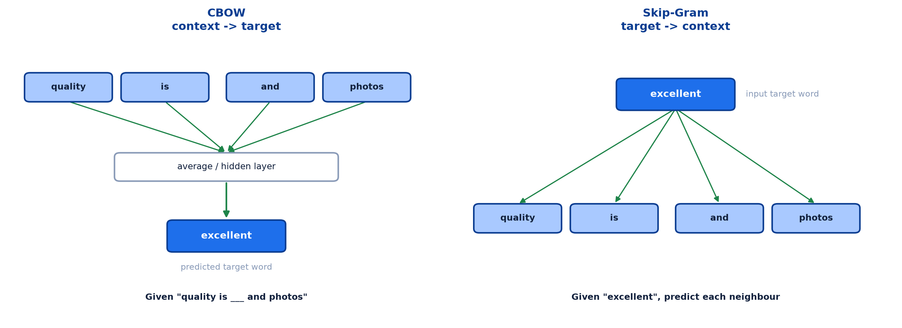
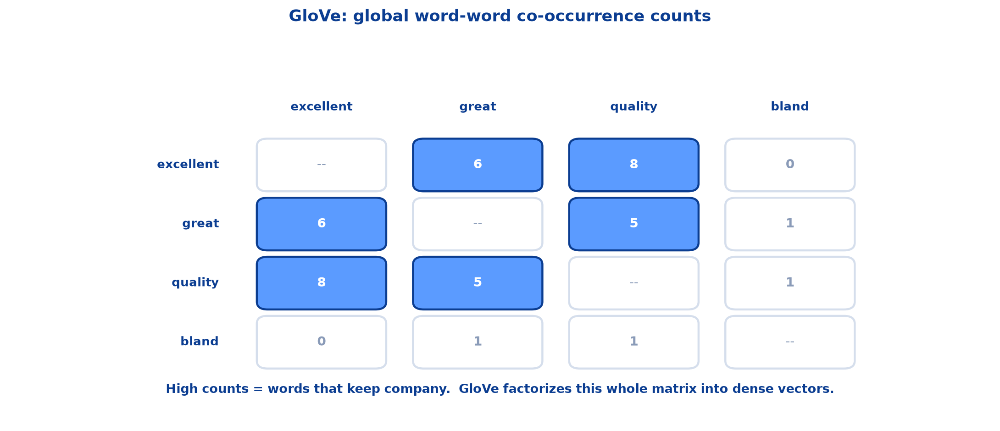
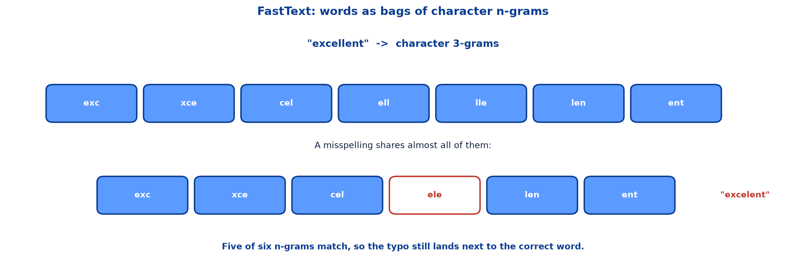
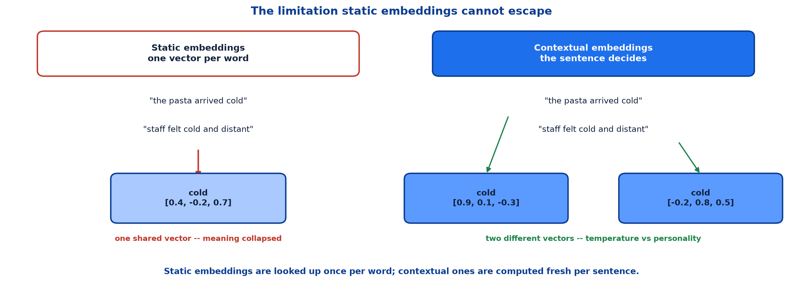
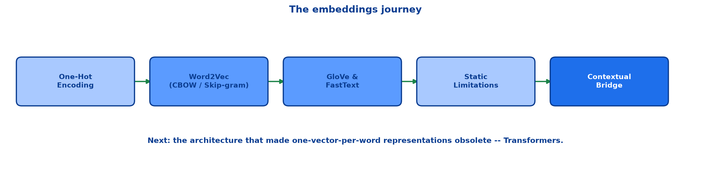

# <span style="color:#0B3D91">Word Embeddings</span>

> Study notes on representing meaning as geometry:
> **why counting was not enough** → **one-hot vs dense** → **the distributional hypothesis** →
> **Word2Vec (CBOW &amp; Skip-gram)** → **GloVe** → **FastText subwords** →
> **analogies &amp; cosine similarity** → **limits of static embeddings** →
> **contextual embeddings** → **sentence embeddings &amp; subword tokenization**.
>
> **A note on formulas:** equations are written in plain text inside code blocks rather than
> LaTeX, so they render correctly in any Markdown viewer.

---

## <span style="color:#1E6FEB">Table of Contents</span>

1. [Why Bag-of-Words Isn't Enough](#1-why-bag-of-words-isnt-enough)
2. [One-Hot vs Dense Embeddings](#2-one-hot-vs-dense-embeddings)
3. [The Distributional Hypothesis](#3-the-distributional-hypothesis)
4. [Word2Vec — CBOW &amp; Skip-Gram](#4-word2vec--cbow--skip-gram)
5. [GloVe — Global Vectors](#5-glove--global-vectors)
6. [FastText — Subword Embeddings](#6-fasttext--subword-embeddings)
7. [Embedding Arithmetic &amp; Cosine Similarity](#7-embedding-arithmetic--cosine-similarity)
8. [Limitations of Static Embeddings](#8-limitations-of-static-embeddings)
9. [From Static to Contextual](#9-from-static-to-contextual)
10. [Sentence Embeddings &amp; Subword Tokenization](#10-sentence-embeddings--subword-tokenization)
11. [Tools, Visualization &amp; Recap](#11-tools-visualization--recap)

---

## <span style="color:#1E6FEB">1. Why Bag-of-Words Isn't Enough</span>

### 1.1 Overview / What is it?

TF-IDF and BoW gave us numbers. They didn't give us **meaning**.

### 1.2 Why does it matter for AI?

A representation that cannot tell "excellent" from "chair" any better than it tells "excellent" from
"great" puts a hard ceiling on everything built above it.

### 1.3 Key Concepts

**TF-IDF / Bag-of-Words**

```text
-  Every word is an isolated dimension -- no notion of meaning
-  "excellent" and "great" are as unrelated as "excellent" and "chair"
-  Vectors are sparse and grow with vocabulary size
-  Cannot represent a word it has never seen before
```

**What Embeddings Give Us**

```text
+  Dense, fixed-size vectors (e.g. 300 numbers per word)
+  "excellent" and "great" land close together in vector space
+  Similarity becomes a distance we can measure
+  The foundation every Transformer is built on
```

### 1.4 Simple Example — the running dataset

These three reviews carry through the whole note:

```text
R1: The camera quality is excellent and photos look stunning in low light.
R2: Battery life is terrible, it barely lasts half a day.
R3: The waiter was friendly but the pasta arrived cold and bland.
```

### 1.5 How it works

An **embedding** maps every word to a dense vector of real numbers, learned so that words used in
similar contexts end up with similar vectors.

```text
"excellent" as a vector:

  0.81
 -0.22
  0.55
  0.09
 -0.63
  0.37
```

Each dimension captures a latent aspect of meaning learned from data — **no single one is
human-labeled**. You cannot point at dimension 3 and call it "positivity."

### 1.6 Practical Example / Use Case

This is why a TF-IDF search for "affordable laptop" misses a product described as "cheap notebook" —
zero shared terms, zero similarity. Embeddings close that gap.

### 1.7 Key Takeaways

> - BoW and TF-IDF produce numbers without meaning.
> - Every word is an isolated dimension; similarity is invisible.
> - Embeddings are **dense, fixed-size** vectors where similar words land close together.
> - Dimensions are learned latent features, not human-labelled categories.

---

## <span style="color:#1E6FEB">2. One-Hot vs Dense Embeddings</span>

### 2.1 Overview / What is it?

Two ways to turn a word into numbers.

### 2.2 Why does it matter for AI?

One-hot encoding is the honest baseline. Seeing exactly how it fails motivates everything that
follows.

### 2.3 Key Concepts

| | One-Hot Encoding | Dense Embedding |
|---|---|---|
| **Length** | Vector length = vocabulary size (often 20,000+) | Fixed and small (e.g. 100–300) |
| **Contents** | Exactly one 1, everywhere else 0 | Every dimension carries real-valued information |
| **Similarity** | Every word is equally distant from every other word | Similar words → similar vectors → close in space |
| **Structure** | No shared structure between related words | Generalizes across the whole vocabulary |

```text
one-hot:  excellent = [0, 0, 1, 0, 0, ..., 0]
dense:    excellent = [0.81, -0.22, 0.55, 0.09, ...]
```

### 2.4 Simple Example

The damning property of one-hot vectors:

```text
distance(excellent, great)  ==  distance(excellent, chair)
```

Every pair of distinct words is *exactly* equally far apart. The encoding contains no information
about relatedness whatsoever — it is a glorified row number.

### 2.5 How it works

Dense vectors also fix the size problem. A 20,000-word vocabulary needs 20,000 one-hot dimensions but
only 300 dense ones — and all 300 are informative, rather than 19,999 zeros.

### 2.6 Practical Example / Use Case

Because dense vectors share structure, learning that "excellent" signals positive sentiment
automatically transfers some of that knowledge to "great" and "brilliant". One-hot encoding forces
the model to learn each word from scratch.

### 2.7 Key Takeaways

> - One-hot: vocabulary-length, single 1, all words equidistant.
> - Dense: 100–300 dimensions, all informative, similar words nearby.
> - One-hot carries **no** similarity information at all.
> - Dense vectors generalize learning across related words.

---

## <span style="color:#1E6FEB">3. The Distributional Hypothesis</span>

### 3.1 Overview / What is it?

> **You shall know a word by the company it keeps.**

Words that appear in similar contexts tend to have similar meaning. Word2Vec turns that idea into a
training signal.

### 3.2 Why does it matter for AI?

It answers the obvious question: where would meaning *come from*? Nobody hand-labels millions of
words. The answer is that meaning is inferable from usage alone.

### 3.3 Key Concepts

A **context window** around a target word:

```text
quality  is  [excellent]  and  photos
\_____________/         \___________/
   2 words before        2 words after

Context window (window size = 2) around the target word "excellent".
```

### 3.4 Simple Example

What the model learns:

```text
- Words like "excellent", "stunning", and "great" recur near positive product
  descriptions across many reviews
- Over millions of such windows, the model pulls their vectors closer together
```

### 3.5 How it works

No single window teaches the model much. The signal emerges from **repetition at scale** — the same
words showing up in the same kinds of neighbourhoods, millions of times over.

### 3.6 Practical Example / Use Case

This is also why embeddings inherit the biases of their training corpus. If a corpus consistently
places certain professions near certain genders, the vectors will encode that association. The method
learns what the data shows, including the parts you would rather it did not.

### 3.7 Key Takeaways

> - **Distributional hypothesis:** similar contexts imply similar meaning.
> - A **context window** defines how many neighbours count as "nearby".
> - Meaning emerges from millions of repeated co-occurrences.
> - Embeddings reflect corpus biases as faithfully as they reflect meaning.

---

## <span style="color:#1E6FEB">4. Word2Vec — CBOW &amp; Skip-Gram</span>

### 4.1 Overview / What is it?

Word2Vec (Google, 2013) is the most famous embedding model. It comes in two flavours — **same model
family, two different prediction directions**.



### 4.2 Why does it matter for AI?

Word2Vec made high-quality embeddings cheap enough to train on billions of words, which is what moved
them from research curiosity to standard tooling.

### 4.3 Key Concepts — CBOW

**CBOW (Continuous Bag of Words)** — predict the missing target word from the words around it.

```text
Task:  Given "quality is ___ and photos", predict "excellent"

  quality  is  and  photos
        \   |   |   /
      average / hidden layer
              |
          excellent          <- predicted target word
```

### 4.4 Key Concepts — Skip-Gram

**Skip-Gram** — given the target word, predict each surrounding context word.

```text
Task:  Given "excellent", predict "quality", "is", "and", "photos"

          excellent          <- input target word
        /   |   |   \
  quality  is  and  photos
```

### 4.5 Simple Example — comparison

| | CBOW | Skip-Gram |
|---|---|---|
| **Direction** | Context → Target | Target → Context |
| **Training speed** | Faster (fewer predictions per window) | Slower (multiple predictions per word) |
| **Best for** | Frequent words, larger corpora | Rare words, smaller datasets |
| **Typical use** | Quick baseline embeddings | Higher-quality rare-word vectors |

### 4.6 How it works

The speed difference follows directly from the arrow counts. CBOW makes **one** prediction per
window; Skip-gram makes **one per context word** — four times the work for a window of size 2.

That extra work is also why Skip-gram handles rare words better: a rare word gets several training
signals from a single appearance rather than being averaged away into a context blob.

### 4.7 Practical Example / Use Case

The vectors themselves are a **by-product**. Nobody actually wants to predict missing words — the
prediction task is scaffolding. Once training finishes, the task is thrown away and the learned
weights become the embeddings.

**Negative sampling** is the trick that made this practical: instead of scoring the entire
vocabulary on every step, the model scores the correct word plus a small handful of random wrong
ones.

### 4.8 Key Takeaways

> - Word2Vec (Google, 2013) is the most famous embedding model.
> - **CBOW**: context → target. Faster, better for frequent words and large corpora.
> - **Skip-gram**: target → context. Slower, better for rare words and small datasets.
> - The prediction task is scaffolding; the **weights** are the real output.
> - **Negative sampling** makes training tractable.

---

## <span style="color:#1E6FEB">5. GloVe — Global Vectors</span>

### 5.1 Overview / What is it?

**GloVe** (Stanford, 2014) learns from how often word pairs co-occur across the **whole corpus**.

Instead of sliding a local window one sentence at a time, GloVe first builds a global word-word
co-occurrence count, then factorizes it into dense vectors.



### 5.2 Why does it matter for AI?

Word2Vec sees the corpus one window at a time and never steps back. GloVe starts from the aggregate
statistics — a different route to the same destination.

### 5.3 Key Concepts — co-occurrence counts

```text
            excellent  great  quality  bland
excellent       --        6       8       0
great            6       --       5       1
quality          8        5      --       1
bland            0        1       1      --
```

Read row "excellent": it co-occurs with "quality" 8 times, "great" 6 times, and "bland" never. The
matrix already encodes that excellent-and-bland do not belong together.

### 5.4 Simple Example — why it works

```text
- Captures corpus-wide statistics, not just local windows
- Ratios of co-occurrence probabilities encode meaningful relationships
- Often trains faster than pure prediction-based methods
```

### 5.5 How it works — Word2Vec vs GloVe

| | Word2Vec | GloVe |
|---|---|---|
| **Approach** | Predictive (neural network) | Count-based (matrix factorization) |
| **Signal used** | Local context windows | Global co-occurrence statistics |
| **Training data view** | One window at a time | Whole corpus statistics up front |
| **Practical quality** | Excellent, especially with negative sampling | Comparable — strong on analogy tasks |

### 5.6 Practical Example / Use Case

The honest summary: **two roads to the same destination**. Both produce dense, meaningful vectors of
comparable quality. In practice the choice is usually made by which pretrained vectors are available
for your language and domain, not by a deep methodological preference.

### 5.7 Key Takeaways

> - GloVe (Stanford, 2014) factorizes a **global co-occurrence matrix**.
> - Word2Vec is predictive and local; GloVe is count-based and global.
> - **Ratios** of co-occurrence probabilities encode relationships.
> - Quality is comparable — pick by availability, not dogma.

---

## <span style="color:#1E6FEB">6. FastText — Subword Embeddings</span>

### 6.1 Overview / What is it?

**FastText** (Facebook, 2016) answers: what happens when a word has never been seen before?

It represents each word as a **bag of character n-grams**, so it can build a vector for words it has
never seen — typos, rare terms, new coinages.



### 6.2 Why does it matter for AI?

Word2Vec and GloVe both have a fixed vocabulary. Show them a word absent from training and they have
nothing — the **OOV (out-of-vocabulary) problem**. Real text is full of typos and new words.

### 6.3 Key Concepts

```text
"excellent"  ->  character 3-grams

   exc  xce  cel  ell  lle  len  ent
```

The word's vector is assembled from these pieces rather than looked up whole.

### 6.4 Simple Example

A misspelled review word still shares most of its n-grams:

```text
"excellent"  ->  exc  xce  cel  ell  lle  len  ent
"excelent"   ->  exc  xce  cel  ele       len  ent

shared: exc, xce, cel, len, ent   ->  5 of 6
```

Five of the typo's six n-grams match, so FastText still places it near the correct word.

### 6.5 How it works

Why it matters:

```text
- A misspelled review word like "excelent" still shares most of its n-grams
  with "excellent" -- FastText still places it nearby
- Especially valuable for morphologically rich languages and informal,
  typo-heavy text like customer reviews
```

### 6.6 Practical Example / Use Case

Customer reviews are exactly the informal, typo-heavy text FastText was built for. Morphologically
rich languages benefit too: a language with dozens of inflected forms per root gets shared subword
structure for free, rather than needing a separate vector for every form.

### 6.7 Key Takeaways

> - FastText (Facebook, 2016) represents words as **bags of character n-grams**.
> - This solves the **OOV problem** — unseen words still get sensible vectors.
> - `"excelent"` shares 5 of 6 trigrams with `"excellent"` and lands nearby.
> - Ideal for typo-heavy text and morphologically rich languages.

---

## <span style="color:#1E6FEB">7. Embedding Arithmetic &amp; Cosine Similarity</span>

### 7.1 Overview / What is it?

Vector directions capture **relationships**, not just similarity — and cosine similarity measures how
close two vectors are.

### 7.2 Why does it matter for AI?

Once relationships are directions, you can navigate meaning with addition and subtraction. And once
similarity is a number, you can rank, cluster and search by it.

### 7.3 Key Concepts — analogies

```text
The classic example
  "king" - "man" + "woman"  ~  "queen"

In our review domain
  "excellent" - "positive" + "negative"  ~  "terrible"
```

**Why this works:** the training process arranges vector space so that consistent semantic
relationships — gender, sentiment polarity, tense — become consistent **directions**. Adding or
subtracting a direction moves you from one concept to a related one.

### 7.4 Key Concepts — cosine similarity

How close are two word vectors, regardless of their length?

```text
                A · B
cos(theta)  =  ---------
               ||A|| ||B||
```

**Reading the score:**

```text
 1.0  = pointing the same direction (very similar)
 0.0  = unrelated
-1.0  = opposite meaning
```

### 7.5 Simple Example — worked scores

From the review dataset:

```text
"excellent" vs "great"   ->  0.87
"excellent" vs "bland"   ->  0.09
```

A strong match and near-total unrelatedness, expressed as two numbers a program can act on.

### 7.6 How it works

The "regardless of their length" part matters. Cosine measures the **angle** between vectors, not the
distance. A word appearing 10,000 times may have a longer vector than one appearing 50 times, but if
they point the same way they are still judged similar. Frequency does not masquerade as meaning.

### 7.7 Practical Example / Use Case

```python
from numpy import dot
from numpy.linalg import norm

def cosine_similarity(a, b):
    return dot(a, b) / (norm(a) * norm(b))
```

This one function underpins semantic search, recommendation, duplicate detection and clustering.

### 7.8 Key Takeaways

> - Consistent relationships become consistent **directions** in vector space.
> - `"king" - "man" + "woman" ~ "queen"`; `"excellent" - "positive" + "negative" ~ "terrible"`.
> - **Cosine similarity** = dot product divided by the product of magnitudes.
> - Scores: `1.0` identical direction, `0.0` unrelated, `-1.0` opposite.
> - Measuring angle rather than distance keeps frequency out of the similarity judgement.

---

## <span style="color:#1E6FEB">8. Limitations of Static Embeddings</span>

### 8.1 Overview / What is it?

**One vector per word — even when the word means different things.**



### 8.2 Why does it matter for AI?

This is the ceiling on everything covered so far, and the reason the next section exists.

### 8.3 Key Concepts — the "cold" problem

```text
R3:               "the pasta arrived cold"        -> temperature
another review:   "the staff felt cold and distant" -> personality
```

Word2Vec, GloVe, and FastText assign both uses the **exact same vector**.

### 8.4 Simple Example

The vector that gets learned is a blurry average of every sense — not quite temperature, not quite
personality, not quite right for either. The more meanings a word has, the worse the compromise.

### 8.5 How it works — the core limitation

```text
- Static embeddings are looked up once per word, independent of sentence
- No way to let surrounding context reshape the meaning
- This is exactly the gap contextual models were built to close
```

"Looked up once per word" is the crux. The embedding is a **dictionary lookup**: same key, same value,
every single time, regardless of what surrounds it.

### 8.6 Practical Example / Use Case

Recall word sense disambiguation from the language-levels note — "I went to the bank" needing context
to resolve. Static embeddings structurally *cannot* do that. They were never given the sentence.

### 8.7 Key Takeaways

> - Static embeddings assign **one vector per word**, whatever it means.
> - `"cold"` (temperature) and `"cold"` (personality) share a vector.
> - The vector becomes a blurry average of all senses.
> - Lookup is independent of the sentence — context cannot reshape meaning.

---

## <span style="color:#1E6FEB">9. From Static to Contextual</span>

### 9.1 Overview / What is it?

**Letting the sentence decide what a word means.**

### 9.2 Why does it matter for AI?

This is the conceptual bridge from classical embeddings to everything modern.

### 9.3 Key Concepts

**ELMo (2018)** was an early step: a bidirectional LSTM reads the full sentence and produces a
different vector for the same word depending on context.

```text
"the pasta arrived cold"          ->  cold = [0.9,  0.1, -0.3]
"staff felt cold and distant"     ->  cold = [-0.2, 0.8,  0.5]
```

Same word, **two different contextual vectors**, because the surrounding words differ.

### 9.4 Simple Example

```text
Static:      cold  ->  look up  ->  always the same vector
Contextual:  cold + its sentence  ->  compute  ->  a vector for this use
```

The shift is from **lookup** to **computation**.

### 9.5 How it works

ELMo reads the sentence in both directions with an LSTM — the architecture from the recurrent-network
material, applied to representation rather than prediction.

### 9.6 Practical Example / Use Case

**Where this leads:**

```text
- Transformers (next section) generalize this idea with self-attention --
  every word's representation is computed fresh, using the whole sentence
```

ELMo reads sequentially, so it inherits the RNN speed problem. Transformers keep the contextual idea
and discard the sequential bottleneck.

### 9.7 Key Takeaways

> - **Contextual embeddings** compute a fresh vector per occurrence.
> - **ELMo (2018)**: a bidirectional LSTM reads the whole sentence.
> - `"cold"` gets different vectors in different sentences.
> - The shift is from **lookup** to **computation**.
> - Transformers generalize this with self-attention.

---

## <span style="color:#1E6FEB">10. Sentence Embeddings &amp; Subword Tokenization</span>

### 10.1 Overview / What is it?

Two loose ends: combining word vectors into one representation, and how modern models split text in
the first place.

### 10.2 Why does it matter for AI?

Most real tasks compare whole sentences or documents, not isolated words. And every Transformer needs
a tokenization strategy before it can embed anything.

### 10.3 Key Concepts — sentence &amp; document embeddings

**Simple pooling**

```text
- Mean pooling: average every word vector in the review
- Max pooling:  take the strongest signal per dimension
- Fast and simple, but loses word order entirely
```

**Learned sentence encoders**

```text
- Doc2Vec:        extends Word2Vec with a document-level vector
- Sentence-BERT:  fine-tunes a Transformer for sentence similarity
```

### 10.4 Simple Example

Mean pooling reintroduces the bag-of-words problem one level up:

```text
"not good, quite bad"   and   "not bad, quite good"
```

Same words, same average, opposite meanings. Cheap, but it throws away order.

### 10.5 Key Concepts — Byte-Pair Encoding

**The bridge from word embeddings into every modern Transformer.**

Instead of one token per whole word, BPE / WordPiece iteratively merge the most frequent character
pairs, building a vocabulary of common subword pieces.

```text
"unbelievably"  ->  un  believ  ably
```

**Why Transformers use it:**

```text
- Fixed, manageable vocabulary size, no matter the language
- Handles rare and unseen words the same way FastText's n-grams do
- The direct predecessor to the tokenization used in BERT, GPT,
  and every model in the next section
```

### 10.6 Practical Example / Use Case

BPE is a neat compromise between two bad extremes. Character-level tokenization gives tiny vocabulary
but very long sequences; word-level gives short sequences but an unbounded vocabulary. Subwords give
a fixed vocabulary *and* manageable sequence length, with graceful handling of unknown words.

### 10.7 Key Takeaways

> - **Mean/max pooling** combines word vectors cheaply but loses order.
> - **Doc2Vec** and **Sentence-BERT** learn sentence representations properly.
> - **BPE / WordPiece** merge frequent character pairs into subword tokens.
> - Subwords give a fixed vocabulary and graceful handling of unseen words.
> - This is the tokenization used by BERT, GPT and every modern Transformer.

---

## <span style="color:#1E6FEB">11. Tools, Visualization &amp; Recap</span>

### 11.1 Overview / What is it?

What you will actually reach for, and how to look at what you built.

### 11.2 Key Concepts — popular tools

| Tool | What it gives you |
|---|---|
| **Gensim** | Train Word2Vec, GloVe & FastText models from scratch |
| **spaCy** | Ready-to-use pretrained word vectors, tightly integrated into NLP pipelines |
| **HuggingFace** | Contextual embeddings from pretrained Transformer models |
| **scikit-learn** | TF-IDF baselines and classical vectorizers for comparison |

That last row matters more than it looks. Always keep a TF-IDF baseline — if embeddings do not beat
it on your task, that is worth knowing before you ship the heavier model.

### 11.3 Simple Example — visualizing embeddings

Projecting high-dimensional vectors down to 2D with **t-SNE** or **PCA**:

```text
What to notice
- Positive-sentiment words cluster together
- Negative-sentiment words form their own cluster
- Product-noun words group separately from sentiment words
- Distance in this plot reflects distance in the real high-dimensional space
```

```text
excellent  great  brilliant        <- positive cluster
terrible  bland  cold              <- negative cluster
camera  battery  pasta             <- product nouns
```

### 11.4 How it works

A 300-dimensional space cannot be drawn, so t-SNE or PCA squashes it to two dimensions for
inspection. Treat the picture as indicative rather than exact — projection always loses information.

### 11.5 Practical Example / Use Case — the journey



```text
One-Hot Encoding
  -> Word2Vec (CBOW / Skip-gram)
  -> GloVe & FastText
  -> Static Limitations
  -> Contextual Bridge
```

**Next: the architecture that made static, one-vector-per-word representations obsolete —
Transformers.**

### 11.6 Key Takeaways

> - **Gensim** trains from scratch; **spaCy** ships pretrained vectors; **HuggingFace** provides
>   contextual ones; **scikit-learn** keeps you honest with a TF-IDF baseline.
> - **t-SNE** and **PCA** project embeddings to 2D for inspection.
> - Sentiment words and product nouns form visibly separate clusters.
> - The journey runs one-hot → Word2Vec → GloVe/FastText → limitations → contextual.

---

## <span style="color:#1E6FEB">Summary — Word Embeddings at a Glance</span>

```text
one-hot -> Word2Vec -> GloVe / FastText -> static limits -> contextual
```

| Term | Meaning |
|---|---|
| Embedding | Dense learned vector representing a word's meaning |
| One-hot | Vocabulary-length vector with a single 1 |
| Distributional hypothesis | Similar contexts imply similar meaning |
| Context window | How many neighbouring words count as context |
| CBOW | Predict target from context |
| Skip-gram | Predict context from target |
| Negative sampling | Scoring a few wrong words instead of the whole vocabulary |
| Co-occurrence matrix | Counts of how often word pairs appear together |
| Character n-gram | A subword fragment used by FastText |
| OOV | Out-of-vocabulary — a word unseen in training |
| Cosine similarity | Angle-based closeness between two vectors |
| Static embedding | One fixed vector per word |
| Contextual embedding | A fresh vector computed per occurrence |
| Mean pooling | Averaging word vectors into a sentence vector |
| BPE / WordPiece | Subword tokenization by merging frequent character pairs |

**The one-sentence version:** Word embeddings replace isolated word counts with dense vectors learned
from context — Word2Vec predicting locally, GloVe counting globally, FastText building words from
character n-grams — so that meaning becomes measurable geometry, until the one-vector-per-word
assumption breaks on words like "cold" and contextual models take over.

**Where this leads:** the next note opens the Transformer architecture — why attention replaced
recurrence, and how Query, Key and Value vectors let every word look at every other word at once.

---

> **Navigation:** ← Previous: [05 — Demo 1: Preprocessing &amp; Linguistic Analysis Walkthrough](05_NLP_Demo1_Preprocessing_Pipeline_Walkthrough.md) · Next → 07 — Transformers: Self-Attention
