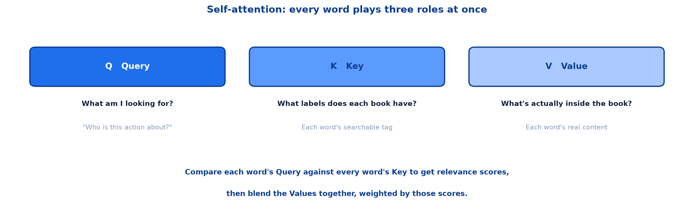
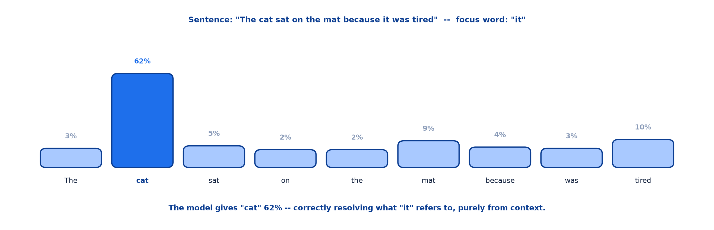
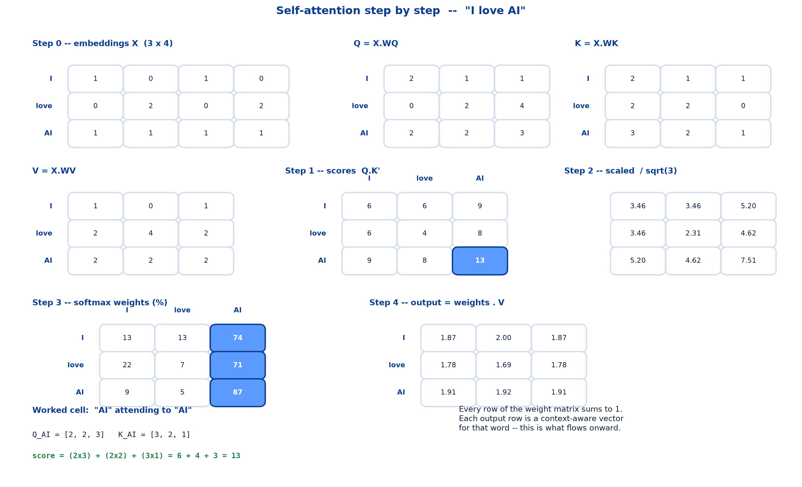
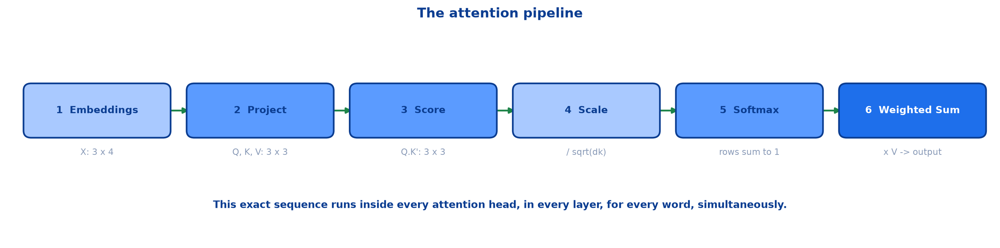
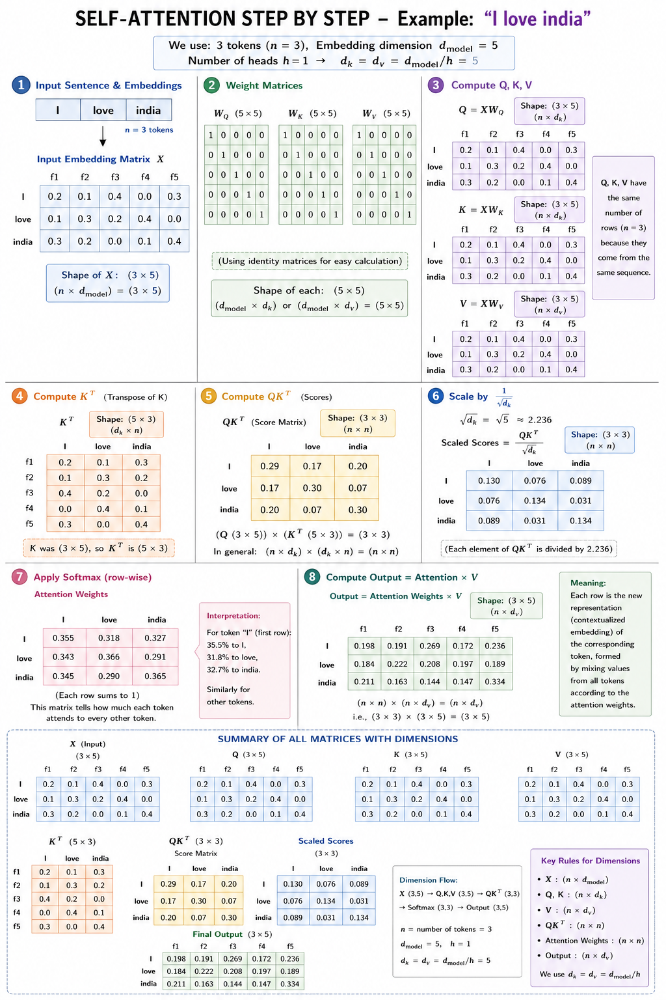

# <span style="color:#0B3D91">Transformers &amp; Self-Attention</span>

> Study notes on the architecture that replaced recurrence:
> **why we need Transformers** → **the six building blocks** → **tokenization &amp; embeddings** →
> **positional encoding** → **Query, Key, Value** → **the attention formula** →
> **a full numeric walkthrough** → **the pipeline, start to finish**.
>
> **A note on formulas:** equations are written in plain text inside code blocks rather than
> LaTeX, so they render correctly in any Markdown viewer.

---

## <span style="color:#1E6FEB">Table of Contents</span>

1. [Why Do We Need Transformers?](#1-why-do-we-need-transformers)
2. [The Six Building Blocks](#2-the-six-building-blocks)
3. [Block 1 — Tokenization &amp; Embeddings](#3-block-1--tokenization--embeddings)
4. [Block 2 — Positional Encoding](#4-block-2--positional-encoding)
5. [Block 3 — Self-Attention: Query, Key, Value](#5-block-3--self-attention-query-key-value)
6. [The Attention Formula](#6-the-attention-formula)
7. [Attention in Action](#7-attention-in-action)
8. [Numeric Walkthrough — Setting Up](#8-numeric-walkthrough--setting-up)
9. [Numeric Walkthrough — Scores, Scaling &amp; Softmax](#9-numeric-walkthrough--scores-scaling--softmax)
10. [Numeric Walkthrough — The Final Output](#10-numeric-walkthrough--the-final-output)
11. [The Full Pipeline, Start to Finish](#11-the-full-pipeline-start-to-finish)

---

## <span style="color:#1E6FEB">1. Why Do We Need Transformers?</span>

### 1.1 Overview / What is it?

**The Old Way: Reading One Word at a Time.** RNNs process a sentence step by step, like reading with
your finger under each word. Each word must wait for the one before it.

```text
The -> cat -> sat -> on -> the -> mat
```

Slow, sequential — and by word 6, earlier context starts to fade.

### 1.2 Why does it matter for AI?

Three concrete problems:

```text
- No parallel computation -- must wait for each step
- Long sentences lose track of early context
- Training is slow on long sequences
```

### 1.3 Key Concepts

**The New Way: Reading All Words at Once.** Transformers look at every word simultaneously and let
attention decide which words matter to each other.

```text
The   cat   sat   on   the   mat
 |     |     |    |     |     |
 +-----+-----+----+-----+-----+
     all words connect directly
```

All words connect directly — no waiting in line.

### 1.4 Simple Example

```text
RNN:          word 6 can only see word 1 through five intermediate hand-offs
Transformer:  word 6 looks straight at word 1 in a single step
```

The vanishing-gradient problem that plagued RNNs largely disappears because the path length between
any two words is now **one**, not *n*.

### 1.5 How it works

Removing the sequential dependency is what unlocks GPU parallelism. An RNN must finish step 1 before
starting step 2; a Transformer computes all positions at once. That single change is what made
training on internet-scale corpora practical.

### 1.6 Practical Example / Use Case

The trade-off is honest: attention compares every word with every other word, so cost grows with the
**square** of sequence length. Transformers bought parallelism and long-range memory at the price of
quadratic attention cost — a bargain that turned out to be very much worth making.

### 1.7 Key Takeaways

> - RNNs read sequentially — slow, and early context fades.
> - Transformers process **all words at once**, connected directly.
> - Path length between any two words becomes 1.
> - Parallelism is the practical win; quadratic cost is the price.

---

## <span style="color:#1E6FEB">2. The Six Building Blocks</span>

### 2.1 Overview / What is it?

Six simple ideas combine to form the full Transformer.

| # | Block | What it does |
|---|---|---|
| 1 | **Tokenization & Embeddings** | Turn tokens into number vectors |
| 2 | **Positional Encoding** | Tell the model the word order |
| 3 | **Self-Attention** | Words look at other words |
| 4 | **Multi-Head Attention** | Several views at once |
| 5 | **Feed-Forward Network** | Each word "thinks" on its own |
| 6 | **Residuals & Normalization** | Keeps deep stacks stable |

### 2.2 Why does it matter for AI?

None of these six is individually complicated. The Transformer's reputation for difficulty comes from
seeing all six at once — so we take them one at a time.

### 2.3 Key Concepts

This note covers blocks **1, 2 and 3**. Blocks 4, 5 and 6 follow in the next note.

### 2.4 Key Takeaways

> - Six blocks: embeddings, positional encoding, self-attention, multi-head attention,
>   feed-forward, residuals & normalization.
> - Each is simple on its own.
> - This note covers the first three.

---

## <span style="color:#1E6FEB">3. Block 1 — Tokenization &amp; Embeddings</span>

### 3.1 Overview / What is it?

Models can only do math, so every word is first split into tokens, then converted into a list of
numbers (a vector) that captures its meaning.

### 3.2 Why does it matter for AI?

This is the embeddings note, arriving as block 1 of the architecture. Nothing new — but it is where
every Transformer starts.

### 3.3 Key Concepts

```text
Example: "I love pizza"

I      ->  [ 0.12, -0.44,  0.81,  0.03]
love   ->  [ 0.77,  0.29, -0.18,  0.55]
pizza  ->  [-0.31,  0.62,  0.44, -0.09]
```

Words with similar meanings end up with similar vectors — this is how the model represents meaning
mathematically.

### 3.4 Simple Example

Modern Transformers use **subword** tokenization (BPE / WordPiece) rather than whole words, so rare
words split into familiar pieces instead of becoming unknowns.

### 3.5 Key Takeaways

> - Every token becomes a vector before anything else happens.
> - Similar meanings produce similar vectors.
> - Subword tokenization handles rare and unseen words.

---

## <span style="color:#1E6FEB">4. Block 2 — Positional Encoding</span>

### 4.1 Overview / What is it?

**Self-attention alone has no sense of order** — it would treat a sentence like a bag of words.
Positional encoding adds "position" information into each embedding.

### 4.2 Why does it matter for AI?

**Order Changes Meaning:**

```text
"Dog bites man"  -- ordinary news
"Man bites dog"  -- that's the headline!
```

The same words in a different order mean something entirely different. Attention compares every word
with every other word, but nothing in that comparison says which came first.

### 4.3 Key Concepts — how position gets added in

```text
   Word Embedding            Positional Encoding          Final Input Vector
  meaning of "cat"     +    "position 2 in sentence"  =  meaning + position
```

Now the model knows both **what** each word means and **where** it sits in the sentence.

### 4.4 Simple Example

Each position gets its own unique numeric pattern, so "word 1" and "word 8" never look identical.

```text
position 1  ->  [0.00, 1.00, 0.00, 1.00, ...]
position 2  ->  [0.84, 0.54, 0.01, 1.00, ...]
position 8  ->  [0.99, -0.15, 0.08, 1.00, ...]
```

### 4.5 How it works

Note that position is **added** to the embedding, not concatenated. The vector stays the same size —
the positional pattern is mixed into the existing dimensions rather than appended alongside them.

### 4.6 Practical Example / Use Case

This is the price of parallelism. RNNs got word order for free by reading in sequence. Transformers
gave up sequential reading, so order has to be injected explicitly.

### 4.7 Key Takeaways

> - Self-attention is order-blind without help — it sees a bag of words.
> - `"Dog bites man"` vs `"Man bites dog"` — order changes meaning.
> - Positional encoding is **added** to the word embedding.
> - Each position has a unique numeric pattern.

---

## <span style="color:#1E6FEB">5. Block 3 — Self-Attention: Query, Key, Value</span>

### 5.1 Overview / What is it?

Every word plays three roles at once. Think of it like searching a library.



### 5.2 Why does it matter for AI?

Q, K and V are the part of Transformers that sounds most arbitrary until the analogy lands. Once it
does, the formula reads like plain English.

### 5.3 Key Concepts

| Role | Library question | In the model |
|---|---|---|
| **Q — Query** | What am I looking for? | "Who is this action about?" |
| **K — Key** | What labels does each book have? | Each word's searchable "tag" |
| **V — Value** | What's actually inside the book? | Each word's real content |

### 5.4 Simple Example

**How it works:** Every word turns into a Query, a Key, and a Value. The model compares each word's
Query against every word's Key to get a relevance score, then blends the Values together, weighted by
those scores.

```text
1. I have a Query -- what am I looking for?
2. I check it against every word's Key -- who matches?
3. I collect their Values -- weighted by how well they matched
```

### 5.5 How it works

All three come from the **same** input vector, multiplied by three different learned weight matrices:

```text
Q = X . WQ      K = X . WK      V = X . WV
```

The word does not choose its roles — the learned matrices `WQ`, `WK` and `WV` decide what each word
asks for, advertises, and contributes.

### 5.6 Practical Example / Use Case

Because Q, K and V all come from the same sequence, this is called **self**-attention. When queries
come from one sequence and keys/values from another, it is cross-attention — covered in the next note.

### 5.7 Key Takeaways

> - Every word simultaneously produces a **Query**, a **Key** and a **Value**.
> - Query = what I'm looking for; Key = my searchable tag; Value = my actual content.
> - Compare Queries to Keys for scores, then blend Values by those scores.
> - `Q = X.WQ`, `K = X.WK`, `V = X.WV` — three learned projections of the same input.

---

## <span style="color:#1E6FEB">6. The Attention Formula</span>

### 6.1 Overview / What is it?

```text
                              Q . K'
Attention(Q, K, V) = softmax( ------ ) . V
                              sqrt(dk)
```

### 6.2 Why does it matter for AI?

Every Transformer in existence runs this one line, millions of times. It is worth reading slowly.

### 6.3 Key Concepts — four steps

**1. `Q.K'` — Similarity Scores.** Multiply each word's Query vector by every word's Key vector (dot
product). This produces a raw relevance score between every pair of words in the sentence.

**2. `÷ sqrt(dk)` — Scaling.** Divide every score by the square root of the key dimension. Without
this, large dot products push softmax into regions with tiny gradients, slowing learning.

**3. `softmax()` — Normalize.** Convert the scaled scores into probabilities that sum to 1 across
each row. These are the final attention weights — how much focus each word gets.

**4. `× V` — Weighted Sum.** Multiply each attention weight by its corresponding Value vector and sum
them up. The result is a new, context-aware representation for each word.

### 6.4 Simple Example

```text
dk = dimension of the Key vectors (commonly 64 per attention head)
```

Scaling keeps training stable as this dimension grows.

### 6.5 How it works

Why scaling is not optional: the dot product of two `dk`-dimensional vectors grows roughly with
`dk`. Larger scores make softmax increasingly peaked — one weight near 1, the rest near 0 — and in
that regime gradients nearly vanish. Dividing by `sqrt(dk)` holds the scores in a range where softmax
stays responsive.

### 6.6 Practical Example / Use Case

Read the formula as a sentence: *score every pair, calm the scores down, turn them into percentages,
then mix the content accordingly.*

### 6.7 Key Takeaways

> - `Attention(Q,K,V) = softmax(Q.K' / sqrt(dk)) . V`.
> - **Score** with dot products, **scale** by `sqrt(dk)`, **normalize** with softmax, **mix** the Values.
> - Scaling prevents softmax saturation and vanishing gradients.
> - `dk` is commonly 64 per attention head.

---

## <span style="color:#1E6FEB">7. Attention in Action</span>

### 7.1 Overview / What is it?

A trained model resolving a pronoun, purely from context.

```text
Sentence: "The cat sat on the mat because it was tired"
Focus word: "it"
```



### 7.2 Why does it matter for AI?

This is the payoff made visible. No grammar rule was written; the weights emerged from training.

### 7.3 Key Concepts

Attention weights from "it" to every other word:

```text
The       3%
cat      62%   <-- highest
sat       5%
on        2%
the       2%
mat       9%
because   4%
was       3%
tired    10%
```

### 7.4 Simple Example

The model gives **"cat" the highest attention score (62%)** — correctly resolving what "it" refers
to, purely from context.

Note the runners-up: `mat` (9%) and `tired` (10%). Both are plausible — "mat" is the other candidate
noun, and "tired" is the property being attributed. The model considered them and still chose
correctly.

### 7.5 How it works

This is **coreference resolution**, a classically hard NLP problem, falling out as a by-product of
the attention mechanism rather than being solved by a dedicated component.

### 7.6 Key Takeaways

> - Attention weights show where each word looks.
> - `"it"` gives 62% of its attention to `"cat"` — correct coreference.
> - Plausible alternatives receive smaller but non-zero weight.
> - Nobody programmed this rule; it emerged from training.

---

## <span style="color:#1E6FEB">8. Numeric Walkthrough — Setting Up</span>

### 8.1 Overview / What is it?

Let's compute real Query, Key, and Value matrices by hand for the sentence **"I love AI"**.



### 8.2 Why does it matter for AI?

Every number below is small enough to check on paper. Once you have followed it once, the formula
stops being mysterious.

### 8.3 Key Concepts — Step 0: word embeddings (X)

Each word is already a 4-number vector:

```text
        X  (3 x 4)
I      1  0  1  0
love   0  2  0  2
AI     1  1  1  1
```

### 8.4 Simple Example — the learned weight matrices

During training, the model learns three weight matrices that project embeddings into Query, Key, and
Value space:

```text
     WQ (4x3)        WK (4x3)        WV (4x3)
    1  0  1         1  1  0         1  0  0
    0  1  1         0  1  0         1  1  0
    1  1  0         1  0  1         0  0  1
    0  0  1         1  0  0         0  1  1
```

```text
(3 x 4) embeddings  x  (4 x 3) weights  =  (3 x 3) Q, K, V matrices -- one row per word
```

### 8.5 How it works — Step 1: compute Q, K, V

```text
Q = X . WQ          K = X . WK          V = X . WV

   Q -- Query          K -- Key            V -- Value
I     2  1  1       I     2  1  1       I     1  0  1
love  0  2  4       love  2  2  0       love  2  4  2
AI    2  2  3       AI    3  2  1       AI    2  2  2
```

Checking one row by hand — `love` has embedding `[0, 2, 0, 2]`:

```text
Q_love = 0*[1,0,1] + 2*[0,1,1] + 0*[1,1,0] + 2*[0,0,1]
       = [0,0,0] + [0,2,2] + [0,0,0] + [0,0,2]
       = [0, 2, 4]
```

### 8.6 Practical Example / Use Case

Three interpretations of the same word, each serving a different purpose:

```text
Q -- "What am I looking for?"
K -- "What do I offer?"
V -- "What's my actual content?"
```

### 8.7 Key Takeaways

> - `X` is `(3 x 4)`: three words, four embedding dimensions.
> - `WQ`, `WK`, `WV` are `(4 x 3)` learned projections.
> - `Q`, `K`, `V` each come out `(3 x 3)` — one row per word.
> - All three derive from the **same** input via different matrices.

---

## <span style="color:#1E6FEB">9. Numeric Walkthrough — Scores, Scaling &amp; Softmax</span>

### 9.1 Overview / What is it?

Every word's Query is compared against every word's Key using a dot product — producing a 3×3 score
matrix.

### 9.2 Key Concepts — Step 2: similarity scores

Worked example, **"AI" attending to "AI"**:

```text
Q_AI = [2, 2, 3]      K_AI = [3, 2, 1]

score = (2x3) + (2x2) + (3x1)
      =   6   +   4   +   3
      =  13
```

Full score matrix `Q . K'`:

```text
         I   love   AI
I        6     6     9
love     6     4     8
AI       9     8    13
```

**Notice:** "AI" scores highest with itself (13) — and fairly high with "love" (8), since both carry
related meaning in this toy example. Raw scores aren't bounded yet; that's what scaling and softmax
fix next.

### 9.3 Simple Example — Step 3: scaling

Divide by `sqrt(dk) = sqrt(3) ≈ 1.73`:

```text
Raw Scores              Scaled Scores
I     6   6   9         I     3.46  3.46  5.20
love  6   4   8    ->   love  3.46  2.31  4.62
AI    9   8  13         AI    5.20  4.62  7.51
```

### 9.4 How it works — Step 4: softmax

Apply softmax to each row so weights sum to 1:

```text
Attention Weights
         I   love   AI
I       13%   13%   74%
love    22%    7%   71%
AI       9%    5%   86%
```

Each row now sums to 1.00 — these are the final attention weights.

### 9.5 Practical Example / Use Case

Both "I" and "AI" end up focusing most on **"AI"** — it carries the most distinctive meaning in this
sentence.

Notice what softmax did to the gap. Raw scores of 9 and 13 are only 1.4× apart; after scaling and
softmax the weights are 9% and 86%, nearly 10× apart. **Softmax exaggerates differences** — that is
how attention becomes selective rather than mushy.

### 9.6 Key Takeaways

> - Scores are dot products of every Query with every Key.
> - `"AI"` scores 13 with itself — the highest in the matrix.
> - Divide by `sqrt(3) ≈ 1.73` to scale.
> - Softmax turns each row into weights summing to 1, exaggerating the differences.

---

## <span style="color:#1E6FEB">10. Numeric Walkthrough — The Final Output</span>

### 10.1 Overview / What is it?

Multiply the attention weights by V and sum — producing a new, context-aware vector for every word.

### 10.2 Key Concepts — worked example for "AI"

```text
weights = [0.09, 0.05, 0.87]

output = 0.09 x V_I  +  0.05 x V_love  +  0.87 x V_AI
       = 0.09[1,0,1] + 0.05[2,4,2]     + 0.87[2,2,2]
       ~ [1.91, 1.92, 1.91]
```

> **A note on rounding:** the weights shown as `0.09`, `0.05`, `0.87` are rounded from
> `0.086`, `0.048`, `0.866`. The rounded trio sums to 1.01 rather than 1.00, so multiplying them out
> literally gives `[1.93, 1.94, 1.93]`. The full-precision weights give `[1.91, 1.92, 1.91]`, which
> is the value carried forward. Worth knowing so the small discrepancy does not look like an error.

### 10.3 Simple Example — final context-aware vectors

```text
I      1.87   2.00   1.87
love   1.78   1.69   1.78
AI     1.91   1.92   1.91
```

### 10.4 How it works

**This is the payoff:** each word's original embedding has been replaced with a new vector that
blends in context from every other word — weighted by relevance. This is what flows into the next
layer.

Compare where "AI" started and where it ended:

```text
before:  V_AI   = [2.00, 2.00, 2.00]     its own content only
after:   out_AI = [1.91, 1.92, 1.91]     content + a little "I" and "love"
```

### 10.5 Practical Example / Use Case

The three output rows sit close together because this toy example has few words and near-identical
Value vectors. In a real model with hundreds of dimensions and a full sentence, the outputs diverge
substantially — that divergence is the contextual information.

### 10.6 Key Takeaways

> - Output = attention weights × V, summed.
> - Each word's vector becomes a weighted blend of every word's content.
> - The original embedding is **replaced** by a context-aware one.
> - This output is what feeds the next layer.

---

## <span style="color:#1E6FEB">11. The Full Pipeline, Start to Finish</span>

### 11.1 Overview / What is it?

The whole computation in six stages.



### 11.2 Key Concepts

```text
1  Embeddings     X: 3 x 4
2  Project        Q, K, V: 3 x 3
3  Score          Q.K': 3 x 3
4  Scale          / sqrt(dk)
5  Softmax        weights sum to 1
6  Weighted Sum   x V -> output
```

### 11.3 Simple Example — same math, every layer

> This exact sequence — **project, score, scale, softmax, weighted sum** — runs inside every
> attention head, in every layer, for every word, simultaneously.

### 11.4 How it works

Multi-head attention just repeats this whole pipeline several times in parallel with different
learned weight matrices, then combines the results. In this simplified attention calculation, `WQ`,
`WK` and `WV` are the learned projection matrices.

### 11.5 Practical Example / Use Case

A detailed reference diagram of the same computation, with a different example sentence and
per-matrix dimension annotations:



### 11.6 Key Takeaways

> - Six stages: embeddings → project → score → scale → softmax → weighted sum.
> - The same sequence runs in every head, every layer, for every word.
> - Multi-head attention repeats it in parallel with different weights.
> - Only `WQ`, `WK` and `WV` are learned; the rest is fixed arithmetic.

---

## <span style="color:#1E6FEB">Summary — Self-Attention at a Glance</span>

```text
Attention(Q, K, V) = softmax( Q.K' / sqrt(dk) ) . V
```

| Term | Meaning |
|---|---|
| Self-attention | Every word attends to every word in the same sequence |
| Query (Q) | What this word is looking for |
| Key (K) | What this word advertises to others |
| Value (V) | What this word actually contributes |
| `WQ`, `WK`, `WV` | Learned projection matrices |
| `Q.K'` | Raw similarity scores between all word pairs |
| `dk` | Key dimension — commonly 64 per head |
| Scaling | Dividing by `sqrt(dk)` to keep softmax responsive |
| Attention weights | Softmax-normalised scores; each row sums to 1 |
| Positional encoding | Position information added into each embedding |
| Context-aware vector | The output — a word's meaning blended with its context |

**The one-sentence version:** Self-attention gives every word a Query, a Key and a Value, scores
each word's Query against every Key, scales and softmaxes those scores into weights that sum to one,
and blends the Values accordingly — so each word's representation is rebuilt from the whole sentence
at once, with no sequential reading required.

**Where this leads:** the next note completes the architecture — multi-head attention, attention
variants, the feed-forward network, and the residuals and normalization that keep deep stacks stable.

---

> **Navigation:** ← Previous: [06 — Word Embeddings](06_NLP_Word_Embeddings.md) · Next → 08 — Transformer Architecture
