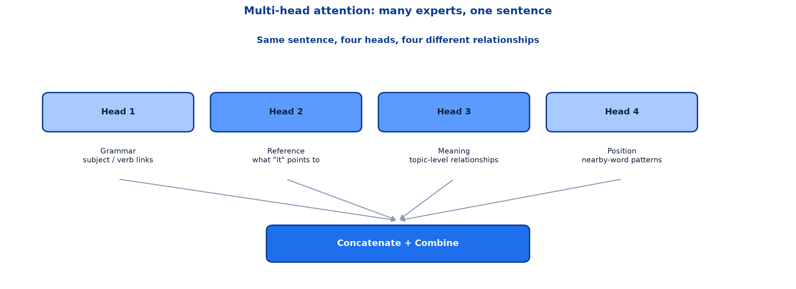
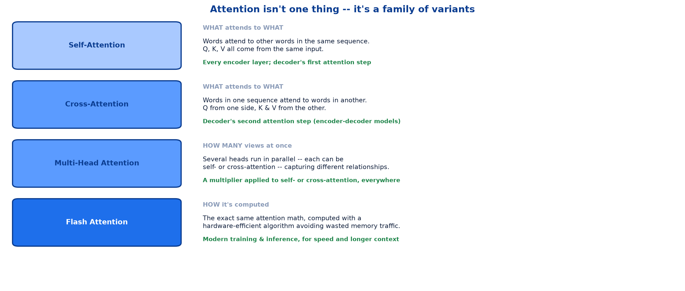
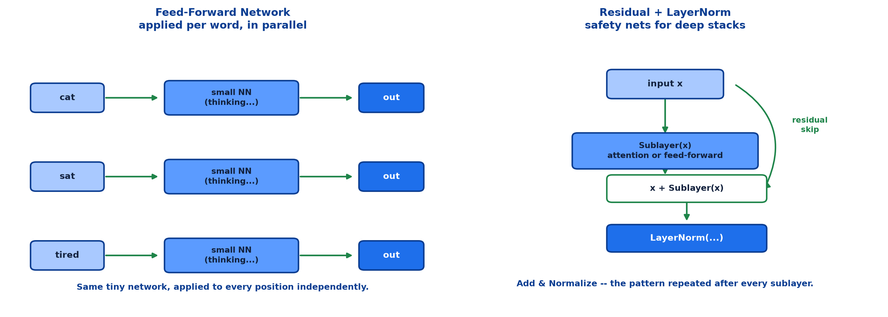
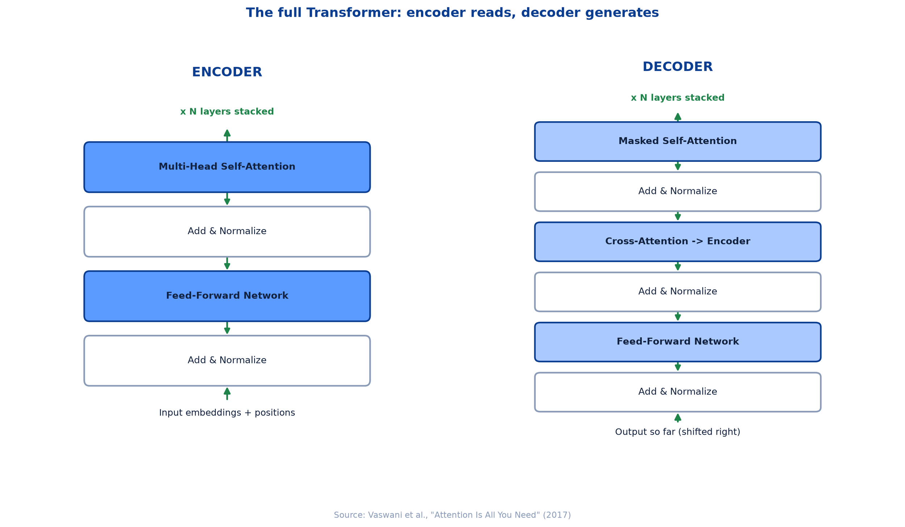
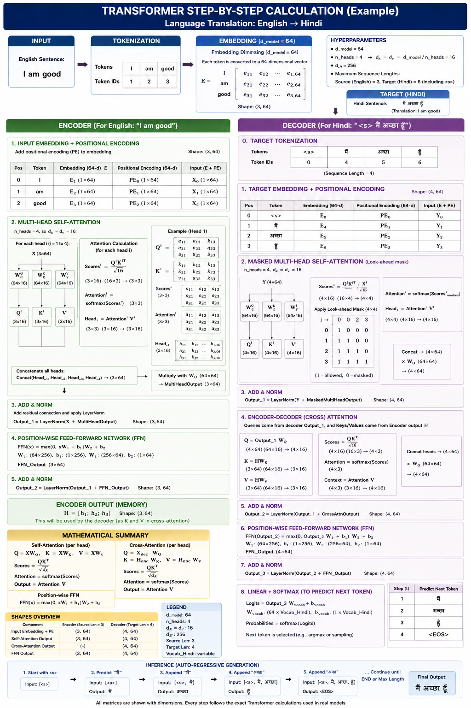

# <span style="color:#0B3D91">Transformer Architecture</span>

> Study notes completing the six building blocks introduced in the previous note:
> **multi-head attention** → **attention variants** → **feed-forward networks** →
> **residual connections &amp; layer normalization** → **the full encoder-decoder stack** →
> **the original Vaswani et al. diagram**.
>
> **A note on formulas:** equations are written in plain text inside code blocks rather than
> LaTeX, so they render correctly in any Markdown viewer.

---

## <span style="color:#1E6FEB">Table of Contents</span>

1. [Block 4 — Multi-Head Attention](#1-block-4--multi-head-attention)
2. [Attention Variants — An Overview](#2-attention-variants--an-overview)
3. [Block 5 — The Feed-Forward Network](#3-block-5--the-feed-forward-network)
4. [Block 6 — Residual Connections &amp; Layer Normalization](#4-block-6--residual-connections--layer-normalization)
5. [The Full Transformer — Encoder &amp; Decoder](#5-the-full-transformer--encoder--decoder)
6. [Reference — The Original Vaswani et al. Diagram](#6-reference--the-original-vaswani-et-al-diagram)

---

## <span style="color:#1E6FEB">1. Block 4 — Multi-Head Attention</span>

### 1.1 Overview / What is it?

**Many Experts, One Sentence.** One attention pass can only focus on one kind of relationship. So
the model runs several attention "heads" in parallel, each specializing in something different.



### 1.2 Why does it matter for AI?

Self-attention from the previous note is a single lens. A single Q/K/V projection can learn *one*
notion of relevance well, but a sentence carries many kinds of relationships at once — grammar,
reference, topic, position. One head cannot specialise in all of them simultaneously.

### 1.3 Key Concepts

```text
Head 1  ->  Grammar     -- subject / verb links
Head 2  ->  Reference   -- what "it" points to
Head 3  ->  Meaning     -- topic-level relationships
Head 4  ->  Position    -- nearby-word patterns
```

### 1.4 Simple Example

Just like asking four different experts to read the same sentence and combining their notes,
multi-head attention captures richer context than a single pass could.

### 1.5 How it works — Concatenate + Combine

Each head has its **own** `WQ`, `WK`, `WV` matrices, so each produces a different context-aware
output for the same input. Those outputs are concatenated and passed through one more learned
matrix to combine them back into a single vector per word.

```text
head_1_output, head_2_output, head_3_output, head_4_output
        \            |            |             /
                  concatenate
                       |
              combine (learned matrix)
                       |
              one output vector per word
```

### 1.6 Practical Example / Use Case

In practice, `dk` from the attention formula is chosen so that `h` heads of size `dk` add up to the
model's total dimension — e.g. 8 heads of 64 dimensions each for a 512-dimensional model. Splitting
the budget across heads rather than adding a bigger single head is a deliberate design choice: many
narrow views generalise better than one wide one.

### 1.7 Key Takeaways

> - One attention pass captures one kind of relationship; multi-head captures several **in parallel**.
> - Each head has its own learned `WQ`, `WK`, `WV`.
> - Outputs are **concatenated** then **combined** with one more learned matrix.
> - Total dimension is typically split across heads, not added on top.

---

## <span style="color:#1E6FEB">2. Attention Variants — An Overview</span>

### 2.1 Overview / What is it?

**"Attention" isn't one single thing** — it's a family of variants that differ in **what** attends to
**what**, and **how** it's computed.



### 2.2 Why does it matter for AI?

The word "attention" gets used loosely. Being able to say precisely *which* variant a paper or a
library flag refers to avoids a lot of confusion.

### 2.3 Key Concepts

| Variant | Axis | What it means | Where it's used |
|---|---|---|---|
| **Self-Attention** | WHAT attends to WHAT | Words attend to other words in the same sequence. Q, K, V all come from the same input. | Every encoder layer; decoder's first attention step |
| **Cross-Attention** | WHAT attends to WHAT | Words in one sequence attend to words in a different sequence. Q comes from one side, K & V from the other. | Decoder's second attention step (encoder-decoder models) |
| **Multi-Head Attention** | HOW MANY views at once | Several attention heads run in parallel — each can be self- or cross-attention — capturing different relationships. | A multiplier applied to self- or cross-attention, everywhere |
| **Flash Attention** | HOW it's computed | The exact same attention math, computed with a hardware-efficient algorithm that avoids wasted memory traffic. | Modern training & inference, for speed and longer context |

### 2.4 Simple Example

These axes are independent, so they combine:

```text
"8-head self-attention"           -> WHAT: self,  HOW MANY: 8
"cross-attention with flash"      -> WHAT: cross, HOW: hardware-efficient
```

A model description like "multi-head cross-attention" is naming two axes of the same table, not two
competing techniques.

### 2.5 How it works

Cross-attention is the one genuinely new mechanism here — self-attention with a twist. The **Query**
comes from the decoder (what am I generating now?) while the **Key** and **Value** come from the
encoder (what did the input actually say?). This is literally how the decoder "looks back" at the
source sentence while generating output.

### 2.6 Practical Example / Use Case

Flash Attention changes **nothing** about the output — same formula, same numbers — only how the
computation is scheduled on hardware to avoid redundant memory reads. This is why you can enable it
as a training flag without touching model architecture.

### 2.7 Key Takeaways

> - Attention varies along three independent axes: **what/what**, **how many**, **how computed**.
> - **Self-attention**: same sequence for Q, K, V.
> - **Cross-attention**: Q from one sequence, K & V from another — how decoders look back at encoders.
> - **Multi-head**: a multiplier on top of self- or cross-attention.
> - **Flash Attention**: identical math, faster hardware execution.

---

## <span style="color:#1E6FEB">3. Block 5 — The Feed-Forward Network</span>

### 3.1 Overview / What is it?

After attention mixes information **between** words, each word passes through its own small neural
network — independently — to further process what it just learned.



### 3.2 Why does it matter for AI?

Attention is entirely about *mixing* — pulling information in from other words. It contains no
non-linear "thinking" step on its own. The feed-forward network is where each word gets to process
what it just gathered.

### 3.3 Key Concepts

```text
cat    -> thinking... -> out
sat    -> thinking... -> out
tired  -> thinking... -> out
```

**Same tiny network, applied to every word position — in parallel.**

### 3.4 Simple Example

A typical feed-forward block is two linear layers with a non-linearity between them:

```text
FFN(x) = Linear2( activation( Linear1(x) ) )
```

Often the hidden layer is **wider** than the input — expand, activate, then project back down. This
gives the network room to combine features non-linearly before compressing back to the model's
working dimension.

### 3.5 How it works

Crucially, this network does **not** look at other words. Attention already did the cross-word
mixing; the feed-forward step is purely per-position. That is also what makes it trivially
parallelisable — every word runs through the identical network at the same time, independently.

### 3.6 Practical Example / Use Case

Because the same weights apply to every position, the feed-forward network is where a large fraction
of a Transformer's total parameters actually live — often more than the attention mechanism itself.

### 3.7 Key Takeaways

> - The FFN lets each word "think" on its own, after attention mixed context in.
> - It runs **independently per position** — no cross-word interaction here.
> - Typically expand → activate → project back down.
> - Same network, same weights, applied in parallel to every word.

---

## <span style="color:#1E6FEB">4. Block 6 — Residual Connections &amp; Layer Normalization</span>

### 4.1 Overview / What is it?

**Stacking dozens of layers can make training unstable.** Two safety nets fix this: residual
connections and layer normalization.

### 4.2 Why does it matter for AI?

A modern Transformer might stack 12, 24, or 96+ layers. Without help, signal and gradients can
shrink or blow up as they pass through that many transformations — the same instability problem that
motivated LSTM's cell state, now solved with a different, simpler mechanism.

### 4.3 Key Concepts — residual (skip) connections

Each layer **adds** its output to its input, instead of replacing it — like a highway shortcut so
information never gets lost.

```text
output = x + Sublayer(x)
```

### 4.4 Key Concepts — layer normalization

Rescales the numbers after each step so values stay in a healthy range as they flow through many
layers.

```text
output = LayerNorm( x + Sublayer(x) )
```

### 4.5 Simple Example

The combined pattern — **"Add & Normalize"** — is the small grey box you will see repeated after
every single attention and feed-forward block in the full architecture diagram. It is the same two
lines of logic, copy-pasted after every sublayer.

### 4.6 How it works

The residual connection provides a direct path: even if `Sublayer(x)` learns something close to
useless early in training, `x` still passes through mostly unchanged. Gradients have a "highway" back
to earlier layers that does not depend on every sublayer computing something perfect.

```text
without residual:  signal must pass THROUGH every sublayer to survive
with residual:      signal can pass AROUND a sublayer if needed
```

Layer normalization then keeps the *scale* of that signal from drifting as it accumulates across
dozens of additions.

### 4.7 Practical Example / Use Case

**Result:** networks with dozens of layers train smoothly instead of breaking down. This pairing is
why 96-layer language models can be trained at all — remove either ingredient and very deep stacks
become unstable.

### 4.8 Key Takeaways

> - **Residual connections**: `output = x + Sublayer(x)` — a shortcut that never loses information.
> - **Layer normalization**: rescales values to a healthy range after each step.
> - Combined pattern: **"Add & Normalize"**, repeated after every sublayer.
> - Together they let networks with dozens of layers train smoothly.

---

## <span style="color:#1E6FEB">5. The Full Transformer — Encoder &amp; Decoder</span>

### 5.1 Overview / What is it?

**Putting it all together.** Encoder (left) reads the input. Decoder (right) generates the output,
one word at a time, while looking back at the encoder.



### 5.2 Why does it matter for AI?

This is every block from both notes, assembled into the architecture that has powered nearly every
major language model since 2017.

### 5.3 Key Concepts — the encoder stack

```text
Input embeddings + positions
        |
Multi-Head Self-Attention
        |
   Add & Normalize
        |
 Feed-Forward Network
        |
   Add & Normalize
        |
   (x N layers stacked)
```

### 5.4 Key Concepts — the decoder stack

```text
Output so far (shifted right)
        |
   Masked Self-Attention
        |
   Add & Normalize
        |
 Cross-Attention -> Encoder
        |
   Add & Normalize
        |
 Feed-Forward Network
        |
   Add & Normalize
        |
   (x N layers stacked)
```

### 5.5 Simple Example

The decoder has **three** sublayers per block against the encoder's **two**. The extra one is
cross-attention — the mechanism from section 2 that lets the decoder consult the encoder's finished
representation of the input while generating each new word.

### 5.6 How it works — why "masked" self-attention

The decoder's first attention step is **masked**: when generating word 5, it must not be allowed to
see words 6, 7, 8... which have not been generated yet. Masking simply blocks those future positions
from contributing to the attention scores, forcing the model to predict honestly, one word at a time.

```text
generating word 5:  can attend to words 1, 2, 3, 4, 5
                     cannot attend to words 6, 7, 8, ...  (masked out)
```

### 5.7 Practical Example / Use Case

Trace one input through the whole system: `"I love AI"` is embedded, positioned, and passed up
through N encoder layers to produce a rich contextual representation. The decoder then generates
output one token at a time, at each step running masked self-attention over what it has produced so
far, cross-attending into the finished encoder output, and feed-forwarding before producing the next
word.

### 5.8 Key Takeaways

> - **Encoder**: self-attention + FFN, each wrapped in Add & Normalize, stacked N times.
> - **Decoder**: masked self-attention + cross-attention + FFN, each wrapped the same way.
> - **Masking** stops the decoder from seeing future words during generation.
> - **Cross-attention** is the decoder's only connection back to the encoder.

---

## <span style="color:#1E6FEB">6. Reference — The Original Vaswani et al. Diagram</span>

### 6.1 Overview / What is it?

The exact figure from the original paper — everything just covered, in the canonical form you'll see
referenced everywhere.



### 6.2 Why does it matter for AI?

Every Transformer paper since 2017 either shows this diagram or assumes you have seen it. Recognising
it on sight is a genuinely useful skill.

### 6.3 Key Concepts — reading the diagram

| Label | What it does |
|---|---|
| **Embedding layers** | Turn tokens into vectors (input and output) |
| **Multi-Head Attention** | Including the masked version in the decoder |
| **Add & Norm** | Residual connection plus layer normalization |
| **Feed Forward** | Per-word non-linear transformation |
| **Linear** | Projects decoder output to vocabulary size |
| **Softmax** | Converts final scores into output probabilities |

### 6.4 Simple Example

**`N×`** means the whole block repeats N times before moving to the next stage — exactly the "x N
layers stacked" annotation used throughout this note.

### 6.5 How it works

The final **Linear + Softmax** pair, sitting after the decoder stack, is the piece not covered yet in
either note: it projects the decoder's output vector up to vocabulary size and turns those scores
into a probability distribution over every possible next token. That is literally how the model
picks a word.

### 6.6 Practical Example / Use Case

**Source:** Vaswani et al., *Attention Is All You Need* (2017), Figure 1.

### 6.7 Key Takeaways

> - The canonical diagram appears in essentially every Transformer paper and library doc.
> - `N×` denotes the whole block repeating N times.
> - **Linear + Softmax** at the very end converts vectors into next-word probabilities.
> - Everything in this pair of notes maps directly onto one labelled box in this figure.

---

## <span style="color:#1E6FEB">Summary — Transformer Architecture at a Glance</span>

```text
embeddings + position -> [self-attention -> add&norm -> FFN -> add&norm] x N -> encoder output
output so far          -> [masked self-attn -> add&norm -> cross-attn -> add&norm -> FFN -> add&norm] x N -> linear -> softmax
```

| Term | Meaning |
|---|---|
| Multi-head attention | Several attention heads run in parallel, each learning a different relationship |
| Self-attention | Q, K, V all come from the same sequence |
| Cross-attention | Q from one sequence, K & V from another |
| Flash Attention | Same attention math, hardware-efficient computation |
| Feed-forward network | Per-word, position-independent non-linear processing |
| Residual connection | `output = x + Sublayer(x)` — a shortcut around each sublayer |
| Layer normalization | Rescales values to a healthy range after each step |
| Add & Normalize | The residual + layer-norm pattern repeated after every sublayer |
| Masked self-attention | Self-attention that blocks a decoder from seeing future positions |
| Encoder | Reads the input; self-attention + FFN, stacked N times |
| Decoder | Generates output; masked self-attention + cross-attention + FFN, stacked N times |
| Linear + Softmax | Final projection to vocabulary size and probability distribution |

**The one-sentence version:** The full Transformer stacks multi-head self-attention and a per-word
feed-forward network, each wrapped in a residual-plus-layer-norm safety net, into an encoder that
reads the input and a decoder that generates output one word at a time — consulting the encoder
through cross-attention and never peeking at words it hasn't generated yet.

**Where this leads:** the next note surveys the three Transformer variants — encoder-only,
decoder-only, and encoder-decoder — and gives a practical guide for choosing the right one for a
given task.

---

> **Navigation:** ← Previous: [07 — Transformers: Self-Attention](07_NLP_Transformers_Self_Attention.md) · Next → 09 — Transformer Variants &amp; Model Choice
