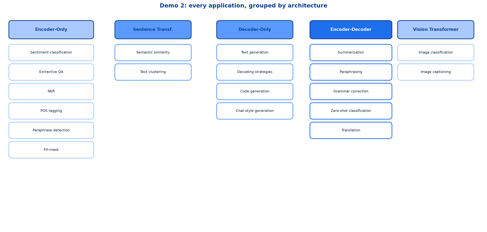
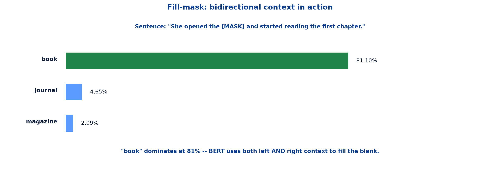
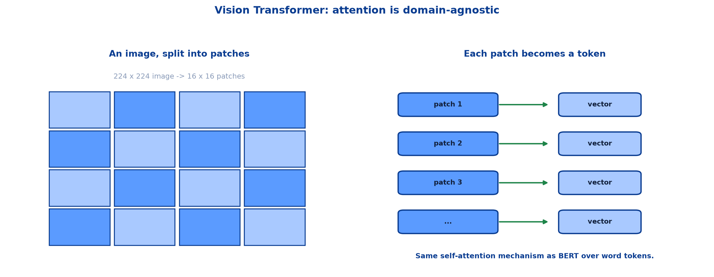

# <span style="color:#0B3D91">Demo 2 — Transformer Applications Walkthrough</span>

> A step-by-step walkthrough of the applications notebook, organized exactly as it was built —
> **encoder-only understanding tasks** → **decoder-only generation tasks** →
> **encoder-decoder sequence-to-sequence tasks** → **Vision Transformers**.
>
> Every output shown here is the actual output produced by the notebook.

---

## <span style="color:#1E6FEB">Table of Contents</span>

1. [Overview — One Notebook, Every Architecture](#1-overview--one-notebook-every-architecture)
2. [Encoder-Only: Sentiment, QA, NER &amp; POS](#2-encoder-only-sentiment-qa-ner--pos)
3. [Encoder-Only: Fill-Mask &amp; Paraphrase Detection](#3-encoder-only-fill-mask--paraphrase-detection)
4. [Sentence Transformers: Similarity &amp; Clustering](#4-sentence-transformers-similarity--clustering)
5. [Decoder-Only: Text &amp; Code Generation](#5-decoder-only-text--code-generation)
6. [Encoder-Decoder: Summarization &amp; Translation](#6-encoder-decoder-summarization--translation)
7. [Encoder-Decoder: Zero-Shot Classification](#7-encoder-decoder-zero-shot-classification)
8. [Beyond Text: Vision Transformers](#8-beyond-text-vision-transformers)

---

## <span style="color:#1E6FEB">1. Overview — One Notebook, Every Architecture</span>

### 1.1 Overview / What is it?

The demo applies every Transformer variant from the previous two notes to real tasks, using Hugging
Face's `pipeline()` and, where needed, direct model classes.



### 1.2 Why does it matter for AI?

This is where "encoder-only handles understanding" stops being an abstract claim and becomes eleven
concrete, runnable examples.

### 1.3 Key Concepts — the summary table

| Section | Task | Architecture | Pipeline / Library |
|---|---|---|---|
| Sentiment classification | Understanding | Encoder-only | `pipeline("sentiment-analysis")` |
| Extractive QA | Understanding | Encoder-only | `AutoModelForQuestionAnswering` |
| NER | Understanding | Encoder-only | `pipeline("ner")` |
| POS tagging | Understanding | Encoder-only | `pipeline("token-classification")` |
| Paraphrase detection | Understanding | Encoder-only | `AutoModelForSequenceClassification` |
| Fill-mask | Understanding | Encoder-only | `pipeline("fill-mask")` |
| Semantic similarity | Comparison | Sentence Transformer | `SentenceTransformer` |
| Text clustering | Comparison | Sentence Transformer | `SentenceTransformer` + KMeans |
| Text generation | Generation | Decoder-only | `pipeline("text-generation")` |
| Code generation | Generation | Decoder-only | `pipeline("text-generation")` |
| Summarization | Transformation | Encoder-Decoder | `BartForConditionalGeneration` |
| Translation | Transformation | Encoder-Decoder | `MarianMTModel` |
| Zero-shot classification | Transformation | Encoder-Decoder | `pipeline("zero-shot-classification")` |
| Image classification | Vision | Vision Transformer | `pipeline("image-classification")` |
| Image captioning | Vision | Vision (Enc-Dec) | `BlipForConditionalGeneration` |

### 1.4 Simple Example

Every row traces straight back to the decision map in note 09: classify → encoder-only, compare →
Sentence Transformer, generate → decoder-only, transform → encoder-decoder. Nothing here is a new
rule; it is the same rule, applied fourteen times.

### 1.5 Key Takeaways

> - The demo covers all three Transformer variants plus Vision Transformers.
> - `pipeline()` is the quick-start interface; direct model classes are used when a task needs
>   more control.
> - Every application maps onto the note 09 decision map.

---

## <span style="color:#1E6FEB">2. Encoder-Only: Sentiment, QA, NER &amp; POS</span>

### 2.1 Overview / What is it?

The understanding tasks, run in sequence.

### 2.2 Key Concepts — sentiment classification

```python
from transformers import pipeline

classifier = pipeline("sentiment-analysis")
result = classifier("This movie is absolutely fantastic! I loved every minute of it.")
```

```text
Text: This movie is absolutely fantastic! I loved every minute of it.
Sentiment: POSITIVE, Score: 1.00

Text: The plot was convoluted and the acting was terrible.
Sentiment: NEGATIVE, Score: 1.00

Text: It's a decent film, nothing groundbreaking but enjoyable.
Sentiment: POSITIVE, Score: 1.00
```

**Model used:** `distilbert/distilbert-base-uncased-finetuned-sst-2-english` — a distilled BERT
fine-tuned specifically for sentiment.

### 2.3 Simple Example — extractive QA

```python
context  = "The Eiffel Tower is a wrought-iron lattice tower on the Champ de Mars in Paris, France..."
question = "Who designed the Eiffel Tower?"

# ... tokenize, run the model, find start/end logits ...
```

```text
Answer: Champ de Mars in Paris, France.
```

> **A genuinely instructive failure.** The context never actually mentions who designed the tower —
> there is no "Gustave Eiffel" anywhere in it. Extractive QA can only point at a span already present
> in the context; it has no built-in way to say "the answer isn't here." Faced with an unanswerable
> question, the model confidently returns the most plausible-looking span anyway. This is exactly the
> "extractive" limitation flagged in note 09 — worth seeing fail once, not just described in theory.

### 2.4 How it works — Named Entity Recognition

```python
ner = pipeline("ner", model="dslim/bert-base-NER", aggregation_strategy="simple")
```

```text
"Sundar Pichai is the CEO of Google, which is headquartered in Mountain View, California."

  Type    Entity                     Confidence
  PER     Sundar Pichai              99.19%
  ORG     Google                     99.89%
  LOC     Mountain View              99.77%
  LOC     California                 99.92%

"The FIFA World Cup 2026 will be held in the United States, Canada, and Mexico."

  Type    Entity                     Confidence
  MISC    FIFA World Cup 2026        91.35%
  LOC     United States              99.95%
  LOC     Canada                     99.98%
  LOC     Mexico                     99.98%
```

`aggregation_strategy="simple"` merges sub-word tokens back into whole entities — without it,
"Sundar Pichai" might arrive as separate `Sun`, `##dar`, `Pichai` pieces.

### 2.5 Practical Example / Use Case — POS tagging

```python
pos_tagger = pipeline("token-classification",
                       model="vblagoje/bert-english-uncased-finetuned-pos",
                       aggregation_strategy="simple")
```

```text
"The quick brown fox jumps over the lazy dog."

  Tag       Word                  Confidence
  DET       the                   99.94%
  ADJ       quick                 ...
```

This is the lexical-analysis note's POS tagging, running on a fine-tuned Transformer instead of
spaCy's statistical model — same concept, different engine.

### 2.6 Key Takeaways

> - Sentiment analysis, extractive QA, NER and POS tagging are all encoder-only tasks.
> - Different fine-tuned checkpoints power each — one general architecture, many specialised models.
> - Extractive QA has a real failure mode: it must answer from the given span, even if the true
>   answer isn't present.
> - `aggregation_strategy="simple"` merges sub-word tokens into whole words/entities.

---

## <span style="color:#1E6FEB">3. Encoder-Only: Fill-Mask &amp; Paraphrase Detection</span>

### 3.1 Overview / What is it?

Two more encoder-only tasks, both leaning directly on BERT's pretraining objective.

### 3.2 Key Concepts — fill-mask

```python
fill_masker = pipeline("fill-mask", model="bert-base-uncased")
fill_masker("The capital of France is [MASK].")
```

```text
Token              Score
paris             0.4168
```



### 3.3 Simple Example

```text
"She opened the [MASK] and started reading the first chapter."

  [book        ]  score=0.8110
  [journal     ]  score=0.0465
  [magazine    ]  score=0.0209
```

"Book" wins decisively at 81% — the word "reading" appearing **after** the blank is exactly the kind
of right-side context a decoder-only model could never use, because it can only look backward.

### 3.4 How it works — a harder example

```text
"The doctor examined the [MASK] carefully before making a diagnosis."

  [patient     ]  score=0.1512
  [wound       ]  score=0.1138
  [body        ]  score=0.0500
```

Notice the scores here are much flatter than the book example — several words are genuinely
plausible, and the model's confidence reflects that ambiguity honestly rather than forcing a
confident-looking single answer.

### 3.5 Practical Example / Use Case — this **is** BERT's training objective

Fill-mask is not a downstream task bolted onto BERT — it is literally **how BERT was pretrained**:
mask random words, predict them from bidirectional context, repeat across billions of sentences.
Every other encoder-only application in this note is built on top of that pretraining.

### 3.6 Key Takeaways

> - Fill-mask directly exposes BERT's own pretraining objective.
> - Bidirectional context lets BERT use words that come **after** the blank.
> - Flatter score distributions reflect genuine ambiguity rather than model failure.
> - Sentence-pair classification (paraphrase detection) reuses the same encoder-only pattern with
>   two inputs instead of one.

---

## <span style="color:#1E6FEB">4. Sentence Transformers: Similarity &amp; Clustering</span>

### 4.1 Overview / What is it?

The twin-network adaptation from note 09, in code.

### 4.2 Key Concepts — encoding a sentence

```python
from sentence_transformers import SentenceTransformer

model = SentenceTransformer('all-MiniLM-L6-v2')
embeddings = model.encode("The cat sat on the mat.", convert_to_tensor=True)
```

```text
Sentence embeddings length: 384
```

384 dense dimensions for an entire sentence — compare that to a sparse BoW vector sized to the whole
vocabulary.

### 4.3 Simple Example — word-level check

```text
Cosine similarity between 'king' and 'queen': 0.6807
```

A useful sanity check: related but distinct words land moderately close — not near 1.0 (identical),
not near 0 (unrelated).

### 4.4 How it works — sentence-level similarity

```python
sentences = [
    "The cat sat on the mat.",
    "The cat sat on the mat.",
    "A feline was resting on the rug.",
    "The dog chased the ball.",
    "I am learning about natural language processing.",
]
embeddings = model.encode(sentences, convert_to_tensor=True)
cosine_scores = util.cos_sim(embeddings, embeddings)
```

```text
identical sentences:                                    1.0000
"cat...mat" vs "feline...rug" (paraphrase):              0.5631
"cat...mat" vs "dog chased the ball" (related domain):   0.1213
"cat...mat" vs "learning about NLP" (unrelated):         0.0173
```

The ordering is exactly right: identical > paraphrase > loosely related > unrelated, and the *gaps*
between them are large enough to be genuinely useful for ranking.

### 4.5 Practical Example / Use Case — clustering

```python
from sklearn.cluster import KMeans

embeddings = model.encode(texts_for_clustering)
kmeans = KMeans(n_clusters=3, random_state=42, n_init=10).fit(embeddings)
```

```text
Cluster 0
  "The cat is sleeping peacefully on the couch."
  "My feline friend is napping on the sofa."

Cluster 1
  "The sun is shining brightly today."
  "It's a beautiful day with clear skies and sunshine."

Cluster 2
  "The quick brown fox jumps over the lazy dog."
  "A fast brown canine leaps over a sluggish hound."
```

KMeans never saw the words "cat," "sun" or "fox" as labels — it only saw 384-dimensional vectors, and
still grouped every true paraphrase pair correctly. That is embeddings doing real, unsupervised work.

### 4.6 Key Takeaways

> - `SentenceTransformer` produces one dense vector per sentence via the twin-network design.
> - Cosine similarity scores order correctly: identical > paraphrase > related > unrelated.
> - KMeans over sentence embeddings clusters paraphrases together with **no labels at all**.
> - This is cosine similarity from the embeddings note, now operating on whole sentences.

---

## <span style="color:#1E6FEB">5. Decoder-Only: Text &amp; Code Generation</span>

### 5.1 Overview / What is it?

Autoregressive generation, in practice, with GPT-2.

### 5.2 Key Concepts — basic generation

```python
text_generator = pipeline("text-generation", model="gpt2")
text_generator("Once upon a time, in a land far, far away, there was a dragon", max_length=50)
```

**Model used:** `gpt2`.

### 5.3 Simple Example — decoding strategies

The same prompt, four different ways of choosing the next token:

```text
Greedy (deterministic)      -> do_sample=False
Temperature=1.5 (creative)  -> do_sample=True, temperature=1.5, top_k=0
Top-k=10                    -> do_sample=True, top_k=10
Top-p=0.9 (nucleus)         -> do_sample=True, top_p=0.9, top_k=0
```

### 5.4 How it works

```text
Greedy       -> always picks the single highest-probability next token; fully repeatable
Temperature  -> raises/lowers randomness; >1 makes the distribution flatter (more surprising choices)
Top-k        -> only sample from the k most likely next tokens
Top-p        -> sample from the smallest set of tokens whose probabilities sum to p
```

Every one of these strategies operates on the **same** underlying probability distribution — the
Linear + Softmax output from note 08's architecture diagram. They differ only in how a token is
picked from that distribution, not in how the distribution is computed.

### 5.5 Practical Example / Use Case — beyond prose

```python
code_generator = pipeline("text-generation", model="Salesforce/codegen-350M-mono")
chat_generator = pipeline("text-generation", model="distilgpt2")
```

Same mechanism, different fine-tuning corpus: `codegen` was trained on code instead of prose, so it
autoregressively predicts the *next token of a program* rather than the next word of a sentence. No
architectural difference — only training data.

### 5.6 Key Takeaways

> - GPT-2 generates one token at a time, feeding each prediction back in.
> - Decoding strategy (greedy, temperature, top-k, top-p) controls *how* a token is chosen from the
>   model's probability distribution — not the distribution itself.
> - Code generation and chat generation are the same decoder-only mechanism, just fine-tuned
>   differently.

---

## <span style="color:#1E6FEB">6. Encoder-Decoder: Summarization &amp; Translation</span>

### 6.1 Overview / What is it?

Sequence-to-sequence tasks, where input and output are genuinely different sequences.

### 6.2 Key Concepts — summarization

```python
from transformers import BartForConditionalGeneration, BartTokenizer

model_name = "facebook/bart-large-cnn"
model = BartForConditionalGeneration.from_pretrained(model_name)
```

`facebook/bart-large-cnn` is fine-tuned on CNN/DailyMail news articles and produces **abstractive**
summaries — it generates new sentences rather than just copying spans, unlike extractive QA in
section 2.

### 6.3 Simple Example — machine translation

```python
from transformers import MarianMTModel, MarianTokenizer

def load_translator(src_lang, tgt_lang):
    model_name = f"Helsinki-NLP/opus-mt-{src_lang}-{tgt_lang}"
    return MarianTokenizer.from_pretrained(model_name), MarianMTModel.from_pretrained(model_name)
```

```text
English -> French Translation

EN: Transformers have revolutionised the field of natural language processing.
FR: Les transformateurs ont révolutionné le domaine du traitement du langage naturel.

EN: The weather is beautiful today.
FR: Le temps est beau aujourd'hui.

EN: Artificial intelligence is changing the world rapidly.
FR: L'intelligence artificielle change rapidement le monde.
```

**Models used:** `Helsinki-NLP/opus-mt-en-fr`, `Helsinki-NLP/opus-mt-en-de`.

### 6.4 How it works

Every one of these translations is a live demonstration of cross-attention from note 08: the decoder
generating French words is, at every step, attending back into the encoder's finished understanding
of the English sentence. Different vocabulary, different length, same mechanism.

### 6.5 Practical Example / Use Case

Notice both summarization and translation load the model **directly** (`BartForConditionalGeneration`,
`MarianMTModel`) rather than through `pipeline()`. The comment in the source explains why: this
transformers version doesn't expose a ready-made `"summarization"` pipeline task, so the notebook
falls back to the underlying model classes — a good reminder that `pipeline()` is a convenience
wrapper, not the only way in.

### 6.6 Key Takeaways

> - Summarization is **abstractive** — new sentences, not copied spans.
> - Translation via MarianMT swaps in a different fine-tuned model per language pair.
> - Both tasks are live demonstrations of cross-attention consulting the encoder.
> - Direct model classes are a legitimate fallback when a convenience pipeline isn't available.

---

## <span style="color:#1E6FEB">7. Encoder-Decoder: Zero-Shot Classification</span>

### 7.1 Overview / What is it?

Classification **without** any labelled training examples for the specific labels used.

### 7.2 Why does it matter for AI?

Every classifier so far in this note (sentiment, NER) was fine-tuned on a fixed label set. Zero-shot
classification instead accepts **arbitrary** candidate labels at inference time.

### 7.3 Key Concepts

```python
zero_shot = pipeline("zero-shot-classification", model="facebook/bart-large-mnli")
```

`facebook/bart-large-mnli` is trained on the MultiNLI dataset. The pipeline internally converts each
candidate label into an entailment hypothesis — "this text is about `{label}`" — and lets the model's
natural language inference training do the classifying.

### 7.4 Simple Example

```text
Text: "The central bank raised interest rates by 50 basis points to combat rising
      inflation, sending stock markets lower..."

Label            Score
finance          0.7865
entertainment    0.0850
sports           0.0470
politics         0.0448
technology       0.0367
```

No model was ever trained specifically on a "finance vs sports vs politics" news classifier — the
label set was invented on the spot.

### 7.5 How it works — intent routing

```text
"My internet has been down for two days and I need it fixed immediately."
  -> technical support  (confidence: 88.26%)

"I want to cancel my subscription and get a refund for last month."
  -> billing and refunds  (confidence: 58.99%)

"Can you help me understand how to set up two-factor authentication on my account?"
  -> account management  (confidence: 62.84%)
```

### 7.6 Practical Example / Use Case

This is precisely the kind of task where reaching for zero-shot saves real engineering time: adding a
new support-ticket category is a one-line change to a Python list, not a retraining cycle. Worth
noting the confidence gap between examples too — 88% versus 59% — a production system would likely
route the 59% case to human review rather than trust it blindly.

### 7.7 Key Takeaways

> - Zero-shot classification uses **NLI training** to classify against labels never seen during training.
> - Candidate labels are supplied at inference time — no retraining needed to add a category.
> - Confidence varies meaningfully by example; low-confidence results deserve a human fallback.
> - This is the encoder-decoder / NLI approach, reused as a general-purpose classifier.

---

## <span style="color:#1E6FEB">8. Beyond Text: Vision Transformers</span>

### 8.1 Overview / What is it?

The same attention mechanism, applied to images instead of text.



### 8.2 Why does it matter for AI?

Nothing about self-attention is inherently linguistic. It operates on a sequence of vectors — where
those vectors come from is a separate question.

### 8.3 Key Concepts — image classification

```python
image_classifier = pipeline("image-classification", model="google/vit-base-patch16-224")
```

```text
Model: google/vit-base-patch16-224
Transformer self-attention over image patches -- same mechanism as BERT over word tokens.
```

**Reading the model name:** `patch16` means each image is split into 16×16 pixel patches, treated
like tokens. `224` means input images are resized to 224×224 pixels before splitting.

### 8.4 Simple Example

```text
224 x 224 image  ->  split into 16x16 patches  ->  each patch flattened into a vector
                                                  ->  fed into the same Transformer encoder as BERT
```

A 224×224 image split into 16×16 patches produces a 14×14 grid — 196 "tokens" per image, each one a
flattened patch of pixels rather than a word.

### 8.5 How it works — image captioning

```python
from transformers import BlipProcessor, BlipForConditionalGeneration

model_name = "Salesforce/blip-image-captioning-base"
model = BlipForConditionalGeneration.from_pretrained(model_name)
```

**Vision encoder + text decoder — the same encoder-decoder pattern as section 6, across modalities.**
A vision encoder reads the image patches; a text decoder generates a caption word by word, using
cross-attention to consult the encoder's understanding of the image — architecturally identical to
English-to-French translation, except one "language" is pixels.

### 8.6 Practical Example / Use Case

```text
This demonstrates that the Transformer attention mechanism is domain-agnostic.
The same architecture that reads text can also 'read' image patches.
```

This is the single biggest takeaway of the whole demo: everything built across notes 07–09 —
self-attention, Q/K/V, encoder/decoder stacks, cross-attention — was never actually about *language*
specifically. It is a general mechanism for relating elements of any sequence, and images are simply
another kind of sequence once cut into patches.

### 8.7 Key Takeaways

> - **ViT** splits an image into fixed-size patches and treats each one as a token.
> - The same self-attention mechanism from note 07 runs unmodified over image patches.
> - **BLIP** pairs a vision encoder with a text decoder — the encoder-decoder pattern, cross-modal.
> - Attention is domain-agnostic: the architecture doesn't know or care whether its tokens came from
>   words or pixels.

---

## <span style="color:#1E6FEB">Summary — Demo 2 at a Glance</span>

```text
Encoder-only      -> understand      -> sentiment, QA, NER, POS, fill-mask
Sentence Transf.  -> compare         -> similarity, clustering
Decoder-only      -> generate        -> text, code, chat
Encoder-Decoder   -> transform       -> summarize, translate, zero-shot classify
Vision Transformer-> see             -> classify images, caption images
```

| Term | Meaning |
|---|---|
| `pipeline()` | Hugging Face's quick-start interface for a named task |
| Aggregation strategy | How sub-word token predictions merge into whole-word results |
| Abstractive summary | A summary generated in new words, not copied spans |
| Decoding strategy | How the next token is chosen from the model's output distribution |
| Greedy / temperature / top-k / top-p | Four common decoding strategies |
| Zero-shot classification | Classifying against labels never seen during training |
| NLI (Natural Language Inference) | The entailment-based training behind zero-shot classification |
| ViT (Vision Transformer) | A Transformer that treats image patches as tokens |
| BLIP | A vision-encoder + text-decoder model for image captioning |
| Patch | A fixed-size image region treated as one "token" |

**The one-sentence version:** The same Transformer building blocks power sentiment analysis, question
answering, named entity recognition, semantic search, text generation, translation, summarization,
zero-shot classification and even image understanding — proving that self-attention is a general
mechanism for relating elements of a sequence, not a language-specific trick.

**Where this leads:** this closes the ten-note NLP &amp; Transformers collection — from raw text and
the NLP pipeline, through preprocessing and classical representation, to word embeddings, the full
Transformer architecture, its three variants, and finally these ten real applications built on top of
it.

---

> **Navigation:** ← Previous: [09 — Transformer Variants &amp; Model Choice](09_NLP_Transformer_Variants_And_Model_Choice.md)
