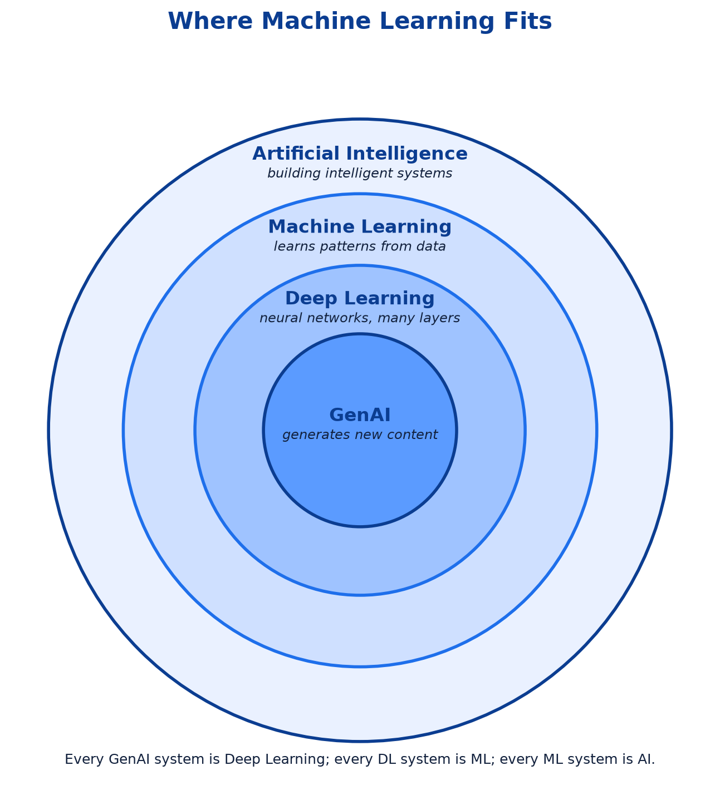
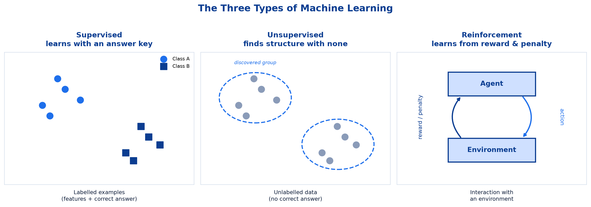
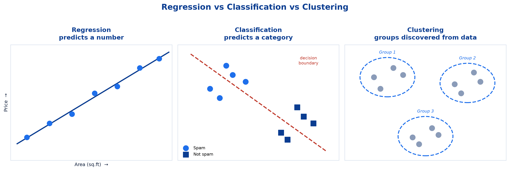

# <span style="color:#0B3D91">Machine Learning Foundations &amp; Types</span>

> Study notes opening the Basic Machine Learning module — what Machine Learning actually is, how it differs from traditional programming, where it sits inside the AI landscape, and the three types of learning (supervised, unsupervised, reinforcement) along with the three task types (regression, classification, clustering) that every later algorithm plugs into.
> The vocabulary chapter: get these distinctions right and every algorithm that follows has a shelf to sit on.

> **A note on formulas:** equations are written in plain text inside code blocks rather than LaTeX, so they render correctly in any Markdown viewer.

---

## <span style="color:#1E6FEB">Table of Contents</span>

1. [What is Machine Learning?](#1-what-is-machine-learning)
2. [Traditional Programming vs. Machine Learning](#2-traditional-programming-vs-machine-learning)
3. [Where Machine Learning Fits (AI → ML → DL → GenAI)](#3-where-machine-learning-fits-ai--ml--dl--genai)
4. [The Three Types of Machine Learning](#4-the-three-types-of-machine-learning)
5. [The Three Task Types: Regression, Classification &amp; Clustering](#5-the-three-task-types-regression-classification--clustering)

---

## <span style="color:#1E6FEB">1. What is Machine Learning?</span>

### 1.1 Overview / What is it?
**Machine Learning (ML)** is teaching computers to learn from examples, instead of hard-coded rules.

> A system **learns patterns from data**, and uses them to make predictions or decisions — **without being explicitly programmed** for every scenario.

The emphasis sits on that final clause. Nobody enumerates every case in advance; the system generalizes from the examples it has seen to the ones it hasn't.

### 1.2 Why does it matter for AI?
Every prediction, classification, and automated decision inside a modern AI system rests on this one idea. If the rules could simply be written by hand, you would not need ML at all — you would write the rules. ML earns its place precisely where the rules are **too numerous, too subtle, or too fast-changing** for a human to enumerate.

### 1.3 Key Concepts
- **Learning from data** — patterns are extracted from examples, not supplied by a programmer.
- **Generalization** — the real test is performance on **new, unseen** inputs, not on the data used for training.
- **No explicit programming per scenario** — one learned model covers cases nobody wrote down.

### 1.4 Simple Example
**Everyday analogy — recognizing a dog.** A child learns to recognize a dog *not* from a rulebook of features ("four legs, fur, wet nose, barks…"), but by **seeing many labeled examples**. Then they recognize a dog they have never seen before.

That last step — correctly identifying an unfamiliar dog — is **generalization**, and it is the entire point of machine learning.

### 1.5 How it works — the basic loop

```
Examples (data + known answers)
        │
        ▼
   Training  ──►  Model (the learned patterns)
                       │
                       ▼
        New unseen input  ──►  Prediction
```

### 1.6 Practical Example / Use Case
**Spam filter.** Trained on emails labeled *spam / not-spam*, it learns word and sender patterns, then classifies brand-new emails on its own.

Contrast this with the hand-written alternative:

```
if subject contains "FREE OFFER" then spam
if sender in blocklist            then spam
...and 4,000 more rules
```

That rulebook needs rewriting every Monday, because spammers change tactics weekly. The ML version simply retrains on fresh labeled examples.

### 1.7 Key Takeaways
> - ML = a system **learns patterns from data** to make predictions, without being explicitly programmed for every scenario.
> - The goal is **generalization** — performing well on inputs never seen during training.
> - Analogy: a child learns "dog" from **labeled examples**, not a rulebook of features.
> - ML wins wherever rules are too numerous, too subtle, or change too often to hand-write.

---

## <span style="color:#1E6FEB">2. Traditional Programming vs. Machine Learning</span>

### 2.1 Overview / What is it?
The cleanest way to define machine learning is by contrast with the classical software you already know. The difference is a **swap in what goes in and what comes out**.

### 2.2 Why does it matter for AI?
Understanding this swap tells you **when to reach for ML at all**. Not every problem needs it — and using ML where a simple rule would do adds cost, unpredictability, and a data pipeline you now have to maintain forever.

### 2.3 Key Concepts

| Traditional Programming | Machine Learning |
|---|---|
| **You** write the rules | **The computer** learns the rules |
| Input **+ Rules** → Output | Input **+ Output** → Rules (model) |
| Good for fixed logic *(e.g. a calculator)* | Good for complex patterns *(e.g. spam detection)* |

### 2.4 Simple Example
Compressed to its essence:

```
Traditional Programming:   DATA + RULES             ->  OUTPUT
Machine Learning:          DATA + OUTPUT (examples) ->  RULES (MODEL)
```

**The flip is the insight.** In classical software the rules are the *input*; in ML the rules are the *output*. You hand over examples and the machine hands you back the logic.

### 2.5 How it works — which one should you use?

| Situation | Reach for |
|---|---|
| The rule is known, exact, and stable *(tax calculation, currency conversion)* | **Traditional programming** |
| The rule is knowable but enormous *(spam, fraud, image recognition)* | **Machine Learning** |
| The rule changes constantly with new data | **Machine Learning** |
| You need a guaranteed, auditable, identical answer every time | **Traditional programming** |

A calculator that "mostly" returns the right sum is a broken calculator. A spam filter that is right 98% of the time is an excellent spam filter. That tolerance for statistical rather than exact answers is the dividing line.

### 2.6 Practical Example / Use Case
A bank's **interest calculation** is traditional programming — the formula is fixed by policy and must be exact to the paisa. The same bank's **fraud detection** is machine learning — the patterns are subtle, evolving, and buried across millions of transactions that no analyst could enumerate as rules. Same institution, same codebase, two fundamentally different tools.

### 2.7 Key Takeaways
> - Traditional programming: `DATA + RULES -> OUTPUT`. Machine Learning: `DATA + OUTPUT -> RULES (model)`.
> - In classical software the rules are the **input**; in ML the rules are the **output**.
> - Use traditional programming for **fixed, exact logic**; use ML for **complex, evolving patterns**.
> - Takeaway: *learning patterns from data to predict — instead of following hardcoded instructions.*

---

## <span style="color:#1E6FEB">3. Where Machine Learning Fits (AI → ML → DL → GenAI)</span>

### 3.1 Overview / What is it?
Four terms get used interchangeably in casual conversation, but they are strictly **nested** — each one a subset of the one before it.



### 3.2 Why does it matter for AI?
Precision here prevents a common and expensive confusion. "We need AI" is not a requirement — it is a mood. Knowing whether the job calls for a rule engine, a regression model, a neural network, or a generative model determines the data you need, the compute you buy, and the metrics you use to judge success.

### 3.3 Key Concepts

| Layer | What it is |
|---|---|
| **Artificial Intelligence** | The broad goal of building intelligent systems |
| **Machine Learning** | A subset of AI that learns patterns from data |
| **Deep Learning** | Uses neural networks with many layers |
| **GenAI** | Built on Deep Learning; generates new content — text, images, and more |

### 3.4 Simple Example
Containment runs in one direction only:

| System | AI? | ML? | Deep Learning? | GenAI? |
|---|---|---|---|---|
| Rule-based chess engine |  |  |  |  |
| Linear Regression house-price model |  |  |  |  |
| Image-recognition neural network |  |  |  |  |
| ChatGPT |  |  |  |  |

**Every GenAI system is Deep Learning; every DL system is ML; every ML system is AI — but never the reverse.**

### 3.5 How it works — placing a system in the hierarchy
Ask three questions in order:

1. **Does it learn from data?** No → it is AI but not ML (a rule engine, a search algorithm).
2. **Does it use multi-layer neural networks?** No → it is ML but not Deep Learning (Linear Regression, KNN, SVM — everything in this module).
3. **Does it generate new content?** No → it is Deep Learning but not GenAI (an image classifier).

### 3.6 Practical Example / Use Case
A customer-support platform can span all four layers at once: a **rule engine** routes tickets by keyword (AI), a **Logistic Regression** model predicts churn risk (ML), a **neural network** transcribes call audio (Deep Learning), and an **LLM** drafts the reply (GenAI). Naming each layer correctly is what lets a team argue productively about which piece needs fixing.

### 3.7 Key Takeaways
> - **AI ⊃ ML ⊃ Deep Learning ⊃ GenAI** — strictly nested, not interchangeable.
> - **AI** = building intelligent systems; **ML** = learns patterns from data; **DL** = neural networks with many layers; **GenAI** = generates new content.
> - A rule-based chess engine is AI but not ML. Linear Regression is ML but not Deep Learning.
> - Everything in this module lives in the **ML** ring — no neural networks required.

---

## <span style="color:#1E6FEB">4. The Three Types of Machine Learning</span>

### 4.1 Overview / What is it?
Machine Learning splits into three core types, separated by **what kind of feedback the model learns from**.



### 4.2 Why does it matter for AI?
The type you are doing decides **what data you must collect**, which is usually the most expensive part of any project. Supervised learning demands labeled examples that somebody has to produce; unsupervised learning needs none; reinforcement learning needs a working environment to interact with. Misjudging the type at the start means budgeting for the wrong thing entirely.

### 4.3 Key Concepts — the deciding question: **is a label present?**

| Method | Label present? | Type of label | Example |
|---|---|---|---|
| **Regression** (supervised) |  Yes | **Continuous** | Score of a particular student in a predictive analytics course |
| **Classification** (supervised) |  Yes | **Categorical** | Spam or ham for past email data |
| **Clustering** (unsupervised) |  No | — | No labeled outcome — the model finds structure on its own |

---

#### A. Supervised Learning — learning from labeled examples

> Every training example comes with **the correct answer**. The model learns the **mapping from input to output**, then applies it to new, unseen inputs.

Think of it as learning **with an answer key**. You show the model 10,000 past loan applications *along with* whether each one defaulted, and it works out which input patterns lead to which outcome.

The training data always has two parts:

| Features (inputs, X) | Label (the answer, y) |
|---|---|
| Age, income, credit score, loan amount | Defaulted?  Yes / No |
| Area, bedrooms, locality | Sale price = ₹67 lakhs |
| Email subject, sender, word counts | Spam / Not spam |

**More supervised examples:**

- **Medical diagnosis** — patient scans labeled *malignant / benign* by radiologists → model flags new scans.
- **Credit scoring** — historical applications labeled *repaid / defaulted* → model scores new applicants.
- **Demand forecasting** — past weeks' sales figures (the labels are the sales that actually happened) → model predicts next week.
- **Handwriting recognition** — images of digits labeled `0`–`9` → model reads new handwriting.

**The catch:** supervised learning needs **labeled data**, and labeling is expensive. Someone has to tag 10,000 emails, or have a radiologist annotate 5,000 scans.

---

#### B. Unsupervised Learning — finding structure with no answer key

No labeled outcome exists. You hand the model raw data and ask *"what patterns are in here?"* The model finds structure **on its own**.

Think of it as being given a box of 500 mixed Lego bricks with **no instructions**, and being asked to sort them into sensible piles. Nobody tells you the "right" piles — you discover them from the bricks' shapes and colours.

**Clustering** is the headline task here — grouping similar items together.

**Unsupervised examples:**

- **Customer segmentation** — feed in purchase history with no labels; the model discovers groups such as *bargain hunters*, *loyal premium buyers*, *one-time gift shoppers*. Nobody defined those groups in advance — they emerged from the data.
- **Anomaly detection** — most credit-card transactions cluster into normal patterns; the handful sitting far from every cluster get flagged as possible fraud.
- **Document grouping** — dump in 10,000 news articles, and similar ones cluster by topic without anyone tagging them.

**Key difference from supervised:** there is **no correct answer to check against**. If the model splits customers into 4 groups, there is no "true" number of groups to compare with — you judge it by whether the groups turn out to be *useful*.

---

#### C. Reinforcement Learning — learning from reward and penalty

> **Note on course coverage:** the session's learning outcomes list reinforcement learning as one of the three core types, but the course material does not cover it in detail. The explanation below is supplemented from general knowledge to complete the picture.

An **agent** learns by **interacting with an environment** and receiving **rewards or penalties** for its actions. There is no answer key and no dataset handed over up front — the agent discovers a strategy (a **policy**) through trial and error, aiming to maximise **cumulative reward** over time.

Think of **training a puppy**. You do not hand it a labeled dataset of sitting positions. It tries things; good behaviour earns a treat, bad behaviour earns a firm "no". Over many repetitions it works out which actions earn treats.

The loop:

```
Agent  ──takes an action──▶  Environment
  ▲                              │
  └──── reward + new state ──────┘
```

**Reinforcement learning examples:**

- **Game-playing bots** — an agent plays chess or Go millions of times against itself; winning = reward, losing = penalty. It eventually invents strategies nobody taught it.
- **Robot learning to walk** — falling over = penalty, forward movement = reward. Over thousands of attempts, a stable gait emerges.
- **RLHF in modern LLMs** — humans rank model responses, those rankings become the reward signal, and the model learns to produce answers people prefer. This is how chat assistants acquire their conversational manners.
- **Warehouse routing / dynamic pricing** — the agent tries a strategy, observes the outcome (cost saved, revenue earned), and adjusts.

**What makes it different:** the reward often arrives **much later than the action**. A chess move might only prove to be a blunder 30 moves later — so the agent must learn which early actions deserve credit for a distant outcome.

---

### 4.4 Simple Example — the same dataset, three ways
Given a table of customer records:

- **Supervised** — the table has a `churned: yes/no` column → train a model to predict churn for new customers.
- **Unsupervised** — the table has no outcome column → cluster customers into segments and interpret them afterwards.
- **Reinforcement** — no table at all; an agent offers discounts, observes who stays, and learns a retention strategy over time.

### 4.5 How it works — the three types side by side

| Type | Learns from | Feedback signal | Typical task | Everyday analogy |
|---|---|---|---|---|
| **Supervised** | Labeled examples | The correct answer | Predict a value or class | Studying with an answer key |
| **Unsupervised** | Unlabeled data | None | Find hidden structure (clusters) | Sorting mixed Lego with no instructions |
| **Reinforcement** | Interaction with an environment | Reward / penalty | Learn a strategy over time | Training a puppy with treats |

### 4.6 Practical Example / Use Case
A streaming service uses all three. **Supervised:** predict whether a subscriber will cancel next month (labels come from who actually cancelled). **Unsupervised:** cluster viewers by watch history to discover taste groups nobody had defined. **Reinforcement:** the recommendation carousel tries different orderings and learns from clicks and watch-time which arrangement keeps people watching.

### 4.7 Key Takeaways
> - **"Is a label present?"** is the question that separates supervised from unsupervised.
> - **Supervised** learns with an answer key — needs labeled data, which is the expensive part.
> - **Unsupervised** finds structure with no labels; there is no correct answer to check against.
> - **Reinforcement** learns a strategy from **reward and penalty** by interacting with an environment; rewards often arrive long after the action.
> - The type you choose dictates **what data you must collect** — decide it before budgeting anything.

---

## <span style="color:#1E6FEB">5. The Three Task Types: Regression, Classification &amp; Clustering</span>

### 5.1 Overview / What is it?
Zooming in from *learning types* to the **tasks** themselves. These three names recur in every session, and each answers a different shape of question.



### 5.2 Why does it matter for AI?
The task type determines **which algorithm you pick and which metrics you use to judge it**. Accuracy is meaningless for a house-price model; RMSE is meaningless for a spam filter. Naming the task correctly is the prerequisite for evaluating it correctly — which is exactly what the metrics section covers next.

### 5.3 Key Concepts

#### Regression — predicting a continuous number
The output is a **number on a scale**, and any value in between is valid.

| Question | Predicted output |
|---|---|
| What will this house sell for? | ₹67.4 lakhs |
| What is tomorrow's temperature? | 31.2 °C |
| What score will this student get? | 78.5 marks |
| How many units will we sell next month? | 4,320 units |
| What salary suits 7 years of experience? | ₹18.6 LPA |

**How to spot it:** if the answer *"a bit more"* or *"a bit less"* makes sense, it is regression. ₹67.4 lakhs and ₹67.5 lakhs are meaningfully close.

**Algorithm in this module:** Linear Regression.

---

#### Classification — predicting a category
The output is a **label from a fixed set** of options. There is no "in between".

| Question | Predicted output |
|---|---|
| Is this email spam? | Spam / Not spam *(binary)* |
| Is this tumour malignant? | Malignant / Benign *(binary)* |
| Will this customer churn? | Yes / No *(binary)* |
| Which digit is in this image? | 0, 1, 2 … 9 *(multi-class)* |
| Which department should this ticket go to? | Billing / Tech / Sales *(multi-class)* |

**Binary** = two possible classes. **Multi-class** = three or more.

**How to spot it:** the answer is a **name, not a quantity**. "Half spam" is not a thing — though the model may compute *70% probability of spam* internally before rounding to a decision.

**Algorithms in this module:** Logistic Regression, KNN, SVM.

---

#### Clustering — grouping without labels
No target column at all. The model groups similar records together, and **you** interpret what each group means afterwards.

| Situation | What the model produces | What you conclude |
|---|---|---|
| 50,000 customers, purchase history | 4 groups | *"Group 2 are our high-value repeat buyers"* |
| 10,000 support tickets | 6 groups | *"Group 5 is all password-reset complaints"* |
| Sensor readings from 200 machines | 3 groups + outliers | *"The outliers are machines about to fail"* |

**The crucial difference:** in classification the categories **exist beforehand** and are given to the model. In clustering the groups **emerge from the data** and get named afterwards by a human.

### 5.4 Simple Example
One dataset of houses, three different questions:

- *"What price will this house fetch?"* → **Regression** (a number).
- *"Will this house sell within 30 days — yes or no?"* → **Classification** (a category).
- *"What natural types of houses exist in this market?"* → **Clustering** (groups discovered from the data).

### 5.5 How it works — the three tasks side by side

| | **Regression** | **Classification** | **Clustering** |
|---|---|---|---|
| **Learning type** | Supervised | Supervised | Unsupervised |
| **Label needed?** |  Yes, continuous |  Yes, categorical |  None |
| **Output** | A number | A class label | A group assignment |
| **Example** | House price = ₹67 L | Email = Spam | Customer → Segment 3 |
| **Groups known upfront?** | N/A |  Yes, predefined |  No, discovered |
| **Judged with** | RMSE, R² | Accuracy, precision, recall, F1 | Usefulness / interpretation |

### 5.6 Practical Example / Use Case
These foundations power **prediction, classification, and decisioning** inside modern AI and Agentic AI systems.

An agent that decides *"should I escalate this ticket?"* is running a **classifier**. One that estimates *"how long will this job take?"* is running a **regressor**. One that groups incoming issues to spot an emerging bug trend is **clustering**. The LLM layer on top does not change the plumbing underneath — and knowing which task you are actually solving decides which metrics you use to check it.

### 5.7 Key Takeaways
> - **Regression** → a continuous number. **Classification** → a category from a fixed set. **Clustering** → groups discovered from unlabeled data.
> - Regression and classification are **supervised**; clustering is **unsupervised**.
> - Classification's categories are **predefined**; clustering's groups are **discovered** then named by a human.
> - The task type decides the **metrics** — RMSE/R² for regression, accuracy/precision/recall/F1 for classification.
> - This module covers one regression algorithm (**Linear Regression**) and three classification algorithms (**Logistic Regression, KNN, SVM**).

---

## <span style="color:#1E6FEB">Regenerating the Diagrams</span>

All figures in this file are produced by `plot_ml_figures.py`, which lives alongside these notes:

```bash
cd machine_learning_01/notes && ../../.venv/bin/python plot_ml_figures.py
```

Pass figure names to rebuild only some of them, e.g. `... plot_ml_figures.py ai_ml_dl_genai`.

---

*End of file 01 — Foundations & Types complete. Next: Data Preparation & Train-Test Split.*
