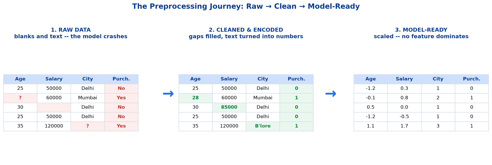
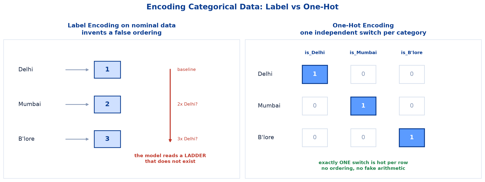
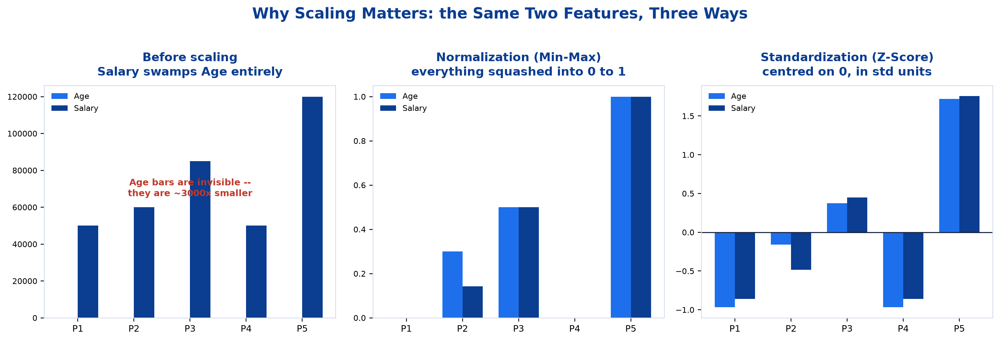
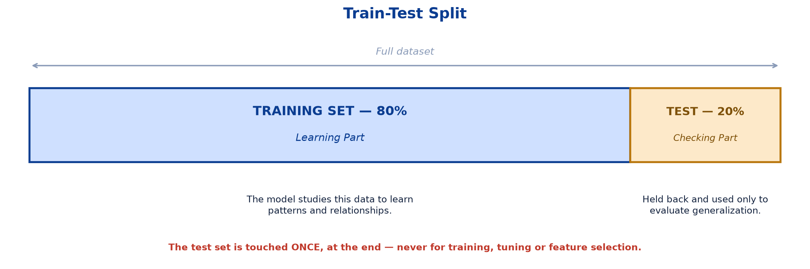
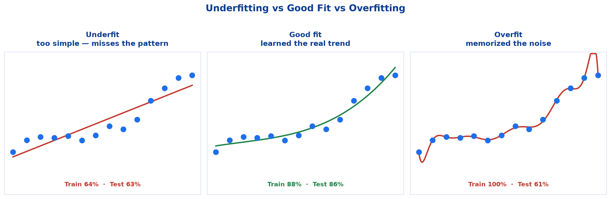

# <span style="color:#0B3D91">Data Preparation &amp; Train-Test Split</span>

> Study notes on the work that happens *before* any model is trained — why raw data breaks models, the five preprocessing steps, and the three essentials (missing values, encoding, scaling) worked through with real arithmetic. Then the train-test split: why we hold data back, what overfitting looks like, and the data-leakage trap that catches almost everyone once.
> The unglamorous chapter that decides whether everything after it works.

> **A note on formulas:** equations are written in plain text inside code blocks rather than LaTeX, so they render correctly in any Markdown viewer.

---

## <span style="color:#1E6FEB">Table of Contents</span>

1. [The Problem: Models Cannot Eat Raw Data](#1-the-problem-models-cannot-eat-raw-data)
2. [The Five Preprocessing Steps](#2-the-five-preprocessing-steps)
3. [The Three Essentials — Slowly, With Numbers](#3-the-three-essentials--slowly-with-numbers)
4. [Train-Test Split](#4-train-test-split)
5. [Practical 1 — Preprocessing, Split &amp; Baseline Metric](#5-practical-1--preprocessing-split--baseline-metric)

---

## <span style="color:#1E6FEB">1. The Problem: Models Cannot Eat Raw Data</span>

### 1.1 Overview / What is it?
**Data preprocessing** is the process of transforming raw data into a **clean, consistent and structured format** that is suitable for machine learning models.

Let's start with a concrete mess. Five people, and whether they purchased something:

| Age | Salary | City | Purchased |
|---|---|---|---|
| 25 | 50000 | Delhi | No |
| **?** | 60000 | Mumbai | Yes |
| 30 | **(blank)** | Delhi | No |
| 25 | 50000 | Delhi | No |
| 35 | 120000 | **?** | Yes |

### 1.2 Why does it matter for AI?
A machine learning model is, underneath everything, **doing arithmetic on a table of numbers**. It multiplies, adds, and compares. That is the whole repertoire.

Now look at what that table is asking it to do:

| What's wrong | Why the model breaks |
|---|---|
| `Age` has a `?` | It cannot multiply a question mark. **The code literally crashes.** |
| `Salary` has a blank | Same problem — no number, no arithmetic. |
| `City` says "Delhi" | It cannot multiply the word *Delhi*. |
| `Purchased` says "No" | It cannot compute an average of *No*. |
| Age is 25–35, Salary is 50,000–120,000 | Both are numbers, but one is **7,000× bigger**. The model will assume Salary matters vastly more. |
| Rows 1 and 4 are identical | That person is counted twice, silently doubling their influence. |

Preprocessing is the work of fixing every one of these, so that what reaches the model is a clean, consistent, structured table of numbers.

### 1.3 Key Concepts — why it's important
-  **Improves data quality**
-  **Helps models learn better patterns**
-  **Reduces training time**
-  **Increases model accuracy and reliability**
-  **Prevents misleading results**

### 1.4 Simple Example
The word *"Delhi"* is meaningful to you and completely opaque to a model. The number `50000` is readable by a model but, sitting next to an age of `25`, is silently 2,000× louder. Neither problem is visible by staring at the table — both are fatal.

### 1.5 How it works — the guiding principle

> **Remember: Good data in → Good model out.**
> **Goal:** clean, consistent and meaningful data leads to accurate insights and reliable ML models.

### 1.6 Practical Example / Use Case
Every real dataset arrives broken in these ways: survey forms with skipped questions, exports where a numeric column came through as text, systems recording "Delhi" / "delhi" / "DEL" for one city. The first hours of any ML project are spent here, not on the model.

 *A deep-dive into data cleaning and pipelines belongs to the Data Engineering module. Here we recap only what is needed to build models.*

### 1.7 Key Takeaways
> - Models do **arithmetic on numbers** — blanks crash them, text is unusable, and mismatched scales mislead them.
> - **Preprocessing** = transforming raw data into a clean, consistent, structured format suitable for ML.
> - It improves data quality, helps models learn, cuts training time, raises accuracy, and prevents misleading results.
> - **Good data in → Good model out.**

---

## <span style="color:#1E6FEB">2. The Five Preprocessing Steps</span>

### 2.1 Overview / What is it?
The full toolkit. Each step targets one of the problems we just catalogued.

| # | Step | What it involves | Fixes which problem? |
|---|---|---|---|
| **1** | **Data Cleaning** | Handle missing values (mean/median/mode, forward fill) · Remove duplicates · Fix inconsistent or incorrect data | The `?` and the blank, the duplicate row |
| **2** | **Data Transformation** | Normalize (Min-Max Scaling) · Standardize (Z-Score Scaling) · Log / Box-Cox transformation | Salary being 7,000× bigger than Age |
| **3** | **Encoding Categorical Data** | Label Encoding (ordinal) · One-Hot Encoding (nominal) · Target / Frequency Encoding | "Delhi" and "No" not being numbers |
| **4** | **Feature Engineering** | Create new features · Combine existing features · Extract meaningful information | Not a bug — an opportunity to help the model |
| **5** | **Outlier Handling** | Detect outliers (IQR, Z-Score) · Remove or cap outliers | One extreme value distorting everything |

### 2.2 Why does it matter for AI?
Knowing the full list stops you from doing half the job. It is common to fill missing values, feel finished, and hand the model a table where one feature still dominates purely because of its units.

### 2.3 Key Concepts — the three stages of the journey



**Stage 1 — RAW DATA** (what you're given):

| Age | Salary | City | Purchased |
|---|---|---|---|
| 25 | 50000 | Delhi | No |
| **?** | 60000 | Mumbai | Yes |
| 30 | **(blank)** | Delhi | No |
| 25 | 50000 | Delhi | No |
| 35 | 120000 | **?** | Yes |

**Stage 2 — AFTER CLEANING & ENCODING** (gaps filled, text → numbers):

| Age | Salary | City | Purchased |
|---|---|---|---|
| 25 | 50000 | Delhi | **0** |
| **28** | 60000 | Mumbai | **1** |
| 30 | **85000** | Delhi | **0** |
| 25 | 50000 | Delhi | **0** |
| 35 | 120000 | **Bangalore** | **1** |

The `?` in Age became **28**, the blank Salary became **85000**, the missing City became **Bangalore**, and No/Yes became **0/1**.

**Stage 3 — MODEL-READY DATA** (everything numeric *and* on a comparable scale):

```
Age    Salary   City  Purchased
-1.2    0.3      1        0
-0.1    0.8      2        1
 0.5    0.0      1        0
-1.2   -0.5      1        0
 1.1    1.7      3        1
```

Age and Salary are now **z-scored** (computed by hand in section 3), City is encoded as a number, and Purchased is 0/1.

**→ Result: better model performance — higher accuracy, better generalization.**

### 2.4 Simple Example
Follow one cell through all three stages: the `?` in row 2's Age column becomes `28` (the median), then becomes `-0.1` (its z-score). Same cell, three representations, each one closer to something a model can use.

### 2.5 How it works — order matters
Roughly: **clean first, then encode, then scale.** You cannot scale a column that still contains text, and you cannot compute a sensible mean for imputation from a column full of blanks and outliers you have not yet dealt with.

>  Rows 1 and 4 are identical duplicates. "Remove duplicates" sits under Data Cleaning, so a real pipeline would drop one — the illustration keeps both so the same five rows can be followed through all three stages.

### 2.6 Practical Example / Use Case
On the Titanic dataset the same five steps appear as: drop the mostly-empty `deck` column and fill `age`/`embarked` (cleaning), map `sex` to 0/1 and one-hot `embarked` (encoding), z-score `age` and `fare` (transformation), build `family_size` from `sibsp + parch` (feature engineering), and cap the extreme `fare` values (outlier handling).

### 2.7 Key Takeaways
> - Five steps: **data cleaning, data transformation, encoding categorical data, feature engineering, outlier handling**.
> - The journey runs **Raw → Cleaned & Encoded → Model-Ready (scaled)**.
> - General order: **clean → encode → scale**; you cannot scale text or impute reliably from unfixed data.
> - The end state is a table that is **entirely numeric and comparably scaled**.

---

## <span style="color:#1E6FEB">3. The Three Essentials — Slowly, With Numbers</span>

### 3.1 Overview / What is it?
For this session, three steps matter most:

```
1. Handle Missing Values  ->  Fill or remove blanks so the model does
                              not break on incomplete rows.

2. Encode Categorical Data -> Convert text categories (e.g. city, gender)
                              into numbers the model can use.

3. Scale Numeric Features ->  Bring features onto a similar scale so no
                              single feature dominates the model.
```

### 3.2 Why does it matter for AI?
These three are the difference between code that crashes, code that runs but learns nonsense, and code that works. Steps 1 and 2 are *survival* — without them nothing runs at all. Step 3 is *fairness* — without it the model listens to the wrong feature.

---

### 3.3 Key Concepts

## <span style="color:#1E6FEB">Step 1 — Handling Missing Values</span>

**The problem:** a blank cell has no number, so arithmetic is impossible and the model crashes.

**The two choices:** either **fill the gap** (called *imputation*) or **delete** the row/column.

#### How do you decide what to fill it with?

| Strategy | Meaning | When to use | Our example |
|---|---|---|---|
| **Mean** | The average | Numeric, values spread symmetrically | — |
| **Median** | The middle value when sorted | Numeric **with outliers** | Salary → 85000 |
| **Mode** | The most frequent value | Categorical (text) columns | City → most common city |
| **Forward fill** | Copy the previous row's value | Time-series data | Yesterday's sensor reading |
| **Drop the row** | Delete that record | Only a few rows affected | 3 bad rows out of 10,000 |
| **Drop the column** | Delete the whole feature | Mostly empty | Titanic's `deck` — ~77% missing |

#### Why median instead of mean for salary? — worked out

Our four known salaries: **50000, 60000, 50000, 120000**

```
Mean   = (50000 + 60000 + 50000 + 120000) / 4  =  280000 / 4  =  70,000

Median = sort them -> 50000, 50000, 60000, 120000
         middle two are 50000 and 60000
         (50000 + 60000) / 2  =  55,000
```

The single high earner (120000) drags the **mean** up to 70,000 — well above what three of the four people actually earn. The **median** (55,000) stays near the typical person, because it only cares about *position in the sorted list*, not the size of the extreme value.

> **Rule of thumb:** if a column has outliers (salary, house price, transaction amount), use the **median**. Otherwise the mean is fine.

```python
df["age"].fillna(df["age"].median(), inplace=True)              # numeric, outlier-safe
df["embarked"].fillna(df["embarked"].mode()[0], inplace=True)   # categorical -> most common
df.drop(columns=["deck"], inplace=True)                          # mostly missing -> drop
```

---

## <span style="color:#1E6FEB">Step 2 — Encoding Categorical Data</span>

**The problem:** the model does arithmetic. `"Delhi" × 0.5` is meaningless. Every text column must become numbers.

But **how** you convert matters enormously.



#### First: two kinds of categories

| Kind | Meaning | Examples |
|---|---|---|
| **Ordinal** | The categories have a **genuine order** | Small < Medium < Large · Poor < Average < Good |
| **Nominal** | The categories have **no order** — just different names | Delhi, Mumbai, Bangalore · Red, Blue, Green · Cat, Dog, Bird |

**The kind decides the encoding method.** That is the whole rule.

---

#### Label Encoding — for ORDINAL data

Assign each category a number, following the natural order:

| T-shirt size | → | Encoded |
|---|---|---|
| Small | | **0** |
| Medium | | **1** |
| Large | | **2** |

This works because the ordering is **real**. Medium genuinely sits between Small and Large. If the model learns "bigger number = more fabric needed", that is a true relationship. The numbers carry honest meaning.

```python
df["size"] = df["size"].map({"Small": 0, "Medium": 1, "Large": 2})
```

---

#### The disaster if you use Label Encoding on NOMINAL data

Now naively label-encode our cities:

| City | → | Encoded |
|---|---|---|
| Delhi | | **1** |
| Mumbai | | **2** |
| Bangalore | | **3** |

Looks harmless. It is not. **Watch what the model does with those numbers.**

Suppose the model learns a coefficient of 5,000 per unit of `city_code`. It will compute:

```
Delhi     :  5000 x 1  =   5,000
Mumbai    :  5000 x 2  =  10,000
Bangalore :  5000 x 3  =  15,000
```

The model has now *silently invented three false facts*:

1. **Bangalore is 3× Delhi.** (It isn't. They're just cities.)
2. **Mumbai is exactly halfway between Delhi and Bangalore.** (Meaningless.)
3. **The cities sit on a ladder** — evenly spaced, in that specific order.

None of this is in your data. It is an artifact of the numbers you happened to pick. Reorder the cities alphabetically and the model's predictions change — a clear sign something is broken.

> **The false-ordering trap:** label encoding forces an ordering onto categories that have none, and the model will believe it.

---

#### One-Hot Encoding — the fix for NOMINAL data

Instead of one column holding 1/2/3, create **one separate yes/no column per category**:

| Original City | → | `is_Delhi` | `is_Mumbai` | `is_Bangalore` |
|---|---|---|---|---|
| Delhi | | **1** | 0 | 0 |
| Mumbai | | 0 | **1** | 0 |
| Bangalore | | 0 | 0 | **1** |
| Delhi | | **1** | 0 | 0 |

**Why "one-hot"?** In each row, exactly **one** switch is *hot* (set to 1) and all the others are *cold* (0). One hot, rest cold.

**Read a row like a checklist:**

- Row 1 → *"Is it Delhi? Yes (1). Is it Mumbai? No (0). Is it Bangalore? No (0)."*
- Row 3 → *"Is it Delhi? No. Is it Mumbai? No. Is it Bangalore? Yes."*

**Why this fixes the problem:** every value is now just **0 or 1** — present or absent. There is no "2", so nothing can be twice anything else. No ladder, no ordering, no fake arithmetic.

Crucially, the model now learns a **separate, independent effect for each city**:

```
effect_of_Delhi      = +2,000     <- learned independently
effect_of_Mumbai     = +9,000     <- learned independently
effect_of_Bangalore  = +4,500     <- learned independently
```

Mumbai's effect is the *largest*, even though it sat in the middle when label-encoded. With one-hot, the data decides each city's effect on its own.

Think of it as: label encoding gives the model **one dial** with cities placed along it. One-hot gives the model **one independent switch per city**.

```python
df = pd.get_dummies(df, columns=["city"])
# creates: city_Delhi, city_Mumbai, city_Bangalore
```

#### The trade-off, and `drop_first`

One-hot's cost is **width**: 3 cities → 3 new columns. 500 postal codes → **500 new columns**.

There is also a redundancy: if `is_Delhi=0` and `is_Mumbai=0`, then Bangalore is *guaranteed* — the third column adds nothing. Dropping one avoids this (the *dummy variable trap*, which matters for regression):

```python
df = pd.get_dummies(df, columns=["city"], drop_first=True)
# creates only: city_Mumbai, city_Bangalore
# "both 0" now means Delhi -- the baseline
```

#### Target / Frequency Encoding — when one-hot is too wide

Replace each category with a **statistic about it** instead:

| City | Frequency encoding | Target encoding |
|---|---|---|
| Delhi | appears 3 times → **3** | avg purchase rate for Delhi → **0.33** |
| Mumbai | appears 1 time → **1** | avg purchase rate for Mumbai → **1.00** |

One column instead of hundreds. (Target encoding needs care to avoid leakage, but that is beyond this session.)

#### Quick decision guide

| Your column | Use |
|---|---|
| Two categories only (`male`/`female`, `yes`/`no`) | Simple 0/1 mapping |
| Ordered categories (Small/Medium/Large) | **Label Encoding** |
| Unordered, few categories (cities, colours) | **One-Hot Encoding** |
| Unordered, hundreds of categories (postal codes) | **Target / Frequency Encoding** |

```python
df["sex"] = df["sex"].map({"male": 0, "female": 1})               # binary
df = pd.get_dummies(df, columns=["embarked"], drop_first=True)     # nominal -> one-hot
```

---

## <span style="color:#1E6FEB">Step 3 — Scaling Numeric Features</span>

**The goal:** bring features onto a similar scale **so no single feature dominates the model**.

This one confuses people because both columns are *already numbers*. So what is the issue?



#### The problem, demonstrated with real arithmetic

Take three people:

| Person | Age | Salary |
|---|---|---|
| **A** | 25 | 50,000 |
| **B** | 35 | 51,000 |
| **C** | 26 | 120,000 |

**Who is more similar to Person A — B or C?**

Look with your eyes: **C**, obviously. C is 26 (basically A's age of 25). B is a full decade older.

Now watch what a distance-based algorithm (like KNN) computes. Distance uses Pythagoras:

```
distance = sqrt( (age difference)^2 + (salary difference)^2 )
```

**A to B:**
```
age diff    = 25 - 35      =    -10  ->  (-10)^2    =         100
salary diff = 50000 - 51000 =  -1000  ->  (-1000)^2  =   1,000,000

distance = sqrt(100 + 1,000,000) = sqrt(1,000,100)  ~=  1,000.05
```

**A to C:**
```
age diff    = 25 - 26        =      -1  ->  (-1)^2      =              1
salary diff = 50000 - 120000 =  -70000  ->  (-70000)^2  =  4,900,000,000

distance = sqrt(1 + 4,900,000,000)  ~=  70,000.00
```

**Result: A–B distance ≈ 1,000. A–C distance ≈ 70,000.** The algorithm concludes **B is 70× more similar to A than C is** — the exact opposite of the truth.

Look at the contributions:

| Comparison | Age contributed | Salary contributed | Age's share |
|---|---|---|---|
| A vs B | 100 | 1,000,000 | **0.01%** |
| A vs C | 1 | 4,900,000,000 | **0.00000002%** |

Age is **completely invisible**. Salary decides everything — not because salary is more important, but purely because it is *measured in bigger units*.

**The proof this is a bug:** re-record salary in lakhs (0.5, 0.51, 1.2) and the model's answer flips entirely. **Your model's behaviour should not depend on whether you wrote rupees or lakhs.**

---

#### Method 1: Normalization (Min-Max Scaling) — squash into 0 to 1

```
x_scaled = (x - min) / (max - min)
```

In words: *"how far along the range is this value, from 0% to 100%?"*

**Worked on Age** — values `25, 28, 30, 25, 35`, so min = 25, max = 35, range = 10:

| Age | Calculation | Scaled |
|---|---|---|
| 25 | (25 − 25) / 10 = 0 / 10 | **0.00** ← the minimum always becomes 0 |
| 28 | (28 − 25) / 10 = 3 / 10 | **0.30** |
| 30 | (30 − 25) / 10 = 5 / 10 | **0.50** ← exactly halfway |
| 25 | (25 − 25) / 10 = 0 / 10 | **0.00** |
| 35 | (35 − 25) / 10 = 10 / 10 | **1.00** ← the maximum always becomes 1 |

**Worked on Salary** — values `50000, 60000, 85000, 50000, 120000`, min = 50000, max = 120000, range = 70000:

| Salary | Calculation | Scaled |
|---|---|---|
| 50000 | 0 / 70000 | **0.00** |
| 60000 | 10000 / 70000 | **0.14** |
| 85000 | 35000 / 70000 | **0.50** |
| 50000 | 0 / 70000 | **0.00** |
| 120000 | 70000 / 70000 | **1.00** |

**Both columns now live in 0–1.** Neither can dominate.

- **Pros:** intuitive, bounded output, keeps the shape of the distribution.
- **Cons:** **very sensitive to outliers.** Add one billionaire and everyone else squashes into 0.00–0.01.

---

#### Method 2: Standardization (Z-Score Scaling) — centre on 0

```
z = (x - mean) / standard deviation
```

Before the formula, the two ingredients:

**Mean** = the average. Add everything up, divide by how many. This becomes our **zero point**.

**Standard deviation (std)** = the *typical distance from the mean*. It answers *"how spread out is this data?"*

- Small std → values huddle near the average (ages 29, 30, 31).
- Large std → values scatter widely (ages 5, 30, 70).

It is computed by taking each value's distance from the mean, squaring them (so negatives don't cancel), averaging those squares, then square-rooting back.

**What a z-score means:** *"how many standard deviations is this value from the average?"*

```
z = +2.0  ->  two std ABOVE average (unusually high)
z =  0.0  ->  exactly average
z = -1.0  ->  one std BELOW average
z = -3.0  ->  three std below (very unusual -- often an outlier)
```

**Worked on Age** — values `25, 28, 30, 25, 35`:

*Step 1 — the mean:*
```
mean = (25 + 28 + 30 + 25 + 35) / 5  =  143 / 5  =  28.6
```

*Step 2 — distance from mean, then square:*

| Age | Age − 28.6 | Squared |
|---|---|---|
| 25 | −3.6 | 12.96 |
| 28 | −0.6 | 0.36 |
| 30 | +1.4 | 1.96 |
| 25 | −3.6 | 12.96 |
| 35 | +6.4 | 40.96 |
| | **Total** | **69.20** |

*Step 3 — the standard deviation:*
```
average of squares = 69.20 / 5 = 13.84
std = sqrt(13.84)  ~=  3.72
```

A "typical" age in this group sits about **3.72 years** from the average of 28.6.

*Step 4 — the z-scores:*

| Age | Calculation | z-score | Reading |
|---|---|---|---|
| 25 | (25 − 28.6) / 3.72 | **−0.97** | about 1 std below average |
| 28 | (28 − 28.6) / 3.72 | **−0.16** | just below average |
| 30 | (30 − 28.6) / 3.72 | **+0.38** | slightly above average |
| 25 | (25 − 28.6) / 3.72 | **−0.97** | about 1 std below average |
| 35 | (35 − 28.6) / 3.72 | **+1.72** | notably above average |

**Same treatment for Salary** — values `50000, 60000, 85000, 50000, 120000`:

```
mean = 365,000 / 5 = 73,000
std ~= 26,758
```

| Salary | Calculation | z-score |
|---|---|---|
| 50000 | (50000 − 73000) / 26758 | **−0.86** |
| 60000 | (60000 − 73000) / 26758 | **−0.49** |
| 85000 | (85000 − 73000) / 26758 | **+0.45** |
| 50000 | (50000 − 73000) / 26758 | **−0.86** |
| 120000 | (120000 − 73000) / 26758 | **+1.76** |

**Look at what we achieved.** Before scaling, Age ranged over 10 and Salary over 70,000. Now:

| | Age (z) | Salary (z) |
|---|---|---|
| Range | −0.97 to +1.72 | −0.86 to +1.76 |

**Both columns now speak the same language** — "standard deviations from average" — and neither can bully the other.

- **Pros:** far less sensitive to outliers than min-max; the default for most ML work.
- **Cons:** not bounded to a fixed range; slightly less intuitive at a glance.

---

#### Normalization vs Standardization — side by side

| | **Normalization (Min-Max)** | **Standardization (Z-Score)** |
|---|---|---|
| **Formula** | `(x - min) / (max - min)` | `(x - mean) / std` |
| **Output range** | Exactly 0 to 1 | Centred at 0, usually −3 to +3 |
| **Means** | "% of the way through the range" | "how many std from average" |
| **Outlier sensitivity** | **High** — one extreme squashes everything | **Lower** — more robust |
| **Use when** | You need a bounded range; no bad outliers | General ML default; outliers present |

**Log / Box-Cox transformation** is a third option for heavily skewed data — `log(x)` pulls in a long right tail (incomes, city populations) before you scale.

#### Which algorithms actually need scaling?

| Algorithm | Needs scaling? | Why |
|---|---|---|
| **KNN** |  **Critical** | Built entirely on distances — exactly the bug computed above |
| **SVM** |  **Critical** | Distances and margins again |
| **Linear / Logistic Regression** |  Yes, usually | Gradient descent converges much faster |
| **Decision Trees / Random Forest** |  No | They split on thresholds; units are irrelevant |

> **When in doubt, scale.** It never hurts, and for KNN/SVM it is the difference between a working model and a broken one.

```python
from sklearn.preprocessing import StandardScaler, MinMaxScaler

scaler = StandardScaler()                    # z-score
X_scaled = scaler.fit_transform(X[["age", "fare"]])

scaler = MinMaxScaler()                      # 0 to 1
X_scaled = scaler.fit_transform(X[["age", "fare"]])
```

---

### 3.4 Simple Example
One row, all three steps: `[?, 60000, "Mumbai", "Yes"]` becomes `[28, 60000, "Mumbai", 1]` after imputation, then `[28, 60000, 0, 1, 0, 1]` after one-hot encoding the city, then `[-0.16, -0.49, 0, 1, 0, 1]` after z-scoring the numerics. Now every element is a comparable number.

### 3.5 How it works — Bonus: Outlier Handling & Feature Engineering

**Outliers** are values far outside the normal range — sometimes genuine (a real billionaire), sometimes an error (age = 250).

**Detecting them:**

- **IQR method** — sort the data, find `Q1` (25th percentile) and `Q3` (75th percentile), let `IQR = Q3 - Q1`. Flag anything below `Q1 - 1.5*IQR` or above `Q3 + 1.5*IQR`.
- **Z-Score method** — flag anything with `|z| > 3` (more than 3 std from the mean). *You already know how to compute this.*

**Handling them:** **remove** the row, or **cap** it (clip to a sensible maximum). Capping is often kinder — a genuinely rich customer is not bad data, just extreme.

**Feature engineering** — creating better inputs from existing ones:

| Raw columns | Engineered feature |
|---|---|
| `sibsp` + `parch` (Titanic) | `family_size = sibsp + parch + 1` |
| `date_of_birth` | `age`, `is_weekend`, `month` |
| `height`, `weight` | `bmi = weight / height^2` |

Often a single well-chosen engineered feature beats a fancier algorithm.

### 3.6 Practical Example / Use Case
Preparing Titanic for modelling touches all three essentials: `age` gets median-imputed and `embarked` mode-imputed (step 1), `sex` becomes 0/1 and `embarked` becomes one-hot columns (step 2), and `age`/`fare` get z-scored (step 3) — which matters enormously because `fare` spans 0–512 while `age` spans 0–80.

### 3.7 Key Takeaways
> - **Missing values** → mean / median / mode / forward fill / drop. Prefer **median** with outliers (our salaries: mean 70,000 vs median 55,000).
> - **Ordinal** categories (Small/Medium/Large) → **Label Encoding**; the order is real.
> - **Nominal** categories (cities) → **One-Hot Encoding**; label-encoding them invents a false ladder where *Bangalore = 3 × Delhi*.
> - **One-hot** = one yes/no column per category, exactly one "hot" (1) per row — each category gets an **independent** effect.
> - Use `drop_first=True` to avoid the redundant column (dummy variable trap); use **target/frequency encoding** when categories run into the hundreds.
> - **Scaling** stops a big-unit feature dominating: unscaled, Age contributed **0.01%** of the distance and Salary **99.99%**.
> - **Normalization (Min-Max)** → `(x-min)/(max-min)`, squashes to **0–1**, outlier-sensitive.
> - **Standardization (Z-Score)** → `(x-mean)/std`, centres at **0**, reads as *"how many std from average"*, more outlier-robust — the usual default.
> - Scaling is **critical for KNN and SVM**, unnecessary for trees. When in doubt, scale.

---

## <span style="color:#1E6FEB">4. Train-Test Split</span>

### 4.1 Overview / What is it?
Before training, we divide the dataset into two parts — **so we can check the model on data it has never seen.**



| Part | Share | Role |
|---|---|---|
| **Training Set** | ~80% | **Learning part** — the model studies this data to learn patterns and relationships |
| **Test Set** | ~20% | **Checking part** — held back, used **only** to evaluate how well the model generalizes |

### 4.2 Why does it matter for AI?
Without a held-back set you have **no honest way to know whether your model works**. Every score you report would be the model grading its own homework — and it will always give itself full marks.

### 4.3 Key Concepts — overfitting

**The exam analogy.** Imagine handing students the exact exam paper as homework, then giving them that same paper as the exam. Everyone scores 100%. You have learned **nothing** about who understands the subject — only who can memorize.

Testing a model on its own training data is exactly that mistake.

**Overfitting** = the model memorizes the training data, including its noise and quirks, instead of learning the general pattern.



The symptom is unmistakable:

| | Training score | Test score | Diagnosis |
|---|---|---|---|
| **Good model** | 88% | 86% | Learned the real pattern  |
| **Overfit model** | **100%** | **61%** | Memorized the answers  |
| **Underfit model** | 64% | 63% | Too simple, missed the pattern |

**The rule:** the test set is touched **once**, at the end. Not for training, not for tuning, not for picking features. The moment it influences a decision, it stops being an honest estimate.

### 4.4 Simple Example

```python
from sklearn.model_selection import train_test_split

X_train, X_test, y_train, y_test = train_test_split(
    X, y,
    test_size=0.2,        # 20% held back for checking
    random_state=42,      # fixed seed -> reproducible split
    stratify=y            # keep class balance identical in both parts
)
```

- **`random_state=42`** — fixes the shuffle so every re-run gives the same split. Without it your accuracy wobbles between runs and you cannot tell whether a change helped.
- **`stratify=y`** — preserves class proportions. If 38% of Titanic passengers survived, both parts keep ~38%. Without it, an unlucky split hands you a test set with barely any positives.

### 4.5 How it works —  the scaling-and-splitting gotcha (data leakage)

Now that scaling makes sense, here is the subtle trap: **scale *after* splitting, and fit the scaler on training data only.**

```python
#  Leaky -- the scaler computed its mean and std using test rows too
X_scaled = StandardScaler().fit_transform(X)
X_train, X_test = train_test_split(X_scaled, ...)

#  Rigorous -- test set stays genuinely unseen
X_train, X_test, y_train, y_test = train_test_split(X, y, ...)
scaler = StandardScaler().fit(X_train)     # learn mean/std from TRAIN only
X_train = scaler.transform(X_train)
X_test  = scaler.transform(X_test)         # apply the SAME mean/std
```

Recall that z-score needs a **mean** and a **std**. If those are computed from the whole dataset, information about the test rows has leaked into training. Your test score becomes optimistic — a lie you discover in production.

### 4.6 Practical Example / Use Case
The course practicals demonstrate both approaches: the Titanic walkthrough scales before splitting for simplicity, while the Auto MPG regression splits first and then scales on the training data only — explicitly flagged as the more rigorous approach in practice.

### 4.7 Key Takeaways
> - **Train-Test Split (80/20):** training set = **learning part**, test set = **checking part**.
> - The test set is touched **once**, at the end — never for training, tuning, or feature selection.
> - Skipping the split risks **overfitting** — memorizing instead of learning. The tell: **high training score, poor test score**.
> - **Underfitting** is the opposite failure — both scores low because the model is too simple.
> - `random_state` makes the split **reproducible**; `stratify=y` **preserves class balance**.
> - **Fit the scaler on training data only** — computing mean/std over everything leaks test information.

---

## <span style="color:#1E6FEB">5. Practical 1 — Preprocessing, Split &amp; Baseline Metric</span>

### 5.1 Overview / What is it?
The hands-on notebook works through the **Titanic dataset** (loaded directly via `seaborn`, no download needed), applying everything above and finishing with a baseline score.

### 5.2 Why does it matter for AI?
A **baseline** is what stops you from being impressed by a mediocre model. Without one, any number looks like a result.

### 5.3 Key Concepts — the practical's stages

| Stage | What happens |
|---|---|
| Missing value handling | `age` → median, `embarked` → mode, `deck` → dropped |
| Categorical encoding | `sex` → 0/1, `embarked` → one-hot |
| EDA | Inspect distributions and survival rates before modelling |
| Standardization | Z-score the numeric features |
| Train-test split | 80 / 20 with a fixed random seed |
| **Baseline metric** | Compute a starting score to beat |

### 5.4 Simple Example — what is a baseline?
A **baseline** is the score from the dumbest possible "model" — the number every real model must beat to justify existing.

| Task | Baseline strategy | Titanic example |
|---|---|---|
| Classification | Always predict the majority class | "Nobody survived" → **~62% accuracy** |
| Regression | Always predict the mean | Predict average MPG for every car |

That 62% is sobering, and that is the point. If your carefully-tuned classifier scores 64%, it has added almost nothing over a model that ignores every input. Without a baseline, 64% *sounds* respectable.

### 5.5 How it works

```python
from sklearn.dummy import DummyClassifier
from sklearn.metrics import accuracy_score

baseline = DummyClassifier(strategy="most_frequent").fit(X_train, y_train)
print(accuracy_score(y_test, baseline.predict(X_test)))
```

### 5.6 Practical Example / Use Case
Reporting "our churn model is 91% accurate" sounds excellent — until you discover only 9% of customers churn, so predicting "nobody churns" scores 91% too. The baseline turns an impressive-sounding number into an obviously worthless one.

### 5.7 Key Takeaways
> - Practical 1 runs the full sequence: **impute → encode → EDA → scale → split → baseline**.
> - A **baseline** is the score of the dumbest model: majority class for classification, mean for regression.
> - Titanic's majority-class baseline is **~62% accuracy** — that is the bar, not zero.
> - A model that cannot beat its baseline is not earning its keep, however good the raw number looks.

---

## <span style="color:#1E6FEB">Regenerating the Diagrams</span>

Figures live in the `figures/` package (one module per topic, shared palette in `figures/core.py`):

```bash
cd machine_learning_01/notes && ../../.venv/bin/python plot_ml_figures.py
```

Pass figure names to rebuild only some, e.g. `... plot_ml_figures.py scaling_comparison overfitting`.

---

*End of file 02 — Data Preparation & Train-Test Split complete. Next: Model Evaluation Metrics.*
