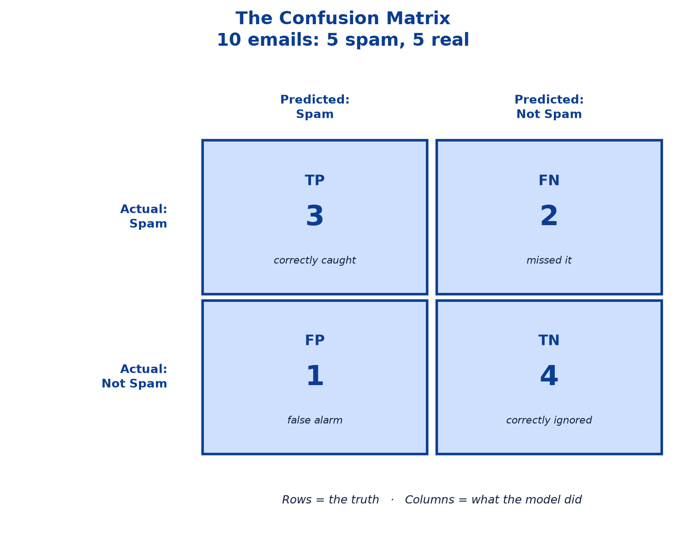
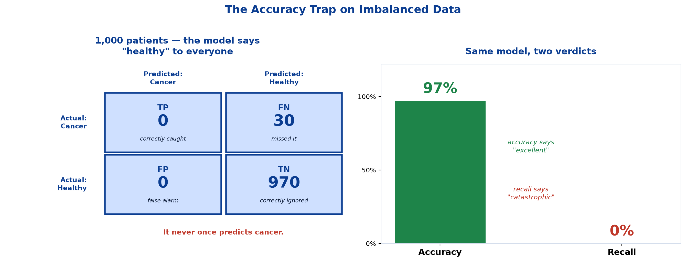
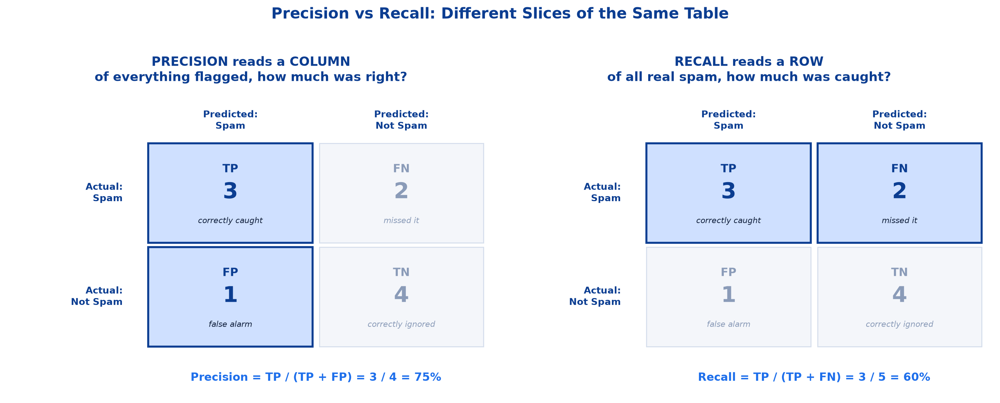
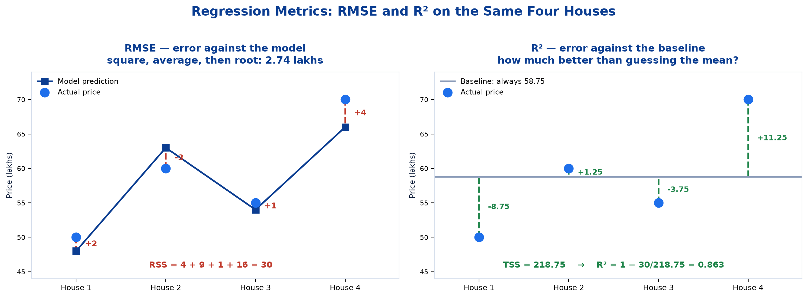

# <span style="color:#0B3D91">Model Evaluation Metrics</span>

> Study notes on the question *"how do we know if a model is any good?"* — the confusion matrix that underpins every classification score, then accuracy, precision, recall and F1 worked through on a single ten-email example, and RMSE and R² worked through on four house prices.
> The chapter that teaches you to distrust a single impressive number.

> **A note on formulas:** equations are written in plain text inside code blocks rather than LaTeX, so they render correctly in any Markdown viewer.

---

## <span style="color:#1E6FEB">Table of Contents</span>

1. [Why One Number Is Never Enough](#1-why-one-number-is-never-enough)
2. [The Confusion Matrix — The Foundation](#2-the-confusion-matrix--the-foundation)
3. [Classification Metrics I: Accuracy &amp; Precision](#3-classification-metrics-i-accuracy--precision)
4. [Classification Metrics II: Recall &amp; F1 Score](#4-classification-metrics-ii-recall--f1-score)
5. [Regression Metrics: RMSE &amp; R²](#5-regression-metrics-rmse--r)
6. [Choosing the Right Metric](#6-choosing-the-right-metric)

---

## <span style="color:#1E6FEB">1. Why One Number Is Never Enough</span>

### 1.1 Overview / What is it?
You have built a model. It reports **97% accurate**. Ship it?

**No.** Consider a cancer screening model tested on 1,000 patients, 30 of whom have cancer. The model predicts *"healthy"* for **every single patient**. It never fires once.

```
Correct predictions = 970 healthy patients  ->  970/1000 = 97% accuracy
```

**97% accurate, and it missed every cancer case.** It is worse than useless — it is actively dangerous, because the number inspires confidence.

### 1.2 Why does it matter for AI?
This is why we need **several metrics that disagree with each other**. Each one shines a light on a different failure. The whole skill is knowing which metric matters for *your* problem — and a model shipped on the strength of one flattering number is a model nobody has actually evaluated.

### 1.3 Key Concepts
Metrics split by task type (from Topic 1):

| Task | Metrics |
|---|---|
| **Classification** (predicting a category) | Confusion matrix, Accuracy, Precision, Recall, F1 |
| **Regression** (predicting a number) | RMSE, R² |

### 1.4 Simple Example
The cancer model above is the canonical warning. A single number said "excellent"; the model caught nothing. Section 4 shows the metric that exposes it.

### 1.5 How it works
Classification metrics all derive from one small table — the confusion matrix — so we build that first, then read four different metrics out of it. Regression metrics work differently, because a numeric prediction is never exactly right.

### 1.6 Practical Example / Use Case
Any imbalanced problem — fraud (0.1% of transactions), churn (9% of customers), defect detection (2% of units) — will produce a flattering accuracy for a model that does nothing at all. These are the majority of real business problems.

### 1.7 Key Takeaways
> - **One metric is never enough** — a 97%-accurate cancer model can catch **zero** cancers.
> - Different metrics expose **different failures**; the skill is choosing the one that matches your problem's costs.
> - Classification and regression need **completely different metric families**.

---

## <span style="color:#1E6FEB">2. The Confusion Matrix — The Foundation</span>

### 2.1 Overview / What is it?
> A confusion matrix compares **what the model predicted** against **what actually happened**.

Every classification metric is computed from this one table, so it is worth getting comfortable with.

```
                        Predicted ->
                   +--------------+--------------+
                   |  Yes         |  No          |
     +-------------+--------------+--------------+
     |             |              |              |
 A   |    Yes      |  TRUE        |  FALSE       |
 c   |             |  POSITIVE    |  NEGATIVE    |
 t   |             |  (TP)        |  (FN)        |
 u   |             |              |              |
 a   +-------------+--------------+--------------+
 l   |             |              |              |
     |    No       |  FALSE       |  TRUE        |
 |   |             |  POSITIVE    |  NEGATIVE    |
 v   |             |  (FP)        |  (TN)        |
     +-------------+--------------+--------------+
```

| Cell | Meaning | Plain English |
|---|---|---|
| **True Positive (TP)** | Predicted Yes, Actual Yes | Correctly caught it  |
| **False Positive (FP)** | Predicted Yes, Actual No | **False alarm**  |
| **False Negative (FN)** | Predicted No, Actual Yes | **Missed it**  |
| **True Negative (TN)** | Predicted No, Actual No | Correctly ignored it  |

### 2.2 Why does it matter for AI?
A single score tells you *how often* a model fails. The confusion matrix tells you **where** it fails — and since the two error types usually cost wildly different amounts, that is the information you actually need.

### 2.3 Key Concepts

#### The naming trick
Two words, read in this order:

1. **Second word** = what the model *predicted* (Positive = "yes", Negative = "no")
2. **First word** = was the model *right*? (True = correct, False = wrong)

So **False Negative** = the model predicted "Negative" (no), and it was False (wrong) → **there really was a yes, and we missed it.**

#### The two errors are not equal
This is the whole point of the matrix. **FP and FN cost different things**, and which one hurts more depends entirely on the problem:

| Scenario | False Positive costs | False Negative costs |
|---|---|---|
| **Cancer screening** | An unnecessary follow-up test — stressful, expensive | **A missed cancer.** Potentially fatal. |
| **Spam filter** | A real invoice lands in the spam folder — you miss it | A junk email in your inbox — mildly annoying |
| **Fraud detection** | A genuine purchase declined — angry customer | Fraud goes through — money lost |

Cancer and spam are **opposites**. For cancer, FN is catastrophic. For spam, FP is the painful one. **No single metric can be right for both** — which is exactly why we need precision *and* recall.

### 2.4 Simple Example — our 10 emails

Everything in sections 3 and 4 uses **this one tiny dataset**, small enough to count on your fingers. A spam filter was run on 10 emails:

| # | Email subject | **Actually** | **Model said** | Right? | Cell |
|---|---|---|---|---|---|
| 1 | "Win a free iPhone!!!" | Spam | Spam |  | **TP** |
| 2 | "URGENT: claim your prize" | Spam | Spam |  | **TP** |
| 3 | "Cheap meds online" | Spam | Spam |  | **TP** |
| 4 | "Lottery winner — act now" | Spam | Not spam |  | **FN** ← missed |
| 5 | "Double your crypto today" | Spam | Not spam |  | **FN** ← missed |
| 6 | "Invoice #4471 attached" | Not spam | Spam |  | **FP** ← false alarm |
| 7 | "Team standup at 10am" | Not spam | Not spam |  | **TN** |
| 8 | "Mum: call me when free" | Not spam | Not spam |  | **TN** |
| 9 | "Your order has shipped" | Not spam | Not spam |  | **TN** |
| 10 | "Project deadline Friday" | Not spam | Not spam |  | **TN** |

**Count them up:**

```
TP = 3   (emails 1, 2, 3  -- spam, correctly flagged)
FN = 2   (emails 4, 5     -- spam, WRONGLY let through)
FP = 1   (email 6         -- real invoice, WRONGLY binned)
TN = 4   (emails 7-10     -- real mail, correctly delivered)
                                                    -----
                                          Total       10
```

### 2.5 How it works — reading the matrix



|  | **Predicted: Spam** | **Predicted: Not Spam** | Row total |
|---|---|---|---|
| **Actually Spam** | **TP = 3** | **FN = 2** | 5 spam arrived |
| **Actually Not Spam** | **FP = 1** | **TN = 4** | 5 real emails |
| **Column total** | 4 flagged | 6 delivered | **10** |

Two useful readings of the margins:

- **Rows** = the truth. *5 spam emails arrived; 5 real emails arrived.*
- **Columns** = what the model did. *It flagged 4 as spam; it delivered 6.*

Keep this table in view — the next four metrics are all just different slices of it.

### 2.6 Practical Example / Use Case
Before reporting any classification score, print the confusion matrix. A model with 4 TP and 0 FP looks identical in precision to one with 400 TP and 0 FP — but the first has probably barely fired at all. The raw counts make that obvious instantly.

### 2.7 Key Takeaways
> - The confusion matrix compares **predicted** against **actual**, and every classification metric derives from it.
> - **TP** = correctly caught, **FP** = false alarm, **FN** = missed it, **TN** = correctly ignored.
> - Naming trick: **second word** = what was predicted, **first word** = whether that was right.
> - **FP and FN cost different amounts**, and which is worse is a property of the problem, not the model.
> - **Rows** are the truth; **columns** are the model's decisions.

---

## <span style="color:#1E6FEB">3. Classification Metrics I: Accuracy &amp; Precision</span>

### 3.1 Overview / What is it?
Two metrics, both read off the confusion matrix, answering very different questions:

- **Accuracy** — *of everything, how much was right?*
- **Precision** — *of the things it flagged, how much was right?*

### 3.2 Why does it matter for AI?
Accuracy is the number everyone reaches for and the one most likely to mislead. Precision is the number that matters when **acting on a false alarm is expensive**.

---

### 3.3 Key Concepts

## <span style="color:#1E6FEB">Accuracy — "how often is the model right overall?"</span>

#### The idea in one sentence
Out of **everything** the model looked at, what fraction did it get right?

#### Building the formula from scratch
Which of our four cells are *correct* predictions?

- **TP** — said spam, was spam. **Correct.** 
- **TN** — said not spam, wasn't spam. **Correct.** 
- **FP** — said spam, wasn't. **Wrong.** 
- **FN** — said not spam, was. **Wrong.** 

So the correct ones are **TP + TN**, and the total is all four cells:

```
Accuracy = (TP + TN) / (TP + TN + FP + FN)
              ^^^^^^^      ^^^^^^^^^^^^^^^^^^^^^
              correct           everything
```

#### On our 10 emails

```
Correct = TP + TN = 3 + 4 = 7
Total   = 10

Accuracy = 7 / 10 = 0.70  ->  70%
```

**Reading it:** *"The filter got 7 out of 10 emails right."*

#### Range of values
**0 to 1** (often shown as 0% to 100%). **Higher is better.**

| Pros | Cons |
|---|---|
| Simple and easy to explain to anyone | **Misleading on imbalanced data** |
| Works well when classes are roughly balanced | Does not show **which class** is being missed |

#### Why "misleading on imbalanced data"? — the cancer case, drawn out

Our email example was **balanced** (5 spam, 5 real), so 70% is a fair summary. Now watch it break.

1,000 patients, only 30 have cancer. The model says **"healthy"** to everyone:

|  | **Predicted: Cancer** | **Predicted: Healthy** |
|---|---|---|
| **Actually Cancer** | TP = **0** | FN = **30** |
| **Actually Healthy** | FP = 0 | TN = 970 |

```
Accuracy = (TP + TN) / total
         = (0 + 970) / 1000
         = 0.97  ->  97%
```



The model caught **zero** cancers and still scored 97%. Why? Because **TN is doing all the work** — 970 easy "healthy" calls swamp the 30 that mattered.

> **The trap:** when one class hugely outnumbers the other, accuracy mostly measures how good you are at the *easy, common* class. That is both cons in one example — misleading on imbalanced data, and silent about *which* class is failing.

---

## <span style="color:#1E6FEB">Precision — "when it says yes, how often is it right?"</span>

#### The idea in one sentence
**Ignore everything except the predictions where the model shouted "YES".** Of those, how many were actually right?

#### Building the formula from scratch
Which cells did the model predict as "Yes" (spam)?

- **TP** — said spam, and it *was* spam. 
- **FP** — said spam, but it *wasn't*. 

Those two cells together are **every email the model flagged**. Precision asks what fraction of them was correct:

```
Precision = TP / (TP + FP)
             ^^     ^^^^^^^^^
          correct   everything it FLAGGED
           flags
```

**Note what is absent:** `FN` and `TN` do not appear. Precision is looking at exactly **one column** of the confusion matrix.

|  | **Predicted: Spam**  | Predicted: Not Spam |
|---|---|---|
| **Actually Spam** | **TP = 3**  | *(ignored)* |
| **Actually Not Spam** | **FP = 1**  | *(ignored)* |

#### On our 10 emails

The filter flagged **4 emails** as spam: numbers 1, 2, 3 (genuinely spam) and 6 (the invoice — oops).

```
Precision = TP / (TP + FP)
          = 3 / (3 + 1)
          = 3 / 4
          = 0.75  ->  75%
```

**Reading it:** *"When this filter says 'this is spam', it is right 75% of the time."* Or flipped: **1 in every 4 things it bins is actually a real email.**

For spam filtering that is the error that stings — email #6 was an invoice, and it is now sitting in a folder nobody checks.

#### Range of values
**0 to 1.** **Higher means fewer false alarms.**

| Pros | Cons |
|---|---|
| Useful when a **false positive is costly** | **Ignores false negatives entirely** |
| Shows the **quality** of positive predictions | Can look high even if many positives are missed |

#### Precision's blind spot, demonstrated

Suppose we make the filter extremely cautious — it flags **only email #1**, the most obviously spammy one, and nothing else:

|  | Predicted: Spam | Predicted: Not Spam |
|---|---|---|
| **Actually Spam** | TP = **1** | FN = **4** |
| **Actually Not Spam** | FP = **0** | TN = 5 |

```
Precision = 1 / (1 + 0) = 1.00  ->  100%
```

**A perfect precision score** — while letting **4 out of 5 spam emails** straight into your inbox. Precision literally cannot see them, because `FN` is not in its formula.

> That is exactly what *"ignores false negatives entirely"* means. Precision is one eye open. We need the other eye — **recall**.

### 3.4 Simple Example
Same model, two numbers: accuracy **70%** (of all 10 emails) and precision **75%** (of the 4 it flagged). Different denominators, different questions, both true at once.

### 3.5 How it works — which denominator?
The quickest way to keep these straight is to ask *what is on the bottom of the fraction?*

| Metric | Denominator | In words |
|---|---|---|
| **Accuracy** | Everything (all 10) | *of all cases* |
| **Precision** | Everything flagged (the 4) | *of what it claimed* |

### 3.6 Practical Example / Use Case
A marketing team sends a discount to everyone the model flags as "likely to churn". Each offer costs money, so a false positive is a wasted discount to a loyal customer. **Precision is the metric they care about** — it directly measures how much of their budget reaches the right people.

### 3.7 Key Takeaways
> - **Accuracy** = `(TP+TN)/all` → *our filter: 70%*. Simple, but **misleading on imbalanced data** and hides which class is failing.
> - On the cancer example, accuracy reports **97%** for a model that catches nothing — the TN count swamps everything.
> - **Precision** = `TP/(TP+FP)` → *our filter: 75%*. Reads **one column**: of everything flagged, how much was right?
> - Use precision when **false positives are costly**.
> - Precision **ignores false negatives** — a filter that flags a single email scores **100%**.

---

## <span style="color:#1E6FEB">4. Classification Metrics II: Recall &amp; F1 Score</span>

### 4.1 Overview / What is it?
The other eye, and the metric that combines both:

- **Recall** — *of all the real positives, how many did we catch?*
- **F1** — *one number that is only high when precision and recall are both high.*

### 4.2 Why does it matter for AI?
Recall is the metric that catches the disasters accuracy hides. F1 is the metric that stops you gaming precision or recall in isolation.

---

### 4.3 Key Concepts

## <span style="color:#1E6FEB">Recall (Sensitivity) — "of all the real yeses, how many did we catch?"</span>

#### The idea in one sentence
**Ignore everything except the cases that were genuinely "YES".** Of those, how many did the model actually find?

#### Building the formula from scratch
Which cells were *actually* spam?

- **TP** — was spam, and we caught it. 
- **FN** — was spam, and we missed it. 

Those two together are **all the spam that arrived**. Recall asks what fraction we caught:

```
Recall = TP / (TP + FN)
          ^^     ^^^^^^^^^
       caught    all the spam that ACTUALLY arrived
```

Where precision read a **column**, recall reads a **row**:



|  | **Predicted: Spam** | **Predicted: Not Spam** |
|---|---|---|
| **Actually Spam**  | **TP = 3**  | **FN = 2**  |
| Actually Not Spam | *(ignored)* | *(ignored)* |

#### On our 10 emails

5 spam emails arrived. The filter caught 3 of them (#1, #2, #3) and missed 2 (#4, #5).

```
Recall = TP / (TP + FN)
       = 3 / (3 + 2)
       = 3 / 5
       = 0.60  ->  60%
```

**Reading it:** *"Of all the spam that arrived, the filter caught 60%."* Two spam emails made it to the inbox.

#### Range of values
**0 to 1.** **Higher means fewer missed cases.**

| Pros | Cons |
|---|---|
| Useful when **missing a positive case is costly** | **Ignores false positives entirely** |
| Shows how **completely** actual positives are caught | Can look high even with many false alarms |

#### Recall catches what accuracy hid

Back to the cancer model — the one that scored a comfortable 97% accuracy:

```
Recall = TP / (TP + FN)
       = 0 / (0 + 30)
       = 0.00  ->  0%
```

**Zero.** Accuracy said "excellent", recall says "catastrophic". Recall is the metric that *counts misses*, so it is the one that exposes a model which never fires.

#### Recall's blind spot (the mirror image of precision's)

Now flip it — make the filter paranoid, flagging **every single email** as spam:

|  | Predicted: Spam | Predicted: Not Spam |
|---|---|---|
| **Actually Spam** | TP = **5** | FN = **0** |
| **Actually Not Spam** | FP = **5** | TN = **0** |

```
Recall = 5 / (5 + 0) = 1.00  ->  100%
```

**Perfect recall** — it caught every spam email! It also binned all 5 of your real emails. Recall cannot see them, because `FP` is not in its formula.

---

### The tug-of-war: precision vs recall

You have now seen both extremes, and they are mirror images:

| Filter behaviour | TP | FP | FN | Precision | Recall |
|---|---|---|---|---|---|
| **Ultra-cautious** (flags only #1) | 1 | 0 | 4 | **100%**  | **20%**  |
| **Our actual filter** | 3 | 1 | 2 | **75%** | **60%** |
| **Paranoid** (flags everything) | 5 | 5 | 0 | **50%**  | **100%**  |

**Pushing one up pushes the other down.** You control the trade-off with the model's **decision threshold** — how confident it must be before it says "yes".

**Two memory hooks:**

- **Precision** = *"Can I trust it when it says yes?"* → minimizes **false alarms**
- **Recall** = *"Did it find everything?"* → minimizes **misses**

Which to optimize?

| Situation | Optimize | Because |
|---|---|---|
| Cancer screening | **Recall** | Missing a cancer is far worse than an extra test |
| Spam filter | **Precision** | Binning a real invoice is worse than junk in the inbox |
| Fraud detection | **Recall** (usually) | Missed fraud costs real money |
| Search results | **Precision** | Page 1 must be relevant |

---

## <span style="color:#1E6FEB">F1 Score — one number balancing both</span>

#### The idea in one sentence
Precision and recall each tell half the story. **F1 combines them into a single score that is only high when *both* are high.**

#### The formula

```
F1 = 2 x (Precision x Recall) / (Precision + Recall)
```

#### On our 10 emails

We have Precision = 0.75 and Recall = 0.60. Step by step:

```
Step 1 -- multiply:  0.75 x 0.60  =  0.45
Step 2 -- add:       0.75 + 0.60  =  1.35
Step 3 -- divide:    0.45 / 1.35  =  0.3333
Step 4 -- double:    2 x 0.3333   =  0.6667

F1 = 0.67  ->  67%
```

Notice F1 (**0.67**) sits *below* the plain average of 0.75 and 0.60 (which would be 0.675) — slightly, because they are fairly close together. That pull-down effect is the entire point, and it gets dramatic when the two diverge.

#### Range of values
**0 to 1.** **Higher balances precision and recall.**

| Pros | Cons |
|---|---|
| Balances precision and recall in **one score** | Less intuitive to explain directly |
| **Especially useful for imbalanced classes** | Treats precision and recall as **equally important** |

#### Why this strange formula instead of a plain average?

F1 is a **harmonic mean**, and harmonic means are **dragged down by the smaller number**. Compare what happens with our two "cheating" filters from earlier:

| Filter | Precision | Recall | **Plain average** | **F1** |
|---|---|---|---|---|
| Our actual filter | 0.75 | 0.60 | 0.675 | **0.67** — honest |
| Ultra-cautious (flags 1 email) | **1.00** | **0.20** | 0.60  | **0.33**  |
| Paranoid (flags everything) | 0.50 | **1.00** | 0.75  | **0.67** |

Look at the **ultra-cautious** row. A plain average calls it **0.60** — sounds respectable, better than half. But this filter lets **4 out of 5 spam emails through**. F1 calls it **0.33**, which is the honest verdict.

Take it further — precision 1.00, recall 0.02 (a filter that flags one email out of fifty spam):

```
Plain average = (1.00 + 0.02) / 2  =  0.51    <- "about average", sounds fine
F1            = 2 x (1.00 x 0.02) / (1.00 + 0.02)
              = 2 x 0.02 / 1.02
              = 0.039  ->  4%                 <- the truth
```

**A plain average lets you hide a disaster behind one great number. F1 refuses.**

> **The rule:** F1 can only be high when **both** precision and recall are high. That is why it is the go-to for imbalanced classes, where accuracy lies and a single one-sided metric can be gamed.

### 4.4 Simple Example — all four metrics, on the same 10 emails

Everything computed from `TP=3, FP=1, FN=2, TN=4`:

| Metric | Formula | Our numbers | Result | What it tells us |
|---|---|---|---|---|
| **Accuracy** | `(TP+TN) / all` | `(3+4)/10` | **70%** | 7 of 10 emails handled correctly |
| **Precision** | `TP / (TP+FP)` | `3/(3+1)` | **75%** | When it flags spam, right 3 times in 4 |
| **Recall** | `TP / (TP+FN)` | `3/(3+2)` | **60%** | It caught 3 of the 5 spam emails |
| **F1** | `2PR / (P+R)` | `2(0.75)(0.60)/1.35` | **67%** | Balanced view of the two above |

### 4.5 How it works — what each metric is blind to

| Metric | Blind to | Can be fooled by |
|---|---|---|
| **Accuracy** | Class imbalance | A model that always predicts the majority class |
| **Precision** | False negatives (misses) | A model that almost never fires |
| **Recall** | False positives (false alarms) | A model that always fires |
| **F1** | *Which* error costs more | Assumes precision and recall matter equally |

```python
from sklearn.metrics import (accuracy_score, precision_score,
                             recall_score, f1_score, confusion_matrix)

print(confusion_matrix(y_test, y_pred))   # [[TN, FP], [FN, TP]]
print(accuracy_score(y_test, y_pred))     # 0.70
print(precision_score(y_test, y_pred))    # 0.75
print(recall_score(y_test, y_pred))       # 0.60
print(f1_score(y_test, y_pred))           # 0.67
```

>  **Heads up on sklearn's layout:** `confusion_matrix` prints as `[[TN, FP], [FN, TP]]` — negatives first. That is the *opposite* corner ordering from the TP-first diagrams above. Always check which convention you are reading.

### 4.6 Practical Example / Use Case
A hospital's sepsis-warning model is tuned for **recall** — missing a case can be fatal, and an extra check is cheap. The same hospital's automated-billing-flag model is tuned for **precision** — wrongly accusing a patient of a billing error is far worse than missing one. Same institution, opposite metrics, and F1 would be the wrong choice for both because it treats the two errors as equal.

### 4.7 Key Takeaways
> - **Recall** = `TP/(TP+FN)` → *our filter: 60%*. Reads **one row**: of all real positives, how many were caught?
> - Use recall when **missing cases is costly**; it **ignores false positives** — a filter flagging everything scores **100%**.
> - On the cancer example, recall reports **0%** where accuracy reported 97%. Recall is what exposes the failure.
> - Precision and recall **trade off** against each other via the decision threshold; pushing one up pushes the other down.
> - **F1** = `2PR/(P+R)` → *our filter: 67%*. A **harmonic mean**, dragged down by the smaller value, so it is only high when **both** are high.
> - F1 is **especially useful for imbalanced classes**, but treats precision and recall as **equally important** — which is not always true.
> - Watch out: sklearn's `confusion_matrix` prints `[[TN, FP], [FN, TP]]` — negatives first.

---

## <span style="color:#1E6FEB">5. Regression Metrics: RMSE &amp; R²</span>

### 5.1 Overview / What is it?
Classification counts **right vs wrong** — an email either was or was not spam. Regression predicts **numbers**, and a number is essentially never exactly right.

Predicting ₹67.4 lakhs when the truth is ₹67.5 lakhs is not "wrong" — it is **excellent**. Predicting ₹20 lakhs would be terrible. But both are "not exactly right", so counting correct answers is useless here.

> **Regression metrics measure *how far off* you are, not *how often* you are wrong.**

### 5.2 Why does it matter for AI?
The two metrics answer different stakeholder questions. RMSE answers *"how wrong will this be in rupees?"* — the one a business owner asks. R² answers *"is this model actually better than doing nothing?"* — the one you need when comparing models.

---

### 5.3 Key Concepts — our worked example: 4 house prices

| House | **Actual price** (lakhs) | **Model predicted** |
|---|---|---|
| 1 | 50 | 48 |
| 2 | 60 | 63 |
| 3 | 55 | 54 |
| 4 | 70 | 66 |

Small enough to do entirely by hand. Both metrics below use this table.



---

## <span style="color:#1E6FEB">RMSE (Root Mean Squared Error)</span>

#### The idea in one sentence
**On average, how far off are the predictions?** — expressed in the same units as the thing you are predicting.

#### Building it up, one word at a time

The name is the recipe, read **backwards**:

```
Root  Mean  Squared  Error
 (4)   (3)     (2)    (1)     <- do them in this order
```

**Step 1 — Error.** For each house, how far off were we?

```
Error = Actual - Predicted
```

| House | Actual | Predicted | **Error** |
|---|---|---|---|
| 1 | 50 | 48 | **+2** (under-predicted by 2) |
| 2 | 60 | 63 | **−3** (over-predicted by 3) |
| 3 | 55 | 54 | **+1** |
| 4 | 70 | 66 | **+4** |

**Step 2 — Squared.** Square each error.

| House | Error | **Error²** |
|---|---|---|
| 1 | +2 | **4** |
| 2 | −3 | **9** |
| 3 | +1 | **1** |
| 4 | +4 | **16** |
| | **Sum** | **30** |

> **Why square?** Two reasons, both important.
>
> **(a) Signs would cancel.** Our errors are `+2, -3, +1, +4`. Add them raw: `+2 - 3 + 1 + 4 = 4`, average `1.0`. That suggests we are barely off — but house 2 was wrong by 3 and house 4 by 4. Squaring makes everything positive so errors cannot secretly cancel each other out.
>
> **(b) Big misses get punished harder.** Squaring is *non-linear*: an error of 4 becomes 16, but an error of 1 becomes just 1. So one big miss counts more than several small ones — usually what you want (being off by ₹40 lakhs on one house is worse than ₹4 lakhs on ten houses). This is also precisely why **RMSE is outlier-sensitive**.

**Step 3 — Mean.** Average those squared errors.

```
MSE (Mean Squared Error) = 30 / 4 = 7.5
```

**Step 4 — Root.** Take the square root.

```
RMSE = sqrt(7.5) = 2.74
```

> **Why the square root?** Step 2 squared our *lakhs* into *lakhs²* — a meaningless unit. The square root brings us **back into lakhs**, so the answer is readable. That is the whole job of the "R".

#### The full formula

```
RMSE = sqrt( average of (Actual - Predicted)^2 )
```

#### Our result

```
RMSE = 2.74 lakhs
```

**Reading it:** *"On average, this model's price predictions are off by about ₹2.74 lakhs."*

That is a sentence you can say to a non-technical stakeholder, and that is RMSE's superpower — **it lives in real units**.

#### Range of values
**0 to ∞**, in the **same units as the target**. **Lower is better; 0 means perfect predictions.**

| Pros | Cons |
|---|---|
| **Same units as the target**, easy to interpret | **Sensitive to outliers** |
| **Penalizes large errors** more heavily than small ones | Cannot be compared across different targets or scales |

#### What "cannot be compared across scales" means

RMSE of **2.74** — is that good?

- Predicting **house prices in lakhs** (values 50–70): being off by 2.74 is **quite good**.
- Predicting **exam scores out of 10**: being off by 2.74 is **terrible**.
- Predicting **company revenue in crores** (values in thousands): being off by 2.74 is **superb**.

**The same number means totally different things.** RMSE has no fixed "good" value — it depends entirely on your target's scale. You can compare two models predicting the *same* thing, but never a house-price model against an exam-score model.

That limitation is exactly what R² fixes.

---

## <span style="color:#1E6FEB">R² (R-Squared) — "how much of the variation did we explain?"</span>

#### The idea in one sentence
**How much better is my model than just guessing the average every time?**

#### The baseline idea (from Topic 2, returning)

Remember baselines? For regression, the dumbest possible model is: **always predict the mean**, ignoring every input.

Our four actual prices: `50, 60, 55, 70`

```
Mean = (50 + 60 + 55 + 70) / 4  =  235 / 4  =  58.75
```

So the lazy baseline predicts **58.75 lakhs for every house** — mansion or shack, it does not look at anything.

**R² asks: how much better than *that* is my real model?**

#### Building it up

**Ingredient 1 — RSS (Residual Sum of Squares) = how wrong MY MODEL is**

We already computed this in RMSE Step 2:

```
RSS = 4 + 9 + 1 + 16 = 30
```

**Ingredient 2 — TSS (Total Sum of Squares) = how wrong THE BASELINE is**

Exactly the same calculation, but the "prediction" is always 58.75:

| House | Actual | Baseline says | Error | Error² |
|---|---|---|---|---|
| 1 | 50 | 58.75 | −8.75 | **76.5625** |
| 2 | 60 | 58.75 | +1.25 | **1.5625** |
| 3 | 55 | 58.75 | −3.75 | **14.0625** |
| 4 | 70 | 58.75 | +11.25 | **126.5625** |
| | | | **Sum** | **218.75** |

```
TSS = 218.75
```

**Putting them together:**

```
R^2 = 1 - (RSS / TSS)
    = 1 - (how wrong my model is / how wrong the baseline is)
```

```
RSS / TSS = 30 / 218.75 = 0.137

R^2 = 1 - 0.137 = 0.863  ->  86.3%
```

#### How to read that ratio

`RSS / TSS = 0.137` means: **my model's error is only 13.7% of the baseline's error.** I eliminated the other **86.3%**.

Hence the standard phrasing: *"The model explains **86.3% of the variation** in house prices."* The remaining ~14% is noise, or factors we did not measure.

#### The formula

```
R^2 = 1 - (Sum of Squared Errors / Total Variance)  =  1 - (RSS / TSS)
```

#### Range of values
Typically **0 to 1** (**can go negative** for a very poor model). **1 means a perfect fit.**

| R² | RSS vs TSS | Meaning |
|---|---|---|
| **1.0** | RSS = 0 | **Perfect** — every prediction exact |
| **0.86** | RSS is 14% of TSS | Explains 86% of variance — solid |
| **0.5** | RSS is half of TSS | Half the variation explained |
| **0.0** | RSS = TSS | **No better than always predicting the mean** |
| **Negative** | RSS > TSS | **Worse than the baseline.** Genuinely possible, genuinely bad. |

> **A negative R² is not a bug.** It means your model is doing *worse than a model that ignores all its inputs* — usually a sign of a serious problem (wrong features, broken preprocessing, or a scaler fitted on the wrong data — remember the leakage trap from Topic 2).

| Pros | Cons |
|---|---|
| Easy to read as **"percent of variance explained"** | **Can increase just by adding irrelevant features** |
| **Scale-independent**, good for comparing models | Does not show if predictions are **biased** |

#### The big catch: R² never goes down

Add a column of **completely random numbers** to your model and R² will nudge *upward*, never down. Why? The model can always find some tiny accidental pattern in the noise, and R² has no mechanism to penalise extra features.

**So "my R² went up" does not prove the new feature is useful.** This is exactly why:

- **Adjusted R²** exists (it penalises feature count), and
- **hypothesis testing on coefficients** (Topic 4) matters — it tells you whether a feature genuinely earns its place.

#### What "does not show if predictions are biased" means

R² can look healthy while your model is **systematically wrong in one direction** — say, over-predicting *every* cheap house and under-predicting *every* expensive one. The errors are consistent in size (so R² is fine) but they follow a **pattern**. Spotting that requires looking at **residual plots**, which is exactly what Topic 4's assumption checks do.

### 5.4 Simple Example — RMSE vs R², side by side

| | **RMSE** | **R²** |
|---|---|---|
| **Question** | *"How wrong, in real terms?"* | *"How good, compared to the baseline?"* |
| **Measures** | Average error size | Proportion of variance explained |
| **Units** | Same as target (lakhs, °C) | Unitless (0–1) |
| **Range** | 0 to ∞, **lower** better | ≤1, **higher** better |
| **Comparable across datasets?** |  No | Yes |
| **Weakness** | Meaningless without knowing the scale | Inflates when you add features |

**On our four houses:**

```
RMSE = 2.74 lakhs   ->  "predictions are off by ~2.74 lakhs on average"
R^2  = 0.863        ->  "the model explains ~86% of the price variation"
```

### 5.5 How it works — always report both

Neither is sufficient alone. RMSE without scale context is unreadable; R² without RMSE tells you nothing about real-world error size. **RMSE is for your stakeholder; R² is for comparing models.**

*(For the curious: the baseline's own RMSE is `sqrt(218.75/4) = 7.40` lakhs. Our model's 2.74 is a big improvement — which is precisely what the 0.863 R² is expressing.)*

```python
from sklearn.metrics import mean_squared_error, r2_score
import numpy as np

rmse = np.sqrt(mean_squared_error(y_test, y_pred))   # 2.74
r2 = r2_score(y_test, y_pred)                        # 0.863
```

### 5.6 Practical Example / Use Case
A property portal reports two numbers on its valuation model: *"typically within ₹2.74 lakhs"* (RMSE — what a seller understands) and *"explains 86% of price variation"* (R² — what the data team uses to decide whether last week's new feature was worth keeping). Same model, two audiences, two metrics.

### 5.7 Key Takeaways
> - Regression metrics measure **how far off** you are, not how often you are wrong.
> - **RMSE** = `sqrt(mean((actual-pred)^2))` → *our houses: 2.74 lakhs*.
> - **Square** to stop signs cancelling and to punish big misses; **root** to return to real units.
> - RMSE is **outlier-sensitive** and **not comparable across different targets or scales**.
> - **R²** = `1 - RSS/TSS` → *our houses: 0.863*. Compares your model's error against the **always-predict-the-mean baseline**.
> - R² reading: **1** = perfect, **0** = no better than the mean, **negative** = worse than the baseline.
> - R² **can rise from adding irrelevant features** — it never decreases, so it does not prove a feature is useful.
> - R² also **cannot reveal bias** — a systematically skewed model can still score well. Residual plots catch that (Topic 4).
> - **Report RMSE and R² together**: RMSE for stakeholders, R² for comparing models.

---

## <span style="color:#1E6FEB">6. Choosing the Right Metric</span>

### 6.1 Overview / What is it?
Six metrics, one decision: which one do you actually optimise and report?

### 6.2 Why does it matter for AI?
Picking the metric is a **business decision disguised as a technical one**. It encodes which mistake you are willing to make more often — and no amount of modelling can recover from optimising the wrong one.

### 6.3 Key Concepts

| Your situation | Use |
|---|---|
| Balanced classes, simple report | **Accuracy** |
| **Imbalanced** classes | **F1**, precision, recall — *never accuracy alone* |
| False alarms are costly | **Precision** |
| Missed cases are costly | **Recall** |
| Need one balanced number | **F1** |
| Predicting a number, want real-world error | **RMSE** |
| Predicting a number, comparing models | **R²** |

### 6.4 Simple Example
Two teams build a fraud model. One reports 99.2% accuracy and celebrates. The other reports 34% recall and starts fixing. Only 0.8% of transactions are fraudulent — so the first team's model may be catching almost nothing. Same model, different metric, opposite conclusions.

### 6.5 How it works — the habit

> **Always look at the confusion matrix before trusting any single classification number.** It shows *where* the model fails, not just *how often*.

Then pick the metric whose blind spot you can afford, given what your false positives and false negatives actually cost.

### 6.6 Practical Example / Use Case
Practicals 1 and 3 compute classification metrics on the Titanic dataset, and Practical 2 computes RMSE and R² on Auto MPG. In both cases the metric is chosen by the task type first, then narrowed by which error matters.

### 6.7 Key Takeaways
> - **Balanced classes** → accuracy is fine. **Imbalanced** → F1, precision, recall; never accuracy alone.
> - **False alarms costly** → precision. **Missed cases costly** → recall. **Need one number** → F1.
> - Regression: **RMSE** for real-world error size, **R²** for comparing against the baseline.
> - Choosing a metric is a **business decision** — it encodes which mistake you can live with.
> - The habit: **read the confusion matrix first**, then choose.

---

## <span style="color:#1E6FEB">Regenerating the Diagrams</span>

Figures live in the `figures/` package (one module per topic, shared palette in `figures/core.py`):

```bash
cd machine_learning_01/notes && ../../.venv/bin/python plot_ml_figures.py
```

Pass figure names to rebuild only some, e.g. `... plot_ml_figures.py confusion_matrix regression_metrics`.

---

*End of file 03 — Model Evaluation Metrics complete. Next: Linear Regression.*
