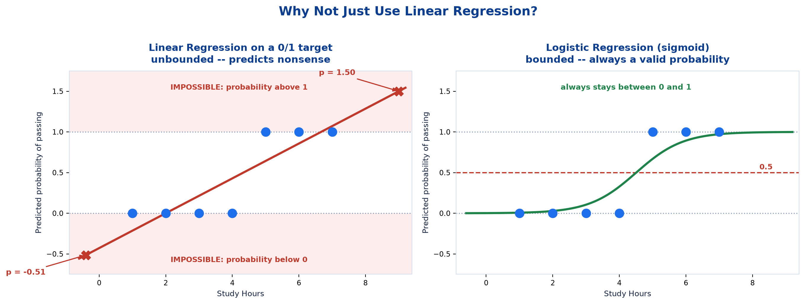
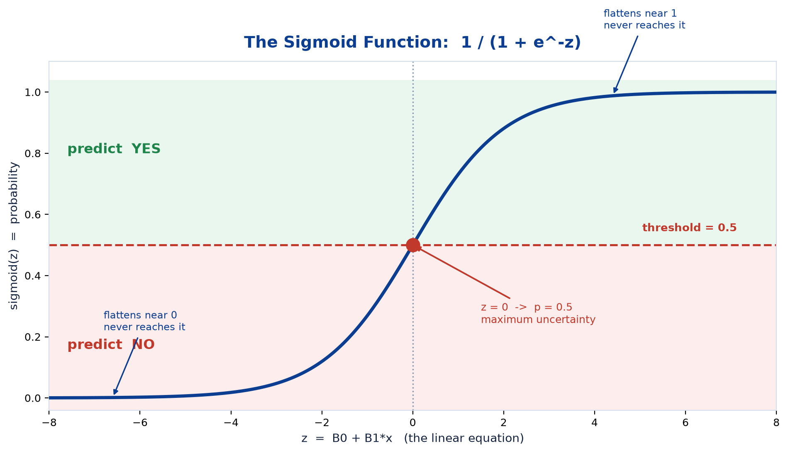
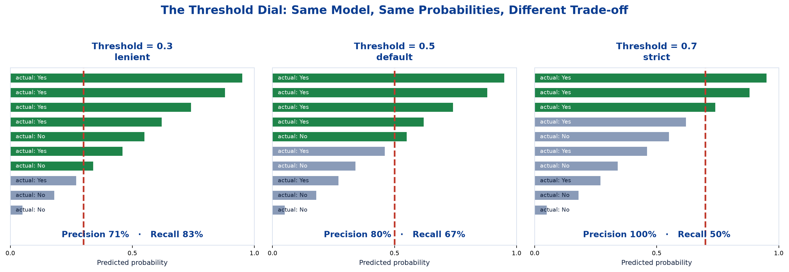
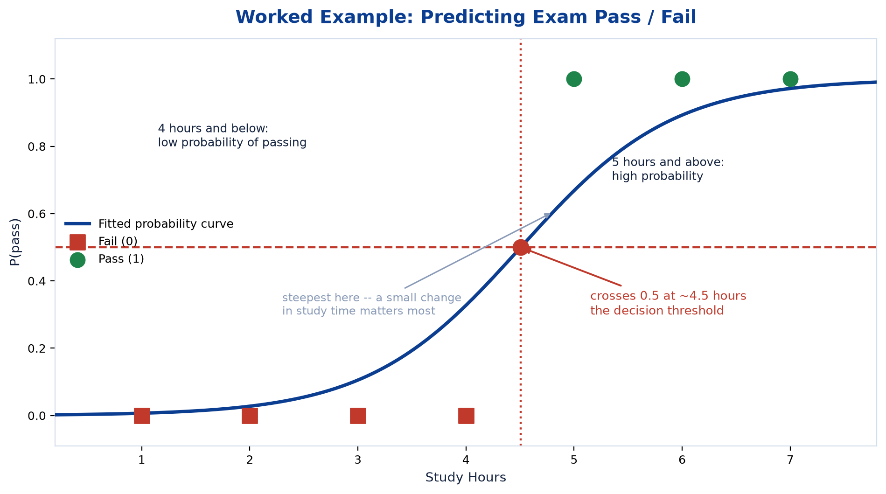
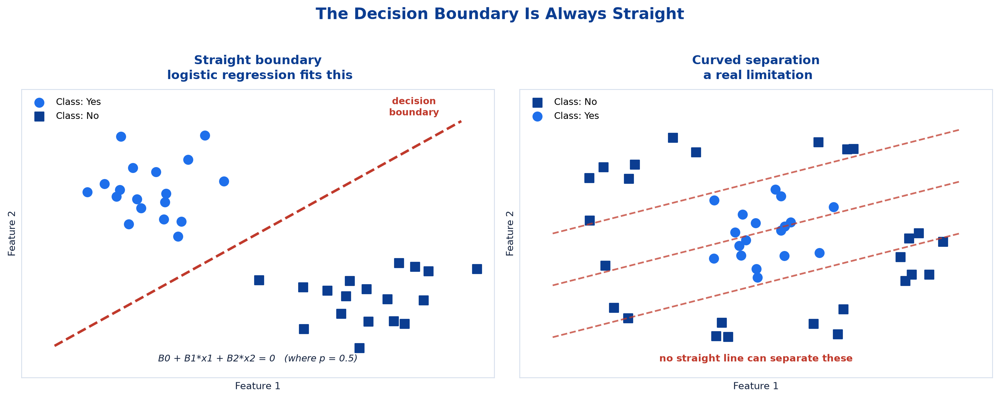

# <span style="color:#0B3D91">Logistic Regression</span>

> Study notes on the classifier with the misleading name — why a straight line cannot answer a yes/no question, how the sigmoid function turns any number into a probability, where the decision boundary comes from, and the adjustable threshold that controls the precision/recall trade-off.
> Linear Regression plus one extra step, and that step changes everything.

> **A note on formulas:** equations are written in plain text inside code blocks rather than LaTeX, so they render correctly in any Markdown viewer.

---

## <span style="color:#1E6FEB">Table of Contents</span>

1. [The Name Is Misleading](#1-the-name-is-misleading)
2. [The Sigmoid Function — From a Line to a Probability](#2-the-sigmoid-function--from-a-line-to-a-probability)
3. [Worked Example: Predicting Exam Pass/Fail](#3-worked-example-predicting-exam-passfail)
4. [The Decision Boundary](#4-the-decision-boundary)
5. [Linear vs Logistic Regression](#5-linear-vs-logistic-regression)
6. [Practical 3 — Logistic Regression Demo](#6-practical-3--logistic-regression-demo)

---

## <span style="color:#1E6FEB">1. The Name Is Misleading</span>

### 1.1 Overview / What is it?
Let us clear this up immediately, because it confuses everyone:

> **Logistic Regression is used for classification, not for predicting numbers** — despite "regression" sitting right there in the name.

**So why the name?** Because internally it *is* doing regression — it fits a linear equation `β₀ + β₁x`, exactly like Topic 4. The twist is what happens next: instead of outputting that number directly, it **squashes it into a probability between 0 and 1**, then applies a threshold to produce a class.

```
Linear Regression:    input -> [linear equation] -> a number (-inf to inf)

Logistic Regression:  input -> [linear equation] -> [SIGMOID] -> probability (0 to 1) -> class
                                                        ^
                                                the one new ingredient
```

**One extra step. That is the whole difference.** Everything from Topic 4 still applies underneath.

### 1.2 Why does it matter for AI?
Classification is the more common task in practice — spam or not, churn or not, fraud or not. Logistic Regression is the standard starting point for all of them, and because it inherits Linear Regression's interpretability, it tells you *which features drive the decision*, not just what the decision is.

### 1.3 Key Concepts — why not just use Linear Regression?

Suppose we encode Pass = 1, Fail = 0, and fit a straight line to study hours:

| Problem | What goes wrong |
|---|---|
| **Unbounded output** | The line predicts **1.50** for a 9-hour student. A probability of 150%? |
| **Negative predictions** | It predicts **−0.51** for a student who barely studied. Negative probability? |
| **Outliers wreck it** | One student who studied 20 hours drags the whole line, shifting every prediction |
| **No natural cutoff** | Where do you draw the line between classes? Arbitrary. |



*(Those values are real — they come from actually fitting a least-squares line to the seven-point pass/fail dataset in section 3.)*

A straight line simply is not the right shape for a yes/no question. We need something that **flattens out** at both ends — never going below 0 or above 1. That shape is the **sigmoid**.

### 1.4 Simple Example
Ask "will this student pass?" and a linear model might answer "1.5". That is not an answer to a yes/no question; it is not even a valid probability. The sigmoid exists to make the output *mean* something.

### 1.5 How it works
Everything from Topic 4 — the coefficients, the linear combination of features, the interpretability — is retained. The sigmoid wraps the output so the result is always a legitimate probability.

### 1.6 Practical Example / Use Case
Titanic survival prediction: the model computes a linear score from passenger class, sex, age and fare, then converts that score into *"this passenger had a 78% chance of survival"*. The linear part does the reasoning; the sigmoid makes the answer interpretable.

### 1.7 Key Takeaways
> - **Logistic Regression is for classification, despite the name** — it fits a linear equation internally, then squashes the result into a probability.
> - The only new ingredient versus Linear Regression is the **sigmoid function**.
> - Linear Regression fails at classification because it is **unbounded** — it predicts impossible probabilities like 1.50 or −0.51.
> - A straight line has the wrong *shape* for a yes/no question; we need something that flattens at 0 and 1.

---

## <span style="color:#1E6FEB">2. The Sigmoid Function — From a Line to a Probability</span>

### 2.1 Overview / What is it?
> Logistic Regression **squeezes any input into a probability between 0 and 1 using the sigmoid function.**

```
sigmoid(z) = 1 / (1 + e^(-z))

where  z = B0 + B1*x     <- the familiar linear equation from Topic 4
```

**Two ingredients:**

- **`z`** — the linear equation. Can be any number, −∞ to ∞.
- **`e`** — Euler's number, ≈ 2.71828. The standard base for natural exponentials.



That elegant **S-curve** (*sigmoid* literally means "S-shaped") is the entire trick.

### 2.2 Why does it matter for AI?
The sigmoid is what converts an unbounded score into a **probability** — and probabilities are far more useful than bare labels. They let you rank cases by confidence, set custom thresholds, and communicate uncertainty honestly.

### 2.3 Key Concepts — watching it work

| z (linear output) | e^(−z) | sigmoid(z) | Interpretation |
|---|---|---|---|
| **−6** | 403.4288 | **0.002** | Almost certainly "No" |
| **−2** | 7.3891 | **0.119** | Probably "No" |
| **−1** | 2.7183 | **0.269** | Leaning "No" |
| **0** | 1.0000 | **0.500** | Completely undecided |
| **+1** | 0.3679 | **0.731** | Leaning "Yes" |
| **+2** | 0.1353 | **0.881** | Probably "Yes" |
| **+6** | 0.0025 | **0.998** | Almost certainly "Yes" |

**Three properties worth noticing:**

1. **It never reaches 0 or 1** — only approaches them. The model is never 100% certain, which is honest.
2. **z = 0 gives exactly 0.5** — the point of maximum uncertainty. (Check: `1/(1+e⁰) = 1/(1+1) = 0.5`.)
3. **It is symmetric** around that midpoint.

**Reading the output:**

> - **Output near 0:** the model predicts **"No."**
> - **Output near 1:** the model predicts **"Yes."**
> - **A threshold (usually 0.5)** decides the final class.

```
probability = 0.87  ->  above 0.5  ->  predict YES
probability = 0.23  ->  below 0.5  ->  predict NO
probability = 0.51  ->  above 0.5  ->  predict YES  (but barely -- nearly a coin flip)
```

### 2.4 Simple Example —  why that last row matters

`0.51` and `0.99` both become **"Yes"** — but they are wildly different levels of confidence. The probability carries information that the final class label throws away.

This is why `predict_proba()` is often more useful than `predict()`.

### 2.5 How it works — the threshold is a dial

**The threshold is adjustable**, and it is precisely the dial controlling the **precision/recall trade-off** from Topic 3:



Measured on ten held-out cases:

| Threshold | Behaviour | Precision | Recall |
|---|---|---|---|
| **0.3** (lenient) | Says "Yes" more readily | **71%** | **83%** |
| **0.5** (default) | Balanced | **80%** | **67%** |
| **0.7** (strict) | Only says "Yes" when confident | **100%** | **50%** |

As the threshold rises, **precision climbs and recall falls** — exactly the tug-of-war described in Topic 3, now with a concrete control.

>  **Same trained model, different threshold, different behaviour — no retraining needed.** For cancer screening you would lower the threshold (catch more cases, accept false alarms). For a spam filter you would raise it.

### 2.6 Practical Example / Use Case
A bank's fraud model outputs a probability per transaction. During the day the threshold sits at 0.5; overnight, when manual review capacity is limited, it is raised to 0.8 so only high-confidence alerts are raised. One model, two operating points.

### 2.7 Key Takeaways
> - **Sigmoid:** `1 / (1 + e^(-z))` where `z = B0 + B1*x`. Squeezes any input into **0 to 1**.
> - The sigmoid is an **S-curve**: it **flattens near 0 and 1** (never reaching them), and **z = 0 gives exactly 0.5**.
> - **Output near 0 → "No"; near 1 → "Yes"; a threshold (usually 0.5) decides the final class.**
> - A probability of 0.51 and 0.99 give the same label but very different confidence — the label discards information.
> - **The threshold is adjustable** and is the dial controlling the **precision/recall trade-off**: raising it increased precision 71% → 100% while recall fell 83% → 50%.
> - Changing the threshold needs **no retraining**.

---

## <span style="color:#1E6FEB">3. Worked Example: Predicting Exam Pass/Fail</span>

### 3.1 Overview / What is it?
A small dataset of study hours and pass/fail outcomes, and the probability curve the model fits to it.

| Study Hours | 1 | 2 | 3 | 4 | 5 | 6 | 7 |
|---|---|---|---|---|---|---|---|
| **Pass (1) / Fail (0)** | 0 | 0 | 0 | 0 | 1 | 1 | 1 |

Clean separation: **4 hours and below fails, 5 hours and above passes.**

### 3.2 Why does it matter for AI?
Seven rows you can hold in your head, showing the full pipeline: linear score → sigmoid → probability → threshold → class.

### 3.3 Key Concepts — the interpretation

> - When study hours are **below 4**, the predicted probability of passing is **low**.
> - When study hours are **above 4**, the predicted probability of passing is **high**.
> - **At around 4 hours**, the predicted probability crosses **0.5** — the model's decision threshold.



### 3.4 Simple Example — reading specific predictions

With a fitted model of `z = -6.4 + 1.42 x hours`:

| Study Hours | z | Probability | Predicted class |
|---|---|---|---|
| 3 | −2.14 | **0.105** | Fail |
| 4 | −0.72 | **0.327** | Fail |
| **~4.5** | **~0.00** | **~0.500** | **the crossover** |
| 5 | +0.70 | **0.668** | Pass |
| 5.5 | +1.41 | **0.804** | Pass |
| 6 | +2.12 | **0.893** | Pass |

Worked longhand for 5.5 hours:

```
z = -6.4 + 1.42 x 5.5 = -6.4 + 7.81 = 1.41
p = 1 / (1 + e^-1.41) = 1 / (1 + 0.244) = 0.804

"80% chance of passing"  ->  above 0.5  ->  predict PASS
```

Note the model gives a **probability**, not just a label. A 66.8% chance (5 hours) and an 89.3% chance (6 hours) are both "pass" — but you would advise those two students differently.

### 3.5 How it works — the steepness is meaningful
The curve is nearly flat at 1–2 hours (hopeless either way) and at 6–7 hours (safe either way), but **steep around the crossover** — that is where a small change in study time makes a big difference to the outcome. That is genuinely useful advice: the marginal hour matters most to the borderline student.

### 3.6 Practical Example / Use Case
An early-warning system for students flags anyone whose predicted pass probability sits between 0.35 and 0.65 — not the hopeless cases and not the safe ones, but the ones where intervention actually changes the outcome. That band exists because the curve is steepest there.

### 3.7 Key Takeaways
> - **Worked example:** study hours 1–7 → **4 hours and below fail, 5 and above pass**.
> - Below ~4 hours the pass probability is **low**; above ~4 it is **high**; **~4.5 hours is where it crosses 0.5**.
> - The curve is **steepest near the boundary** — that is where small input changes matter most.
> - The model outputs a **probability**, so 0.668 and 0.893 are both "pass" but carry different confidence.

---

## <span style="color:#1E6FEB">4. The Decision Boundary</span>

### 4.1 Overview / What is it?
> **Logistic Regression separates classes with a straight boundary line. Points on either side are classified differently.**

With one feature the boundary is a single point (~4.5 hours in our example). With **two** features it becomes a **line** on a 2-D plot.



### 4.2 Why does it matter for AI?
The boundary's shape is the algorithm's fundamental limitation. Knowing it is always straight tells you immediately when to reach for something else.

### 4.3 Key Concepts — where the boundary comes from

The boundary is precisely where **probability = 0.5**, which (as we saw) happens when **z = 0**:

```
B0 + B1*x1 + B2*x2 = 0
```

**That is the equation of a straight line.** Which explains the key limitation:

>  **Logistic Regression can only draw straight boundaries.** If your classes are separated by a curve or a ring, it cannot fit them properly.

| Feature count | Boundary shape |
|---|---|
| 1 feature | A **point** on a number line |
| 2 features | A **line** on a plane |
| 3 features | A **plane** in 3-D space |
| n features | A **hyperplane** |

Same escalation as Topic 4's linear regression — because underneath, it is the same linear equation.

### 4.4 Simple Example — interpreting the coefficients

The coefficients still tell you each feature's effect, but on the **probability** rather than a raw number:

```
z = -6.4 + 1.42 x StudyHours
```

| Coefficient | Reading |
|---|---|
| **β₁ = +1.42** | Each extra study hour **increases** z by 1.42 → pushes probability **up** |
| **Negative β** | Would push probability **down** |
| **Larger \|β\|** | Steeper curve → that feature matters more |

>  **A caveat:** unlike linear regression, the coefficient is *not* "+1.42 probability per hour" — the sigmoid is non-linear, so the same +1.42 in z moves the probability a lot near the middle and barely at all at the extremes. The **direction** and **relative size** are interpretable; the exact probability change is not a fixed amount.

### 4.5 How it works
Compute `z` from the linear equation, pass it through the sigmoid, compare against the threshold. Points where `z > 0` land on one side of the boundary, `z < 0` on the other, and `z = 0` is the boundary itself.

### 4.6 Practical Example / Use Case
Plotting Titanic passengers by Age and Fare shows survivors clustering toward higher fares and lower ages, with a straight line separating them tolerably well. It is not a perfect split — a straight boundary rarely is — but it captures the dominant pattern.

### 4.7 Key Takeaways
> - **The decision boundary** is where probability = 0.5, i.e. where `z = 0` — which is always a **straight line** (or plane / hyperplane).
> - One feature = a point, two = a line, three = a plane, more = a hyperplane.
> - **Straight boundaries are a real limitation** — curved or ring-shaped class separations need a different algorithm.
> - Coefficients give **direction and relative importance**, but *not* a fixed probability change per unit, because the sigmoid is non-linear.

---

## <span style="color:#1E6FEB">5. Linear vs Logistic Regression</span>

### 5.1 Overview / What is it?
The two algorithms share machinery but answer different questions. Side by side:

| | **Linear Regression** | **Logistic Regression** |
|---|---|---|
| **Task type** | Regression | **Classification** |
| **Predicts** | A continuous number | A **class** (via a probability) |
| **Output range** | −∞ to ∞ (unbounded) | **0 to 1** (a probability) |
| **Core equation** | `y-hat = B0 + B1*x` | `p = sigmoid(B0 + B1*x)` |
| **Shape** | Straight line | **S-curve (sigmoid)** |
| **Cost function** | MSE — `avg (actual − pred)²` | **Log Loss** (cross-entropy) |
| **Evaluated with** | RMSE, R² | **Accuracy, precision, recall, F1, confusion matrix** |
| **Example** | House price = ₹67 lakhs | Email = Spam |

### 5.2 Why does it matter for AI?
Picking the wrong one is a category error you cannot recover from. And the metric families do not cross over: reporting R² for a spam filter, or accuracy for a house-price model, is meaningless.

### 5.3 Key Concepts —  why a different cost function?

> *Log Loss is not in the course slides — it is included here because "why not MSE?" is the natural question and the answer is short.*

MSE does not work well for classification. If the true answer is 1 and the model predicts 0.51, MSE calls that a smallish error — but it is actually a near-coin-flip on something that should be confident.

**Log Loss** punishes confident wrong answers brutally:

| True answer | Model predicted | Log Loss penalty |
|---|---|---|
| 1 (Yes) | 0.99 | Tiny — correct and confident  |
| 1 (Yes) | 0.51 | Moderate — correct but unsure |
| 1 (Yes) | **0.01** | **Enormous** — confidently wrong  |

That asymmetry is what teaches the model to be well-calibrated, not just directionally right.

### 5.4 Simple Example
Same input data, different question:

- *"How much will this house sell for?"* → Linear Regression → **₹67 lakhs** → judged by RMSE and R².
- *"Will this house sell within 30 days?"* → Logistic Regression → **0.78 → Yes** → judged by precision, recall and F1.

### 5.5 How it works — what carries over from Topic 4
The linear equation, the coefficients, the feature-effect interpretation, and the need for **scaling** all carry over. What changes is the output wrapper (sigmoid), the cost function (Log Loss), and the metric family (classification metrics from Topic 3).

### 5.6 Practical Example / Use Case
The course covers one regression algorithm (Linear Regression) and, for classification, Logistic Regression — the same underlying linear machinery reused for a different kind of question.

### 5.7 Key Takeaways
> - **Linear** predicts a number, is unbounded, and is judged by **RMSE / R²**.
> - **Logistic** predicts a class via a probability, is bounded to **0–1**, and is judged by **accuracy, precision, recall, F1, confusion matrix**.
> - Logistic uses **Log Loss** rather than MSE, because Log Loss punishes **confidently wrong** predictions heavily.
> - The linear equation, coefficients and the need for **scaling** all carry over from Topic 4.
> - Never report R² for a classifier or accuracy for a regressor.

---

## <span style="color:#1E6FEB">6. Practical 3 — Logistic Regression Demo</span>

### 6.1 Overview / What is it?
The notebook trains a **binary classifier** and evaluates it with the full Topic 3 metric suite — using a 10-record toy example first, then the **Titanic dataset** (predicting survival).

| Stage | What happens |
|---|---|
| Toy example | 10 hand-built rows, fully visible |
| Train | `LogisticRegression()` on the preprocessed Titanic data from Practical 1 |
| **Feature importance** | Which features drive survival, from the coefficients |
| **Evaluate** | **Accuracy, precision, recall, F1** |
| **Confusion matrix** | The full TP/FP/FN/TN breakdown |
| Decision boundary plot | A simplified 2-feature model (Age & Fare) for visualization |

> **Note on the boundary plot:** it uses only **two features** (Age and Fare) purely so it can be drawn on a 2-D chart. The saved model uses the full feature set — you cannot visualize a seven-dimensional hyperplane.

### 6.2 Why does it matter for AI?
This is where Topics 2, 3 and 5 meet: preprocessed data in, a trained classifier, and the full metric suite out. It is the complete workflow in one notebook.

### 6.3 Key Concepts — the essential code

```python
from sklearn.linear_model import LogisticRegression
from sklearn.metrics import (accuracy_score, precision_score, recall_score,
                             f1_score, confusion_matrix, classification_report)

model = LogisticRegression(max_iter=1000).fit(X_train, y_train)

y_pred = model.predict(X_test)          # the class: 0 or 1
y_prob = model.predict_proba(X_test)    # the probability behind it

print(confusion_matrix(y_test, y_pred))
print(classification_report(y_test, y_pred))   # all four metrics at once
```

>  **`max_iter=1000`** — logistic regression is fitted **iteratively** (unlike OLS, which has a direct mathematical solution). The default 100 iterations often is not enough to converge, and sklearn will warn you. Also note that **scaling matters here** (Topic 2), since the solver converges much faster on scaled features.

### 6.4 Simple Example — feature importance and thresholds

```python
# Feature importance -- straight from the coefficients
import pandas as pd

pd.DataFrame({
    "feature": X_train.columns,
    "coefficient": model.coef_[0]
}).sort_values("coefficient", key=abs, ascending=False)
```

```python
# Adjusting the threshold -- the precision/recall dial from Topic 3
y_prob_positive = model.predict_proba(X_test)[:, 1]
y_pred_strict = (y_prob_positive >= 0.7).astype(int)   # higher precision
y_pred_lenient = (y_prob_positive >= 0.3).astype(int)  # higher recall
```

### 6.5 How it works — reading Titanic coefficients

```
feature        coefficient
sex             -2.61      <- strongest: being male sharply reduces survival odds
pclass          -0.94      <- lower class (higher number) reduces survival
age             -0.41      <- older reduces survival
fare            +0.12      <- higher fare slightly increases survival
```

**"Women and children first"** falls straight out of the coefficients — a nice demonstration of why interpretability matters. The model rediscovered a documented historical policy from raw data.

### 6.6 Practical Example / Use Case
A churn model built the same way does two jobs at once: it flags at-risk customers (the prediction) *and* tells the retention team which factors drive churn (the coefficients). A less interpretable algorithm would deliver only the first.

### 6.7 Key Takeaways
> - Practical 3 runs: **toy example → train → feature importance → accuracy/precision/recall/F1 → confusion matrix → boundary plot**.
> - `predict()` gives the class; **`predict_proba()` gives the probability** behind it — often the more useful output.
> - Use **`max_iter=1000`** and **scaled features**, since the solver is iterative rather than direct.
> - The boundary plot uses only **two features** for visualization; the real model uses all of them.
> - Coefficients give free **feature importance** — on Titanic they recover "women and children first".

---

## <span style="color:#1E6FEB">Regenerating the Diagrams</span>

Figures live in the `figures/` package (one module per topic, shared palette in `figures/core.py`):

```bash
cd machine_learning_01/notes && ../../.venv/bin/python plot_ml_figures.py
```

Pass figure names to rebuild only some, e.g. `... plot_ml_figures.py sigmoid_curve threshold_dial`.

---

*End of file 05 — Logistic Regression complete. This closes the agenda's core content. File 06 covers KNN & SVM, which the slide deck promises but does not deliver.*
