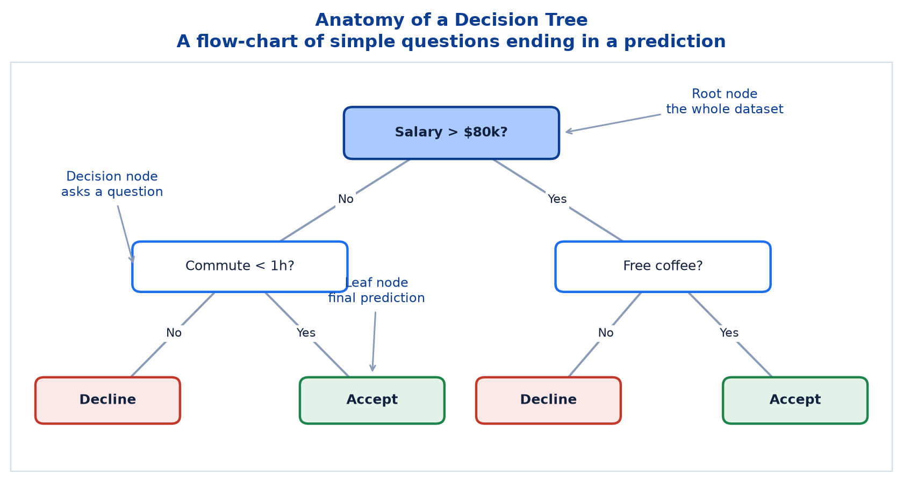
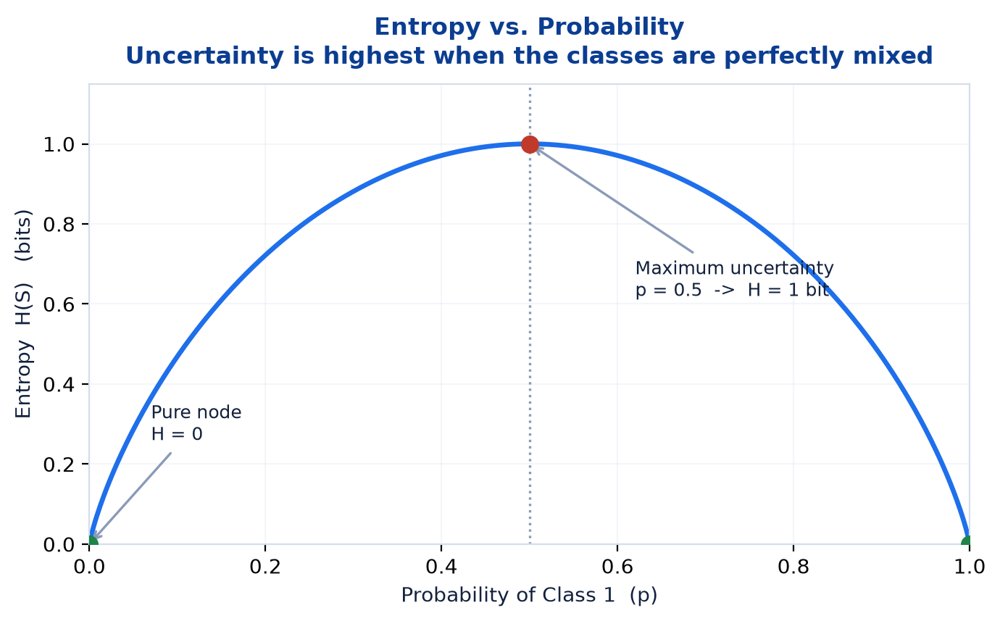
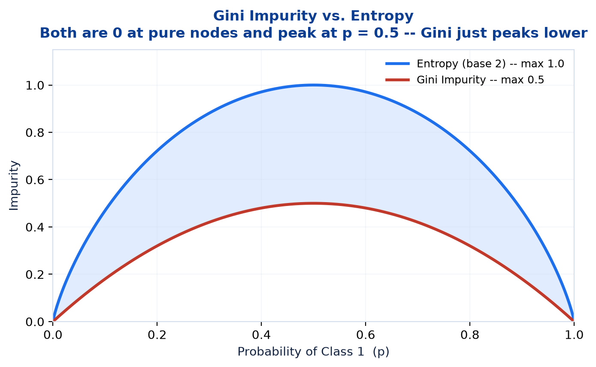
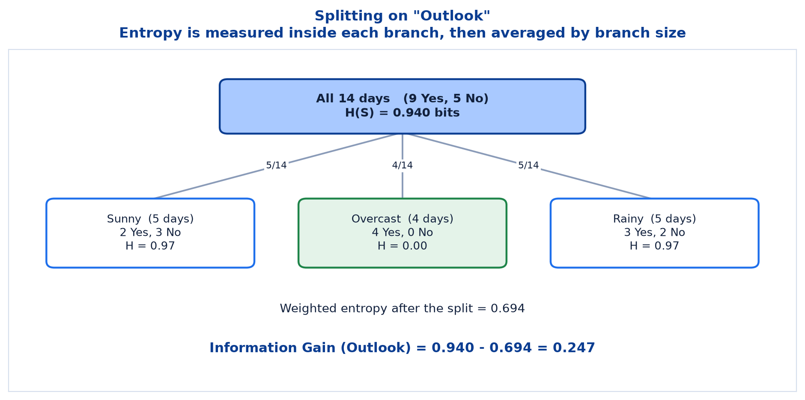
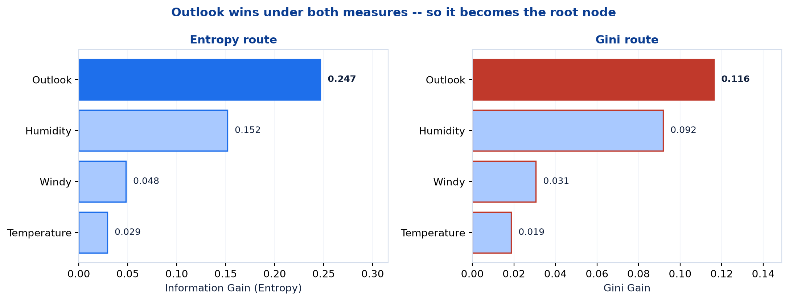
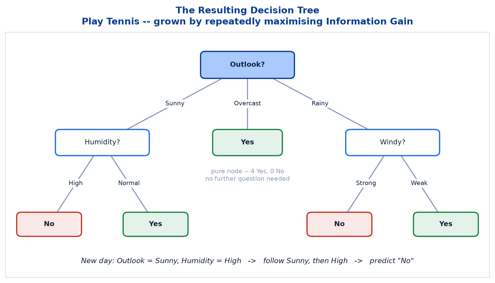
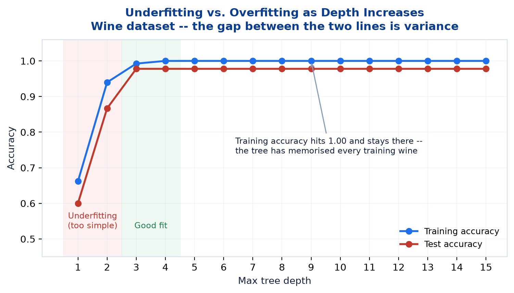
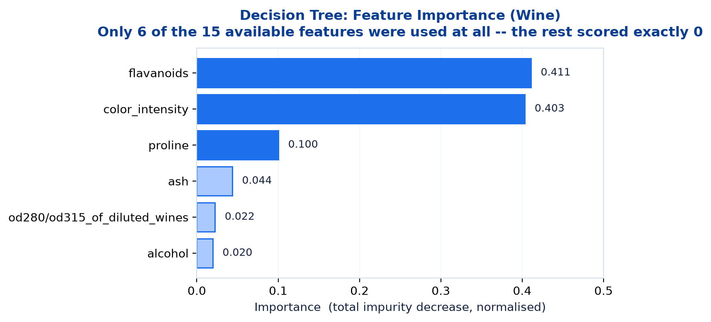

# <span style="color:#0B3D91">Decision Trees</span>

> Study notes opening Basic Machine Learning **Session II** — the flowchart-of-questions algorithm, the two impurity measures (Entropy and Gini) that decide where to split, the full Play Tennis worked example calculated both ways, pruning, feature importance, and why a single tree's biggest weakness is the reason Random Forest exists.
> The one algorithm whose reasoning you can read off the diagram and explain to somebody who has never heard of machine learning.

> **A note on formulas:** equations are written in plain text inside code blocks rather than LaTeX, so they render correctly in any Markdown viewer.

> **Where this sits:** Session I covered Linear Regression, Logistic Regression, KNN and SVM — all **supervised** algorithms. Decision Trees are also supervised, but they are the first algorithm in this course that learns **rules** rather than **weights**. There is no line, no coefficient, and no distance calculation here — just a sequence of questions.

---

## <span style="color:#1E6FEB">Table of Contents</span>

1. [What Is a Decision Tree?](#1-what-is-a-decision-tree)
2. [Divide and Conquer — How a Tree Grows](#2-divide-and-conquer--how-a-tree-grows)
3. [Entropy: Measuring Uncertainty](#3-entropy-measuring-uncertainty)
4. [Information Gain — Choosing the Split](#4-information-gain--choosing-the-split)
5. [Gini Impurity — The Other Way to Measure](#5-gini-impurity--the-other-way-to-measure)
6. [Worked Example: Play Tennis (Entropy Route)](#6-worked-example-play-tennis-entropy-route)
7. [Worked Example: Play Tennis (Gini Route)](#7-worked-example-play-tennis-gini-route)
8. [The Resulting Tree &amp; Making Predictions](#8-the-resulting-tree--making-predictions)
9. [Strengths, Limitations &amp; Pruning](#9-strengths-limitations--pruning)
10. [Feature Importance](#10-feature-importance)
11. [Practical 1 — Decision Trees in Code](#11-practical-1--decision-trees-in-code)

---

## <span style="color:#1E6FEB">1. What Is a Decision Tree?</span>

### 1.1 Overview / What is it?
A **Decision Tree** is a supervised learning algorithm that predicts an outcome through a series of **simple, sequential decisions**.

> A flow-chart-like model that asks a series of simple questions to reach a prediction.

That is the whole idea. You have almost certainly drawn one by hand without calling it machine learning — *"Is it raining? → Yes → Take an umbrella."* The only thing ML adds is that **the computer works out which questions to ask, and in what order**, directly from the data.



### 1.2 Why does it matter for AI?
Four properties make trees worth learning first, before the more powerful methods:

| Property | What it means in practice |
|---|---|
| **Interpretable** | Predictions can be traced as a clear chain of if-then decisions |
| **Non-linear** | Captures complex, non-linear relationships between features and target |
| **Versatile** | Handles both **classification** (class labels) and **regression** (numeric values) |
| **Minimal preprocessing** | No feature scaling required; handles numeric and categorical data |

That first row is the reason trees survive in regulated industries. When a bank declines a loan, *"your score was 0.31"* is not an acceptable answer — but *"income below ₹40,000 and existing loans above 3"* is. A tree hands you the reason for free.

That last row is a genuine convenience. In Session I, KNN and SVM both **needed** scaling because they measure distances. A tree asks *"is alcohol > 13.1?"* — a question whose answer does not change if you switch units. **Scaling a tree's input changes nothing at all.**

### 1.3 Key Concepts — the vocabulary

| Term | Meaning |
|---|---|
| **Root node** | The top of the tree — holds the **entire dataset** before any splitting |
| **Decision node** | An internal node that asks a question and splits the data |
| **Branch** | The path taken for a particular answer |
| **Leaf node** | A terminal node — the **final prediction**, no further questions |
| **Depth** | How many questions deep the longest path runs |
| **Split** | The act of dividing a node's data using one feature and one cutoff |

### 1.4 Simple Example
Deciding whether to accept a job offer:

```
                   Salary > $80k?
                    /          \
                  No            Yes
                  /              \
        Commute < 1h?          Free coffee?
          /       \              /       \
        No        Yes          No        Yes
         |         |            |         |
      Decline   Accept       Decline   Accept
```

To use it, you start at the top and answer questions until you fall off the bottom into a leaf. No arithmetic, no coefficients — just a path.

### 1.5 How it works — prediction vs. training
Two very different activities share the same diagram, and mixing them up is the most common beginner confusion:

```
PREDICTION (easy):   walk down the tree answering questions  ->  read the leaf
TRAINING  (the ML):  work out WHICH questions to ask, and in WHAT ORDER
```

Everything in sections 3 to 7 is about that second line. **The tree's structure is the thing being learned.**

### 1.6 Practical Example / Use Case
Slide 33 lists where tree-based models earn their keep:

| Use case | The decision being made |
|---|---|
| **Credit Risk Scoring** | Decide whether to approve a loan based on applicant history |
| **Medical Diagnosis Support** | Flag likely conditions from patient symptoms and test results |
| **Customer Churn Prediction** | Identify customers likely to cancel a subscription |
| **Fraud Detection** | Spot unusual transactions that resemble known fraud patterns |

Notice the pattern: every one of these is a setting where somebody will eventually ask **"why?"** — a doctor, a regulator, an auditor, or an annoyed customer.

### 1.7 Key Takeaways
> - A **Decision Tree** predicts by asking a **series of simple sequential questions**, ending at a leaf.
> - **Supervised**, and works for both **classification** and **regression**.
> - **Interpretable, non-linear, versatile,** and needs **no feature scaling**.
> - **Root** = all the data; **decision nodes** = questions; **leaves** = predictions.
> - Predicting is trivial; **training — choosing the questions — is the actual machine learning.**

---

## <span style="color:#1E6FEB">2. Divide and Conquer — How a Tree Grows</span>

### 2.1 Overview / What is it?
Trees are grown by **divide and conquer**, also called **recursive partitioning**:

> Split the data, then split each subset again.

The strategy repeats until subsets are **sufficiently homogeneous** (all one class) or a **stopping rule** is met. The same logic applies whether the tree is predicting a class or a number.

### 2.2 Why does it matter for AI?
"Recursive" is doing a lot of work in that sentence, and it is what makes the algorithm cheap to describe. There is only **one procedure** — *find the best split for this pile of data* — applied over and over to ever-smaller piles. Write it once, call it recursively, and a tree of any shape falls out. That is DRY as an algorithm design.

### 2.3 Key Concepts — the four-step loop

| Step | What happens |
|---|---|
| **1. Start at the Root** | The root node holds the entire dataset — no splitting has happened yet |
| **2. Evaluate Every Split** | For each feature/threshold, measure separation using an impurity metric (Entropy or Gini) |
| **3. Choose the Best Split** | Pick the feature and cutoff giving the largest **Information Gain** — the biggest drop in impurity |
| **4. Partition & Repeat** | Data splits into child nodes; each recurses until a stopping rule is met |

### 2.4 Simple Example
Step 2 is more brute-force than people expect. For a dataset with 4 features, the tree literally tries all 4 and keeps the winner. For numeric features it also tries **every sensible cutoff** — that is where `alcohol > 13.14` in the practical came from. Nobody chose 13.14; the algorithm tested the candidates and that one scored best.

### 2.5 How it works — when does it stop?

> **Stopping Rule** — stops when a node is **pure**, a **max depth** is reached, or **too few samples** remain to split.

This matters more than it first appears. Without a stopping rule, a tree keeps splitting until every single training row sits in its own leaf — achieving **100% training accuracy** and learning absolutely nothing general. We will see exactly that happen in section 9.

```
Is this node pure?                  -> stop, make it a leaf
Have we hit max_depth?              -> stop, make it a leaf
Too few samples to split further?   -> stop, make it a leaf
Otherwise                           -> find the best split and recurse
```

### 2.6 Practical Example / Use Case
The **greedy** nature of step 3 is worth flagging now, because it becomes an argument for ensembles later. At each node the tree picks the split that looks best **right now**, never checking whether a slightly worse split today would enable a much better one two levels down. Slide 34 lists this as a genuine limitation: *"Greedy Nature — locally optimal splits which may not lead to the globally best model."*

### 2.7 Key Takeaways
> - Trees grow by **divide and conquer** (**recursive partitioning**) — split, then split each subset again.
> - The loop: **start at root → evaluate every split → choose the best → partition and repeat**.
> - Stops when a node is **pure**, **max depth** is hit, or **too few samples** remain.
> - The algorithm is **greedy** — best split *now*, not best tree *overall*.
> - Without a stopping rule a tree will memorise the training data completely.

---

## <span style="color:#1E6FEB">3. Entropy: Measuring Uncertainty</span>

### 3.1 Overview / What is it?
To choose the best split we first need to measure how **mixed** a group is. **Entropy** measures the uncertainty or randomness in a dataset — how mixed the classes are in a node.

```
H(S) = - SUM p_i * log2(p_i)
```

| Symbol | Meaning |
|---|---|
| **S** | The samples at a node |
| **p_i** | The probability (proportion) of class *i* in S |
| **log base 2** | Entropy is measured in **bits** |

### 3.2 Why does it matter for AI?
Entropy converts a vague human judgement — *"this group is a real mess"* — into a number you can compare. Once mixedness has a number, *"which split is best?"* becomes arithmetic instead of opinion. It is the same move as the cost function in Linear Regression: define the quantity, then minimise it.

### 3.3 Key Concepts — the three properties

| Property | Value |
|---|---|
| **Minimum** | `H(S) = 0` — when all samples belong to one class (complete certainty) |
| **Maximum** | `H(S) = log2(c)` — when classes are equally distributed |
| **Always non-negative** | `H(S) >= 0` |

For a binary problem `log2(2) = 1`, so entropy runs from **0 to 1 bit**.

### 3.4 Simple Example — entropy values for a binary split

| p (class 1) | H(S) bits |
|---|---|
| 0.0 | 0.000 |
| 0.2 | 0.722 |
| 0.5 | **1.000** |
| 0.8 | 0.722 |
| 1.0 | 0.000 |



Reading the curve:

- Entropy is **0 when the node is pure** — every sample is the same class, so there is nothing to be uncertain about.
- Entropy is **maximum (1 bit) when both classes are equally likely** (p = 0.5) — a coin flip, the least useful group possible.
- The curve is **symmetric around p = 0.5** — 80% Yes is exactly as predictable as 80% No.
- **Higher entropy means higher uncertainty.**

### 3.5 How it works — a worked calculation
Take a node with **9 Yes and 5 No** (our Play Tennis root):

```
p(Yes) = 9/14 = 0.643
p(No)  = 5/14 = 0.357

H(S) = -(0.643 * log2(0.643)) - (0.357 * log2(0.357))
     = -(0.643 * -0.637)      - (0.357 * -1.486)
     =   0.410                +   0.530
     =   0.940 bits
```

A high number, and correctly so — 9 versus 5 is not far off a coin flip.

**The intuition for the "bits" unit:** entropy is the average number of yes/no questions you would need to pin down the answer. One bit = one perfectly-informative question.

### 3.6 Practical Example / Use Case
In the practical notebook you request this measure explicitly:

```python
tennis_tree = DecisionTreeClassifier(criterion="entropy", max_depth=3, random_state=RANDOM_STATE)
```

`criterion="entropy"` tells scikit-learn to build the tree using **Information Gain** — exactly the metric calculated by hand in the slides. The default is `"gini"`, which section 5 covers.

### 3.7 Key Takeaways
> - **Entropy** measures uncertainty — how mixed the classes are in a node.
> - `H(S) = - SUM p_i * log2(p_i)`, measured in **bits**.
> - **H = 0** for a pure node; **H = 1** for a 50/50 binary node; never negative.
> - The curve is **symmetric** and peaks at **p = 0.5**.
> - Our Play Tennis root (9 Yes, 5 No) has **H = 0.940 bits** — quite uncertain.
> - In code: `DecisionTreeClassifier(criterion="entropy")`.

---

## <span style="color:#1E6FEB">4. Information Gain — Choosing the Split</span>

### 4.1 Overview / What is it?
Entropy measures one node. **Information Gain (IG)** measures the **improvement** a split produces:

> Information Gain measures the **reduction in entropy** (uncertainty) after we split the dataset on an attribute.

```
IG(S, A) = H(S) - SUM ( |S_v| / |S| ) * H(S_v)
```

| Symbol | Meaning |
|---|---|
| **S** | The parent node |
| **A** | The attribute used for the split |
| **S_v** | The subset of samples with value *v* of A |
| **&#124;S_v&#124; / &#124;S&#124;** | That branch's share of the data — the **weight** |

In plain English:

```
Information Gain = (uncertainty BEFORE the split) - (average uncertainty AFTER the split)
```

### 4.2 Why does it matter for AI?
This is the **decision rule of the entire algorithm**. Everything else — the recursion, the tree structure, the leaves — follows automatically once you can score a split. Change this one measure and you get a different tree.

### 4.3 Key Concepts — reading the number

| Result | Interpretation |
|---|---|
| **Higher IG** | More reduction in uncertainty. Better, more informative split. |
| **Lower IG** | Less reduction in uncertainty. Not a very useful split. |
| **IG = 0** | No reduction — the attribute provides **no information**. |

> **Key Takeaway** — Decision Trees choose the split with the **HIGHEST Information Gain** at each step.

### 4.4 Simple Example — why the weighting matters
The `|S_v| / |S|` term is easy to skip past, and it is essential. Without it, a branch containing 1 sample would count as much as a branch containing 100.

Consider splitting 14 days into a branch of 13 (messy) and a branch of 1 (pure by definition — a single sample always is):

```
Unweighted average:  (0.99 + 0.00) / 2       = 0.495   <- looks great, but it's a lie
Weighted average:    (13/14)(0.99) + (1/14)(0) = 0.919   <- honest: we barely improved
```

**Weighting by branch size stops the tree being fooled by tiny pure branches.**

### 4.5 How it works — the procedure at every node

```
1. Compute H(S) for the node                      (uncertainty before)
2. For each candidate feature A:
       a. Split the data by A's values
       b. Compute H for each branch
       c. Average them, weighted by branch size
       d. IG(A) = H(S) - that weighted average
3. Pick the feature with the highest IG
4. Split on it, and recurse into each branch
```

### 4.6 Practical Example / Use Case
A quick sanity check on what "IG = 0" means in practice: split customers by a **randomly assigned ID number** and each branch will have roughly the same class mixture as the parent. Uncertainty does not drop, IG is ~0, and the tree correctly ignores the feature. This is the mechanism behind feature importance in section 10 — useless features simply never get chosen.

### 4.7 Key Takeaways
> - **Information Gain** = entropy **before** the split minus the **weighted average** entropy after.
> - `IG(S, A) = H(S) - SUM (|S_v|/|S|) * H(S_v)`.
> - The tree picks the feature with the **highest IG** at every node.
> - **Weighting by branch size** is what stops tiny pure branches from cheating the score.
> - **IG = 0** means the feature tells you nothing — it will never be chosen.

---

## <span style="color:#1E6FEB">5. Gini Impurity — The Other Way to Measure</span>

### 5.1 Overview / What is it?
**Gini Impurity** measures the probability of **misclassifying a randomly chosen sample** if it were labeled according to the class distribution in that node.

```
Gini(S) = 1 - SUM (p_i)^2
```

| Symbol | Meaning |
|---|---|
| **S** | Dataset (or node) |
| **C** | Number of classes |
| **p_i** | Probability (proportion) of class *i* |

### 5.2 Why does it matter for AI?
It is the **default** in scikit-learn (`criterion="gini"`) and the measure used by **CART** (Classification and Regression Trees). If you train a tree without specifying a criterion — as the Wine practical does — this is silently what you get. Worth knowing what your default actually is.

### 5.3 Key Concepts — the properties

| Property | Value |
|---|---|
| **Range** | `0 <= Gini(S) < 1` |
| **Minimum** | `Gini = 0` when one class has probability 1 (**pure node**) |
| **Maximum (binary)** | `Gini = 0.5` when p1 = p2 = 0.5 |
| **Maximum (multi-class)** | `1 - 1/C`, when all classes are equally likely |
| **Interpretation** | **Lower Gini is better** — a lower value means a purer node |

Why CART prefers it:

- **Computationally efficient** — only sums and squares, **no logarithms**
- Works well in practice and is widely used in CART
- Produces **balanced and compact** trees
- Effective for both binary and multi-class problems

### 5.4 Simple Example — Gini vs Entropy side by side



| Observation | Detail |
|---|---|
| Both are **0** at p = 0 and p = 1 | Pure nodes score zero under either measure |
| **Entropy has a higher maximum** | 1 bit, versus Gini's 0.5 |
| **Gini is computationally simpler** | No log operations |
| **Both prefer purer splits** | Same shape, same preferences |

The two curves are the same hill with different heights. **This is why the choice rarely matters.**

### 5.5 How it works — a worked calculation
The same 9 Yes / 5 No root node:

```
p(Yes) = 9/14 = 0.643
p(No)  = 5/14 = 0.357

Gini(S) = 1 - (0.643)^2 - (0.357)^2
        = 1 - 0.413 - 0.127
        = 0.459
```

**Reading it as a probability:** pick a random day, then guess its label at random using the node's own proportions. You would be wrong about **46%** of the time. Pure node → never wrong → Gini 0.

### 5.6 Practical Example / Use Case
Which should you use? Honestly — **it almost never matters**. Section 7 computes the full Play Tennis example both ways and produces the **identical feature ranking**. The practical notebook uses both (`entropy` for Play Tennis, default `gini` for Wine) and neither choice is discussed, because neither choice changes anything.

**Rule of thumb:** keep the default (Gini). Reach for entropy only if you specifically want the information-theoretic interpretation in bits.

### 5.7 Key Takeaways
> - **Gini Impurity** = probability of misclassifying a random sample labeled by the node's own distribution.
> - `Gini(S) = 1 - SUM (p_i)^2`. **Lower is purer.**
> - **0** for a pure node; **0.5** max for binary; `1 - 1/C` max for C classes.
> - **No logarithms** → faster than entropy. Used by **CART** and the scikit-learn default.
> - Same shape as entropy, lower peak — **the two almost always agree on the best split**.
> - Our root: **Gini = 0.459**.

---

## <span style="color:#1E6FEB">6. Worked Example: Play Tennis (Entropy Route)</span>

### 6.1 Overview / What is it?
The classic teaching dataset: **14 days of weather observations — will tennis be played?**

| Part | Detail |
|---|---|
| **Target** | Play Tennis? (Yes / No) — **9 days Yes, 5 days No** |
| **Outlook** | Sunny / Overcast / Rainy |
| **Temperature** | Hot / Mild / Cool |
| **Humidity** | High / Normal |
| **Windy** | True / False |

### 6.2 Why does it matter for AI?
Doing this once by hand is the difference between *knowing the formula* and *understanding the algorithm*. Fourteen rows is small enough to verify every number yourself, and big enough that the answer is not obvious in advance.

### 6.3 Key Concepts — the raw data

| Outlook | Temperature | Humidity | Windy | Play Tennis |
|---|---|---|---|---|
| Sunny | Hot | High | False | No |
| Sunny | Hot | High | True | No |
| Overcast | Hot | High | False | Yes |
| Rainy | Mild | High | False | Yes |
| Rainy | Cool | Normal | False | Yes |
| Rainy | Cool | Normal | True | No |
| Overcast | Cool | Normal | True | Yes |
| Sunny | Mild | High | False | No |
| Sunny | Cool | Normal | False | Yes |
| Rainy | Mild | Normal | False | Yes |
| Sunny | Mild | Normal | True | Yes |
| Overcast | Mild | High | True | Yes |
| Overcast | Hot | Normal | False | Yes |
| Rainy | Mild | High | True | No |

### 6.4 Simple Example — Step 1: entropy at the source

Before any split, how uncertain is the outcome across all 14 days?

```
14 total days
 9 played (Yes)     P = 9/14 = 0.643
 5 not played (No)  P = 5/14 = 0.357

H(S) = -(0.643) log2(0.643) - (0.357) log2(0.357)
H(S) = 0.940 bits
```

**This is the baseline** — every split from here is judged by how far below 0.940 it can push the average.

### 6.5 How it works — Steps 2 to 5: testing each feature

---

#### Step 2 — Splitting on "Outlook"



| Branch | Composition | Entropy |
|---|---|---|
| **Sunny** (5 days) | 2 Yes, 3 No | `H = -(2/5)log2(2/5) - (3/5)log2(3/5)` = **0.97** |
| **Overcast** (4 days) | 4 Yes, 0 No | `H = -(4/4)log2(4/4) - 0` = **0.00** |
| **Rainy** (5 days) | 3 Yes, 2 No | `H = -(3/5)log2(3/5) - (2/5)log2(2/5)` = **0.97** |

```
Weighted entropy = (5/14)(0.97) + (4/14)(0.00) + (5/14)(0.97) = 0.69

Information Gain(Outlook) = 0.940 - 0.69 = 0.246
```

**The Overcast branch is the star.** All 4 overcast days ended in tennis — a **pure node**, entropy exactly 0, no further questions needed. That free certainty over 4 of the 14 days is what makes Outlook so strong.

---

#### Step 3 — Splitting on "Humidity"

| Branch | Composition | Entropy |
|---|---|---|
| **High** (7 days) | 3 Yes, 4 No | **0.99** |
| **Normal** (7 days) | 6 Yes, 1 No | **0.59** |

```
Weighted entropy = (7/14)(0.99) + (7/14)(0.59) = 0.79

Information Gain(Humidity) = 0.940 - 0.79 = 0.151
```

The second-strongest split — Humidity cleanly separates most Normal-humidity days as Yes.

---

#### Step 4 — Splitting on "Windy"

| Branch | Composition | Entropy |
|---|---|---|
| **Weak** (8 days) | 6 Yes, 2 No | **0.81** |
| **Strong** (6 days) | 3 Yes, 3 No | **1.00** |

```
Weighted entropy = (8/14)(0.81) + (6/14)(1.00) = 0.89

Information Gain(Windy) = 0.940 - 0.89 = 0.048
```

Note the Strong branch: 3 Yes and 3 No is a **perfect coin flip**, entropy 1.00 — the worst possible branch.

---

#### Step 5 — Splitting on "Temperature"

| Branch | Composition | Entropy |
|---|---|---|
| **Hot** (4 days) | 2 Yes, 2 No | **1.00** |
| **Mild** (6 days) | 4 Yes, 2 No | **0.92** |
| **Cool** (4 days) | 3 Yes, 1 No | **0.81** |

```
Weighted entropy = (4/14)(1.00) + (6/14)(0.92) + (4/14)(0.81) = 0.91

Information Gain(Temperature) = 0.940 - 0.91 = 0.029
```

The weakest of all four — Temperature contributes least to reducing uncertainty.

---

### 6.6 Practical Example / Use Case — Step 6: comparing the results



| Feature | Information Gain |
|---|---|
| **Outlook** | **0.246** |
| Humidity | 0.152 |
| Windy | 0.048 |
| Temperature | 0.029 |

> **Outlook wins.** With the highest Information Gain (0.246), Outlook is chosen as the **root node** — it separates the classes better than any other feature.

The spread is dramatic: Outlook is **over 8× more informative than Temperature**. The tree then recurses — the Sunny and Rainy branches repeat this entire procedure on their own 5 rows, while Overcast is already pure and becomes a leaf immediately.

### 6.7 Key Takeaways
> - Baseline entropy of the 14 days: **H(S) = 0.940 bits**.
> - Ranking by Information Gain: **Outlook 0.246 > Humidity 0.152 > Windy 0.048 > Temperature 0.029**.
> - **Outlook becomes the root node.**
> - Outlook wins largely because **Overcast is perfectly pure** (4 Yes, 0 No → H = 0).
> - The process then **recurses** into the impure branches.

---

## <span style="color:#1E6FEB">7. Worked Example: Play Tennis (Gini Route)</span>

### 7.1 Overview / What is it?
The same 14 days, the same four features — scored with **Gini Impurity** instead of entropy, to see whether the choice of measure actually changes the tree.

### 7.2 Why does it matter for AI?
This is the empirical answer to *"which criterion should I use?"* Rather than taking section 5's claim on faith, we recompute everything and compare rankings.

### 7.3 Key Concepts — Step 1: Gini at the source

```
9 Yes (0.643), 5 No (0.357)

Gini(S) = 1 - (0.643)^2 - (0.357)^2
Gini(S) = 0.459
```

Compare with entropy's 0.940. **Different scale, same message:** this node is a mess.

### 7.4 Simple Example — Steps 2 to 5: every feature, scored by Gini

---

#### Step 2 — "Outlook" (Gini)

| Branch | Composition | Gini |
|---|---|---|
| **Sunny** (5 days) | 2 Yes, 3 No | `1 - [(2/5)² + (3/5)²]` = **0.48** |
| **Overcast** (4 days) | 4 Yes, 0 No | `1 - [(4/4)² + (0/4)²]` = **0.00** |
| **Rainy** (5 days) | 3 Yes, 2 No | `1 - [(3/5)² + (2/5)²]` = **0.48** |

```
Weighted Gini = (5/14)(0.48) + (4/14)(0.00) + (5/14)(0.48) = 0.34

Gini Gain(Outlook) = 0.459 - 0.34 = 0.116
```

---

#### Step 3 — "Humidity" (Gini)

| Branch | Composition | Gini |
|---|---|---|
| **High** (7 days) | 3 Yes, 4 No | **0.49** |
| **Normal** (7 days) | 6 Yes, 1 No | **0.24** |

```
Weighted Gini = (7/14)(0.49) + (7/14)(0.24) = 0.37

Gini Gain(Humidity) = 0.459 - 0.37 = 0.092
```

---

#### Step 4 — "Windy" (Gini)

| Branch | Composition | Gini |
|---|---|---|
| **Weak** (8 days) | 6 Yes, 2 No | **0.38** |
| **Strong** (6 days) | 3 Yes, 3 No | **0.50** |

```
Weighted Gini = (8/14)(0.38) + (6/14)(0.50) = 0.43

Gini Gain(Windy) = 0.459 - 0.43 = 0.031
```

---

#### Step 5 — "Temperature" (Gini)

| Branch | Composition | Gini |
|---|---|---|
| **Hot** (4 days) | 2 Yes, 2 No | **0.50** |
| **Mild** (6 days) | 4 Yes, 2 No | **0.44** |
| **Cool** (4 days) | 3 Yes, 1 No | **0.38** |

```
Weighted Gini = (4/14)(0.50) + (6/14)(0.44) + (4/14)(0.38) = 0.44

Gini Gain(Temperature) = 0.459 - 0.44 = 0.019
```

---

### 7.5 How it works — Step 6: the comparison

| Feature | Gini Gain | Information Gain | Rank (both) |
|---|---|---|---|
| **Outlook** | **0.116** | **0.246** | **1st** |
| Humidity | 0.092 | 0.152 | 2nd |
| Windy | 0.031 | 0.048 | 3rd |
| Temperature | 0.019 | 0.029 | 4th |

> **Outlook wins again.** With the highest Gini Gain (0.116), Outlook is chosen as the root node — it separates the classes better than any other feature under Gini impurity as well.

**The ranking is identical.** The Gini numbers are roughly half the entropy numbers (because Gini's maximum is 0.5 against entropy's 1.0), but the **order — which is all the algorithm uses — does not change**.

### 7.6 Practical Example / Use Case
The honest conclusion, and one worth remembering when you meet the criterion argument in real code:

> Entropy and Gini almost always pick the same split. Gini is cheaper to compute. Use the default unless you have a specific reason not to.

Chasing the "right" criterion is a poor use of your tuning time. `max_depth` (section 9) will move your results far more.

### 7.7 Key Takeaways
> - Gini at the source: **0.459** (vs. entropy's 0.940) — different scale, same story.
> - Gini Gain ranking: **Outlook 0.116 > Humidity 0.092 > Windy 0.031 > Temperature 0.019**.
> - **Both measures produce the identical ranking** and the identical root node.
> - Gini values are about **half** the entropy values, purely because of the different maxima.
> - **Practical advice:** the criterion rarely matters; stick with the Gini default.

---

## <span style="color:#1E6FEB">8. The Resulting Tree &amp; Making Predictions</span>

### 8.1 Overview / What is it?
Recursing on each branch with the same logic produces the final tree:



```
                        Outlook?
              /            |           \
          Sunny         Overcast       Rainy
            |              |             |
        Humidity?         Yes         Windy?
         /     \                      /     \
      High   Normal               Strong   Weak
        |       |                    |       |
       No      Yes                  No      Yes
```

### 8.2 Why does it matter for AI?
The finished tree is both **the model and its own documentation**. There is no separate explanation step — the diagram *is* the explanation, readable by somebody with no ML background at all.

### 8.3 Key Concepts — what the structure tells you

| Observation | Why |
|---|---|
| **Outlook is the root** | Highest gain under both measures |
| **Overcast is an immediate leaf** | Pure node (4 Yes, 0 No) — nothing left to ask |
| **Sunny asks about Humidity** | The best split *within those 5 days* |
| **Rainy asks about Windy** | The best split *within those 5 days* |
| **Temperature never appears** | It was never the best question anywhere |

That last row is worth a pause. **Temperature is not in the tree at all** — with IG = 0.029 it never won a node. The tree performed **automatic feature selection** as a side effect of training. That is exactly what feature importance (section 10) reports.

Also note: Sunny and Rainy chose **different** second questions. The tree adapts its questions to the region of data it is in — that is how it captures non-linear relationships.

### 8.4 Simple Example — making a prediction

> For a new day *"Outlook = Sunny, Humidity = High"* → follow the path: **Outlook → Sunny → Humidity → High → Predict No.**

```
Start at root:     Outlook?    -> Sunny    -> go left
Next question:     Humidity?   -> High     -> go left
Leaf reached:      "No"        -> Don't play tennis
```

Two questions, one answer. Temperature and Windy were never even consulted — the tree only asks what it needs.

### 8.5 How it works — in the practical notebook

```python
new_day = pd.DataFrame([{
    "Windy": 0, "Humidity": 1,  # Humidity = High
    "Outlook_Overcast": 0, "Outlook_Rainy": 0, "Outlook_Sunny": 1,
    "Temp_Cool": 0, "Temp_Hot": 0, "Temp_Mild": 1,
}])
new_day = new_day.reindex(columns=X_tennis.columns, fill_value=0)

prediction = tennis_tree.predict(new_day)[0]
```

**Output:**

```
New day -> Outlook: Sunny, Temperature: Mild, Humidity: High, Windy: No
Predicted: Don't Play
(Matches the slides: Outlook=Sunny -> Humidity=High -> Predict No.)
```

The hand-drawn tree and the fitted scikit-learn model **agree exactly**.

### 8.6 Practical Example / Use Case
One detail from the notebook worth understanding — the encoding step:

```python
tennis_encoded["Humidity"] = tennis_encoded["Humidity"].map({"High": 1, "Normal": 0})
tennis_encoded = pd.get_dummies(tennis_encoded, columns=["Outlook", "Temperature"],
                                prefix=["Outlook", "Temp"])
```

Scikit-learn's models need **numbers, not text**. The rule applied here:

| Situation | Encoding | Why |
|---|---|---|
| **Two categories** (Humidity, Windy) | Map straight to **0/1** | One column is enough |
| **3+ categories, no order** (Outlook, Temperature) | **One-hot encode** | Sunny/Overcast/Rainy — none is "bigger" than another |

This is why the fitted tree splits on `Outlook_Sunny <= 0.5` rather than `Outlook = Sunny`. Same question, expressed in the numbers the library requires.

### 8.7 Key Takeaways
> - The final tree: **Outlook** at the root, **Humidity** under Sunny, **Windy** under Rainy, **Overcast** a pure leaf.
> - **Temperature never appears** — the tree does automatic feature selection.
> - Different branches ask **different** follow-up questions — this is the non-linearity.
> - Prediction = **walk the path, read the leaf**. Sunny + High → **No**.
> - The notebook's fitted tree reproduces the hand-calculated result exactly.
> - Categorical features need encoding: **0/1 for two categories, one-hot for three or more**.

---

## <span style="color:#1E6FEB">9. Strengths, Limitations &amp; Pruning</span>

### 9.1 Overview / What is it?
An honest accounting of what trees do well and where they fall down — the limitations column is effectively the specification for Random Forest.

### 9.2 Why does it matter for AI?
Knowing *why* a single tree is weak is the only way to understand why the next note's ensemble exists. Random Forest is not a random improvement; it is a targeted fix for exactly these problems.

### 9.3 Key Concepts

| Advantages | Limitations |
|---|---|
| Easy to understand and interpret | **Prone to overfitting** (deep trees) |
| Requires little data preprocessing | **High variance** — small data changes can cause a big tree change |
| Works with both numerical and categorical data | Less accurate than ensemble methods (Random Forest, XGBoost) |
| Captures non-linear patterns | **Biased towards features with more levels** |
| Provides feature importance | |

**On that last limitation:** a feature with many distinct values (a date, an ID, a postcode) can slice the data into lots of small, accidentally-pure branches and so score a high gain — without being genuinely predictive. It is the tiny-pure-branch problem from section 4.4, arriving through a different door.

### 9.4 Simple Example — high variance, made concrete
**Variance** here means *sensitivity to the training data*. Change a handful of rows, retrain, and a tree can restructure itself completely — a different root, different questions, a different shape. The predictions may be similar, but the explanation you showed your stakeholder last week is now wrong.

Compare with Linear Regression from Session I, where changing a few rows nudges the coefficients slightly. **Trees do not degrade gracefully; they reorganise.**

### 9.5 How it works — pruning
**Pruning** is the cure for overfitting: deliberately limit how far the tree can grow.

| Control | Effect |
|---|---|
| `max_depth` | Hard ceiling on how many questions deep the tree can go |
| `min_samples_split` | Refuse to split a node with too few samples |
| `min_samples_leaf` | Refuse to create a leaf with too few samples |

The practical uses the first one:

```python
tree_model = DecisionTreeClassifier(max_depth=4, random_state=RANDOM_STATE)
```

**The notebook's pruning experiment:**

```python
tree_unpruned = DecisionTreeClassifier(random_state=RANDOM_STATE)   # no limit
tree_unpruned.fit(X_wine_train, y_wine_train)
```

| | Unpruned (no max_depth) | Pruned (max_depth=4) |
|---|---|---|
| **Training Accuracy** | 1.000 | 1.000 |
| **Test Accuracy** | 0.978 | 0.978 |

**An honest result that refuses to prove the point.** Both trees score identically. The notebook says so plainly:

> Both trees reach perfect training accuracy, but notice the test accuracy is identical here too — Wine is a small, fairly clean, well-separated dataset, so even the unpruned tree does not overfit badly on this particular split. Pruning still matters as a safety net: on noisier or larger datasets, an unconstrained tree is far more likely to memorize quirks of the training data that do not generalize.

Both reaching **1.000 training accuracy** is the detail to notice. The tree has memorised all 133 training wines perfectly. It got away with it here because Wine is unusually clean — **do not expect that luck on real data.**

### 9.6 Practical Example / Use Case — watching depth in action



```python
for depth in range(1, 16):
    trial_model = DecisionTreeClassifier(max_depth=depth, random_state=RANDOM_STATE)
    trial_model.fit(X_wine_train, y_wine_train)
```

| max_depth | Training accuracy | Test accuracy | Verdict |
|---|---|---|---|
| 1 | 0.662 | 0.600 | **Underfitting** — both scores poor |
| 2 | 0.940 | 0.867 | Improving |
| 3 | 0.993 | **0.978** | **Good fit** |
| 4 | 1.000 | 0.978 | Training now perfect |
| 5-15 | 1.000 | 0.978 | No further gain — just a bigger tree |

Reading the shape:

- **Shallow trees underfit** — depth 1 asks a single question and gets 60% right.
- **Training accuracy climbs to 1.00 and stays there** — perfect memorisation from depth 4 onward.
- **Test accuracy plateaus at 0.978** from depth 3. Every extra level after that adds complexity and **zero** predictive value.
- The **gap between the lines** (1.000 vs 0.978) is the variance — the part the tree learned that does not generalise.

**The practical lesson:** depth 3 is the right answer here. A depth-15 tree is not better, it is just harder to read and more fragile.

### 9.7 Key Takeaways
> - **Strengths:** interpretable, little preprocessing, handles mixed data types, non-linear, gives feature importance.
> - **Weaknesses:** **overfitting**, **high variance**, beaten by ensembles, **biased toward many-valued features**.
> - **High variance** = small data changes can restructure the whole tree.
> - **Pruning** (`max_depth`, `min_samples_split`, `min_samples_leaf`) is the defence.
> - On Wine, depth 3 already reaches the best test accuracy (**0.978**); deeper only adds bloat.
> - Training accuracy of **1.000** is a warning sign, not a success.

---

## <span style="color:#1E6FEB">10. Feature Importance</span>

### 10.1 Overview / What is it?
> Decision Trees can tell us **which features matter most** in making the decision.

Importance is computed from **how much each feature's splits reduced impurity**, totalled across the tree and weighted by how many samples passed through each split.

### 10.2 Why does it matter for AI?
It arrives free with a fitted tree and answers the question stakeholders actually ask: *"what drives this?"* It also guides feature selection — if a feature scores zero, it contributed nothing and could be dropped.

### 10.3 Key Concepts — the Play Tennis importances (slide 32)

| Feature | Importance |
|---|---|
| **Outlook** | **0.45** |
| Humidity | 0.30 |
| Wind | 0.15 |
| Temperature | 0.10 |

> **Insight** — Outlook is the most influential feature for predicting whether tennis will be played; it carries the most weight in the tree's decisions.

The ordering mirrors the Information Gain ranking from section 6, which is no coincidence — importance is essentially *accumulated gain*.

### 10.4 Simple Example — the Wine tree's importances



```python
tree_importances = pd.Series(
    tree_model.feature_importances_, index=X_wine_train.columns
).sort_values()
tree_importances = tree_importances[tree_importances > 0]  # Only features the tree actually used.
```

| Feature | Importance |
|---|---|
| **flavanoids** | **0.411** |
| **color_intensity** | **0.403** |
| proline | 0.100 |
| ash | 0.044 |
| od280/od315_of_diluted_wines | 0.022 |
| alcohol | 0.020 |

**The striking part is what is missing.** The Wine data has **15 features** (13 original + 2 engineered), but the fitted tree used only **6**. The other **9 scored exactly zero** — hence that `> 0` filter in the code.

Two features carry **81%** of the decision. With `max_depth=4` the tree has at most 15 decision nodes to spend, so it spends them on the most separating questions and never touches the rest.

### 10.5 How it works — the caveat
Importances tell you **what this particular tree used**, not what is universally predictive. Given two strongly correlated features, a tree picks one and reports the other as unimportant — even though either would have served. Section 9's high variance applies here too: **retrain on slightly different data and the importances can shuffle.**

This is precisely why the next note's forest gives more trustworthy importances — averaging across 200 trees smooths out the arbitrariness.

### 10.6 Practical Example / Use Case
Importance is also a **debugging tool**. If a feature you expected to matter scores zero, one of these is true:

- It genuinely does not predict the target, **or**
- It is redundant with a feature the tree preferred, **or**
- It needs engineering before the signal is visible (Note 05's topic).

If a feature scores *suspiciously* high, check for **leakage** — a column that secretly encodes the answer. A `discount_reason` field that says "churn_retention_offer" will predict churn brilliantly and be completely useless in production.

### 10.7 Key Takeaways
> - **Feature importance** = total impurity reduction contributed by each feature, weighted by samples.
> - Play Tennis: **Outlook 0.45 > Humidity 0.30 > Wind 0.15 > Temperature 0.10**.
> - Wine: **flavanoids (0.411) and color_intensity (0.403)** carry ~81% of the decision.
> - The Wine tree used **only 6 of 15 features**; the other 9 scored **exactly zero**.
> - Importances reflect **this tree**, not universal truth — correlated features get arbitrarily picked.
> - Useful for **feature selection** and for spotting **data leakage**.

---

## <span style="color:#1E6FEB">11. Practical 1 — Decision Trees in Code</span>

### 11.1 Overview / What is it?
Part 1 of the practical notebook runs the full workflow twice: once on the 14-row **Play Tennis** data for intuition, once on the 178-row **Wine** dataset for a real evaluation.

### 11.2 Why does it matter for AI?
The two-demo structure is deliberate and worth copying. Tiny dataset → verify your understanding against hand calculations. Real dataset → practise the workflow that actually ships.

### 11.3 Key Concepts — the Wine dataset

> 178 wines grown in the same region of Italy but from three different cultivars, each described by 13 chemical measurements. The goal is to predict the cultivar from the chemistry alone.

| Property | Value |
|---|---|
| **Rows** | 178 |
| **Original features** | 13 chemical measurements |
| **Engineered features** | 2 (added in the notebook) |
| **Classes** | 3 cultivars (class_0, class_1, class_2) |
| **Missing values** | 0 |
| **Task type** | **Multi-class classification** |

This is the course's first **multi-class** problem — Session I's classification examples were all binary.

### 11.4 Simple Example — training and evaluating

```python
X_wine_train, X_wine_test, y_wine_train, y_wine_test = train_test_split(
    X_wine, y_wine, test_size=0.25, random_state=RANDOM_STATE, stratify=y_wine
)

tree_model = DecisionTreeClassifier(max_depth=4, random_state=RANDOM_STATE)
tree_model.fit(X_wine_train, y_wine_train)
tree_predictions = tree_model.predict(X_wine_test)
```

Two arguments deserve attention:

- **`stratify=y_wine`** — keeps the three cultivars in the same proportion in both the training and test sets. Without it a random split might under-represent a class.
- **No scaling step.** As the notebook notes: *"Decision Trees split on raw values, so feature scale does not affect them at all."* Contrast with KNN and SVM in Session I.

**Output:**

```
Decision Tree accuracy: 0.98

              precision    recall  f1-score   support

     class_0       1.00      0.93      0.97        15
     class_1       0.95      1.00      0.97        18
     class_2       1.00      1.00      1.00        12

    accuracy                           0.98        45
```

**98% accuracy — exactly one wine misclassified out of 45.**

### 11.5 How it works — multi-class averaging
With 3 classes instead of 2, precision/recall/F1 need to be averaged across classes. Two ways:

| Method | How it works |
|---|---|
| **Macro-average** | Compute the metric per class, then average them **equally** — every class matters the same regardless of size |
| **Weighted-average** | Same, but weight each class by **how many examples it has** — larger classes count for more |

| Metric | Macro-Average | Weighted-Average |
|---|---|---|
| Precision | 0.9825 | 0.9789 |
| Recall | 0.9778 | 0.9778 |
| F1 Score | 0.9795 | 0.9777 |

Nearly identical here because the classes are fairly balanced. **On imbalanced data the two diverge sharply** — and macro-average is the honest one, since it refuses to let a large easy class hide failure on a small hard one.

### 11.6 Practical Example / Use Case — cross-validation and saving

A single train/test split can be lucky or unlucky. **K-Fold Cross-Validation** trains and tests five times on five different splits:

```python
kfold = KFold(n_splits=5, shuffle=True, random_state=RANDOM_STATE)
cv_scores_tree = cross_val_score(cv_tree_model, X_wine, y_wine, cv=kfold)
```

**Output:**

```
Accuracy for each of the 5 folds: [0.944 0.889 0.889 0.914 0.857]
Average accuracy: 0.899
Standard deviation: 0.029
```

**This is the most instructive number in the whole practical.** The single split reported **0.978**; cross-validation reports **0.899**. The single split was **lucky** — the honest estimate is nearly 8 points lower.

Low standard deviation (0.029) means performance is consistent and not overly dependent on which rows landed in the test set. Cross-validation gets its own treatment in Note 07.

Finally, the fitted tree can be saved and even read back as plain text:

```python
joblib.dump(tree_model, "models/decision_tree_model.joblib")

from sklearn.tree import export_text
tree_text = export_text(model)
```

```
|--- feature_9 <= 3.82
|   |--- feature_2 <= 3.00
|   |   |--- feature_11 <= 3.73
|   |   |   |--- class: 1
...
```

The entire model, as readable text. Try that with a neural network.

### 11.7 Key Takeaways
> - The notebook runs **Play Tennis** (intuition, 14 rows) then **Wine** (real evaluation, 178 rows).
> - Wine is **multi-class** (3 cultivars) — the course's first.
> - **`stratify`** preserves class proportions in the split; **no scaling** is needed for trees.
> - Single-split test accuracy: **0.98** (1 error in 45).
> - **Macro** vs **weighted** averaging: equal per class, vs weighted by class size.
> - **Cross-validation gives 0.899, not 0.978** — the single split was lucky. Always be suspicious of one split.
> - A fitted tree can be exported as **readable text** — peak interpretability.

---

## <span style="color:#1E6FEB">Summary — Decision Trees at a Glance</span>

| Question | Answer |
|---|---|
| **What is it?** | A flowchart of questions learned from data |
| **Supervised or unsupervised?** | Supervised |
| **Classification or regression?** | Both |
| **Needs scaling?** | **No** |
| **How does it choose splits?** | Highest **Information Gain** (entropy) or **Gini Gain** |
| **Entropy formula** | `H(S) = - SUM p_i log2(p_i)` — 0 to 1 bit (binary) |
| **Gini formula** | `Gini(S) = 1 - SUM (p_i)^2` — 0 to 0.5 (binary) |
| **Which criterion is better?** | Rarely matters; Gini is the faster default |
| **Biggest weakness** | **High variance / overfitting** |
| **The fix** | Pruning (`max_depth`) — and **ensembles** |

**Where this leads:** the limitations table in section 9 is not just a caveat list — it is the design brief for the next note. High variance, instability, and greedy splits are precisely what **Random Forest** was invented to fix, by growing many deliberately different trees and letting them vote.

---

> **Navigation:** Next → [02 — Random Forest &amp; Ensembles](02_Machine_Learning_Random_Forest_And_Ensembles.md)
>
> **Session I recap:** these notes build on [Machine Learning Foundations &amp; Types](../../machine_learning_01/notes/01_Machine_Learning_Foundations_And_Types.md) and [Model Evaluation Metrics](../../machine_learning_01/notes/03_Machine_Learning_Model_Evaluation_Metrics.md).
