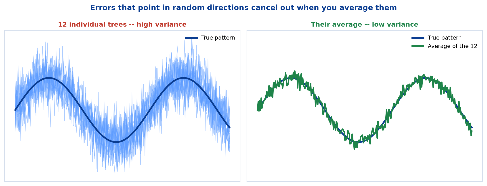
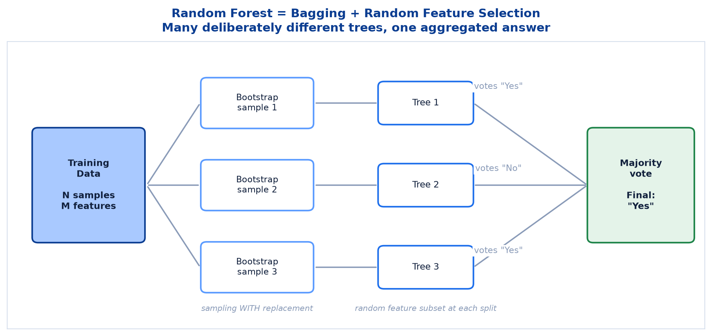
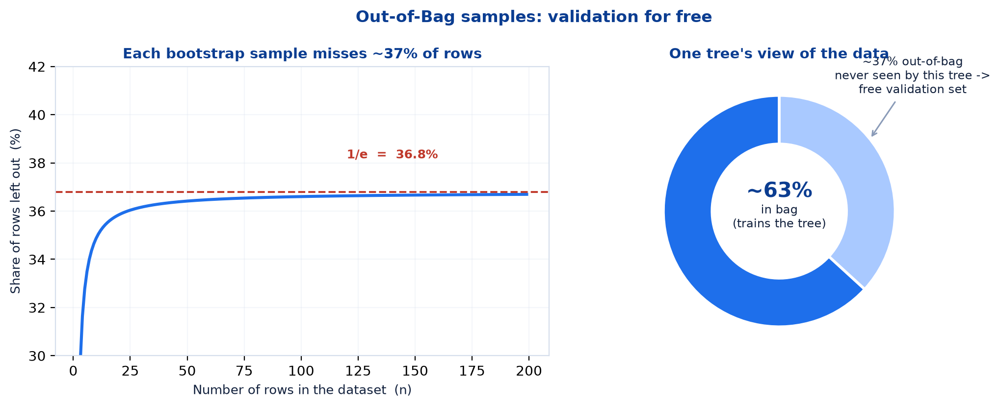
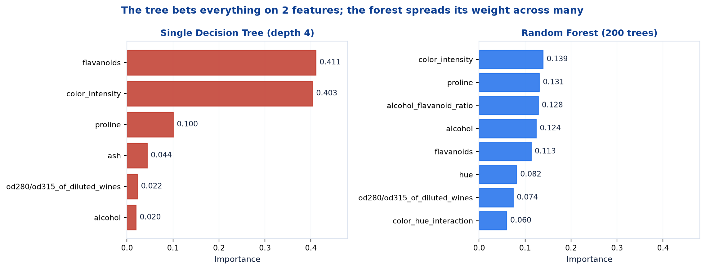
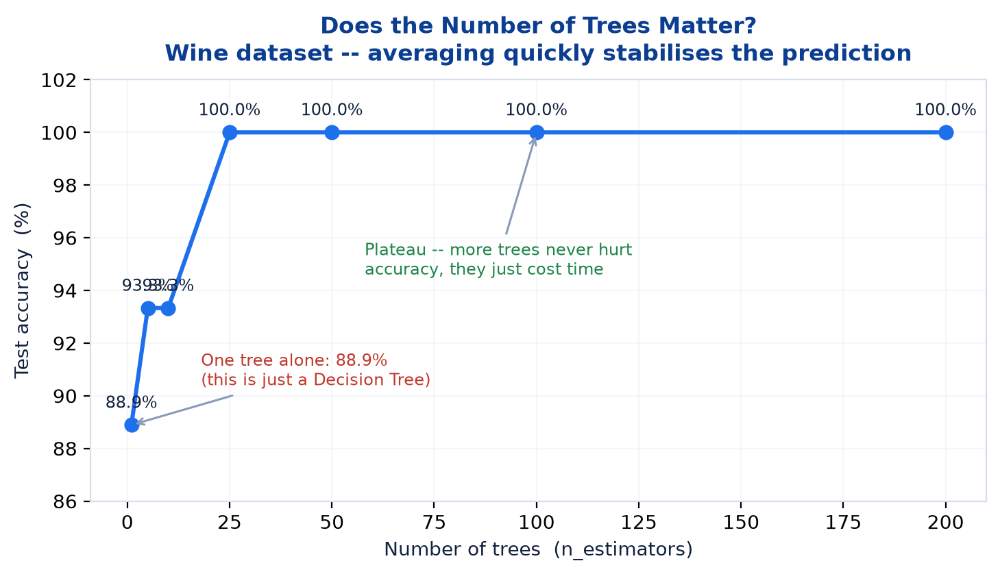

# <span style="color:#0B3D91">Random Forest &amp; Ensembles</span>

> Study notes on the ensemble idea — why combining many weak-ish models beats polishing one, how **bagging** and **random feature selection** manufacture the diversity that makes it work, what Out-of-Bag error gives you for free, and where Random Forest sits against a single Decision Tree.
> The algorithm that trades a little interpretability for a lot of reliability — and usually the strongest thing you can train in one line.

> **A note on formulas:** equations are written in plain text inside code blocks rather than LaTeX, so they render correctly in any Markdown viewer.

> **Where this sits:** Note 01 ended with a list of Decision Tree weaknesses — high variance, instability, greedy splits. This note is the fix. Everything here assumes you know how a single tree is grown, so read [01 — Decision Trees](01_Machine_Learning_Decision_Trees.md) first.

---

## <span style="color:#1E6FEB">Table of Contents</span>

1. [Why Go for Ensemble-Based Algorithms?](#1-why-go-for-ensemble-based-algorithms)
2. [How Ensembles Help — Bagging, Boosting &amp; Stacking](#2-how-ensembles-help--bagging-boosting--stacking)
3. [What Is Random Forest?](#3-what-is-random-forest)
4. [Bagging + Random Feature Selection](#4-bagging--random-feature-selection)
5. [Out-of-Bag (OOB) Error](#5-out-of-bag-oob-error)
6. [Key Hyperparameters](#6-key-hyperparameters)
7. [Advantages &amp; Limitations](#7-advantages--limitations)
8. [Decision Tree vs. Ensemble Methods](#8-decision-tree-vs-ensemble-methods)
9. [Feature Importance in a Forest](#9-feature-importance-in-a-forest)
10. [Practical 1 (Part 2) — Random Forest in Code](#10-practical-1-part-2--random-forest-in-code)

---

## <span style="color:#1E6FEB">1. Why Go for Ensemble-Based Algorithms?</span>

### 1.1 Overview / What is it?
> Decision Trees are simple and interpretable, but **prone to overfitting and high variance**.

An **ensemble** combines many models into one prediction. The premise sounds almost too convenient — *lots of mediocre models beat one carefully tuned model* — but it holds, and section 2 explains why.

### 1.2 Why does it matter for AI?
Ensembles are what people actually deploy. In practice, for tabular data, a Random Forest or a gradient-boosted ensemble is very often the strongest model available, and it gets there without the tuning effort a neural network demands. Knowing when to reach for one is genuinely useful knowledge.

### 1.3 Key Concepts — the four problems with a single tree

| Problem | What goes wrong |
|---|---|
| **High Variance** | A tree can fit training data very well, including noise, but fail to generalize |
| **Instability** | Small changes in training data can create a completely different tree structure |
| **Greedy Nature** | Locally optimal splits which may not lead to the globally best model |
| **Limited Predictive Power** | A single tree may not capture complex patterns as well as ensembles |

> **Key Takeaway** — Ensembles reduce errors by combining many models, so the **weaknesses of one tree are compensated by the strengths of others**.

### 1.4 Simple Example — the crowd analogy
Ask one person to guess the number of sweets in a jar and you will likely get a poor answer. Ask 200 people and **average their guesses** — the average is usually remarkably close. Individual guesses are wrong in *different directions*, so the errors cancel.

That is the entire theory of bagging, and it carries one crucial condition: **the guesses must be independent.** If all 200 people copy the loudest person in the room, you have one guess with extra steps. Manufacturing genuine independence between trees is exactly what section 4 is about.

### 1.5 How it works — errors cancelling



Each pale line is one tree's prediction — wobbling badly around the truth. Their **average** (right) tracks the true pattern closely. No individual tree got better; the *combination* did.

```
One tree:    right pattern + large random error
Many trees:  right pattern + large random errors that partly CANCEL when averaged
```

The signal is **shared** by every tree, so it survives averaging. The noise is **different** in each tree, so it shrinks.

### 1.6 Practical Example / Use Case
We already watched this happen in Note 01 without naming it. The Wine tree scored **0.978** on one split but only **0.899** under cross-validation — proof that a single tree's performance swings with the data it happens to see. That swing *is* variance, and it is what ensembles flatten.

### 1.7 Key Takeaways
> - A single tree suffers **high variance, instability, greedy splits,** and **limited predictive power**.
> - An **ensemble** combines many models so their individual weaknesses compensate.
> - Errors that point in **random, different directions cancel out** when averaged.
> - Requires the models to be **genuinely different** — identical models average to nothing new.
> - Ensembles are the standard strong baseline for tabular data.

---

## <span style="color:#1E6FEB">2. How Ensembles Help — Bagging, Boosting &amp; Stacking</span>

### 2.1 Overview / What is it?
> Single Decision Tree: high variance. Ensemble of many trees: low variance.

There are three main ways to build an ensemble, and they target different problems.

### 2.2 Why does it matter for AI?
Knowing which family a method belongs to tells you what it is fixing. Random Forest is **bagging** — it attacks variance. XGBoost is **boosting** — it attacks bias. Reaching for the wrong one wastes effort.

### 2.3 Key Concepts — the three families

| Family | Examples | What it does |
|---|---|---|
| **Bagging** | **Random Forest** | Reduces **variance** by averaging many trees trained on different subsets of data |
| **Boosting** | XGBoost, LightGBM, AdaBoost | Reduces **bias** (and variance) by focusing on hard-to-predict examples **sequentially** |
| **Stacking** | — | Combines **different models/learners** to get a better prediction |

The word **sequentially** is the key difference. Bagging trains trees **in parallel** — all independent, all ignorant of each other. Boosting trains them **one after another**, each new model concentrating on what the previous ones got wrong.

> **Scope note:** this session covers **Random Forest** (bagging) in depth. Boosting and stacking are named on slide 35 for context but not taught — the brief mention above is all the course provides.

### 2.4 Simple Example — the four benefits

| Benefit | Detail |
|---|---|
| **Higher Accuracy** | Combines models to improve predictive performance |
| **Better Generalization** | Reduces overfitting; performs well on unseen data |
| **Robustness** | Less sensitive to noise, outliers, and small data changes |
| **Leverages Diversity** | Different trees learn different aspects; together they are stronger |

### 2.5 How it works — bagging vs boosting side by side

```
BAGGING (Random Forest)
    Tree 1 ─┐
    Tree 2 ─┤  all trained in PARALLEL on different random samples
    Tree 3 ─┤  none knows the others exist
    ...    ─┴──►  VOTE / AVERAGE

BOOSTING (XGBoost etc.)
    Tree 1 ──► what did it get wrong?
                  └─► Tree 2 focuses on those errors ──► what's still wrong?
                              └─► Tree 3 focuses on those ...  (SEQUENTIAL)
```

Bagging is **embarrassingly parallel** — 200 trees can be trained on 200 cores simultaneously. Boosting cannot; tree 2 needs tree 1's mistakes first.

### 2.6 Practical Example / Use Case
"Leverages Diversity" is the one that quietly does the work. An ensemble of 200 **identical** trees is pointless — it predicts exactly what one tree predicts, 200 times slower. The whole method depends on making the trees disagree, which is precisely what section 4 engineers.

### 2.7 Key Takeaways
> - **Bagging** → reduces **variance** by averaging trees trained on different data subsets. *(Random Forest)*
> - **Boosting** → reduces **bias** by focusing sequentially on hard examples. *(XGBoost, LightGBM, AdaBoost)*
> - **Stacking** → combines different types of learners.
> - Bagging trains **in parallel**; boosting trains **sequentially**.
> - Benefits: **higher accuracy, better generalization, robustness, diversity**.
> - Diversity is mandatory — identical models make a pointless ensemble.

---

## <span style="color:#1E6FEB">3. What Is Random Forest?</span>

### 3.1 Overview / What is it?
> An ensemble learning method that builds **multiple Decision Trees** and outputs the **majority vote** (classification) or **mean** (regression).

The name is an accurate description for once: a **forest** of trees, each made different by **randomness**.

### 3.2 Why does it matter for AI?
It is the most reliable single line of code in classical machine learning. Defaults usually work, no scaling is needed, it rarely overfits badly, and it handles mixed feature types. For a first model on tabular data it is very hard to beat for the effort involved.

### 3.3 Key Concepts — the five steps

| Step | What happens |
|---|---|
| **1. Input Dataset** | N samples, M features |
| **2. Bootstrap Sampling** | Random sampling **with replacement** |
| **3. Build Trees** | One decision tree per bootstrap sample |
| **4. Aggregate** | Voting (classification) or averaging (regression) |
| **5. Final Prediction** | Majority vote / mean |



> **Key Takeaway** — Combine many diverse trees to reduce overfitting and improve generalization: **Decision Tree (high variance) → Random Forest (low variance, high accuracy)**.

### 3.4 Simple Example — voting in the practical
The notebook makes the vote visible on the Play Tennis data:

```python
tennis_forest = RandomForestClassifier(n_estimators=25, max_depth=3, random_state=RANDOM_STATE)
tennis_forest.fit(X_tennis, y_tennis)

votes = [int(t.predict(new_day.to_numpy())[0]) for t in tennis_forest.estimators_]
```

**Output:**

```
Single Tree predicts:   Don't Play
Forest vote tally: 13 of 25 trees said 'Play'
Random Forest predicts: Don't Play
Random Forest probability of Play: 0.472
```

> That probability is simply the fraction of trees in the forest that voted 'Play'.

**A detail worth pausing on.** 13 out of 25 is a majority — yet the forest predicts *"Don't Play"*, and reports a probability of 0.472 rather than 13/25 = 0.52. Why?

Because scikit-learn does **not** take a hard majority vote. It averages each tree's **predicted probabilities** (`predict_proba`) and then thresholds. A tree that is 51% sure contributes far less conviction than one that is 100% sure. Here, the 12 "Don't Play" trees were collectively more confident than the 13 "Play" trees, and confidence won.

**This is soft voting**, and it is generally better than hard counting — it uses information a headcount throws away. Worth knowing, because the slides describe the idealised "majority vote" version.

### 3.5 How it works — classification vs regression

| Task | Aggregation |
|---|---|
| **Classification** | **Majority vote** — the class most trees predict (in practice, averaged probabilities) |
| **Regression** | **Mean** — the numerical average of all tree predictions |

### 3.6 Practical Example / Use Case
Each tree in the forest is a **complete, ordinary Decision Tree** — everything from Note 01 still applies to each one individually. The notebook demonstrates this by plotting a single member:

```python
plot_tree(forest_model.estimators_[0], ...)   # Tree #1 of 200
```

A forest is not a new kind of model. It is **200 of the old kind, disagreeing productively**.

### 3.7 Key Takeaways
> - **Random Forest** = many Decision Trees; output is the **majority vote** (classification) or **mean** (regression).
> - Pipeline: **input → bootstrap samples → build trees → aggregate → final prediction**.
> - Each tree is a normal Decision Tree; the forest is the combination.
> - Slogan: **Decision Tree (high variance) → Random Forest (low variance, high accuracy)**.
> - In scikit-learn the vote is **soft** (averaged probabilities), which is why 13/25 votes gave p = 0.472.

---

## <span style="color:#1E6FEB">4. Bagging + Random Feature Selection</span>

### 4.1 Overview / What is it?
> The **two mechanisms** that make each tree in the forest different from the others.

| Mechanism | What it does |
|---|---|
| **Bagging (Bootstrap Aggregating)** | Trains each tree on a different **bootstrap sample** of the data |
| **Random Feature Selection** | At each split, considers only a **random subset of features** (not all) |

### 4.2 Why does it matter for AI?
Section 2 established that ensembles need diversity. These two tricks are how Random Forest **manufactures** it. Remove either one and the method degrades sharply.

### 4.3 Key Concepts — bagging
**Bootstrap sampling** means drawing N samples from a dataset of N rows, **with replacement**. Some rows get picked several times; some never get picked at all.

```
Original 10 rows:    [A B C D E F G H I J]

Bootstrap sample 1:  [A A C D D F G H J J]   <- B, E, I missing; A and D twice
Bootstrap sample 2:  [B B C C E F F H I J]   <- A, D, G missing
Bootstrap sample 3:  [A B D E E G H H I J]   <- C, F missing
```

Each tree therefore sees a **slightly different world** and grows differently. Note 01 told us a tree is unstable — small data changes restructure it completely. **Bagging deliberately weaponises that instability.**

### 4.4 Simple Example — why random feature selection is also needed
Bagging alone is not enough. Suppose one feature is overwhelmingly predictive — `flavanoids` in the Wine data, say. **Every** tree, on **every** bootstrap sample, would choose it as the root. The trees would end up nearly identical at the top, and correlated trees do not cancel each other's errors.

The fix: at **every single split**, only a random handful of features are even considered. With `max_features="sqrt"` and 15 features, each split sees only ~4 candidates chosen at random. Sometimes `flavanoids` is not among them, so the tree is *forced* to find a different question — and discovers signal it would otherwise have ignored.

```
Split in tree 1:  candidates {alcohol, hue, ash, proline}         -> picks proline
Split in tree 2:  candidates {flavanoids, magnesium, ash, hue}    -> picks flavanoids
Split in tree 3:  candidates {color_intensity, ash, alcohol, hue} -> picks color_intensity
```

**Same data, three different roots.** That is the diversity engine.

### 4.5 How it works — two dice, not one

```
Randomness source 1:  WHICH ROWS      each tree sees   (bagging)
Randomness source 2:  WHICH FEATURES  each split considers (random feature selection)
```

Bagging alone gives you "Bagged Trees" — a real method, but weaker. Adding feature randomness is precisely what upgrades it to a **Random Forest**.

### 4.6 Practical Example / Use Case
The notebook shows the result directly, plotting two trees from the same 25-tree forest:

> Each tree was trained on a different bootstrap sample and a different random subset of features at each split — that's why their splits differ, even though they saw the same data.

Same input data. Different trees. By design.

### 4.7 Key Takeaways
> - **Two** randomness mechanisms, not one.
> - **Bagging** — each tree trains on a bootstrap sample (**sampling with replacement**).
> - **Random Feature Selection** — each split considers only a random subset of features.
> - Feature randomness stops one dominant feature from making every tree the same.
> - Trees must be **decorrelated** for their errors to cancel.
> - A tree's instability is a *bug* alone, and a *feature* inside a forest.

---

## <span style="color:#1E6FEB">5. Out-of-Bag (OOB) Error</span>

### 5.1 Overview / What is it?
> Each bootstrap sample leaves out **~37%** of the data (the "out-of-bag" samples). These unseen points give a **free, unbiased estimate** of model performance — without needing a separate validation set.

### 5.2 Why does it matter for AI?
It is validation that costs nothing. Every tree already has a personal test set it never saw; the forest simply collects those verdicts. On small datasets — where surrendering 25% of your rows to a test set genuinely hurts — this is a real gift.

### 5.3 Key Concepts — where 37% comes from



This number is not arbitrary. For each draw, one specific row has a `1 - 1/n` chance of *not* being picked. Across n draws:

```
P(a given row is never picked) = (1 - 1/n)^n

As n grows, this converges to  1/e  =  0.368  =  36.8%
```

| Dataset size | Share left out |
|---|---|
| 10 rows | 34.9% |
| 50 rows | 36.4% |
| 133 rows (Wine training set) | 36.6% |
| 1000 rows | 36.8% |

So for any reasonably sized dataset:

| Portion | Role |
|---|---|
| **~63%** | In the bootstrap sample — **trains** this tree |
| **~37%** | Out-of-bag — **never seen** by this tree |

### 5.4 Simple Example — how the estimate is assembled
Each row is out-of-bag for roughly a third of the trees. To score row *i*, the forest asks **only the trees that never saw it** and aggregates their votes. Repeat for every row, and you have an honest accuracy estimate — using the whole dataset, with no separate holdout.

> **Key Takeaway** — **Lower OOB error → better model.**

### 5.5 How it works — in code

```python
forest_model = RandomForestClassifier(
    n_estimators=200, max_depth=6, random_state=RANDOM_STATE, oob_score=True,
)
forest_model.fit(X_wine_train, y_wine_train)

print("OOB Score:", forest_model.oob_score_)
print("OOB Error:", 1 - forest_model.oob_score_)
```

**Output:**

```
OOB Score: 0.9699248120300752
OOB Error: 0.03007518796992481
```

An OOB score of **0.970** — the forest gets ~97% of out-of-bag predictions right. You must opt in with `oob_score=True`; it is off by default.

### 5.6 Practical Example / Use Case
Compare the three estimates the notebook produces for the same forest:

| Estimate | Value | What it used |
|---|---|---|
| **Test-set accuracy** | 1.000 | 45 held-out wines |
| **OOB score** | 0.970 | Out-of-bag rows, free |
| **5-fold cross-validation** | 0.977 | Five separate splits |

**The OOB score is the closest to the cross-validated truth**, and it cost nothing. That perfect 1.000 on the test set is a small-sample illusion — 45 wines is simply not many. This is a neat demonstration that OOB is a genuinely useful sanity check.

### 5.7 Key Takeaways
> - Each bootstrap sample leaves out **~37%** of rows — from `(1 - 1/n)^n → 1/e = 0.368`.
> - ~**63%** trains the tree; ~**37%** is out-of-bag.
> - OOB samples provide a **free, unbiased** performance estimate — no separate validation set.
> - **Lower OOB error → better model.**
> - Enable with **`oob_score=True`**; read via `forest.oob_score_`.
> - On Wine: OOB = **0.970**, far closer to the cross-validated 0.977 than the flattering 1.000 test score.

---

## <span style="color:#1E6FEB">6. Key Hyperparameters</span>

### 6.1 Overview / What is it?
The dials you can turn on a Random Forest, with the values worth trying.

### 6.2 Why does it matter for AI?
Random Forest is forgiving — defaults usually work. But knowing which parameters control **capacity** (and therefore overfitting) is what lets you fix a model that is misbehaving.

### 6.3 Key Concepts — the five parameters

| Parameter | Description | Typical Values |
|---|---|---|
| **n_estimators** | Number of trees in the forest | 100, 200, 500, 1000 |
| **max_depth** | Maximum depth of each tree | None, 10, 20, 30 |
| **max_features** | Features considered at each split | `sqrt`, `log2`, `None` |
| **min_samples_split** | Minimum samples required to split a node | 2, 5, 10 |
| **min_samples_leaf** | Minimum samples required at a leaf node | 1, 2, 4 |

Three of these — `max_depth`, `min_samples_split`, `min_samples_leaf` — are the **pruning controls from Note 01**, applied to each tree in the forest. Same knobs, more trees.

### 6.4 Simple Example — the one that behaves differently
`n_estimators` is unlike every other capacity parameter you will meet: **more trees never causes overfitting.** Adding trees only refines the average. The cost is time and memory, not generalization.

```
max_depth   too high  ->  OVERFITS
n_estimators too high ->  just SLOW (accuracy plateaus, never degrades)
```

So the honest tuning advice for `n_estimators` is: **as many as you can afford, then stop when the curve flattens.**

### 6.5 How it works — `max_features` is the diversity dial

| Setting | Effect |
|---|---|
| `sqrt` | √M features per split — the classification default, strong decorrelation |
| `log2` | log₂M features per split — even fewer, more diversity |
| `None` | **All** features — this disables random feature selection entirely |

Setting `max_features=None` turns your Random Forest back into plain Bagged Trees. Section 4.4 explained why that is a downgrade.

### 6.6 Practical Example / Use Case
The practical's configuration:

```python
forest_model = RandomForestClassifier(
    n_estimators=200, max_depth=6, random_state=RANDOM_STATE, oob_score=True,
)
```

200 trees, each capped at depth 6. Note that the forest's trees are allowed to be **deeper** than the single tree from Note 01 (`max_depth=4`). That is deliberate and a general principle: individual trees in a forest can afford to overfit a little, because **averaging cleans up the mess afterwards**. The ensemble provides the regularisation that pruning provides for a lone tree.

### 6.7 Key Takeaways
> - **`n_estimators`** (trees), **`max_depth`**, **`max_features`**, **`min_samples_split`**, **`min_samples_leaf`**.
> - **More trees never overfits** — it only costs time. Every other parameter does control capacity.
> - **`max_features`** is the diversity dial; `sqrt` is the classification default, `None` disables the trick.
> - The pruning parameters are the same ones from Note 01, applied per tree.
> - Trees inside a forest can be **deeper** than a standalone tree — averaging absorbs the overfitting.

---

## <span style="color:#1E6FEB">7. Advantages &amp; Limitations</span>

### 7.1 Overview / What is it?
What you gain and what you pay when moving from one tree to many.

### 7.2 Why does it matter for AI?
The trade is real and worth stating plainly: **you swap interpretability and compute for accuracy and stability.** Whether that is a good deal depends entirely on the setting.

### 7.3 Key Concepts

| Advantages | Limitations |
|---|---|
| High accuracy and **robust to overfitting** | **Less interpretable** than a single tree |
| Handles **missing values and outliers** effectively | Requires more **computational power and memory** |
| Works well on **large, high-dimensional** data | **Prediction time increases** with more trees |

### 7.4 Simple Example — the interpretability cost, quantified
Note 01's Play Tennis tree fitted comfortably in one diagram, readable at a glance. The Wine forest is **200 trees of depth 6**, each with up to 63 nodes — roughly **12,000 decision nodes**.

You cannot read that. You can inspect one tree (the notebook plots tree #1 of 200), but no single tree explains the forest's prediction, because the answer came from averaging all 200.

**What you keep:** feature importances (section 9), and the ability to say *which* factors mattered.
**What you lose:** the exact if-then chain behind any individual prediction.

**In practice:** if a regulator demands a per-decision explanation, a single tree may be the better choice despite lower accuracy. Accuracy is not the only requirement in the room.

### 7.5 How it works — "robust to overfitting", precisely
This phrase is often over-read. It does **not** mean a Random Forest cannot overfit — it can, particularly on small or noisy data. It means the forest is **far more resistant** than a single unconstrained tree, because averaging cancels the idiosyncratic errors each tree makes.

A forest of deep trees will still hit 100% training accuracy. **Judge it on OOB or cross-validation, never on training accuracy.**

### 7.6 Practical Example / Use Case
The compute cost in the practical: 200 trees on a 133-row dataset is instant. On millions of rows with 500 trees, training becomes a genuine consideration — and every prediction must traverse all 500 trees. For low-latency serving that matters, which is why production systems sometimes deploy fewer trees than they trained.

### 7.7 Key Takeaways
> - **Advantages:** high accuracy, robust to overfitting, handles missing values and outliers, good on large high-dimensional data.
> - **Limitations:** less interpretable, more compute and memory, slower predictions.
> - The core trade: **interpretability and speed, for accuracy and stability**.
> - "Robust to overfitting" means **more resistant**, not immune — still validate properly.
> - You keep **feature importances**; you lose the **per-prediction if-then chain**.

---

## <span style="color:#1E6FEB">8. Decision Tree vs. Ensemble Methods</span>

### 8.1 Overview / What is it?
A direct comparison across the dimensions that matter (slide 39).

### 8.2 Why does it matter for AI?
This table is the decision aid. When somebody asks *"should we use a tree or a forest?"*, the answer is in the **Best Use Cases** row.

### 8.3 Key Concepts — the comparison

| Aspect | Decision Tree (Single) | Ensemble Methods |
|---|---|---|
| **Bias** | Low (deep tree) / High (shallow tree) | Lower overall |
| **Variance** | **High** | **Much lower** |
| **Overfitting Risk** | High | Low |
| **Stability** | Low (sensitive to data change) | High (more stable) |
| **Accuracy** | Moderate | High |
| **Training Time** | Low | Higher |
| **Best Use Cases** | Quick insights, interpretable rules | High accuracy, production systems |

The **Variance** row is the headline. Everything else follows from it.

### 8.4 Simple Example — the Wine numbers side by side
Both models, same split, same features, from the practical:

| Metric | Decision Tree | Random Forest |
|---|---|---|
| **Test accuracy** | 0.978 | **1.000** |
| **Macro F1** | 0.979 | **1.000** |
| **5-fold CV accuracy** | 0.899 | **0.977** |
| **CV standard deviation** | 0.029 | 0.028 |

**Look past the test accuracy to the cross-validation row.** The single-split comparison (0.978 vs 1.000) looks like a minor improvement. The cross-validated comparison (**0.899 vs 0.977**) reveals the real gap — nearly **8 percentage points**.

The single tree's test score was flattered by a lucky split. The forest's advantage is far bigger than one split suggested, which is precisely the point about variance: **the forest's performance is more consistent, not just higher.**

### 8.5 How it works — when a single tree still wins

| Choose a single tree when | Choose a forest when |
|---|---|
| You must **explain every prediction** | You need the **best accuracy** |
| A regulator or auditor requires the rules | You have plenty of compute |
| You want a quick look at the data's structure | You are building a **production system** |
| Training/serving must be very fast | Data is large and high-dimensional |

### 8.6 Practical Example / Use Case
A common professional workflow uses **both**: fit a shallow tree first to understand and explain the data's structure to stakeholders, then deploy a forest for actual predictions. The tree is the communication tool; the forest is the engine. They are not competitors.

### 8.7 Key Takeaways
> - Ensembles win on **variance, overfitting risk, stability, and accuracy**.
> - Single trees win on **training time** and **interpretability**.
> - Wine cross-validated: **tree 0.899 vs forest 0.977** — the real gap, invisible on one split.
> - **Single tree** → quick insights, interpretable rules. **Ensemble** → high accuracy, production.
> - Using both — tree to explain, forest to predict — is a perfectly sensible strategy.

---

## <span style="color:#1E6FEB">9. Feature Importance in a Forest</span>

### 9.1 Overview / What is it?
> Random Forest feature importance **averages the impurity decrease from every tree** in the forest — usually a more stable estimate than a single tree's importances.

### 9.2 Why does it matter for AI?
This is the interpretability you **keep** after giving up the readable tree diagram. It is also more trustworthy than a single tree's version, for the same averaging reason that makes the predictions better.

### 9.3 Key Concepts — single tree vs forest, side by side



| Rank | Decision Tree | | Random Forest | |
|---|---|---|---|---|
| 1 | flavanoids | **0.411** | color_intensity | **0.139** |
| 2 | color_intensity | **0.403** | proline | 0.131 |
| 3 | proline | 0.100 | alcohol_flavanoid_ratio | 0.128 |
| 4 | ash | 0.044 | alcohol | 0.124 |
| 5 | od280/od315 | 0.022 | flavanoids | 0.113 |
| 6 | alcohol | 0.020 | hue | 0.082 |
| 7 | *(9 features scored 0)* | 0.000 | od280/od315 | 0.074 |
| 8 | | | color_hue_interaction | 0.060 |

**The distributions are completely different in character.**

- The **single tree** is winner-takes-all: two features hold **81%** of the importance, and **9 of 15 features score exactly zero**.
- The **forest** spreads the weight: the top feature holds only **14%**, and **every** feature gets used somewhere.

### 9.4 Simple Example — why the forest spreads it out
Random feature selection (section 4.4) is the cause. Because `flavanoids` is unavailable at many splits, other trees are forced to find alternative questions — and discover that `alcohol`, `hue`, and `proline` also carry real signal.

The single tree never learned this. Having grabbed `flavanoids` and `color_intensity` early, it had no reason to look further, so it reported the other 9 features as worthless.

**They were not worthless. The tree just never tried them.**

This is the correlated-features caveat from Note 01, section 10.5, demonstrated. The forest's importances are the more honest picture of what actually carries information.

### 9.5 How it works — the feature-removal experiment
The notebook tests whether the low-importance features can be dropped:

```python
top_half_features = sorted_features.index[: len(sorted_features) // 2].tolist()
forest_reduced = RandomForestClassifier(n_estimators=200, max_depth=6, random_state=RANDOM_STATE)
forest_reduced.fit(X_wine_train[top_half_features], y_wine_train)
```

```
Keeping (top half by importance): ['color_intensity', 'proline', 'alcohol_flavanoid_ratio',
    'alcohol', 'flavanoids', 'hue', 'od280/od315_of_diluted_wines']
Removing (bottom half): ['color_hue_interaction', 'total_phenols', 'alcalinity_of_ash',
    'magnesium', 'proanthocyanins', 'malic_acid', 'ash', 'nonflavanoid_phenols']

Accuracy with ALL features:        1.000
Accuracy with TOP HALF features:   0.978
```

Halving the feature count cost **2.2 percentage points** — one extra wine misclassified out of 45. On a larger dataset, halving the features means roughly halving training time and simplifying the data pipeline. **That is often a trade worth making**, and you now have a number to argue about rather than a hunch.

### 9.6 Practical Example / Use Case — does adding trees help?



```python
for n in [1, 5, 10, 25, 50, 100, 200]:
    trial_forest = RandomForestClassifier(n_estimators=n, max_depth=6, random_state=RANDOM_STATE)
```

| Trees | Test accuracy |
|---|---|
| 1 | 0.889 |
| 5 | 0.933 |
| 10 | 0.933 |
| 25 | **1.000** |
| 50 | 1.000 |
| 100 | 1.000 |
| 200 | 1.000 |

The shape is textbook: **rises quickly, then plateaus.**

- **1 tree = 0.889.** A "forest" of one tree is just a Decision Tree — and a worse one than Note 01's, since random feature selection handicaps a lone tree.
- **The jump from 1 to 25 trees is where all the value is** (+11 points).
- **Beyond 25, nothing changes.** Trees 26 through 200 cost CPU time and deliver exactly zero additional accuracy.

Confirming section 6.4: more trees never *hurts* accuracy, but the returns vanish quickly. **Find the plateau and stop.**

### 9.7 Key Takeaways
> - Forest importance = **average impurity decrease across all trees** — more stable than one tree's.
> - The single tree gave **81%** of importance to 2 features and **zero to 9**; the forest spread it across **all 15**.
> - Random feature selection is what forces the forest to discover the secondary features.
> - Dropping the bottom half of features cost only **2.2 points** (1.000 → 0.978).
> - Accuracy vs trees: **0.889 at 1 tree → 1.000 by 25 trees → flat thereafter**.
> - **More trees never hurts accuracy, but the plateau arrives early.**

---

## <span style="color:#1E6FEB">10. Practical 1 (Part 2) — Random Forest in Code</span>

### 10.1 Overview / What is it?
Part 2 of the notebook repeats Part 1's journey with a forest, reusing the identical Wine split so the comparison is fair.

### 10.2 Why does it matter for AI?
Controlling the comparison is the actual lesson. Same rows, same features, same `random_state` — so any difference in performance comes from **the algorithm**, not from a luckier split.

### 10.3 Key Concepts — the setup

> We reuse the same prepared Wine data (`X_wine_train`, `X_wine_test`, `y_wine_train`, `y_wine_test`, already feature-engineered) from Part 1 — the exact same split, so Random Forest is judged on identical data to the Decision Tree.

```python
forest_model = RandomForestClassifier(
    n_estimators=200, max_depth=6, random_state=RANDOM_STATE, oob_score=True,
)
forest_model.fit(X_wine_train, y_wine_train)
forest_predictions = forest_model.predict(X_wine_test)
```

As with the tree: **no scaling, no Pipeline** — forests split on raw values too.

### 10.4 Simple Example — the results

```
Random Forest accuracy: 1.00

              precision    recall  f1-score   support

     class_0       1.00      1.00      1.00        15
     class_1       1.00      1.00      1.00        18
     class_2       1.00      1.00      1.00        12

    accuracy                           1.00        45
```

**A perfect score on all 45 test wines.**

Resist the urge to celebrate. A perfect score should always trigger suspicion, and here the explanations are mundane:

1. **The test set is tiny** — 45 wines. One lucky split.
2. **Wine is an easy, clean dataset** — 3 well-separated cultivars, no missing values.
3. **The honest estimates disagree** — OOB says 0.970, cross-validation says 0.977.

**In production, a perfect test score almost always means a bug** — usually data leakage or a contaminated split. Here it is merely a small, easy dataset, but the reflex to double-check is the right one.

### 10.5 How it works — cross-validation, the trustworthy number

```python
kfold = KFold(n_splits=5, shuffle=True, random_state=RANDOM_STATE)
cv_scores = cross_val_score(cv_model, X_wine, y_wine, cv=kfold)
```

**Output:**

```
Accuracy for each of the 5 folds: [1.    1.    0.944 0.943 1.   ]
Average accuracy: 0.977
Standard deviation: 0.028
```

Three folds perfect, two around 0.94. **Average 0.977** — excellent, believable, and lower than the single split suggested.

Now the comparison that matters, against Note 01's tree:

| | Decision Tree | Random Forest |
|---|---|---|
| Fold scores | [0.944, 0.889, 0.889, 0.914, 0.857] | [1.000, 1.000, 0.944, 0.943, 1.000] |
| **Average** | **0.899** | **0.977** |
| **Std deviation** | 0.029 | 0.028 |

**Every single forest fold beats every single tree fold.** The forest's *worst* fold (0.943) is better than the tree's *best* fold (0.944 — near enough a tie, and every other fold is a clear win). That is not a lucky split; that is a genuinely better model.

### 10.6 Practical Example / Use Case — the complete Part 1 + Part 2 picture

| Experiment | Decision Tree | Random Forest |
|---|---|---|
| Test accuracy (single split) | 0.978 | 1.000 |
| Cross-validated accuracy | 0.899 | **0.977** |
| OOB score | n/a | 0.970 |
| Features actually used | 6 of 15 | all 15 |
| Interpretability | **Full tree readable as text** | 200 trees — importances only |
| Training cost | One tree | 200 trees |

Saving the model works identically:

```python
joblib.dump(forest_model, "models/random_forest_model.joblib")
```

### 10.7 Key Takeaways
> - Part 2 reuses **the exact same split** as Part 1 — a genuinely controlled comparison.
> - Forest test accuracy: **1.000** — but treat perfect scores as suspicious, not triumphant.
> - OOB (**0.970**) and cross-validation (**0.977**) are the honest estimates.
> - Cross-validated head-to-head: **tree 0.899 vs forest 0.977**.
> - The forest's worst fold beats nearly all of the tree's folds — a real improvement, not noise.
> - Still **no scaling required**; still one line to train.

---

## <span style="color:#1E6FEB">Summary — Random Forest at a Glance</span>

| Question | Answer |
|---|---|
| **What is it?** | Many Decision Trees, aggregated by vote (classification) or mean (regression) |
| **Which ensemble family?** | **Bagging** — reduces variance |
| **What makes the trees different?** | **Bootstrap sampling** + **random feature selection** |
| **Needs scaling?** | **No** — same as a single tree |
| **Free validation?** | Yes — **OOB error**, from the ~37% each tree never sees |
| **Main hyperparameter** | `n_estimators` — more never overfits, just costs time |
| **Biggest gain** | **Much lower variance** → stable, accurate predictions |
| **Biggest cost** | **Interpretability** — no single readable tree |
| **Wine result** | CV **0.977** vs the single tree's **0.899** |

**The one-sentence version:** a Random Forest takes the Decision Tree's greatest flaw — its instability — and turns it into the mechanism that makes an ensemble work.

**Where this leads:** Notes 01 and 02 have both been **supervised** — every wine came with its cultivar label. Note 03 removes the labels entirely and asks whether structure can be found without them. That is **clustering**, and it is the first unsupervised algorithm in the course.

---

> **Navigation:** ← Previous: [01 — Decision Trees](01_Machine_Learning_Decision_Trees.md) · Next → 03 — Clustering &amp; K-Means
>
> **Related:** [Model Evaluation Metrics (Session I)](../../machine_learning_01/notes/03_Machine_Learning_Model_Evaluation_Metrics.md) for precision, recall and F1.
