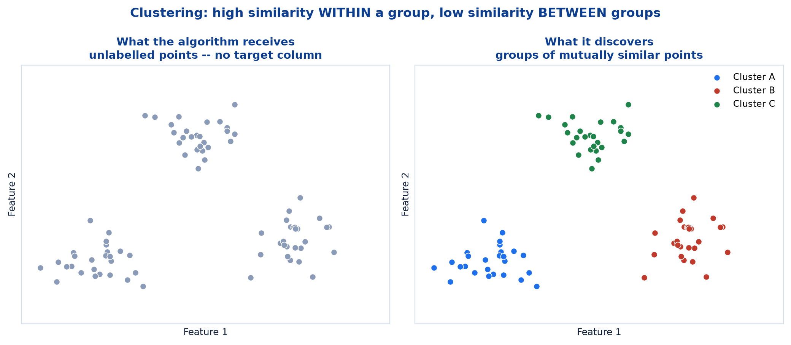
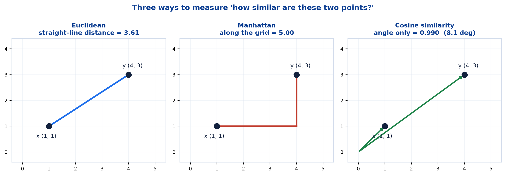
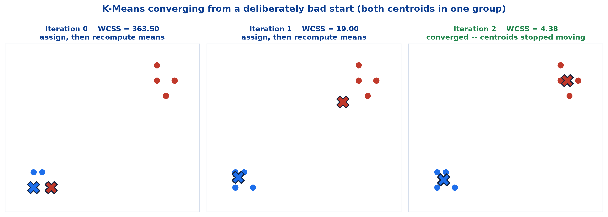
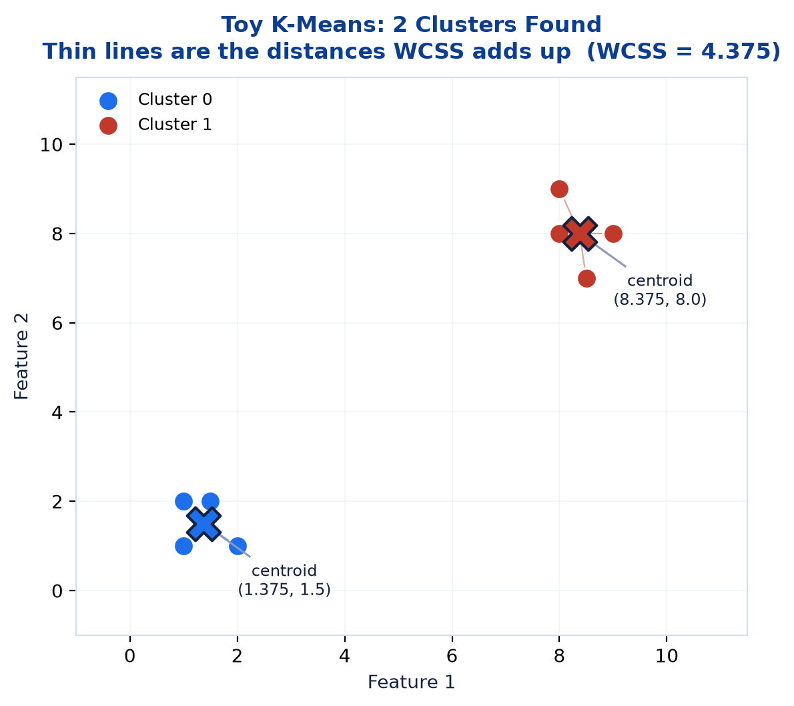
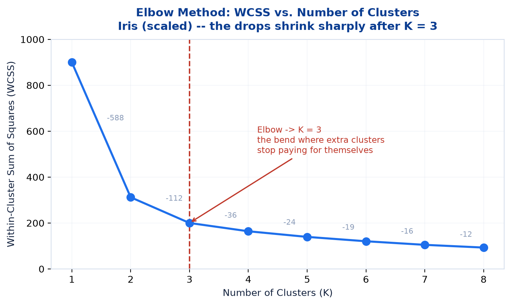

# <span style="color:#0B3D91">Clustering &amp; K-Means</span>

> Study notes on the course's **first unsupervised algorithm** — what changes when the labels disappear, how distance becomes a stand-in for similarity, the K-Means assign-and-update loop, WCSS and the Elbow Method for choosing K, where K-Means fails, and the alternatives that exist when it does.
> The moment machine learning stops answering *"what is the answer?"* and starts answering *"what is in here?"*

> **A note on formulas:** equations are written in plain text inside code blocks rather than LaTeX, so they render correctly in any Markdown viewer.

> **Where this sits:** every algorithm so far — Linear Regression, Logistic Regression, KNN, SVM, Decision Trees, Random Forest — has been **supervised**. Each training row arrived with a known answer attached. This note removes that answer entirely. Evaluating the result then needs a whole new toolkit, which is Note 04's job.

---

## <span style="color:#1E6FEB">Table of Contents</span>

1. [Supervised vs. Unsupervised Learning](#1-supervised-vs-unsupervised-learning)
2. [What Is Clustering?](#2-what-is-clustering)
3. [How Clustering Works &amp; Distance Metrics](#3-how-clustering-works--distance-metrics)
4. [Where Clustering Is Used](#4-where-clustering-is-used)
5. [What Is K-Means?](#5-what-is-k-means)
6. [The Objective Function — WCSS](#6-the-objective-function--wcss)
7. [Choosing K — The Elbow Method](#7-choosing-k--the-elbow-method)
8. [Advantages &amp; Limitations](#8-advantages--limitations)
9. [Beyond K-Means: Other Approaches](#9-beyond-k-means-other-approaches)
10. [Practical 2 — K-Means in Code](#10-practical-2--k-means-in-code)

---

## <span style="color:#1E6FEB">1. Supervised vs. Unsupervised Learning</span>

### 1.1 Overview / What is it?
> **Unsupervised Learning** is a type of machine learning where the model learns patterns from **unlabeled data**.

Session I focused entirely on supervised learning. This is the first departure from it.

### 1.2 Why does it matter for AI?
Labels are expensive. Somebody has to tag 10,000 emails, or pay a radiologist to annotate 5,000 scans. **Most real-world data arrives unlabeled**, and unsupervised learning is what lets you do something useful with it anyway.

There is also a class of question that supervised learning simply cannot ask. *"Predict which customers will churn"* needs churn labels. *"What kinds of customers do we even have?"* needs none — and nobody knows the right answer in advance, which is precisely why it is worth asking.

### 1.3 Key Concepts — the comparison (slide 5)

| | Supervised Learning | Unsupervised Learning |
|---|---|---|
| **Labels required?** | **Yes** — each example has a known answer | **No** — the data has no labeled answer |
| **Goal** | Predict a known target as accurately as possible | **Discover hidden structure** or groupings |
| **Example algorithms** | Linear/Logistic Regression, SVM, Decision Trees | **K-Means**, Hierarchical Clustering, DBSCAN |
| **Example use case** | Predicting house prices; classifying tumors | Customer segmentation; anomaly detection |

### 1.4 Simple Example
Two ways to handle a box of 500 mixed Lego bricks:

```
SUPERVISED:    Here are 100 bricks I have already sorted into "wheels", "roof tiles"
               and "plain blocks". Sort the rest the same way.

UNSUPERVISED:  Here are 500 bricks. Sort them into sensible piles.
               I will not tell you what the piles should be.
```

The second task has **no single correct answer**. Sorting by colour, by size, or by shape are all defensible. You judge the result by whether the piles turn out to be *useful*, not by whether they match a key.

### 1.5 How it works — the four key characteristics of clustering (slide 42)

| Characteristic | Meaning |
|---|---|
| **No target variable** | No labels are used |
| **Discovers structure** | Finds hidden patterns |
| **Useful for segmentation** | Exploration & grouping |
| **Results may vary** | With algorithm/parameters |

That last row is the honest one, and it is a genuine departure from everything so far. Train a Decision Tree twice on the same data with the same seed and you get the identical tree. Run clustering with different parameters — or just a different starting position — and you can legitimately get **different groupings, none of them wrong**.

### 1.6 Practical Example / Use Case
The practical demonstrates this vividly. It clusters the Iris flowers **without ever showing K-Means the species column**:

```python
X_iris = iris_df.drop(columns=["target"])
y_iris_true = iris_df["target"]  # Held aside only for evaluation afterwards, never used in training.
```

The label is quarantined deliberately. It is brought back out only *after* clustering, purely to check how well the discovered groups happened to line up with reality. **In a genuine unsupervised problem that column would not exist at all.**

### 1.7 Key Takeaways
> - **Unsupervised learning** finds patterns in **unlabeled** data — no answer key.
> - Goal shifts from **predicting a known target** to **discovering hidden structure**.
> - Most real data is unlabeled, and labelling is expensive.
> - **Results may vary** with algorithm and parameters — there is often no single "right" clustering.
> - Example algorithms: **K-Means**, Hierarchical Clustering, DBSCAN.

---

## <span style="color:#1E6FEB">2. What Is Clustering?</span>

### 2.1 Overview / What is it?
> **Clustering** is an unsupervised technique that groups similar data points together so that points in the same cluster are **more similar to each other** than to those in other clusters.

Stated more precisely:

> Clustering partitions data points into groups such that **intra-cluster similarity is high** and **inter-cluster similarity is low**.

### 2.2 Why does it matter for AI?
Those two words carry the whole definition:

- **Intra-cluster** = *within* a cluster → you want this similarity **high** (tight groups)
- **Inter-cluster** = *between* clusters → you want this similarity **low** (well-separated groups)

A good clustering satisfies both at once. Either alone is easy to fake: put every point in its own cluster and intra-cluster similarity is perfect; put everything in one cluster and there is no inter-cluster similarity to speak of. **Both conditions together are what make the problem interesting** — and, as Note 04 will show, they are exactly what the Silhouette Score measures.

### 2.3 Key Concepts



| Principle | Detail |
|---|---|
| **Intra-cluster similarity is high** | Points within a cluster are similar |
| **Inter-cluster similarity is low** | Points in different clusters are dissimilar |
| **No target variable** | Nothing guides the grouping |

### 2.4 Simple Example
Look at the left panel above. Every point is grey — that is genuinely all the algorithm receives. No colours, no labels, no hints. The right panel is what it produces: three groups inferred purely from **where the points sit relative to each other**.

Your eye did that instantly on a 2-D scatter plot. The algorithm's value is doing the same thing in **6 dimensions** (the practical's Iris features) or 100, where no eye can follow.

### 2.5 How it works — clustering vs classification
Easy to confuse, so worth stating plainly:

```
CLASSIFICATION (supervised):   Here are emails labelled spam / not-spam.
                               Put NEW emails into one of THOSE boxes.

CLUSTERING (unsupervised):     Here are 10,000 emails, no labels.
                               Work out what boxes even exist.
```

Classification **sorts into known categories**. Clustering **invents the categories**.

A giveaway: a cluster has no name. K-Means returns "Cluster 0", "Cluster 1", "Cluster 2" — and deciding that Cluster 2 means *"high-value weekend shoppers"* is a **human** act of interpretation, performed after the algorithm finishes.

### 2.6 Practical Example / Use Case
This also explains why cluster numbers are **arbitrary**. In the practical, K-Means labels the setosa group "Cluster 1" — but that number carries no meaning and would change with a different random seed. Only the **grouping** is meaningful, never the labels attached to it. Note 04's Adjusted Rand Index is built specifically to cope with this.

### 2.7 Key Takeaways
> - **Clustering** groups similar points so that similar things end up together.
> - **Intra-cluster similarity high** (tight groups), **inter-cluster similarity low** (separated groups).
> - **Both conditions matter** — either one alone is trivially gameable.
> - **Classification sorts into known categories; clustering invents the categories.**
> - Cluster numbers are **arbitrary labels** — the grouping is the output, not the IDs.
> - Naming and interpreting clusters is a **human** job.

---

## <span style="color:#1E6FEB">3. How Clustering Works &amp; Distance Metrics</span>

### 3.1 Overview / What is it?
The general conceptual flow, and the measurements that make "similar" computable.

| Step | What happens |
|---|---|
| **1. Input Data** | Unlabeled data points |
| **2. Measure Similarity** | Compute **distance** between points |
| **3. Group Similar Points** | Form clusters of similar points |
| **4. Final Clusters** | Clusters represent natural groups |

### 3.2 Why does it matter for AI?
Step 2 is where the real decision hides. A computer has no notion of "similar" — it only has **distance**. Choosing a distance metric *is* choosing a definition of similarity, and different metrics produce genuinely different clusters from identical data.

This is the same "distance = similarity" idea that powered KNN in Session I, reused for a completely different purpose.

### 3.3 Key Concepts — the three metrics



| Metric | Formula | Meaning |
|---|---|---|
| **Euclidean Distance** | `d(x, y) = sqrt( SUM (x_i - y_i)^2 )` | Straight-line distance |
| **Manhattan Distance** | `d(x, y) = SUM |x_i - y_i|` | Sum of absolute differences |
| **Cosine Similarity** | `sim(x, y) = (x · y) / (||x|| ||y||)` | Measures **orientation** |

### 3.4 Simple Example — worked on two points
Take `x = (1, 1)` and `y = (4, 3)`:

```
Euclidean:  sqrt( (4-1)^2 + (3-1)^2 ) = sqrt(9 + 4) = sqrt(13) = 3.61
Manhattan:  |4-1| + |3-1|             = 3 + 2                  = 5.00
Cosine:     (1*4 + 1*3) / (sqrt(2) * 5) = 7 / 7.071            = 0.990
```

Three different numbers describing the same pair. The names help:

- **Euclidean** — as the crow flies.
- **Manhattan** — as the taxi drives, along a grid of city blocks. Hence the name.
- **Cosine** — ignores magnitude entirely, measuring only **direction**. A cosine of 0.990 means these two points point in almost the same direction from the origin, despite sitting far apart.

**When cosine earns its place:** comparing documents. A 10,000-word article and a 500-word article on the same topic are far apart in Euclidean terms simply because one is longer — but their *word-proportion direction* is nearly identical. Cosine spots the similarity that Euclidean misses.

### 3.5 How it works — why scaling is mandatory here
Distance-based algorithms are ruined by unscaled features. Recall the Iris features actually used in the practical:

| Feature | Min | Max | Std |
|---|---|---|---|
| sepal length (cm) | 4.30 | 7.90 | 0.83 |
| sepal width (cm) | 2.00 | 4.40 | 0.44 |
| petal length (cm) | 1.00 | 6.90 | 1.77 |
| petal width (cm) | 0.10 | 2.50 | 0.76 |
| **petal_area** | 0.11 | **15.87** | **4.71** |
| sepal_ratio | 1.27 | 2.96 | 0.40 |

`petal_area` spans a range of ~15.8 while `sepal_ratio` spans ~1.7. Left unscaled, `petal_area` would contribute roughly **100× more** to every squared distance than `sepal_ratio` — not because it matters more, but because its units are bigger.

> **Contrast with Notes 01 and 02.** Decision Trees and Random Forest needed **no scaling** — they ask *"is this value above a threshold?"*, which is unit-independent. K-Means computes distances, so **scaling is mandatory**. Same dataset, opposite requirement, purely because of how the algorithm works.

The notebook is explicit about it:

```python
# Scale manually before clustering -- K-Means relies on distance, so unlike Decision Trees
# and Random Forest, scaling matters a great deal here.
scaler_iris = StandardScaler()
X_iris_scaled = scaler_iris.fit_transform(X_iris)
```

### 3.6 Practical Example / Use Case — does scaling actually change anything?
Not a rhetorical question — here is the same Iris data clustered both ways:

| | Cluster sizes | Silhouette Score |
|---|---|---|
| **Unscaled** | 42 / 50 / 58 | 0.662 |
| **Scaled** | 39 / 50 / 61 | 0.469 |

**Different groupings.** Several flowers land in different clusters depending on whether you scaled. A tempting misreading is that unscaled looks "better" because 0.662 > 0.469 — but those two scores are measured in **different spaces** and are not comparable. The unscaled run is effectively clustering on `petal_area` alone, and of course a single dominant feature produces neat-looking separation. **Scale first.**

### 3.7 Key Takeaways
> - Flow: **input data → measure similarity → group similar points → final clusters**.
> - Computers measure similarity as **distance**.
> - **Euclidean** (straight line, the K-Means default), **Manhattan** (grid), **Cosine** (direction only).
> - **Cosine** is the choice when magnitude should be ignored — e.g. documents of different lengths.
> - **Scaling is mandatory** for distance-based algorithms, unlike tree-based ones.
> - Unscaled Iris gives genuinely **different clusters** — the large-range feature dominates.

---

## <span style="color:#1E6FEB">4. Where Clustering Is Used</span>

### 4.1 Overview / What is it?
Four settings where "what groups exist here?" is the actual business question (slide 45).

### 4.2 Why does it matter for AI?
These are the problems where **nobody can supply labels**, because the categories are not known in advance. That is not a limitation of the data — it is the nature of the question.

### 4.3 Key Concepts

| Use case | What it does |
|---|---|
| **Customer Segmentation** | Group customers by behavior for targeted marketing |
| **Market Basket Grouping** | Find products that are frequently bought together |
| **Anomaly Detection** | Spot points that do not belong to any well-formed cluster |
| **Document / Topic Grouping** | Organize articles or support tickets by similar theme |

### 4.4 Simple Example — customer segmentation
The headline use case, and the one the agenda names explicitly. Feed in purchase history with no labels, and groups emerge:

```
Cluster 0 -> frequent small purchases, price-sensitive    -> "bargain hunters"
Cluster 1 -> rare large purchases, premium brands          -> "occasional luxury buyers"
Cluster 2 -> steady mid-range, high loyalty                -> "reliable regulars"
```

**Nobody defined those segments in advance.** They emerged from the data — and then a human read the cluster centroids and gave them names. The marketing team can now target three groups instead of guessing at one undifferentiated mass.

### 4.5 How it works — anomaly detection is the odd one out
The other three use cases care about the clusters. Anomaly detection cares about **the leftovers** — points sitting far from every cluster centre.

```
Normal transactions  -> fall into tight, well-populated clusters
Fraudulent ones      -> sit alone, far from any centroid  -> FLAG
```

You are looking for what the model *failed* to group. This connects directly to Note 04: a point with a **negative** Silhouette Score is poorly placed in its cluster, which is a useful anomaly signal in itself.

### 4.6 Practical Example / Use Case
Note the honest limit of clustering in all four cases: it tells you *that* groups exist, never *why*. K-Means reports "these 200 customers are similar". Deciding they are bargain hunters — and that the right response is a discount campaign — is **entirely human judgement**. The algorithm narrows the question; it does not answer it.

### 4.7 Key Takeaways
> - **Customer segmentation**, **market basket grouping**, **anomaly detection**, **document/topic grouping**.
> - All are settings where **labels cannot exist in advance**.
> - Segmentation discovers groups nobody defined; humans then name and act on them.
> - **Anomaly detection inverts the goal** — the interesting points are the ones that fit nowhere.
> - Clustering finds structure; **interpreting it stays a human job**.

---

## <span style="color:#1E6FEB">5. What Is K-Means?</span>

### 5.1 Overview / What is it?
> **Partition n data points into K clusters** so that the within-cluster sum of squares (WCSS) is minimized.

| Property | Detail |
|---|---|
| Requires you to **specify K** (number of clusters) **in advance** | The big catch — section 7 addresses it |
| Groups points so that points in the same cluster are **close**, and points in different clusters are **far apart** | The clustering goal from section 2 |
| Works well for **spherical, equally sized** clusters | The big assumption — section 8 addresses it |

### 5.2 Why does it matter for AI?
K-Means is the clustering algorithm people mean when they say "clustering". It is simple, fast, scales well, and is usually the first thing to try. Understanding its two constraints — **K must be chosen** and **clusters must be blobby** — tells you when to reach for something else.

### 5.3 Key Concepts — the five steps

| Step | What happens |
|---|---|
| **1. Choose K** | Decide the number of clusters |
| **2. Initialize Centroids** | Randomly select K data points |
| **3. Assign Points** | Assign each point to the **nearest centroid** |
| **4. Update Centroids** | Recompute as the **mean of each cluster** |
| **5. Repeat** | Until centroids stop changing |

A **centroid** is simply the **mean position** of all points currently in a cluster — the cluster's centre of gravity. It is usually not an actual data point, just a location.

The pseudocode:

```
Choose K (number of clusters)
Initialize K centroids randomly
Repeat until convergence:
    assign each point to nearest centroid
    update each centroid as the mean of its points
Return the clusters and centroids
```

Steps 3 and 4 chase each other: **assign, update, assign, update**. The points move between clusters, which moves the centroids, which moves the points again — until nothing changes.

### 5.4 Simple Example — watching it converge



Run on the notebook's 8-point toy dataset, with both centroids deliberately started in the **wrong place** (both inside the bottom-left group) to make the mechanism visible:

| Iteration | Centroids | WCSS | What happened |
|---|---|---|---|
| **0** | (1.0, 1.0) and (2.0, 1.0) | **363.50** | Terrible start — one centroid has grabbed all 4 top-right points plus one bottom-left point |
| **1** | (1.167, 1.667) and (7.1, 6.6) | **19.00** | The means were recomputed; the second centroid leapt to the top-right group |
| **2** | (1.375, 1.5) and (8.375, 8.0) | **4.38** | **Converged** — centroids stopped moving |

**Two iterations to fix a deliberately awful start**, with WCSS falling from 363.5 to 4.38. This is why "fast convergence" appears in the advantages list.

### 5.5 How it works — the notebook's result



```python
toy_points = np.array([
    [1, 1], [1.5, 2], [2, 1], [1, 2],        # Group A (bottom-left)
    [8, 8], [8.5, 7], [9, 8], [8, 9],        # Group B (top-right)
])

toy_kmeans = KMeans(n_clusters=2, n_init=10, random_state=RANDOM_STATE)
toy_labels = toy_kmeans.fit_predict(toy_points)
```

**Output:**

```
Cluster assigned to each point: [0 0 0 0 1 1 1 1]
Final centroid locations:
 [[1.375 1.5  ]
  [8.375 8.   ]]
```

> K-Means found the two groups perfectly, with no labels ever given to it.

The first four points went to cluster 0, the last four to cluster 1 — exactly the visual split. Each centroid is the average of its four members: `(1 + 1.5 + 2 + 1)/4 = 1.375`. Arithmetic you can check by hand.

### 5.6 Practical Example / Use Case — the `n_init` parameter
That `n_init=10` is quietly important and addresses a real weakness.

K-Means is **sensitive to initial centroids** (section 8). A bad random start can converge to a poor arrangement — a *local* minimum rather than the best one. The fix: run the whole algorithm **10 separate times from 10 different random starts**, and keep whichever result achieves the lowest WCSS.

```
n_init=10  ->  run 10 times, keep the best (lowest WCSS) result
```

It is cheap insurance, and the reason you rarely see the initialization problem in practice despite it being a genuine flaw.

### 5.7 Key Takeaways
> - **K-Means** partitions n points into **K clusters**, minimising WCSS.
> - Steps: **choose K → initialize centroids → assign points → update centroids → repeat until stable**.
> - A **centroid** is the **mean position** of its cluster's points — usually not a real data point.
> - The loop is **assign, then update**, chasing each other to convergence.
> - Converges **fast** — the toy example fixed a deliberately bad start in **2 iterations**.
> - **`n_init=10`** runs it 10 times from different starts and keeps the best — insurance against bad initialization.
> - **K must be chosen in advance.**

---

## <span style="color:#1E6FEB">6. The Objective Function — WCSS</span>

### 6.1 Overview / What is it?
> K-Means minimizes the **total squared distance** between points and their assigned cluster centroid.

```
WCSS = SUM over clusters i   SUM over points x in C_i   || x - mu_i ||^2
```

| Symbol | Meaning |
|---|---|
| **C_i** | The set of points in cluster i |
| **mu_i** | The **centroid** (mean) of cluster i |
| **&#124;&#124; x - mu_i &#124;&#124;²** | Squared distance from point x to its centroid |

**WCSS** = Within-Cluster Sum of Squares. In scikit-learn it is called **inertia** (`kmeans.inertia_`).

### 6.2 Why does it matter for AI?
This is the number that defines "good" for K-Means — its equivalent of the cost function `J` in Linear Regression. Same pattern as Note 01's Information Gain and Session I's MSE: **define the quantity, then optimise it.** Once you know the objective, the algorithm's behaviour stops being mysterious.

The distance metric by default:

```
d(x, y) = sqrt( SUM (x_j - y_j)^2 )
```

> K-Means uses **Euclidean distance** by default; **scale your data first** — K-Means is sensitive to outliers and feature scale.

### 6.3 Key Concepts — reading WCSS

| WCSS | Meaning |
|---|---|
| **Low** | Points sit close to their centroids — tight, compact clusters |
| **High** | Points sprawl far from their centroids — loose, poorly-fitted clusters |
| **Zero** | Every point *is* its own centroid (only when K = number of points) |

In the toy figure above, WCSS is the total of all those thin lines, squared. Shorter lines → lower WCSS → tighter clusters.

### 6.4 Simple Example — the squaring, and why it matters
Squaring does the same job here as in Linear Regression's MSE:

- It makes all distances **positive**, so errors cannot cancel.
- It **punishes far-flung points disproportionately** — a point twice as far contributes four times as much.

That second property has a direct consequence: K-Means works hard to avoid leaving any point stranded far from its centroid. It is also why **outliers hurt so much** (section 8) — a single distant point contributes an enormous squared term and drags its centroid toward itself.

### 6.5 How it works — the fatal flaw of WCSS alone
Here is the trap: **WCSS always decreases as K increases.**

| K | WCSS (Iris, scaled) |
|---|---|
| 1 | 900.0 |
| 2 | 312.1 |
| 3 | 200.1 |
| 4 | 164.0 |
| 8 | 93.0 |

More clusters means every point is nearer to *some* centroid. Push it to the extreme: **K = n gives WCSS = 0**, because every point becomes its own centroid. Perfect score, zero insight.

```
Minimising WCSS alone  ->  always answers "use as many clusters as possible"
                       ->  which is useless
```

**So you cannot choose K by minimising WCSS.** You need to look at *how* WCSS falls, not how low it gets — which is exactly the Elbow Method.

### 6.6 Practical Example / Use Case
In code, WCSS is read from the fitted model:

```python
kmeans_trial = KMeans(n_clusters=k, n_init=10, random_state=RANDOM_STATE)
kmeans_trial.fit(X_iris_scaled)
wcss.append(kmeans_trial.inertia_)
```

Note the name: **`inertia_`**, not `wcss_`. Same quantity, scikit-learn's terminology. A small vocabulary trap worth remembering.

### 6.7 Key Takeaways
> - **WCSS** = total squared distance from every point to its own centroid.
> - `WCSS = SUM_i SUM_{x in C_i} ||x - mu_i||^2`. Called **`inertia_`** in scikit-learn.
> - **Lower WCSS = tighter clusters.** It is K-Means' cost function.
> - Uses **Euclidean distance** by default — so **scale first**.
> - **Squaring** punishes distant points disproportionately — hence outlier sensitivity.
> - **WCSS always falls as K rises**, reaching 0 at K = n — so it **cannot** be used alone to pick K.

---

## <span style="color:#1E6FEB">7. Choosing K — The Elbow Method</span>

### 7.1 Overview / What is it?
> Run K-Means for different K values and plot **WCSS vs. K**. Choose K at the **"elbow"** where the decrease slows down.

Section 6 established that WCSS always falls. The Elbow Method looks at the **shape** of that fall instead of its depth.

### 7.2 Why does it matter for AI?
"How many clusters?" is the single hardest question in K-Means, and the algorithm cannot answer it for you. The Elbow Method is the standard first attempt.

### 7.3 Key Concepts — reading the curve



The Iris elbow from the practical, with the size of each successive drop made explicit:

| K | WCSS | Drop from previous |
|---|---|---|
| 1 | 900.0 | — |
| 2 | 312.1 | **−588** |
| 3 | 200.1 | **−112** |
| 4 | 164.0 | −36 |
| 5 | 139.5 | −24 |
| 6 | 120.5 | −19 |
| 7 | 104.9 | −16 |
| 8 | 93.0 | −12 |

**The drop column is the real story.** Going from 1 to 2 clusters buys a gigantic 588-point improvement. From 2 to 3 buys another solid 112. From 3 to 4 buys only 36 — and every step after that buys less still.

**The elbow is at K = 3**: the last point where an additional cluster earns its keep. Past it, the curve flattens into diminishing returns.

### 7.4 Simple Example — the intuition
Picture a bent arm. The steep upper section is where extra clusters genuinely help; the flat forearm is where they are just chopping already-reasonable groups into smaller pieces. **The elbow is the corner.**

```
Steep section:  each extra cluster reveals real structure
Elbow:          the last worthwhile cluster
Flat section:   extra clusters just split good groups pointlessly
```

### 7.5 How it works — the tips (slide 48), and the honest caveat

| Tip | Why |
|---|---|
| **Visualize your data** (if possible) | Your eye is excellent at spotting groups in 2-D |
| **Try multiple values of K** | The whole basis of the method |
| **Use domain knowledge** | You may already know there are 3 product tiers |
| **Validate using metrics** (Silhouette Score) | A second opinion — Note 04's job |

**The honest caveat: the elbow is a judgement call, not a calculation.** Iris has an unusually clean bend. Many real datasets produce a smooth curve with no obvious corner at all, and two analysts will pick different K values from the same plot. That is precisely why the fourth tip exists.

### 7.6 Practical Example / Use Case — when the elbow and silhouette disagree
A genuinely useful disagreement lives inside this very dataset. Computing the Silhouette Score (Note 04's metric) at each K on the same scaled Iris data:

| K | WCSS elbow says | Silhouette Score |
|---|---|---|
| 2 | — | **0.593** ← highest |
| **3** | **elbow** ← | 0.469 |
| 4 | — | 0.428 |
| 5 | — | 0.329 |

**The elbow says K = 3. The Silhouette Score says K = 2.**

Neither is wrong. Two of the three Iris species (*versicolor* and *virginica*) genuinely overlap, so from a pure geometry standpoint they form **one** blob — hence silhouette's preference for K = 2. We know from the species column that there are really **three** groups, which is what the elbow found.

**This is the lesson of the whole note in one table.** Unsupervised learning has no single correct answer; different reasonable criteria give different reasonable answers. The practical chooses K = 3 using **domain knowledge** — we happen to know Iris has three species — which is exactly what tip 3 recommends.

### 7.7 Key Takeaways
> - **Elbow Method:** plot WCSS against K, pick the K at the **bend**.
> - Look at **how much each extra cluster buys**, not the absolute WCSS.
> - Iris drops: **−588, −112, then −36, −24, −19…** → elbow at **K = 3**.
> - Tips: **visualize**, **try multiple K**, **use domain knowledge**, **validate with Silhouette**.
> - The elbow is a **judgement call** — many real curves have no clear bend.
> - On Iris the elbow says **3** while silhouette says **2** — both defensible; domain knowledge breaks the tie.

---

## <span style="color:#1E6FEB">8. Advantages &amp; Limitations</span>

### 8.1 Overview / What is it?
What K-Means is good at, and the four situations where it misleads you.

### 8.2 Why does it matter for AI?
K-Means will happily return clusters for **any** dataset you hand it — including data with no group structure whatsoever. It never warns you. Knowing the failure modes is the only protection.

### 8.3 Key Concepts

| Advantages | Limitations |
|---|---|
| **Simple and easy to implement** | **Need to pre-define K** |
| **Scalable** to large datasets | **Sensitive to initial centroids** |
| **Fast convergence** | **Not effective for non-spherical clusters** or varying sizes |
| Works well when clusters are **compact and spherical** | **Sensitive to outliers and noise** |

Notice the symmetry: the last advantage and the third limitation are the same fact stated from both sides. **K-Means assumes round, similarly-sized blobs.** When that assumption holds it is excellent; when it fails, the output is confidently wrong.

### 8.4 Simple Example — the three failure modes


**Left — what K-Means expects.** Compact, roughly circular, similarly sized groups. Perfect.

**Middle — crescent shapes.** The two crescents are obvious to your eye, but K-Means assigns every point to its **nearest centroid**, which always carves space into straight-edged regions. It slices vertically straight through both crescents, splitting each one in half. **The algorithm is not broken — it is doing exactly what it was designed to do**, and what it was designed to do is wrong for this shape.

**Right — outliers.** Because WCSS squares distances, a handful of far-flung points exert enormous pull. The green X marks where the centroid should sit, in the middle of the real group. The red X is where it actually lands, dragged away by four outliers. **Every point in the genuine cluster is now measured against a centroid that represents none of them.**

### 8.5 How it works — the other two limitations

**"Need to pre-define K"** — the one the Elbow Method attacks, though as section 7 showed, imperfectly. Hierarchical clustering and DBSCAN (section 9) sidestep it entirely.

**"Sensitive to initial centroids"** — different random starts can converge to different final answers. This is the local-minimum problem, and it is the one limitation with a clean fix: **`n_init=10`**, as covered in section 5.6. Run it repeatedly, keep the best.

### 8.6 Practical Example / Use Case — the limitation nobody lists
K-Means **always returns K clusters**, even when the data has no clusters at all.

Feed it 1,000 points drawn from a single uniform blob with `K=4`, and it will confidently return four tidy groups, complete with centroids and labels. Those groups are entirely an artefact of the algorithm. The data had no structure; K-Means manufactured some.

**This is the single most common way clustering misleads people in practice.** The defence is Note 04's Silhouette Score — a low score is your warning that the clusters you are admiring may not really exist.

### 8.7 Key Takeaways
> - **Advantages:** simple, scalable, fast convergence, great on compact spherical clusters.
> - **Limitations:** must pre-define **K**, sensitive to **initial centroids**, fails on **non-spherical / varying-size** clusters, sensitive to **outliers and noise**.
> - K-Means carves space into **straight-edged regions** — crescents and rings defeat it.
> - **Squared distances** make outliers drag centroids badly off-centre.
> - `n_init=10` fixes the initialization sensitivity cheaply.
> - **K-Means always returns K clusters — even from structureless data.** Always validate.

---

## <span style="color:#1E6FEB">9. Beyond K-Means: Other Approaches</span>

### 9.1 Overview / What is it?
Two alternatives for when K-Means' assumptions do not hold (slide 50).

### 9.2 Why does it matter for AI?
Both fix specific K-Means weaknesses, and **neither requires you to choose K in advance** — which removes the algorithm's most awkward requirement.

### 9.3 Key Concepts

| Approach | How it works | Best when |
|---|---|---|
| **Hierarchical Clustering** | Builds a **tree of nested clusters** (a **dendrogram**) by repeatedly merging or splitting groups. No need to choose K upfront — you can **"cut" the tree at any level**. | You want to explore structure at **multiple levels of granularity** |
| **DBSCAN** (Density-Based) | Groups points that are **closely packed together**, and automatically labels sparse points as **noise/outliers**. Does not require K, and handles **irregularly shaped** clusters. | Clusters are **irregular in shape** or **outlier detection** matters |

### 9.4 Simple Example — hierarchical clustering
Instead of committing to a number of clusters, it produces a **dendrogram** — a tree showing how points merge as the similarity threshold loosens:

```
            all 150 flowers
              /         \
        50 flowers    100 flowers      <- cut here: K = 2
                       /       \
                    47         53      <- cut here: K = 3
```

**Choose K after seeing the structure, not before.** Cut the tree high for a few broad clusters, low for many fine ones. That is what "multiple levels of granularity" means — a retailer might want 3 segments for strategy and 12 for campaign targeting, from a single fitted model.

### 9.5 How it works — DBSCAN
DBSCAN works from **density** rather than distance-to-centroid: a cluster is a region where points are packed closely together, and it grows that region outward for as long as the packing continues.

Two consequences follow directly, and both fix K-Means failures from section 8:

- **Irregular shapes work.** Those crescents that defeated K-Means are handled easily, because DBSCAN follows the dense path along each crescent rather than carving straight lines.
- **Outliers become a category.** Sparse points are labelled **noise** and belong to no cluster at all. K-Means is forced to assign every point somewhere; DBSCAN can simply say *"this one doesn't belong"* — which is precisely what you want for anomaly detection.

### 9.6 Practical Example / Use Case — choosing between them

| Situation | Reach for |
|---|---|
| Compact, roughly spherical groups; large dataset; K roughly known | **K-Means** |
| You want to explore structure at several granularities | **Hierarchical** |
| Irregular shapes, or outliers must be identified rather than absorbed | **DBSCAN** |

> **Scope note:** the slides name these two in a single comparison slide and do not teach them further. The explanations above expand slightly on that summary to make the trade-offs concrete, but neither algorithm is examinable material in this session — **K-Means is the one to know properly**.

### 9.7 Key Takeaways
> - **Hierarchical Clustering** builds a **dendrogram** — cut it at any level, **no K needed upfront**.
> - Best for exploring structure at **multiple levels of granularity**.
> - **DBSCAN** groups by **density**, handles **irregular shapes**, and labels sparse points as **noise**.
> - Best when shapes are irregular or **outlier detection** matters.
> - Neither requires **K** in advance — K-Means' most awkward demand.
> - Both are mentioned for context only; **K-Means is this session's algorithm**.

---

## <span style="color:#1E6FEB">10. Practical 2 — K-Means in Code</span>

### 10.1 Overview / What is it?
Part 3 of the notebook follows the established pattern: a toy example for intuition (section 5.5 covered it), then the **Iris dataset** for a real run.

### 10.2 Why does it matter for AI?
Iris is a clever teaching choice because it has a **secret answer key**. It is genuinely unsupervised during training, but the true species are available afterwards — so you can actually check whether the discovered clusters mean anything. Real unsupervised problems never offer that luxury.

### 10.3 Key Concepts — the setup

> We switch to the Iris dataset and deliberately set aside the species label — clustering is unsupervised, so the model never sees it during training.

| Property | Value |
|---|---|
| **Rows** | 150 flowers |
| **Original features** | 4 (sepal length/width, petal length/width) |
| **Engineered features** | 2 (`petal_area`, `sepal_ratio`) |
| **Total features clustered on** | 6 |
| **True classes** | 3 species — **held aside, never used in training** |

The two engineered features:

```python
df["petal_area"] = df["petal length (cm)"] * df["petal width (cm)"]
df["sepal_ratio"] = df["sepal length (cm)"] / df["sepal width (cm)"]
```

- **`petal_area`** — petal length × width, a proxy for overall petal size
- **`sepal_ratio`** — sepal length ÷ width, capturing **shape independent of size**

That second one is a genuinely nice idea: a ratio describes proportions, so a big flower and a small flower with the same shape get the same value. Note 05 covers this properly.

### 10.4 Simple Example — the full pipeline

```python
# 1. Scale -- mandatory for a distance-based algorithm.
scaler_iris = StandardScaler()
X_iris_scaled = scaler_iris.fit_transform(X_iris)

# 2. Choose K with the Elbow Method (see section 7).

# 3. Fit with the chosen K.
kmeans_model = KMeans(n_clusters=3, n_init=10, random_state=RANDOM_STATE)
cluster_labels = kmeans_model.fit_predict(X_iris_scaled)
```

**Output:**

```
Clustering trained successfully.
Cluster sizes: {0: 39, 1: 50, 2: 61}
```

Three clusters of 39, 50 and 61 flowers. Reasonably balanced — and if we had *not* known the true answer, this is genuinely everything we would have: three groups, three sizes, no names.

### 10.5 How it works — the moment of truth
Since Iris does have a hidden answer key, the notebook checks it with a crosstab:

```python
comparison_table = pd.crosstab(
    y_iris_true.map(dict(enumerate(iris.target_names))),
    pd.Series(cluster_labels, name="Cluster Found by K-Means"),
)
```

| True species | Cluster 0 | Cluster 1 | Cluster 2 |
|---|---|---|---|
| **setosa** | 0 | **50** | 0 |
| **versicolor** | 3 | 0 | **47** |
| **virginica** | **36** | 0 | **14** |

**Read this table carefully — it is the most informative output in the section.**

- **setosa: perfect.** All 50 landed in Cluster 1, and nothing else did. K-Means found this species flawlessly without ever being told it existed.
- **versicolor: nearly perfect.** 47 of 50 in Cluster 2, with 3 strays.
- **virginica: messy.** 36 in Cluster 0, but **14 leaked into Cluster 2** alongside versicolor.

Exactly as section 7.6 predicted. *Setosa* is physically distinct and separates cleanly; *versicolor* and *virginica* genuinely overlap in these measurements, so no distance-based algorithm can fully separate them. **17 of 150 flowers (11%) ended up in the "wrong" cluster** — and that is not a bug, it is the data honestly reporting that two of these species look alike.

This also explains why the Silhouette Score preferred K = 2: geometrically, versicolor and virginica really are one blob.

### 10.6 Practical Example / Use Case — the scores

```python
overall_silhouette = silhouette_score(X_iris_scaled, cluster_labels)
agreement_score = adjusted_rand_score(y_iris_true, cluster_labels)
```

```
Silhouette Score: 0.469 (range: -1 to 1, higher is better)
Adjusted Rand Index vs. true species: 0.72
```

Both metrics get their full treatment in **Note 04**; for now, the notebook's own summary:

> Both a high Silhouette Score and a high ARI here tell the same story from two different angles: Silhouette confirms the clusters are internally tight and well separated using only the data itself; ARI confirms that structure actually matches the real species.

One honest quibble with that sentence: **0.469 is not really "high"**. On the slides' own scale, 0.7–1.0 is strong and 0–0.5 is *"weak or overlapping clusters"* — so 0.469 sits in the weak-to-overlapping band. Which is the correct diagnosis, given the versicolor/virginica overlap we just saw in the crosstab. The ARI of **0.72** is the more encouraging number, and it confirms the structure is real even though the boundaries are fuzzy.

Finally, note that **both** the scaler and the model are saved:

```python
joblib.dump(scaler_iris, "models/iris_scaler.joblib")
joblib.dump(kmeans_model, "models/kmeans_model.joblib")
```

**Saving the scaler is essential, not optional.** The model learned centroids in scaled space, so any new flower must be transformed by *the very same* scaler before prediction. Save the model alone and it is useless — a genuinely common production bug.

### 10.7 Key Takeaways
> - Iris: **150 flowers, 6 features** (4 original + 2 engineered), species label **withheld from training**.
> - **Scaling is mandatory** — K-Means is distance-based.
> - K = 3 chosen via the elbow plus domain knowledge; cluster sizes **39 / 50 / 61**.
> - **setosa separated perfectly** (50/50); **versicolor and virginica overlap** — 14 virginica landed with versicolor.
> - **11% of flowers** fell in the "wrong" cluster — honest data, not a broken algorithm.
> - **Silhouette 0.469** (weak/overlapping band), **ARI 0.72** (structure genuinely matches reality).
> - **Save the scaler with the model** — the model is unusable without it.

---

## <span style="color:#1E6FEB">Summary — Clustering &amp; K-Means at a Glance</span>

| Question | Answer |
|---|---|
| **Supervised or unsupervised?** | **Unsupervised** — no labels at all |
| **What is the goal?** | High **intra-cluster** similarity, low **inter-cluster** similarity |
| **How is similarity measured?** | **Distance** — Euclidean by default |
| **Needs scaling?** | **Yes — mandatory.** Opposite of trees and forests |
| **What does K-Means minimise?** | **WCSS** — total squared distance to centroids (`inertia_`) |
| **The loop** | **Assign** to nearest centroid → **update** centroid to the mean → repeat |
| **How to choose K?** | **Elbow Method** + domain knowledge + Silhouette |
| **Biggest catch** | **K must be chosen in advance** |
| **Biggest assumption** | Clusters are **compact, spherical, similarly sized** |
| **Alternatives** | **Hierarchical** (dendrogram), **DBSCAN** (density, handles noise) |
| **Iris result** | 3 clusters, **Silhouette 0.469**, **ARI 0.72** |

**The one-sentence version:** K-Means repeatedly assigns points to the nearest centre and moves each centre to the middle of its points, until nothing changes — which works beautifully when your clusters are round blobs and misleads you confidently when they are not.

**Where this leads:** we just quoted a Silhouette Score of 0.469 and an ARI of 0.72 without properly explaining either. Both need justifying, because without labels the familiar accuracy/precision/recall toolkit from Session I simply does not apply. That is **Note 04**.

---

> **Navigation:** ← Previous: [02 — Random Forest &amp; Ensembles](02_Machine_Learning_Random_Forest_And_Ensembles.md) · Next → 04 — Clustering Evaluation Metrics
>
> **Related:** [Machine Learning Foundations &amp; Types](../../machine_learning_01/notes/01_Machine_Learning_Foundations_And_Types.md) introduced the supervised/unsupervised split; [Data Preparation](../../machine_learning_01/notes/02_Machine_Learning_Data_Preparation_And_Train_Test_Split.md) covers `StandardScaler` in depth.
