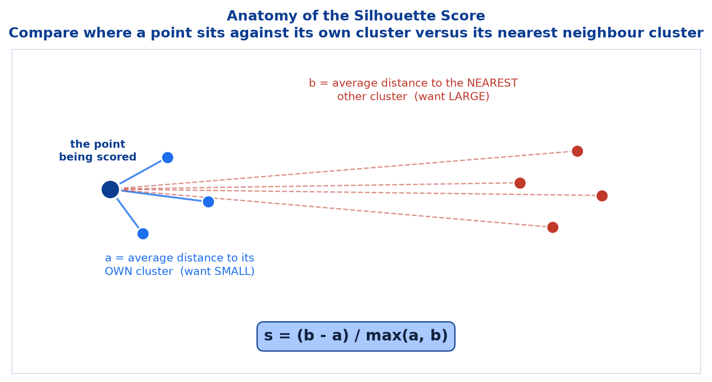
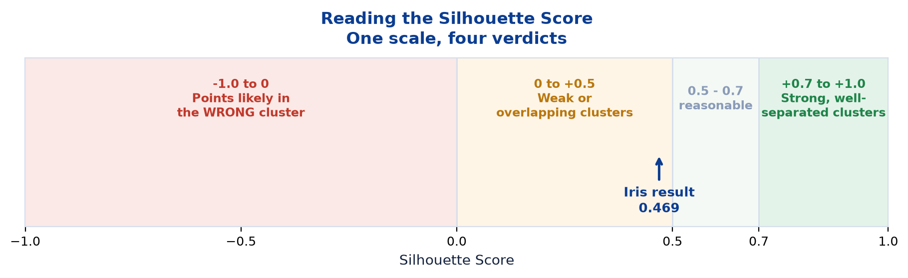
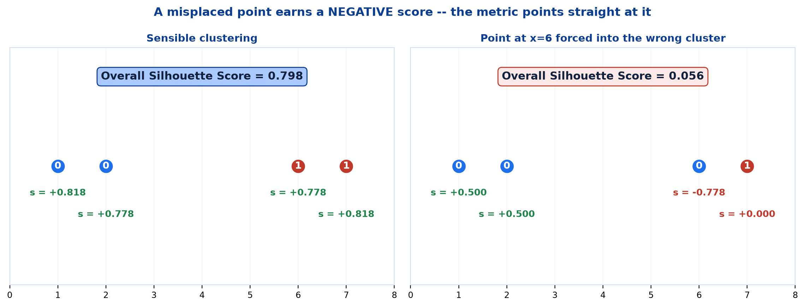
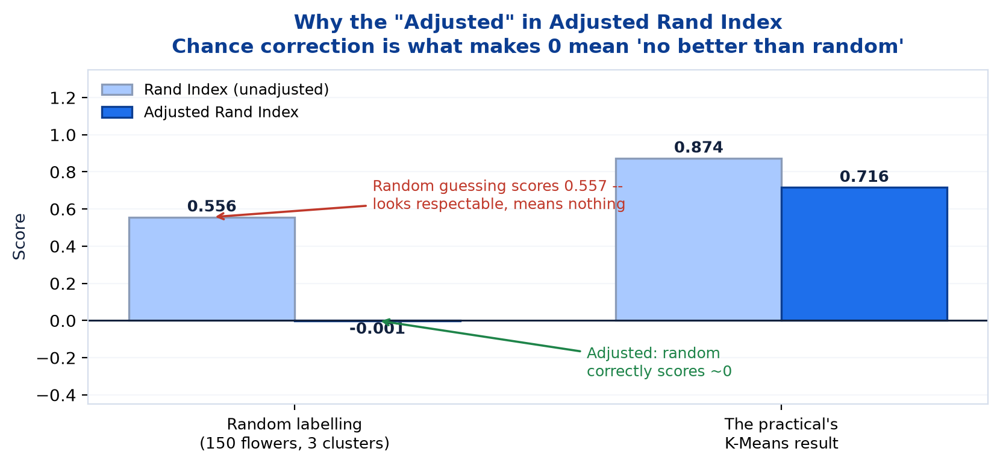
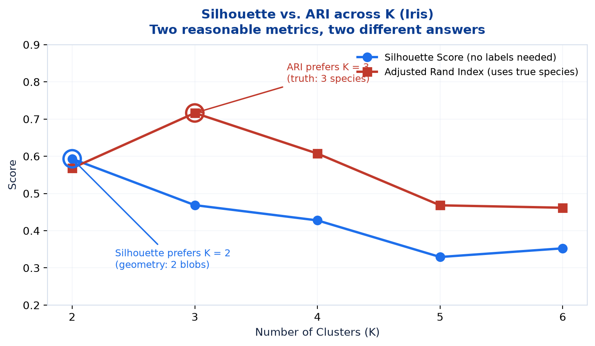
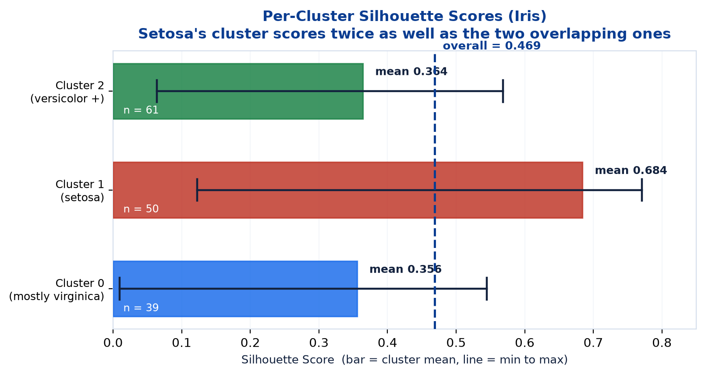

# <span style="color:#0B3D91">Clustering Evaluation Metrics</span>

> Study notes on judging a clustering when there is no answer key — the **Silhouette Score**, which needs no labels at all, and the **Adjusted Rand Index**, which needs them but is only ever available for validation. Plus what to do when the two metrics disagree, which on this course's own dataset they do.
> The note that stops you admiring clusters that are not really there.

> **A note on formulas:** equations are written in plain text inside code blocks rather than LaTeX, so they render correctly in any Markdown viewer.

> **Where this sits:** Note 03 quoted a Silhouette Score of 0.469 and an ARI of 0.72 without justifying either. This note pays that debt. Session I's accuracy, precision, recall and F1 all compared predictions against **known answers** — none of them work here, because there are no known answers.

---

## <span style="color:#1E6FEB">Table of Contents</span>

1. [Why Clustering Needs Different Metrics](#1-why-clustering-needs-different-metrics)
2. [The Silhouette Score — the Formula](#2-the-silhouette-score--the-formula)
3. [Reading the Silhouette Score](#3-reading-the-silhouette-score)
4. [A Worked Example You Can Check by Hand](#4-a-worked-example-you-can-check-by-hand)
5. [The Adjusted Rand Index (ARI)](#5-the-adjusted-rand-index-ari)
6. [Why "Adjusted"? Chance Correction](#6-why-adjusted-chance-correction)
7. [Silhouette vs. ARI — Which, and When](#7-silhouette-vs-ari--which-and-when)
8. [Practical 2 — Evaluating the Iris Clustering](#8-practical-2--evaluating-the-iris-clustering)

---

## <span style="color:#1E6FEB">1. Why Clustering Needs Different Metrics</span>

### 1.1 Overview / What is it?
> Without labels, how do we know if a clustering is any good?

Every metric from Session I — accuracy, precision, recall, F1, RMSE — works by comparing a **prediction** against a **known correct answer**. Remove the answer and every one of them becomes undefined.

### 1.2 Why does it matter for AI?
Note 03 §8.6 flagged the danger: **K-Means always returns K clusters, even from structureless data.** Hand it pure random noise with `K=4` and it returns four tidy groups with centroids and labels, reporting no error whatsoever.

Without an evaluation metric you have no way to tell that apart from a genuine discovery. **These metrics are the difference between finding structure and inventing it.**

### 1.3 Key Concepts — the two kinds of evaluation

| Type | Needs labels? | Measures | Example |
|---|---|---|---|
| **Internal** | **No** | Geometry of the clustering itself — are the groups tight and separated? | **Silhouette Score** |
| **External** | **Yes** | Agreement with a known ground truth | **Adjusted Rand Index** |

Only one of these is available in a real unsupervised problem. The slides are blunt about it:

> Unlike the Silhouette Score, ARI **needs true labels** — so it is only usable for **validation, never during real unsupervised training**.

### 1.4 Simple Example
Return to Note 03's Lego analogy. Somebody sorts 500 bricks into 5 piles. How do you judge the result?

```
INTERNAL  ("is this tidy?")      Are the bricks in each pile similar to each other,
                                 and different from the other piles?
                                 -> you can answer this WITHOUT knowing the "right" piles

EXTERNAL  ("is this correct?")   Does it match how the manufacturer categorises them?
                                 -> you need the manufacturer's catalogue to answer
```

The first question is always answerable. The second is only answerable when somebody hands you a catalogue — and in genuine unsupervised work, nobody does.

### 1.5 How it works — what "good" means without an answer key
Note 03 §2 defined a good clustering as **high intra-cluster similarity, low inter-cluster similarity**. Both halves are measurable from geometry alone:

```
Intra-cluster similarity high  ->  points are CLOSE to their own cluster-mates
Inter-cluster similarity low   ->  points are FAR from other clusters
```

The Silhouette Score is precisely these two distances, combined into one number. It is the definition from Note 03 turned into arithmetic.

### 1.6 Practical Example / Use Case
A subtlety worth flagging early: **WCSS cannot serve as the evaluation metric**, even though K-Means minimises it. Note 03 §6.5 showed why — WCSS always falls as K rises, hitting zero when every point is its own cluster. A metric that rewards you for adding clusters forever cannot tell you whether your clustering is any good.

The Silhouette Score has no such flaw, because it balances tightness **against** separation. Split a good cluster in two and tightness improves, but separation collapses — so the score drops. **That trade-off is exactly what makes it usable for choosing K.**

### 1.7 Key Takeaways
> - Accuracy, precision, recall and F1 all need **known answers** — unavailable in clustering.
> - **Internal metrics** (Silhouette) judge geometry and need **no labels**.
> - **External metrics** (ARI) need **ground truth** — validation only, never real training.
> - K-Means **always returns K clusters**, even from noise — metrics are your only defence.
> - **WCSS cannot evaluate a clustering**, because it always improves with more clusters.
> - Silhouette works because it balances **tightness against separation**.

---

## <span style="color:#1E6FEB">2. The Silhouette Score — the Formula</span>

### 2.1 Overview / What is it?
> For each point, the Silhouette Score compares how close it is to **its own cluster** versus **the nearest other cluster**.

```
s = (b - a) / max(a, b)
```

| Symbol | Meaning |
|---|---|
| **a** | Average distance to points in the **same** cluster |
| **b** | Average distance to points in the **nearest other** cluster |

### 2.2 Why does it matter for AI?
It turns "are these clusters any good?" into arithmetic that needs nothing but the data and the cluster assignments. No labels, no ground truth, no domain expert.

### 2.3 Key Concepts — what a and b represent



```
a  = "how well do I fit MY cluster?"        -> you want this SMALL
b  = "how far am I from the NEXT cluster?"  -> you want this LARGE
```

A well-placed point is close to its neighbours (small `a`) and far from everything else (large `b`). Feed that into the formula and `s` approaches +1.

### 2.4 Simple Example — the three cases
Substituting extreme values makes the behaviour obvious:

| Situation | a | b | s = (b − a) / max(a, b) | Verdict |
|---|---|---|---|---|
| Tight cluster, far from others | 1 | 10 | (10 − 1)/10 = **+0.90** | Excellent placement |
| Sitting on the boundary | 5 | 5 | (5 − 5)/5 = **0.00** | Could belong to either |
| Closer to another cluster | 8 | 2 | (2 − 8)/8 = **−0.75** | **Wrong cluster** |

That third row is the metric's most useful behaviour: **a negative score is an accusation.** It says the point is nearer to a different cluster's members than to its own — it has been misassigned.

### 2.5 How it works — the role of `max(a, b)`
The denominator is there purely to **normalise the result into the −1 to +1 range**, regardless of the units your features are measured in.

Without it you would get raw `b − a`, whose size depends entirely on whether you measured in centimetres or kilometres. Dividing by the larger of the two makes the score **scale-free** — a Silhouette Score of 0.7 means the same thing on any dataset, which is what makes the interpretation bands in section 3 possible at all.

### 2.6 Practical Example / Use Case
One quantity, two clusterings, one number each:

> **Key Takeaway** — Averaging the score across all points gives **one overall Silhouette Score** for the whole clustering, on the same −1 to 1 scale.

So the metric works at two levels, and both are useful:

- **Per point** — which specific observations are badly placed? (`silhouette_samples`)
- **Overall** — is this clustering good in aggregate? (`silhouette_score`)

The per-point view is the one people forget exists, and it is excellent for debugging. It tells you *where* the clustering struggles, not merely *that* it does.

### 2.7 Key Takeaways
> - `s = (b - a) / max(a, b)`, computed **per point**.
> - **a** = average distance to its own cluster (**want small**); **b** = average distance to the nearest other cluster (**want large**).
> - `max(a, b)` normalises the result to **−1 to +1**, making it **scale-free**.
> - **Negative s = the point is probably in the wrong cluster.**
> - **Average across all points** for one overall score on the same scale.
> - Available per-point (`silhouette_samples`) or overall (`silhouette_score`).

---

## <span style="color:#1E6FEB">3. Reading the Silhouette Score</span>

### 3.1 Overview / What is it?
The interpretation bands from slide 51.

### 3.2 Why does it matter for AI?
A number without a scale is useless. These bands are what turn 0.469 into a verdict.

### 3.3 Key Concepts — the bands



| Range | Interpretation |
|---|---|
| **+0.7 to +1.0** | **Strong, well-separated clusters** |
| **0 to +0.5** | **Weak or overlapping clusters** |
| **−1.0 to 0** | **Points likely in the wrong cluster** |

> **A gap in the slides' own scale.** The three bands listed leave **0.5 to 0.7** undefined. Reading the intent, that region is best treated as *"reasonable but not strong"* — clusters with real structure and some overlap. The slides simply do not label it; the figure above marks it in grey to be transparent about the gap rather than inventing a rule.

### 3.4 Simple Example — the practical's result
The Iris clustering from Note 03 scored **0.469**.

Look where that lands: the **0 to +0.5** band — *"weak or overlapping clusters."* It misses the undefined zone by 0.031.

**This is a more honest reading than the notebook's own.** Cell 81 describes it as "a high Silhouette Score", but on the course's own scale 0.469 is not high — it sits at the top of the *weak or overlapping* band. And as section 8 confirms, *overlapping* is exactly the right diagnosis: two of the three Iris species genuinely blur into each other.

### 3.5 How it works — what a middling score actually tells you
A score around 0.45–0.50 is not a failure. It usually means one of these:

| Possible cause | What to do |
|---|---|
| Clusters genuinely overlap in the data | Accept it — the data is what it is |
| Wrong K | Try the neighbouring values |
| Wrong algorithm (non-spherical shapes) | Consider DBSCAN or hierarchical |
| Features not scaled | Scale and re-run |

For Iris, it is the **first** reason. No amount of tuning will cleanly separate *versicolor* from *virginica*, because on these measurements they really do overlap. **The metric is reporting a fact about the flowers, not a flaw in the algorithm.**

### 3.6 Practical Example / Use Case
The bands also give you a **sanity threshold** for the noise problem from section 1.2. Cluster genuinely structureless data and the Silhouette Score typically lands near **0** — sometimes drifting slightly positive by luck, but never up in the 0.7 range.

```
Score near 0     ->  there is probably no real cluster structure here
Score 0.7+       ->  the groups are genuinely distinct
```

That is the check that saves you from presenting four beautiful clusters that are pure artefact.

### 3.7 Key Takeaways
> - **+0.7 to +1.0** = strong, well-separated. **0 to +0.5** = weak or overlapping. **−1.0 to 0** = wrong cluster.
> - The slides leave **0.5–0.7** undefined; treat it as *reasonable but not strong*.
> - Iris scored **0.469** — the **weak/overlapping** band, despite the notebook calling it "high".
> - A middling score may mean genuine overlap, wrong K, wrong algorithm, or unscaled features.
> - For Iris it is **genuine overlap** — a fact about the data.
> - A score near **0** is your warning that the clusters may not be real.

---

## <span style="color:#1E6FEB">4. A Worked Example You Can Check by Hand</span>

### 4.1 Overview / What is it?
Four points on a line, clustered sensibly and then clustered badly — small enough to verify with a calculator.

### 4.2 Why does it matter for AI?
Computing the metric by hand once removes all the mystery. After this, `silhouette_score()` is a convenience rather than a black box.

### 4.3 Key Concepts — the setup
Four points, all at height 1, so distances are simply differences along the x-axis:

```
Point A (1, 1)    Point B (2, 1)         Point C (6, 1)    Point D (7, 1)
   |-- cluster 0 --|                        |-- cluster 1 --|
```

### 4.4 Simple Example — the sensible clustering



**Point A at x=1**, in cluster 0 with B:

```
a = distance to own cluster-mates   = |1 - 2|                     = 1.0
b = average distance to cluster 1   = (|1 - 6| + |1 - 7|) / 2
                                    = (5 + 6) / 2                 = 5.5

s = (5.5 - 1.0) / max(1.0, 5.5) = 4.5 / 5.5 = +0.818
```

**Point B at x=2**, in cluster 0 with A:

```
a = |2 - 1|                         = 1.0
b = (|2 - 6| + |2 - 7|) / 2 = (4 + 5) / 2 = 4.5

s = (4.5 - 1.0) / 4.5 = 3.5 / 4.5 = +0.778
```

By symmetry C scores +0.778 and D scores +0.818.

```
Overall Silhouette Score = (0.818 + 0.778 + 0.778 + 0.818) / 4 = 0.798
```

**0.798 — comfortably in the "strong, well-separated" band.** Correct, for two tight pairs sitting far apart.

*(Verified against `sklearn.metrics.silhouette_samples`, which returns exactly `[0.8182, 0.7778, 0.7778, 0.8182]`.)*

### 4.5 How it works — now break it deliberately
Keep the identical points, but force **C (x=6) into cluster 0** where it clearly does not belong:

```
Cluster 0 = {A(1), B(2), C(6)}        Cluster 1 = {D(7)}
```

**Point C at x=6**, now stuck in cluster 0:

```
a = average distance to its NEW cluster-mates = (|6 - 1| + |6 - 2|) / 2
                                              = (5 + 4) / 2      = 4.5
b = average distance to cluster 1             = |6 - 7|          = 1.0

s = (1.0 - 4.5) / max(4.5, 1.0) = -3.5 / 4.5 = -0.778
```

**A strongly negative score.** The metric has detected the misassignment on its own: C is 4.5 away from its own cluster on average, but only 1.0 from the other one.

The full picture:

| Point | s (sensible) | s (C misassigned) |
|---|---|---|
| A (1) | +0.818 | +0.500 |
| B (2) | +0.778 | +0.500 |
| C (6) | +0.778 | **−0.778** |
| D (7) | +0.818 | 0.000 |
| **Overall** | **0.798** | **0.056** |

The overall score collapses from **0.798 to 0.056** — from "strong" to "barely better than meaningless" — because of one misplaced point out of four.

> **Note on point D:** it scores exactly **0** because it is now alone in its cluster. With no cluster-mates, `a` is undefined, and the convention is to assign a silhouette of 0 to any singleton. Worth knowing, because tiny clusters quietly drag the average toward zero.

### 4.6 Practical Example / Use Case
This is the per-point view earning its keep. An overall score of 0.056 tells you *something is wrong*. The per-point scores tell you **exactly which observation to look at** — the one scoring −0.778.

```python
from sklearn.metrics import silhouette_samples
scores = silhouette_samples(X, labels)
suspects = X[scores < 0]          # the points the metric is complaining about
```

On a real dataset this is genuinely how you debug a clustering, and it doubles as anomaly detection: points with negative silhouettes fit nowhere well.

### 4.7 Key Takeaways
> - Hand-computed: `s = (b - a) / max(a, b)` reproduces scikit-learn exactly.
> - Sensible clustering of 4 points → **0.798** (strong).
> - Forcing one point into the wrong cluster → that point scores **−0.778**, overall crashes to **0.056**.
> - **One bad point out of four** destroyed the overall score — the metric is sensitive.
> - A **singleton cluster** scores exactly **0** by convention.
> - Use **`silhouette_samples`** to find *which* points are misplaced.

---

## <span style="color:#1E6FEB">5. The Adjusted Rand Index (ARI)</span>

### 5.1 Overview / What is it?
> When **ground truth exists** (for teaching or validation), ARI measures how well the clusters found line up with the true labels.

### 5.2 Why does it matter for AI?
It answers a question the Silhouette Score cannot: *"did we find the **right** groups?"* Silhouette only reports whether the groups are **tidy**. Tidy and correct are not the same thing — you can produce a beautifully separated clustering that splits the data along an axis nobody cares about.

### 5.3 Key Concepts — the scale

| Value | Meaning |
|---|---|
| **1.0** | **Perfect match** with the true labels |
| **0** | **No better than random** labeling |
| **Negative** | **Worse than random** |

Range: **−1.0 to 1.0**.

The slides are emphatic about the constraint:

> - Unlike the Silhouette Score, **ARI needs true labels** — so it is only usable for **validation, never during real unsupervised training**.
> - A high ARI confirms the algorithm **rediscovered structure that matches reality** — a reassuring sanity check when learning clustering for the first time.
> - In real deployments **without true labels**, the **Silhouette Score** (or Elbow Method) is what you fall back on.

### 5.4 Simple Example — the problem ARI solves
Note 03 §2.6 raised this: **cluster numbers are arbitrary.** Suppose the truth is three species and K-Means produces a *perfect* grouping — but numbers them differently:

```
True labels:      setosa=0       versicolor=1   virginica=2
K-Means labels:   setosa=1       versicolor=2   virginica=0
```

Every flower is grouped **perfectly correctly**, yet plain accuracy would score this near **0%**, because label `0` never equals label `1`.

**ARI ignores the names entirely.** It works on *pairs of points*, asking a question that has nothing to do with labels:

```
For every PAIR of points:
    Did the true labels put them TOGETHER?
    Did the clustering put them TOGETHER?
    -> Agreement is what counts, not which number was used
```

Two flowers of the same species should land in the same cluster, whatever that cluster is called. That framing makes ARI **invariant to relabelling** — I verified this directly: permuting the cluster IDs on the practical's result leaves ARI at exactly **0.7163**.

### 5.5 How it works — the formula, worked on the real data
ARI is built from pair counts:

```
ARI = (observed agreements - expected by chance) / (maximum possible - expected by chance)
```

Using the practical's actual Iris crosstab:

| True species | Cluster 0 | Cluster 1 | Cluster 2 | Row total |
|---|---|---|---|---|
| setosa | 0 | 50 | 0 | 50 |
| versicolor | 3 | 0 | 47 | 50 |
| virginica | 36 | 0 | 14 | 50 |
| **Column total** | **39** | **50** | **61** | **150** |

Counting pairs with `C(n,2) = n(n-1)/2`:

```
Agreeing pairs (same cell)     = C(50,2) + C(3,2) + C(47,2) + C(36,2) + C(14,2)
                               = 1225 + 3 + 1081 + 630 + 91          = 3030

Pairs within true species      = 3 x C(50,2)                         = 3675
Pairs within found clusters    = C(39,2) + C(50,2) + C(61,2)         = 3796
Total possible pairs           = C(150,2)                            = 11175

Expected by chance = (3675 x 3796) / 11175                           = 1248.35
Maximum            = (3675 + 3796) / 2                               = 3735.5

ARI = (3030 - 1248.35) / (3735.5 - 1248.35)
    = 1781.65 / 2487.15
    = 0.716
```

**Exactly the 0.72 the notebook reports.** *(Confirmed against `sklearn.metrics.adjusted_rand_score`: 0.7163.)*

### 5.6 Practical Example / Use Case
Where ARI genuinely earns its place in professional work:

- **Teaching and learning** — exactly this course's use: check that clustering does something sensible on data where the answer is known.
- **Algorithm selection** — you have labels for a small subset; use ARI to pick between K-Means, DBSCAN and hierarchical, then deploy the winner on the unlabelled bulk.
- **Monitoring drift** — re-run on a labelled sample periodically; a falling ARI suggests the structure has shifted.

What ARI is **not** for: everyday unsupervised work. If you had labels for everything, you would be training a classifier instead.

### 5.7 Key Takeaways
> - **ARI** measures agreement between discovered clusters and **known true labels**.
> - Scale: **1.0** = perfect, **0** = random, **negative** = worse than random.
> - Works on **pairs of points**, so it is **immune to cluster relabelling** — verified at 0.7163 either way.
> - Iris: **ARI = 0.716**, reproduced by hand from the crosstab.
> - Needs ground truth → **validation only, never real unsupervised training**.
> - Without labels, fall back to **Silhouette** or the **Elbow Method**.

---

## <span style="color:#1E6FEB">6. Why "Adjusted"? Chance Correction</span>

### 6.1 Overview / What is it?
There is a plain **Rand Index** too. The "Adjusted" version subtracts the agreement you would expect from **pure luck**.

### 6.2 Why does it matter for AI?
Because random guessing scores surprisingly well on the unadjusted version, and a metric that flatters nonsense is worse than no metric at all.

### 6.3 Key Concepts — the numbers



I generated random cluster labels for the 150 Iris flowers (3 clusters, averaged over 200 runs) and scored them both ways:

| | Random labelling | The practical's K-Means |
|---|---|---|
| **Rand Index** (unadjusted) | **0.557** | 0.874 |
| **Adjusted Rand Index** | **−0.001** | **0.716** |

**Random guessing scores 0.557 on the raw Rand Index.** Presented on its own, that looks like a respectable, more-than-half-correct result. It means nothing whatsoever.

The Adjusted version puts random at **−0.001 ≈ 0**, which is the honest answer.

### 6.4 Simple Example — why raw agreement is inflated
The Rand Index counts **pairs the two labellings agree about** — both "together" or both "apart". The catch: with 3 clusters and 150 points, the overwhelming majority of the 11,175 pairs are "apart" in *both* labellings, purely because most random pairs of flowers are different species and land in different clusters.

```
Most pairs are "apart / apart"  ->  counted as AGREEMENT
                                ->  the score is inflated before you do anything clever
```

Chance correction subtracts that freebie. Recall the formula's shape:

```
ARI = (observed - EXPECTED BY CHANCE) / (maximum - EXPECTED BY CHANCE)
                  ^^^^^^^^^^^^^^^^^^
                  this term is the entire point
```

Set observed = expected and you get exactly 0. **That is what makes "0 = no better than random" literally true** rather than a rough guideline.

### 6.5 How it works — the general lesson
This is the same trap as the **accuracy paradox** from Session I. A 99%-accurate model on a dataset with 99% negatives has learned nothing — it just always says "no". Both cases share one lesson:

> **Always ask what score a trivial baseline would get.** A number is only impressive relative to the alternative of doing nothing.

ARI bakes that baseline into the metric, which is why it should always be preferred over the raw Rand Index.

### 6.6 Practical Example / Use Case
Note that **0.874 vs 0.716** for the real clustering — the raw Rand Index flatters good results too, not just random ones. If you see a suspiciously high clustering agreement quoted somewhere, check which index it is. In scikit-learn:

```python
from sklearn.metrics import adjusted_rand_score, rand_score

adjusted_rand_score(y_true, labels)   # 0.716  <- use this one
rand_score(y_true, labels)            # 0.874  <- flattering, avoid
```

### 6.7 Key Takeaways
> - The raw **Rand Index** gives random labellings **0.557** — badly misleading.
> - **ARI** corrects for chance, scoring random at **≈ 0** (measured: −0.001).
> - Most pairs are "apart in both labellings", which inflates raw agreement for free.
> - Chance correction is what makes **"0 = no better than random"** literally true.
> - Same lesson as the **accuracy paradox**: always ask what a trivial baseline scores.
> - Use **`adjusted_rand_score`**, not `rand_score`.

---

## <span style="color:#1E6FEB">7. Silhouette vs. ARI — Which, and When</span>

### 7.1 Overview / What is it?
The two metrics side by side, and what to do when they disagree.

### 7.2 Why does it matter for AI?
On this course's own dataset **they do disagree**, and understanding why is more instructive than either metric alone.

### 7.3 Key Concepts — the comparison

| | Silhouette Score | Adjusted Rand Index |
|---|---|---|
| **Needs labels?** | **No** | **Yes** |
| **Measures** | Geometry: tightness and separation | Agreement with ground truth |
| **Range** | −1 to +1 | −1 to +1 |
| **Type** | Internal | External |
| **Available in production?** | **Yes** | Almost never |
| **Answers** | *"Are these clusters tidy?"* | *"Are these clusters right?"* |
| **Iris result** | 0.469 | 0.716 |

### 7.4 Simple Example — the disagreement



Note 03 §7.6 flagged that the elbow said K=3 while silhouette preferred K=2. Now we can add the metric that actually knows the answer:

| K | Silhouette | ARI |
|---|---|---|
| **2** | **0.593** ← highest | 0.568 |
| **3** | 0.469 | **0.716** ← highest |
| 4 | 0.428 | 0.607 |
| 5 | 0.329 | 0.468 |
| 6 | 0.353 | 0.462 |

**Silhouette peaks at K=2. ARI peaks at K=3.**

This is the most informative table in the note. The two metrics are answering **different questions**, and both answer correctly:

- **Silhouette (geometry only):** "Looking purely at distances, I see **two** blobs." Perfectly true — *versicolor* and *virginica* overlap so heavily that geometrically they form one mass.
- **ARI (knows the truth):** "There are **three** species, and K=3 recovers them best." Also true.

**ARI vindicates the elbow.** Note 03 chose K=3 on domain knowledge, against the silhouette's preference — and the metric with access to ground truth confirms that was the right call.

### 7.5 How it works — the honest implication
Here is the uncomfortable part. In a **real** unsupervised problem you would not have the ARI column. You would have only the silhouette, and it would have told you **K=2**.

```
What you'd have in production:  silhouette says K = 2
What is actually true:          there are 3 species
```

**The available metric would have pointed you at the wrong answer.** Not because it is broken — because geometry genuinely cannot see a distinction that overlapping measurements do not contain.

This is the honest limit of unsupervised learning, and it is why slide 48's advice to **use domain knowledge** is not a throwaway line. It is often the only thing standing between you and a defensible-but-wrong K.

### 7.6 Practical Example / Use Case — a decision guide

| Situation | Use |
|---|---|
| Real unsupervised problem, no labels at all | **Silhouette** (+ Elbow + domain knowledge) |
| Teaching / learning on a known dataset | **Both** — compare them |
| You have labels for a small sample | **ARI** on the sample to choose the algorithm |
| You have labels for everything | **Stop clustering** — train a classifier instead |

That last row deserves saying plainly. If full ground truth exists, clustering is the wrong tool. Supervised learning will use those labels far more effectively than any unsupervised algorithm can.

### 7.7 Key Takeaways
> - **Silhouette** = internal, no labels, measures **tidiness**. **ARI** = external, needs labels, measures **correctness**.
> - On Iris they **disagree**: silhouette peaks at **K=2**, ARI peaks at **K=3**.
> - Both are right — they answer **different questions**.
> - **ARI confirms K=3 was correct**, vindicating the elbow and domain knowledge over silhouette.
> - In production you would only have the silhouette — **which would have misled you here**.
> - **Domain knowledge is not optional** in unsupervised work.
> - If you have labels for everything, **train a classifier instead**.

---

## <span style="color:#1E6FEB">8. Practical 2 — Evaluating the Iris Clustering</span>

### 8.1 Overview / What is it?
The evaluation half of Part 3 of the notebook — the code, the outputs, and what they reveal.

### 8.2 Why does it matter for AI?
Two lines of code produce both numbers. Interpreting them correctly is the skill.

### 8.3 Key Concepts — the code

```python
from sklearn.metrics import silhouette_score, adjusted_rand_score

overall_silhouette = silhouette_score(X_iris_scaled, cluster_labels)
agreement_score = adjusted_rand_score(y_iris_true, cluster_labels)
```

```
Silhouette Score: 0.469 (range: -1 to 1, higher is better)
Adjusted Rand Index vs. true species: 0.72
```

Note the arguments carefully — they reveal the whole distinction:

| Metric | Arguments | What this tells you |
|---|---|---|
| `silhouette_score` | **the data** + cluster labels | Needs the **points**, to measure distances |
| `adjusted_rand_score` | **true labels** + cluster labels | Never sees the data at all — only compares **labellings** |

`silhouette_score` cannot work without the feature matrix. `adjusted_rand_score` cannot work without the truth. That difference in signature *is* the internal/external distinction, made concrete.

### 8.4 Simple Example — the per-cluster breakdown
The overall 0.469 hides an important detail. Breaking it down by cluster:



| Cluster | n | Mean silhouette | Range | Mostly contains |
|---|---|---|---|---|
| **0** | 39 | **0.356** | 0.010 to 0.545 | virginica |
| **1** | 50 | **0.684** | 0.123 to 0.771 | **setosa** |
| **2** | 61 | **0.364** | 0.064 to 0.568 | versicolor (+ 14 virginica) |

**Cluster 1 scores nearly twice as well as the other two.** That is *setosa* — the species Note 03's crosstab showed separating perfectly (50/50, no contamination). Its 0.684 sits just below the "strong" threshold.

Clusters 0 and 2 score ~0.36 each, squarely in the "weak or overlapping" band. These are *virginica* and *versicolor* — exactly the two that bleed into each other.

**The overall 0.469 is an average of one good cluster and two mediocre ones.** A single headline number concealed that; the breakdown exposes it immediately.

### 8.5 How it works — a clean result worth noting
Checking every point individually:

```
Total points with a NEGATIVE silhouette: 0 of 150
```

**Not one flower is badly misassigned.** Despite 14 virginica landing in the versicolor cluster (Note 03 §10.5), none of them scores negative — they sit in the overlap zone, closer to their assigned cluster than to any other, just not by much. Their low positive scores (some as low as 0.010) say *"borderline"*, not *"wrong"*.

This is a genuinely useful distinction the crosstab alone could not make. The 14 "misclassified" flowers are not errors — they are flowers whose measurements genuinely resemble the other species.

### 8.6 Practical Example / Use Case — reading both together
The notebook's summary:

> Both a high Silhouette Score and a high ARI here tell the same story from two different angles: Silhouette confirms the clusters are internally tight and well separated using only the data itself; ARI confirms that structure actually matches the real species.

**Half right.** The ARI half is fair — 0.716 is a genuinely strong agreement. The silhouette half overstates it: 0.469 is *not* "internally tight and well separated", it is the weak/overlapping band, and the per-cluster breakdown shows precisely why.

A more accurate reading of the pair:

```
ARI 0.716         ->  the structure found is REAL and matches the species
Silhouette 0.469  ->  but the clusters are NOT cleanly separated
                      (because two species genuinely overlap)
```

**Both facts are true at once**, and that combination is informative: *we found the right groups, but the groups themselves are fuzzy.* Neither metric alone would have told you that.

### 8.7 Key Takeaways
> - `silhouette_score(data, labels)` needs the **points**; `adjusted_rand_score(truth, labels)` needs the **truth**.
> - Iris: **Silhouette 0.469**, **ARI 0.716**.
> - Per cluster: setosa's cluster scores **0.684**; the two overlapping ones score **~0.36**.
> - The headline average **hid** that one cluster is good and two are mediocre — always break it down.
> - **Zero points scored negative** — nothing is badly misassigned, the 14 strays are merely borderline.
> - Combined reading: **the structure is real (ARI), but the boundaries are fuzzy (Silhouette).**

---

## <span style="color:#1E6FEB">Summary — Clustering Metrics at a Glance</span>

| Question | Silhouette Score | Adjusted Rand Index |
|---|---|---|
| **Formula** | `s = (b - a) / max(a, b)` | `(observed - expected) / (max - expected)` |
| **Needs labels?** | **No** | **Yes** |
| **Range** | −1 to +1 | −1 to +1 |
| **What is "good"?** | +0.7 and above | Close to 1.0 |
| **What is "random"?** | ~0 | Exactly 0 |
| **Usable in production?** | **Yes** | Almost never |
| **Per-point version?** | **Yes** (`silhouette_samples`) | No |
| **Iris result** | 0.469 (weak/overlapping) | 0.716 (strong agreement) |
| **Prefers on Iris** | K = 2 | K = 3 |

**The one-sentence version:** the Silhouette Score asks *"are these clusters tidy?"* and needs nothing but the data; the Adjusted Rand Index asks *"are these clusters right?"* and needs an answer key you usually will not have.

**The lesson the Iris disagreement teaches:** unsupervised learning has no umpire. Two reasonable metrics gave two different answers about K, and only domain knowledge — knowing there are three species — resolved it. Expect that, rather than being surprised by it.

**Where this leads:** every model so far has been handed its features as given, apart from two engineered columns that appeared without explanation in the Wine and Iris pipelines (`alcohol_flavanoid_ratio`, `petal_area`, and friends). **Note 05** explains where those came from and how to build them deliberately.

---

> **Navigation:** ← Previous: [03 — Clustering &amp; K-Means](03_Machine_Learning_Clustering_And_KMeans.md) · Next → 05 — Feature Engineering
>
> **Related:** [Model Evaluation Metrics (Session I)](../../machine_learning_01/notes/03_Machine_Learning_Model_Evaluation_Metrics.md) covers the supervised metrics — accuracy, precision, recall, F1 — and the accuracy paradox referenced in section 6.5.
