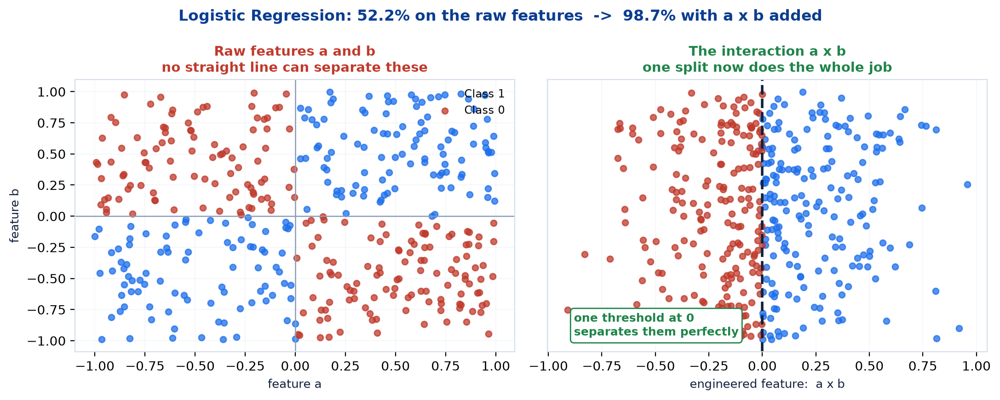
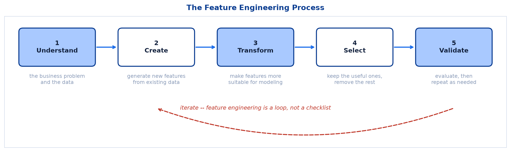
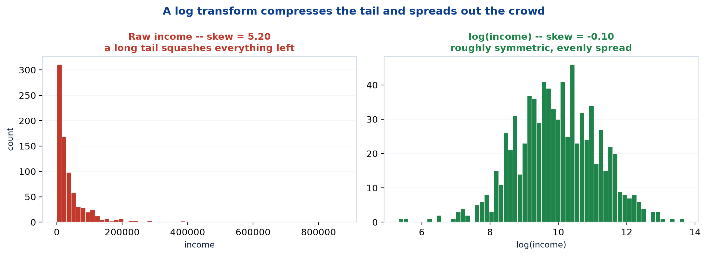
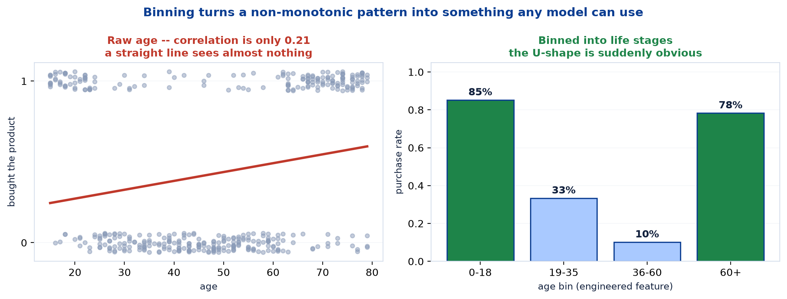
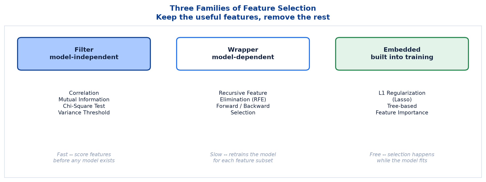
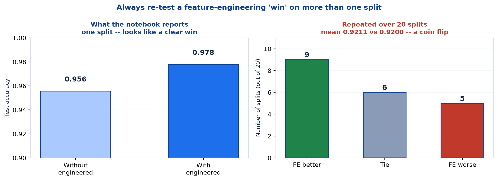

# <span style="color:#0B3D91">Feature Engineering</span>

> Study notes on improving the **inputs** rather than the algorithm — creating, transforming and selecting features; the five-step process; interactions, binning, log transforms and encoding; the three families of feature selection; and the best practices that keep you out of trouble, data leakage chief among them.
> The part of machine learning where domain knowledge beats cleverness, and where the biggest wins usually hide.

> **A note on formulas:** equations are written in plain text inside code blocks rather than LaTeX, so they render correctly in any Markdown viewer.

> **Where this sits:** engineered features have been quietly appearing since Note 01 — `alcohol_flavanoid_ratio` in the Wine pipeline, `petal_area` and `sepal_ratio` in the Iris pipeline — with no explanation of where they came from. This note is the explanation.

---

## <span style="color:#1E6FEB">Table of Contents</span>

1. [What Is Feature Engineering?](#1-what-is-feature-engineering)
2. [The Feature Engineering Process](#2-the-feature-engineering-process)
3. [Common Techniques](#3-common-techniques)
4. [Examples: Creating, Transforming, Encoding, Binning](#4-examples-creating-transforming-encoding-binning)
5. [Feature Selection](#5-feature-selection)
6. [Best Practices &amp; Data Leakage](#6-best-practices--data-leakage)
7. [Practical 3 — Does Feature Engineering Actually Help?](#7-practical-3--does-feature-engineering-actually-help)

---

## <span style="color:#1E6FEB">1. What Is Feature Engineering?</span>

### 1.1 Overview / What is it?
> The process of **creating, transforming, and selecting** input features from raw data to improve model performance.

Three verbs, three activities:

| Verb | What it means |
|---|---|
| **Creating** | Build new columns from existing ones — `total_spend = quantity × unit_price` |
| **Transforming** | Change a column's scale or distribution — `log(income)`, `StandardScaler` |
| **Selecting** | Keep the useful columns and drop the rest |

### 1.2 Why does it matter for AI?
Everything so far in this module has improved the **model** — deeper trees, more trees, better K. Feature engineering improves the **data**, and that is frequently where the larger gains live.

> **Key Takeaway** — *"Garbage in, garbage out"* — great features, great models out!

The five benefits from slide 55:

| Benefit | Detail |
|---|---|
| **Improves Performance** | Better features lead to higher accuracy and lower error |
| **Captures Hidden Patterns** | Helps models learn complex relationships more easily |
| **Reduces Training Time** | Well-engineered features simplify the problem |
| **Improves Interpretability** | Meaningful features make the model easier to trust |
| **Handles Real-World Complexity** | Converts messy, raw data into useful ML input |

### 1.3 Key Concepts — why a model cannot do this itself
A fair question: if `a × b` is predictive, why can't the algorithm work that out?

Because most algorithms can only combine features in the ways their structure permits. Linear Regression can only add weighted features together — it has **no mechanism** to multiply two of them. A Decision Tree can only split one feature at a time, so representing `a × b` requires a deep staircase of approximating splits.

```
What Logistic Regression can express:   w1*a + w2*b + intercept
What it CANNOT express:                 a * b

...unless you hand it a*b as a column. Then it can.
```

**Feature engineering hands the model a shortcut it could not have taken itself.**

### 1.4 Simple Example — an interaction the model cannot see



I generated 600 points where the class depends on whether `a × b` is positive — the classic XOR pattern:

- **Left panel:** the raw features. Class 1 occupies the top-right and bottom-left quadrants; Class 0 the other two. **No straight line can separate them.**
- **Right panel:** the same data plotted against the engineered `a × b`. A single threshold at zero separates them perfectly.

The measured effect on 5-fold cross-validated accuracy:

| Model | Raw `a`, `b` | With `a × b` added | Gain |
|---|---|---|---|
| **Logistic Regression** | 0.522 | **0.987** | **+0.465** |
| Decision Tree (depth 3) | 0.948 | **0.997** | +0.048 |

**Logistic Regression goes from coin-flip to near-perfect.** Not one line of the algorithm changed — only the columns it was given.

Note the Decision Tree gains far less. It was already at 0.948, because a tree *can* approximate an interaction by stacking splits. **The benefit of a given feature depends on which model you are using** — a theme that returns in section 7.

### 1.5 How it works — the honest caveat
Feature engineering is not magic, and this note will be blunt about that in section 7. Adding columns can just as easily do nothing at all. The discipline lies in **measuring** whether a new feature helped, not in assuming it did.

### 1.6 Practical Example / Use Case
Where the biggest real-world wins come from — and none of them are algorithmic:

- **Dates → `day_of_week`, `is_weekend`, `is_holiday`.** A raw timestamp is nearly useless; "Saturday" is highly predictive for retail.
- **Raw transactions → `spend_last_30_days`, `days_since_last_order`.** Aggregations that describe behaviour rather than events.
- **Latitude/longitude → `distance_to_city_centre`.** Two coordinates a model struggles with become one number that obviously matters.

Each requires knowing something about the **problem**, which no algorithm can supply for you.

### 1.7 Key Takeaways
> - **Feature engineering** = **creating**, **transforming**, and **selecting** input features.
> - It improves the **data**, not the model — often where the larger gains are.
> - *"Garbage in, garbage out"* — models cannot rescue poor inputs.
> - Models **cannot invent** combinations their structure does not permit (Linear Regression cannot multiply).
> - Measured: adding `a × b` took Logistic Regression from **0.522 → 0.987**.
> - The same feature helps different models by **different amounts**.
> - The biggest real-world wins come from **domain knowledge**, not algorithms.

---

## <span style="color:#1E6FEB">2. The Feature Engineering Process</span>

### 2.1 Overview / What is it?
Five steps, and crucially a **loop** rather than a checklist.



| Step | What happens |
|---|---|
| **1. Understand** | Understand the business problem and explore the data |
| **2. Create Features** | Generate new features from existing data |
| **3. Transform** | Make features more suitable for modeling |
| **4. Select Features** | Keep the most useful features and remove the rest |
| **5. Validate & Iterate** | Evaluate performance and repeat as needed |

### 2.2 Why does it matter for AI?
Step 1 comes first for a reason. Creating features before understanding the problem produces a pile of plausible-looking columns that predict nothing.

> **Key Takeaway** — Good features capture the **true signal** in data, make patterns easier to learn, and improve model performance, generalization, and interpretability.

### 2.3 Key Concepts — the loop
Note the dashed arrow in the figure, running from **Validate** back to **Create**. That is the real shape of the work:

```
Create a feature  ->  test it  ->  it didn't help  ->  try a different one
                                   it helped       ->  keep it, try another
```

Most engineered features **do not help**. That is normal and expected. The process is empirical: propose, measure, discard, repeat.

### 2.4 Simple Example — the process on the Wine data
How the notebook's features would have come about:

```
1. UNDERSTAND  Wine cultivars differ in chemistry. Alcohol and flavanoids
               are both meaningful; perhaps their BALANCE matters more
               than either alone.

2. CREATE      alcohol_flavanoid_ratio = alcohol / flavanoids

3. TRANSFORM   (nothing needed -- trees don't require scaling)

4. SELECT      keep it if it earns its place

5. VALIDATE    measure accuracy with and without it   <- section 7 does exactly this
```

### 2.5 How it works — where each step lands in practice

| Step | Typical tools |
|---|---|
| Understand | Plots, `.describe()`, correlation matrices, talking to domain experts |
| Create | `df["new"] = ...`, aggregations, date parsing |
| Transform | `log`, `sqrt`, `StandardScaler`, encoding |
| Select | Correlation filters, feature importance, RFE (section 5) |
| Validate | **Cross-validation** — never a single split |

That last row is the one people skip, and section 7 shows exactly what it costs.

### 2.6 Practical Example / Use Case
A warning about step 2 that section 5 will formalise: **creating features is cheap, and that is a trap.** Generate 200 ratios and products of your columns and some will look predictive **by pure chance** — particularly on a small dataset. Steps 4 and 5 exist to catch precisely that.

### 2.7 Key Takeaways
> - Five steps: **Understand → Create → Transform → Select → Validate & Iterate**.
> - It is a **loop**, not a checklist — most features fail and get discarded.
> - **Understand comes first** — features built without domain insight rarely work.
> - Good features capture the **true signal** and improve generalization.
> - **Validate with cross-validation**, never a single split.
> - Creating features is cheap; some will look predictive **by chance**.

---

## <span style="color:#1E6FEB">3. Common Techniques</span>

### 3.1 Overview / What is it?
The five technique families from slide 57.

| Technique | Examples |
|---|---|
| **Mathematical Transforms** | `log`, `exp`, `sqrt`, `power`, `abs` |
| **Interactions** | Combine features to capture interactions (`A × B`, `A / B`, etc.) |
| **Aggregations** | Aggregate over groups or time (`sum`, `mean`, `max`, `count`) |
| **Polynomial Features** | Capture non-linear relationships (`x²`, `x³`, `x·y`, …) |
| **Text Features** | Length, word count, TF-IDF, n-grams, sentiment |

### 3.2 Why does it matter for AI?
Each family targets a different problem: transforms fix **distributions**, interactions capture **combined effects**, aggregations summarise **many rows into one**, polynomials capture **curvature**, and text features turn **words into numbers**.

### 3.3 Key Concepts — mathematical transforms



The **log transform** is the most common, and it exists to tame **skew**. I generated 800 incomes from a realistic log-normal distribution:

| | Skew |
|---|---|
| Raw `income` | **3.75** — a long right tail, most values squashed at the left |
| `log(income)` | **−0.05** — near-perfectly symmetric |

Income, house prices, city populations and website visits are all heavily skewed. A handful of enormous values dominate the scale, leaving everything else compressed into a narrow band.

**Where this matters — and where it does not:**

- **Distance-based models (KNN, K-Means) and linear models:** a log transform helps substantially, because those huge values would otherwise dominate every distance and coefficient.
- **Tree-based models:** it makes **no difference at all**. A tree asks *"is income > 50,000?"* and `log` is a monotonic transform — it preserves ordering, so the same split exists either way.

I confirmed this: on my synthetic income data, Logistic Regression scored **0.9967 both raw and logged**, because the task was easy enough either way. **Transforms are not automatic wins** — they help when the distribution is actively causing a problem.

### 3.4 Simple Example — interactions and polynomials
Two closely related ideas:

```
INTERACTION:   combine DIFFERENT features        ->  a * b,  price / weight
POLYNOMIAL:    raise the SAME feature to powers  ->  x^2, x^3  (plus interactions)
```

Section 1.4 already showed an interaction rescuing Logistic Regression. **Polynomial features** do the same for curvature: if the true relationship bends, adding `x²` lets a linear model fit a parabola.

**The cost is combinatorial.** Generating degree-2 polynomial features for 15 columns produces 135 features; degree-3 pushes past 800. Most will be noise, and each one is another chance to overfit. Use sparingly.

### 3.5 How it works — aggregations
The family that matters most in real business data, and the one this course's tidy datasets never need.

Raw data often arrives as **one row per event** — a transaction, a click, a sensor reading. Models usually need **one row per entity** — per customer, per product. Aggregation bridges that gap:

```
Raw:        10,000 transaction rows
Aggregated: 500 customer rows, each with
                total_spend, avg_order_value, order_count,
                days_since_last_order, distinct_categories
```

**Those aggregate columns are almost always more predictive than any single transaction**, and building them is where most real feature-engineering effort goes.

### 3.6 Practical Example / Use Case — text features
> **Scope note:** the slides list text features (length, word count, TF-IDF, n-grams, sentiment) but do not teach them, and the notebook has no text data. They are named here for completeness only.

The general principle is the useful part: **models need numbers, so text must be converted.** The simplest conversions are often surprisingly effective — the character length of a support ticket, or its word count, can predict escalation without any language understanding at all.

### 3.7 Key Takeaways
> - Five families: **mathematical transforms, interactions, aggregations, polynomial features, text features**.
> - **Log transform** tames skew — measured: income skew **3.75 → −0.05**.
> - Transforms help **linear and distance-based** models; they are **irrelevant to trees** (monotonic).
> - **Interactions** combine different features; **polynomials** raise one feature to powers.
> - Polynomial expansion is **combinatorial** — 15 features → 135 at degree 2. Use sparingly.
> - **Aggregations** turn many event rows into one entity row — the biggest real-world win.
> - Text features are **listed but not taught** in this course.

---

## <span style="color:#1E6FEB">4. Examples: Creating, Transforming, Encoding, Binning</span>

### 4.1 Overview / What is it?
The concrete examples table from slide 58.

| Type | Description | Example |
|---|---|---|
| **Creating New Features** | Combine or extract new information from existing features | `total_spend = quantity × unit_price` |
| **Transforming Features** | Change the scale or distribution of features | `log(income)`, `√age`, `StandardScaler` |
| **Encoding Categorical Features** | Convert categories into numerical representation | One-Hot Encoding, Label Encoding |
| **Binning (Discretization)** | Convert continuous variables into bins | `age → [0-18], [19-35], [36-60], [60+]` |
| **Date/Time Features** | Extract meaningful information from dates | From `'2024-05-20'`: year, month, day_of_week |

### 4.2 Why does it matter for AI?
These five cover the overwhelming majority of feature engineering you will actually do.

### 4.3 Key Concepts — encoding, already met
Note 01 §8.6 covered this without naming it as feature engineering. The rule:

| Situation | Encoding | Why |
|---|---|---|
| **Two categories** (Humidity, Windy) | Map to **0/1** | One column suffices |
| **3+ categories, no order** (Outlook) | **One-Hot** | Sunny/Overcast/Rainy — none is "bigger" |
| **3+ categories, with order** (small/medium/large) | **Label/Ordinal** | The ordering is real information |

**The trap in Label Encoding:** mapping Sunny=0, Overcast=1, Rainy=2 tells the model that Rainy > Overcast > Sunny, and that Overcast is exactly halfway between. For unordered categories that is **fabricated information**, and a linear model will happily act on it. One-hot avoids the problem by giving each category its own independent column.

### 4.4 Simple Example — binning, and why it works



Binning converts a continuous variable into categories, which sounds like **throwing information away**. Sometimes that is exactly right.

I generated 400 customers where teenagers and retirees buy a product but the middle-aged do not — a genuine U-shaped relationship:

```
Correlation between age and purchase:  0.21     <- looks almost useless
```

A linear model would nearly give up here. But bin the same data:

| Age bin | Purchase rate | n |
|---|---|---|
| **0-18** | **85.2%** | 27 |
| 19-35 | 33.3% | 96 |
| 36-60 | **10.1%** | 148 |
| **60+** | **78.3%** | 129 |

**The pattern is overwhelming once binned.** A 0.21 correlation concealed an 8× difference in purchase rate between age groups.

**Why:** correlation measures only *straight-line* relationships. The pattern here is **non-monotonic** — it goes down, then up — so the linear view averages it into near-nothing. Binning frees each group to have its own rate.

**When to bin:**

| Bin when | Do not bin when |
|---|---|
| The relationship is **non-monotonic** (U-shaped) | The relationship is smooth and monotonic |
| Domain categories genuinely exist ("child / adult / senior") | You would be inventing arbitrary cutoffs |
| You want robustness to outliers | Precision within the range matters |

### 4.5 How it works — date/time features
Dates are the most under-used feature source. A raw timestamp is nearly useless to a model; what it **contains** is highly predictive:

```
From '2024-05-20':
    year         = 2024
    month        = 5
    day_of_week  = Monday
    is_weekend   = False
    quarter      = Q2
    days_since_signup = 431      <- often the most predictive of all
```

**Why it matters:** raw dates keep increasing forever, so a model trained on 2024 dates has never seen a 2025 date and cannot extrapolate. But "Monday" and "December" **recur** — the model has seen hundreds of each and can learn their patterns.

### 4.6 Practical Example / Use Case — the notebook's own features
Now we can classify the mystery columns that have been appearing since Note 01:

| Feature | Formula | Type | Purpose |
|---|---|---|---|
| `alcohol_flavanoid_ratio` | `alcohol / flavanoids` | **Interaction** (ratio) | The **balance** between alcohol strength and antioxidants |
| `color_hue_interaction` | `color_intensity × hue` | **Interaction** (product) | Two visual properties combined into one signal |
| `petal_area` | `petal length × petal width` | **Interaction** (product) | A proxy for overall **petal size** |
| `sepal_ratio` | `sepal length / sepal width` | **Interaction** (ratio) | Sepal **shape, independent of size** |

Note the recurring **ratio vs product** distinction, which is genuinely useful to internalise:

```
PRODUCT (a x b)  ->  captures SIZE / magnitude   (petal_area: big petals score high)
RATIO   (a / b)  ->  captures SHAPE / balance    (sepal_ratio: long-thin vs short-wide)
```

`sepal_ratio` is the cleverest of the four. A large flower and a small flower with the **same proportions** get the same value — it isolates shape from size entirely.

### 4.7 Key Takeaways
> - Five example types: **creating, transforming, encoding, binning, date/time**.
> - **One-hot** for unordered categories; **label encoding** fabricates an ordering that may not exist.
> - **Binning** helps when relationships are **non-monotonic** — measured: correlation 0.21 hid an 8× difference.
> - Don't bin smooth monotonic relationships or invent arbitrary cutoffs.
> - **Date features** work because Monday and December **recur**; raw dates never repeat.
> - **Products capture size; ratios capture shape** — `petal_area` vs `sepal_ratio`.

---

## <span style="color:#1E6FEB">5. Feature Selection</span>

### 5.1 Overview / What is it?
Step 4 of the process — *"keep the most useful features and remove the rest."* Three families of method (slide 59).



### 5.2 Why does it matter for AI?
More features is not better. Each extra column adds noise, training time, and another opportunity to overfit — especially with few rows. **Removing features can improve a model**, which Note 02 §9.5 already demonstrated.

### 5.3 Key Concepts — the three families

| Family | How it works | Methods |
|---|---|---|
| **Filter** (model-independent) | Score each feature against the target **before any model exists** | Correlation, Mutual Information, Chi-Square Test, Variance Threshold |
| **Wrapper** (model-dependent) | Repeatedly **train the model** on different feature subsets and keep the best | Recursive Feature Elimination (RFE), Forward/Backward Selection |
| **Embedded** | Selection happens **during** model training | L1 Regularization (Lasso), Tree-based Feature Importance |

The trade-off is speed against accuracy:

```
Filter    ->  FAST (no model trained) but ignores feature interactions
Wrapper   ->  SLOW (retrains many times) but accounts for the actual model
Embedded  ->  FREE (happens during fitting) -- best of both, when available
```

### 5.4 Simple Example — filter methods and their blind spot
A **variance threshold** removes columns that barely change. If 99.8% of customers have `country = "India"`, that column tells you almost nothing and can go.

**Correlation filtering** ranks features by their correlation with the target — fast and intuitive, but it carries the exact blind spot section 4.4 exposed:

```
Our age feature: correlation with purchase = 0.21
A correlation filter would likely DISCARD it.
Yet binned, it separates 85% buyers from 10% buyers.
```

**Filter methods judge each feature alone and in a straight line.** They miss non-monotonic relationships and features that only matter *in combination* with others. Fast, but blunt.

### 5.5 How it works — embedded methods, already met
We have used embedded selection twice without naming it:

- **Note 01 §10** — the Wine tree used only **6 of 15** features; the other 9 scored **exactly zero** importance. The tree selected features as a side effect of training.
- **Note 02 §9** — the forest's averaged importances spread across all 15, giving a more reliable ranking.

**L1 regularization (Lasso)** is the other embedded method, and it is Note 07's topic — it drives some coefficients to *exactly* zero, removing those features automatically.

### 5.6 Practical Example / Use Case — the notebook's selection experiment
Note 02 §9.5 ran an embedded-selection experiment worth revisiting here:

```
Keeping (top half by importance): color_intensity, proline, alcohol_flavanoid_ratio,
    alcohol, flavanoids, hue, od280/od315_of_diluted_wines
Removing (bottom half): color_hue_interaction, total_phenols, alcalinity_of_ash,
    magnesium, proanthocyanins, malic_acid, ash, nonflavanoid_phenols

Accuracy with ALL features:        1.000
Accuracy with TOP HALF features:   0.978
```

**Halving the features cost 2.2 percentage points** — one extra wine in 45. On a larger dataset, halving the feature count roughly halves training time and simplifies the data pipeline. Often a trade worth making, and now an argument backed by a number.

Note the detail: `alcohol_flavanoid_ratio` ranked **third most important**, while `color_hue_interaction` landed in the **bottom half**. Two engineered features, built by the same logic — **one earned its place, one did not.** That is entirely normal.

### 5.7 Key Takeaways
> - **More features is not better** — each adds noise, time, and overfitting risk.
> - **Filter** = fast, model-independent, but misses interactions and non-monotonic patterns.
> - **Wrapper** = slow, retrains repeatedly, accounts for the actual model.
> - **Embedded** = free, happens during training (tree importance, Lasso).
> - Tree feature importance from Notes 01/02 **was** embedded selection all along.
> - Dropping half the Wine features cost only **2.2 points** — often worth it.
> - Of the two engineered Wine features, **one ranked 3rd and one ranked in the bottom half**.

---

## <span style="color:#1E6FEB">6. Best Practices &amp; Data Leakage</span>

### 6.1 Overview / What is it?
Five rules from slide 59 — one of which is far more important than the others.

| Best practice | Why |
|---|---|
| **Understand the data and domain deeply** | Features without domain insight rarely work |
| **Create features with a clear purpose** | Prevents the "generate 200 ratios" trap |
| **Avoid data leakage** — use only information available at prediction time | **The one that will actually bite you** |
| **Keep features simple and interpretable** | Easier to trust, debug and explain |
| **Validate impact using cross-validation** | Single splits lie — see section 7 |

### 6.2 Why does it matter for AI?
**Data leakage is the single most common serious bug in applied machine learning.** It does not produce an error message. It produces a model that scores brilliantly in testing and fails completely in production.

### 6.3 Key Concepts — what leakage is

> **Data leakage** — using information at training time that would **not be available at prediction time**.

The test for it is one question:

```
"When I actually need to make this prediction in the real world,
 will I genuinely have this column?"

If no -> it is leakage -> remove it.
```

### 6.4 Simple Example — three flavours of leakage

**1. The target in disguise.** Predicting customer churn with a `cancellation_reason` column. It is only populated *after* someone churns. Your model will score ~100% and be worthless — at prediction time that field is empty for everyone.

**2. Future information.** Predicting Monday's sales using a `week_total_sales` feature. The weekly total includes Monday. You cannot know it on Monday morning.

**3. Preprocessing leakage** — the subtle one, and the one that catches careful people:

```python
# WRONG -- the scaler sees the test data
X_scaled = StandardScaler().fit_transform(X)          # fits on EVERYTHING
X_train, X_test = train_test_split(X_scaled, ...)

# RIGHT -- the scaler only ever learns from training data
X_train, X_test = train_test_split(X, ...)
scaler = StandardScaler().fit(X_train)                 # fit on train ONLY
X_train_scaled = scaler.transform(X_train)
X_test_scaled  = scaler.transform(X_test)              # transform test
```

In the wrong version the scaler's mean and standard deviation are computed using test rows. Information about the test set has bled into training, and your test score is optimistic.

**The same rule applies to any fitted transformation** — scalers, encoders, imputers, bin edges. Fit on training data; apply to test data.

> **A candid note on the practical notebook.** The Iris pipeline (Note 03 §10.4) calls `scaler.fit_transform(X_iris)` on the **entire** dataset. For unsupervised clustering with no train/test split this is defensible — there is no held-out set to contaminate. But do not copy the pattern into supervised work, where it is a genuine bug.

### 6.5 How it works — why leakage is so hard to catch
Every other bug makes your model **worse**, so you notice. Leakage makes it **better**, so you celebrate.

```
Normal bug:   accuracy drops  ->  you investigate
Leakage:      accuracy soars  ->  you ship it  ->  it fails in production
```

The defence is the reflex from Note 02 §10.4: **be suspicious of results that look too good.** A 99.9% accuracy on a hard problem is far more likely to be leakage than genius.

### 6.6 Practical Example / Use Case — "clear purpose" in action
The second best practice guards against a real temptation. With `pandas` it takes one line to generate every pairwise ratio in your dataset:

```python
# Tempting. Don't.
for a in cols:
    for b in cols:
        df[f"{a}_over_{b}"] = df[a] / df[b]
```

With 15 columns that is 210 new features on 178 rows — **more features than samples.** Some will correlate with the target purely by chance, your model will seize on them, and none of it will generalize.

**Compare with the notebook's approach:** two features, each with a stated reason (*"the balance between alcohol strength and antioxidant compounds"*). Deliberate, explicable, testable. That is the difference between engineering and gambling.

### 6.7 Key Takeaways
> - Five practices: understand the domain, **clear purpose**, **avoid leakage**, keep it simple, **validate with cross-validation**.
> - **Data leakage** = using information unavailable at prediction time.
> - Three flavours: **target in disguise**, **future information**, **preprocessing leakage**.
> - Always `fit` scalers/encoders on **training data only**, then `transform` the test set.
> - Leakage is dangerous because it makes results look **better**, not worse.
> - **Be suspicious of results that look too good.**
> - Don't mass-generate features — 15 columns yields 210 ratios on 178 rows.

---

## <span style="color:#1E6FEB">7. Practical 3 — Does Feature Engineering Actually Help?</span>

### 7.1 Overview / What is it?
> **A note on course coverage:** slide 60 announces *"Practical 3: Feature Engineering Demo — open the notebook: create new features and see their effect on model performance."* There is **no separate Part 3 for feature engineering** in the notebook. Instead it is woven into the Wine section (cells 16-17, 26-28) and the Iris section (cells 71-72). This section gathers those scattered pieces and then tests their claim properly.

### 7.2 Why does it matter for AI?
The notebook makes a specific claim about its engineered features. It is worth checking, and checking it teaches more than accepting it would.

### 7.3 Key Concepts — what the notebook reports

```python
tree_original = DecisionTreeClassifier(max_depth=4, random_state=RANDOM_STATE)
tree_original.fit(X_wine_train_original, y_wine_train)
```

```
Accuracy WITHOUT engineered features: 0.956
Accuracy WITH engineered features:    0.978
```

> A small, well-chosen set of engineered features can meaningfully shift model performance.

A clean +2.2 point improvement. Feature engineering works — apparently.

### 7.4 Simple Example — the first surprise
Before accepting that, I checked **which features the tree actually used**. Recall from Note 01 §10 that a tree reports zero importance for features it never splits on:

```
alcohol_flavanoid_ratio    0.0
color_hue_interaction      0.0
```

**Both engineered features have exactly zero importance.** The tree never used either one.

Printing both trees confirms it — neither engineered feature appears in either structure. So how did accuracy change at all?

Comparing the two trees, they are identical except at two nodes. At one of them, the tree without engineered features splits on `alcalinity_of_ash <= 17.65`; the tree with them splits on `ash <= 2.06`. I computed the Gini gain of both candidate splits on that node's 37 samples:

```
gain(alcalinity_of_ash <= 17.65) = 0.052593
gain(ash <= 2.06)                = 0.052593
```

**Exactly equal — a tie.** When splits tie, scikit-learn breaks the deadlock using a random permutation of the features. Adding two columns changed that permutation, which changed the tie-break, which changed the tree.

**The improvement had nothing to do with the engineered features.** It was a coin flip landing differently.

### 7.5 How it works — testing it properly



One split proves nothing, so I re-ran the comparison across **20 different train/test splits**:

| | Result |
|---|---|
| FE better | **9 splits** |
| Tie | **6 splits** |
| FE worse | **5 splits** |
| **Mean accuracy without FE** | **0.9211** |
| **Mean accuracy with FE** | **0.9200** |

**A coin flip.** The engineered features are very slightly *worse* on average, well within noise.

Cross-validation on the full dataset agrees:

| | 5-fold CV accuracy |
|---|---|
| Without engineered features | 0.8878 ± 0.0462 |
| With engineered features | 0.8987 ± 0.0292 |

A +1.1 point difference with standard deviations of ~0.03-0.05 — **not a real effect.**

> **The honest conclusion:** on the Wine data with a Decision Tree, these two engineered features **do not help**. The notebook's 0.956 → 0.978 was a single-split artefact caused by a tie-break, not evidence of anything.

This is not a criticism of the technique. It is a demonstration of best practice #5 — *"validate impact using cross-validation"* — catching a false positive exactly as intended.

### 7.6 Practical Example / Use Case — where it genuinely did help
Feature engineering is not useless here; it simply helped a **different model on a different dataset**. The Iris clustering from Note 03:

| Features | Silhouette | **ARI** |
|---|---|---|
| 4 raw features | 0.4599 | **0.6201** |
| 6 with `petal_area` + `sepal_ratio` | 0.4686 | **0.7163** |

**ARI improves from 0.620 to 0.716 — a genuine +9.6 point gain.** Every Iris result quoted in Notes 03 and 04 depended on those two engineered features.

Why did it work here but not on Wine?

| | Wine + Decision Tree | Iris + K-Means |
|---|---|---|
| Model type | Tree — **can** approximate ratios via splits | Distance-based — **cannot** combine features at all |
| Benefit of a pre-built combination | Low — it could get there anyway | **High** — the feature must be handed over |

**This is section 1.4's lesson arriving with real data.** K-Means computes distances over whatever columns it is given; it has no mechanism to discover that `length × width` matters. A Decision Tree can stack splits to approximate the same thing.

```
Feature engineering helps MOST when the model CANNOT construct
the combination itself:  linear models, distance-based models.

It helps LEAST when the model already can:  trees and forests.
```

Same technique, same course, same notebook — **helpful in one place, irrelevant in the other.** That is the genuinely useful lesson of Practical 3.

### 7.7 Key Takeaways
> - Slide 60 promises a "Practical 3" that **does not exist** as a separate section.
> - The notebook reports Wine accuracy **0.956 → 0.978** from two engineered features.
> - **Both features have exactly zero importance** — the tree never used them.
> - The change came from a **tie-break** (two splits with identical gain 0.052593) resolving differently.
> - Across **20 splits**: 9 better, 6 tied, 5 worse — mean **0.9211 vs 0.9200**. No real effect.
> - On **Iris + K-Means** the same idea genuinely helped: **ARI 0.620 → 0.716**.
> - **FE helps most when the model cannot build the combination itself** (linear, distance-based) and least when it can (trees).
> - Always validate on **more than one split**.

---

## <span style="color:#1E6FEB">Summary — Feature Engineering at a Glance</span>

| Question | Answer |
|---|---|
| **What is it?** | **Creating**, **transforming**, and **selecting** input features |
| **The process** | Understand → Create → Transform → Select → **Validate & Iterate** (a loop) |
| **Main techniques** | Transforms, interactions, aggregations, polynomials, text features |
| **Product vs ratio** | Product captures **size**; ratio captures **shape** |
| **When to bin** | **Non-monotonic** relationships, or genuine domain categories |
| **Encoding** | **One-hot** for unordered, **label** only when order is real |
| **Selection families** | **Filter** (fast, blunt), **Wrapper** (slow, accurate), **Embedded** (free) |
| **The big danger** | **Data leakage** — makes results look better, not worse |
| **Helps most** | Linear and **distance-based** models |
| **Helps least** | **Trees and forests** — they can approximate combinations themselves |
| **How to validate** | **Cross-validation**, never a single split |

**The one-sentence version:** feature engineering hands a model combinations it could not construct for itself — which is transformative for linear and distance-based models, frequently pointless for trees, and always something you must measure rather than assume.

**Where this leads:** section 7 kept returning to a familiar theme — a single split reported a +2.2 point win that 20 splits revealed as noise. Note 01 saw the same thing (0.978 vs 0.899 cross-validated), and so did Note 02. That gap between *training performance* and *real performance* has a name, a theory, and a cure. **Note 06** covers overfitting, underfitting, and the bias-variance trade-off.

---

> **Navigation:** ← Previous: [04 — Clustering Evaluation Metrics](04_Machine_Learning_Clustering_Evaluation_Metrics.md) · Next → 06 — Overfitting, Underfitting &amp; Bias-Variance
>
> **Related:** [Data Preparation &amp; Train/Test Split](../../machine_learning_01/notes/02_Machine_Learning_Data_Preparation_And_Train_Test_Split.md) covers encoding and scaling in depth; [Decision Trees](01_Machine_Learning_Decision_Trees.md) §10 and [Random Forest](02_Machine_Learning_Random_Forest_And_Ensembles.md) §9 cover tree-based feature importance.
