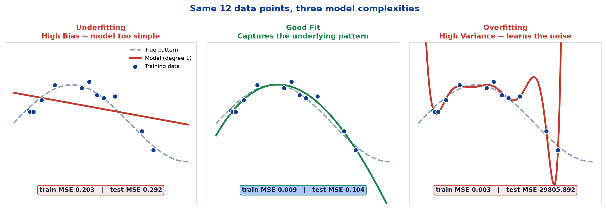
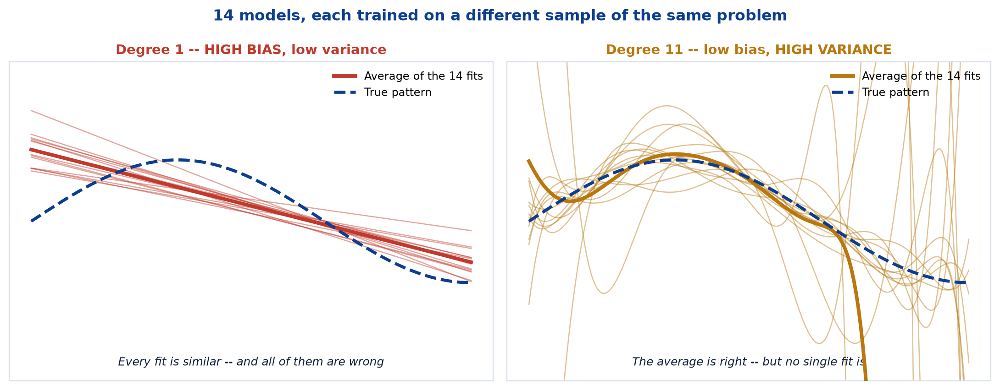
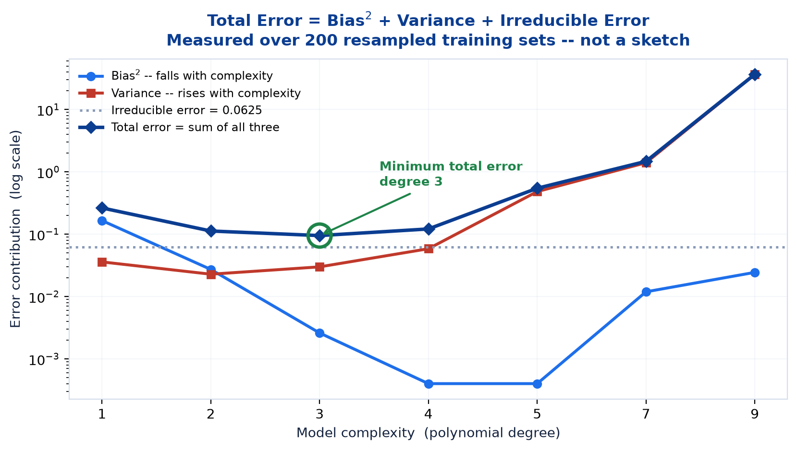
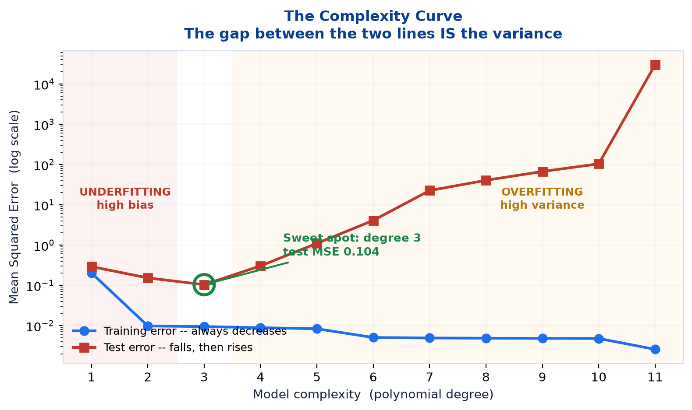
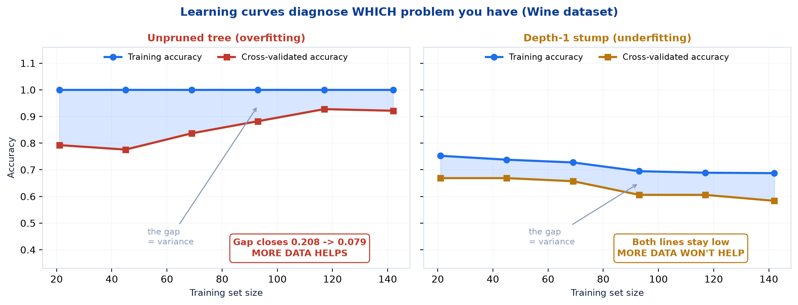

# <span style="color:#0B3D91">Overfitting, Underfitting &amp; Bias-Variance</span>

> Study notes on the central tension in machine learning — a model complex enough to capture the pattern, but not so complex that it memorises the noise. The two failure modes, the decomposition that explains them, how to diagnose which one you have, and the six practical fixes.
> The theory behind every "training accuracy 1.00, test accuracy 0.90" result in the previous five notes.

> **A note on formulas:** equations are written in plain text inside code blocks rather than LaTeX, so they render correctly in any Markdown viewer.

> **Where this sits:** Notes 01-05 kept bumping into the same phenomenon without naming it. The Wine tree scored 0.978 on one split but 0.899 cross-validated. The forest hit a perfect 1.000 that OOB revised to 0.970. Feature engineering produced a +2.2 point "win" that vanished across 20 splits. **All three are the same problem**, and this note is its theory.

---

## <span style="color:#1E6FEB">Table of Contents</span>

1. [The Core Problem: Generalization](#1-the-core-problem-generalization)
2. [Underfitting vs. Good Fit vs. Overfitting](#2-underfitting-vs-good-fit-vs-overfitting)
3. [Bias and Variance Defined](#3-bias-and-variance-defined)
4. [The Bias-Variance Trade-off](#4-the-bias-variance-trade-off)
5. [Diagnosing Which Problem You Have](#5-diagnosing-which-problem-you-have)
6. [How to Fix It — Practical Tips](#6-how-to-fix-it--practical-tips)
7. [Optimization &amp; Hyperparameter Search](#7-optimization--hyperparameter-search)
8. [Where We Have Already Seen This](#8-where-we-have-already-seen-this)

---

## <span style="color:#1E6FEB">1. The Core Problem: Generalization</span>

### 1.1 Overview / What is it?
Three definitions from slide 62 frame the whole topic:

> **Overfitting:** The model learns the training data **too well**, including noise and outliers. It performs well on training data but **poorly on unseen data**.
>
> **Underfitting:** The model is **too simple** to capture the underlying pattern. It performs **poorly on both** training and unseen data.
>
> **Optimization:** The process of tuning model/learning parameters and hyperparameters to achieve the best possible performance and generalization.

> **Key Takeaway** — The goal is to find the **right balance** — good fit on training data **and** good generalization on unseen data.

### 1.2 Why does it matter for AI?
This is the reason machine learning is harder than curve-fitting. Any model can be made to fit the data it has already seen — that is an exercise in memorisation, and a lookup table does it perfectly. The entire difficulty is performing well on data the model has **never seen**.

Note 01 §1.2 called this **generalization** and said it was the point of the whole field. This note explains what stops it working.

### 1.3 Key Concepts — the asymmetry of the two failures
Both are failures, but they feel completely different in practice:

| | Training performance | Test performance | How it feels |
|---|---|---|---|
| **Underfitting** | Poor | Poor | Obvious — nothing works |
| **Overfitting** | **Excellent** | Poor | **Dangerous — looks like success** |

**Underfitting announces itself.** Your accuracy is 60% and you know something is wrong.

**Overfitting flatters you.** Your training accuracy is 100%, you feel clever, and the failure only appears in production. Note 05's leakage discussion made the same point about a different bug — and the same defence applies: **be suspicious of results that look too good.**

### 1.4 Simple Example — the exam analogy
The cleanest way to hold these apart:

```
UNDERFITTING:  a student who skimmed the textbook once.
               Fails the practice questions, fails the real exam.

GOOD FIT:      a student who understood the concepts.
               Does well on practice questions AND on the real exam.

OVERFITTING:   a student who memorised the answers to last year's paper.
               Perfect on that paper. Lost when the questions change.
```

The overfitting student has not learned less than the good student — they have learned the **wrong thing**. They learned the specific answers instead of the underlying method, which is exactly what a model does when it memorises noise.

### 1.5 How it works — signal and noise
Real data contains two components:

```
observed value  =  signal  +  noise
                   ^^^^^^     ^^^^^
                   the real   random measurement error,
                   pattern    natural variation, luck
```

**The signal generalizes. The noise does not.** A model with too little capacity cannot capture even the signal (underfitting). A model with too much capacity captures the signal *and then keeps going*, fitting the noise as though it were real structure (overfitting).

Since the noise in your training set is unique to that sample, everything the model learned from it is worse than useless on new data.

### 1.6 Practical Example / Use Case
This is precisely why Note 01 §9.6 found that a depth-15 Wine tree was no better than a depth-3 tree. The extra 12 levels were not learning more about wine chemistry — they were carving the training set into ever-finer slices to accommodate individual quirky bottles.

```
depth 3:   train 0.993, test 0.978    <- learned the signal
depth 15:  train 1.000, test 0.978    <- learned the signal AND the noise
```

The perfect training score bought exactly nothing.

### 1.7 Key Takeaways
> - **Overfitting** = learns training data too well including **noise**; good on train, poor on unseen data.
> - **Underfitting** = **too simple** to capture the pattern; poor on **both**.
> - The goal is **balance**: good fit *and* good generalization.
> - **Underfitting is obvious; overfitting looks like success** — which makes it more dangerous.
> - Data = **signal + noise**. Signal generalizes; noise does not.
> - A perfect training score is a **warning**, not an achievement.

---

## <span style="color:#1E6FEB">2. Underfitting vs. Good Fit vs. Overfitting</span>

### 2.1 Overview / What is it?
The three-way comparison from slide 63.

| | Underfitting (High Bias) | Good Fit (Just Right) | Overfitting (High Variance) |
|---|---|---|---|
| **Model** | Too simple | Captures the underlying pattern | Too complex |
| **Training error** | **High** | **Low** | **Very low** |
| **Validation/test error** | **High** | **Low** | **High** |
| **Behaviour** | Misses the pattern | Right complexity | Learns noise and fluctuations |
| **Example** | Using a linear model for a non-linear problem | Appropriate model complexity | Very deep model / too many parameters |

### 2.2 Why does it matter for AI?
Two numbers — training error and test error — are enough to diagnose which regime you are in. That makes this one of the most immediately practical ideas in the module.

### 2.3 Key Concepts — seeing all three at once



I fitted polynomials of three different degrees to the same 12 noisy points drawn from a smooth curve:

| Panel | Degree | Train MSE | Test MSE | Diagnosis |
|---|---|---|---|---|
| **Left** | 1 | 0.203 | 0.292 | **Underfitting** — a straight line cannot bend |
| **Middle** | 3 | 0.009 | **0.104** | **Good fit** — tracks the true curve |
| **Right** | 11 | **0.003** | **29,805.892** | **Overfitting** — catastrophic |

**Look at the right-hand column.** The degree-11 model has the **best training error of the three** (0.003 — it passes almost exactly through every point) and a test error of nearly **thirty thousand**.

That is not a typo. With 12 data points and 12 coefficients, the polynomial can thread through every single one — and to do so it swings violently between them. Those swings are pure invention; the model is confidently wrong everywhere it was not given a point.

### 2.4 Simple Example — reading the two errors
The diagnostic table that follows from this:

```
Training error HIGH, test error HIGH   ->  UNDERFITTING (high bias)
Training error LOW,  test error LOW    ->  GOOD FIT
Training error LOW,  test error HIGH   ->  OVERFITTING (high variance)
Training error HIGH, test error LOW    ->  something is wrong with your setup
```

That fourth row should not happen. If it does, suspect a bug — a data leak in the wrong direction, a mismatched split, or an accidentally easier test set.

### 2.5 How it works — "too complex" is relative
There is no universally correct complexity. Degree 11 is absurd for 12 data points; on 10,000 points it might be perfectly reasonable.

```
Complexity that overfits  depends on:  how much DATA you have
                                       how much NOISE it contains
                                       how complex the TRUE pattern is
```

**The rule of thumb:** more data supports more complexity. That is why deep neural networks with millions of parameters work — they are trained on millions of examples. Point one at 12 rows and it will memorise them instantly.

### 2.6 Practical Example / Use Case
The vocabulary mapping is worth committing to memory, because the terms get used interchangeably:

```
Underfitting  ==  HIGH BIAS
Overfitting   ==  HIGH VARIANCE
```

Slide 63 puts these in the panel headings for exactly that reason. When somebody says *"the model is high-variance"*, they mean it is overfitting. Section 3 explains why those are the right names.

### 2.7 Key Takeaways
> - **Underfitting = high bias**: high training error, high test error.
> - **Good fit**: low training error, low test error.
> - **Overfitting = high variance**: very low training error, **high** test error.
> - Measured: degree 11 had the **best** train MSE (0.003) and a test MSE of **29,806**.
> - Two numbers — train error and test error — **diagnose the regime**.
> - "Too complex" is **relative** to data size, noise level, and true pattern complexity.

---

## <span style="color:#1E6FEB">3. Bias and Variance Defined</span>

### 3.1 Overview / What is it?
Two precise terms behind the informal words "too simple" and "too complex".

| Term | Definition | Plain English |
|---|---|---|
| **Bias** | Error from **wrong assumptions** in the model | *"This model is not flexible enough to represent the truth"* |
| **Variance** | Error from **sensitivity to the training data** | *"This model would look completely different on a different sample"* |

### 3.2 Why does it matter for AI?
These are the ideas that make the trade-off in section 4 comprehensible rather than a piece of memorised jargon.

### 3.3 Key Concepts — seeing both



I trained **14 separate models** on 14 different samples from the same underlying problem, and overlaid the results:

**Left panel — degree 1 (high bias, low variance).** All 14 straight lines look nearly identical. They are **consistent**. They are also all **wrong** — a straight line simply cannot represent a curve, no matter which sample you give it. Their average is wrong too.

**Right panel — degree 11 (low bias, high variance).** The 14 curves swing wildly, each chasing the noise in its own particular sample. But notice their **average** (the thick line) tracks the true pattern closely.

That contrast is the entire concept:

```
HIGH BIAS:      consistently wrong    -> averaging does NOT help
HIGH VARIANCE:  wrong in RANDOM ways  -> averaging DOES help
```

### 3.4 Simple Example — the archery analogy
The standard picture, and it holds up well:

| | Low variance | High variance |
|---|---|---|
| **Low bias** | Tight cluster **on** the bullseye — ideal | Scattered **around** the bullseye — right on average |
| **High bias** | Tight cluster in the **wrong place** — consistently off | Scattered **and** off-centre — worst case |

**Bias = are you aiming at the right spot?**
**Variance = how much do your shots scatter?**

### 3.5 How it works — why this justifies Random Forest
The right-hand panel above is a picture you have already seen. Note 02 §1.5 showed twelve noisy predictions whose average tracked the truth, and called it the justification for ensembles.

Now it has a name:

> **Random Forest works because deep trees are low-bias, high-variance.** Their errors point in random directions, so averaging cancels them. That is *only* possible because the errors are variance, not bias.

And the converse explains why bagging 200 shallow stumps would be pointless — averaging 200 consistently-wrong models gives you one consistently-wrong model.

```
Bagging (Random Forest)  -> attacks VARIANCE  -> needs low-bias base models
Boosting (XGBoost)       -> attacks BIAS      -> uses weak, high-bias base models
```

Note 02 §2.3 stated that bagging reduces variance and boosting reduces bias. **This is why.**

### 3.6 Practical Example / Use Case — typical positions

| Model | Bias | Variance |
|---|---|---|
| Linear Regression | **High** | Low |
| Logistic Regression | **High** | Low |
| Shallow Decision Tree | High | Low |
| **Deep Decision Tree** | Low | **High** |
| KNN with large K | High | Low |
| KNN with K = 1 | Low | **High** |
| **Random Forest** | Low | **Low** — the point of it |

Random Forest occupies the desirable corner: it keeps the low bias of deep trees while averaging away their variance. That is not free — it costs interpretability and compute, as Note 02 §7 set out — but it is a genuinely good trade.

### 3.7 Key Takeaways
> - **Bias** = error from wrong assumptions — the model **cannot** represent the truth.
> - **Variance** = error from sensitivity to the training sample — the model **changes** with the data.
> - **High bias = consistently wrong.** **High variance = wrong in random directions.**
> - Averaging fixes **variance**, never bias — which is exactly why **bagging works**.
> - Deep trees are **low-bias, high-variance**; that is what makes them ideal forest members.
> - **Random Forest achieves low bias AND low variance** — the point of the algorithm.

---

## <span style="color:#1E6FEB">4. The Bias-Variance Trade-off</span>

### 4.1 Overview / What is it?
> As model complexity increases, **training error always decreases**; validation error **first decreases, then increases** as the model starts memorizing noise.

The decomposition (slide 64):

```
Total Error = Bias^2 + Variance + Irreducible Error
```

### 4.2 Why does it matter for AI?
It explains *why* there is a sweet spot rather than a "more complexity is better" rule. Two error sources move in **opposite directions** as complexity rises, so their sum has a minimum somewhere in the middle.

### 4.3 Key Concepts — the three terms

| Term | What it is | Can you reduce it? |
|---|---|---|
| **Bias²** | Error from the model being too rigid | **Yes** — use a more flexible model |
| **Variance** | Error from sensitivity to the sample | **Yes** — more data, simpler model, regularization, ensembles |
| **Irreducible Error** | Noise inherent in the data itself | **No** — never, by any means |

**That third term is the humbling one.** Some error cannot be removed by any model, because the data genuinely does not contain the information. If two wines have identical chemistry but different cultivars, no algorithm can separate them.

### 4.4 Simple Example — the decomposition, measured



Rather than sketch the textbook curve, I measured it: 200 resampled training sets per complexity level, with noise fixed at σ = 0.25 so the irreducible error is exactly 0.25² = 0.0625.

| Degree | Bias² | Variance | Irreducible | **Total** |
|---|---|---|---|---|
| 1 | **0.1654** | 0.0359 | 0.0625 | 0.2638 |
| 2 | 0.0272 | 0.0228 | 0.0625 | 0.1125 |
| **3** | 0.0026 | 0.0299 | 0.0625 | **0.0950** ← minimum |
| 4 | 0.0004 | 0.0584 | 0.0625 | 0.1213 |
| 5 | 0.0004 | 0.4825 | 0.0625 | 0.5454 |
| 7 | 0.0119 | 1.4005 | 0.0625 | 1.4749 |
| 9 | 0.0244 | **36.6429** | 0.0625 | 36.7298 |

**Read the two middle columns as a pair.** Bias² collapses from 0.165 to 0.0004 as the model gains flexibility — then variance explodes from 0.036 to **36.6**. The total bottoms out at degree 3.

*(The decomposition is exact: Bias² + Variance reproduced the measured MSE to four decimal places at every degree.)*

### 4.5 How it works — training error is not the target



The two curves behave completely differently:

| Degree | Train MSE | Test MSE |
|---|---|---|
| 1 | 0.2035 | 0.2922 |
| 2 | 0.0098 | 0.1532 |
| **3** | 0.0095 | **0.1039** ← best |
| 4 | 0.0089 | 0.3048 |
| 6 | 0.0051 | 4.0920 |
| 8 | 0.0049 | 40.5893 |
| 11 | **0.0026** | **29,805.89** |

**Training error decreases monotonically forever.** It is *guaranteed* to — a more flexible model can always fit the training points at least as well. This is the single most important consequence:

> **Training error can never tell you when to stop.** It always votes for more complexity. Only held-out data can identify the sweet spot.

Every "use cross-validation" instruction in this module traces back to this fact.

### 4.6 Practical Example / Use Case
Note also **the gap between the two curves is the variance**, made visible. At degree 3 the gap is 0.094; at degree 11 it is roughly 29,806. When you look at a training/validation curve, that vertical distance is what you are managing.

This is why Note 01 §9.6 described the 1.000-vs-0.978 gap on the Wine tree as "the part the tree learned that does not generalise". That was variance, named informally before we had the vocabulary.

### 4.7 Key Takeaways
> - `Total Error = Bias² + Variance + Irreducible Error`.
> - **Bias² falls** with complexity; **variance rises**. Their sum has a **minimum**.
> - **Irreducible error cannot be removed** by any model — it is noise in the data.
> - Measured: bias² 0.165 → 0.0004 while variance 0.036 → **36.6**; total minimised at degree 3.
> - **Training error always decreases** — it can never tell you when to stop.
> - **The gap between training and test curves is the variance.**

---

## <span style="color:#1E6FEB">5. Diagnosing Which Problem You Have</span>

### 5.1 Overview / What is it?
Before fixing anything, work out which failure you are looking at — the cures are **opposites**, so guessing wrong makes things worse.

### 5.2 Why does it matter for AI?
Apply the overfitting cure (simplify) to an underfitting model and it gets worse. Apply the underfitting cure (add complexity) to an overfitting model and it also gets worse. **Diagnosis first.**

### 5.3 Key Concepts — the learning curve
A **learning curve** plots training and validation performance against **training set size**. It is the single most informative diagnostic available.



I ran this on the Wine dataset with two deliberately broken models:

**Left — unpruned tree (overfitting):**

| Training size | Train accuracy | CV accuracy | **Gap** |
|---|---|---|---|
| 21 | 1.000 | 0.792 | **0.208** |
| 69 | 1.000 | 0.837 | 0.163 |
| 117 | 1.000 | 0.928 | 0.073 |
| 142 | 1.000 | 0.921 | **0.079** |

**The gap closes as data arrives** — 0.208 down to 0.079. The two curves are converging, which means **more data would help further**.

**Right — depth-1 stump (underfitting):**

| Training size | Train accuracy | CV accuracy | **Gap** |
|---|---|---|---|
| 21 | 0.752 | 0.669 | 0.084 |
| 69 | 0.728 | 0.657 | 0.071 |
| 142 | 0.687 | 0.584 | 0.104 |

**Both curves are low and flat.** The gap was never large, so there is no variance to remove. Worse, both lines **drift downward** — as more data arrives, the single split fits the growing set less and less well. **More data will not help at all.**

### 5.4 Simple Example — the diagnostic table

| Symptom | Diagnosis | Fix direction |
|---|---|---|
| Both errors **high**, curves **flat and close** | **Underfitting** | **Add** complexity |
| Train error **low**, test error **high**, **large gap** | **Overfitting** | **Reduce** complexity or add data |
| Both errors low, small gap | **Good fit** | Ship it |
| Gap still **closing** at maximum data | Overfitting, **but more data would help** | Collect more data |
| Gap **flat** at maximum data | More data will **not** help | Change the model instead |

That final distinction is worth real money. "Collect more data" is expensive; the learning curve tells you in advance whether it is worth doing.

### 5.5 How it works — a practical warning from building this
A genuine trap I hit while producing the figure above. My first run gave nonsense — cross-validated accuracy of **0.331** at small training sizes, barely above random for three classes.

The cause: `load_wine()` returns rows **sorted by class**. Scikit-learn's `learning_curve` takes the first *n* rows as its training subset, so the smallest subsets contained **only class 0**. The model never saw the other two cultivars.

```python
X, y = shuffle(X, y, random_state=RS)   # wine is sorted by class -- must shuffle
```

After shuffling, the same experiment gave the sensible 0.792 shown above.

**The lesson generalises:** always check whether your data arrives in a meaningful order. Sorted-by-class, sorted-by-date, and grouped-by-customer data all break naive splitting, and the symptom is a mysteriously terrible score rather than an error message.

### 5.6 Practical Example / Use Case
The quick version, without plotting anything:

```python
train_acc = model.score(X_train, y_train)
cv_acc    = cross_val_score(model, X, y, cv=5).mean()

gap = train_acc - cv_acc
```

```
train_acc low                ->  underfitting, regardless of gap
gap large (> ~0.10)          ->  overfitting
both high, gap small         ->  good fit
```

Note this uses **cross-validation**, not a single test split — because Note 01 §11.6 showed a single split reporting 0.978 when the honest figure was 0.899.

### 5.7 Key Takeaways
> - **Diagnose before fixing** — the two cures are opposites.
> - A **learning curve** plots train and validation performance against **training set size**.
> - **Overfitting:** large gap that **closes** with more data (measured: 0.208 → 0.079).
> - **Underfitting:** both curves **low and flat**; the gap was never the problem.
> - A **still-closing** gap means more data helps; a **flat** gap means it will not.
> - **Watch for sorted data** — `load_wine` is class-sorted and silently broke the curve until shuffled.

---

## <span style="color:#1E6FEB">6. How to Fix It — Practical Tips</span>

### 6.1 Overview / What is it?
The six fixes from slide 65.

| Fix | What it does |
|---|---|
| **More Data** | More data helps reduce **variance** (overfitting) |
| **Simplify Model** | Use simpler models, reduce depth or features |
| **Regularization** | Use L1 (Lasso) or L2 (Ridge) to penalize large weights |
| **Feature Engineering** | Use relevant features; remove noise and redundancy |
| **Cross-Validation** | Use k-fold CV to validate model stability |
| **Early Stopping** | Stop training when validation error starts increasing |

### 6.2 Why does it matter for AI?
Five of the six target **overfitting**. That imbalance is honest — overfitting is by far the more common problem in practice, because modern models are flexible and real datasets are finite.

### 6.3 Key Concepts — matching fix to diagnosis

| If you are **underfitting** | If you are **overfitting** |
|---|---|
| Use a **more complex** model | Use a **simpler** model |
| **Increase** tree depth | **Reduce** tree depth (pruning) |
| **Add** features (feature engineering) | **Remove** features (feature selection) |
| **Reduce** regularization | **Increase** regularization |
| Train longer | **Early stopping** |
| *(more data will not help)* | **Collect more data** |

**Nearly every row is a mirror image.** This is why section 5's diagnosis matters so much.

### 6.4 Simple Example — why more data fixes variance
Variance is the model's sensitivity to *which particular sample* it saw. More data dilutes the influence of any individual quirky point.

```
12 points:     one weird outlier can bend the whole curve
12,000 points: the same outlier is 0.008% of the data -- it gets outvoted
```

The learning curve in section 5.3 showed this happening: the unpruned tree's gap shrank from 0.208 to 0.079 purely from more rows. No change to the model at all.

**But it cannot fix bias.** A straight line fitted to a million points from a curve is still a straight line — still wrong, just more confidently wrong. That is exactly what the right-hand learning curve showed.

### 6.5 How it works — the six fixes in this module
Every one has already appeared:

| Fix | Where we met it |
|---|---|
| **More Data** | Section 5.3's learning curves |
| **Simplify Model** | Note 01 §9.5 — `max_depth`, `min_samples_split`, `min_samples_leaf` |
| **Regularization** | **Note 07** — L1/L2, coming next |
| **Feature Engineering** | Note 05 — and its selection half, §5 |
| **Cross-Validation** | Notes 01 §11.6, 02 §10.5, 05 §7 — repeatedly |
| **Early Stopping** | New here |

**Early stopping** applies to models trained iteratively (neural networks, gradient boosting). You monitor validation error each round and stop when it turns upward:

```
Round  Train error   Validation error
  10      0.42            0.45
  50      0.21            0.28
 100      0.12            0.22   <- validation error minimum
 150      0.06            0.25   <- rising: STOP, roll back to round 100
 200      0.02            0.31   <- memorising noise
```

It is the complexity curve from §4.5 traversed over training time rather than model size — and the same logic applies: **training error keeps falling; only validation error tells you to stop.**

### 6.6 Practical Example / Use Case — the ensemble fix
One important fix the slide omits: **use an ensemble.** Note 02 demonstrated it thoroughly — Random Forest attacks variance directly by averaging many high-variance trees.

Measured, from Note 02 §10.5:

```
Single Decision Tree, cross-validated:  0.899
Random Forest,        cross-validated:  0.977
```

That +7.8 point gain **is** variance reduction. It belongs on the list alongside the other six.

### 6.7 Key Takeaways
> - Six fixes: **more data, simplify, regularization, feature engineering, cross-validation, early stopping**.
> - **Five of the six target overfitting** — the more common problem.
> - The fixes are **mirror images**: add complexity for bias, remove it for variance.
> - **More data fixes variance, never bias.**
> - **Early stopping** halts training when validation error turns upward.
> - **Ensembles** deserve a place on the list — Wine: 0.899 → 0.977 cross-validated.

---

## <span style="color:#1E6FEB">7. Optimization &amp; Hyperparameter Search</span>

### 7.1 Overview / What is it?
> **Optimization:** The process of tuning model/learning **parameters and hyperparameters** to achieve the best possible performance and generalization.

> **Common Optimization Techniques** — Grid Search • Random Search • Bayesian Optimization • Gradient Descent — evaluated with Accuracy, Precision/Recall, F1-Score, ROC-AUC, or RMSE/MAE.

### 7.2 Why does it matter for AI?
Sections 4 and 5 established that a sweet spot exists. This is how you find it systematically rather than by guessing.

### 7.3 Key Concepts — parameters vs hyperparameters
A distinction the slide runs together, and it matters:

| | **Parameters** | **Hyperparameters** |
|---|---|---|
| Set by | **The training process** | **You**, before training |
| Examples | Regression coefficients, split thresholds | `max_depth`, `n_estimators`, `K`, `learning_rate` |
| Found via | **Gradient descent** / the fitting algorithm | **Grid search**, random search |

```
Parameters      = what the model LEARNS
Hyperparameters = what you CHOOSE before it starts learning
```

Every complexity dial in this module has been a **hyperparameter**: `max_depth` (Note 01), `n_estimators` (Note 02), `K` (Note 03). Each one moves you along the bias-variance curve, which is why tuning them is the practical face of this whole topic.

### 7.4 Simple Example — grid vs random search

**Grid Search** tries every combination on a grid:

```python
param_grid = {"max_depth": [2, 3, 4, 5], "min_samples_leaf": [1, 2, 4]}
# 4 x 3 = 12 combinations, each cross-validated
```

**Random Search** samples combinations at random from ranges you specify.

| | Grid Search | Random Search |
|---|---|---|
| Coverage | Exhaustive over the grid | Random sample |
| Cost | **Explodes combinatorially** | You choose the budget |
| Best when | Few hyperparameters, small ranges | Many hyperparameters |

**The combinatorial problem is real.** Four hyperparameters with five values each is 625 combinations; at 5-fold CV that is **3,125 model fits**. Random search usually finds a near-equal configuration in a fraction of the time, because typically only one or two hyperparameters actually matter — and random search samples many distinct values of those, while grid search wastes effort on the ones that do not.

> **Bayesian Optimization** is named on the slide but not taught. In brief: it uses results so far to decide which configuration to try next, rather than sampling blindly. More efficient, more complex.

### 7.5 How it works — the critical rule
Hyperparameter search must be validated on data the model has not seen:

```python
grid = GridSearchCV(DecisionTreeClassifier(), param_grid, cv=5)
grid.fit(X_train, y_train)
```

Note `cv=5` — every candidate is scored by **cross-validation**, not on training data. Score them on training data and you will pick the most complex option every single time, for exactly the reason in §4.5.

**A subtler trap:** if you tune hyperparameters against your test set and then report that same test score, the score is optimistic — you have effectively fitted to the test set. The clean approach uses **three** splits:

```
Training set    -> fit the model parameters
Validation set  -> choose the hyperparameters
Test set        -> measure final performance, ONCE
```

Cross-validation on the training set is the usual substitute for a separate validation set, which is what `GridSearchCV(cv=5)` does.

### 7.6 Practical Example / Use Case — gradient descent
The slide lists **Gradient Descent** alongside the search methods, but it is a different kind of thing: it optimises **parameters** during training, not hyperparameters around it.

```
Gradient Descent  ->  finds PARAMETERS (the weights inside the model)
Grid/Random Search ->  finds HYPERPARAMETERS (the settings around it)
```

Gradient descent is one of the topics the course promises and never delivers — the gap this note series picks up in **Note 08**.

### 7.7 Key Takeaways
> - **Parameters** are learned by training; **hyperparameters** are chosen by you beforehand.
> - `max_depth`, `n_estimators` and `K` are all **hyperparameters** controlling the bias-variance position.
> - **Grid Search** is exhaustive but explodes combinatorially; **Random Search** is usually more efficient.
> - **Bayesian Optimization** is named but not taught.
> - Always score candidates with **cross-validation**, never training data.
> - Tuning on the test set and then reporting it gives an **optimistic** result — keep a final untouched test set.
> - **Gradient descent tunes parameters, not hyperparameters** — a different job.

---

## <span style="color:#1E6FEB">8. Where We Have Already Seen This</span>

### 8.1 Overview / What is it?
This note is the theory for phenomena the previous five notes kept encountering. Collecting them makes the pattern unmistakable.

### 8.2 Why does it matter for AI?
Seeing the same effect arrive five separate times, in five different contexts, is more convincing than any single demonstration.

### 8.3 Key Concepts — the running tally

| Note | Observation | What it was |
|---|---|---|
| **01** §9.6 | Wine tree: depth 3 test 0.978, depth 15 test 0.978 — but training hits 1.000 | Extra depth bought **pure variance** |
| **01** §11.6 | Single split **0.978**, cross-validated **0.899** | The split was **lucky** |
| **02** §1.5 | 12 noisy predictions whose average tracks the truth | **Variance cancelling** |
| **02** §10.5 | Tree CV **0.899** vs Forest CV **0.977** | Ensemble **variance reduction** |
| **02** §10.4 | Forest test accuracy **1.000**, OOB **0.970**, CV **0.977** | Single-split **optimism** |
| **05** §7.5 | FE "win" of +2.2 points vanished across 20 splits | **Noise** mistaken for signal |

**Six observations, one underlying cause.**

### 8.4 Simple Example — the unpruned tree, revisited
Note 01 §9.5 ran a pruning experiment that refused to prove its point:

| | Unpruned | Pruned (depth 4) |
|---|---|---|
| Training accuracy | 1.000 | 1.000 |
| Test accuracy | 0.978 | 0.978 |

At the time, the honest conclusion was *"Wine is small and clean, so even the unpruned tree does not overfit badly on this split."*

Section 5.3's learning curve adds the missing evidence. The unpruned tree's **gap of 0.208 at small sample sizes** shows it was overfitting substantially — the single 75/25 split just happened not to reveal it. **The learning curve saw what the single split hid.**

### 8.5 How it works — why cross-validation kept appearing
Every note has insisted on cross-validation. Now the reason is precise:

```
A single train/test split gives ONE sample of your model's performance.
That sample has VARIANCE.
Cross-validation averages over k splits -> a lower-variance estimate.
```

Cross-validation applies the exact idea from §3.5 — averaging cancels random error — to **performance measurement** rather than prediction. Same principle, different target.

### 8.6 Practical Example / Use Case
The practical habits that follow from all of this:

1. **Never report a single-split score** without a cross-validated figure beside it.
2. **Treat perfect training accuracy as a warning**, not an achievement.
3. **Check the train/test gap**, not just the test score.
4. **Plot a learning curve** before paying to collect more data.
5. **Be suspicious of improvements** smaller than your cross-validation standard deviation.

That last one would have caught Note 05's false positive immediately: a +1.1 point CV difference against a standard deviation of ±0.03-0.05 is not a result.

### 8.7 Key Takeaways
> - **Six separate observations** across Notes 01-05 were all bias-variance effects.
> - Note 01's inconclusive pruning experiment **was** overfitting — the learning curve proved it.
> - **Cross-validation reduces the variance of your performance estimate** — the same averaging principle.
> - Never report a single split alone; **always check the train/test gap**.
> - **Ignore improvements smaller than your CV standard deviation.**

---

## <span style="color:#1E6FEB">Summary — Overfitting, Underfitting &amp; Bias-Variance at a Glance</span>

| | Underfitting | Overfitting |
|---|---|---|
| **Also called** | **High bias** | **High variance** |
| **Model is** | Too simple | Too complex |
| **Training error** | High | **Very low** |
| **Test error** | High | High |
| **Learning curve** | Both curves low and flat | Large gap that closes with data |
| **More data helps?** | **No** | **Yes** |
| **Fix** | Add complexity, add features, reduce regularization | Simplify, prune, regularize, ensemble, early stopping |
| **Feels like** | Obvious failure | **Success** |

```
Total Error = Bias^2 + Variance + Irreducible Error
```

| Term | Direction as complexity rises | Removable? |
|---|---|---|
| **Bias²** | Falls | Yes |
| **Variance** | Rises | Yes |
| **Irreducible** | Flat | **Never** |

**The one-sentence version:** training error always falls with complexity while test error falls then rises, so the job is finding the middle — and only held-out data can tell you where it is.

**Where this leads:** section 6 listed **regularization** as a fix and immediately deferred it. It is the one technique on that list we have not met, and it works by a genuinely clever mechanism — penalising complexity inside the training objective itself, so the model trades a little training accuracy for a lot of generalization. **Note 07** covers L1, L2, and cross-validation properly.

---

> **Navigation:** ← Previous: [05 — Feature Engineering](05_Machine_Learning_Feature_Engineering.md) · Next → 07 — Regularization &amp; Cross-Validation
>
> **Related:** [Decision Trees](01_Machine_Learning_Decision_Trees.md) §9 (pruning), [Random Forest](02_Machine_Learning_Random_Forest_And_Ensembles.md) §1-2 (why ensembles reduce variance), and [Model Evaluation Metrics (Session I)](../../machine_learning_01/notes/03_Machine_Learning_Model_Evaluation_Metrics.md) §overfitting.
