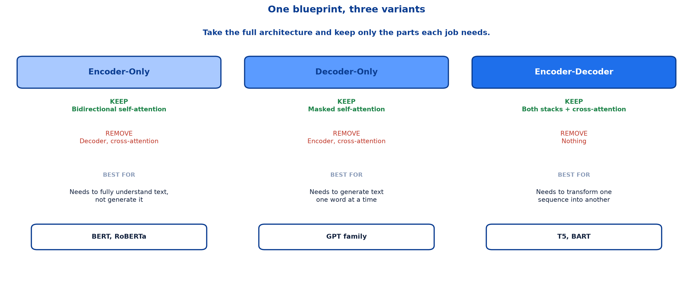
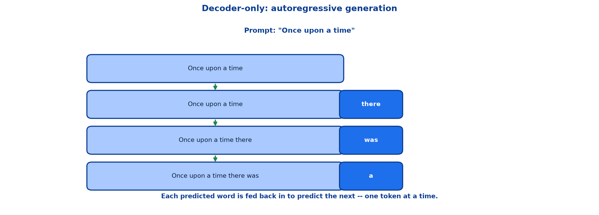
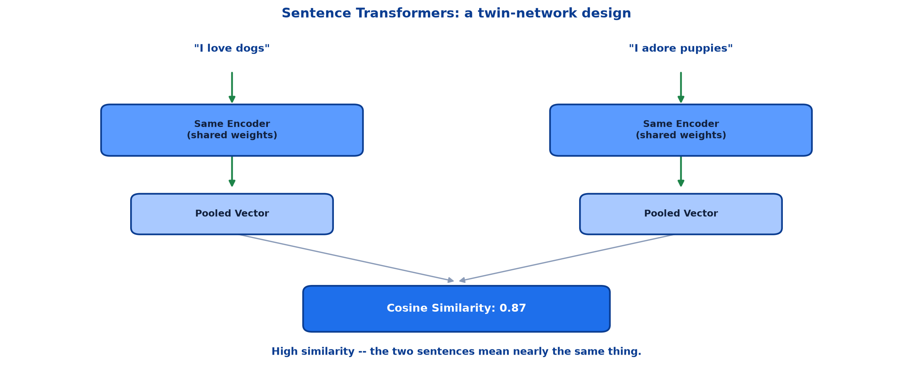
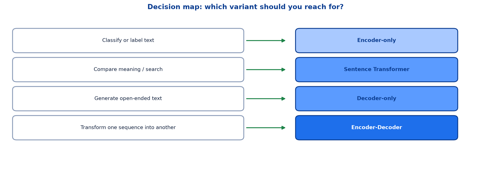

# <span style="color:#0B3D91">Transformer Variants &amp; Model Choice</span>

> Study notes on the payoff of the whole architecture:
> **one blueprint, three variants** → **encoder-only** → **decoder-only** →
> **encoder-decoder** → **Sentence Transformers** → **the decision map** →
> **the full recap**.
>
> **A note on formulas:** patterns and pipelines are written in plain text inside code blocks
> rather than LaTeX, so they render correctly in any Markdown viewer.

---

## <span style="color:#1E6FEB">Table of Contents</span>

1. [One Blueprint, Three Variants](#1-one-blueprint-three-variants)
2. [Encoder-Only: Understanding Text](#2-encoder-only-understanding-text)
3. [Decoder-Only: Generating Text](#3-decoder-only-generating-text)
4. [Encoder-Decoder: Transforming Text](#4-encoder-decoder-transforming-text)
5. [Sentence Transformers — A Specialized Adaptation](#5-sentence-transformers--a-specialized-adaptation)
6. [Decision Map — Which Variant Should You Reach For?](#6-decision-map--which-variant-should-you-reach-for)
7. [Recap — One Blueprint, Many Capabilities](#7-recap--one-blueprint-many-capabilities)

---

## <span style="color:#1E6FEB">1. One Blueprint, Three Variants</span>

### 1.1 Overview / What is it?

**Take the full architecture and keep only the parts each job needs.**



### 1.2 Why does it matter for AI?

The previous two notes built one architecture with an encoder, a decoder, self-attention,
cross-attention and everything else. Almost no real model uses all of it. This note explains why —
and which subset to reach for.

### 1.3 Key Concepts

| Variant | Keep | Remove | Best for | Examples |
|---|---|---|---|---|
| **Encoder-only** | Bidirectional self-attention | Decoder, cross-attention | Needs to fully understand text, not generate it | BERT, RoBERTa |
| **Decoder-only** | Masked self-attention | Encoder, cross-attention | Needs to generate text one word at a time | GPT family |
| **Encoder-Decoder** | Both stacks + cross-attention | Nothing | Needs to transform one sequence into another | T5, BART |

### 1.4 Simple Example

Notice the pattern: each variant is defined by what it **removes**, not what it adds. The full
architecture from note 08 is the superset; every real model is a deliberate subtraction from it.

### 1.5 How it works

This is a direct consequence of what each attention type does. Bidirectional self-attention is for
*understanding* an already-complete sentence. Masked self-attention is for *generating* one word at
a time without cheating by looking ahead. Cross-attention is for *consulting* a separately-understood
input while producing something new. A task rarely needs all three purposes at once.

### 1.6 Practical Example / Use Case

Before reaching for a specific pretrained model, ask: am I labelling/understanding text, generating
open-ended text, or transforming one sequence into a different one? That single question already
narrows the choice to one of the three families.

### 1.7 Key Takeaways

> - Three variants, one shared blueprint: encoder-only, decoder-only, encoder-decoder.
> - Each is defined by what it **removes** from the full architecture.
> - **Encoder-only**: understand. **Decoder-only**: generate. **Encoder-Decoder**: transform.
> - Examples: BERT/RoBERTa, GPT family, T5/BART respectively.

---

## <span style="color:#1E6FEB">2. Encoder-Only: Understanding Text</span>

### 2.1 Overview / What is it?

**Reads in Both Directions.** An encoder-only model sees the entire sentence at once — left context
and right context together — which makes it excellent at understanding meaning.

### 2.2 Why does it matter for AI?

```text
"This movie was fantastic"
        context flows both ways
```

Bidirectionality is the whole point. When judging whether "fantastic" is positive, the model can
look both backward at "movie" and forward at whatever follows — nothing is hidden.

### 2.3 Key Concepts

```text
Classification head -> Positive (98%)
```

A small extra layer on top turns the encoder's understanding into a label. The heavy lifting —
understanding the sentence — was already done by the pretrained encoder; the classification head is
comparatively tiny and cheap to train.

### 2.4 Simple Example — typical use cases

| Task | Question it answers |
|---|---|
| **Sentiment classification** | "Was this review positive or negative?" |
| **Spam / topic detection** | "Is this email spam? What category?" |
| **Named entity recognition** | "Which words are people, places, dates?" |
| **Question answering (extractive)** | "Find the answer span in this passage." |

### 2.5 How it works

**Example model: BERT** (Bidirectional Encoder Representations from Transformers). BERT is
pretrained by masking random words in a sentence and asking the model to predict them using both
left and right context — a training objective that only makes sense because the architecture can see
in both directions.

### 2.6 Practical Example / Use Case

Extractive QA is worth pausing on: the model does not *generate* an answer. It marks a **start** and
**end** position within the given passage — a classification task at the token level, which is
exactly what a bidirectional encoder is built for.

### 2.7 Key Takeaways

> - Encoder-only models read the **entire** sequence at once — full bidirectional context.
> - A small classification head converts understanding into a label.
> - Strong at sentiment, spam/topic detection, NER, extractive QA.
> - **BERT** is pretrained via masked-word prediction, which requires bidirectional context.

---

## <span style="color:#1E6FEB">3. Decoder-Only: Generating Text</span>

### 3.1 Overview / What is it?

**Only Looks Backward.** A causal mask blocks each word from seeing anything ahead of it. The model
must predict the next word using only what came before.



### 3.2 Why does it matter for AI?

This is the mechanism behind every chat model and code assistant you have used. Understanding it
demystifies a large chunk of "how does ChatGPT work?"

### 3.3 Key Concepts

```text
Prompt: "Once upon a time"

Once upon a time
Once upon a time there
Once upon a time there was
Once upon a time there was a
```

**Each predicted word is fed back in to predict the next — one token at a time.**

### 3.4 Simple Example

This process is called **autoregressive generation**: "auto" because the model conditions on its own
previous output, "regressive" in the statistical sense of predicting the next value from prior ones.

### 3.5 How it works — typical use cases

| Task | Prompt example |
|---|---|
| **Open-ended text generation** | "Write a short story about a lighthouse." |
| **Conversational assistants** | "Answer my question in a helpful way." |
| **Code generation** | "Write a Python function to sort a list." |
| **Autocomplete** | "Suggest how to finish this sentence." |

### 3.6 Practical Example / Use Case

**Example model: GPT** (Generative Pre-trained Transformer). Its pretraining objective is simply
next-word prediction on huge amounts of text — the causal mask from note 08's decoder is not an
afterthought here, it **is** the entire training signal.

Every generation step also re-runs the whole computation on the growing sequence, which is why
longer outputs cost more and why generation speed is a first-class engineering concern for these
models.

### 3.7 Key Takeaways

> - Decoder-only models use a **causal mask** — no peeking at future tokens.
> - Generation is **autoregressive**: each new word feeds back in as input.
> - Strong at open-ended generation, chat, code, autocomplete.
> - **GPT**'s pretraining objective is exactly next-word prediction.

---

## <span style="color:#1E6FEB">4. Encoder-Decoder: Transforming Text</span>

### 4.1 Overview / What is it?

**Read Fully, Then Generate.** The encoder reads and understands the entire input first. The decoder
then generates the output step by step, using cross-attention to consult the encoder's understanding.

### 4.2 Why does it matter for AI?

Neither pure understanding nor pure generation is enough when the task is genuinely translating one
sequence into a *different* one — a different language, a shorter summary, a different format.

### 4.3 Key Concepts

```text
"How are you?"              Encoder reads (English)
        |
   cross-attention
        |
"Comment ca va?"             Decoder generates (French)
```

**The two sides can even use different vocabularies and lengths.**

### 4.4 Simple Example

This is the architecture from note 08, used exactly as originally designed — no parts removed. The
"variant" here is really "the full blueprint, unmodified," which is itself worth noticing: the
original Transformer was built for translation.

### 4.5 How it works — typical use cases

| Task | Example |
|---|---|
| **Machine translation** | "Translate this paragraph into French." |
| **Summarization** | "Condense this article into 3 sentences." |
| **Question answering (generative)** | "Answer this in your own words." |
| **Data-to-text generation** | "Turn this table into a written report." |

### 4.6 Practical Example / Use Case

**Example models: T5, BART.** Contrast generative QA here with extractive QA in section 2: an
encoder-only model can only point at a span already present in the passage, while an encoder-decoder
model can compose a fresh sentence that never appeared verbatim in the source.

### 4.7 Key Takeaways

> - The encoder-decoder reads fully, then generates step by step via cross-attention.
> - Input and output can differ in language, length and vocabulary.
> - Strong at translation, summarization, generative QA, data-to-text.
> - This is the **full** original Transformer blueprint — the only variant that removes nothing.

---

## <span style="color:#1E6FEB">5. Sentence Transformers — A Specialized Adaptation</span>

### 5.1 Overview / What is it?

**Encoder-Only, Reworked for Similarity.** Raw BERT was not specifically trained to produce sentence
embeddings optimized for semantic similarity. Sentence Transformers fix this with a "twin network"
design.



### 5.2 Why does it matter for AI?

This is a genuinely important nuance: not every encoder-only use case is served well by *raw* BERT.
Comparing meaning between two whole sentences needs a model specifically trained for that comparison.

### 5.3 Key Concepts — how it compares two sentences

```text
"I love dogs"              "I adore puppies"
      |                            |
 Same Encoder                Same Encoder
(shared weights)            (shared weights)
      |                            |
 Pooled Vector                Pooled Vector
      \___________  ___________/
                   \/
        Cosine Similarity: 0.87
```

**High similarity — the two sentences mean nearly the same thing.**

### 5.4 Simple Example

The word "twin" is literal: it is the **same** encoder with the **same** weights run twice, once per
sentence — not two different models. That shared-weight design is what guarantees the two pooled
vectors live in a comparable space.

### 5.5 How it works — why not just use BERT directly?

Raw BERT embeddings cluster together oddly, making similarity comparisons unreliable and slow at
scale. BERT's pretraining objective (masked word prediction) never explicitly taught it "these two
whole sentences are similar" — that is a different skill, requiring different fine-tuning.

### 5.6 Practical Example / Use Case — where this shines

```text
- Semantic search
- Clustering similar documents
```

Recall cosine similarity from the embeddings note: this is that exact same mechanism, now applied to
whole-sentence vectors instead of single-word vectors.

### 5.7 Key Takeaways

> - Sentence Transformers are encoder-only models **reworked** for similarity, via a twin network.
> - The same encoder with shared weights processes both sentences.
> - Pooled vectors are compared with **cosine similarity**.
> - Raw BERT embeddings are unreliable for sentence-level similarity — this is why the adaptation exists.

---

## <span style="color:#1E6FEB">6. Decision Map — Which Variant Should You Reach For?</span>

### 6.1 Overview / What is it?

A direct task-to-architecture lookup.



### 6.2 Key Concepts

| If your task is... | Reach for... |
|---|---|
| Classify or label text | **Encoder-only** |
| Compare meaning / search | **Sentence Transformer** |
| Generate open-ended text | **Decoder-only** |
| Transform one sequence into another | **Encoder-Decoder** |

### 6.3 Simple Example

```text
"Is this review positive or negative?"        -> Encoder-only
"Find documents similar to this one"           -> Sentence Transformer
"Write me a product description"               -> Decoder-only
"Translate this into Spanish"                  -> Encoder-Decoder
```

### 6.4 Why does it matter for AI?

This table is the single most actionable artifact in the whole Transformers topic. Model selection
mistakes are common precisely because it's tempting to reach for whichever architecture is currently
most famous (usually a decoder-only LLM) regardless of task fit.

### 6.5 Practical Example / Use Case

A decoder-only model *can* be coaxed into classification by prompting it to output a label as text —
and often works reasonably well. But an encoder-only model fine-tuned for the task is typically
smaller, faster, and more reliable for that narrow job. Bigger and more general is not automatically
better for a well-defined task.

### 6.6 Key Takeaways

> - Four task categories map directly onto four model choices.
> - Classify → encoder-only. Compare → Sentence Transformer. Generate → decoder-only. Transform → encoder-decoder.
> - Fit the architecture to the task rather than defaulting to the most famous model.

---

## <span style="color:#1E6FEB">7. Recap — One Blueprint, Many Capabilities</span>

### 7.1 Overview / What is it?

**The same self-attention building block, arranged differently, produces fundamentally different
capabilities.**

### 7.2 Key Concepts — full comparison

| | Encoder-only | Decoder-only | Encoder–Decoder |
|---|---|---|---|
| **Attention type** | Bidirectional | Causal (masked) | Both + cross-attention |
| **Sees future tokens?** | Yes | No | Encoder: yes / Decoder: no |
| **Typical objective** | Masked word prediction | Next-word prediction | Sequence-to-sequence |
| **Great at** | Understanding & classifying | Generating fluent text | Transforming text |
| **Example models** | BERT, RoBERTa | GPT family | T5, BART |

### 7.3 Simple Example

Read the "Sees future tokens?" row carefully — it is the single structural fact that explains
everything else in the table. Bidirectional visibility enables understanding; blocking it forces
honest generation; the encoder-decoder needs both, in different halves.

### 7.4 How it works

Every cell in this table traces back to one design decision made in note 08: which sublayers to keep,
and whether self-attention is masked. Three architectures, one shared vocabulary of parts.

### 7.5 Practical Example / Use Case

This recap closes the architecture arc that began with "why do we need Transformers?" back in note
07: recurrence was replaced by attention, attention was assembled into encoder and decoder stacks,
and those stacks are now selectively recombined into the three variants that cover essentially every
modern NLP task.

### 7.6 Key Takeaways

> - Encoder-only, decoder-only and encoder-decoder are the same building blocks, arranged differently.
> - Bidirectional vs causal attention is the key structural distinction.
> - Understanding, generating and transforming map cleanly onto the three variants.
> - One architecture, three shapes, nearly the full landscape of NLP capability.

---

## <span style="color:#1E6FEB">Summary — Transformer Variants at a Glance</span>

```text
Encoder-only     -> bidirectional      -> understand / classify
Decoder-only     -> causal (masked)    -> generate
Encoder-Decoder  -> both + cross-attn  -> transform
Sentence Transf. -> encoder-only, twin -> compare meaning
```

| Term | Meaning |
|---|---|
| Encoder-only | Bidirectional self-attention only; understands text |
| Decoder-only | Masked self-attention only; generates text autoregressively |
| Encoder-Decoder | Both stacks plus cross-attention; transforms sequences |
| Bidirectional attention | Can see both left and right context |
| Causal mask | Blocks a position from seeing future tokens |
| Autoregressive generation | Each output token feeds back in to produce the next |
| Extractive QA | Answer is a span pointed to within the given passage |
| Generative QA | Answer is composed freely, possibly not present verbatim |
| Sentence Transformer | Encoder-only model fine-tuned with a twin network for similarity |
| Twin network | Same encoder, shared weights, run once per input to compare |
| Decision map | Task-to-architecture lookup table |

**The one-sentence version:** The same Transformer building blocks — self-attention, cross-attention,
feed-forward, residuals — get selectively kept or removed to produce three purpose-built variants:
encoder-only for understanding, decoder-only for generating, and encoder-decoder for transforming one
sequence into another, with Sentence Transformers as a specialised encoder-only adaptation for
comparing meaning.

**Where this leads:** the final note walks through Demo 2 — a live application of every variant
covered here: classification, QA, NER, fill-mask, semantic similarity, generation, summarization,
translation, zero-shot classification, and Vision Transformers.

---

> **Navigation:** ← Previous: [08 — Transformer Architecture](08_NLP_Transformers_Architecture.md) · Next → 10 — Demo 2: Transformer Applications
